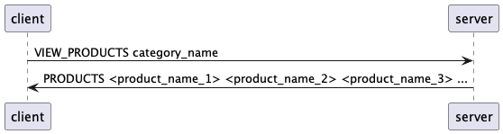
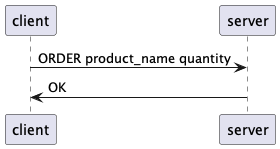
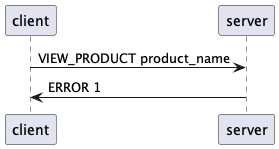

# Évaluation

Cette évaluation porte sur les notions suivantes :

- Définir un protocol applicatif
- SMTP et Telnet
- SSH et SCP
- Programmation TCP avec Java

Vous pouvez répondre aux questions en français ou en anglais.

L'évaluation est séparée en deux parties :

1. Une partie théorique de 35 minutes durant laquelle vous n'avez droit qu'à une
   feuille de résumé (recto)
2. Une partie pratique sur l'ordinateur durant laquelle vous avez droit à
   absolument tout sauf une aide humaine extérieure

Toute tentative de tricherie sera sanctionnée avec la note 1.

## Partie théorique (35 points)

### Question 1 (15 minutes - 16 points)

Vous travaillez pour une entreprise spécialisée dans la vente de produits en
ligne. L'entreprise a décidé de créer un nouveau service de commandes en ligne
pour sa clientèle.

Le service permet à la clientèle de visualiser et de commander des produits en
ligne.

Les produits sont identifiés par un nom, une description, une catégorie, un prix
et une quantité en stock.

Ces produits peuvent être visualisés individuellement ou par catégorie. Les
catégories sont identifiées par un nom et une description.

Une commande peut être effectuée pour un produit. La commande est identifiée par
le nom du produit et la quantité commandée. La quantité commandée doit être
inférieure ou égale à la quantité en stock.

Vous devez définir un protocole applicatif pour ce nouveau service.

Définissez le protocole applicatif selon la structure qui a été vue dans le
cours. Dans le contexte de ce test, deux exemples sont attendus (un fonctionnel
et un qui engendre une erreur) uniquement.

<details>
<summary>Afficher la réponse</summary>

# Protocole Achat'instant

## Section 1 - Aperçu (1 point)

Le protocole Achat'instant est un protocole applicatif qui permet à un client de
visualiser et de commander des produits en ligne.

## Section 2 - Protocole de transport (2 points)

Le protocole Achat'instant utilise le protocole TCP (0.5 point) pour assurer le
transport des données. Le serveur s'exécute sur le port 6343 (0.5 point).

La connexion initiale doit se faire par le client (0.5 point).

Une fois la connexion établie, le client peut envoyer une commande au serveur.

Si la commande est valide, le serveur exécute la commande et envoie une réponse
au client. Si la commande n'est pas valide, le serveur envoie un message
d'erreur au client. Le client peut décider de couper la connexion à tout moment.
Ceci engendre la fermeture de la connexion côté serveur de façon automatique.
(0.5 point)

## Section 3 - Messages (11 points)

Les messages envoyés par le client et le serveur sont des messages textes (0.5
point) encodés en UTF-8 (0.5 point). Les messages envoyés par le client sont
sous la forme suivante :

### Visualiser les catégories

#### Message (1 point)

```text
VIEW_CATEGORIES
```

#### Réponse (1 points)

- `CATEGORIES <category_name_1> <category_name_2> <category_name_3> ...`: la
  liste des catégories disponibles. Les catégories sont séparées par des
  espaces.

### Visualiser les produits

#### Message (1 point)

```text
VIEW_PRODUCTS category_name
```

- `category_name`: le nom de la catégorie de produits à visualiser

#### Réponse (1 points)

- `PRODUCTS <product_name_1> <product_name_2> <product_name_3> ...`: la liste
  des produits disponibles pour la catégorie donnée. Les produits sont séparés
  par des espaces.
- `ERROR <code>`: une erreur est survenue lors de la visualisation des produits.
  Le code d'erreur est un entier entre 1 et 2 inclus. Les codes d'erreur sont
  les suivants :
  - 1: la catégorie n'existe pas
  - 2: la catégorie ne contient aucun produit

### Visualiser un produit

#### Message (1 point)

```text
VIEW_PRODUCT product_name
```

- `product_name`: le nom du produit à visualiser

#### Réponse (1 points)

- `PRODUCT <product_name> <product_description> <product_category> <product_price> <product_quantity>`:
  les informations du produit
- `ERROR <code>`: une erreur est survenue lors de la visualisation du produit.
  Le code d'erreur est un entier entre 1 et 1 inclus. Les codes d'erreur sont
  les suivants :
  - 1: le produit n'existe pas

### Commander un produit

#### Message (1 point)

```text
ORDER product_name quantity
```

- `product_name`: le nom du produit à commander
- `quantity`: la quantité du produit à commander

#### Réponse (1 point)

- `OK`: la commande a été effectuée avec succès
- `ERROR <code>`: une erreur est survenue lors de la commande du produit. Le
  code d'erreur est un entier entre 1 et 3 inclus. Les codes d'erreur sont les
  suivants :
  - 1: le produit n'existe pas
  - 2: la quantité demandée est supérieure à la quantité en stock
  - 3: la quantité demandée est inférieure ou égale à 0

### Commande invalide

#### Message (1 point)

```text
INVALID_COMMAND
```

#### Réponse (1 point)

- `INVALID_COMMAND`: la commande est invalide

## Section 4 - Exemples (2 points)

Voici des diagrammes PlantUML pour illustrer les exemples de messages.

### Visualiser les catégories


### Visualiser les produits



### Visualiser un produit


### Commander un produit



### Commande invalide


Voici des diagrammes PlantUML pour illustrer les exemples de messages lorsque
des erreurs surviennent.

### Erreur lors de la visualisation des produits


### Erreur lors de la visualisation d'un produit



### Erreur lors de la commande d'un produit


</details>

### Question 2 (3 minutes - 3 points - 3 x 1 point)

Décrivez avec vos propres mots la différence entre les protocoles SMTP, POP3 et
IMAP.

<details>
<summary>Afficher la réponse</summary>

Le protocole SMTP est utilisé pour envoyer des courriels (1 point). Le protocole
POP3 est utilisé pour récupérer des courriels (1 point). Le protocole IMAP est
utilisé pour synchroniser des courriels entre plusieurs appareils (1 point).

</details>

### Question 3 (5 minutes - 5 points - 5 x 1 point)

Par quel protocole peut-on se connecter à un serveur distant ? Quelle marche à
suivre est-il nécessaire de suivre pour se connecter sur celui-ci sans devoir
entrer un mot de passe à chaque fois ?

Répondez avec vos propres mots.

<details>
<summary>Afficher la réponse</summary>

On peut se connecter à un serveur distant avec le protocole SSH (1 point). Pour
se connecter sans devoir entrer un mot de passe à chaque fois, il faut utiliser
une paire de clés SSH. (1 point)

En générant une paire de clés SSH, on obtient une clé privée et une clé
publique. La clé privée doit être gardée secrète (1 point) et la clé publique
peut être partagée avec d'autres personnes (1 point).

La clé publique doit être ajoutée sur le serveur distant dans le fichier
`~/.ssh/authorized_keys`. (1 point) Lorsque l'on se connecte au serveur distant,
le serveur va vérifier si la clé publique utilisée pour la connexion se trouve
dans le fichier `~/.ssh/authorized_keys`. Si c'est le cas, la connexion est
acceptée.

</details>

### Question 4 (5 minutes - 4 points - 8 x 0.5 point)

Alice souhaite envoyer un email à Bob. Schématisez le cheminement de l'email
depuis la boîte de réception d'Alice jusqu'à la boîte de réception de Bob.
Indiquez au moins les acteurs et les protocoles impliqués dans ce scénario.

<details>
<summary>Afficher la réponse</summary>


</details>

### Question 5 (3 minutes - 3 points - 6 x 0.5 point)

Affirmations sur les sockets, vrai au faux ?

- Un socket est un point de communication entre deux machines
- Un socket client est un socket qui écoute sur un port
- Si un service tourne sur le port 80, il est possible démarrer un socket server
  sur ce même port
- Les sockets gèrent la concurrence par défaut
- Un socket client est identifié uniquement par un port
- Lors de la création d'un socket, il est toujours nécessaire de définir
  l'encodage avec lequel les données seront envoyées et reçues

<details>
<summary>Afficher la réponse</summary>

- Vrai
- Faux
- Faux
- Faux
- Faux
- Faux

</details>

## Partie pratique

### Question (25 minutes - 30 points)

Vous devez développer un client et un serveur TCP en Java pour le protocole
Up-Down.

Le protocole application est décrit ci-dessous et doit être implémenté dans son
intégralité.

Pour la réalisation du client et du serveur, vous devez créer deux fichiers Java
:

- `Client.java`
- `Server.java`

Ces deux fichiers sont à compiler avec `javac` et à exécuter avec `java`, selon
la marche à suivre suivante :

```sh
# Compilation
javac Client.java
javac Server.java

# Execution
java Client
java Server
```

Le code source de ces deux fichiers doit être envoyé par email aux adresses
`ludovic.delafontaine@heig-vd.ch` et `hadrien.louis@heig-vd.ch` une fois
l'évaluation terminée dans un délai de 5 minutes.

Vous avez droit à tous les outils et supports habituels utilisés dans le cours
sauf à une aide humaine extérieure. Il n'est pas autorisé non plus de
retranscrire la consigne de cet exercice dans un outil d'assistance artificiel
(ChatGPT, Copilot, etc.).

#### Exemple d'exécution

```txt
> java Client
Quel est le mot à convertir ?
antépénultième
Quel est le type de conversion (UP / DOWN) ?
UP
Le mot converti est : ANTÉPÉNULTIÈME

Process finished with exit code 0
```

#### Code snippets

Les snippets suivants peuvent vous être utiles pour la réalisation de cet
exercice.

##### Récupérer la saisie utilisatrice

Afin de récupérer la saisie utilisatrice, vous pouvez utiliser le code source
suivant :

```java
import java.util.Scanner;

// ...

Scanner scanner = new Scanner(System.in);

String line = scanner.nextLine();
```

##### Splitter une chaîne de caractères

Afin de séparer une chaîne de caractères en plusieurs parties, vous pouvez
utiliser le code source suivant :

```java
String line = "John Doe"
String[] parts = line.split(" ");
System.out.println(parts[0]); // John
System.out.println(parts[1]); // Doe
```

##### Comparer des chaînes de caractères

Afin de comparer deux chaînes de caractères, vous pouvez utiliser le code source
suivant :

```java
String line = "John Doe"
if ("John Doe".equalsIgnoreCase(line)) {
    System.out.println("Les deux chaînes sont identiques");
}
```

#### Protocole applicatif

##### Section 1 - Aperçu

Le protocole Up-Down est un protocole applicatif qui permet de convertir un mot
en majuscules ou en minuscules.

Le protocole Up-Down est composé d'un client et d'un serveur. Le client recupère
une saisie utilisatrice et envoie une requête au serveur avec un mot à convertir
et le serveur lui répond avec le mot converti.

Le serveur doit pouvoir gérer plusieurs clients en parallèle.

##### Section 2 - Protocole de transport

Le protocole Up-Down utilise le protocole TCP pour assurer le transport des
données. Le serveur s'exécute sur le port 6343.

La connexion initiale doit se faire par le client.

Une fois la connexion établie, le client peut envoyer ses messages.

Si le message est valide, le serveur exécute la commande et envoie une réponse
au client. Si le message n'est pas valide, le serveur envoie un message d'erreur
au client.

##### Section 3 - Messages

Les messages envoyés par le client et le serveur sont des messages textes. Les
messages envoyés par le client sont sous la forme suivante :

Tous les messages sont encodés en UTF-8 et se terminent par un caractère de
nouvelle ligne (`\n`).

###### Up

**Message**

```text
UP word
```

- `word`: le mot à convertir en majuscules

**Réponse**

- `RESULT <word>`: le mot converti en majuscules

###### Down

**Message**

```text
DOWN word
```

- `word`: le mot à convertir en minuscules

**Réponse**

- `RESULT <word>`: le mot converti en minuscules

###### Message invalide

**Message**

```text
ERROR 1
```

<details>
<summary>Afficher la réponse</summary>

```java
// Server.java
import java.io.*;
import java.net.ServerSocket;
import java.net.Socket;
import java.nio.charset.StandardCharsets;
import java.util.concurrent.ExecutorService;
import java.util.concurrent.Executors;

public class Server {
    private static final int PORT = 6343;
    private static final int NUMBER_OF_THREADS = 2;

    public static void main(String[] args) {
        ExecutorService executor = null;

        // 1 point pour le try-with-resources (+ finally)
        try (ServerSocket serverSocket = new ServerSocket(PORT)) { // 1 point
            executor = Executors.newFixedThreadPool(NUMBER_OF_THREADS); // 1 point

            System.out.println("Server is running...");

            while (true) { // 1 point
                Socket clientSocket = serverSocket.accept(); // 1 point
                executor.submit(new ClientHandler(clientSocket)); // 1 point
            }
        } catch (IOException e) {
            e.printStackTrace();
        } finally {
            if (executor != null) {
                executor.shutdown();
            }
        }
    }

    static class ClientHandler implements Runnable {
        private final Socket socket;

        public ClientHandler(Socket socket) {
            this.socket = socket;
        }

        @Override
        public void run() {
            // 1 point pour le try-with-resources
            try (
                socket;
                BufferedReader in = new BufferedReader(
                    new InputStreamReader(
                        socket.getInputStream(),
                        StandardCharsets.UTF_8 // 1 point
                    )
                ); // 1 point
                BufferedWriter out = new BufferedWriter(
                    new OutputStreamWriter(
                        socket.getOutputStream(),
                        StandardCharsets.UTF_8 // 1 point
                    )
                ) // 1 point
            ) {
                String clientMessage = in.readLine();

                // Traiter la commande du client
                String[] parts = clientMessage.split(" ");
                String command = parts[0]; // 1 point

                switch (command) { // 1 point
                    case "UP":
                        out.write("RESULT " + parts[1].toUpperCase() + "\n"); // 1 point
                        break;
                    case "DOWN":
                        out.write("RESULT " + parts[1].toLowerCase() + "\n"); // 1 point
                        break;
                    default:
                        // Commande non reconnue
                        out.write("ERROR\n");
                        break;
                }
                out.flush(); // 1 point
            } catch (IOException e) {
                e.printStackTrace();
            }
        }
    }
}
```

```java
// Client.java
import java.io.*;
import java.net.Socket;
import java.nio.charset.StandardCharsets;
import java.util.Scanner;

public class Client {
    private static final String HOST = "localhost";
    private static final int PORT = 6343;

    public static void main(String[] args) {
        // 1 point pour le try-with-resources
        try (
            Socket socket = new Socket(HOST, PORT); // 1 point
            BufferedReader in = new BufferedReader(
                new InputStreamReader(socket.getInputStream(), StandardCharsets.UTF_8) // 1 point
            ); // 1 point
            BufferedWriter out = new BufferedWriter(
                new OutputStreamWriter(socket.getOutputStream(), StandardCharsets.UTF_8) // 1 point
            ); // 1 point
        ) {
            Scanner scanner = new Scanner(System.in);
            System.out.println("Quel est le mot à convertir ?");
            String word = scanner.nextLine(); // 1 point

            System.out.println("Quel est le type de conversion (UP / DOWN) ?");
            String type = scanner.nextLine(); // 1 point

            switch (type) { // 1 point
                case "UP":
                    out.write("UP " + word + "\n");
                    break;
                case "DOWN":
                    out.write("DOWN " + word + "\n");
                    break;
                default:
                    System.out.println("Type de conversion invalide");
                    return;
            }
            out.flush(); // 1 point

            // Recevoir la réponse du serveur
            String validateResponse = in.readLine();
            String[] parts = validateResponse.split(" ");
            String message = parts[0]; // 1 point

            switch (message) { // 1 point
                case "RESULT":
                    System.out.println("Le mot converti est : " + parts[1]); // 1 point
                    break;
                case "ERROR":
                    if (parts[1].equals("1"))
                        System.out.println("Message invalide"); // 1 point
                    break;
            }

        } catch (IOException e) {
            e.printStackTrace();
        }
    }
}
```

</details>
