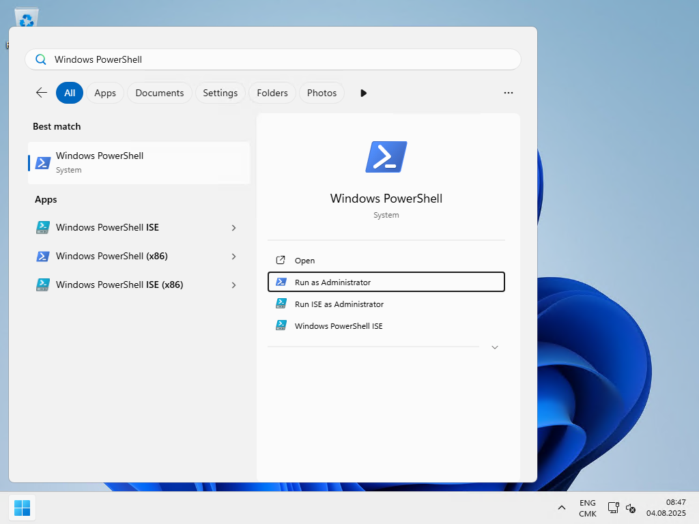
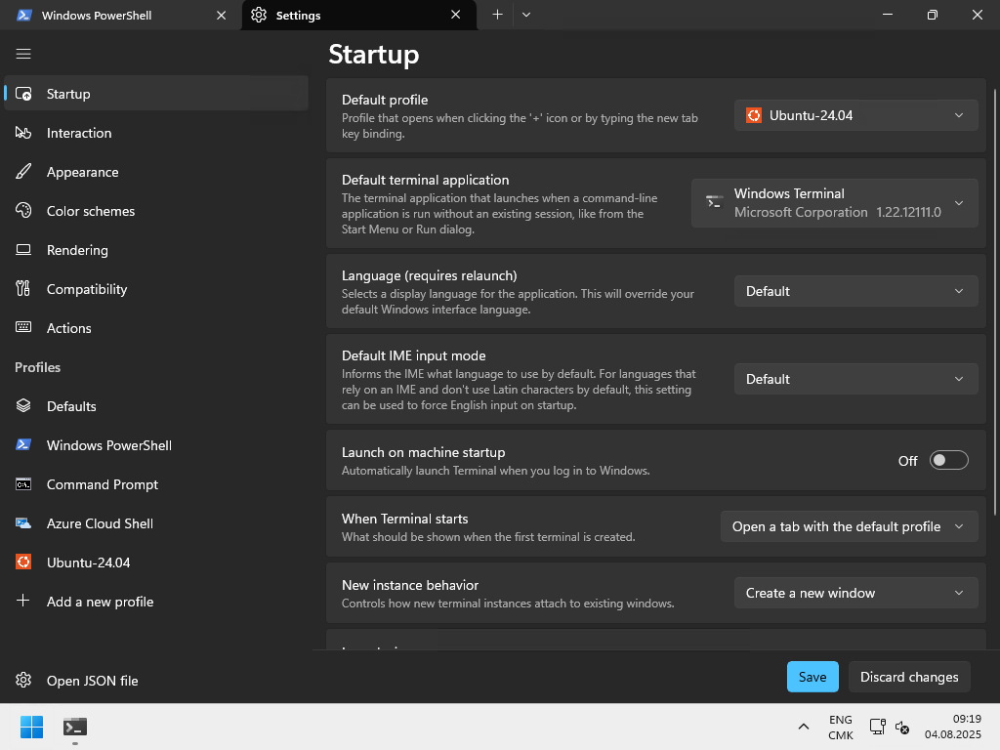
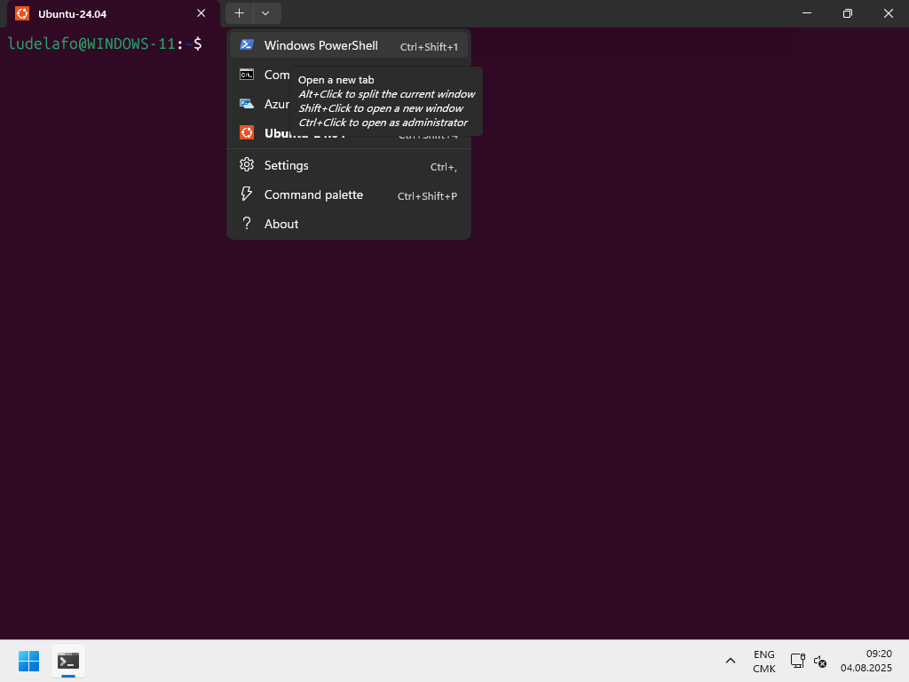
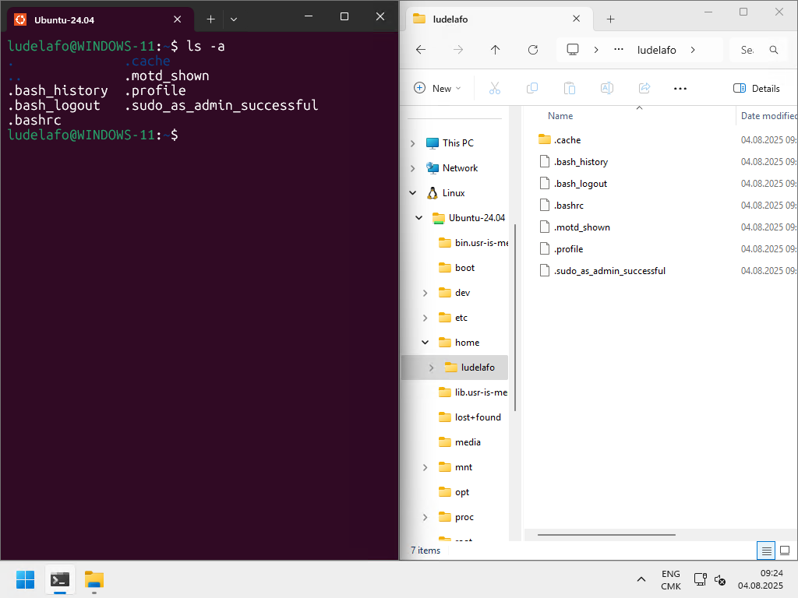
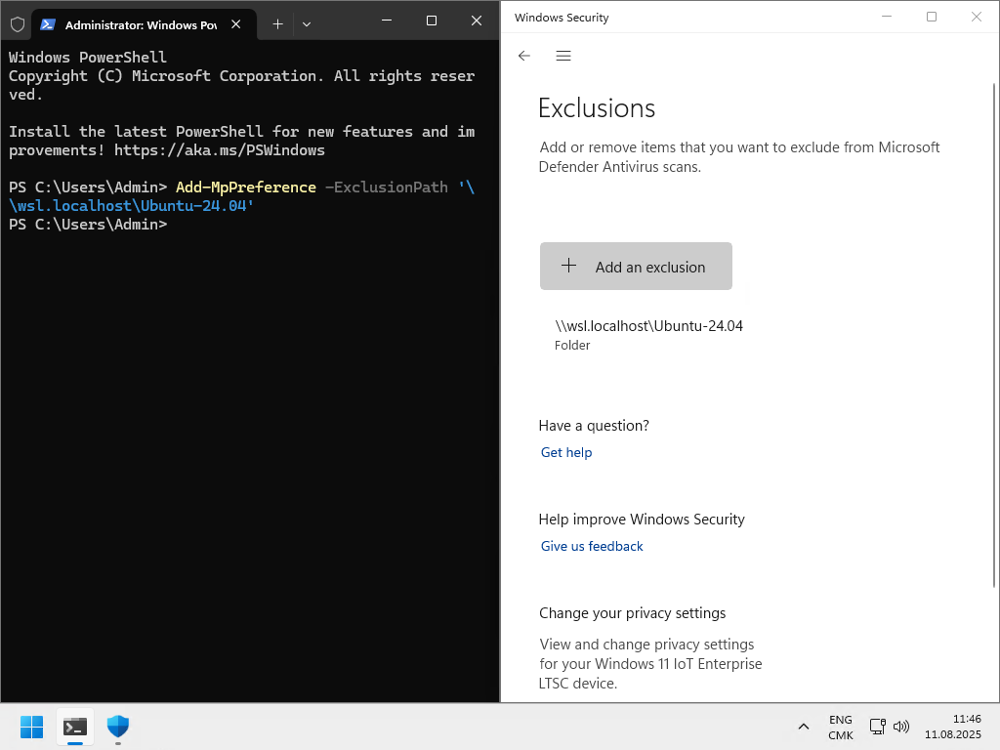
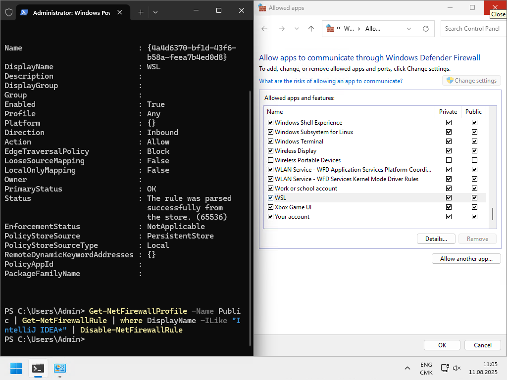
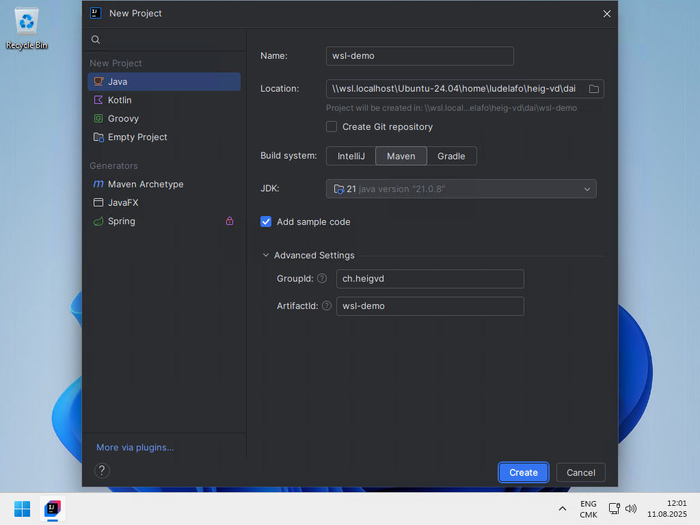
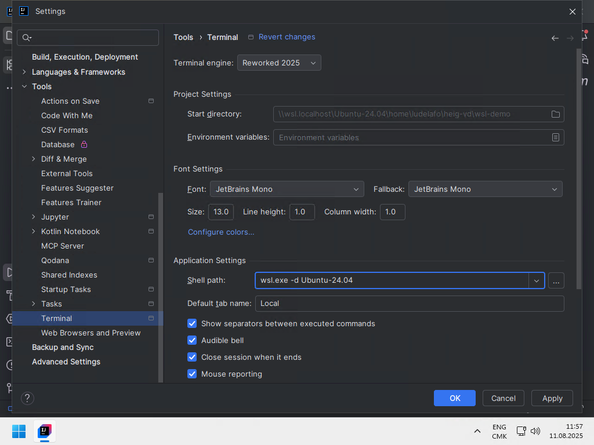

# Set up a Windows development environment

L. Delafontaine and H. Louis, with the help of
[GitHub Copilot](https://github.com/features/copilot).

This work is licensed under the [CC BY-SA 4.0][license] license.

## Resources

- Objectives, teaching and learning methods, and evaluation methods:
  [Link to content](..)
- Course material: [Link to content](../01-course-material/README.md)

## Table of contents

- [Resources](#resources)
- [Table of contents](#table-of-contents)
- [Introduction](#introduction)
- [Update Windows](#update-windows)
- [Install and configure Windows Subsystem for Linux (WSL)](#install-and-configure-windows-subsystem-for-linux-wsl)
  - [Install WSL](#install-wsl)
  - [Update WSL](#update-wsl)
  - [Install a Linux distribution](#install-a-linux-distribution)
  - [Update Ubuntu](#update-ubuntu)
  - [Getting familiar with Linux](#getting-familiar-with-linux)
- [Install and configure Windows Terminal](#install-and-configure-windows-terminal)
  - [Install Windows Terminal](#install-windows-terminal)
  - [Configure Windows Terminal](#configure-windows-terminal)
- [Accessing your files in WSL from Windows and from Ubuntu](#accessing-your-files-in-wsl-from-windows-and-from-ubuntu)
- [Exclude WSL from your antivirus software](#exclude-wsl-from-your-antivirus-software)
  - [Exclude WSL from Windows Defender](#exclude-wsl-from-windows-defender)
- [Check the _Considerations for a development environment_ guide](#check-the-considerations-for-a-development-environment-guide)
- [Validate the installation](#validate-the-installation)
- [Install and configure your Integrated Development Environment (IDE)](#install-and-configure-your-integrated-development-environment-ide)
  - [Install and configure IntelliJ IDEA to access WSL](#install-and-configure-intellij-idea-to-access-wsl)
- [Tips and tricks](#tips-and-tricks)
  - [Do not manipulate your files from the File Explorer on Windows](#do-not-manipulate-your-files-from-the-file-explorer-on-windows)
  - [Free up disk space](#free-up-disk-space)
- [Troubleshooting](#troubleshooting)
  - [Check your Windows build number](#check-your-windows-build-number)
  - [Check for Windows updates](#check-for-windows-updates)
  - [Check if all required Windows features are enabled](#check-if-all-required-windows-features-are-enabled)
  - [Enable virtualization](#enable-virtualization)

## Introduction

> [!NOTE]
>
> This guide is meant for people who are using Windows as their primary
> operating system. If you have a Linux or macOS computer, you can skip this
> guide and go straight to the
> [Check the _Considerations for a development environment guide_](#check-the-considerations-for-a-development-environment-guide)
> section.

The HEIG-VD recommends Windows for your studies. This is mostly because other
departments heavily rely on Windows-only products.

From our experience, software development on Windows can be more difficult than
Linux or macOS.

This guide will help you to set up a Linux environment on your Windows computer
to be able to follow this teaching unit (and beyond).

This guide is inspired from the following sources:

- [How to install Linux on Windows with WSL by Microsoft](https://learn.microsoft.com/windows/wsl/install)
- [Set up a WSL development environment by Microsoft](https://learn.microsoft.com/en-us/windows/wsl/setup/environment)

If you have any issues with the below guide, check the
[Troubleshooting](#troubleshooting) section. Feel free to ask for help if you
have issues but please, try the [Troubleshooting](#troubleshooting) section
before coming to us.

## Update Windows

Before starting the installation of the development environment, make sure that
your Windows installation is up to date.

You can check for updates by going to **Settings > Update & Security > Windows
Update**.

Install any available updates and restart your computer if necessary.

You can now continue with the installation of the development environment.

Do note that the support for Windows 10 version ends on October 14, 2025. You
should consider upgrading to Windows 11 or Linux if you are still using
Windows 10.

If you have trouble upgrading to Windows 11, come see the teaching staff. We
might have some solutions for you.

## Install and configure Windows Subsystem for Linux (WSL)

This section will guide you through the process of installing and configuring
Windows Subsystem for Linux (WSL) on your Windows installation.

### Install WSL

Windows Subsystem for Linux (called _"WSL"_) is a compatibility layer for
running Linux binary executables natively on Windows. It is a very useful tool
for developers who want to use Linux tools and utilities on Windows.

To install WSL, search _"**PowerShell**"_ in the Start menu, right-click on it,
and select _"**Run as administrator**"_ as shown in the following screenshot:



Then, run the following command in the terminal:

> [!IMPORTANT]
>
> If the following command displays the help message, proceed to the next
> section.

```powershell
# Install WSL without specifying a distribution
wsl --install --no-distribution
```

The output should be similar to this:

```text
Downloading: Windows Subsystem for Linux 2.5.9
Installing: Windows Subsystem for Linux 2.5.9
Windows Subsystem for Linux 2.5.9 has been installed.
Installing Windows optional component: VirtualMachinePlatform

Deployment Image Servicing and Management tool
Version: 10.0.26100.1150

Image Version: 10.0.26100.4770

Enabling feature(s)
[==========================100.0%==========================]
The operation completed successfully.
The requested operation is successful. Changes will not be effective until the system is rebooted.
The operation completed successfully.
```

Restart your computer once the installation is complete.

### Update WSL

Computers can be shipped with WSL version 1 or 2. WSL version 2 is the latest
version and is recommended. It provides better performance and more features
than version 1.

As WSL can still be in version 1, you must update it to version 2.

To do so, open PowerShell as administrator as shown in the previous section and
run the following command in the terminal:

```powershell
# Check for WSL updates
wsl --update --web-download
```

If there are updates available, you will be prompted to download and install
them.

Set the WSL default version to 2 by running the following command in the
terminal:

```powershell
# Set WSL default version to 2
wsl --set-default-version 2
```

The output should be similar to this:

```text
For information on key differences with WSL 2 please visit https://aka.ms/wsl2
The operation completed successfully.
```

### Install a Linux distribution

WSL supports multiple Linux distributions. You can check the available
distributions by running the following command in the terminal:

```powershell
# List available Linux distributions
wsl --list --online
```

The output should be similar to this:

```text
The following is a list of valid distributions that can be installed.
Install using 'wsl.exe --install <Distro>'.

NAME                            FRIENDLY NAME
AlmaLinux-8                     AlmaLinux OS 8
AlmaLinux-9                     AlmaLinux OS 9
AlmaLinux-Kitten-10             AlmaLinux OS Kitten 10
AlmaLinux-10                    AlmaLinux OS 10
Debian                          Debian GNU/Linux
FedoraLinux-42                  Fedora Linux 42
SUSE-Linux-Enterprise-15-SP6    SUSE Linux Enterprise 15 SP6
SUSE-Linux-Enterprise-15-SP7    SUSE Linux Enterprise 15 SP7
Ubuntu                          Ubuntu
Ubuntu-24.04                    Ubuntu 24.04 LTS
archlinux                       Arch Linux
kali-linux                      Kali Linux Rolling
openSUSE-Tumbleweed             openSUSE Tumbleweed
openSUSE-Leap-15.6              openSUSE Leap 15.6
Ubuntu-18.04                    Ubuntu 18.04 LTS
Ubuntu-20.04                    Ubuntu 20.04 LTS
Ubuntu-22.04                    Ubuntu 22.04 LTS
OracleLinux_7_9                 Oracle Linux 7.9
OracleLinux_8_10                Oracle Linux 8.10
OracleLinux_9_5                 Oracle Linux 9.5
```

You can then install a Linux distribution of your choice from the above list. We
recommend installing Ubuntu if you are not familiar with Linux as it is a very
user-friendly distribution and is widely used. All commands in this teaching
unit will be run in Ubuntu.

Using the list of available you have on your computer, identify the latest
Ubuntu distribution available. In this example, the latest Ubuntu distribution
is `Ubuntu-24.04`. **Yours might be more recent**.

> [!IMPORTANT]
>
> Install the latest version of Ubuntu available in **your** list. The version
> `Ubuntu-24.04` is the latest version at the time of writing this guide, but
> yours might be more recent. Install the latest version available in **your**
> list by replacing `<latest-version>` with the version you have in your list.
>
> **Do not install the `Ubuntu` distribution without a version number**. It
> might install an older version of Ubuntu. Always use the versioned
> distribution name.

```powershell
# Install Ubuntu
wsl --install --distribution Ubuntu-<latest-version>
```

Once the installation is complete, you can set up a username and password for
the Ubuntu distribution.

> [!TIP]
>
> While setting up your password, **it is expected that you will not see any
> characters on the screen**. This is a security feature of the terminal. Even
> though you do not see the characters you type (e.g., `p@ssw0rd`), they are
> still being entered. Make sure to remember your password as you will need it
> later.

We recommend using the same username and password as your Windows account for
simplicity.

Once you have set up your username and password, Ubuntu will be started, and you
will be able to run Linux commands in the terminal.

The output should be similar to this:

```text
Downloading: Ubuntu 24.04 LTS
Installing: Ubuntu 24.04 LTS
Distribution successfully installed. It can be launched via 'wsl.exe -d Ubuntu-24.04'
Launching Ubuntu-24.04...
Provisioning the new WSL instance Ubuntu-24.04
This might take a while...
Create a default Unix user account: ludelafo
New password:
Retype new password:
passwd: password updated successfully
To run a command as administrator (user "root"), use "sudo <command>".
See "man sudo_root" for details.

ludelafo@WINDOWS-11:/mnt/c/WINDOWS/system32$
```

### Update Ubuntu

Before starting the installation of the development environment, make sure that
your Ubuntu installation is up to date. You can update Ubuntu by running the
following commands in the terminal. You might need to enter your password when
running the commands:

> [!TIP]
>
> The `sudo` command is used to run commands with superuser privileges. You will
> be prompted to enter your password when running a command with `sudo`.
>
> This is a security feature of Linux to prevent unauthorized access to the
> system.

> [!TIP]
>
> All Linux distributions come with a package manager that is used to install,
> update, and remove packages. The package manager for Ubuntu is called `apt`.
>
> The package manager uses a package list to know which packages are available
> for installation. You can then install any package from the package list using
> the package manager.
>
> If you are interested to have a package manager for Windows, you can check
> [WinGet](https://learn.microsoft.com/windows/package-manager/),
> [Chocolatey](https://chocolatey.org/) or [Scoop](https://scoop.sh/).
>
> These package managers are not required for this teaching unit but can be
> useful if you want to easily install and update packages on Windows as you
> would on Linux.

```sh
# Update the package list
sudo apt update

# Upgrade the installed packages
sudo apt upgrade
```

Press `y` when prompted to confirm the upgrade.

All packages will be upgraded to the latest version.

### Getting familiar with Linux

As you will use WSL as your primary development environment for the rest of the
teaching unit, it is important to get familiar with Linux commands and how to
manage your files in WSL.

You can run Linux commands in the Ubuntu terminal. Here are some basic commands
to get you started:

```sh
# List files and directories
ls

# Change directory
cd <directory>

# Switch to parent directory
cd ..

# Print the working directory
pwd

# Create an empty file
touch <file>

# Remove a file
rm <file>

# Create a directory
mkdir <directory>

# Remove a directory
rm -r <directory>

# Copy a file
cp <source> <destination>

# Copy a directory
cp -r <source> <destination>

# Move a file
mv <source> <destination>

# Display the help for a command
man <command>

# Print the content of a file
cat <file>

# Print the content of a file with pagination
less <file>

# Exit the Ubuntu terminal
exit
```

Take some time to familiarize yourself with these commands. You can find more
information about these commands by running `man <command>` in the terminal.

WSL is now installed and configured on your Windows machine. You can use it to
run Linux commands and utilities on Windows.

## Install and configure Windows Terminal

### Install Windows Terminal

Windows comes pre-installed with a terminal application called _"**Command
Prompt**"_.

It is a very basic terminal application that does not support many features that
are available in modern terminal applications. Microsoft has developed a new
terminal application called Windows Terminal that is available for Windows 10+
users.

The Windows Terminal is a new, modern, fast, efficient, powerful, and productive
terminal application for users of command-line tools and shells like Command
Prompt, PowerShell, and WSL.

You can download it from the Microsoft Store:
[Windows Terminal](https://www.microsoft.com/p/windows-terminal/9n0dx20hk701).

Install it and open it.

### Configure Windows Terminal

By default, Windows Terminal will open PowerShell. You can configure it to open
WSL by default.

Access the settings by clicking on the down arrow in the title bar and selecting
_"Settings"_. Set the two following settings:

- **Default profile**: `Ubuntu-<your-version>`.
- **Default terminal application**: Windows Terminal

Press **Save** to save the settings.



Close Windows Terminal and open it again. It should now open Ubuntu by default.

You now have a modern terminal application that supports multiple tabs, multiple
shells, and many other features.

You now have access to a Linux distribution on your Windows machine. You can use
it to run Linux commands and utilities on Windows.

**All future commands in this guide and teaching unit will be run in the Ubuntu
terminal unless specified otherwise**.

> [!IMPORTANT]
>
> **All future commands in this guide and teaching unit will be run in the
> Ubuntu terminal unless specified otherwise**. Whenever you see a command in
> this teaching unit, it is meant to be run in the Ubuntu terminal. No other
> environment will be supported (GitBash, Cygwin, etc.).

You can always open a PowerShell terminal by clicking on the down arrow in the
title bar and selecting _"Windows PowerShell"_.

You can run a PowerShell terminal as administrator by clicking on the down arrow
in the title bar and selecting _"Windows PowerShell"_ while holding the `Ctrl`
key.



## Accessing your files in WSL from Windows and from Ubuntu

When you access the Ubuntu terminal, you will be in the home directory of your
Ubuntu user. Your Ubuntu home directory is located in the `/home` directory. The
home directory is usually shortened to `~`. The `~` symbol represents the home
directory of your Ubuntu user.

You can access your Windows files in the `/mnt` directory. For example, you can
access your Windows `C:\Users` drive in the `/mnt/c/Users` directory, however,
we do not recommend to manipulate your files from the File Explorer on Windows.
Check the [Tips and tricks](#tips-and-tricks) section for more information.

Windows has added an entry to the File Explorer sidebar for the Ubuntu
distribution. You can access your Ubuntu files in the
`\\wsl.localhost\Ubuntu-<your-version>\home\<your-username>` directory.

> [!CAUTION]
>
> We highly recommend to **never manipulate your files from the File Explorer on
> Windows**. Use the Ubuntu terminal instead to avoid permission issues and odd
> file behaviors. See the [Tips and tricks](#tips-and-tricks) section for more
> information.



## Exclude WSL from your antivirus software

The following section will guide you through the process of excluding the WSL
distribution from your antivirus software.

This is an important step to improve the performance of WSL and avoid any issues
with your Integrated Development Environment (IDE).

It will also allow you to use WSL with your preferred IDE without any issues.

This should not expose your system to any security risks as the WSL distribution
is isolated from the rest of the system.

> [!IMPORTANT]
>
> At the moment, only Windows Defender is supported. If you are using another
> antivirus software, you will need to check the documentation of your antivirus
> software to exclude WSL from it. The path to exclude if you have installed
> Ubuntu as the main WSL distribution is
> `\\wsl.localhost\Ubuntu-<your-version>`.
>
> If you want to add your antivirus software to this guide, feel free to open an
> issue and submit a pull request (more on this in a later course).

- [Exclude WSL from Windows Defender](#exclude-wsl-from-windows-defender)

### Exclude WSL from Windows Defender

Excluding the WSL distribution from Windows Defender will prevent Windows
Defender from scanning the files and folders in the WSL distribution and highly
improve the performance of WSL.

To exclude the WSL Ubuntu distribution from Windows Defender, you can run the
following command in a PowerShell terminal as administrator as seen in the
previous section:

```powershell
# Exclude the WSL distribution from Windows Defender
Add-MpPreference -ExclusionPath '\\wsl.localhost\Ubuntu-<your-version>'
```



You should do this for each distribution you have installed.

## Check the _Considerations for a development environment_ guide

Before continuing with the installation and configuration of your IDE and other
tools, you should check the
[Considerations for a development environment](../../00.02-considerations-for-a-development-environment/01-course-material/README.md)
guide.

## Validate the installation

You can use the following checklist to validate the installation:

- [x] Windows is up to date.
- [x] WSL is installed on your Windows machine.
- [x] WSL is up to date.
- [x] WSL is set to version 2.
- [x] Ubuntu is installed in WSL.
- [x] Ubuntu is up to date.
- [x] Windows Terminal is installed and configured to open Ubuntu by default.
- [x] WSL is excluded from Windows Defender for better performance.
- [x] You can run Linux commands in the Ubuntu terminal.
- [x] You have checked the [Tips and tricks](#tips-and-tricks) section.
- [x] You have checked the
      [Considerations for a development environment](../../00.02-considerations-for-a-development-environment/01-course-material/README.md)
      guide.
- [x] You have now a sense of how to manage your personal files in WSL and how
      they differ from the ones in Windows.

From now on, you can use WSL as your primary development environment for the
rest of the teaching unit. **We will expect you to use WSL in all the
assignments and projects**.

**If this is the first time you are following this guide, skip this section and
go straight to the [Tips and tricks](#tips-and-tricks) section.** You will come
back to this guide in a later course to finalize the configuration of your
Windows development environment.

## Install and configure your Integrated Development Environment (IDE)

The following sections will guide you through the installation and configuration
of your Integrated Development Environment (IDE) to access and use the WSL
distribution.

You should follow the instructions for the IDE that is recommended for the
teaching unit you are following. Come back to this document once you are asked
to use the provided IDE.

- [Install and configure IntelliJ IDEA to access WSL](#install-and-configure-intellij-idea-to-access-wsl)
- _More IDEs to come soon_

### Install and configure IntelliJ IDEA to access WSL

> [!IMPORTANT]
>
> Follow these instructions when requested in the teaching unit. If you are
> following this guide for the first time, you can skip this section and go
> straight to the [Tips and tricks](#tips-and-tricks) section. You will come
> back to this guide in a later course to finalize the configuration of your
> Windows development environment.

_Inspired by the
[How to use WSL development environment in JetBrains products by JetBrains](https://www.jetbrains.com/help/idea/how-to-use-wsl-development-environment-in-product.html)
guide._

#### Install SDKMAN! in WSL

Install SDKMAN! as mentioned in the course material of the Java, IntelliJ IDEA
and Maven course. Install it in your Ubuntu distribution.

#### Install Java in WSL

Install Java as mentioned in the course material of the Java, IntelliJ IDEA and
Maven course. Install it in your Ubuntu distribution.

#### Install Maven in WSL

Install Maven as mentioned in the course material of the Java, IntelliJ IDEA and
Maven course. Install it in your Ubuntu distribution.

#### Install IntelliJ Toolbox App on Windows

Install IntelliJ IDEA as mentioned in the course material of the Java, IntelliJ
IDEA and Maven course. Install it on your Windows.

#### Install IntelliJ IDEA on Windows

Install IntelliJ IDEA as mentioned in the course material of the Java, IntelliJ
IDEA and Maven course. Install it on your Windows.

#### Configure Windows Firewall to allow IntelliJ IDEA to access WSL

In order to use IntelliJ IDEA with WSL, you need to allow IntelliJ IDEA to
access the WSL distribution through the Windows Firewall.

> [!TIP]
>
> These instructions are meant to be used with IntelliJ IDEA. If you are using
> another JetBrains IDE, you will need to adapt the instructions accordingly.

Allow the access to WSL through the Windows Firewall by running the following
command in a PowerShell terminal as administrator as seen in the previous
section (be careful between the two commands for Windows 10 and Windows 11):

```powershell
# For Windows 10
New-NetFirewallRule -DisplayName "WSL" -Direction Inbound -InterfaceAlias "vEthernet (WSL)" -Action Allow

# For Windows 11
New-NetFirewallRule -DisplayName "WSL" -Direction Inbound -InterfaceAlias "vEthernet (WSL (Hyper-V firewall))" -Action Allow
```

Allow IntelliJ IDEA to access WSL through the Windows Firewall by running the
following command in a PowerShell terminal as administrator as seen in the
previous section:

```powershell
# Renew the firewall rules
Get-NetFirewallProfile -Name Public | Get-NetFirewallRule | where DisplayName -ILike "IntelliJ IDEA*" | Disable-NetFirewallRule
```

The following screenshot shows the Windows Firewall settings where you can check
that the rule has been created:



#### Create a new project in IntelliJ IDEA

> [!CAUTION]
>
> If you have any issues with the following instructions, please check that you
> have excluded WSL from Windows Defender. It is a known issue that Windows
> Defender can block IntelliJ IDEA from accessing WSL (based on the
> [JetBrains Issues tracker](https://youtrack.jetbrains.com/issue/IDEA-273533/Impossible-to-configure-SDK-on-windows-with-WSL)).

Once you create a new project, IntelliJ IDEA should automatically detect the
Java and Maven installations in WSL.

Create a new project in your WSL home directory using the same instructions as
in the course material.

> [!CAUTION]
>
> Always create your projects in your WSL home directory
> (`\\wsl.localhost\Ubuntu-<your-version>\home\<your-username>`) to avoid
> permission issues and odd file behaviors. See the
> [Tips and tricks](#tips-and-tricks) section for more information.



Once you build an IntelliJ IDEA project, you might be prompted to allow it
through the Windows Firewall. Make sure to allow it on both private and public
networks.

#### Configure IntelliJ IDEA terminal to use WSL

IntelliJ IDEA has a built-in terminal. It should automatically use the WSL
distribution once you open it.

However, if it does not, you can configure it to use the WSL distribution by
default by following these steps:

1. Open the IntelliJ IDEA settings by clicking on **File > Settings**.
2. Go to **Tools > Terminal**.
3. Set the **Shell path** to the WSL distribution with
   `wsl.exe -d Ubuntu-<your version>` as shown in the following screenshot:
   

## Tips and tricks

### Do not manipulate your files from the File Explorer on Windows

When you access the Ubuntu terminal, you will be in the home directory of your
Ubuntu user. You can access your Windows files in the `/mnt` directory.

However, we highly recommend to **never manipulate your files from the File
Explorer on Windows**. Use the Ubuntu terminal instead to avoid permission
issues and odd file behaviors.

Check the
[Considerations for a development environment](../../00.02-considerations-for-a-development-environment/01-course-material/README.md)
guide for more details.

### Free up disk space

By default, WSL disk space will grow as you use it but not shrink when space is
freed. You can automatically shrink the image when files are removed by running
the following command in a PowerShell terminal as administrator (based on the
following [StackExchange answer](https://superuser.com/a/1612289)):

```powershell
# Stop the WSL service
wsl --shutdown

# Optimize the WSL disk space
wsl --manage Ubuntu --set-sparse true
```

## Troubleshooting

The installation of WSL can fail for various reasons. Here are some common
issues and their solutions. Please follow each of the steps below in order to
ensure that WSL is installed correctly. Feel free to ask for help if you are
stuck but we will not help you if you have not tried the following steps.

> [!NOTE]
>
> Troubleshooting WSL can be complex and time-consuming. We have created a list
> of common issues and their solutions to help you troubleshoot your WSL
> installation. If you are still having issues after following the steps below,
> please ask for help. We might have to update this guide with more
> troubleshooting steps.

### Check your Windows build number

WSL is only available since Windows 10 version 1607. You can check your Windows
version by running the following command in a PowerShell terminal:

```powershell
# Check your Windows version
systeminfo | Select-String "^OS Name","^OS Version"
```

If your Windows version is lower than 1607, you will need to update your Windows
version.

### Check for Windows updates

You can check if your Windows installation is up to date by going to
**Settings > Update & Security > Windows Update**.

### Check if all required Windows features are enabled

You can check if WSL is available on your Windows installation by running the
following command in a PowerShell terminal as administrator as seen in the
previous section:

```powershell
# Check if WSL is available
dism.exe /online /get-features | Select-String "Microsoft-Windows-Subsystem-Linux" -Context 1
```

If WSL is not available, you will need to enable it using the following command:

```powershell
# Enable WSL
dism.exe /online /enable-feature /featurename:Microsoft-Windows-Subsystem-Linux /all /norestart
```

You can check if the Virtual Machine Platform is enabled by running the
following command in a PowerShell terminal as administrator as seen in the
previous section:

```powershell
# Check if the Virtual Machine Platform is enabled
dism.exe /online /get-features | Select-String "VirtualMachinePlatform" -Context 1
```

If the Virtual Machine Platform is not enabled, you will need to enable it using
the following command:

```powershell
# Enable the Virtual Machine Platform
dism.exe /online /enable-feature /featurename:VirtualMachinePlatform /all /norestart
```

### Enable virtualization

WSL requires virtualization to be enabled. You can check if virtualization by
going in your in your BIOS/UEFI settings.

You can restart in the BIOS/UEFI settings by running the following command in a
PowerShell terminal as administrator as seen in the previous section:

```powershell
# Restart in the BIOS/UEFI settings
shutdown /r /fw
```

Then, you can check if virtualization is enabled in your BIOS/UEFI settings.

The exact location of the setting will depend on your motherboard manufacturer.

You have to look for a setting called _"Virtualization"_, _"VT-x"_, _"AMD-V"_,
or something similar and enable it.

[license]:
	https://github.com/heig-vd-dai-course/heig-vd-dai-course/blob/main/LICENSE.md
