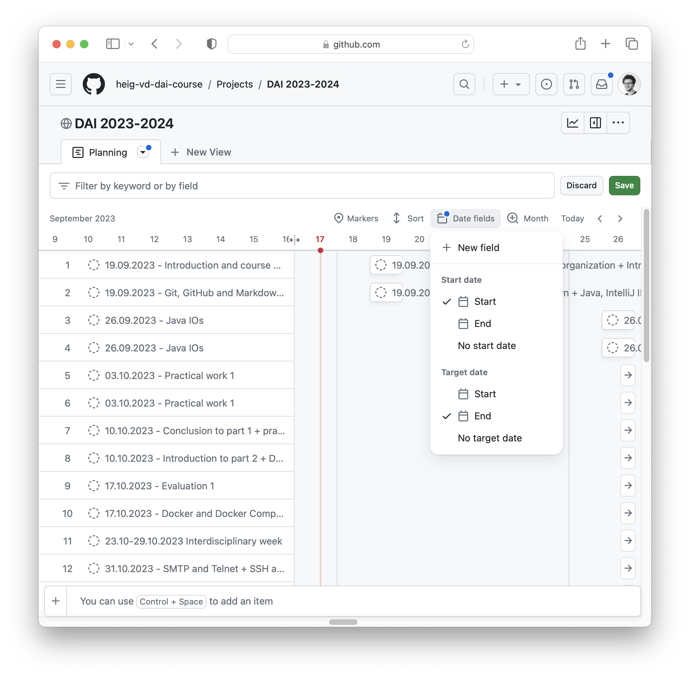

<!--
theme: gaia
size: 16:9
paginate: true
author: L. Delafontaine and H. Louis, with the help of AI tools
title: HEIG-VD DAI Course - Introduction and course organization
description: Introduction and course organization for the DAI course at HEIG-VD, Switzerland
url: https://heig-vd-dai-course.github.io/heig-vd-dai-course/01-introduction-and-course-organization/
footer: '**HEIG-VD** - DAI Course 2024-2025 - CC BY-SA 4.0'
style: |
    :root {
        --color-background: #fff;
        --color-foreground: #333;
        --color-highlight: #f96;
        --color-dimmed: #888;
        --color-headings: #7d8ca3;
    }
    blockquote {
        font-style: italic;
    }
    table {
        width: 100%;
    }
    th:first-child {
        width: 15%;
    }
    h1, h2, h3, h4, h5, h6 {
        color: var(--color-headings);
    }
    h2, h3, h4, h5, h6 {
        font-size: 1.5rem;
    }
    h1 a:link, h2 a:link, h3 a:link, h4 a:link, h5 a:link, h6 a:link {
        text-decoration: none;
    }
    section:not([class=lead]) > p, blockquote {
        text-align: justify;
    }
headingDivider: 4
-->

[web]:
  https://heig-vd-dai-course.github.io/heig-vd-dai-course/01-introduction-and-course-organization/
[pdf]:
  https://heig-vd-dai-course.github.io/heig-vd-dai-course/01-introduction-and-course-organization/01-introduction-and-course-organization-presentation.pdf
[license]:
  https://github.com/heig-vd-dai-course/heig-vd-dai-course/blob/main/LICENSE.md
[illustration]:
  https://images.unsplash.com/photo-1451187580459-43490279c0fa?fit=crop&h=720

# Introduction and course organization

<!--
_class: lead
_paginate: false
-->

<https://github.com/heig-vd-dai-course>

[Web][web] · [PDF][pdf]

<small>L. Delafontaine and H. Louis, with the help of AI tools.</small>

<small>This work is licensed under the [CC BY-SA 4.0][license] license.</small>

![bg opacity:0.1][illustration]

## Welcome to the Développement d'applications internet (DAI) course!

<!-- _class: lead -->

## What to expect to learn from this course

<!-- _class: lead -->

### What does GAPS say

- [Fiche d'unité](https://gaps.heig-vd.ch/consultation/fiches/uv/uv.php?id=6573)
- [Descriptif de module](https://gaps.heig-vd.ch/consultation/fiches/mv/mv.php?id=1905)
- [Programme de formation](https://gaps.heig-vd.ch/consultation/teachingplans/)
- 3 ECTS credits = ~75-90 hours
  - 48 hours in class (= 64 periods of 45 minutes)
  - ~27-42 hours outside of the class - We try our best to ensure you do not
    have to work that much outside of the class

---

> **Connaissances préalables recommandées**
>
> L'étudiant-e doit connaître et savoir utiliser les notions suivantes :
>
> - Programmation (Java, C) ;
> - Programmation orientée objet ;
> - TCP/IP.
>
> Les unités d'enseignement PRG2, RXI et POO permettent d'acquerir ces
> connaissances.

---

> **Objectifs**
>
> A l'issue de cette unité d'enseignement, l'étudiant-e sera capable de :
>
> **Programmation réseau**
>
> - être capable de concevoir une application client-serveur ;
> - être capable d'implémenter un client et un serveur en utilisant l'API Socket
>   dans différents langages ;

---

> **Protocole HTTP**
>
> - connaître les concepts principaux du protocole ;
> - être capable de concevoir et réaliser une infrastructure HTTP avec un
>   reverse proxy et plusieurs serveurs ;
> - être capable d'implémenter le protocole en utilisant l'API Socket ;

---

> **Protocoles de messagerie**
>
> - connaître les principaux protocoles relatifs à la messagerie électronique ;
> - être capable d'implémenter un client de messagerie simple ;

> **Protocoles de transfert de fichiers et d'accès à distance**
>
> - connaître les protocoles de transfert de fichiers et d'accès à distance,
>   ainsi que leurs principales utilisations (y compris tunneling/forwarding).

### Topics

You will learn the following topics during this course:

- Network programming (inputs/outputs, encodings, TCP and UDP)
- Application-level protocols (SMTP, SSH, HTTP and your own)
- Web infrastructures (reverse proxy, load balancer, sticky sessions)
- How to read and write technical documentation

At the end of the course, you will be able to create applications that can
communicate over the network!

### Technologies

You will learn the following technologies during this course:

- Git and GitHub
- Markdown
- Java for network programming
- Docker & Docker Compose
- Network utilities
- The terminal :heart:

## Why do you have this course

This course defines the basics of network communication and how all these
communications are programmed.

At the end of the course, you will know how to define, program and deploy
network applications, how to interact with them, and the different elements to
pay attention to make robust applications.

Whether you are in software, security, data science, embedded or network, you
will have to deal with network applications (APIs, devices, etc.). This course
will give you a solid grounding in this world.

## Course planning - [Calendrier académique](https://heig-vd.ch/formation/bachelor/calendrier-academique/)

64 periods are planned for this course, divided in 3 main parts:

- Part 1 - Input/output processing (18 periods)
- Part 2 - Network programming with TCP and UDP (24 periods)
- Part 3 - Network programming with HTTP (20 periods)

The entire course planning for the semester is available at
<https://github.com/orgs/heig-vd-dai-course/projects>.

---

Set the **Start date** and the **End date** fields as shown to display the
course planning correctly.

**The planning is subject to change**. We will do our best to inform you in
advance if there are any changes.

## Course sequence

1. Theoretical content that is meant to be short and concise (all of us)
   - Sessions of 20-30 minutes, dynamic and interactive
2. Practical content where you do stuff (you)
   - Prepare you for the practical work with official doc and tutorials
3. Practical work (you)
   - The theoretical and practical content are meant to help you
4. Feedback and discussions (you - very important to us)
   - You will be able to give feedback and help us improve the course

## Evaluation

- 3 practical works (20%) - done in groups
- 3 evaluations (30%) - done individually
- 1 exam (50%) - done individually

---

You can change groups between practical works.

We will try our best to give you your grades and feedback as quickly as possible
so you can improve for the next work.

We can be flexible on the deadlines if you have a good reason. Please let us
know as soon as possible if you have any difficulties.

## Communication channels

Feel free to use any of these communication channels for any kind of questions
related to the course:

- GitHub Discussions (you will experiment these very soon)
- In person
- Email
  - [ludovic.delafontaine@heig-vd.ch](mailto:ludovic.delafontaine@heig-vd.ch)
  - [hadrien.louis@heig-vd.ch](mailto:hadrien.louis@heig-vd.ch)

## Where to find the course material

**Everything** will be on the GitHub organization created for this course:
<https://github.com/heig-vd-dai-course>.

More specifically, the course material is available in the
[`heig-vd-dai-course`](https://github.com/heig-vd-dai-course/heig-vd-dai-course)
Git repository.

We will not use Microsoft Teams nor CyberLearn. We want to keep it simple and
efficient for you, and for us. One place to find it all.

We accept issues and pull requests if you spot anything weird! 🙂

---

The course material is available in several formats:

- **Markdown format** (recommended). You can read it directly on GitHub or on
  your computer with your favorite text editor.
- **PDF format**. You can download it from GitHub and read it on your computer
  or print it. We are aware that the generated PDF is not perfect, sorry about
  that.
- **Web format**. You can read it on the course website (only the presentations
  are available on the web).

These formats are generated from the same source files. There are no differences
between them. Use the one you prefer!

## Our wishes for this course

<!-- _class: lead -->

### What we want this course to be

- A place to learn
- A place to experiment and where it is OK to make mistakes
- A place to share and discuss
- A place where you are able to do things and master them
- A place where you can express your opinion
- It is OK if you are not feeling well. We are here if you need to talk.

➡️ A place where you do not loose your time (efficient and useful)

### What we don't want this course to be

- A place you don't want to come
- A place you don't feel comfortable/safe
- A place where you can't ask questions and/or do mistakes
- A place where you can't take anything away

➡️ If you have a problem with the course, we will do our best to fix it.

We will take presences during this course. If you are done, you are free to go.
However, we would appreciate if you try to help your classmates instead!

### Responsibilities and expectations

- The teaching staff responsibilities:
  - You have acquired the necessary knowledge of this course
  - You are prepared for the professional world
  - You are able to work on your own, and in a team
  - Your feedback is taken into account
- You are responsible for your own learning: if you have any questions, ask
  them. If you have any difficulties, let us know. If you have any suggestions,
  share them.

## _"Un cours en anglais..?"_

All the written material will be in English. The teaching staff will speak in
French. The evaluations and exam will be in French.

Our field is mostly made in English so this is a great opportunity to practice.

If you have any difficulties with English, please let us know.

## _"What about ChatGPT, Copilot, etc.?"_

**You can use all the tools you want** (personal notes, Internet, AI tools,
etc.), **except during evaluations and the exam**. You will be able to use these
in the real world, so better learn how to use them now. However, they are here
to help you, not to do the work for you:

- You must be able to explain what you did and why you did it
- You must state it when you used external help (tools and sources)
- You must be able to do the work on your own. These tools come and go ($$$, end
  of life, etc.), you should not entirely rely on them.

## _"Linux, macOS or Windows?"_

The HEIG-VD recommends Windows for your studies. This is mostly because other
departments heavily rely on Windows-only products.

From our experience, software development on Windows can be more difficult than
Linux or macOS.

---

If you are on Windows, follow the guide we created to set up a development
environment with Windows Subsystem for Linux (WSL):
[Set up a Windows development environment](https://github.com/heig-vd-dai-course/heig-vd-dai-course/blob/main/01-introduction-and-course-organization/SET_UP_A_WINDOWS_DEVELOPMENT_ENVIRONMENT.md).

This guide will help you to set up a Linux environment on your Windows computer
to be able to follow the course (and beyond).

---

If you are on macOS, we recommend you to install Homebrew and use it to install
the tools we will use during this course.

You can install Homebrew by following the instructions on the
[Homebrew website](https://brew.sh/).

You can always install Linux on your computer if you want to.
[Ubuntu](https://ubuntu.com/) or [Debian](https://www.debian.org/) is
recommended.

---

Whatever operating system you are using, **you should read the
[Considerations for a development environment](https://github.com/heig-vd-dai-course/heig-vd-dai-course/blob/main/01-introduction-and-course-organization/CONSIDERATIONS_FOR_A_DEVELOPMENT_ENVIRONMENT.md)
guide**.

This guide will help you to set up your development environment in a way that
will make you more productive and efficient.

## _"I have an ARM computer, is this an issue?"_

If you have an ARM computer (Apple Silicon M1/M2/M3 for example), some parts of
the course might be a bit more tricky. We will try our best to test all our
course material but we cannot guarantee that everything will work as expected on
the first try.

We might come to you to ask you to test some things for us before the next
course that requires it.

If you encounter any issue, please let us know as soon as possible.

## Questions

<!-- _class: lead -->

Do you have any questions?

## Sources

- Main illustration by [NASA](https://unsplash.com/@nasa) on
  [Unsplash](https://unsplash.com/photos/Q1p7bh3SHj8)
- Illustration by [Kenny Eliason](https://unsplash.com/@neonbrand) on
  [Unsplash](https://unsplash.com/photos/60krlMMeWxU)
- Illustration by [Nguyen Dang Hoang Nhu](https://unsplash.com/@nguyendhn) on
  [Unsplash](https://unsplash.com/photos/qDgTQOYk6B8)
- Illustration by [Fer Nando](https://unsplash.com/@fer_nando) on
  [Unsplash](https://unsplash.com/photos/UMC5sfWci78)
- Illustration by [Brett Jordan](https://unsplash.com/@brett_jordan) on
  [Unsplash](https://unsplash.com/photos/2a24_pZeXq8)
