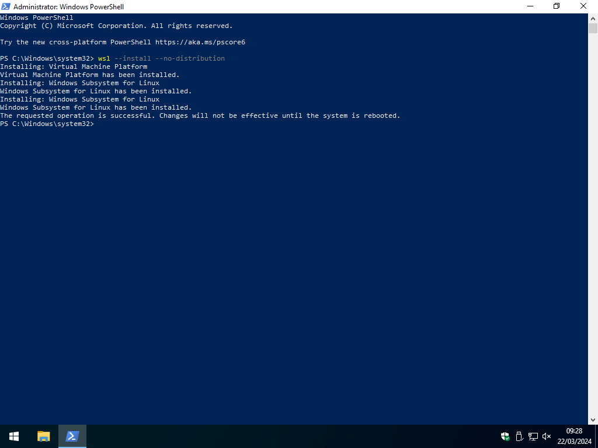
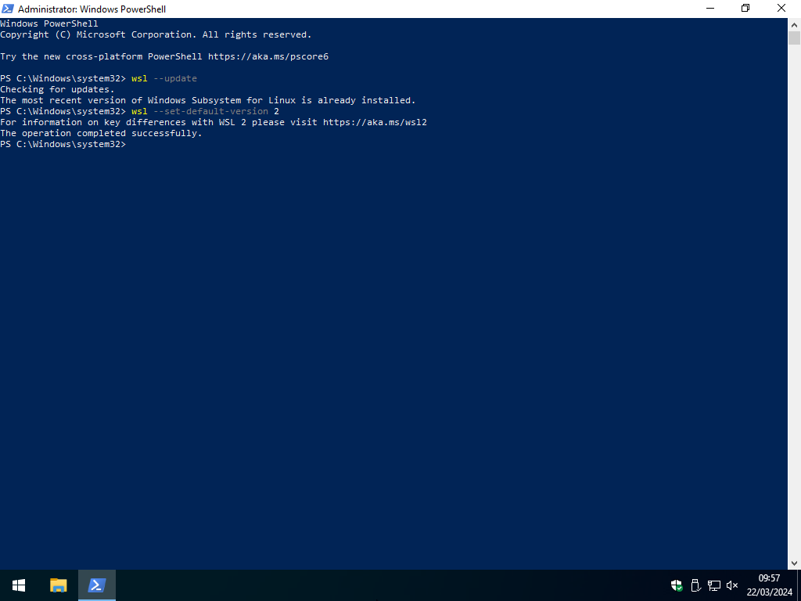
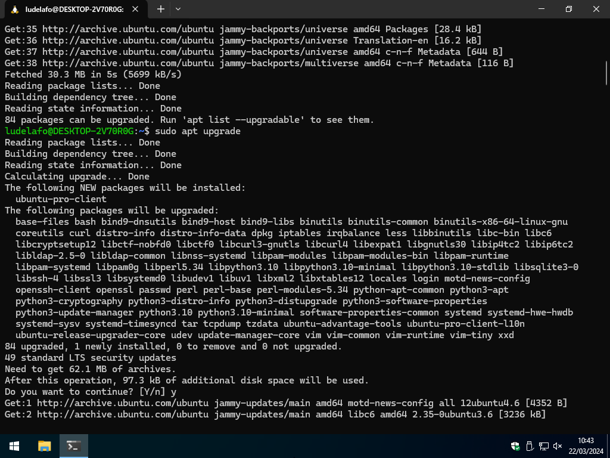

# Set up a Windows development environment

## Introduction

The HEIG-VD recommends Windows for your studies. This is mostly because other
departments heavily rely on Windows-only products. From our experience,
developing on Windows can be more difficult than Linux or macOS.

Linux and macOS are much more supported in the software development world. If
you can, we recommend you to try a Linux distribution (Ubuntu or Debian) for
this course, either baremetal or in Windows Subsystem for Linux (WSL). It will
be useful in your future to have a bit of experience with it as well.

This document will guide you through the process of installing and configuring
Windows and its subsystem for Linux (WSL) for a complete development environment
on Windows for this course (and beyond).

This guide is inspired from the
[official documentation](https://learn.microsoft.com/windows/wsl/install).

If you have any issues with the below guide, check the
[Troubleshooting](#troubleshooting) section. Feel free to ask for help if you
are stuck but we will not help you if you have not tried the following steps.

## Update Windows

Before starting the installation of the development environment, make sure that
your Windows installation is up to date. You can check for updates by going to
**Settings > Update & Security > Windows Update**.

## Install and configure WSL

This section will guide you through the process of installing and configuring
Windows Subsystem for Linux (WSL) on your Windows installation.

Highly inspired from the
[official documentation](https://learn.microsoft.com/windows/wsl/install).

### Install WSL

WSL is a compatibility layer for running Linux binary executables natively on
Windows. It is a very useful tool for developers who want to use Linux tools and
utilities on Windows.

To install WSL, search PowerShell in the Start menu, right-click on it, and
select "Run as administrator" as shown in the following screenshot:


Then, run the following command in the terminal:

> [!IMPORTANT]  
> If the following command displays the help message, proceed to the next
> section.

```powershell
# Install WSL without specifying a distribution
wsl --install --no-distribution
```

Your screen should be similar to the following screenshot:



Restart your computer when the installation is complete.

### Update WSL

WSL can still be in version 1 and must be updated to version 2.

To do so, open PowerShell as an administrator as shown in the previous section
and run the following commands in the terminal:

```powershell
# Check for WSL updates
wsl --update

# Set WSL version to 2
wsl --set-default-version 2
```

Your screen should be similar to the following screenshot:



### Install a Linux distribution

WSL supports multiple Linux distributions. You can check the available
distributions by running the following command in the terminal:

```powershell
# List available Linux distributions
wsl --list --online
```

Your screen should be similar to the following screenshot:


You can then install a Linux distribution of your choice from the above list. We
recommend installing Ubuntu if you are not familiar with Linux as it is a very
user-friendly distribution and is widely used.

```powershell
# Install Ubuntu
wsl --install Ubuntu
```

Once the installation is complete, you can set up a username and password for
the Ubuntu distribution.

While setting up your password, **it is expected that you will not see any
characters on the screen**. This is a security feature of the terminal. Even
though you do not see the characters you type (e.g., `p@ssw0rd`), they are still
being entered. So, make sure to remember them as you will need them later.

We recommend using the same username and password as your Windows account for
simplicity.

Once you have set up your username and password, Ubuntu will be started, and you
will be able to run Linux commands in the terminal.

Your screen should be similar to the following screenshot:


To exit the Ubuntu terminal, you can run the following command:

```bash
# Exit the Ubuntu terminal
exit
```

## Install and configure Windows Terminal

### Install Windows Terminal

Windows comes with a terminal application called _"Command Prompt"_. It is a
very basic terminal application that does not support many features that are
available in modern terminal applications. Microsoft has developed a new
terminal application called Windows Terminal that is available for Windows 10+
users.

The Windows Terminal is a new, modern, fast, efficient, powerful, and productive
terminal application for users of command-line tools and shells like Command
Prompt, PowerShell, and WSL.

You can download it from the Microsoft Store:
[Windows Terminal](https://www.microsoft.com/p/windows-terminal/9n0dx20hk701) or
from the GitHub releases page:
[Windows Terminal Releases](https://github.com/microsoft/terminal/releases)
(download the `.msixbundle` file).

Install it and open it.

### Configure Windows Terminal

By default, Windows Terminal will open PowerShell. Now that you have installed
Windows Terminal, you can configure it to open WSL by default.

Access the settings by clicking on the down arrow in the title bar and selecting
"Settings". Set the two following settings:

- **Default profile**: Ubuntu
- **Default terminal application**: Windows Terminal

Press **Save** to save the settings.

Your screen should be similar to the following screenshot:


Close Windows Terminal and open it again. It should now open Ubuntu by default.


You now have a modern terminal application that supports multiple tabs, multiple
shells, and many other features.

You now have access to a Linux distribution on your Windows machine. You can use
it to run Linux commands and utilities on Windows.

All future commands in this guide and course will be run in the Ubuntu terminal
unless specified otherwise.

## Update Ubuntu

Before starting the installation of the development environment, make sure that
your Ubuntu installation is up to date. You can update Ubuntu by running the
following commands in the terminal:

> [!NOTE]  
> The `sudo` command is used to run commands with superuser privileges. You will
> be prompted to enter your password when running a command with `sudo`.
>
> This is a security feature of Linux to prevent unauthorized access to the
> system.
>
> `apt` is the package manager for Ubuntu. It is used to install, update, and
> remove packages on Ubuntu.

```bash
# Update the package list
sudo apt update

# Upgrade the installed packages
sudo apt upgrade
```

Press `y` when prompted to confirm the upgrade.

Your screen should be similar to the following screenshot if there are updates
available:



## Install and configure Git

> [!NOTE]  
> Follow these instructions when requested in the course. If you are following
> this guide for the first time, you can skip to the [Conclusion](#conclusion).

Install and configure Git as mentioned in the course material but use the
instructions to install it on Ubuntu as you are now using Ubuntu in WSL as your
primary development environment.

## Install and configure Java

> [!NOTE]  
> Follow these instructions when requested in the course. If you are following
> this guide for the first time, you can skip to the [Conclusion](#conclusion).

Install and configure Java as mentioned in the course material but use the
instructions to install it on Ubuntu as you are now using Ubuntu in WSL as your
primary development environment.

## Install and configure IntelliJ IDEA

### Install IntelliJ IDEA

TODO

### Configure IntelliJ IDEA

TODO

## Install and configure Docker and Docker Compose

> [!NOTE]  
> Follow these instructions when requested in the course. If you are following
> this guide for the first time, you can skip to the [Conclusion](#conclusion).

Install and configure Docker and Docker Compose as mentioned in the course
material but use the instructions to install it on Ubuntu as you are now using
Ubuntu in WSL as your primary development environment.

## Conclusion

From now on, you can use WSL as your primary development environment for the
rest of the course. We will expect you to use WSL in all the assignments and
projects.

## Troubleshooting

The installation of WSL can fail for various reasons. Here are some common
issues and their solutions. Please follow each of the steps below in order to
ensure that WSL is installed correctly. Feel free to ask for help if you are
stuck but we will not help you if you have not tried the following steps.

### Check your Windows build number

WSL is only available since Windows 10 version 1607. You can check your Windows
version by running the following command in the terminal:

```powershell
# Check your Windows version
systeminfo | Select-String "^OS Name","^OS Version"
```

If your Windows version is lower than 1607, you will need to update your Windows
version.

### Enable virtualization

WSL requires virtualization to be enabled. You can check if virtualization is
enabled by running the following command in the terminal:

```powershell
# Check if virtualization is enabled
systeminfo | Select-String "Virtualization Enabled in Firmware"
```

If virtualization is not enabled, you will need to enable it in your BIOS/UEFI
settings.

### Check your Windows features

You can check if WSL is available on your Windows installation by running the
following command in the terminal:

```powershell
# Check if WSL is available
dism.exe /online /get-features | Select-String "Microsoft-Windows-Subsystem-Linux"
```

If WSL is not available, you will need to enable it using the following command:

```powershell
# Enable WSL
dism.exe /online /enable-feature /featurename:Microsoft-Windows-Subsystem-Linux /all /norestart
```

### Check your Windows update

You can check if your Windows installation is up to date by running the
following command in the terminal:

```powershell
# Check if your Windows installation is up to date
sconfig
```
