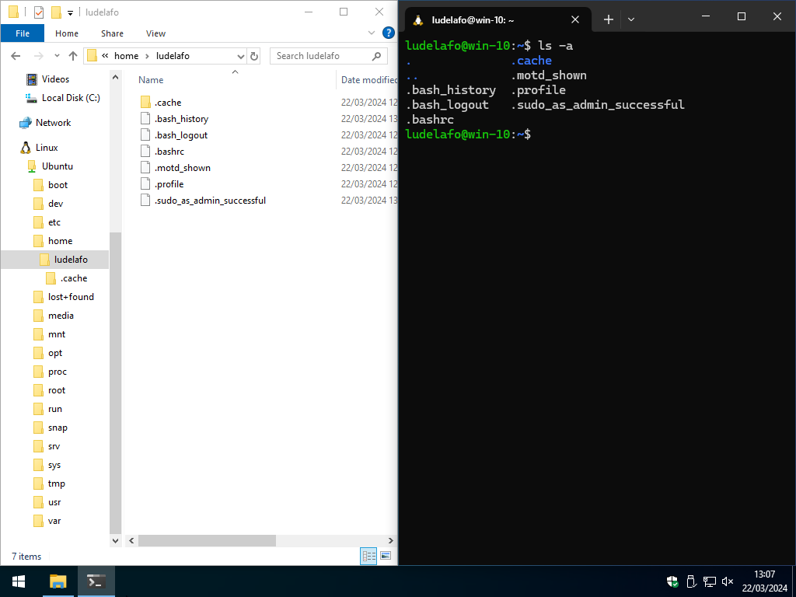
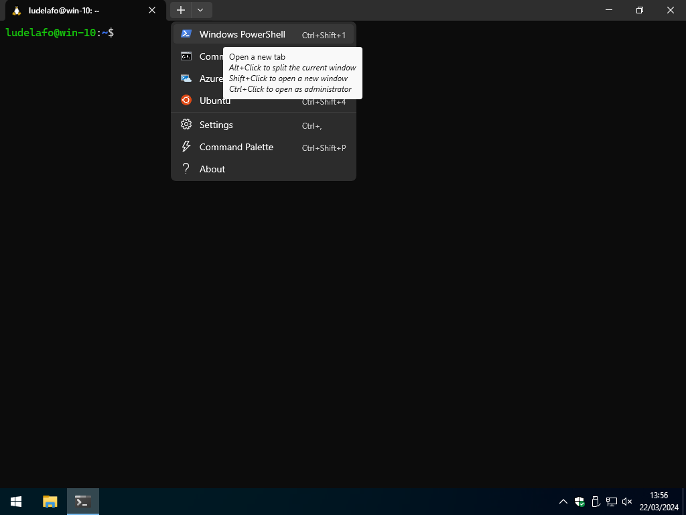
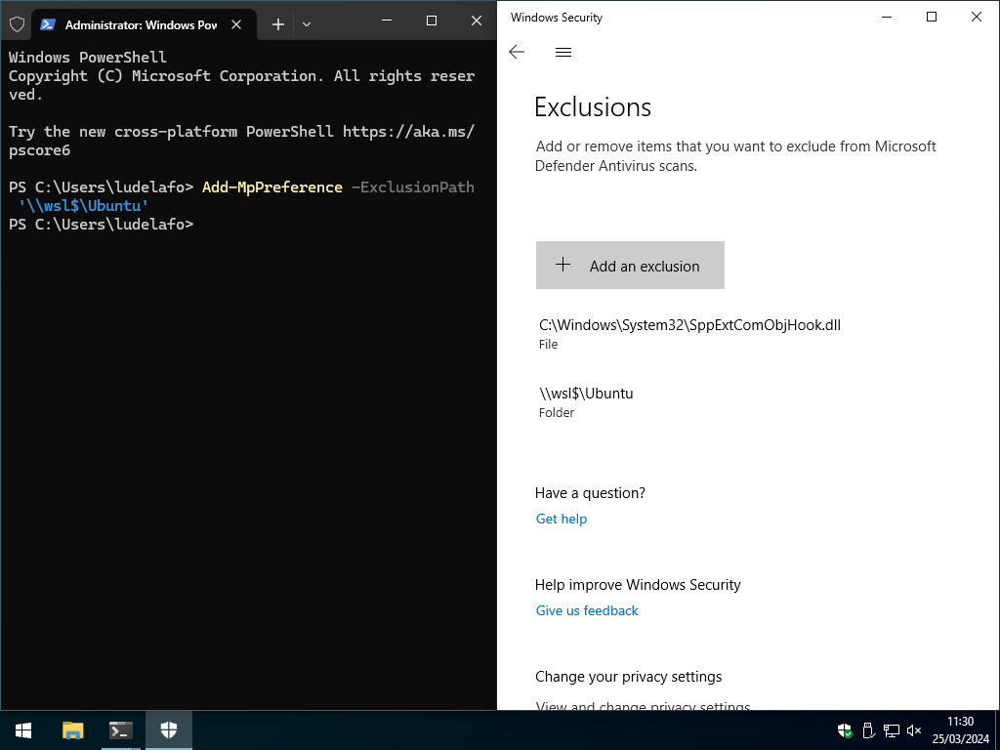
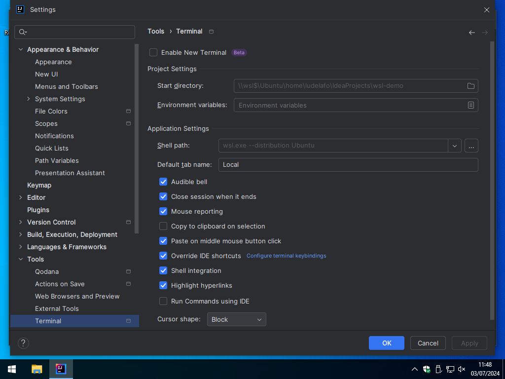

[license]:
  https://github.com/heig-vd-dai-course/heig-vd-dai-course/blob/main/LICENSE.md

# Set up a Windows development environment

L. Delafontaine and H. Louis, with the help of Copilot.

This work is licensed under the [CC BY-SA 4.0][license] license.

## Table of contents

- [Table of contents](#table-of-contents)
- [Introduction](#introduction)
- [Update Windows](#update-windows)
- [Install and configure Windows Subsystem for Linux (WSL)](#install-and-configure-windows-subsystem-for-linux-wsl)
  - [Install WSL](#install-wsl)
  - [Update WSL](#update-wsl)
  - [Install a Linux distribution](#install-a-linux-distribution)
- [Install and configure Windows Terminal](#install-and-configure-windows-terminal)
  - [Install Windows Terminal](#install-windows-terminal)
  - [Configure Windows Terminal](#configure-windows-terminal)
- [Update Ubuntu](#update-ubuntu)
- [Exclude WSL from Windows Defender](#exclude-wsl-from-windows-defender)
- [Validate the installation](#validate-the-installation)
- [Install and configure your IDE](#install-and-configure-your-ide)
  - [Install and configure IntelliJ IDEA to access WSL](#install-and-configure-intellij-idea-to-access-wsl)
- [Tips and tricks](#tips-and-tricks)
- [Troubleshooting](#troubleshooting)
  - [Check your Windows build number](#check-your-windows-build-number)
  - [Check for Windows updates](#check-for-windows-updates)
  - [Check your Windows features](#check-your-windows-features)
  - [Enable virtualization](#enable-virtualization)

## Introduction

The HEIG-VD recommends Windows for your studies. This is mostly because other
departments heavily rely on Windows-only products.

From our experience, software development on Windows can be more difficult than
Linux or macOS.

This guide will help you to set up a Linux environment on your Windows computer
to be able to follow the course (and beyond).

This guide is inspired from the following sources:

- [How to install Linux on Windows with WSL by Microsoft](https://learn.microsoft.com/windows/wsl/install)
- [Set up a WSL development environment by Microsoft](https://learn.microsoft.com/en-us/windows/wsl/setup/environment)

If you have any issues with the below guide, check the
[Troubleshooting](#troubleshooting) section. Feel free to ask for help if you
are stuck but but please, try the [Troubleshooting](#troubleshooting) section
before coming to us.

## Update Windows

Before starting the installation of the development environment, make sure that
your Windows installation is up to date.

You can check for updates by going to **Settings > Update & Security > Windows
Update**.

## Install and configure Windows Subsystem for Linux (WSL)

This section will guide you through the process of installing and configuring
Windows Subsystem for Linux (WSL) on your Windows installation.

### Install WSL

WSL is a compatibility layer for running Linux binary executables natively on
Windows. It is a very useful tool for developers who want to use Linux tools and
utilities on Windows.

To install WSL, search "_PowerShell_" in the Start menu, right-click on it, and
select _"Run as administrator"_ as shown in the following screenshot:


Then, run the following command in the terminal:

> [!IMPORTANT]
>
> If the following command displays the help message, proceed to the next
> section.

```powershell
# Install WSL without specifying a distribution
wsl --install --no-distribution
```

The output should be similar to this:

```text
Installing: Virtual Machine Platform
Virtual Machine Platform has been installed.
Installing: Windows Subsystem for Linux
Windows Subsystem for Linux has been installed.
Installing: Windows Subsystem for Linux
Windows Subsystem for Linux has been installed.
The requested operation is successful. Changes will not be effective until the system is rebooted.
```

Restart your computer once the installation is complete.

### Update WSL

WSL can still be in version 1 and must be updated to version 2.

To do so, open PowerShell as an administrator as shown in the previous section
and run the following command in the terminal:

```powershell
# Check for WSL updates
wsl --update --web-download
```

If there are updates available, you will be prompted to download and install
them.

Set the WSL default version to 2 by running the following command in the
terminal:

```powershell
# Set WSL default version to 2
wsl --set-default-version 2
```

The output should be similar to this:

```text
For information on key differences with WSL 2 please visit https://aka.ms/wsl2
The operation completed successfully.
```

### Install a Linux distribution

WSL supports multiple Linux distributions. You can check the available
distributions by running the following command in the terminal:

```powershell
# List available Linux distributions
wsl --list --online
```

The output should be similar to this:

```text
The following is a list of valid distributions that can be installed.
Install using 'wsl --install -d <Distro>'.

NAME                                   FRIENDLY NAME
Ubuntu                                 Ubuntu
Debian                                 Debian GNU/Linux
kali-linux                             Kali Linux Rolling
Ubuntu-18.04                           Ubuntu 18.04 LTS
Ubuntu-20.04                           Ubuntu 20.04 LTS
Ubuntu-22.04                           Ubuntu 22.04 LTS
OracleLinux_7_9                        Oracle Linux 7.9
OracleLinux_8_7                        Oracle Linux 8.7
OracleLinux_9_1                        Oracle Linux 9.1
openSUSE-Leap-15.5                     openSUSE Leap 15.5
SUSE-Linux-Enterprise-Server-15-SP4    SUSE Linux Enterprise Server 15 SP4
SUSE-Linux-Enterprise-15-SP5           SUSE Linux Enterprise 15 SP5
openSUSE-Tumbleweed                    openSUSE Tumbleweed
```

You can then install a Linux distribution of your choice from the above list. We
recommend installing Ubuntu if you are not familiar with Linux as it is a very
user-friendly distribution and is widely used. All commands in this course will
be run in Ubuntu.

```powershell
# Install Ubuntu
wsl --install --distribution Ubuntu
```

Once the installation is complete, you can set up a username and password for
the Ubuntu distribution.

> [!TIP]
>
> While setting up your password, **it is expected that you will not see any
> characters on the screen**. This is a security feature of the terminal. Even
> though you do not see the characters you type (e.g., `p@ssw0rd`), they are
> still being entered. So, make sure to remember your password as you will need
> it later.

We recommend using the same username and password as your Windows account for
simplicity.

Once you have set up your username and password, Ubuntu will be started, and you
will be able to run Linux commands in the terminal.

The output should be similar to this:

```text
Installing: Ubuntu
Ubuntu has been installed.
Launching Ubuntu...
Installing, this may take a few minutes...
Please create a default UNIX user account. The username does not need to match your Windows username.
For more information visit: https://aka.ms/wslusers
Enter new UNIX username: ludelafo
New password:
Retype new password:
passwd: password updated successfully
Installation successful!
To run a command as administrator (user "root"), use "sudo <command>".
See "man sudo_root" for details.

Welcome to Ubuntu 22.04.3 LTS (GNU/Linux 5.10.102.1-microsoft-standard-WSL2 x86_64)

 * Documentation:  https://help.ubuntu.com
 * Management:     https://landscape.canonical.com
 * Support:        https://ubuntu.com/advantage

This message is shown once a day. To disable it please create the
/home/ludelafo/.hushlogin file.
ludelafo@win-10:~$
```

To exit the Ubuntu terminal, you can run the following command:

```bash
# Exit the Ubuntu terminal
exit
```

WSL is now installed and configured on your Windows machine. You can use it to
run Linux commands and utilities on Windows.

When you access the Ubuntu terminal, you will be in the home directory of your
Ubuntu user. You can access your Windows files in the `/mnt` directory. For
example, you can access your Windows `C:\Users` drive in the `/mnt/c/Users`
directory.

Windows has added an entry to the File Explorer sidebar for the Ubuntu
distribution. You can access your Ubuntu files in the
`\\wsl$\Ubuntu\home\YOUR_USERNAME` directory.

> [!CAUTION]
>
> We highly recommend to **never manipulate your files from the File Explorer**.
> Use the Ubuntu terminal instead to avoid permission issues and odd file
> behaviors.



## Install and configure Windows Terminal

### Install Windows Terminal

Windows comes with a terminal application called _"Command Prompt"_.

It is a very basic terminal application that does not support many features that
are available in modern terminal applications. Microsoft has developed a new
terminal application called Windows Terminal that is available for Windows 10+
users.

The Windows Terminal is a new, modern, fast, efficient, powerful, and productive
terminal application for users of command-line tools and shells like Command
Prompt, PowerShell, and WSL.

You can download it from the Microsoft Store:
[Windows Terminal](https://www.microsoft.com/p/windows-terminal/9n0dx20hk701) or
from the GitHub releases page:
[Windows Terminal Releases](https://github.com/microsoft/terminal/releases)
(download the `.msixbundle` file).

Install it and open it.

### Configure Windows Terminal

By default, Windows Terminal will open PowerShell. Now that you have installed
Windows Terminal, you can configure it to open WSL by default.

Access the settings by clicking on the down arrow in the title bar and selecting
"Settings". Set the two following settings:

- **Default profile**: Ubuntu
- **Default terminal application**: Windows Terminal

Press **Save** to save the settings.


Close Windows Terminal and open it again. It should now open Ubuntu by default.

You now have a modern terminal application that supports multiple tabs, multiple
shells, and many other features.

You now have access to a Linux distribution on your Windows machine. You can use
it to run Linux commands and utilities on Windows.

All future commands in this guide and course will be run in the Ubuntu terminal
unless specified otherwise.

You can always open a PowerShell terminal by clicking on the down arrow in the
title bar and selecting "Windows PowerShell".

You can run a PowerShell terminal as an administrator by clicking on the down
arrow in the title bar and selecting "Windows PowerShell" while holding the
`Ctrl` key.



## Update Ubuntu

Before starting the installation of the development environment, make sure that
your Ubuntu installation is up to date. You can update Ubuntu by running the
following commands in the terminal. You might need to enter your password when
running the commands:

> [!TIP]
>
> The `sudo` command is used to run commands with superuser privileges. You will
> be prompted to enter your password when running a command with `sudo`.
>
> This is a security feature of Linux to prevent unauthorized access to the
> system.

> [!TIP]
>
> All Linux distributions come with a package manager that is used to install,
> update, and remove packages. The package manager for Ubuntu is called `apt`.
>
> The package manager uses a package list to know which packages are available
> for installation. You can then install any package from the package list using
> the package manager.
>
> If you are interested to have a package manager for Windows, you can check
> [Chocolatey](https://chocolatey.org/) or [Scoop](https://scoop.sh/).
>
> These package managers are not required for this course but can be useful if
> you want to easily install and update packages on Windows as you would on
> Linux.

```bash
# Update the package list
sudo apt update

# Upgrade the installed packages
sudo apt upgrade
```

Press `y` when prompted to confirm the upgrade.

All packages will be upgraded to the latest version.

## Exclude WSL from Windows Defender

Excluding the WSL distribution from Windows Defender will prevent Windows
Defender from scanning the files and folders in the WSL distribution and highly
improve the performance of WSL.

It will also allow you to use WSL with your prefered Integrated Development
Environment (IDE) without any issues.

This should not expose your system to any security risks as the WSL distribution
is isolated from the rest of the system.

To exclude the WSL distribution from Windows Defender, you can run the following
command in a PowerShell terminal as an administrator as seen in the previous
section:

```powershell
# Exclude the WSL distribution from Windows Defender
Add-MpPreference -ExclusionPath '\\wsl$\Ubuntu'
```



You should do this for each distribution you have installed.

## Validate the installation

You can use the following checklist to validate the installation:

- [ ] Windows is up to date.
- [ ] WSL is installed on your Windows machine.
- [ ] WSL is up to date.
- [ ] WSL is set to version 2.
- [ ] Ubuntu is installed in WSL.
- [ ] Ubuntu is up to date.
- [ ] Windows Terminal is installed and configured to open Ubuntu by default.
- [ ] WSL is excluded from Windows Defender for better performance.

From now on, you can use WSL as your primary development environment for the
rest of the course. We will expect you to use WSL in all the assignments and
projects.

The next sections will guide you through the installation and configuration of
your Integrated Development Environment (IDE) and other tools.

## Install and configure your IDE

The following sections will guide you through the installation and configuration
of your Integrated Development Environment (IDE) to access and use the WSL
distribution.

You should follow the instructions for the IDE that is recommended for the
course you are following. Come back to this document once you are asked to use
the provided IDE.

- [Install and configure IntelliJ IDEA to access WSL](#install-and-configure-intellij-idea-to-access-wsl)

### Install and configure IntelliJ IDEA to access WSL

> [!NOTE]
>
> Follow these instructions when requested in the course. If you are following
> this guide for the first time, you can skip this section.

Inspired by the
[How to use WSL development environment in JetBrains products by JetBrains](https://www.jetbrains.com/help/idea/how-to-use-wsl-development-environment-in-product.html)
guide.

#### Install Java in WSL

Install Java as mentioned in the course material. Install it in your Ubuntu
distribution.

> [!TIP]
>
> You might need to install the missing packages for
> [SDKMAN!](https://sdkman.io/) to work correctly.
>
> Use `apt` to install them by running the following command in the terminal:
>
> ```bash
> # Install the missing packages for SDKMAN!
> sudo apt install <name of the missing package>
> ```

#### Install Maven in WSL

Install Maven as mentioned in the course material. Install it in your Ubuntu
distribution.

#### Install IntelliJ IDEA

Install IntelliJ IDEA as mentioned in the course material. Install it on your
Windows.

#### Configure Windows Firewall to allow IntelliJ IDEA to access WSL

In order to use IntelliJ IDEA with WSL, you need to allow IntelliJ IDEA to
access the WSL distribution through the Windows Firewall.

> [!TIP]
>
> These instructions are meant to be used with IntelliJ IDEA. If you are using
> another JetBrains IDE, you will need to adapt the instructions accordingly.

Allow IntelliJ IDEA to access the WSL distribution through the Windows Firewall
by running the following command in a PowerShell terminal as an administrator as
seen in the previous section:

```powershell
# Allow IntelliJ IDEA to access the WSL distribution through the Windows Firewall
New-NetFirewallRule -DisplayName "WSL" -Direction Inbound  -InterfaceAlias "vEthernet (WSL)"  -Action Allow

# Renew the firewall rules
Get-NetFirewallProfile -Name Public | Get-NetFirewallRule | where DisplayName -ILike "IntelliJ IDEA*" | Disable-NetFirewallRule
```


#### Create a new project in IntelliJ IDEA

> [!CAUTION]
>
> If you have any issues with the following instructions, please check that you
> have excluded WSL from Windows Defender. It is a known issue that Windows
> Defender can block IntelliJ IDEA from accessing WSL:
> [Impossible to configure SDK on windows with WSL](https://youtrack.jetbrains.com/issue/IDEA-273533/Impossible-to-configure-SDK-on-windows-with-WSL).

Once you create a new project, IntelliJ IDEA should automatically detect the
Java and Maven installations in WSL.

Create a new project in your WSL home directory using the same instructions as
in the course material.

> [!CAUTION]
>
> Always create your projects in your WSL home directory to avoid file
> permission issues!


Once you build an IntelliJ IDEA project, you might be prompted to allow it
through the Windows Firewall. Make sure to allow it on both private and public
networks.


#### Configure IntelliJ IDEA terminal to use WSL

IntelliJ IDEA has a built-in terminal. It should automatically use the WSL
distribution once you open it.

However, if it does not, you can configure it to use the WSL distribution by
default by following these steps:

1. Open the IntelliJ IDEA settings by clicking on **File > Settings**.
2. Go to **Tools > Terminal**.
3. Set the **Shell path** to the WSL distribution with
   `wsl.exe --distribution Ubuntu` as shown in the following screenshot:
   

## Tips and tricks

By default, WSL disk space will grow as you use it but not shrink when space is
freed. You can automatically shrink the image when files are removed by running
the following command in a PowerShell terminal:

```powershell
# Stop the WSL service
wsl --shutdown

# Optimize the WSL disk space
wsl --manage Ubuntu --set-sparse true
```

Based on the following [StackExchange answer](https://superuser.com/a/1612289).

## Troubleshooting

The installation of WSL can fail for various reasons. Here are some common
issues and their solutions. Please follow each of the steps below in order to
ensure that WSL is installed correctly. Feel free to ask for help if you are
stuck but we will not help you if you have not tried the following steps.

> [!NOTE]
>
> Troubleshooting WSL can be complex and time-consuming. We have created a list
> of common issues and their solutions to help you troubleshoot your WSL
> installation. If you are still having issues after following the steps below,
> please ask for help. We might have to update this guide with more
> troubleshooting steps.

### Check your Windows build number

WSL is only available since Windows 10 version 1607. You can check your Windows
version by running the following command in a PowerShell terminal:

```powershell
# Check your Windows version
systeminfo | Select-String "^OS Name","^OS Version"
```

If your Windows version is lower than 1607, you will need to update your Windows
version.

### Check for Windows updates

You can check if your Windows installation is up to date by running the
following command in a PowerShell terminal:

```powershell
# Check if your Windows installation is up to date
sconfig
```

### Check your Windows features

You can check if WSL is available on your Windows installation by running the
following command in a PowerShell terminal:

```powershell
# Check if WSL is available
dism.exe /online /get-features | Select-String "Microsoft-Windows-Subsystem-Linux"
```

If WSL is not available, you will need to enable it using the following command:

```powershell
# Enable WSL
dism.exe /online /enable-feature /featurename:Microsoft-Windows-Subsystem-Linux /all /norestart
```

### Enable virtualization

WSL requires virtualization to be enabled. You can check if virtualization is
enabled by running the following command in the terminal:

```powershell
# Check if virtualization is enabled
systeminfo | Select-String "Virtualization Enabled in Firmware"
```

If virtualization is not enabled, you will need to enable it in your BIOS/UEFI
settings.

You can restart in the BIOS/UEFI settings by running the following command in a
PowerShell terminal:

```powershell
# Restart in the BIOS/UEFI settings
shutdown /r /fw
```

Then, you have to enable virtualization in your BIOS/UEFI settings. The exact
location of the setting will depend on your motherboard manufacturer.

You have to look for a setting called "Virtualization", "VT-x", "AMD-V", or
something similar and enable it.
