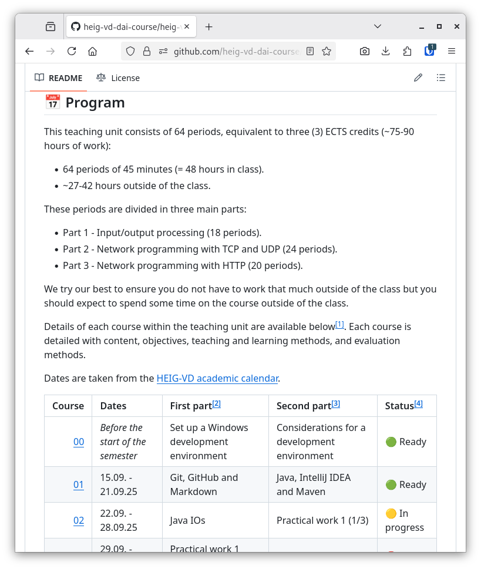

<!--
theme: custom-marp-theme
size: 16:9
paginate: true
author: L. Delafontaine and H. Louis, with the help of GitHub Copilot
title: HEIG-VD DAI - Introduction to the teaching unit
description: Introduction to the teaching unit for the DAI course at HEIG-VD, Switzerland
header: "[**Introduction to the teaching unit**](https://github.com/heig-vd-dai-course/heig-vd-dai-course/tree/main/01.01-introduction-to-the-teaching-unit)"
footer: '[**HEIG-VD**](https://heig-vd.ch) - [DAI 2025-2026](https://github.com/heig-vd-dai-course/heig-vd-dai-course) - [CC BY-SA 4.0](https://github.com/heig-vd-dai-course/heig-vd-dai-course/blob/main/LICENSE.md)'
headingDivider: 6
-->

# Introduction to the teaching unit

<!--
_class: lead
_paginate: false
-->

[Link the course][course]

<small>L. Delafontaine and H. Louis, with the help of
[GitHub Copilot](https://github.com/features/copilot).</small>

<small>This work is licensed under the [CC BY-SA 4.0][license] license.</small>

![bg opacity:0.1][illustration]

## Welcome to the Développement d'applications internet (DAI) teaching unit!

<!-- _class: lead -->

## Who are we? (1/2)

**Ludovic  
Delafontaine**

<small>Classes A and C</small>

[Mail](mailto:ludovic.delafontaine@heig-vd.ch) ·
[GitHub](https://github.com/ludelafo)

**Hadrien  
Louis**

<small>Wednesdays' class (C)</small>

[Mail](mailto:hadrien.louis@heig-vd.ch) ·
[GitHub](https://github.com/hadrylouis)

**Gaétan  
Zwick**

<small>Thursdays' class (A)</small>

[Mail](mailto:gaetan.zwick@heig-vd.ch) · [GitHub](https://github.com/Ga-3tan)

## Who are we? (2/2)

**Olivier  
Tischhauser**

<small>Class B</small>

[Mail](mailto:olivier.tischhauser@heig-vd.ch) ·
[GitHub](https://github.com/binaerbaum)

**Ylli  
Fazlija**

<small>Wednesdays' class (B)</small>

[Mail](mailto:ylli.fazlija@heig-vd.ch) ·
[GitHub](https://github.com/FazlijaYlli)

## What to expect to learn from this course

<!-- _class: lead -->

### What does GAPS say (1/5)

- [Fiche d'unité](https://gaps.heig-vd.ch/consultation/fiches/uv/uv.php?id=6573)
- [Descriptif de module](https://gaps.heig-vd.ch/consultation/fiches/mv/mv.php?id=1905)
- [Programme de formation](https://gaps.heig-vd.ch/consultation/teachingplans/)
- Three (3) ECTS credits (~75-90 hours of work):
  - 64 periods of 45 minutes (= 48 hours in class).
  - ~27-42 hours outside of the class - We try our best to ensure you do not
    have to work that much outside of the class.

### What does GAPS say (2/5)

> **Connaissances préalables recommandées**
>
> L'étudiant-e doit connaître et savoir utiliser les notions suivantes :
>
> - Programmation (Java, C) ;
> - Programmation orientée objet ;
> - TCP/IP.
>
> Les unités d'enseignement PRG2, RXI et POO permettent d'acquerir ces
> connaissances.

### What does GAPS say (3/5)

> **Objectifs**
>
> A l'issue de cette unité d'enseignement, l'étudiant-e sera capable de :
>
> **Programmation réseau**
>
> - être capable de concevoir une application client-serveur ;
> - être capable d'implémenter un client et un serveur en utilisant l'API Socket
>   dans différents langages ;

### What does GAPS say (4/5)

> **Protocole HTTP**
>
> - connaître les concepts principaux du protocole ;
> - être capable de concevoir et réaliser une infrastructure HTTP avec un
>   reverse proxy et plusieurs serveurs ;
> - être capable d'implémenter le protocole en utilisant l'API Socket ;

### What does GAPS say (5/5)

> **Protocoles de messagerie**
>
> - connaître les principaux protocoles relatifs à la messagerie électronique ;
> - être capable d'implémenter un client de messagerie simple ;
>
> **Protocoles de transfert de fichiers et d'accès à distance**
>
> - connaître les protocoles de transfert de fichiers et d'accès à distance,
>   ainsi que leurs principales utilisations (y compris tunneling/forwarding).

### Topics

You will learn the following topics during this course:

- Network programming (inputs/outputs, encodings, TCP and UDP).
- Application-level protocols (SMTP, SSH, HTTP, and your own).
- Web infrastructures (reverse proxy, load balancer, sticky sessions).
- How to read and write technical documentation.

At the end of the course, you will be able to create applications that can
communicate over the network (for example, business applications, APIs, games,
etc.)!

### Technologies

You will learn the following technologies during this teaching unit:

- Git and GitHub.
- Markdown.
- Java for network programming.
- Docker & Docker Compose.
- Network utilities.
- The terminal. :heart:

## Why do you have this course

This teaching course defines the basics of network communication and how all
these communications are programmed.

At the end of the teaching unit, you will know how to define, program and deploy
network applications, how to interact with them, and the different elements to
pay attention to make robust applications.

Whether you are in software, security, data science, embedded or network, you
will have to deal with network applications (APIs, devices, etc.). This teaching
unit will give you a solid grounding in this world.

## Program (1/2)

64 periods are planned for this teaching unit, divided in 3 main parts:

- Part 1 - Input/output processing (18 periods).
- Part 2 - Network programming with TCP and UDP (24 periods).
- Part 3 - Network programming with HTTP (20 periods).

The entire teaching unit program for the semester is available at
<https://github.com/heig-vd-dai-course/heig-vd-dai-course#-program>.

## Program (2/2)

Dates are based on the
[HEIG-VD calendar](https://heig-vd.ch/formation/bachelor/calendrier-academique/).

**The program is subject to change**.

We will do our best to inform you in advance if there are any changes.

## Course sequence

1. Overview of the subject meant to be short and concise.
   - Sessions of 20-30 minutes (short and concise).
2. Practice the content with theoretical and practical parts.
   - These help you prepare you for the practical works.
3. Practical works.
   - Freedom of the subject, you can choose what you want to do.
4. Feedback and discussions (very important to us).
   - You will be able to give feedback and help us improve the course.

## Grading (1/2)

You will be graded on the following elements:

- Three (3) practical works (20%) - done in groups.
- Two (2) evaluations (30%) - done individually.
- One (1) exam (50%) - done individually.

## Grading (2/2)

You can change groups between practical works.

We will try our best to give you your grades and feedback as quickly as possible
so you can improve for the next work.

We can be flexible on the deadlines if you have a good reason.

## Communication channels

Feel free to use any of these communication channels for any kind of questions
related to the course:

- GitHub Discussions (you will experiment these very soon).
- In person.
- Email. Do not forget to put all the teaching staff in copy (CC) of your email!

- [ludovic.delafontaine@heig-vd.ch](mailto:ludovic.delafontaine@heig-vd.ch)
- [olivier.tischhauser@heig-vd.ch](mailto:olivier.tischhauser@heig-vd.ch)
- [hadrien.louis@heig-vd.ch](mailto:hadrien.louis@heig-vd.ch)
- [gaetan.zwick@heig-vd.ch](mailto:gaetan.zwick@heig-vd.ch)
- [ylli.fazlija@heig-vd.ch](mailto:ylli.fazlija@heig-vd.ch)

## Where to find the course material

**Everything** will be on the GitHub organization created for this teaching
unit: <https://github.com/heig-vd-dai-course>.

We will not use Microsoft Teams nor CyberLearn. We want to keep it simple and
efficient for you, and for us. One place to find it all.

We accept issues and pull requests if you spot anything weird! 🙂

_**Do not try to contact us on Microsoft Teams or CyberLearn, we will surely not
answer!**_

## Our wishes for this course

<!-- _class: lead -->

### What we want this course to be

- A place to learn.
- A place to experiment where it is OK to make mistakes.
- A place to share and discuss.
- A place where you are able to do things and master them.
- A place where you can express your opinion.
- It is OK if you are not feeling well. We are here if you need to talk.

➡️ A place where you do not loose your time (efficient and useful).

### What we don't want this course to be

- A place you don't want to come.
- A place you don't feel comfortable/safe.
- A place where you can't ask questions and/or do mistakes.
- A place where you can't take anything away.

➡️ If you have a problem with the course, we will do our best to fix it.

We will take presences during this course. If you are done, you are free to go.
However, we would appreciate if you try to help your classmates instead!

### Responsibilities and expectations (1/2)

**The teaching staff responsibilities**

- You have acquired the necessary knowledge of this course.
- You are prepared for the professional world.
- You are able to work on your own, and in a team.
- Your feedback is taken into account.
- We are available to help you and answer your questions.
- We try to give you accurate and useful feedback for you to improve.

### Responsibilities and expectations (2/2)

**Your responsibilities**

- Read and understand the course material.
- Do the practical contents given in the course materials.
- You can give feedback and suggestions.
- You are responsible for your own learning:
  - If you have any questions, ask them.
  - If you have any difficulties, let us know.
  - If you have any suggestions, share them.

## _"Un cours en anglais..?"_

All the written material will be in English. The teaching staff will speak in
French. The evaluations and exam will be in French.

Our field is mostly made in English so this is a great opportunity to practice.

If you have any difficulties with English, please let us know.

## _"What about ChatGPT, Copilot, etc.?"_ (1/2)

**You can use all the tools you want** (personal notes, Internet, AI tools,
etc.), **except during evaluations and the exam**. You will be able to use these
in the real world, so better learn how to use them now.

However, in our experience, these tools are not reliable enough to be used
without supervision. They can help you, but they are not a replacement for your
own knowledge and skills.

Focus on understanding the concepts and principles behind the tasks you are
working. Once you are confident with the concepts, you can use these tools to
help you with the implementation.

## _"What about ChatGPT, Copilot, etc.?"_ (2/2)

Few rules regarding the use of these tools:

- You **must be able to explain what you did and why you did it**.
- You **must state when you used external help** (tools and sources).
- You **must be able to do the work on your own**. These tools come and go ($$$,
  end of life, etc.), you should not entirely rely on them.

**Your personal and scientific integrity is at stake.** If we have some doubts
about your work, we will ask you to explain it to us. You might be penalized if
something is suspicious.

## _"Linux, macOS or Windows?"_ (1/3)

The HEIG-VD recommends Windows for your studies. This is mostly because other
departments heavily rely on Windows-only products.

From our experience, software development on Windows can be more difficult than
Linux or macOS.

## _"Linux, macOS or Windows?"_ (2/3)

If you are on Windows, follow the guide we created to set up a development
environment with Windows Subsystem for Linux (WSL):
[_Set up a Windows development environment_](https://github.com/heig-vd-dai-course/heig-vd-dai-course/blob/main/00.01-set-up-a-windows-development-environment/).

This guide will help you to set up a Linux environment on your Windows computer
to be able to follow the course (and beyond).

If you are on macOS, we recommend you to install [Homebrew](https://brew.sh/)
and use it to install the tools we will use during this course.

## _"Linux, macOS or Windows?"_ (3/3)

Whatever operating system you are using, **you should read the
[_Considerations for a development environment_](https://github.com/heig-vd-dai-course/heig-vd-dai-course/blob/main/00.02-considerations-for-a-development-environment/)
guide**.

This guide will help you to set up your development environment in a way that
will make you more productive and efficient.

## _"I have an ARM computer, is this an issue?"_

If you have an ARM computer (Apple Silicon M1/M2/M3/M4 for example), some parts
of the course might be a bit more tricky. We will try our best to test all our
course material but we cannot guarantee that everything will work as expected on
the first try.

We might come to you to ask you to test some things for us before the next
course that requires it.

If you encounter any issue, please let us know as soon as possible.

## Questions

<!-- _class: lead -->

Do you have any questions?

## Sources

- Main illustration by [NASA](https://unsplash.com/@nasa) on
  [Unsplash](https://unsplash.com/photos/Q1p7bh3SHj8)
- Illustration by [Kenny Eliason](https://unsplash.com/@neonbrand) on
  [Unsplash](https://unsplash.com/photos/60krlMMeWxU)
- Illustration by [Nguyen Dang Hoang Nhu](https://unsplash.com/@nguyendhn) on
  [Unsplash](https://unsplash.com/photos/qDgTQOYk6B8)
- Illustration by [Fer Nando](https://unsplash.com/@fer_nando) on
  [Unsplash](https://unsplash.com/photos/UMC5sfWci78)
- Illustration by [Brett Jordan](https://unsplash.com/@brett_jordan) on
  [Unsplash](https://unsplash.com/photos/2a24_pZeXq8)

[course]:
	https://github.com/heig-vd-dai-course/heig-vd-dai-course/tree/main/01.01-introduction-to-the-teaching-unit
[license]:
	https://github.com/heig-vd-dai-course/heig-vd-dai-course/blob/main/LICENSE.md
[illustration]: ./images/main-illustration.jpg
