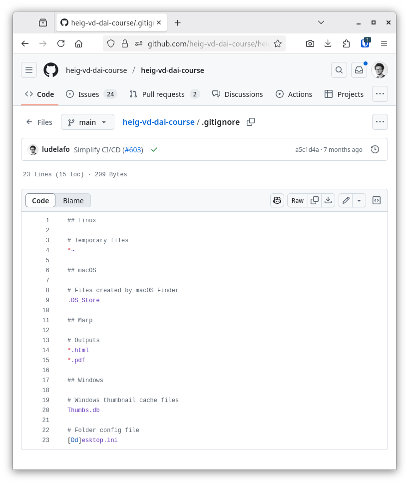
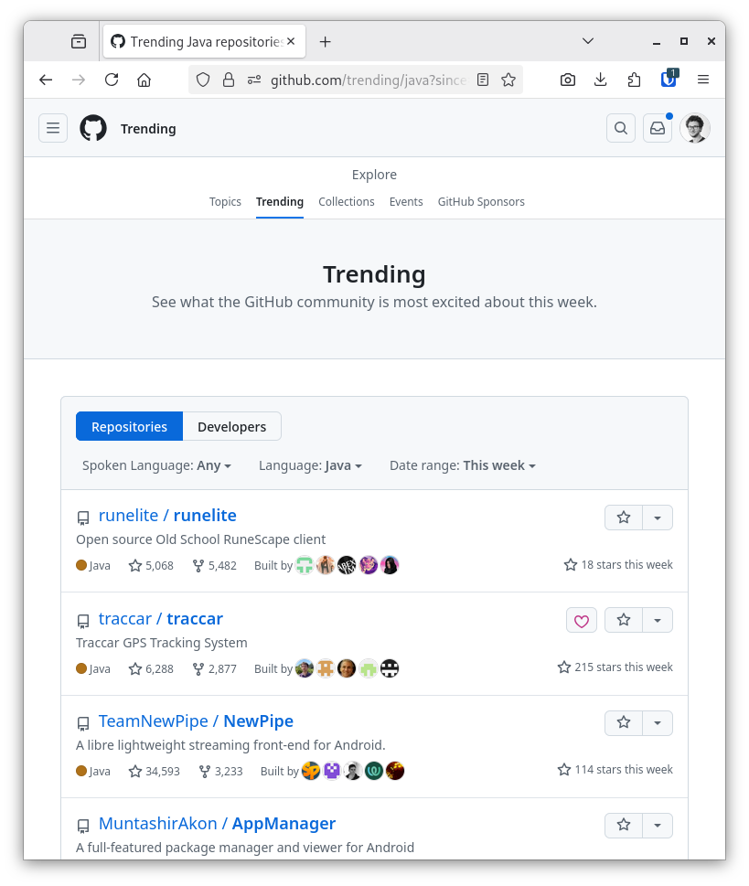
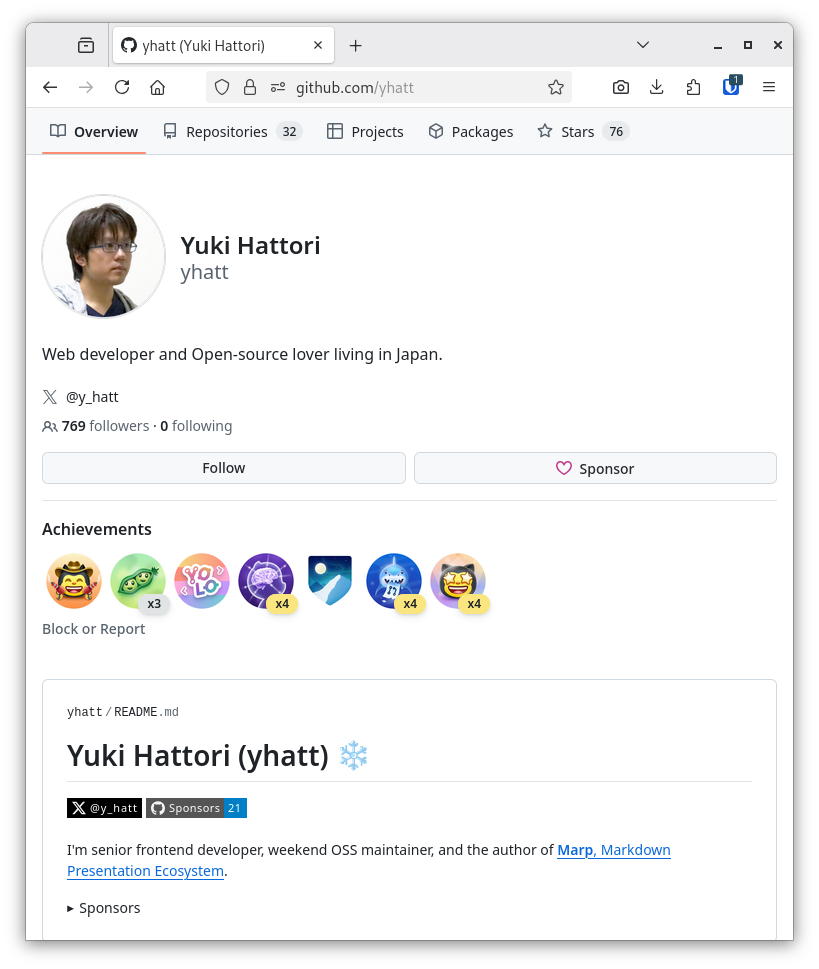

<!--
theme: custom-marp-theme
size: 16:9
paginate: true
author: L. Delafontaine and H. Louis, with the help of GitHub Copilot
title: HEIG-VD DAI - Git, GitHub and Markdown
description: Git, GitHub and Markdown for the DAI course at HEIG-VD, Switzerland
header: '[**Git, GitHub and Markdown**](https://github.com/heig-vd-dai-course/heig-vd-dai-course/tree/main/01.03-git-github-and-markdown)'
footer: '[**HEIG-VD**](https://heig-vd.ch) - [DAI 2025-2026](https://github.com/heig-vd-dai-course/heig-vd-dai-course) - [CC BY-SA 4.0](https://github.com/heig-vd-dai-course/heig-vd-dai-course/blob/main/LICENSE.md)'
headingDivider: 6
-->

# Git, GitHub and Markdown

<!--
_class: lead
_paginate: false
-->

[Link to the course][course]

<small>L. Delafontaine and H. Louis, with the help of
[GitHub Copilot](https://github.com/features/copilot).</small>

<small>This work is licensed under the [CC BY-SA 4.0][license] license.</small>

![bg opacity:0.1][illustration]

## Objectives

- Understand how to use Git, GitHub and Markdown.
- Create and manage repositories on GitHub.
- Write and format documentation using Markdown.
- Share and collaborate effectively using Git and GitHub and their features.

## Git

<!-- _class: lead -->

More details for this section in the [course][course]. You can find other
resources and alternatives as well.

### Git

- A version control system (VCS).
- Created in 2005 by Linus Torvalds.
- Efficiently tracks changes in files.
- Used to manage source code and documentation within a project.

### Architecture

- Git operates with a client-server structure:
  - Remote repositories (server).
  - Local repositories (local copies known as _clones_).
- Fully distributed VCS for offline work: each clone contains the full history.

### Commits, hashes and tags

- Commits represent snapshots of the repository.
- Each commit has a unique, unalterable hash.
- Tags serve as references, often for releases.
- Commit signing enhances security.

### Branches

- Tracks distinct repository versions.
- Default branch is typically named `main`.
- Branches have names and commit pointers (heads).
- Allow to work on features or bug fixes without affecting the main branch.

### Merging branches

- Collaborative project workflow.
- Three primary merging methods:
  - Merge.
  - Rebase.
  - Squash.
- In this course, you will focus on the merge method.

### Conflicts

- Arise from simultaneous file edits.
- Git detects and requires resolution.
- Conflicts must be resolved to decide which changes to keep.
- It can be tricky but is a crucial skill.

### Ignore files

- gitignore files omit specific files that should not be on the repository.
- Improves repository cleanliness and security (avoid sensitive data leaks).
- Tip: avoid online gitignore generators, they generate a lot of unnecessary
  rules.

### Summary

- Git is a distributed VCS.
- Git uses commits to track changes.
- Git uses branches to track different versions of the repository.
- Git can pull changes from a remote repository.
- Git can merge, rebase or squash branches/commits.
- Git can detect and resolve conflicts.

**We encourage you to learn how to use Git from the command line, so you can
still use it everywhere (even on a server).**

## GitHub

<!-- _class: lead -->

More details for this section in the [course material][course]. You can find
other resources and alternatives as well.

### GitHub

- Git hosting platform.
- Created in 2008.
- Web-based Git hosting.
- Popular for open source projets.

### Social platform

- Social interactions:
  - Follow users.
  - Star projects.
  - Discover new projects.
- Forking repositories.
  - Create a copy of a repository.
  - Make changes and contribute back.

### Free features and PRO features

- Enhanced features with PRO (access to premium features and software).
- Free for students - you can apply!

### Users and organizations

- Users or organizations ownership.
- Users can be part of multiple organizations.

### Issues, pull requests and forks

- Contribution workflow.
  - Issues.
  - Forks.
  - Pull requests.
- Approval process.
- Project management tools (wiki, planning, etc.).

### Summary

The whole process would be as follows:

1. Open an issue to discuss the feature (optional, but recommended).
2. Clone or fork the project and checkout to a new branch.
3. Make your changes, commit and push them as often as you want.
4. Create the pull request.
5. The maintainers review and merge if OK.
6. You can delete the branch or the fork.

## Markdown

<!-- _class: lead -->

More details for this section in the [course material][course]. You can find
other resources and alternatives as well.

### Markdown

- Lightweight markup language.
- Created by John Gruber and Aaron Swartz in 2004.
- Simple and versatile.
- Used by many platforms and tools.

### Markdown and output formats

- Multiple output formats.
- Supports HTML integration.
- Used in web pages, presentations, documentation.

### Syntax

- Markup language with special characters (`#`, `*`, `-`, `[]`, `!` `_`, etc.).
- Discord and Telegram uses Markdown for formatting.
- Supports headings, text formatting, code blocks, lists, links, images, and
  tables.

### Specifications

- No single standard.
- CommonMark and GitHub Flavored Markdown are the most popular.
- Custom extensions for additional features on some platforms.

### Summary

- Markdown is easy to learn and use.
- Markdown can be used to create documentation.
- Markdown can be used to create slides.
- Markdown can be exported to many formats.

## Questions

<!-- _class: lead -->

Do you have any questions?

## Practical content

<!-- _class: lead -->

### What will you do?

- Install and configure Git.
- Create and configure your GitHub account.
- Create your own GitHub profile README.
- Add yourself to the GitHub repository README.

### Now it's your turn!

- Read the course material.
- Do the practical content.
- Ask questions if you have any.

➡️ [Find the course on GitHub][course].

**Do not hesitate to help each other! There's no need to rush!**

![bg right w:75%][course-qr-code]

## Finished? Was it easy? Was it hard?

Can you let us know what was easy and what was difficult for you during this
chapter?

This will help us to improve the course and adapt the content to your needs. If
we notice some difficulties, we will come back to you to help you.

➡️ [GitHub Discussions][discussions]

You can use reactions to express your opinion on a comment!

## Sources

- Main illustration by [Roman Synkevych](https://unsplash.com/@synkevych) on
  [Unsplash](https://unsplash.com/photos/wX2L8L-fGeA)
- Illustration by [Aline de Nadai](https://unsplash.com/@alinedenadai) on
  [Unsplash](https://unsplash.com/photos/j6brni7fpvs)
- Git logo by [Git](https://git-scm.com/)
- Git illustrations by [Atlassian](https://www.atlassian.com/) -
  [1](https://www.atlassian.com/git/tutorials/what-is-git),
  [2](https://www.atlassian.com/git/tutorials/refs-and-the-reflog),
  [3](https://www.atlassian.com/git/tutorials/comparing-workflows/gitflow-workflow),
  [4](https://www.atlassian.com/git/tutorials/merging-vs-rebasing)
- Git strip by [xkcd](https://xkcd.com/1597/)

[course]:
	https://github.com/heig-vd-dai-course/heig-vd-dai-course/tree/main/01.03-git-github-and-markdown
[license]:
	https://github.com/heig-vd-dai-course/heig-vd-dai-course/blob/main/LICENSE.md
[discussions]: https://github.com/orgs/heig-vd-dai-course/discussions/2
[illustration]: ./images/main-illustration.jpg
[course-qr-code]:
	https://quickchart.io/qr?format=png&ecLevel=Q&size=400&margin=1&text=https://github.com/heig-vd-dai-course/heig-vd-dai-course/tree/main/01.03-git-github-and-markdown
