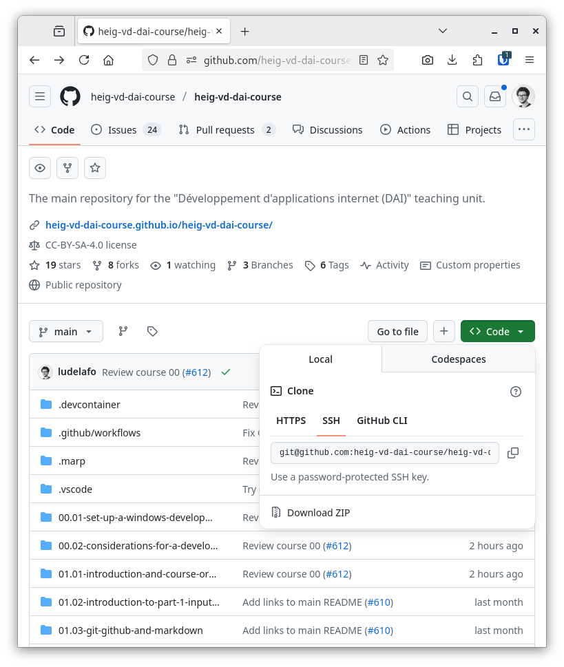
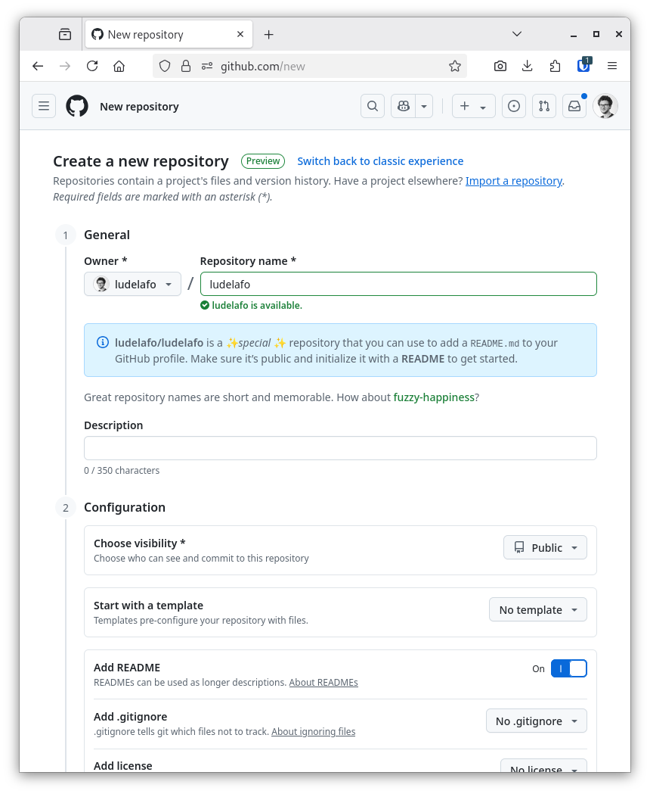

# Git, GitHub and Markdown


L. Delafontaine and H. Louis, with the help of
[GitHub Copilot](https://github.com/features/copilot).

This work is licensed under the [CC BY-SA 4.0][license] license.

## Resources

- Objectives, teaching and learning methods, and evaluation methods:
  [Link to content](..)
- Course material: [Link to content](../01-course-material/README.md) ·
  [Presentation (web)](https://heig-vd-dai-course.github.io/heig-vd-dai-course/01.03-git-github-and-markdown/01-course-material/index.html)
  ·
  [Presentation (PDF)](https://heig-vd-dai-course.github.io/heig-vd-dai-course/01.03-git-github-and-markdown/01-course-material/01.03-git-github-and-markdown-presentation.pdf)

## Table of contents

- [Resources](#resources)
- [Table of contents](#table-of-contents)
- [Introduction to your first course](#introduction-to-your-first-course)
- [Objectives](#objectives)
- [Git](#git)
  - [Architecture](#architecture)
  - [Commits, hashes and tags](#commits-hashes-and-tags)
  - [Branches](#branches)
  - [Merging branches](#merging-branches)
  - [Conflicts](#conflicts)
  - [Ignore files](#ignore-files)
  - [Summary](#summary)
  - [Cheat sheet](#cheat-sheet)
  - [Alternatives](#alternatives)
  - [Resources](#resources-1)
- [GitHub](#github)
  - [Social platform](#social-platform)
  - [Free features and PRO features](#free-features-and-pro-features)
  - [Users and organizations](#users-and-organizations)
  - [Issues, pull requests and forks](#issues-pull-requests-and-forks)
  - [Summary](#summary-1)
  - [Alternatives](#alternatives-1)
  - [Resources](#resources-2)
- [Markdown](#markdown)
  - [Markdown and output formats](#markdown-and-output-formats)
  - [Syntax](#syntax)
  - [Specifications](#specifications)
  - [Summary](#summary-2)
  - [Alternatives](#alternatives-2)
  - [Resources](#resources-3)
- [Practical content](#practical-content)
  - [Create and configure your GitHub account](#create-and-configure-your-github-account)
  - [Install and configure Git](#install-and-configure-git)
  - [Enable SSH authentication](#enable-ssh-authentication)
  - [Sign commits with SSH](#sign-commits-with-ssh)
  - [Add yourself to the list of students in the GitHub repository](#add-yourself-to-the-list-of-students-in-the-github-repository)
  - [Create your own profile README](#create-your-own-profile-readme)
  - [Explore the teaching unit repository](#explore-the-teaching-unit-repository)
  - [Go further](#go-further)
- [Conclusion](#conclusion)
  - [What did you do and learn?](#what-did-you-do-and-learn)
  - [Test your knowledge](#test-your-knowledge)
- [Finished? Was it easy? Was it hard?](#finished-was-it-easy-was-it-hard)
- [Additional resources](#additional-resources)
- [Sources](#sources)

## Introduction to your first course

Welcome to the first course of the teaching unit!

Each of the courses of this teaching unit will follow quite the same structure:

- A short introduction to the topic with its objectives;
- A theoretical part to explain the topic;
- A practical part to apply what you learned;
- A conclusion part to summarize what you did and learned and to test your
  knowledge;
- A quick feedback section to let us know if it was easy or hard and how we can
  improve;
- Additional resources to go further as well as the sources used to create the
  course.

This allows you to start with whatever works better for you: the theoretical
followed by the practical, or the practical followed with the theoretical part
in parallel.

While reading the courses, you might find what is called _"admonitions"_ or
_"alerts"_.

They look like this:

> [!NOTE]
>
> Hey! I'm a note! Glad you read me!

They are here to highlight important information that you should take into
account.

Here are the different types of admonitions you might find and their meaning:

> [!NOTE]
>
> Highlights information that users should take into account, even when
> skimming.

> [!TIP]
>
> Optional information to help a user be more successful.

> [!IMPORTANT]
>
> Crucial information necessary for users to succeed.

> [!WARNING]
>
> Critical content demanding immediate user attention due to potential risks.

> [!CAUTION]
>
> Negative potential consequences of an action.

We might redirect you to some official documentation or external resources to
follow to set up your environment or to learn more about a specific topic.

These external resources are here to help you. We redirect you to them to avoid
repeating what is already well maintained and explained elsewhere.

We try our best to keep the content as up-to-date as possible. If you find
something that is not up-to-date, do not hesitate to open a discussion, an
issue, a pull request to fix it.

What you see and do in a current course might be used in a future course.

This is why it is important to follow the steps and to understand what you are
doing. You must keep the code you write, the documentation you create and the
builds you make.

What you see is the result of many hours of work to provide you with the best
content possible. We hope you will enjoy it and learn a lot!

However, if _anything_ is unclear, does not work or needs an improvement, do not
hesitate to ask questions or give feedback in the GitHub Discussions as
described in the
[Finished? Was it easy? Was it hard?](#finished-was-it-easy-was-it-hard)
section. Since this is the first course, do not hesitate to do so.

The teaching staff considers that there is no stupid question. You are here to
learn and we are here to help you! Let's work as a team so that you can succeed!

Final note: we try our best to provide you working instructions and right
information. However, if something is wrong, we might need to update the content
to fix it. We will inform you but you might need to come back and check the
updated content. We apologize in advance if this situation happens.

Let's get started!

## Objectives

This course will help you to understand how Git and GitHub work, how you can use
Markdown to write various documents from documentation to profiles, and how to
use some of the features of Git/GitHub such as GitHub Discussions, the main
place to ask questions in this course.

These skills are essential for the rest of the course (and your future!), as you
will use Git and GitHub to submit your practical works and to collaborate with
your team.

You will also learn how to create your own profile README on GitHub and add
yourself to the GitHub Organization of the course using a common Git workflow.

This is a great way to present yourself and your work to the world! Being part
of the course organization will also allow you to be notified by the teachers
when something important happens through the use of GitHub Teams and GitHub
Discussions.

In a nutshell, by the end of this course, you will be able to:

- Understand how to use Git, GitHub and Markdown.
- Create and manage repositories on GitHub.
- Write and format documentation using Markdown.
- Share and collaborate effectively using Git and GitHub and their features.

## Git

> Git is a free and open source distributed version control system (VCS)
> designed to handle everything from small to very large projects with speed and
> efficiency.
>
> <https://git-scm.com/>

Created by Linus Torvalds in 2005 to manage the Linux kernel source code, Git
allows to track changes in any set of files, usually used for coordinating work
among programmers during software development.

### Architecture

Git is a client-server system, where the server is called a _"repository"_ and
the clients are called _"clones"_.

The repository is the single source of truth, and the clones are the local
copies of the repository.

Git is a distributed VCS, which means that each clone is a full copy of the
repository. This allows to work offline.

### Commits, hashes and tags

Git uses _"commits"_ to track changes. A commit is a snapshot of the repository
at a given time. Each commit has a unique identifier, called a hash. The hash is
computed from the content of the commit, so it is impossible to modify a commit
without changing its hash.

Commits can be tagged to create a reference to a commit. This is often used to
mark a commit as a release.

Commits can be signed to prove that the commit was made by a specific person.
This is done for security reasons. It means that the commit was signed by the
author and adds a layer of security to the commit and confidence to the users of
the repository.

### Branches

Git uses _"branches"_ to track different versions of the repository. The default
branch is often called `main` (the legacy name was `master`).

Each branch has a name and a pointer to a commit. The pointer is called a head.
The head of the main branch is called `HEAD`.

Often, when implementing a new feature, a new branch is created. This is done by
creating a new branch from the main branch.

Once you made all the changes, the modified files are _"staged"_ and a new
commit is created. The commit is then pushed to the repository.

Commits can be compared to see the differences between the staged files and the
working directory. This is done by comparing the files with the last commit.

Commits can be pulled from the repository into the current branch.

### Merging branches

Collaborating on a project is done by creating branches, making and committing
changes, pushing and merging the branches back into the target branch.

There are three main ways to merge branches:

- **Merge**: merge the changes from the two branches into a new commit. This is
  the default behavior of Git.
- **Rebase**: append the source branch to the target branch so no new commits
  are created. This is a more advanced technique.
- **Squash**: combine multiple commits into a single one to reduce the number of
  commits in a branch.

### Conflicts

Working collaboratively can lead to _"conflicts"_. Conflicts happen when two or
more people make changes to the same file at the same time. Git is able to
detect conflicts and will ask the user to resolve them.

### Ignore files

Files can be ignored by Git. This is done by creating a `.gitignore` file at the
root of the repository. This allows to avoid committing files that should not be
committed, such as IDE configuration files.

We encourage you **not** to use gitignore generators (such as
<https://gitignore.io/>), as they often add too many files to the ignore list.
It is better to add files to the ignore list as you need it.

We think it is a good practice to ignore all binary files and to only commit
source files. This allows to keep the repository small and to avoid conflicts.

Files can be ignored by name, by extension or by pattern. The syntax is very
similar to the one used in the terminal.

Here is an example of a `.gitignore` file:

```gitignore
# Ignore all text files inside the repository
*.txt

# Except the input files in the `example` directory
!examples/**/*_input.txt

# Ignore the `target` directory at the root level of the gitignore file but not the others `target` directories
/target/
```

More information about gitignore can be found in the official documentation:
<https://git-scm.com/docs/gitignore>.

### Summary

- Git is a distributed VCS.
- Git uses commits to track changes.
- Git uses branches to track different versions of the repository.
- Git can pull changes from a branch into another.
- Git can merge, rebase or squash branches/commits.
- Git can detect and resolve conflicts.

We encourage you to learn how to use Git from the command line, so you can still
use it everywhere (even on a server).

### Cheat sheet

```sh
# Clone a Git repository
git clone <url>

# Create a branch and switch to it
git checkout -b <branch-name>

# Switch to a branch
git checkout <branch-name>

# Add changes to the staging area
git add <file>

# View differences between the working directory and the staging area
git diff <file>

# Check Git status
git status

# Commit changes
git commit -m "Commit message"

# Push changes to a branch
git push origin <branch-name>

# Pull changes from a branch
git pull origin <branch-name>

# Merge a branch into another
git merge <branch-name>
```

### Alternatives

_Alternatives are here for general knowledge. No need to learn them._

- [Subversion](https://subversion.apache.org/)
- [Mercurial](https://www.mercurial-scm.org/)
- [Bazaar](https://bazaar.canonical.com/en/)

_Missing item in the list? Feel free to open a pull request to add it! ✨_

### Resources

_Resources are here to help you. They are not mandatory to read._

- [Atlassian Git tutorials - Beginner](https://www.atlassian.com/git/tutorials/what-is-version-control) -
  Atlassian tutorials are great!
- [Atlassian Git tutorials - Getting started](https://www.atlassian.com/git/tutorials/setting-up-a-repository)
- [Atlassian Git tutorials - Collaborating](https://www.atlassian.com/git/tutorials/syncing)
- [Atlassian Git tutorials - Advanced Tips](https://www.atlassian.com/git/tutorials/advanced-overview)
- [Learn Git Branching](https://learngitbranching.js.org/)

_Missing item in the list? Feel free to open a pull request to add it! ✨_

## GitHub

> GitHub is a platform and cloud-based service for software development and
> version control using Git, allowing developers to store and manage their code.
>
> <https://github.com>

GitHub is a web-based Git repository hosting service. It provides all the
features of Git, plus some additional features.

It is the most popular Git repository hosting service, with more than 372
million repositories (January 2023), a home for many open source projects and a
place where many companies host their private repositories.

### Social platform

GitHub is a social platform. It allows to follow other users and to star
repositories. It also allows to fork repositories, which means to create a copy
of a repository in your own account.

### Free features and PRO features

GitHub offers features on top of Git. Some features are only available for
public repositories. To enable them for private repositories, you need to
upgrade to a PRO account, which is not free.

As a HEIG-VD student, you can get a PRO account for free with the
[GitHub Global Campus for students](https://docs.github.com/en/education/explore-the-benefits-of-teaching-and-learning-with-github-education/github-global-campus-for-students)
program.

### Users and organizations

Repositories can be owned by a _"user"_ or by an _"organization"_.

An organization can have multiple members, and repositories can be shared
between members. It is a good practice to create an organization for a project
that will be worked on by multiple people.

### Issues, pull requests and forks

GitHub also provides a wiki for each repository, a project board to manage
tasks, an issue tracker to report bugs and a pull request system to review and
merge changes.

Issues are used to track bugs, tasks, or feature requests. They can be assigned
to a user, labeled, and commented on.

Pull requests are used to propose changes to a repository. They can be reviewed
and discussed before being merged into the target branch.

Forks are used to create a copy of a repository in your own account. This is
often used to propose changes to a repository when you do not have write access
to it.

Contributing to a project hosted on GitHub is done by cloning the repository (or
forking the repository if you are not part of the repository), making changes
and opening a _"pull request"_ to merge the changes back into the original
repository.

Once a branch is ready to be merged into the target branch, it is good practice
to open a pull request (or a _"merge request"_ in other systems, such as
GitLab).

Reviewing a pull request is done by commenting on the changes. The reviewer can
ask for changes to be made before merging the branch or can approve the changes.

Once the pull request is approved, the branch can be merged into the target
branch.

By default, GitHub does not delete the branch once it is merged. You might want
to enable this by default in your repository settings or delete it manually. It
avoids to cumulate out-dated branches in your repository.

### Summary

The whole process would be as follows:

1. Open an issue to discuss the feature (optional, but recommended).
2. Clone or fork the project and checkout to a new branch.
3. Make your changes, commit and push them as often as you want.
4. Create the pull request.
5. The maintainers review and merge if OK.
6. You can delete the branch or the fork.

### Alternatives

_Alternatives are here for general knowledge. No need to learn them._

- [GitLab](https://gitlab.com/) - Ludovic's personal favorite
- [Bitbucket](https://bitbucket.org/) - Ludovic's least favorite
- [Gitea](https://gitea.io/) - Very good self-hosted alternative
- [Forgejo](https://forgejo.org/) - A community owned soft fork of Gitea with
  upcoming support of [forge federations](https://forgefed.org/) (see more with
  the [ForgeFriends project](https://forgefriends.org/)).
- [Gogs](https://gogs.io/)

_Missing item in the list? Feel free to open a pull request to add it! ✨_

### Resources

_Resources are here to help you. They are not mandatory to read._

- [GitHub's Start your journey](https://docs.github.com/en/get-started/start-your-journey) -
  A great resource to learn the basics of GitHub!

_Missing item in the list? Feel free to open a pull request to add it! ✨_

## Markdown

> Markdown is a lightweight markup language for creating formatted text using a
> plain-text editor.
>
> <https://daringfireball.net/projects/markdown/>

Markdown was created by John Gruber in 2004 with the help of Aaron Swartz
(co-founder of Reddit and an Internet hacktivist). It is a simple markup
language that allows to create formatted text using a plain-text editor.

It is widely used on the Internet, especially on GitHub, and GitLab. It is also
used in many static site generators, such as [Hugo](https://gohugo.io/) and
[MkDocs](https://www.mkdocs.org/).

### Markdown and output formats

The syntax of Markdown is very simple and easy to learn. It is a good
alternative to HTML for creating simple web pages, documentation, README files,
etc. The extension of a Markdown file is `.md`.

You can export Markdown files to HTML, PDF, DOCX, etc. making it a very
versatile format.

It is also possible to use HTML in Markdown files, so it is possible to create
more complex documents.

In fact, the exact current document you are reading right now is written in
Markdown.

### Syntax

Markdown is a markup language, which means that it uses special characters to
format the text. It is very similar to the syntax used in Discord, Telegram,
WhatsApp, etc.

#### Headings

To create headings, use the `#` character. The number of `#` characters
determines the level of the heading.

```markdown
# Heading 1

## Heading 2

### Heading 3

#### Heading 4

##### Heading 5
```

#### Text formatting

Text formatting can be done using `*`, `_`, `~`, `` ` `` or `>` characters.

```markdown
_This is italic_ and _this as well_.

**This is bold** and **this as well**.

This is ~~strikethrough~~.

This is `inline code`.

> This is a quote
```

<details>
<summary>Display the results</summary>

_This is italic_ and _this as well_.

**This is bold** and **this as well**.

This is ~~strikethrough~~.

This is `inline code`.

> This is a quote

</details>

#### Code blocks

Code blocks can highlight code syntax for many languages. They are very useful
to write code snippets in documentation, README files, etc. To create a code
block, use three backticks (```). The language can be specified after the
opening backticks to enable syntax highlighting.

The language name is optional, but it is recommended to use it to enable syntax
highlighting.

````markdown
```java
System.out.println("Hello World!");
```

```javascript
console.log("Hello World!");
```

```python
print("Hello World!")
```
````

<details>
<summary>Display the results</summary>

```java
System.out.println("Hello World!");
```

```javascript
console.log("Hello World!");
```

```python
print("Hello World!")
```

</details>

#### Unordered lists

Unordered lists can be created using `-` or `*` characters.

```markdown
List one

- Item 1
- Item 2
- Item 3

List two

- Item 1
- Item 2
- Item 3
```

<details>
<summary>Display the results</summary>

List one

- Item 1
- Item 2
- Item 3

List two

- Item 1
- Item 2
- Item 3

</details>

#### Ordered lists

Ordered lists can be created using numbers followed by a `.` character.

```markdown
1. Item 1
2. Item 2
3. Item 3
```

<details>
<summary>Display the results</summary>

1. Item 1
2. Item 2
3. Item 3

</details>

#### Links

Links can link to local files, headings, or references.

A link can have a text and a URL. The text is optional, but it is recommended to
use it to make the link more readable. The URL can be a local file, a web page,
or a reference to a link defined elsewhere in the document.

```markdown
[GitHub](https://github.com/)

<https://gitlab.com>

[`README.md`](./README.md)

[Jump to "Markdown"](#markdown)

[HEIG-VD][heig-vd]

[heig-vd]: https://heig-vd.ch
```

<details>
<summary>Display the results</summary>

[GitHub](https://github.com/)

<https://gitlab.com>

[`README.md`](./README.md)

[Jump to "Markdown"](#markdown)

[HEIG-VD][heig-vd]

[heig-vd]: https://heig-vd.ch

</details>

#### Images

Images can be added using the same syntax as links, but with a `!` character in
front of the link. The text field will be used as the alt text for accessibility
and SEO.

```markdown


```

<details>
<summary>Display the results</summary>


</details>

#### Tables

Tables can be created using the `|` character to separate columns and `-`
characters to separate the header from the content. The header is optional. The
text alignment can be specified using `:` characters.

```markdown
| Header 1 | Header 2 | Header 3 |
| -------- | :------: | -------: |
| Cell 1   |  Cell 2  |   Cell 3 |
| Cell 4   |  Cell 5  |   Cell 6 |
```

<details>
<summary>Display the results</summary>

| Header 1 | Header 2 | Header 3 |
| -------- | :------: | -------: |
| Cell 1   |  Cell 2  |   Cell 3 |
| Cell 4   |  Cell 5  |   Cell 6 |

</details>

#### Horizontal rules

Horizontal rules can be used to separate sections with `---`.

```markdown
---
```

<details>
<summary>Display the results</summary>

---

</details>

#### HTML

HTML can be used in Markdown files. This allows to create more complex
documents. It is also possible to use CSS to style the document. This is not
covered in this course and I would not recommend it as the goal of Markdown is
to be simple.

If you have a look at the source code of this document (the Markdown version on
GitHub), you will see that it is written in Markdown and some elements are
written in HTML.

```html
<!-- This is a comment -->

<details>
	<summary>Toggle to view content</summary>

	My content is hidden until you click on the summary.
</details>
```

<details>
<summary>Display the results</summary>

<details>
<summary>Toggle to view content</summary>

My content is hidden until you click on the summary.

</details>

</details>

### Specifications

Markdown is not a standard and there are many implementations. The most popular
one is [CommonMark](https://commonmark.org/). GitHub uses a slightly different
version called [GitHub Flavored Markdown](https://github.github.com/gfm/).

Some projects use custom extensions to add more features to Markdown. For
example:

- [Material for MkDocs](https://squidfunk.github.io/mkdocs-material/) uses
  custom extensions to add more features to Markdown.
- [Marp](https://marp.app/) uses a custom syntax to manage background images in
  slides.

### Summary

- Markdown is easy to learn and use.
- Markdown can be used to create documentation.
- Markdown can be used to create slides.
- Markdown can be exported to many formats:
  - For example, the presentations of this course are exported to Web and PDF
    with the help of [Marp](https://marp.app/).
  - For example, the course materials of this course are exported to PDF with
    the help of [Pandoc](https://pandoc.org/) and
    [weasyprint](https://weasyprint.org/).

### Alternatives

_Alternatives are here for general knowledge. No need to learn them._

- [reStructuredText](https://docutils.sourceforge.io/rst.html)
- [AsciiDoc](https://asciidoc.org/)
- [Textile](https://textile-lang.com/)
- [LaTeX](https://www.latex-project.org/) - You might want to consider this if
  you need to write a scientific paper and/or your bachelor/master thesis as it
  is the standard in the scientific community and much more powerful than
  Markdown.
- [Typst](https://typst.app/) - A new and modern alternative to LaTeX that is
  gaining popularity. It is still in beta, but it is worth keeping an eye on it.

_Missing item in the list? Feel free to open a pull request to add it! ✨_

### Resources

_Resources are here to help you. They are not mandatory to read._

- [Markdown Guide](https://www.markdownguide.org/) - Examples and explanations
  on Markdown specification
- [GitHub Flavored Markdown Spec](https://github.github.com/gfm/)
- [CommonMark Spec](https://commonmark.org/)

_Missing item in the list? Feel free to open a pull request to add it! ✨_

## Practical content

### Create and configure your GitHub account

GitHub is a social platform, home for many open source projects. You will use it
to publish your work and to collaborate with your team. It is a great visibility
tool for your career.

In this section, you will create and configure your GitHub account. If you
already have one, ensure that it is properly configured. Please avoid the use of
GitHub CLI/Desktop or any other application to manage your repositories to be
able to use Git everywhere.

#### Create a GitHub account

If you do not have a GitHub account yet, you will need to create one. We
recommend using your HEIG-VD email address to create your account.

Follow the official documentation to create your account:
<https://docs.github.com/en/get-started/signing-up-for-github/signing-up-for-a-new-github-account>.

> [!IMPORTANT]
>
> Do not forget to
> [verify your email address](https://docs.github.com/en/get-started/signing-up-for-github/verifying-your-email-address)!

#### Enable two-factor authentication (optional, but highly recommended)

Two-factor authentication adds an extra layer of security to your account. It
will require you to enter a code sent to your phone each time you log in to your
account.

Follow the official documentation to enable two-factor authentication:
<https://docs.github.com/en/authentication/securing-your-account-with-two-factor-authentication-2fa>.

#### Enable your PRO account

Having a PRO account will allow you to unlock all the features of GitHub and
other products, such as Copilot. As a HEIG-VD student, you can get a PRO account
for free.

Follow the official documentation to enable your PRO account:
<https://docs.github.com/en/education/explore-the-benefits-of-teaching-and-learning-with-github-education/github-global-campus-for-students>.

### Install and configure Git

Git will be used for the rest of the course to work collaboratively and to
submit your practical works. It is important to have it installed and configured
properly.

In this section, you will install Git on your system. If you already have it,
please check that it is up to date.

#### Install Git

Go to the official website and follow the instructions on how to install Git on
your system: <https://git-scm.com/downloads>.

> [!CAUTION]
>
> As you are using a Windows Subsystem for Linux (WSL), you must follow the
> instructions for Linux (Ubuntu).

#### Check the installation

Open a terminal and type `git --version`.

The output should be similar to this:

```text
git version 2.34.1
```

> [!WARNING]
>
> Ensure you have at least version 2.34.0 of Git installed. If you have an older
> version, you might not be able to use some features mentioned in this course.

#### Configure Git

Git needs to know your name and email address to be able to label your commits
properly.

> [!IMPORTANT]
>
> Use the same email address you used to create your GitHub account.

Open a terminal and type the following commands:

```sh
# Set your name
git config --global user.name "Your Name"

# Set your email address
git config --global user.email "Your Email"
```

### Enable SSH authentication

SSH is a secure protocol to communicate with a server. It is used to
authenticate users on GitHub. You will learn a bit more about SSH in a future
course. For the time being, using SSH with Git will enable you not have to input
your username and password each time you want to push or pull changes from a
repository, contrary to HTTPS.

In this section you will enable SSH authentication on your GitHub account.

#### Generate a SSH key

> [!CAUTION]
>
> As you are using a Windows Subsystem for Linux (WSL), you must follow the
> instructions for Linux (Ubuntu). By default, the Windows instructions are
> shown if you are on Windows.

Follow the official documentation to generate a SSH key:
<https://docs.github.com/en/authentication/connecting-to-github-with-ssh/generating-a-new-ssh-key-and-adding-it-to-the-ssh-agent>.

> [!CAUTION]
>
> Never share your private key with anyone! It must be kept secret and
> confidential, just like a password.
>
> The public key can be shared with anyone. It is used to verify that the
> private key was used to sign a message.
>
> If you ever lose your private key, it can be quite problematic. Have a backup
> of your SSH key pair in a safe place.

#### Add the public SSH key to your GitHub account

> [!CAUTION]
>
> As you are using a Windows Subsystem for Linux (WSL), you must follow the
> instructions for Linux (Ubuntu). By default, the Windows instructions are
> shown if you are on Windows.

Follow the official documentation to add the public SSH key to your GitHub
account:
<https://docs.github.com/en/authentication/connecting-to-github-with-ssh/adding-a-new-ssh-key-to-your-github-account>.

#### Validate the Git configuration

You can check that your Git configuration is correct by running the following
command:

```sh
# Check the Git configuration
git config --list
```

This command reads the Git configuration (stored in `~/.gitconfig`) and displays
it in the terminal.

The output should be similar to this:

```text
user.email=ludovic.delafontaine@gmail.com
user.name=Ludovic Delafontaine
```

**If you do not have this output, it means that your Git configuration is
incorrect.** Read the previous sections to ensure that you have followed the
instructions correctly.

#### Test the configuration

You can try to clone this very repository using SSH:

```sh
# Clone the course repository using SSH in a directory named "heig-vd-dai-course"
git clone git@github.com:heig-vd-dai-course/heig-vd-dai-course.git "heig-vd-dai-course"
```

If you are able to clone the repository, it means that your SSH key is properly
configured.

The URL of a repository can be found in the **Code** tab of the repository, as
shown in the following screenshot:



> [!IMPORTANT]
>
> By default, GitHub will show you the HTTPS URL. You need to click on the
> **SSH** tab to see the SSH URL.

### Sign commits with SSH

Signing commits is a good practice to prove that you are the author of a commit.

In this section, you will sign all your commits with SSH (source:
<https://docs.github.com/en/authentication/managing-commit-signature-verification/about-commit-signature-verification#ssh-commit-signature-verification>).

#### Add a new SSH signing key to your GitHub account

> [!CAUTION]
>
> As you are using a Windows Subsystem for Linux (WSL), you must follow the
> instructions for Linux (Ubuntu). By default, the Windows instructions are
> shown if you are on Windows.

Follow the official documentation to add a new SSH signing key to your GitHub
account:
<https://docs.github.com/en/authentication/connecting-to-github-with-ssh/adding-a-new-ssh-key-to-your-github-account>.

> [!TIP]
>
> You can use the same public SSH key as the one used to authenticate yourself.
>
> Just add the SSH key as a **signing key**.

#### Tell Git to sign commits with SSH

> [!CAUTION]
>
> As you are using a Windows Subsystem for Linux (WSL), you must follow the
> instructions for Linux (Ubuntu). By default, the Windows instructions are
> shown if you are on Windows.

Follow the official documentation to tell Git about your SSH key:
<https://docs.github.com/en/authentication/managing-commit-signature-verification/telling-git-about-your-signing-key#telling-git-about-your-ssh-key>.

#### Enable commit signing in your Git configuration

Git can sign commits on demand or automatically. It is more convenient to sign
commits automatically.

You can enable signing commits automatically by setting the `commit.gpgSign`
configuration to `true` (source:
<https://docs.github.com/en/authentication/managing-commit-signature-verification/signing-commits>).

```sh
# Enable commit signing
git config --global commit.gpgSign true
```

#### Validate the Git configuration

You can check that your Git configuration as mentioned in the previous section.

The output should be similar to this:

```text
user.email=ludovic.delafontaine@gmail.com
user.name=Ludovic Delafontaine
user.signingkey=/home/ludelafo/.ssh/id_ed25519
gpg.format=ssh
commit.gpgsign=true
```

**If you do not have this output, it means that your Git configuration is
incorrect.** Read the previous sections to ensure that you have followed the
instructions correctly.

### Add yourself to the list of students in the GitHub repository

In this section, you will add yourself to the list of students in the GitHub
repository using a workflow we have named the _"**Issues** > **Pull requests
(PRs)** > **Review** > **Merge**"_ workflow. This will allow you to exercise an
efficient Git workflow that you will use throughout the course for your
practical works with the rest of your team.

#### Create a new issue

Create a new issue in the
<https://github.com/heig-vd-dai-course/heig-vd-dai-course> repository describing
what you want to do:

- **Title**: Add \<first name\> \<last name\> to the list of students (replace
  `<first name> <last name>` with your information)
- **Description**: I would like to add myself to the list of students in the
  GitHub repository.

> [!TIP]
>
> While totally optional, it is good practice to create an issue before starting
> to work on any new feature.
>
> It allows to discuss the feature with the maintainers of the project. Maybe
> the maintainers have some ideas on how to implement the feature or maybe the
> feature is already planned and you can help them!
>
> This avoids to waste time on a feature that will not be implemented or two
> people working on the same feature at the same time.

Once the issue is created, the teaching staff will be notified. If everything is
fine, they will:

1. Add you as a collaborator to the GitHub organization.
2. Assign you the issue once you have accepted the invitation to collaborate.
3. You can start working on it by adding yourself to the list of students.

<details>
<summary>Checklist for the maintainers</summary>

Check the following elements:

- [x] Add the student as a collaborator to the GitHub organization.
- [x] Assign the student to the right team.
- [x] Assign the issue to the student.

</details>

#### Wait and accept the invitation to collaborate

Once the issue is created, the teaching staff will review it and add you as a
member of the GitHub organization.

You should receive an email notification to accept the invitation to collaborate
on the repository.

Accept the invitation to collaborate on the repository.

The teaching staff will reply to your issue to let you know that you have been
added as a collaborator.

> [!NOTE]
>
> Adding you as a collaborator to the GitHub organization and assigning you the
> issue is done by the teaching staff. It is not done automatically when you
> create the issue.
>
> As it can take some time for the teaching staff to review the issue and add
> you as a collaborator, please be patient. For the time being, you can start
> the [Create your own profile README](#create-your-own-profile-readme) section.
>
> Once the teaching staff has added you as a collaborator, you can continue with
> the next sections.

#### Change the membership visibility of the organization (optional)

If you want, you can change the visibility of your membership in the GitHub
organization. You can choose between public and private.

You can do so by going in the settings of the organization and then in the
**Membership** tab.

This will allow other users to see your membership in the organization. They
will be able to see your username and the date you joined the organization.

This is totally optional. You can keep your membership private if you want.

#### Create a branch from the issue

Once the issue has been assigned to you, you can start working on it.

Adding features to a repository can be done by creating a new branch.

A branch is a separate version of the repository that allows you to work on a
feature without affecting the main branch (usually called `main`).

A branch can be created locally (from your computer) or remotely (on the
server). A branch can start from the main branch or from any another branch.

GitHub has a feature to create a branch directly from an issue. This is a
convenient way to create a branch for an issue. It will automatically create a
branch with the name of the issue.

Create a new branch from the issue by clicking on the **Create a branch** link
(bottom right) in the issue page as shown in the following screenshot:


This will open a dialog to create a new branch. The branch name will be
generated by GitHub based on the issue title.

The branch source allows you to choose the branch from which the new branch will
be created. By default, it is set to the `main` branch.

Leave all the fields as they are and click on the **Create branch** button:


#### Clone the repository locally

If you have not done it yet, clone the repository locally to get the latest
changes. If you have already cloned the repository, you can skip this step.

#### Checkout to the new branch

Once the branch is created from GitHub, you can checkout to it. This will switch
your local repository to the new branch. You can do this by running the
following command in your terminal:

```sh
# Get the latest changes from the remote repository
git fetch

# Checkout to the new branch
git checkout <branch-name>
```

#### Add yourself to the list of students

Add yourself to the list of students in the main `README.md` file.

Please add yourself in alphabetical order (by last name) as mentioned in the
HTML comment in the README file to the class you belong to:

```markdown
- <first name> <last name> [@<username>](https://github.com/<username>)
```

> [!IMPORTANT]
>
> As little as it seems, it is important to respect the alphabetical order. It
> helps us (the teaching staff) searching for someone when grading your work and
> answering your questions. Thanks!
>
> Do not remove the HTML comments in the README file.

> [!NOTE]
>
> If you are on WSL, you can exceptionally edit the `README.md` file directly
> through the Windows File Explorer by accessing the WSL filesystem. If you have
> cloned the repository without paying attention of the current directory you
> were in, you should find it in the `/home/<username>` directory.

#### Commit your changes

Now that you have added yourself to the list of students, you can commit your
changes.

You can check the status of your repository to see the changes you made:

```sh
# Check the status of the repository
git status
```

You should see that the `README.md` file has been modified.

You can also check the differences between the working directory and the staging
area:

```sh
# Check the differences between the working directory and the staging area
git diff README.md
```

You should see the changes you made to the `README.md` file.

If you are happy with your changes, you can add them to the staging area with
the following command:

```sh
# Add the staged files to the staging area
git add README.md
```

Commit the changes with an appropriate message:

```sh
# Commit the changes
git commit -m "Add myself to the list of students"
```

> [!TIP]
>
> There is not a clear convention on how to write commit messages. The most
> important thing is to be consistent. We have found using an infinitive verb
> followed by a short description of the changes to be a good practice.

#### Push your changes

Now that you have committed your changes, you can push them to the remote
repository. This will update the branch you created earlier on GitHub.

```sh
# Push the changes to the remote repository
git push
```

#### Open a pull request

Once you have pushed your changes, you can open a pull request to merge your
changes into the main branch.

To open a pull request, go to the **Pull requests** tab of the repository and
click on the **New pull request** button as shown in the following screenshot:


The title of the pull request should be filled automatically with the message of
the last commit. We consider this to be a bad practice. Instead,rename the pull
request to the title of the issue you created earlier:


Once the description is filled, click on the **Create pull request** button.

> [!TIP]
>
> If your pull request is not ready yet, you can mark it as a draft by clicking
> on the **Create draft pull request** button. This creates a draft pull request
> that informs the maintainers the work you want to add is not ready yet. When
> you are ready, you can mark it as ready by clicking on the **Ready for
> review** button.

Once the pull request is created, you might want to continue to work on the pull
request.

You can do so by pushing new commits to the branch. You can also add a comment
to the pull request if you want to discuss something with the maintainers.

#### Review the pull request

Once the pull request is created, you can review it to ensure that everything is
correct. You can check the changes you made, the files that were modified, and
the commit history:


You can also add comments to the pull request to discuss the changes with the
maintainers. This is a good practice to discuss the changes before merging them.

#### Ask for a review from the teaching staff

Once you are ready, add a comment with the usernames of the
[Teaching staff](https://github.com/orgs/heig-vd-dai-course/teams/teaching-staff)
team to let them know that your pull request is ready for review.

This will notify the teaching staff that you want them to review your pull
request.

#### Wait for review from the maintainers

The maintainers will review your pull request and might ask for changes if
needed.

> [!IMPORTANT]
>
> The review can take a few days. Please be patient. Come back to this section
> once the review is done. For the time being, you can start the
> [Create your own profile README](#create-your-own-profile-readme) section.
>
> Once the teaching staff has reviewed your work, you can continue with the next
> sections.

<details>
<summary>Checklist for the maintainers</summary>

Check the following elements:

- [x] The student is in the list of students.
- [x] The student is in alphabetical order.
- [x] The GitHub profile is mentioned next to the name of the student.
- [x] The issue is linked to the pull request, if not, link it yourself as the
      student do not have the rights to do so.

If they are conflicts because the students are editing the same lines, fix the
conflict yourself so the students can focus on the content. You can use the
GitHub web interface. Please be aware that GitHub can take some time to update
the changes even though you have resolved the conflict.

</details>

#### Make changes if needed

The maintainers might ask for changes. If they do, you will need to make the
changes locally, commit them and push them to the repository.

You can comment the pull request to let the maintainers know that you have made
the changes and that they can review it again.

Wait for the maintainers to review your changes again. They might ask for
further changes or approve the pull request.

#### Check the results

Once the pull request is approved and merged, you can check the results on the
repository README. You should see your name in the list of students! Congrats!

#### Delete the branch on the remote repository

Once a pull request is merged, the branch is not needed anymore. You should
delete it on the remote repository by clicking on the **Delete branch** button
in the pull request page.

However, you should notice that the branch has been deleted automatically by
GitHub.

This is an option we have enabled in the repository settings to keep the
repository clean.

By default, branches are not deleted automatically and you should delete them
yourself once a pull request is merged. This avoids to have obsolete branches in
the repository.

To enable this option in your own repositories you can check the official
documentation here:
<https://docs.github.com/en/repositories/configuring-branches-and-merges-in-your-repository/configuring-pull-request-merges/managing-the-automatic-deletion-of-branches>.

#### Fetch the remote changes

Fetch the changes to your local repository:

```sh
# Pull the changes
git fetch
```

Fetching will download the changes from the remote repository without the files.

It will display if new branches have been created or if new commits have been
added to existing branches.

#### Checkout to the main branch

Checkout to the main branch:

```sh
# Checkout to the main branch
git checkout main
```

#### Pull the changes

Pull the upstream changes to your local repository:

```sh
# Pull the changes
git pull
```

Now files will be downloaded to your local repository. Maybe some of your peers
have added themselves to the list of students!

You are now ready to start the cycle again!

You can optionally delete the branch you created earlier:

```sh
# Delete the branch
git branch -d <name of the branch>
```

This will delete the branch locally.

#### Summary

In this section, you have learned how to open an issue, create an issue, clone
the repository locally, create a new branch, make changes, commit them, push
them to the repository, create a pull request, wait for review, make changes if
needed and check the results. You have also learned how to fetch and pull
changes from a remote repository.

There are many ways to contribute to a project. This is just one of them that we
find easy to understand and to use.

Feel free to contribute to other projects using this workflow!

You are now ready to work professionally with Git and GitHub!

### Create your own profile README

Let's see more deeply how Git works by creating you own profile README on
GitHub.

This will allow you to create your first repository and to learn how to use Git
and GitHub when working on your own projects.

The GitHub profile README is a special repository that will be used to set your
GitHub profile. It is a great way to introduce yourself and to show your
interests.

An example of a profile README is shown in the following screenshot:


#### Create a new repository

Follow the official documentation to create a new repository for your profile
README:
<https://docs.github.com/en/account-and-profile/setting-up-and-managing-your-github-profile/customizing-your-profile/managing-your-profile-readme>.

An example of a new repository creation is shown in the following screenshot:



Once you have created your repository though the GitHub interface, you should
notice it contains a few files.

However, as your repository was initialized with a README file, it already
contains a commit. You can see the commit history by clicking on the **Commits**
link in the repository menu.

You can also see the commit hash (`61f7174`) and the author of the commit
(`ludelafo`), as shown in the following screenshot:


If you click on the commit hash, you will see the details of the commit with all
the changes made in the commit.

On the above screenshot, you can see that the commit has the
 badge.

If you have signed your commits, you will see the same badge on your commits. It
means that the commit was correctly signed by you.

#### Clone the repository locally

Clone your repository locally.

```sh
# Clone the repository using SSH
git clone <your github profile repository ssh url>
```

Using the terminal, navigate to the directory of the repository.

```sh
# Navigate to the repository directory
cd <your github profile repository name>
```

View the list of branches in the repository.

```sh
# View the list of all branches
git branch -a
```

The output should be similar to this:

```text
* main
  remotes/origin/HEAD -> origin/main
  remotes/origin/main
```

The `*` indicates the current branch. The `main` branch is the default branch.

The `remotes/origin/HEAD -> origin/main` and `remotes/origin/main` are remote
branches. The `origin` is the name of the remote repository.

Display the commit history of the repository.

```sh
# View the commit history
git log
```

The output should be similar to this:

```text
commit 20f87413aef2fe9ef296767e6db839b722b83532 (HEAD -> main, origin/main, origin/HEAD)
Author: Ludovic Delafontaine <ludovic.delafontaine@gmail.com>
Date:   Tue Jul 23 17:28:45 2024 +0200

    Initial commit
```

To quit the log, press `q`.

The commit hash is `20f87413aef2fe9ef296767e6db839b722b83532`. The commit was
made by `Ludovic Delafontaine` on `Tue Jul 23 17:28:45 2024 +0200`.

At the moment, the `20f87413` commit is the HEAD of the main branch, it means
that it is the last commit of the main branch.

#### Fill your profile

Fill the `README.md` file with the content you want to show on your profile
using Markdown using your favorite text editor.

> [!NOTE]
>
> Exceptionally, you can edit the `README.md` file directly through the Windows
> File Explorer by accessing the WSL filesystem. If you have cloned the
> repository without paying attention of the current directory you were in, you
> can find it in the `/home/<your username>` directory.

Feel free to be creative! You can add images, links, tables, etc.

Missing inspiration? There are plenty of generators to help you create your
profile README!

#### Commit your changes

Check the changes made to the `README.md` file.

```sh
# Check the changes made to the current branch
git status
```

The output should be similar to this:

```text
On branch main
Your branch is up to date with 'origin/main'.

Changes not staged for commit:
  (use "git add <file>..." to update what will be committed)
  (use "git restore <file>..." to discard changes in working directory)
        modified:   README.md

no changes added to commit (use "git add" and/or "git commit -a")
```

Check the differences between the working directory and the staging area.

```sh
# View the differences between the working directory and the staging area
git diff README.md
```

The output should be similar to this:

```diff
diff --git a/README.md b/README.md
index 7c46677..76e0528 100644
--- a/README.md
+++ b/README.md
@@ -1,2 +1,3 @@
-# new-repository-demo
-A repository to demonstrate the creation of a new repository.
+# How to create a new repository - demonstration
+
+A new line to my README file!
```

The `+` indicates the new line added to the `README.md` file.

The `-` indicates the line removed from the `README.md` file.

Add the `README.md` file to the staging area.:

```sh
# Add the staged files to the staging area
git add README.md
```

Check the staging area.

```sh
# Check the staging area
git status
```

The output should be similar to this:

```text
On branch main
Your branch is up to date with 'origin/main'.

Changes to be committed:
  (use "git restore --staged <file>..." to unstage)
        modified:   README.md
```

If multiple files were modified, you would only see the files that were added to
the staging area in the list of changes to be committed.

Commit the changes with an appropriate message:

```sh
# Commit the changes
git commit -m "Update profile README"
```

> [!TIP]
>
> There is not a clear convention on how to write commit messages. The most
> important thing is to be consistent. We have found using an infinitive verb
> followed by a short description of the changes to be a good practice.

Check the log to see the new commit.

```sh
# View the commit history
git log
```

The output should be similar to this:

```text
commit 2ea9f1c4d5ef42ee3cf1b0d3849a0445ad8d2683 (HEAD -> main)
Author: Ludovic Delafontaine <ludovic.delafontaine@gmail.com>
Date:   Tue Jul 23 18:33:12 2024 +0200

    Update profile README

commit 20f87413aef2fe9ef296767e6db839b722b83532 (origin/main, origin/HEAD)
Author: Ludovic Delafontaine <ludovic.delafontaine@gmail.com>
Date:   Tue Jul 23 17:28:45 2024 +0200

    Initial commit
```

You can notice that the new commit `2ea9f1c4` is the HEAD of the local `main`
branch.

The `origin/main` and `origin/HEAD` are still pointing to the `20f87413` commit
as their HEAD.

#### Push your changes

Push the changes to the repository:

> [!NOTE]
>
> You might see sometimes the following command `git push origin main`. This is
> just a more explicit way to push the changes to the `main` branch of the
> `origin` remote. `origin` is the default name of the remote when cloning a
> repository.

```sh
# Push the changes to the repository
git push
```

The output should be similar to this:

```text
Enumerating objects: 5, done.
Counting objects: 100% (5/5), done.
Delta compression using up to 16 threads
Compressing objects: 100% (2/2), done.
Writing objects: 100% (3/3), 581 bytes | 581.00 KiB/s, done.
Total 3 (delta 0), reused 0 (delta 0), pack-reused 0 (from 0)
To github.com:heig-vd-dai-course/new-repository-demo.git
   20f8741..2ea9f1c  main -> main
```

The output shows that the changes were pushed to the `main` branch of the remote
repository.

#### Check the results

Reload your GitHub profile and check the results. You should see your profile
README!

Check the log to see the history.

```sh
# View the commit history
git log
```

The output should be similar to this:

```text
commit 2ea9f1c4d5ef42ee3cf1b0d3849a0445ad8d2683 (HEAD -> main, origin/main, origin/HEAD)
Author: Ludovic Delafontaine <ludovic.delafontaine@gmail.com>
Date:   Tue Jul 23 18:33:12 2024 +0200

    Update profile README

commit 20f87413aef2fe9ef296767e6db839b722b83532
Author: Ludovic Delafontaine <ludovic.delafontaine@gmail.com>
Date:   Tue Jul 23 17:28:45 2024 +0200

    Initial commit
```

The `2ea9f1c4` commit is now the HEAD of all branches.

#### Share your profile in GitHub Discussions

Share your profile in the GitHub Discussions of this organization:
<https://github.com/orgs/heig-vd-dai-course/discussions>.

Create a new discussion with the following information:

- **Title**: [DAI 2025-2026 Class \<class ID\>] Check out my GitHub profile! -
  \<first name\> \<last name\> (replace `<class ID>`, `<first name>` and
  `<last name>` with your information, where `<class ID>` is either `A`, `B` or
  `C` depending on your class).
- **Category**: Show and tell.
- **Description**: The link to your GitHub profile README.

This will notify us that you have completed this section and we will check your
profile README!

#### Intentionally create a conflict

In the next section, you will intentionally create a conflict to learn how to
resolve it.

Checkout to a new branch and change a content of the `README.md` file. Remember
the line(s) you have changed (you will need it later) and commit:

```sh
# Checkout to a new branch
git checkout -b this-branch-will-create-a-conflict

# Make your changes

# Add the staged files to the staging area
git add README.md

# Commit the changes
git commit -m "This change was done on branch 'this-branch-will-create-a-conflict'"
```

> [!TIP]
>
> You might notice the use of the `-b` argument when checking out to the branch.
> This is because the branch does not already exists. If you try to checkout to
> a branch that does not exist, you will need to use the `-b` argument to create
> it.

Checkout to the main branch and make some changes to the `README.md` file.
Change the same line(s) number(s) you changed in the
`this-branch-will-create-a-conflict` branch but with a different content
(remember the line(s) you have changed). Commit the changes:

```sh
# Checkout to a new branch
git checkout main

# Make your changes

# Add the staged files to the staging area
git add README.md

# Commit the changes
git commit -m "This change was done on branch 'main'"
```

Now, try to merge the branch you just created:

```sh
# Merge the branch you just created
git merge this-branch-will-create-a-conflict
```

> [!NOTE]
>
> `git merge` will merge the changes from the branch you are merging into the
> current branch. In this case, you are merging the changes from the
> `change-title-of-readme-file` branch into the `main` branch.

You should see the following error:

```text
Auto-merging README.md
CONFLICT (content): Merge conflict in README.md
Automatic merge failed; fix conflicts and then commit the result.
```

#### Resolve the conflict

Git was not able to merge the changes automatically. This is called a _"merge
conflict"_. This happens when two or more people make changes to the same file
at the same time.

Open the file in your favorite IDE and you should see the conflict (search for
`<<<<<<<` characters).

The `HEAD` part is the content of the current branch. The
`this-branch-will-create-a-conflict` part is the content of the branch you are
trying to merge.

Replace the whole content back to its original state (or the state you want to
keep).

Once you are done, add the file to the staging area and commit the changes:

```sh
# Add the staged files to the staging area
git add README.md

# Commit the changes
git commit -m "Resolve the merge conflict"
```

Congratulations! You have resolved your first merge conflict!

#### Revert the commits

As this conflict was intentional, you can revert the commits to get back to the
original state of the repository before the intentional conflict.

Check the log to see the history of the repository:

```sh
# Check the log
git log
```

You should see the commits you made:

```text
commit 27fabbdb3b808bf3b32d25e72a388dc60c5bca24 (HEAD -> main)
Merge: 9061c5f eca5084
Author: Ludovic Delafontaine <ludovic.delafontaine@gmail.com>
Date:   Tue Sep 12 16:26:38 2023 +0200

    Resolve the merge conflict

commit 9061c5f37e41ea3664e1be4541af66b50444c64b
Author: Ludovic Delafontaine <ludovic.delafontaine@gmail.com>
Date:   Tue Sep 12 16:23:57 2023 +0200

    This change was done on branch 'main'

commit eca508463561e2f426eabec56a0208635c0b938c (this-branch-will-create-a-conflict)
Author: Ludovic Delafontaine <ludovic.delafontaine@gmail.com>
Date:   Tue Sep 12 16:21:14 2023 +0200

    This change was done on branch 'this-branch-will-create-a-conflict'

commit 7cfbc3c4d50e353e66cb235b06bf4376e69b3ddb (origin/main, main)
Author: Ludovic Delafontaine <ludovic.delafontaine@gmail.com>
Date:   Mon Sep 4 14:39:51 2023 +0200

    [Other changes made before the conflict]
```

The commit hashes are unique identifiers for each commit. They will, of course,
be different on your screen. They are used to identify a commit. They are also
used to create branches and tags.

As this conflict was intentional, you can revert the commits to get back to the
original state of the repository before the intentional conflict:

```sh
# Revert the commits
git reset --hard 7cfbc3c4d50e353e66cb235b06bf4376e69b3ddb
```

> [!WARNING]
>
> A `git reset --hard` will delete all the changes made since the commit you
> reset to. Be careful when using it! This is OK in this case as the conflict
> was intentional and no commits were pushed to the remote repository. If
> commits were pushed to the remote repository, you would need to use
> `git revert` instead.

#### Summary

In this section, you have learned how to create a repository, clone it locally,
make changes, commit them and push them to the repository.

You have also learned how to share your profile README in the GitHub Discussions
and resolve merge conflicts.

Feel free to update your profile README as you learn new things!

Feel also free to open any GitHub Discussions to ask questions or to share
interesting content!

The GitHub Discussions are a great way to interact with your peers and to learn
new things. This is where official announcements for the teaching unit will be
made. You should receive notifications when a new discussion is created and you
are mentioned.

### Explore the teaching unit repository

Take some time to explore the
[`heig-vd-dai-course/heig-vd-dai-course`](https://github.com/heig-vd-dai-course/heig-vd-dai-course)
repository. Familiarize yourself with the structure of the repository and the
content as this will accompany you throughout the entire semester.

### Go further

This is an optional section. Feel free to skip it if you do not have time.

- Go in the GitHub Discussions, check the others profiles and follow them! You
  will be able to see their activity on your GitHub feed (what they star, what
  they do, etc.)!
- Can you think of an open source project you like? Give them a star on GitHub!

## Conclusion

### What did you do and learn?

In this course, you have installed and configured Git properly. You have also
created your own GitHub account and profile README for your future social
profile as a computer scientist engineer.

Finally, you have added yourself to the list of students in the GitHub
organization using the _"**Issues** > **Pull requests (PRs)** > **Review** >
**Merge**"_ workflow, enabling you to contribute to other projects in the
future. For instance, you can contribute to the
[heig-vd-dai-course](https://github.com/heig-vd-dai-course/heig-vd-dai-course)
Git repository by opening issues and/or by creating pull requests to improve the
content of the course if you find mistakes or if you have suggestions.

Git is a valuable tool for collaborative work but we only scratched the surface.
Refer to the resources for more useful content!

Using Markdown, you can now write valuable documentation, as any code you write
is meant to be used by other people. Even if you are the only one working on a
project, you will need to understand your own code in a few months or years.

Other people will want to know that is the purpose of your project and how to
use it. A good documentation is a good publicity for your project.

### Test your knowledge

At this point, you should be able to answer the following questions:

- How does Git work?
- What is the difference between Git and GitHub?
- How is Markdown different from Word?
- What is a repository? What is a clone?
- What is a tag? How is it different from a commit?
- Describe a typical Git workflow.

## Finished? Was it easy? Was it hard?

Can you let us know what was easy and what was difficult for you during this
course?

This will help us to improve the course and adapt the content to your needs. If
we notice some difficulties, we will come back to you to help you.

> [!NOTE]
>
> Vous pouvez évidemment poser toutes vos questions et/ou vos propositions
> d'améliorations en français ou en anglais.
>
> N'hésitez pas à nous dire si vous avez des difficultés à comprendre un concept
> ou si vous avez des difficultés à réaliser les éléments demandés dans le
> cours. Nous sommes là pour vous aider !

➡️ [GitHub Discussions][discussions]

You can use reactions to express your opinion on a comment!

## Additional resources

_Resources are here to help you. They are not mandatory to read._

- [Learn Git Branching](https://learngitbranching.js.org/) - _"[...] the most
  visual and interactive way to learn Git on the web."_

_Missing item in the list? Feel free to open a pull request to add it! ✨_

## Sources

- Main illustration by [Roman Synkevych](https://unsplash.com/@synkevych) on
  [Unsplash](https://unsplash.com/photos/wX2L8L-fGeA)

[license]:
	https://github.com/heig-vd-dai-course/heig-vd-dai-course/blob/main/LICENSE.md
[discussions]: https://github.com/orgs/heig-vd-dai-course/discussions/2
