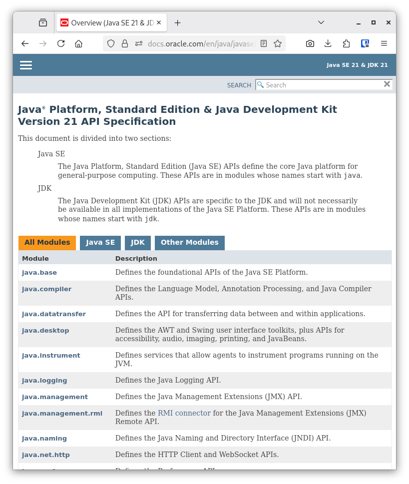
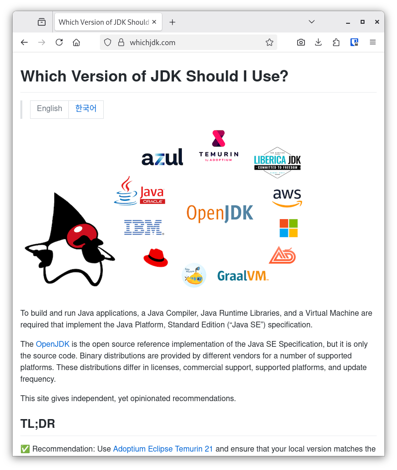
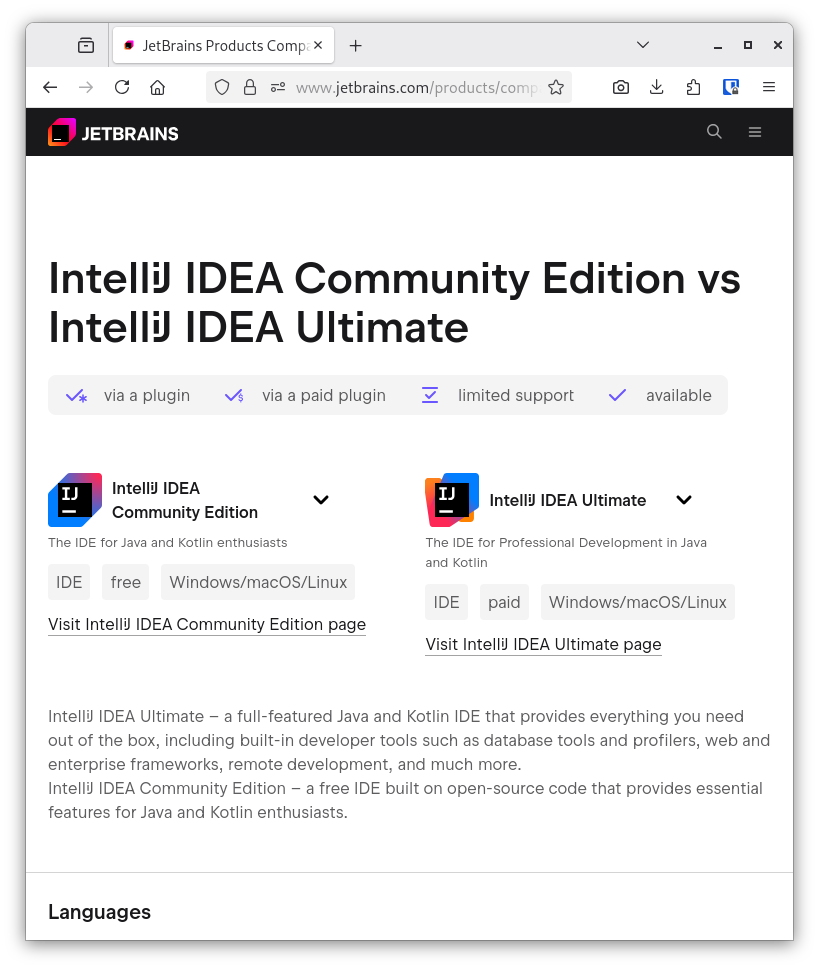
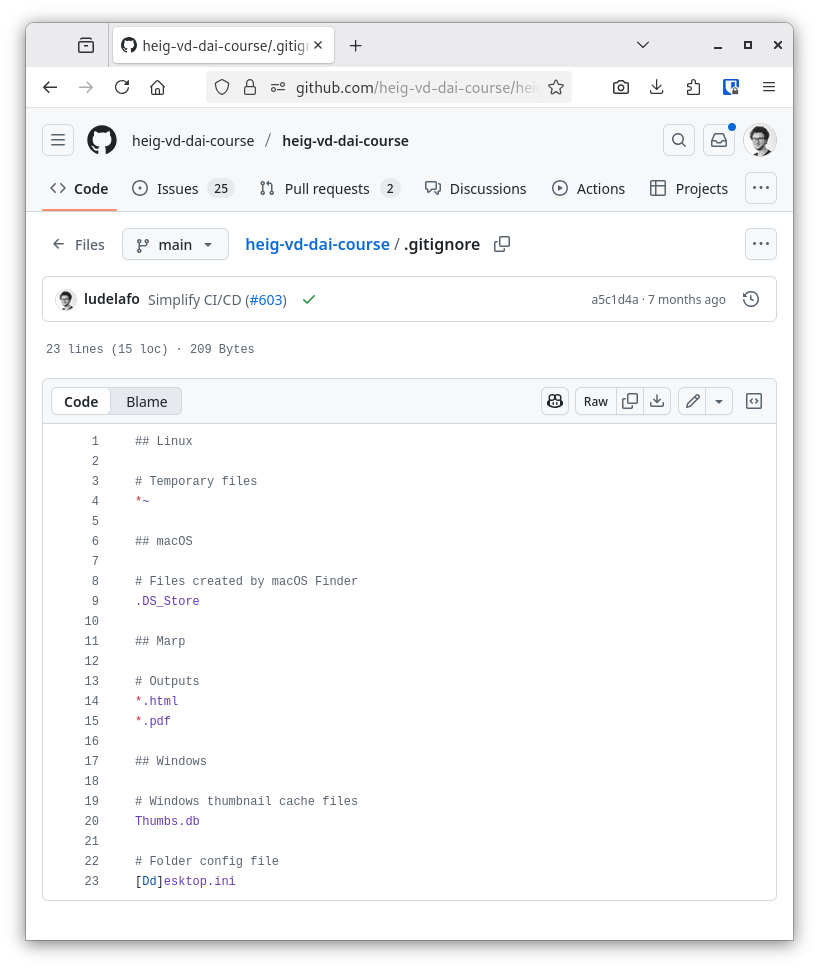
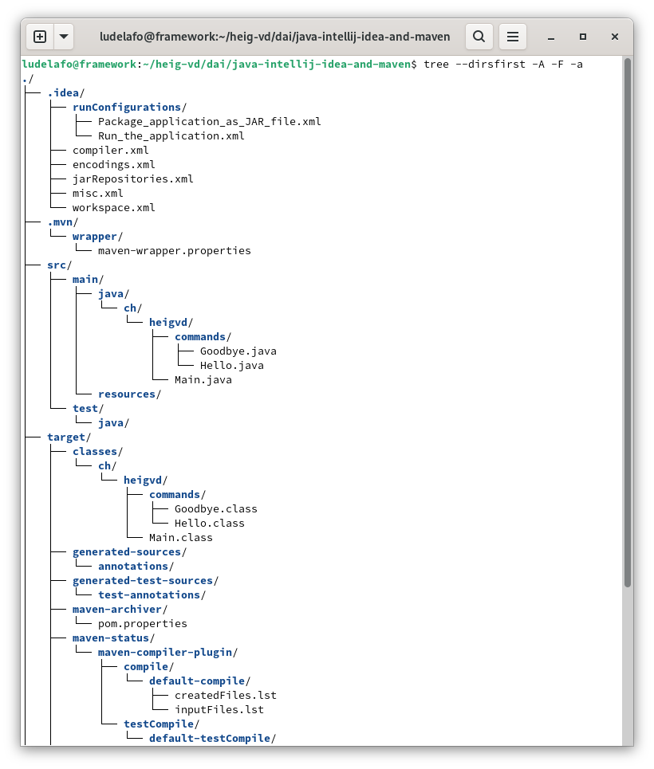
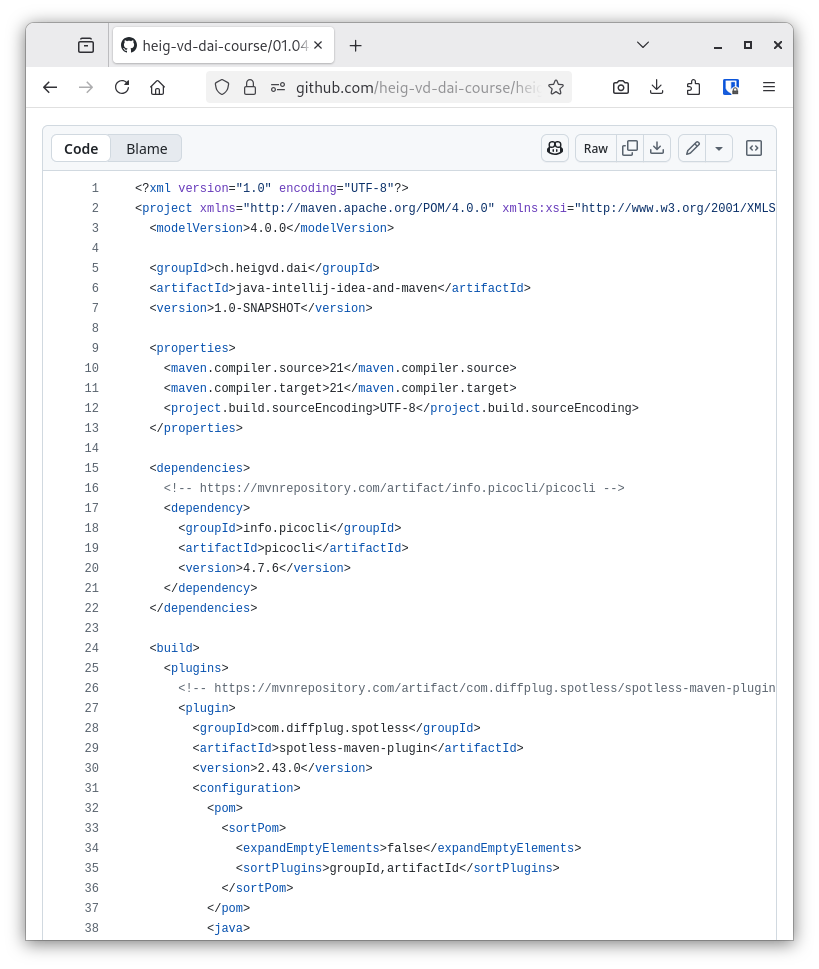
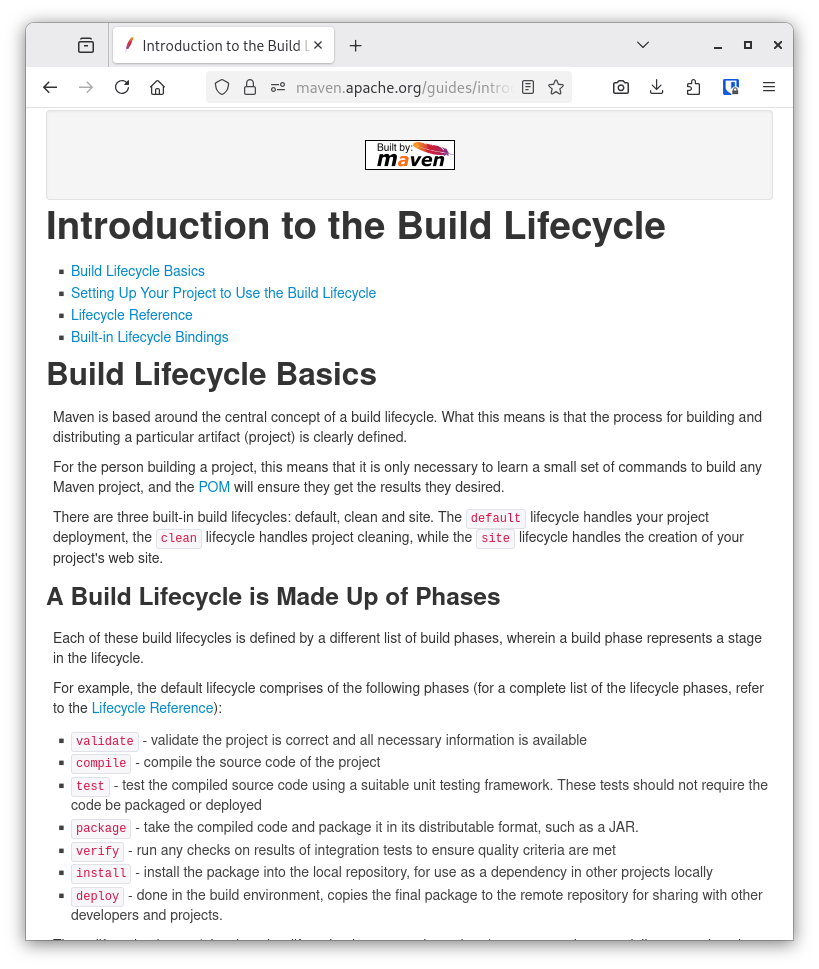
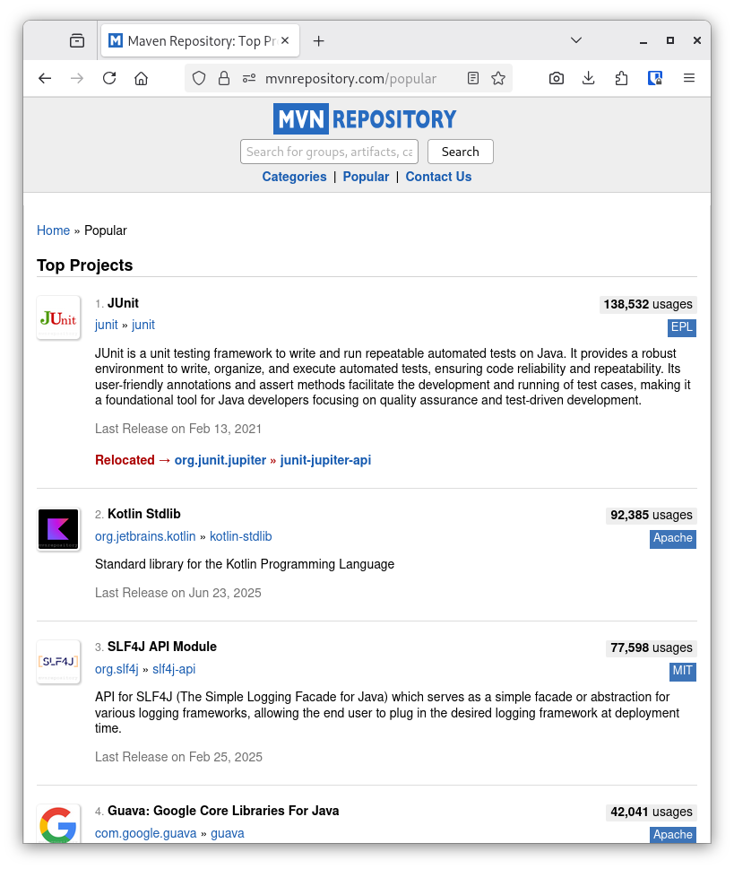
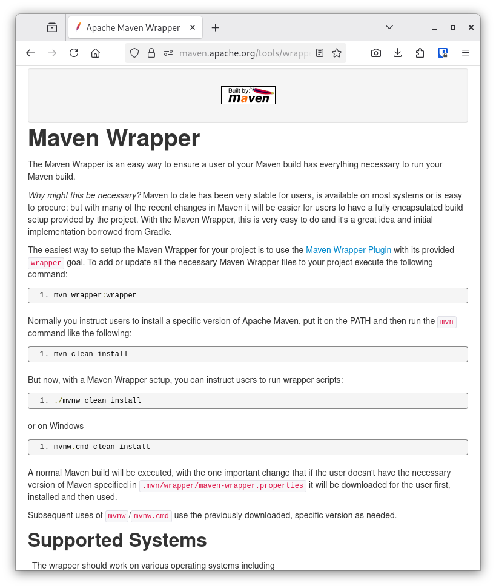
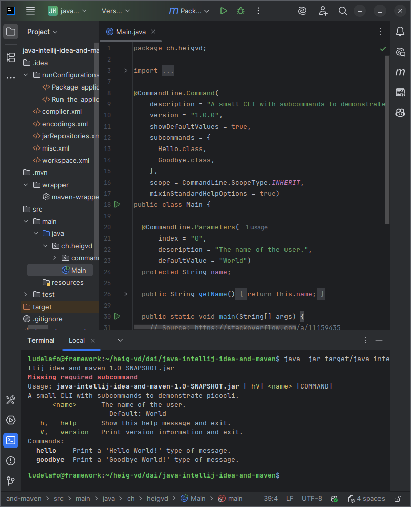

<!--
theme: custom-marp-theme
size: 16:9
paginate: true
author: L. Delafontaine and H. Louis, with the help of GitHub Copilot
title: HEIG-VD DAI - Java, IntelliJ IDEA and Maven
description: Java, IntelliJ IDEA and Maven for the DAI course at HEIG-VD, Switzerland
header: '[**Java, IntelliJ IDEA and Maven**](https://github.com/heig-vd-dai-course/heig-vd-dai-course/tree/main/01.04-java-intellij-idea-and-maven)'
footer: '[**HEIG-VD**](https://heig-vd.ch) - [DAI 2025-2026](https://github.com/heig-vd-dai-course/heig-vd-dai-course) - [CC BY-SA 4.0](https://github.com/heig-vd-dai-course/heig-vd-dai-course/blob/main/LICENSE.md)'
headingDivider: 6
-->

# Java, IntelliJ IDEA and Maven

<!--
_class: lead
_paginate: false
-->

[Link to the course][course]

<small>L. Delafontaine and H. Louis, with the help of
[GitHub Copilot](https://github.com/features/copilot).</small>

<small>This work is licensed under the [CC BY-SA 4.0][license] license.</small>

![bg opacity:0.1][illustration]

## Objectives

- Learn why Java is a popular programming language.
- Manage multiple Java versions with SDKMAN!.
- Develop Java apps with IntelliJ IDEA and Maven.
- Manage dependencies with Maven.
- Develop essential skills for professional Java development.


## Java

<!-- _class: lead -->

More details for this section in the [course material][course]. You can find
other resources and alternatives as well.

### Java

- General-purpose, object-oriented language.
- Write once, run anywhere (WORA).
- Created by James Gosling, 1995 at Sun Microsystems.
- The documentation seems scary but you will get used to it and it is very
  useful.


### Java virtual machine

- Compiles source code to bytecode.
- Executes the bytecode in the Java virtual machine (JVM).
- Where a JVM exists, Java can run (most of the time).



### JVM versions

- Multiple implementations exist.
- Can target different platforms and/or specific features.
- JDK for development, JRE for running.
- Eclipse Temurin is recommended.



### Java versions and version managers

- Java 21 is the latest LTS.
- You can use [SDKMAN!](https://sdkman.io/) to manage multipe versions of Java.
- Match versions for project consistency.


### Compiling and running Java programs (1/3)

Given the following `HelloWorld.java` file:

```java
public class HelloWorld {
    public static void main(String[] args) {
        String message = "Hello, World!";

        System.out.println(message);
    }
}
```

### Compiling and running Java programs (2/3)

You can compile and run Java programs in multiple ways:

- Compile manually with the `javac` command:

  ```sh
  javac HelloWorld.java
  ```

- Execute with the `java` command:

  ```sh
  java HelloWorld
  ```

### Compiling and running Java programs (3/3)

- Modern way: package into JAR files with the help of Maven and run with the
  `java -jar` command:

  ```sh
  java -Xmx1024M -Xms1024M -jar minecraft_server.1.20.1.jar nogui
  ```

### Garbage collection

- Java has automatic memory management: we do not need to manually manage memory
  as in C or C++.
- The garbage collector (also called _"GC"_) runs periodically to free memory.
- Eligible when an object is no longer referenced (out of scope or `null`).


### Summary

- Java is a general-purpose, class-based, object-oriented programming language.
- Java is compiled to bytecode, which is then executed by a Java virtual machine
  (JVM).
- Java is intended to be portable, thanks to the JVM.
- Java has various versions, each with its own set of features and improvements.
- Versions managers allow you to install and switch between different versions
  of Java.

## IntelliJ IDEA

<!-- _class: lead -->

More details for this section in the [course material][course]. You can find
other resources and alternatives as well.

### IntelliJ IDEA

- IDE for (Java) software development.
- Developed by JetBrains.
- Works on Windows, macOS, Linux.
- Quite a standard in the industry.


### Community Edition and Ultimate Edition

- Community (free) and Ultimate (paid).
- Free student license available - you can get it!
- The Community Edition is sufficient for this course.



### JetBrains Toolbox App

- Manage multiple JetBrains IDEs.
- Install and update in one place.
- Optional but very useful.


### Configuration files and Git

- `.idea` directory for project config.
- Allow to share project settings between developers.
- Some files must be ignored to avoid issue (local config) in Git.



### Summary

- IntelliJ IDEA is an integrated development environment (IDE) written in Java
  for developing computer software.
- IntelliJ IDEA is available in two editions: the Community Edition (free and
  open-source) and the Ultimate Edition (proprietary).
- You are eligible for a free student license for the Ultimate Edition.
- When creating a new project, IntelliJ IDEA will create a `.idea` directory
  containing the project configuration files.
- Some of these files must be ignored by Git, as they contain local
  configuration that is specific to your computer.

## Maven

<!-- _class: lead -->

More details for this section in the [course material][course]. You can find
other resources and alternatives as well.

### Maven

- Maintained by Apache Software Foundation.
- Software project management tool.
- Manages dependencies.
- Build automation tool.
- Allows to define a standard project structure.


### Maven project structure

- Standardized directory structure:
  - `src/main/java`
  - `src/main/resources`
  - `src/test/java`
- Simplifies build process with conventions.



### `pom.xml` file

- Configuration and build settings.
- Shared among developers.
- Defines dependencies and plugins:
  - Plugins extend Maven functionality.
  - Dependencies are external libraries.



### Maven lifecycle

- Maven defines build process.
- Composed of phases and goals.
- Phases load plugin goals.
- Goals execute tasks on your project (e.g., compile, test, package).



### Maven Repository

- Public repository of Java libraries.
- Maven can download dependencies automatically.
- You can publish your own libraries.
- Many libraries available such as picocli, a library for building CLI
  applications.



### Maven wrapper

- Allows to use Maven without installing it.
- Wrapper script downloads Maven.
- Ensures consistent Maven version.
- Use `mvnw` or `mvnw.cmd` instead of `mvn`.



### Summary

- Maven is a software project management and comprehension tool.
- Maven is a dependency manager for Java projects.
- Maven is a build automation tool for Java projects.
- Maven defines a standard directory structure for Java projects.
- Maven defines a standard build process for Java projects.
- The `pom.xml` file contains the configuration of your Maven project.

## Questions

<!-- _class: lead -->

Do you have any questions?

## Practical content

<!-- _class: lead -->

### What will you do?

- Install and configure SDKMAN!, Java, Maven and IntelliJ IDEA.
- Create and run a small CLI application with picocli, an external Maven
  dependency.
- Publish your project on GitHub.



### Now it's your turn!

- Read the course material.
- Do the practical content.
- Ask questions if you have any.

➡️ [Find the course on GitHub][course].

**Do not hesitate to help each other! There's no need to rush!**

![bg right w:75%][course-qr-code]

## Finished? Was it easy? Was it hard?

Can you let us know what was easy and what was difficult for you during this
course?

This will help us to improve the course and adapt the content to your needs. If
we notice some difficulties, we will come back to you to help you.

➡️ [GitHub Discussions][discussions]

You can use reactions to express your opinion on a comment!

## Sources

- Main illustration by [Nathan Dumlao](https://unsplash.com/@nate_dumlao) on
  [Unsplash](https://unsplash.com/photos/KixfBEdyp64)
- Illustration by [Aline de Nadai](https://unsplash.com/@alinedenadai) on
  [Unsplash](https://unsplash.com/photos/j6brni7fpvs)
- Java logo by [Java](https://www.java.com/)
- SDKMAN! logo by [SDKMAN!](https://sdkman.io/)
- Illustration by [Jilbert Ebrahimi](https://unsplash.com/@jilburr) on
  [Unsplash](https://unsplash.com/photos/black-plastic-garbage-bin-with-wheels-beside-wall-b0p818k8Ok8)
- IntelliJ IDEA and Intellij Toolbox logos by
  [JetBrains](https://www.jetbrains.com/)
- Maven logo by [Apache Software Foundation](https://maven.apache.org/)

[course]:
	https://github.com/heig-vd-dai-course/heig-vd-dai-course/tree/main/01.04-java-intellij-idea-and-maven
[license]:
	https://github.com/heig-vd-dai-course/heig-vd-dai-course/blob/main/LICENSE.md
[discussions]: https://github.com/orgs/heig-vd-dai-course/discussions/3
[illustration]: ./images/main-illustration.jpg
[course-qr-code]:
	https://quickchart.io/qr?format=png&ecLevel=Q&size=400&margin=1&text=https://github.com/heig-vd-dai-course/heig-vd-dai-course/tree/main/01.04-java-intellij-idea-and-maven
