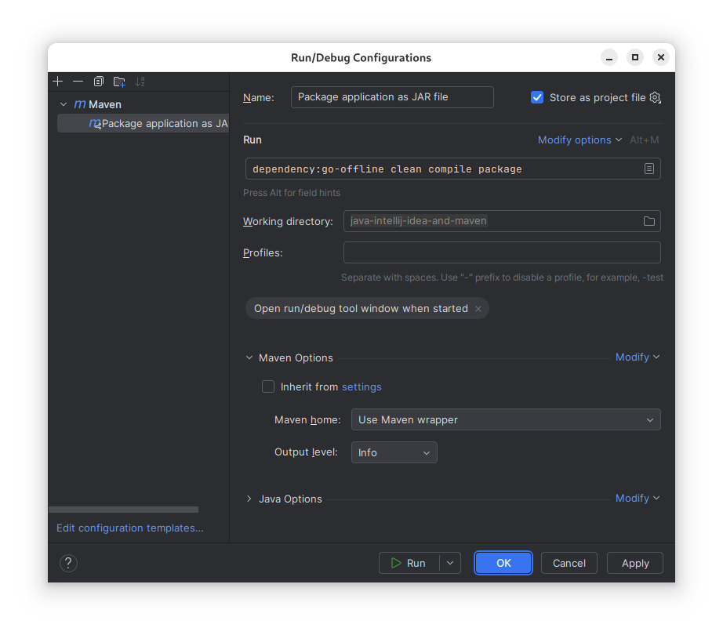

# Java, IntelliJ IDEA and Maven


L. Delafontaine and H. Louis, with the help of
[GitHub Copilot](https://github.com/features/copilot).

This work is licensed under the [CC BY-SA 4.0][license] license.

## Resources

- Objectives, teaching and learning methods, and evaluation methods:
  [Link to content](..)
- Course material: [Link to content](../01-course-material/README.md) ·
  [Presentation (web)](https://heig-vd-dai-course.github.io/heig-vd-dai-course/01.04-java-intellij-idea-and-maven/01-course-material/index.html)
  ·
  [Presentation (PDF)](https://heig-vd-dai-course.github.io/heig-vd-dai-course/01.04-java-intellij-idea-and-maven/01-course-material/01.04-java-intellij-idea-and-maven-presentation.pdf)
- Solution: [Link to content](../02-solution/)

## Table of contents

- [Resources](#resources)
- [Table of contents](#table-of-contents)
- [Objectives](#objectives)
- [Java](#java)
  - [Java virtual machine](#java-virtual-machine)
  - [JVM versions](#jvm-versions)
  - [Java versions and version managers](#java-versions-and-version-managers)
  - [Compiling and running Java programs](#compiling-and-running-java-programs)
  - [Garbage collection](#garbage-collection)
  - [Summary](#summary)
  - [Alternatives](#alternatives)
  - [Resources](#resources-1)
- [IntelliJ IDEA](#intellij-idea)
  - [Community Edition and Ultimate Edition](#community-edition-and-ultimate-edition)
  - [JetBrains Toolbox App](#jetbrains-toolbox-app)
  - [Configuration files and Git](#configuration-files-and-git)
  - [Summary](#summary-1)
  - [Alternatives](#alternatives-1)
  - [Resources](#resources-2)
- [Maven](#maven)
  - [Maven project structure](#maven-project-structure)
  - [`pom.xml` file](#pomxml-file)
  - [Maven lifecycle](#maven-lifecycle)
  - [Maven Repository](#maven-repository)
  - [Maven wrapper](#maven-wrapper)
  - [Summary](#summary-2)
  - [Alternatives](#alternatives-2)
  - [Resources](#resources-3)
  - [Cheat sheet](#cheat-sheet)
- [Practical content](#practical-content)
  - [Install SDKMAN!](#install-sdkman)
  - [Install Java](#install-java)
  - [Install Maven](#install-maven)
  - [Install and configure IntelliJ IDEA](#install-and-configure-intellij-idea)
  - [Create and run a new Maven project with IntelliJ IDEA](#create-and-run-a-new-maven-project-with-intellij-idea)
  - [Go further](#go-further)
- [Conclusion](#conclusion)
  - [What did you do and learn?](#what-did-you-do-and-learn)
  - [Test your knowledge](#test-your-knowledge)
- [Finished? Was it easy? Was it hard?](#finished-was-it-easy-was-it-hard)
- [Additional resources](#additional-resources)
- [Solution](#solution)
- [Sources](#sources)

## Objectives

This chapter will help you understand how Java can run on all platforms, how to
install and switch between different versions of Java, how to use IntelliJ IDEA
to develop Java applications, how to use Maven to manage dependencies and build
Java applications.

These skills are essential to develop Java applications in a professional
environment to share them with other developers.

In a nutshell, by the end of this course, you should be able to:

- Learn why Java is a popular programming language.
- Manage multiple Java versions with SDKMAN!.
- Develop Java apps with IntelliJ IDEA and Maven.
- Manage dependencies with Maven.
- Develop essential skills for professional Java development.

## Java

> Java is a general-purpose, class-based, object-oriented programming language.
> It is intended to let programmers write once, run anywhere (WORA), meaning
> that compiled Java code can run on all platforms that support Java, thanks to
> the Java virtual machine (JVM).
>
> <https://www.java.com/>

Java was created by James Gosling at Sun Microsystems (now part of Oracle
Corporation) and released in 1995.

Java is a very popular programming language, especially for client-server web
applications.

### Java virtual machine

Java is a compiled language, meaning that the source code is compiled to
bytecode, which is then executed by a Java virtual machine (JVM).

Java is intended to be portable, meaning that compiled Java code can run on all
platforms that support Java, without the need for recompilation, all thanks to
the JVM.

### JVM versions

Many implementations of the JVM exist, targeting different hardware and software
environments and/or specific optimizations for a given platform and/or use-case.

In order to install Java on your computer, you may find the JDK (Java
Development Kit) or the JRE (Java Runtime Environment) packages.

If you want to develop Java applications, you will need the JDK. If you want to
run Java applications, you will need the JRE.

### Java versions and version managers

Java has various versions, each with its own set of features and improvements.
The latest Long term support (LTS) version is Java 21.

As projects can use different versions of Java, it is common to use a version
manager such as [SDKMAN!](https://sdkman.io/) or [asdf](https://asdf-vm.com/).

Version managers allow you to install and switch between different versions of
Java.

While working on a project, you should use the same version of Java as the other
developers to ensure that the project compiles and runs correctly.

You can develop Java applications using a text editor and the command line, but
it is more convenient to use an Integrated Development Environment (IDE).

### Compiling and running Java programs

Given a Java source file named `HelloWorld.java`:

```java
public class HelloWorld {
    public static void main(String[] args) {
        String message = "Hello, world!";

        System.out.println(message);
    }
}
```

A (simple) Java application can be compiled using the `javac` command:

```sh
# Compile the source code
javac HelloWorld.java
```

The resulting bytecode can be executed using the `java` command:

```sh
# Run the compiled bytecode
java HelloWorld
```

Output:

```text
Hello, world!
```

A Java application can be packaged into a JAR (Java ARchive) file, which is a
ZIP file containing the compiled bytecode and other resources.

A JAR file can be executed using the `java` command:

```sh
# Run the JAR file
java -Xmx1024M -Xms1024M -jar minecraft_server.1.21.jar nogui
```

In this example, the `-Xmx1024M` and `-Xms1024M` options define the **maximum**
and **initial** memory allocation pool for a Java virtual machine (JVM),
respectively.

These options can tweak the performance of the JVM, depending on the
application.

As many Java applications depend on external libraries, it is common to use a
dependency manager such as [Maven](https://maven.apache.org/) or
[Gradle](https://gradle.org/).

### Garbage collection

Java has automatic memory management, meaning that the programmer does not need
to manually allocate and free memory as in languages such as C or C++.

The garbage collector (also called _"GC"_) is a background process that runs
periodically to free memory by removing objects that are no longer referenced.

When an object is no longer referenced (e.g. out of scope or set to `null`), it
becomes eligible for garbage collection.

### Summary

- Java is a general-purpose, class-based, object-oriented programming language.
- Java is compiled to bytecode, which is then executed by a Java virtual machine
  (JVM).
- Java is intended to be portable, thanks to the JVM.
- Java has various versions, each with its own set of features and improvements.
- Versions managers allow you to install and switch between different versions
  of Java.

### Alternatives

_Alternatives are here for general knowledge. No need to learn them._

- [Kotlin](https://kotlinlang.org/)
- [Scala](https://www.scala-lang.org/)
- [Groovy](https://groovy-lang.org/)

_Missing item in the list? Feel free to open a pull request to add it! ✨_

### Resources

_Resources are here to help you. They are not mandatory to read._

- [asdf](https://asdf-vm.com/) - An alternative to SDKMAN!.

_Missing item in the list? Feel free to open a pull request to add it! ✨_

## IntelliJ IDEA

> IntelliJ IDEA is an integrated development environment (IDE) written in Java
> for developing computer software. It is developed by JetBrains, and is
> available as an Apache 2 Licensed community edition, and in a proprietary
> commercial edition.
>
> <https://www.jetbrains.com/idea/>

IntelliJ IDEA is a very popular IDE for Java development, but it also supports
many other programming languages.

### Community Edition and Ultimate Edition

IntelliJ IDEA is available in two editions: the Community Edition (free and
open-source) and the Ultimate Edition (proprietary).

You are eligible for a free student license for the Ultimate Edition, which you
can obtain by following the instructions on the
[JetBrains Student License](https://www.jetbrains.com/community/education/#students)
page.

IntelliJ IDEA is available for Windows, macOS and Linux. Feel free to use
another IDE if you prefer, but we have great experience with IntelliJ IDEA.

### JetBrains Toolbox App

The JetBrains Toolbox App is a desktop application that allows you to install
and manage various JetBrains IDEs.

It is a convenient way to install and update IntelliJ IDEA and other JetBrains
IDEs in a single place.

### Configuration files and Git

When creating a new project, IntelliJ IDEA will create a `.idea` directory
containing the project configuration files.

Some of these files must be ignored by Git, as they contain **local
configuration** that is specific to your computer.

Other files must be committed to Git, as they contain **project configuration**
that is shared between all developers.

This allows you to share the project configuration with other developers, so
that they can open the project in their instance of IntelliJ IDEA and have the
same configuration as you and ensure that the project compiles and runs
correctly.

### Summary

- IntelliJ IDEA is an integrated development environment (IDE) written in Java
  for developing computer software.
- IntelliJ IDEA is available in two editions: the Community Edition (free and
  open-source) and the Ultimate Edition (proprietary).
- You are eligible for a free student license for the Ultimate Edition.
- When creating a new project, IntelliJ IDEA will create a `.idea` directory
  containing the project configuration files.
- Some of these files must be ignored by Git, as they contain local
  configuration that is specific to your computer.

### Alternatives

_Alternatives are here for general knowledge. No need to learn them._

- [Visual Studio Code](https://code.visualstudio.com/) with the
  [Java Extension Pack](https://marketplace.visualstudio.com/items?itemName=vscjava.vscode-java-pack)
- [Eclipse](https://www.eclipse.org/ide/) if you **really** want to use it
- [NetBeans](https://netbeans.apache.org/) if you **really** want to use it

_Missing item in the list? Feel free to open a pull request to add it! ✨_

### Resources

_Resources are here to help you. They are not mandatory to read._

- _None for now_

_Missing item in the list? Feel free to open a pull request to add it! ✨_

## Maven

> Apache Maven is a software project management and comprehension tool. Based on
> the concept of a project object model (POM), Maven can manage a project's
> build, reporting and documentation from a central piece of information.
>
> <https://maven.apache.org/>

Maven is a dependency manager for Java projects. It is used to manage external
libraries (also called _"dependencies"_) used by your application. Maven is a
command-line tool. It can be used using the `mvn` command.

Maven is also a build automation tool. It is used to compile your application,
run your unit tests, package your application, etc.

### Maven project structure

Maven defines a standard directory structure for Java projects, so that all
developers can find the source code, unit tests, etc. in the same place. It
standardizes the build process of your application, so that all developers can
build the project in the same way.

When creating a new project in IntelliJ IDEA, you can choose between different
project templates.

In this course, you will use the Maven project template.

IntelliJ IDEA will automatically create a Maven project structure for you, with
the following files:

- **`pom.xml`**: the Project Object Model (POM) file, which is the core of a
  Maven project.
- **`src/main/java`**: the source code of your application.
- **`src/test/java`**: the unit tests of your application.

### `pom.xml` file

The `pom.xml` file contains the configuration of your Maven project.

It also contains the build configuration of your application, which defines how
your application is compiled, tested, packaged, etc.

It contains the dependencies of your application, which are **external
libraries** used by your application.

The `pom.xml` file is shared between all developers, so that they can compile
and run the application in the same way.

The standard `pom.xml` file contains the following sections (among others):

- **`groupId`**: the name of the organization that created the project. It
  defines the namespace of the project.
- **`artifactId`**: the name of the project.
- **`version`**: the version of the project.
- **`packaging`**: the packaging type of the project.
- **`name`** and **`description`**: the name and description of the project.
- **`dependencies`**: the dependencies of the project.

The `artifactId`, `version` and `packaging` sets the name of the JAR file.

### Maven lifecycle

Maven defines a standard build process for Java projects, called the **Maven
lifecycle**.

The Maven lifecycle is composed of phases. Each phase is composed of plugin
goals.

For example, the `compile` phase is composed of the `compiler:compile` plugin
goal and the `package` phase is composed of the `jar:jar` and
`plugin:addPluginArtifactMetadata` plugin goal, which will generate a JAR file.

### Maven Repository

The [Maven Repository](https://mvnrepository.com/) is a public repository of
Java libraries. It contains many libraries that you can use in your projects.

You can search for a library and copy the dependency declaration to your
`pom.xml` file.

For example, the following dependency declaration adds the
[picocli](https://mvnrepository.com/artifact/info.picocli/picocli/4.7.6) library
to your project:

```xml
<!-- https://mvnrepository.com/artifact/info.picocli/picocli -->
<dependency>
    <groupId>info.picocli</groupId>
    <artifactId>picocli</artifactId>
    <version>4.7.6</version>
</dependency>
```

This allows you to use the classes and methods provided by the picocli library
in your application.

### Maven wrapper

Maven offers what is called the _"Maven wrapper"_. This wrapper is a script (a
shell script on Linux and macOS and a Batch script on Windows) that will
download and run Maven for you, even if you do not have Maven installed on your
computer.

These scripts can be committed to any Git repository, shared with your team and
used on any platform without the need to have Maven installed beforehand. You
can then use the wrapper script to download and run Maven.

The Maven wrapper defines the version of Maven to use, so that all developers
use the same version of Maven.

The Maven wrapper and its configuration file are committed to Git but the Maven
executable file is ignored by Git.

A new developer can then run the Maven wrapper to download and execute Maven,
ensuring that all developers use the same version of Maven.

This a considered good practice to ensure that all developers use the same
version of Maven and that the project can be built and run correctly.

### Summary

- Maven is a software project management and comprehension tool.
- Maven is a dependency manager for Java projects.
- Maven is a build automation tool for Java projects.
- Maven defines a standard directory structure for Java projects.
- Maven defines a standard build process for Java projects.
- The `pom.xml` file contains the configuration of your Maven project.

### Alternatives

_Alternatives are here for general knowledge. No need to learn them._

- [Gradle](https://gradle.org/)
- [Ant](https://ant.apache.org/)
- [Make](https://www.gnu.org/software/make/)
- [Bazel](https://bazel.build/)

_Missing item in the list? Feel free to open a pull request to add it! ✨_

### Resources

_Resources are here to help you. They are not mandatory to read._

- [Introduction to the Build Lifecycle](https://maven.apache.org/guides/introduction/introduction-to-the-lifecycle.html)
- [Maven Build Lifecycle, Phases, and Goals](https://www.digitalocean.com/community/tutorials/maven-build-lifecycle-phases-goals)

_Missing item in the list? Feel free to open a pull request to add it! ✨_

### Cheat sheet

```sh
# Download the dependencies and their transitive dependencies
mvn dependency:go-offline

# Delete the compiled classes
mvn clean

# Compile the source code
mvn compile

# Package the application
mvn package
```

Multiple phases can be executed in a single command:

```sh
# Execute all the phases described above
mvn dependency:go-offline clean compile package
```

## Practical content

> [!NOTE]
>
> If you are on Windows, you must follow the extra steps of the
> [_Set up a Windows development environment_](../../00.01-set-up-a-windows-development-environment/01-course-material/README.md#configure-intellij-idea-terminal-to-use-wsl)
> guide to correctly configure the following tools with the Windows Subsystem
> for Linux (WSL).

### Install SDKMAN!

In this section, you will install SDKMAN! to manage different versions of Java.

#### Install SDKMAN!

Go to the official website and follow the instructions on how to install SDKMAN!
on your system: <https://sdkman.io/>.

> [!IMPORTANT]
>
> You might need to install the missing packages for
> [SDKMAN!](https://sdkman.io/) to work correctly.
>
> Use `apt` to install them by running the following command in the terminal:
>
> ```sh
> # Install the missing packages for SDKMAN!
> sudo apt install <name of the missing package>
> ```

#### Check the installation

Open a new terminal and type `sdk version`.

The output should be similar to this:

```text
SDKMAN!
script: 5.20.0
core: 0.7.4 (linux x86_64)
```

### Install Java

In this section, you will install two Java versions on your computer with
SDKMAN!:

1. The latest Long term support (LTS) version of Java.
2. The previous LTS version of Java.

This will allow you to work on projects using different versions of Java and
switch between them easily using SDKMAN!.

#### Install the latest LTS version of Java

Using SDKMAN!, it is very easy to install various versions of Java.

Start by listing all the available versions of Java:

```sh
# List all available versions of Java
sdk list java
```

The output should be similar to this:

```text
================================================================================
Available Java Versions for Linux 64bit
================================================================================
 Vendor        | Use | Version      | Dist    | Status     | Identifier
--------------------------------------------------------------------------------

...

 GraalVM CE    |     | 24.0.2       | graalce |            | 24.0.2-graalce
               |     | 24.0.1       | graalce |            | 24.0.1-graalce
               |     | 24           | graalce |            | 24-graalce
               |     | 23.0.2       | graalce |            | 23.0.2-graalce
               |     | 21.0.2       | graalce |            | 21.0.2-graalce
               |     | 17.0.9       | graalce |            | 17.0.9-graalce

...

 Oracle        |     | 24.0.2       | oracle  |            | 24.0.2-oracle
               |     | 24.0.1       | oracle  |            | 24.0.1-oracle
               |     | 24           | oracle  |            | 24-oracle
               |     | 23.0.2       | oracle  |            | 23.0.2-oracle
               |     | 22.0.2       | oracle  |            | 22.0.2-oracle
               |     | 21.0.8       | oracle  |            | 21.0.8-oracle

...

 Temurin       |     | 24.0.2       | tem     |            | 24.0.2-tem
               |     | 24.0.1       | tem     |            | 24.0.1-tem
               |     | 24           | tem     |            | 24-tem
               |     | 23.0.2       | tem     |            | 23.0.2-tem
               |     | 21.0.8       | tem     |            | 21.0.8-tem
               |     | 21.0.7       | tem     |            | 21.0.7-tem

...

================================================================================
Omit Identifier to install default version 21.0.8-tem:
    $ sdk install java
Use TAB completion to discover available versions
    $ sdk install java [TAB]
Or install a specific version by Identifier:
    $ sdk install java 21.0.8-tem
Hit Q to exit this list view
================================================================================
```

As mentioned in the theoretical part, many Java JVMs are available, used to
target different hardware and software environments and/or specific
optimizations for a given platform and/or use-case.

> [!TIP]
>
> How to know which version of Java to use? Use the website
> [Which Version of JDK Should I Use?](https://whichjdk.com/). It is a very
> useful website to help you choose the right version of Java for your project.

To install the latest LTS version of Java Temurin, use the following command
(update the version number if needed):

```sh
# Install the latest LTS version of Java Temurin
sdk install java 21.0.8-tem
```

In this example, we are installing the 21.0.8 version of Java Temurin. It might
be different (updated) when you follow this course.

You can now check the current used version of Java using the following command:

```sh
# Check the current used version of Java
java --version
```

The output should be similar to this:

```text
openjdk 21 2023-09-19 LTS
OpenJDK Runtime Environment Temurin-21+35 (build 21+35-LTS)
OpenJDK 64-Bit Server VM Temurin-21+35 (build 21+35-LTS, mixed mode, sharing)
```

You should notice that the version of Java is now 21, powered by the Adoptium
Eclipse Temurin JVM, a recognized and trusted distribution of OpenJDK.

#### Install the previous LTS version of Java

Now, you will install the previous LTS version of Java. As it is very common to
work on projects that uses older LTS versions of Java, it is important to know
how to install and switch between different versions of Java.

Using the [Which Version of JDK Should I Use?](https://whichjdk.com/) website,
you can see that the previous LTS version of Java is Java 17.

Use the previous command to list all the available versions of Java and install
the previous LTS version of Java. Set this version as the default version of
Java while installing it.

<details>
<summary>Show me the answer!</summary>

Install Java 17 using the following command:

```sh
# Install Java 17
sdk install java 17.0.16-tem
```

</details>

You can then check the current used version of Java using the following command:

```sh
# Check the current used version of Java
java --version
```

The output should be similar to this:

```text
openjdk 17.0.16 2025-07-15
OpenJDK Runtime Environment Temurin-17.0.16+8 (build 17.0.16+8)
OpenJDK 64-Bit Server VM Temurin-17.0.16+8 (build 17.0.16+8, mixed mode, sharing)
```

Notice that the version of Java is now 17, powered by the Adoptium Eclipse
Temurin JVM.

As we have set this version as the default version of Java while installing it,
this version will be used by default when opening a new terminal session.

#### Switch between Java versions

You can switch between different versions of Java using the following command:

```sh
# List installed versions of Java (check the `Use` and `Status` columns)
sdk list java

# Switch to a specific version of Java for the current terminal session
sdk use java 21.0.8-tem
```

This will set version 21 of Java Temurin as the current version of Java **for
the current terminal session**.

This can be useful to switch to a specific version of Java for a specific
project.

#### Set the default Java version

You can set the default version of Java using the following command:

```sh
# Set the default version of Java
sdk default java 21.0.8-tem
```

This will ensure the latest LTS version of Java Temurin is used by default when
opening a new terminal session. It is the version that is expected to be used
for the remaining of this teaching unit.

### Install Maven

In this section, you will install Maven. In a future section, you will
initialize the Maven wrapper using Maven itself.

#### Install Maven

Install Maven using SDKMAN!:

```sh
# Install Maven
sdk install maven
```

#### Check the installation

Check the installation of Maven using the following command:

```sh
# Check the Maven version
mvn --version
```

The output should be similar to this:

```text
Apache Maven 3.9.10 (5f519b97e944483d878815739f519b2eade0a91d)
Maven home: /home/ludelafo/.sdkman/candidates/maven/current
Java version: 21.0.8, vendor: Eclipse Adoptium, runtime: /home/ludelafo/.sdkman/candidates/java/21.0.8-tem
Default locale: en, platform encoding: UTF-8
OS name: "linux", version: "6.6.87.2-microsoft-standard-wsl2", arch: "amd64", family: "unix"
```

### Install and configure IntelliJ IDEA

In this section, you will install and configure IntelliJ IDEA (Community Edition
or Ultimate Edition).

#### Enable the IntelliJ student license (optional)

Follow the official documentation to enable the IntelliJ student license:
<https://www.jetbrains.com/community/education/#students>.

> [!NOTE]
>
> You can use the Community Edition of IntelliJ IDEA if you prefer. We will not
> use any feature that is only available in the Ultimate Edition.
>
> You are free to use another IDE if you prefer but the official support for
> this course is IntelliJ IDEA (Community or Ultimate Edition).

#### Download and install IntelliJ Toolbox App

Go to the official website and follow the instructions on how to install
IntelliJ Toolbox App on your system: <https://www.jetbrains.com/toolbox/app>.

#### Enable the student license in IntelliJ Toolbox App (optional)

Open IntelliJ Toolbox App and login with your JetBrains account.

#### Install IntelliJ IDEA (Community Edition or Ultimate Edition)

> [!NOTE]
>
> **Reminder**: for people on Windows, follow the
> [_Set up a Windows development environment_](https://github.com/heig-vd-dai-course/heig-vd-dai-course/blob/main/00.01-set-up-a-windows-development-environment/01-course-material/README.md#install-and-configure-intellij-idea-to-access-wsl)
> guide to correctly configure IntelliJ IDEA with the Windows Subsystem for
> Linux (WSL).

Install IntelliJ IDEA from the Toolbox App and you should be good to go!

### Create and run a new Maven project with IntelliJ IDEA

In this section, you will create a new Maven project with IntelliJ IDEA.

#### Create the IntelliJ IDEA project

Open IntelliJ IDEA and create a new project. Fill the form as shown in the
following screenshot:


> [!IMPORTANT]
>
> As mentioned in the course material, always use the latest LTS version of
> Java. As you have now multiple versions of Java installed on your machine,
> always check the version of Java used when creating a new project and use the
> latest LTS version.
>
> Set the artifact ID and group ID as shown in the screenshot as well.

#### Run the Java project from IntelliJ IDEA

Open the `Main` file. Press the **Play** button in the toolbar to run the Maven
project.

The output should be `Hello World!` in the **Run** tab.

#### Initialize the Maven wrapper

The Maven wrapper is a good practice to ensure that all developers use the same
version of Maven. This allows new developers to run the Maven wrapper to
download and run Maven, without having to install Maven on their computer first
(and ensuring that they use the same version of Maven).

In order to use the Maven wrapper, you have to initialize it using Maven.

Open a terminal within IntelliJ IDEA. This will open the path of the current
project. Initialize the Maven wrapper using the following command:

```sh
# Initialize the Maven wrapper
mvn wrapper:wrapper
```

This will create the Maven wrapper files in your project:

```text
./
├── .mvn/
│   └── wrapper/
│       └── maven-wrapper.properties
├── mvnw
└── mvnw.cmd
```

The `mvnw` (Unix/Linux/macOS) and `mvnw.cmd` (Windows) files are the Maven
wrapper scripts. These files are committed to Git.

The `maven-wrapper.properties` file contains the configuration of the Maven
wrapper, including the version to install. This file is committed to Git.

Now, instead of using the Maven version you installed locally, you can use the
Maven wrapper that will download and run Maven for you with a specific version.

```sh
# Check the Maven version
./mvnw --version
```

The output should be similar to the previous execution of Maven.

You have to execute these steps only once per project. Once the Maven wrapper is
initialized, you can use it to run Maven, as well as all other developers of the
project.

#### Update the `pom.xml` file to generate a JAR file

Maven uses the `pom.xml` file to define the build process of your application.

Maven has a plugin called `maven-jar-plugin` that can be used to generate a JAR
file from your application.

> [!IMPORTANT]
>
> Use the latest stable version of the `maven-jar-plugin` available on the Maven
> Repository:
> <https://mvnrepository.com/artifact/org.apache.maven.plugins/maven-jar-plugin>.

> [!IMPORTANT]
>
> Do not blindly copy-paste snippets from this teaching unit. Check the changes
> and adapt them to your project.

Add the following configuration to the `pom.xml` file:

```xml
<?xml version="1.0" encoding="UTF-8"?>
<project xmlns="http://maven.apache.org/POM/4.0.0" xmlns:xsi="http://www.w3.org/2001/XMLSchema-instance" xsi:schemaLocation="http://maven.apache.org/POM/4.0.0 http://maven.apache.org/xsd/maven-4.0.0.xsd">
  <modelVersion>4.0.0</modelVersion>

  <groupId>ch.heigvd</groupId>
  <artifactId>java-intellij-idea-and-maven</artifactId>
  <version>1.0-SNAPSHOT</version>

  <properties>
    <!-- Omitted for brevity -->
  </properties>

  <build>
    <plugins>
      <!-- https://mvnrepository.com/artifact/org.apache.maven.plugins/maven-jar-plugin -->
      <plugin>
        <artifactId>maven-jar-plugin</artifactId>
        <version>3.4.2</version>
        <configuration>
          <archive>
            <manifest>
              <!-- Update the path to the main class if needed -->
              <mainClass>ch.heigvd.Main</mainClass>
            </manifest>
          </archive>
        </configuration>
      </plugin>
    </plugins>
  </build>
</project>
```

#### Package and run the project from the command line

Download the dependencies and their transitive dependencies using the following
command:

```sh
# Download the dependencies and their transitive dependencies
./mvnw dependency:go-offline
```

This will download all the dependencies needed by your application.

You can now generate a JAR file using the `package` command:

```sh
# Package the application
./mvnw package
```

Maven will generate a JAR file in the `target` directory.

Run the JAR file using the `java` command:

```sh
# Run the application
java -jar target/java-intellij-idea-and-maven-1.0-SNAPSHOT.jar
```

The output should be similar to this:

```text
Hello and welcome!i = 1
i = 2
i = 3
i = 4
i = 5
```

Congratulations! You have successfully created and run your first Maven project!

You could share this JAR file with other developers and they could run it on
their computer, without having to install IntelliJ IDEA or Maven, as long as
they have Java installed.

#### Create and store IntelliJ IDEA Run/Debug configurations

Running Maven commands from the command line is not very convenient. You can
store the Maven configuration as **IntelliJ IDEA Run/Debug configurations**.

This will allow you to run Maven commands from IntelliJ IDEA, without having to
open a terminal.

Other developers will also be able to run Maven commands from IntelliJ IDEA, as
the Run/Debug configurations can be committed to Git.

Right next to the **Current File**, click on the **Arrow** > **Edit
Configurations...**.

Click on the **+** button and select **Maven**.

Fill the form as shown in the following screenshot to create the _Package
application as JAR file_ Run/Debug configuration:

> [!WARNING]
>
> It seems that IntelliJ IDEA does not allow to select _"Use Maven wrapper"_
> from the list as shown below on their latest version (2025.xx) at the project
> configuration level. Thus, the configuration pictured below will not work
> correctly.
>
> If you encounter issues, these solutions are possible:
>
> 1. Use an older version of IntelliJ IDEA (2024.xx).
> 2. Set the settings at the IDE level (File > Settings... > Build, Execution,
>    Deployment > Build Tools > Maven) to use the Maven wrapper by default
>    instead of the project configuration level (keep the _Inherit from
>    settings_ checkbox checked).
> 3. Use the installed version of Maven instead of the Maven wrapper by ignoring
>    this verify specific configuration (keep the _Inherit from settings_
>    checkbox checked).
> 4. Update the Run/Debug configuration manually to use the Maven wrapper by
>    saving the configuration as it is and modifying the file
>    `.idea/runConfigurations/Package_application_as_JAR_file.xml` as follows
>    (untested, the error might still show up in your IDE but it should work on
>    the teaching staff's computers):
>
>    ```diff
>      <component name="ProjectRunConfigurationManager">
>        <configuration default="false" name="Package application as JAR file" type="MavenRunConfiguration" factoryName="Maven">
>          <MavenSettings>
>    -      <option name="myGeneralSettings" />
>    +      <option name="myGeneralSettings">
>    +        <MavenGeneralSettings>
>    +          <option name="alwaysUpdateSnapshots" value="false" />
>    +          <option name="checksumPolicy" value="NOT_SET" />
>    +          <option name="customMavenHome" />
>    +          <option name="emulateTerminal" value="false" />
>    +          <option name="failureBehavior" value="NOT_SET" />
>    +          <option name="localRepository" value="" />
>    +          <option name="mavenHome" value="Use Maven wrapper" />
>    +          <option name="mavenHomeTypeForPersistence" value="WRAPPER" />
>    +          <option name="nonRecursive" value="false" />
>    +          <option name="outputLevel" value="INFO" />
>    +          <option name="printErrorStackTraces" value="false" />
>    +          <option name="showDialogWithAdvancedSettings" value="false" />
>    +          <option name="threads" />
>    +          <option name="useMavenConfig" value="true" />
>    +          <option name="userSettingsFile" value="" />
>    +          <option name="workOffline" value="false" />
>    +        </MavenGeneralSettings>
>    +      </option>
>            <option name="myRunnerSettings" />
>            <option name="myRunnerParameters">
>              <MavenRunnerParameters>
>    ```
>
> The only thing to do is wait for JetBrains to fix this issue in a future
> version of IntelliJ IDEA.
>
> The following bug reports seem related to this (as per our findings in
> September 2025):
>
> - <https://youtrack.jetbrains.com/issue/IDEA-370490/Maven-on-WSL-cant-run-maven-goal-with-not-default-runner.-The-JAVAHOME-environment-variable-is-not-defined-correctly>
> - <https://youtrack.jetbrains.com/issue/IDEA-368924/Maven-on-WSL-cant-perform-tasks.-No-such-file-or-directory>
>
> Sorry for the inconvenience and thank you for your understanding.



Notice the **Run** command: `dependency:go-offline clean compile package`.

This will:

1. Download the dependencies.
2. Delete the compiled classes.
3. Compile the source code.
4. Package the application.

By checking the **Store as project file** checkbox, the Run/Debug configuration
will be stored in the `.idea` directory, which can be committed to Git.

Make usage of the Maven wrapper by modifying the **Maven option** (please see
the warning above if you encounter issues).

Save the configuration and run it by pressing the **Play** button in the
toolbar.

The output should be similar to the previous execution of Maven.

Do the same to run the application: right next to the **Package application as
JAR file**, click on the **Arrow** > **Edit Configurations...**.

Click on the **+** button and select **Application**.

Fill the form as shown in the following screenshot to create the _Run the
application_ Run/Debug configuration:


Save the configuration and run it by pressing the **Play** button in the
toolbar.

The output should be similar to the first execution of the application.

These configurations will allow you (and us when we will correct your practical
works) to quickly run the application while developing and package it for
distribution.

#### Add a dependency

A dependency is an external library used by your application. Let's add a
library to create command-line applications.

> Picocli aims to be the easiest way to create rich command line applications
> that can run on and off the JVM.
>
> <https://picocli.info/>

picocli is a modern library for building powerful, user-friendly, command line
applications in Java.

Use the latest stable version of picocli available on the Maven Repository
(<https://mvnrepository.com/artifact/info.picocli/picocli>):

```xml
<?xml version="1.0" encoding="UTF-8"?>
<project xmlns="http://maven.apache.org/POM/4.0.0" xmlns:xsi="http://www.w3.org/2001/XMLSchema-instance" xsi:schemaLocation="http://maven.apache.org/POM/4.0.0 http://maven.apache.org/xsd/maven-4.0.0.xsd">
  <modelVersion>4.0.0</modelVersion>

  <groupId>ch.heigvd</groupId>
  <artifactId>java-intellij-idea-and-maven</artifactId>
  <version>1.0-SNAPSHOT</version>

  <properties>
    <!-- Omitted for brevity -->
  </properties>

  <dependencies>
    <!-- https://mvnrepository.com/artifact/info.picocli/picocli -->
    <dependency>
      <groupId>info.picocli</groupId>
      <artifactId>picocli</artifactId>
      <version>4.7.7</version>
    </dependency>
  </dependencies>

  <build>
    <plugins>
      <!-- Omitted for brevity -->
    </plugins>
  </build>
</project>
```

> [!IMPORTANT]
>
> _What is the difference between a Maven dependency and a Maven plugin ?_
>
> A plugin performs a specific task, such as compiling the source code or
> generating a JAR file. It won't be included in the JAR file generated by
> Maven.
>
> A dependency is an external library used by your application, such as picocli.
> It will be included in the JAR file generated by Maven.
>
> You can find more information about this in
> [this StackOverflow answer](https://stackoverflow.com/a/52119718).

Update the `src/main/java/ch/heigvd/Main.java` file to create a `hello` command
with picocli:

```java
package ch.heigvd;

import java.util.concurrent.Callable;
import picocli.CommandLine;

@CommandLine.Command(
    name = "hello",
    description = "Print a 'Hello World!' type of message.",
    version = "1.0.0",
    showDefaultValues = true,
    mixinStandardHelpOptions = true)
class Main implements Callable<Integer> {

  @CommandLine.Parameters(
      index = "0",
      description = "The name of the user.",
      defaultValue = "World")
  protected String name;

  @Override
  public Integer call() {
    System.out.println("Hello " + name + "!");
    return 0;
  }

  public static void main(String... args) {
    int exitCode = new CommandLine(new Main()).execute(args);

    System.exit(exitCode);
  }
}
```

> [!TIP]
>
> Having trouble with IntelliJ IDEA not recognizing the `CommandLine` class? Try
> the following: **Right-click on the project** > **Maven** > **Reload
> project**.
>
> This will reload the Maven project and download the dependencies.

The `@CommandLine.Command` annotation is used to define a command.

The `@CommandLine.Parameters` annotation is used to define what picocli calls a
parameter. A parameter is a command-line argument that takes a position in the
command line.

The `call` function is called when the command is executed.

#### Build and run the project

Run the **Package application as JAR file** Run/Debug configuration to package
the application.

Run the JAR file using the `java` command in the terminal (spoiler, it will
fail):

```sh
# Run the application
java -jar target/java-intellij-idea-and-maven-1.0-SNAPSHOT.jar
```

It does not work! The output is an error message:

```text
Exception in thread "main" java.lang.NoClassDefFoundError: picocli/CommandLine
        at ch.heigvd.Main.main(Main.java:27)
Caused by: java.lang.ClassNotFoundException: picocli.CommandLine
        at java.base/jdk.internal.loader.BuiltinClassLoader.loadClass(BuiltinClassLoader.java:641)
        at java.base/jdk.internal.loader.ClassLoaders$AppClassLoader.loadClass(ClassLoaders.java:188)
        at java.base/java.lang.ClassLoader.loadClass(ClassLoader.java:526)
        ... 1 more
```

Why? Because the `maven-jar-plugin` does not include the dependencies in the JAR
file by default.

Let's fix this.

#### Update the `pom.xml` file to include the dependencies in the JAR file

Update the `pom.xml` file to include the dependencies in the JAR file using the
`maven-shade-plugin` plugin.

You can find the latest version of the `maven-shade-plugin` on the Maven
Repository:
<https://mvnrepository.com/artifact/org.apache.maven.plugins/maven-shade-plugin>.

Replace the previous `maven-jar-plugin` section with the following:

```xml
<?xml version="1.0" encoding="UTF-8"?>
<project xmlns="http://maven.apache.org/POM/4.0.0" xmlns:xsi="http://www.w3.org/2001/XMLSchema-instance" xsi:schemaLocation="http://maven.apache.org/POM/4.0.0 http://maven.apache.org/xsd/maven-4.0.0.xsd">
  <modelVersion>4.0.0</modelVersion>

  <groupId>ch.heigvd</groupId>
  <artifactId>java-intellij-idea-and-maven</artifactId>
  <version>1.0-SNAPSHOT</version>

  <properties>
    <!-- Omitted for brevity -->
  </properties>

  <dependencies>
    <!-- Omitted for brevity -->
  </dependencies>

  <build>
    <plugins>
      <!-- https://mvnrepository.com/artifact/org.apache.maven.plugins/maven-shade-plugin -->
      <plugin>
        <groupId>org.apache.maven.plugins</groupId>
        <artifactId>maven-shade-plugin</artifactId>
        <version>3.6.0</version>
        <executions>
          <execution>
            <goals>
              <goal>shade</goal>
            </goals>
            <phase>package</phase>
            <configuration>
              <transformers>
                <transformer implementation="org.apache.maven.plugins.shade.resource.ManifestResourceTransformer">
                  <mainClass>ch.heigvd.Main</mainClass>
                </transformer>
                <transformer implementation="org.apache.maven.plugins.shade.resource.DontIncludeResourceTransformer">
                  <resource>MANIFEST.MF</resource>
                </transformer>
              </transformers>
            </configuration>
          </execution>
        </executions>
      </plugin>
    </plugins>
  </build>
</project>
```

This plugin will intervene in the `package` phase of the Maven lifecycle. The
plugin will execute the `shade` goal, which will transform the JAR file to
include the dependencies.

A goal is a specific command that can be executed by a plugin.

Rebuild the project using the **Package application as JAR file** Run/Debug
configuration as seen before.

You should notice the following elements:

- The `target` directory contains the
  `java-intellij-idea-and-maven-1.0-SNAPSHOT.jar` file
- A new `original-java-intellij-idea-and-maven-1.0-SNAPSHOT.jar` file was
  created
- A new `dependency-reduced-pom.xml` file was created

The `java-intellij-idea-and-maven-1.0-SNAPSHOT.jar` file is the JAR file
generated by the `maven-shade-plugin` plugin with all dependencies included.

The `original-java-intellij-idea-and-maven-1.0-SNAPSHOT.jar` file is the JAR
file generated by the `maven-shade-plugin` plugin without all dependencies
included. If you try to run the application with this JAR file, you will get the
same error as before.

The `dependency-reduced-pom.xml` file is a **reduced version** of the `pom.xml`
file, containing only the dependencies used by the application and not the
transitive dependencies.

> [!IMPORTANT]
>
> _Why is it so complex to package an application with Java and Maven? Why do we
> need to use a plugin to include the dependencies in the JAR file?_
>
> Java can be used to develop many different types of applications, such as
> desktop applications, mobile applications, web applications, librairies, etc.
> Each type of application has its own needs and specificities. This is why
> Maven does not include the dependencies in the JAR file by default. This is
> also why we need to use a plugin to include the dependencies in the JAR file.
>
> We will not go any deeper in this topic in this course. You will learn more
> about this in other future teaching units. Our goal here is to give you the
> tools to develop Java applications and share them with other developers
> easily.

Run the JAR file using the `java` command in the terminal as seen before.

The output should be similar to this:

```text
Hello World!
```

If you execute the JAR file using the `--help` command, you should see the help
message:

```sh
# Display the help message
java -jar target/java-intellij-idea-and-maven-1.0-SNAPSHOT.jar --help
```

The output should be similar to this:

```text
Usage: hello [-hV] <name>
Print a 'Hello World!' type of message.
      <name>      The name of the user.
                    Default: World
  -h, --help      Show this help message and exit.
  -V, --version   Print version information and exit.
```

picocli is used to create the `hello` command, which allows you to print a
custom message to the console.

Try to execute the `hello` command with a positional parameter:

```sh
# Use a custom name
java -jar target/java-intellij-idea-and-maven-1.0-SNAPSHOT.jar "DAI student"
```

Let's improve our picocli CLI by refactoring our Maven project to add two
subcommands: `hello` and `goodbye`.

Create a new class called `Hello` in the `ch.heigvd.commands` package
(`src/main/java/ch/heigvd/commands/Hello.java`) with the following content:

```java
package ch.heigvd.commands;

import ch.heigvd.Main;
import java.util.concurrent.Callable;
import picocli.CommandLine;

@CommandLine.Command(name = "hello", description = "Print a 'Hello World!' type of message.")
public class Hello implements Callable<Integer> {

  @CommandLine.ParentCommand protected Main parent;

  @CommandLine.Option(
      names = {"-g", "--greetings"},
      description = "The greetings to address the user.",
      defaultValue = "Hello")
  protected String greetings;

  @Override
  public Integer call() {
    System.out.println(greetings + " " + parent.getName() + "!");
    return 0;
  }
}
```

The `@CommandLine.ParentCommand` annotation is used to define a parent command.
It allows you to access a parent command from a subcommand.

The `@CommandLine.Option` annotation is used to define what picocli calls an
option. An option is a command-line argument that starts with a dash (`-`) or
double dash (`--`).

Create a new class called `Goodbye` in the `ch.heigvd.commands` package
(`src/main/java/ch/heigvd/commands/Goodbye.java`) with the follwing content:

```java
package ch.heigvd.commands;

import ch.heigvd.Main;
import java.util.concurrent.Callable;
import picocli.CommandLine;

@CommandLine.Command(name = "goodbye", description = "Print a 'Goodbye World!' type of message.")
public class Goodbye implements Callable<Integer> {

  @CommandLine.ParentCommand protected Main parent;

  @CommandLine.Option(
      names = {"-f", "--farewells"},
      description = "The farewells to address the user.",
      defaultValue = "Goodbye")
  protected String farewells;

  @Override
  public Integer call() {
    System.out.println(farewells + " " + parent.getName() + "!");
    return 0;
  }
}
```

Update the `Main` class to make usage of these two subcommands:

```java
package ch.heigvd;

import ch.heigvd.commands.Goodbye;
import ch.heigvd.commands.Hello;
import java.io.File;
import picocli.CommandLine;

@CommandLine.Command(
    description = "A small CLI with subcommands to demonstrate picocli.",
    version = "1.0.0",
    showDefaultValues = true,
    subcommands = {
      Hello.class,
      Goodbye.class,
    },
    scope = CommandLine.ScopeType.INHERIT,
    mixinStandardHelpOptions = true)
public class Main {

  @CommandLine.Parameters(
      index = "0",
      description = "The name of the user.",
      defaultValue = "World")
  protected String name;

  public String getName() {
    return this.name;
  }

  public static void main(String[] args) {
    // Source: https://stackoverflow.com/a/11159435
    String jarFilename =
        new File(Main.class.getProtectionDomain().getCodeSource().getLocation().getPath())
            .getName();

    int exitCode = new CommandLine(new Main()).setCommandName(jarFilename).execute(args);

    System.exit(exitCode);
  }
}

```

The `subcommands` allows to specify the subcommands of the main command.

The `scope` allows to inherit the options of the parent command to the
subcommands.

The `getName` method allows to access the name of the user from the subcommands.

Build as seen before.

Run the JAR file using the `java` command in the terminal as seen before.

The output should be similar to this:

```text
Missing required subcommand
Usage: java-intellij-idea-and-maven-1.0-SNAPSHOT.jar [-hV] <name> [COMMAND]
A small CLI with subcommands to demonstrate picocli.
      <name>      The name of the user.
                    Default: World
  -h, --help      Show this help message and exit.
  -V, --version   Print version information and exit.
Commands:
  hello    Print a 'Hello World!' type of message.
  goodbye  Print a 'Goodbye World!' type of message.

```

Try to execute the `hello` command:

```sh
# Run the `hello` command
java -jar target/java-intellij-idea-and-maven-1.0-SNAPSHOT.jar hello
```

The output should be similar to this:

```text
Hello World!
```

Execute the `hello` command with a positional parameter and an option:

```sh
# Use a custom name and greetings
java -jar target/java-intellij-idea-and-maven-1.0-SNAPSHOT.jar "étudiant.e de DAI" hello --greetings "Bonjour"
```

The output should be similar to this:

```text
Bonjour étudiant.e de DAI!
```

Just as the `hello` command, try to execute the `goodbye` command:

```sh
# Run the `goodbye` command
java -jar target/java-intellij-idea-and-maven-1.0-SNAPSHOT.jar goodbye
```

The output should be similar to this:

```text
Goodbye World!
```

Execute the `goodbye` command with a positional parameter:

```sh
# Use a custom name and farewells
java -jar target/java-intellij-idea-and-maven-1.0-SNAPSHOT.jar "étudiant.e DAI" goodbye --farewells "Au revoir"
```

The output should be similar to this:

```text
Au revoir étudiant.e DAI!
```

picocli enables you to create powerful, user-friendly, command line applications
in Java with subcommands, options, positional parameters, help messages, etc.

picocli will be used in most of the practical works of this teaching unit. Take
some time to explore the official documentation: <https://picocli.info/>.

The documentation of picocli is very well written and you will find many
examples to help you to create your own command-line applications. We have only
scratched the surface of what picocli can do in the context of this course. Feel
free to explore the documentation to learn more and familiarize yourself with
this library!

Now let's commit the project to Git and share it with other developers.

#### Initialize a local Git repository

In a terminal within IntelliJ IDEA, initialize a local Git repository:

```sh
# Initialize a local Git repository with a branch called `main`
git init --initial-branch=main
```

#### Ignore files for Git

By default, IntelliJ IDEA did create a `.gitignore` file and a
`.idea/.gitignore` file containing the files to be ignored by Git.

If you open these files, you will notice that they contain many files and
directories that are specific to IntelliJ IDEA, but also for other IDEs and
specific configurations.

Many tools exist to generate gitignore files, such as <https://gitignore.io/>.
**We consider these as bad practice as it makes the comprehension of the
codebase harder (_What am I really using?_).** You should **only ignore files
that are specific to your project**, the tools you are using and the environment
you are working in.

Let's clean the gitignore files.

Open the `.gitignore` file update the content to the following:

```sh
## IntelliJ IDEA
# General
.idea/libraries/
.idea/shelf/
.idea/compiler.xml
.idea/jarRepositories.xml
.idea/modules.xml
.idea/workspace.xml
*.iws
*.iml
*.ipr

# Editor-based HTTP Client requests
.idea/httpRequests/

# Datasource local storage ignored files
.idea/dataSources/
.idea/dataSources.local.xml

## Linux
# Temporary files
*~

## macOS
# Files created by macOS Finder
.DS_Store

## Maven
target/

## Windows
# Windows thumbnail cache files
Thumbs.db

# Folder config file
[Dd]esktop.ini
```

Delete the `.idea/.gitignore` file.

Notice that we have added the `target/` directory to the gitignore file. This
will prevent these binary files from being committed to Git.

#### Add a README

Add a `README.md` file to explain what the project is, how to build it and how
to run it.

> [!NOTE]
>
> A README file is a good practice to explain what the project is about and how
> to use it. It is often the first file that a developer will look at when
> discovering a new project.
>
> Take some time to write a good README file. It will be useful for you and for
> other developers.

#### Create a GitHub repository

Create a new GitHub repository as seen in the course
[Git, GitHub and Markdown](../../01.03-git-github-and-markdown/).

> [!WARNING]
>
> Do not initialize the repository with a README, a license or a gitignore.
> file! You will add these files later.

#### Add the remote repository and push the project to GitHub

GitHub should provide you with the commands to add the remote repository and
push the project to GitHub:

```sh
# Add the remote repository
git remote add origin <url to your github repository>

# Add the files to the staging area
git add .

# Check that only the required files are added to the staging area
git status

# Commit the files to the local repository
git commit -m "Initial commit"

# Push the project to GitHub
git push --set-upstream origin main
```

The last command will push the `main` branch to the `origin` remote repository
and set the `main` branch as the default branch.

Open the GitHub repository in your browser and check that the files have been
pushed to GitHub.

#### Share your project in GitHub Discussions

Share your project in the GitHub Discussions of this organization:
<https://github.com/orgs/heig-vd-dai-course/discussions>.

Create a new discussion with the following information:

- **Title**: [DAI 2025-2026 Class \<class ID\>] My picocli project - \<first
  name\> \<last name\> (replace `<class ID>`, `<first name>` and `<last name>`
  with your information, where `<class ID>` is either `A`, `B` or `C` depending
  on your class).
- **Category**: Show and tell.
- **Description**: The link to your GitHub repository.

This will notify us that you have completed the exercise. We can then check your
work and provide feedback if we see any issues.

You can compare your solution with the official one stated in the
[Solution](#solution) section. However, **we highly recommend you to try to
complete the practical content by yourself first to learn the most**.

### Go further

This is an optional section. Feel free to skip it if you do not have time.

#### Add Spotless to format your code

> Spotless is a general-purpose formatting plugin. It allows to format (=
> "beautify") your code automatically.
>
> <https://github.com/diffplug/spotless/tree/main/plugin-maven>

Spotless is a code formatter that can be used to format your code automatically.

It allows to format your code according to a set of rules, such as the Google
Java Format, ensuring that your code is consistent and easy to read.

Add the Spotless Maven plugin to the `pom.xml` file:

```xml
<?xml version="1.0" encoding="UTF-8"?>
<project xmlns="http://maven.apache.org/POM/4.0.0" xmlns:xsi="http://www.w3.org/2001/XMLSchema-instance" xsi:schemaLocation="http://maven.apache.org/POM/4.0.0 http://maven.apache.org/xsd/maven-4.0.0.xsd">
  <modelVersion>4.0.0</modelVersion>

  <groupId>ch.heigvd</groupId>
  <artifactId>java-intellij-idea-and-maven</artifactId>
  <version>1.0-SNAPSHOT</version>

  <properties>
    <!-- Omitted for brevity -->
  </properties>

  <dependencies>
    <!-- Omitted for brevity -->
  </dependencies>

  <build>
    <plugins>
      <!-- Maven Shade plugin omitted for brevity -->

      <!-- https://mvnrepository.com/artifact/com.diffplug.spotless/spotless-maven-plugin -->
      <plugin>
        <groupId>com.diffplug.spotless</groupId>
        <artifactId>spotless-maven-plugin</artifactId>
        <version>2.46.1</version>
        <configuration>
          <pom>
            <sortPom>
              <expandEmptyElements>false</expandEmptyElements>
              <sortPlugins>groupId,artifactId</sortPlugins>
            </sortPom>
          </pom>
          <java>
            <googleJavaFormat>
              <formatJavadoc>true</formatJavadoc>
            </googleJavaFormat>
            <importOrder/>
            <removeUnusedImports/>
            <formatAnnotations/>
          </java>
        </configuration>
        <executions>
          <execution>
            <goals>
              <goal>check</goal>
            </goals>
            <phase>package</phase>
          </execution>
        </executions>
      </plugin>
    </plugins>
  </build>
</project>
```

The `spotless-maven-plugin` plugin will intervene in the `package` phase of the
Maven lifecycle. It will execute the `check` goal, which will check if the code
is formatted correctly.

If not, the plugin will fail the build and display an error message.

You can then fix the formatting issues using the `spotless:apply` goal:

```sh
# Fix the formatting issues
./mvnw spotless:apply
```

To manually check the formatting issues, you can use the `spotless:check` goal:

```sh
# Check the formatting issues
./mvnw spotless:check
```

The settings given in this course are settings that we judge to be good for this
teaching unit. Feel free to explore the documentation to learn more about the
different settings available.

It will format your Java files as well as your `pom.xml` file automatically.

## Conclusion

### What did you do and learn?

In this chapter, you have installed and configured Java, IntelliJ IDEA and
Maven. You have created a Java project with Maven, added a dependency (such as
[picocli](https://picocli.info/)) to a Maven project, and built a JAR that you
can execute everywhere. You have learned how these tools can help you to develop
Java applications and share them with other developers.

Dependencies management is a very important (yet tricky) topic. In the context
of this teaching unit, you will not go any deeper as you will cover this aspect
in other future teaching units.

You have also learned how to use Git to version your project and share it with
other developers with GitHub and a good README file for others to understand
what your project is about.

### Test your knowledge

At this point, you should be able to answer the following questions:

- How can Java run on all platforms?
- How can you install and switch between different versions of Java?
- Why should you ignore some files created by IntelliJ IDEA?
- What is the purpose of the `pom.xml` file?
- How can a tool like Maven help you to develop Java applications?

## Finished? Was it easy? Was it hard?

Can you let us know what was easy and what was difficult for you during this
chapter?

This will help us to improve the course and adapt the content to your needs. If
we notice some difficulties, we will come back to you to help you.

➡️ [GitHub Discussions][discussions]

You can use reactions to express your opinion on a comment!

## Additional resources

_Resources are here to help you. They are not mandatory to read._

- [clap](https://github.com/clap-rs/clap) - A full-featured, fast Command Line
  Argument Parser for Rust.
- [Cobra](https://github.com/spf13/cobra) - A Commander for modern Go CLI
  interactions.

_Missing item in the list? Feel free to open a pull request to add it! ✨_

## Solution

You can find the solution to the practical content in the
[`solution`](../02-solution/) directory.

If you have any questions about the solution, feel free to ask as described in
the [Finished? Was it easy? Was it hard?](#finished-was-it-easy-was-it-hard)
section.

## Sources

- Main illustration by [Nathan Dumlao](https://unsplash.com/@nate_dumlao) on
  [Unsplash](https://unsplash.com/photos/KixfBEdyp64)

[license]:
	https://github.com/heig-vd-dai-course/heig-vd-dai-course/blob/main/LICENSE.md
[discussions]: https://github.com/orgs/heig-vd-dai-course/discussions/3
