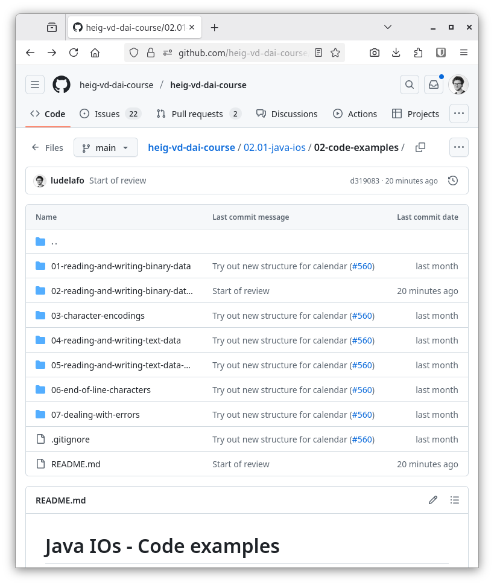
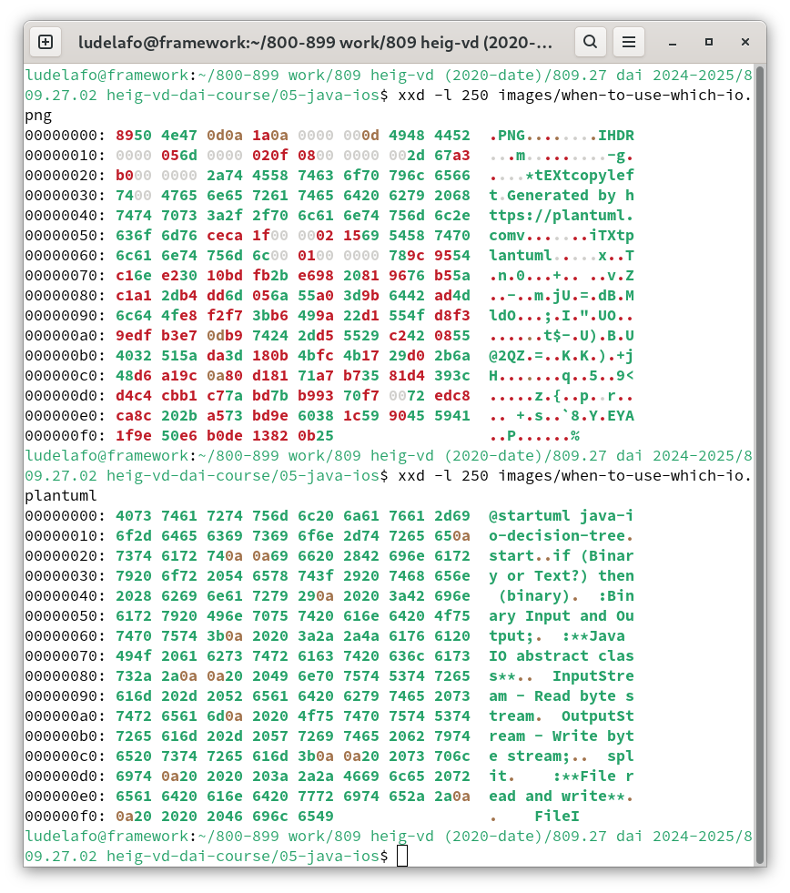
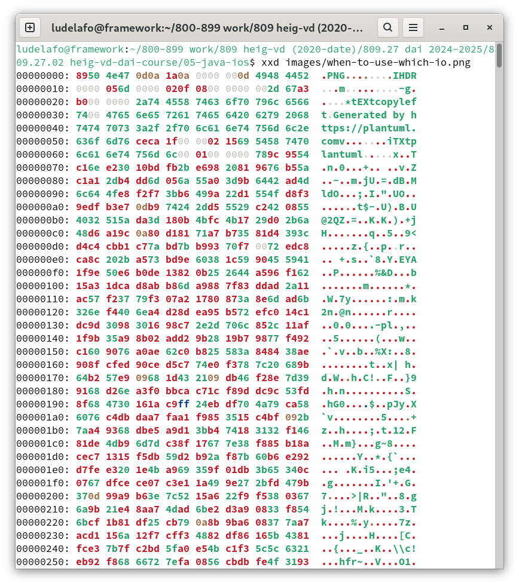
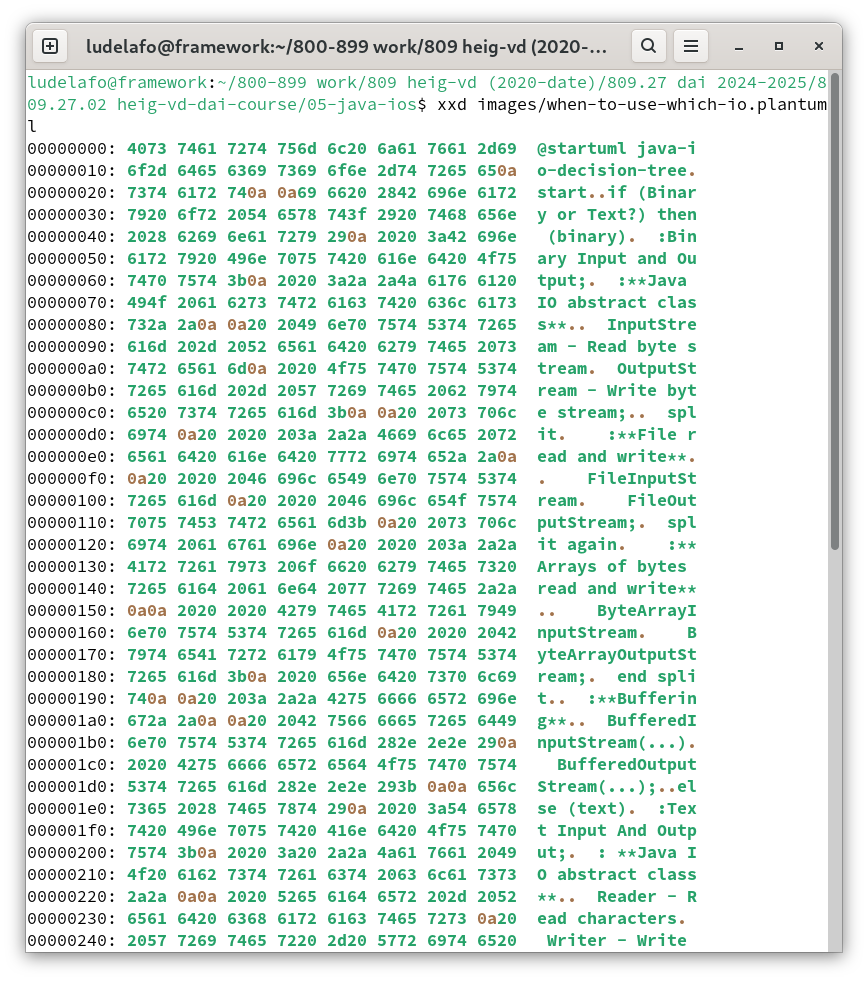
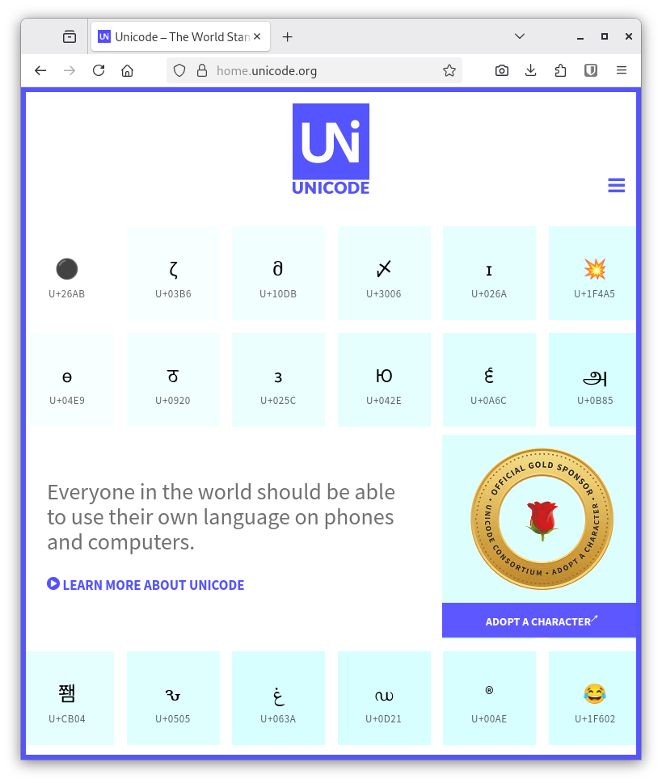
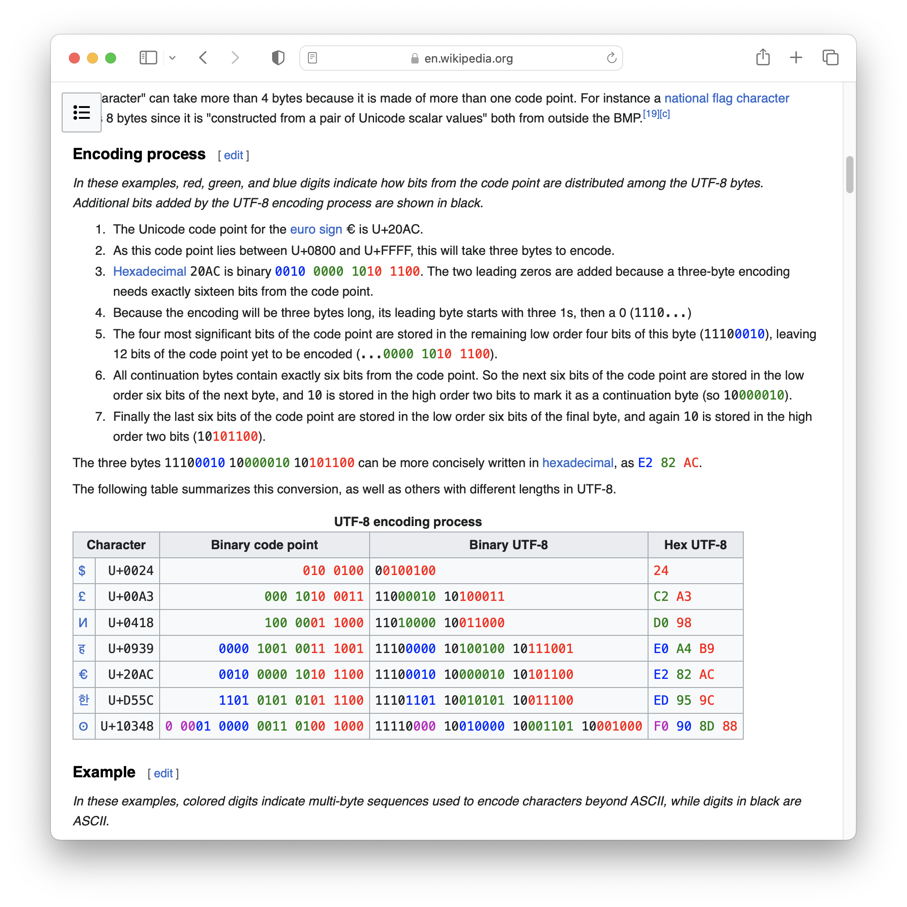
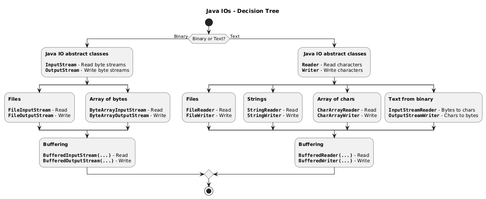
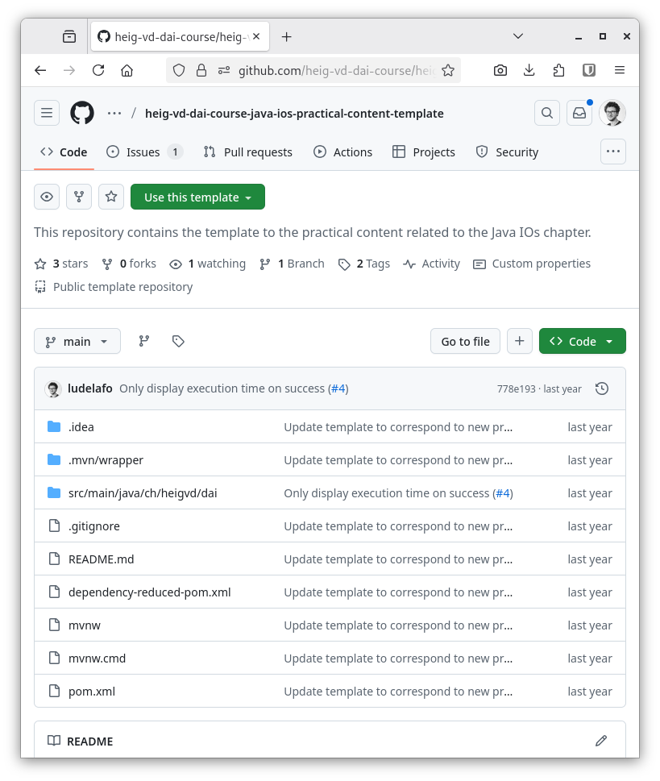

<!--
theme: custom-marp-theme
size: 16:9
paginate: true
author: L. Delafontaine and H. Louis, with the help of GitHub Copilot
title: HEIG-VD DAI - Java IOs
description: Java IOs for the DAI course at HEIG-VD, Switzerland
header: '[**Java IOs**](https://github.com/heig-vd-dai-course/heig-vd-dai-course/tree/main/02.01-java-ios)'
footer: '[**HEIG-VD**](https://heig-vd.ch) - [DAI 2025-2026](https://github.com/heig-vd-dai-course/heig-vd-dai-course) - [CC BY-SA 4.0](https://github.com/heig-vd-dai-course/heig-vd-dai-course/blob/main/LICENSE.md)'
headingDivider: 6
-->

# Java IOs

<!--
_class: lead
_paginate: false
-->

[Link to the course][course]

<small>L. Delafontaine and H. Louis, with the help of
[GitHub Copilot](https://github.com/features/copilot).</small>

<small>Based on the original course by O. Liechti and J. Ehrensberger.</small>

<small>This work is licensed under the [CC BY-SA 4.0][license] license.</small>

![bg opacity:0.1][illustration]

## Objectives

- Differentiate the different types of data (binary vs. text).
- Understand the abstract notion of sources, streams and sinks.
- Use the different IO types for different use-cases.
- Use the Java IO API to read and write files.


## Prepare and setup your environment

<!-- _class: lead -->

More details for this section in the [course material][course]. You can find
other resources and alternatives as well.

### Clone the main repository

- Clone the
  [`heig-vd-dai-course/heig-vd-dai-course`](https://github.com/heig-vd-dai-course/heig-vd-dai-course)
  repository locally.
- Open the repository in your favorite IDE.
- Navigate to the `02.01-java-ios` directory.



### Check and run the code examples

All code examples are in the `02-code-examples` directory:

- Run the code examples.
- It will help you to understand the concepts.
- Play with the code examples.


## Sources, streams and sinks of data

<!-- _class: lead -->

More details for this section in the [course material][course]. You can find
other resources and alternatives as well.

### Sources, streams and sinks of data

- Abstraction of data flow.
- Source: where data comes from (input).
- Sink: where data goes to (output).
- Stream: data flows between source and sink.


## The Java IO API

<!-- _class: lead -->

More details for this section in the [course material][course]. You can find
other resources and alternatives as well.

### The Java IO API

- Part of `java.base` module:
  - `java.io` package.
  - `java.nio` package.
- Different classes for different IO types:
  - Binary data.
  - Text data.


## Types of data

<!-- _class: lead -->

More details for this section in the [course material][course]. You can find
other resources and alternatives as well.

### Types of data

- Two types of data:
  - Binary.
  - Text.
- Both are `0`s and `1`s - the difference is in interpretation:
  - Binary data - raw data.
  - Text data - interpretation.



## Processing binary data with the Java IO API

<!-- _class: lead -->

More details for this section in the [course material][course]. You can find
other resources and alternatives as well.

### Processing binary data with the Java IO API

- Most basic type of data processing:
  1. Open a file.
  2. Read/write/modify the bytes as they are.
  3. Close the file.



### Reading binary data

- Most simple way is to read byte by byte (not efficient).
- `InputStream` and `FileInputStream` classes are used to read binary data.
- Let's have a look at the example `BinaryReadFileExample`.


---

```java
class BinaryReadFileExample {

  public static void main(String[] args) throws IOException {
    InputStream fis = new FileInputStream("binary-file.bin");

    // -1 indicates the end of the file
    int b;
    while ((b = fis.read()) != -1) {
      System.out.print(b);
    }

    fis.close();
  }
}
```

### Writing binary data

- Most simple way is to write byte by byte (not efficient).
- `OutputStream` and `FileOutputStream` classes are used to write binary data.
- Let's have a look at the example `BinaryWriteFileExample`.


---

```java
class BinaryWriteFileExample {

  public static void main(String[] args) throws IOException {
    OutputStream fos = new FileOutputStream("binary-file.bin");

    for (int i = 0; i < 256; i++) {
      fos.write(i);
    }

    fos.close();
  }
}
```

### Reading and writing binary data with buffers

- Reading and writing byte by byte is not efficient: each `read()` or `write()`
  call results in a system call every time.
- Buffers can be used to read write multiple bytes at once.


---

Use a buffer to read multiple bytes at once:

1. First time, a system call is made to read a block of data.
2. Subsequent reads are done from the buffer.
3. When the buffer is empty, a new block is read.


---

The same applies for writing:

1. First time, a buffer is created.
2. Data is written to the buffer.
3. When the buffer is full, a system call is made to write the block.
4. The buffer is then emptied.
5. Bytes can remain in the buffer.
   - A flush might be needed to empty the buffer.


---

- `BufferedInputStream` and `BufferedOutputStream` classes are used to
  read/write binary data with buffers.
- Let's have a look at the examples `BinaryBufferReadFileExample` and
  `BinaryBufferWriteFileExample`.


---

```diff
   public static void main(String[] args) throws IOException {
     InputStream fis = new FileInputStream("binary-file.bin");
+    InputStream bis = new BufferedInputStream(fis);

     // -1 indicates the end of the file
     int b;
-    while ((b = fis.read()) != -1) {
+    while ((b = bis.read()) != -1) {
       System.out.print(b);
     }

-    fis.close();
+    // Closing the BufferedInputStream automatically
+    // closes the FileInputStream
+    bis.close();
   }
```

---

```diff
   public static void main(String[] args) throws IOException {
     OutputStream fos = new FileOutputStream("binary-file.bin");
+    OutputStream bos = new BufferedOutputStream(fos);

     for (int i = 0; i < 256; i++) {
-      fos.write(i);
+      bos.write(i);
     }

-    fos.close();
+    // Flush the buffer to write the remaining bytes
+    bos.flush();
+    bos.close();
   }
```

### A quick note on little endian vs. big endian

- Little endian: least significant byte first.
- Big endian: most significant byte first.
- Java uses big endian by default.
- The class `ByteBuffer` can be used to convert between the two (not covered in
  this course).
- Example: `12345678`:
  - Little endian: `0x78 0x56 0x34 0x12`.
  - Big endian: `0x12 0x34 0x56 0x78`.

## Processing text data with the Java IO API

<!-- _class: lead -->

More details for this section in the [course material][course]. You can find
other resources and alternatives as well.

### Processing text data with the Java IO API

- Text data: interpretation of binary data.
- Different character encodings.
- Different end of line characters.
- Different IO classes for text data.



### Ancestor of character representations: ASCII

- ASCII: 128 binary values.
- Mapping binary to characters.
- Published in 1963 and meant for English.


### Extended ASCII: codes pages

- Extended ASCII (code pages).
- Support for more characters using the remaining 128 values.


### Unicode

- Unicode: solves ASCII limitations.
- Standard to support all languages.
- Different implementations:
  - UTF-8.
  - UTF-16.
  - UTF-32.



### UTF-8

- UTF-8: variable-length encoding.
- Most common Unicode implementation.
- ASCII compatible.
- Quite the standard for web and software development.



### What happens if you ignore the character encoding?

- Not stored in the file itself.
- Misinterpretation leads to issues.
- Check, compile and run the `TextCharacterEncodingsExample` example!


### Reading and writing text data

- `Reader` and `Writer` classes are used to read/write text data.
- **Always specify the encoding!** If not set, it can be incompatible with other
  systems.
- Let's have a look at the example `TextReadAndWriteFileExample`.


---

```java
class TextReadAndWriteFileExample {

  public static void main(String[] args) throws IOException {
    Reader reader = new FileReader("file.java", StandardCharsets.UTF_8);
    Writer writer = new FileWriter("file.txt", StandardCharsets.UTF_8);

    // -1 indicates the end of the file
    int c;
    while ((c = reader.read()) != -1) {
      writer.write(c);
    }

    writer.close();
    reader.close();
  }
}
```

---

- Just like with binary data, reading and writing text data byte by byte is not
  efficient.
- `BufferedReader` and `BufferedWriter` classes are used to read/write text data
  with buffers.
- Let's have a look at the example `TextBufferReadAndWriteFileExample`.


---

```diff
   public static void main(String[] args) throws IOException {
     Reader reader = new FileReader("TextReadAndWriteFileExample.java", StandardCharsets.UTF_8);
+    BufferedReader br = new BufferedReader(reader);
+
     Writer writer = new FileWriter("TextReadAndWriteFileExample.txt", StandardCharsets.UTF_8);
+    BufferedWriter bw = new BufferedWriter(writer);

     // -1 indicates the end of the file
     int c;
-    while ((c = reader.read()) != -1) {
-      writer.write(c);
+    while ((c = br.read()) != -1) {
+      bw.write(c);
     }

-    writer.close();
-    reader.close();
+    // Flush the buffer to write the remaining bytes
+    bw.flush();
+    bw.close();
+    br.close();
   }
```

### End of line characters

Different on different each system:

- Linux/macOS: `\n` (`LF`).
- Windows: `\r\n` (`CR`+`LF`).
- **Always specify the end of line characters** (just as with the encoding)!


---

```java
class TextEndOfLineCharactersExample {

  public static String END_OF_LINE = "\n";

  public static void main(String[] args) throws IOException {
    InputStream is = new FileInputStream("file.java");
    Reader reader = new InputStreamReader(is, StandardCharsets.UTF_8);
    BufferedReader br = new BufferedReader(reader);

    OutputStream os = new FileOutputStream("file.txt");
    Writer writer = new OutputStreamWriter(os, StandardCharsets.UTF_8);
    BufferedWriter bw = new BufferedWriter(writer);

    String line;
    while ((line = br.readLine()) != null) {
      // Careful: line does not contain end of line characters
      bw.write(line + END_OF_LINE);
    }

    bw.flush();
    br.close();
    is.close();
  }
}
```

### Dealing with errors

- All kinds of errors can occur when reading/writing files.
- Files must be properly opened and closed.
- Ensure no files are corrupted.
- Two main ways to handle exceptions:
  - `try-catch-finally` blocks.
  - `try-with-resources` blocks.


---

```java
// Bad example: try-catch without finally
public static void tryCatchWithoutFinallyExample() {
  try {
    Reader reader = new FileReader("missing.file");
    Writer writer = new FileWriter("missing.file");

    writer.write(reader.read());
  } catch (IOException e) {
    System.out.println("Exception: " + e);
  }
}
```

---

```java
// Better example: try-catch with finally
public static void tryCatchFinallyExample() {
  Reader reader = null;
  Writer writer = null;

  try {
    reader = new FileReader("missing.file");
    writer = new FileWriter("missing.file");

    writer.write(reader.read());
  } catch (IOException e) {
    System.out.println("Exception: " + e);
  } finally {
    if (writer != null) {
      try {
        writer.close();
      } catch (IOException e) {
        System.out.println("Exception in close writer: " + e);
      }
    }

    if (reader != null) {
      try {
        reader.close();
      } catch (IOException e) {
        System.out.println("Exception in close reader: " + e);
      }
    }
  }
}
```

---

```java
// Best example: try-with-resources
public static void tryWithResourcesExample() {
  try (Reader reader = new FileReader("missing.file");
      Writer writer = new FileWriter("missing.file")) {
    writer.write(reader.read());
  } catch (IOException e) {
    System.out.println("Exception: " + e);
  }
}
```

## When to use which IO?

<!-- _class: lead -->

More details for this section in the [course material][course]. You can find
other resources and alternatives as well.

### When to use which IO?



## Common pitfalls

<!-- _class: lead -->

More details for this section in the [course material][course]. You can find
other resources and alternatives as well.

### Common pitfalls

- Not using buffers.
- Not closing the streams.
- Not handling exceptions properly.
- Not specifying the character encoding.
- Not specifying the end of line characters.
- Do not use `PrintWriter` - it swallows exceptions.
- Do not use `System.lineSeparator()` - it is platform dependent.

## Questions

<!-- _class: lead -->

Do you have any questions?

## Practical content

<!-- _class: lead -->

### What will you do?

Benchmark the different types of streams you have learned:

- Assemble all the code examples to satisfy the use-cases.
- Run some benchmarks to determine the best IOs for the given use-cases.



### Now it's your turn!

- Read the course material.
- Do the practical content.
- Ask questions if you have any.

➡️ [Find the course on GitHub][course].

**Do not hesitate to help each other! There's no need to rush!**

![bg right w:75%][course-qr-code]

## Finished? Was it easy? Was it hard?

Can you let us know what was easy and what was difficult for you during this
course?

This will help us to improve the course and adapt the content to your needs. If
we notice some difficulties, we will come back to you to help you.

➡️ [GitHub Discussions][discussions]

You can use reactions to express your opinion on a comment!

## Sources

- Main illustration by [Martijn Baudoin](https://unsplash.com/@martijnbaudoin)
  on [Unsplash](https://unsplash.com/photos/4h0HqC3K4-c)
- Illustration by [Aline de Nadai](https://unsplash.com/@alinedenadai) on
  [Unsplash](https://unsplash.com/photos/j6brni7fpvs)
- Illustration by [T K](https://unsplash.com/@realaxer) on
  [Unsplash](https://unsplash.com/photos/9AxFJaNySB8)
- Illustration by [Anna Dudkova](https://unsplash.com/@annadudkova) on
  [Unsplash](https://unsplash.com/photos/urs_y9NwFcc)
- Illustration by [Sigmund](https://unsplash.com/@sigmund) on
  [Unsplash](https://unsplash.com/photos/By-tZImt0Ms)

[course]:
	https://github.com/heig-vd-dai-course/heig-vd-dai-course/tree/main/02.01-java-ios
[license]:
	https://github.com/heig-vd-dai-course/heig-vd-dai-course/blob/main/LICENSE.md
[discussions]: https://github.com/orgs/heig-vd-dai-course/discussions/4
[illustration]: ./images/main-illustration.jpg
[course-qr-code]:
	https://quickchart.io/qr?format=png&ecLevel=Q&size=400&margin=1&text=https://github.com/heig-vd-dai-course/heig-vd-dai-course/blob/main/05-java-ios/COURSE_MATERIAL.md
