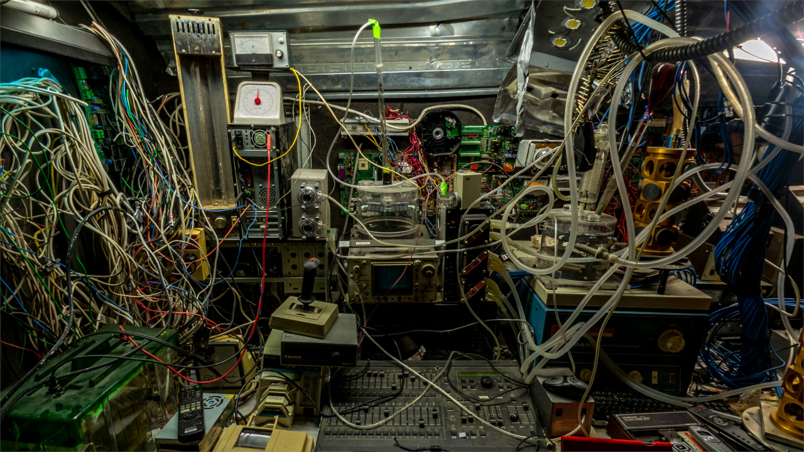
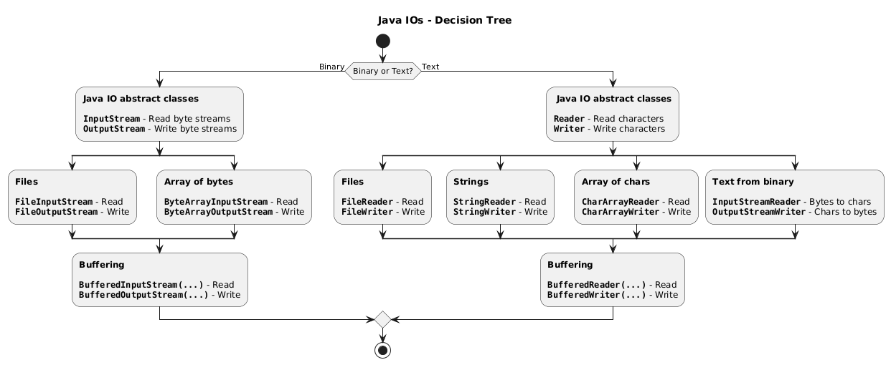
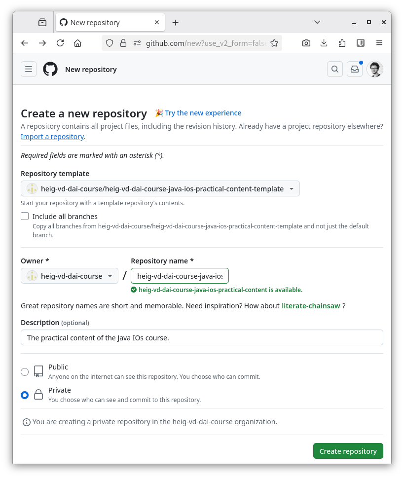

# Java IOs



L. Delafontaine and H. Louis, with the help of
[GitHub Copilot](https://github.com/features/copilot).

Based on the original course by O. Liechti and J. Ehrensberger.

This work is licensed under the [CC BY-SA 4.0][license] license.

## Resources

- Objectives, teaching and learning methods, and evaluation methods:
  [Link to content](..)
- Course material: [Link to content](../01-course-material/README.md) ·
  [Presentation (web)](https://heig-vd-dai-course.github.io/heig-vd-dai-course/02.01-java-ios/01-course-material/index.html)
  ·
  [Presentation (PDF)](https://heig-vd-dai-course.github.io/heig-vd-dai-course/02.01-java-ios/01-course-material/02.01-java-ios-presentation.pdf)
- Code examples: [Link to content](../02-code-examples/)
- Solution: [Link to content](../03-solution/)

## Table of contents

- [Resources](#resources)
- [Table of contents](#table-of-contents)
- [Objectives](#objectives)
- [Prepare and setup your environment](#prepare-and-setup-your-environment)
  - [Clone or fetch latest changes from the main repository to get the code examples](#clone-or-fetch-latest-changes-from-the-main-repository-to-get-the-code-examples)
  - [Open the repository in your IDE](#open-the-repository-in-your-ide)
  - [Access the code examples in your terminal](#access-the-code-examples-in-your-terminal)
  - [Explore and run the code examples](#explore-and-run-the-code-examples)
- [Sources, streams and sinks of data](#sources-streams-and-sinks-of-data)
- [The Java IO API](#the-java-io-api)
- [Types of data](#types-of-data)
- [Processing binary data with the Java IO API](#processing-binary-data-with-the-java-io-api)
  - [Reading binary data](#reading-binary-data)
  - [Writing binary data](#writing-binary-data)
  - [Reading and writing binary data with buffers](#reading-and-writing-binary-data-with-buffers)
  - [A quick note on little endian vs. big endian](#a-quick-note-on-little-endian-vs-big-endian)
- [Processing text data with the Java IO API](#processing-text-data-with-the-java-io-api)
  - [Ancestor of character representations: ASCII](#ancestor-of-character-representations-ascii)
  - [Extended ASCII: codes pages](#extended-ascii-codes-pages)
  - [Unicode](#unicode)
  - [UTF-8](#utf-8)
  - [What happens if you ignore the character encoding?](#what-happens-if-you-ignore-the-character-encoding)
  - [Reading and writing text data](#reading-and-writing-text-data)
  - [End of line characters](#end-of-line-characters)
  - [Dealing with errors](#dealing-with-errors)
- [When to use which IO?](#when-to-use-which-io)
- [Common pitfalls](#common-pitfalls)
- [Practical content](#practical-content)
  - [Create and clone the repository](#create-and-clone-the-repository)
  - [Implement the different types of streams](#implement-the-different-types-of-streams)
  - [Compare the results](#compare-the-results)
  - [Share your results](#share-your-results)
  - [Go further](#go-further)
- [Conclusion](#conclusion)
  - [What did you do and learn?](#what-did-you-do-and-learn)
  - [Test your knowledge](#test-your-knowledge)
- [Finished? Was it easy? Was it hard?](#finished-was-it-easy-was-it-hard)
- [Additional resources](#additional-resources)
- [Solution](#solution)
- [Sources](#sources)

## Objectives

This chapter will help you understand why IOs are important in network
programming and how to use them in Java.

Network programming is about reading and writing data (= files) from and to the
network. Files are a great example to understand how IOs work in the first place
without the hassle of network programming.

You might need to use different types of IOs depending on the type of data you
want to process. You will learn how to use the right IOs for the right data.

As this chapter is quite abstract, you will first setup your environment to be
able to run some code examples along with the theory.

These skills are essential to be able to process data from the network later on
this course!

In a nutshell, by the end of this course, you should be able to:

- Differentiate the different types of data (binary vs. text).
- Understand the abstract notion of sources, streams and sinks.
- Use the different IO types for different use-cases.
- Use the Java IO API to read and write files.

Let's get started!

## Prepare and setup your environment

### Clone or fetch latest changes from the main repository to get the code examples

Clone or fetch latest changes from the
[`heig-vd-dai-course/heig-vd-dai-course`](https://github.com/heig-vd-dai-course/heig-vd-dai-course)
repository to get the code examples:

```sh
# Clone the repository if you have not done it yet
git clone git@github.com:heig-vd-dai-course/heig-vd-dai-course.git
```

or fetch latest changes if you have already cloned it:

```sh
# Navigate to the cloned repository
cd heig-vd-dai-course

# Checkout to the main branch
git checkout main

# Pull latest changes
git pull
```

### Open the repository in your IDE

Open the `heig-vd-dai-course` repository in your favorite IDE.

### Access the code examples in your terminal

Open a terminal and navigate to the
`heig-vd-dai-course/02.01-java-ios/02-code-examples/` directory.

### Explore and run the code examples

Check out the `heig-vd-dai-course/02.01-java-ios/02-code-examples/README.md`
file to learn how to run the code examples.

> [!TIP]
>
> As a quick reminder, these commands can help you to navigate in the terminal:
>
> - `ls` to list the files and directories in the current directory
> - `cd directory` to navigate to the `directory` directory
> - `cd ..` to navigate to the parent directory
> - `pwd` to print the current directory
> - `clear` to clear the terminal
> - `exit` to exit the terminal

> [!TIP]
>
> As a quick reminder, you can run the code examples using the following
> commands:
>
> ```sh
> # Compile the code example
> javac HelloWorld.java
>
> # Run the code example
> java HelloWorld
> ```

You now have everything you need to run the code examples. Let's dive into the
theory!

## Sources, streams and sinks of data

Whenever you deal with data, you need to read data from a source and write it to
a destination.

An abstraction of this process is called sources, streams and sinks of data.

A stream is a way to read or write data from a source to a sink.

A source of data is where the data comes from. It can be a file, a network
connection, a keyboard, etc. A common term for a source of data is something
that produces data (a _producer_).

A sink of data is where the data goes. It can be another file, a network
connection, a screen, etc. A common term for a sink of data is something that
consumes data (a _consumer_).

A stream is a way to read or write data from a source to a sink.

## The Java IO API

The [Java documentation](https://docs.oracle.com/en/java/javase/21/docs/api/) is
separated in modules. The Java IO API is part of the `java.base` module.

In the `java.base` module, there are two main packages to read and write data:

- `java.io`: the standard Java IO API.
- `java.nio`: the Java NIO API.

The `java.io` package is called the _Java IO API_ or the _standard Java IO API_.

The _Java NIO API_ was introduced in Java 1.4. It is a more modern API that can
be more efficient and more flexible than the Java IO API in some use-case. It is
also more complex to use and is meant for more advanced use cases (writing
scalable servers for example). We will not cover this API in this teaching unit.

## Types of data

When you deal with data, you need to know what type of data you are dealing
with.

There are two main types of data:

- **Binary data**: data that is stored as bytes. This is the most basic type of
  data. It is used to store files, images, videos, etc.
- **Text data**: data that is stored as characters. This is a more complex type
  of data. It is used to store text files, configuration files, etc.

What differentiates binary data from text data is how the data is interpreted:

- **Binary data**: the data is read or written as bytes. You do not have to
  interpret the bytes, you just use them as they are.
- **Text data**: the data is read or written as characters. You have to
  interpret the bytes to get the characters.

When you read or write data, you need to know what type of data you are dealing
with to use the right tools to read or write the data.

## Processing binary data with the Java IO API

Binary data processing is the most basic type of data processing:

1. You open a file.
2. You read/write/modify the bytes as they are (e.g. copy to another file).
3. You close the file.

You do not have to interpret the bytes, you just use them as they are.

### Reading binary data

When you read binary data, you read the bytes as they are stored in the file.

The most simple way to read binary data is byte by byte.

This is done using the `InputStream` class. The `InputStream` class is an
abstract class that is the superclass of all classes representing an input
stream of bytes (e.g. `FileInputStream`).

Open the `BinaryReadFileExample.java` file to see how to read binary data byte
by byte.

The following line opens a file for reading binary data. It will attempt to open
the file `binary-file.bin` in the current directory:

```java
InputStream fis = new FileInputStream("binary-file.bin");
```

As this file is not yet created, the program will throw a
`FileNotFoundException` exception if you try to execute the program. This is
normal.

An exception is a way to signal that something went wrong and should be handled.
In this case, it is expected as the file does not exist yet. You will create
this file and run the program later.

The following line reads data from the file byte by byte:

```java
// -1 indicates the end of the file
int b;
while ((b = fis.read()) != -1) {
  System.out.print(b);
}
```

Each `read()` call will read one byte from the file. The `read()` method returns
the byte read as an `int`. If the end of the file is reached, the `read()`
method will return `-1`.

The following line closes the file:

```java
fis.close();
```

This is important to close the file after you have read the data. If you do not
close the file, you might lose data or corrupt the file as other processes might
not be able to access the file.

Compile and execute the `BinaryReadFileExample.java` file. This will throw a
`FileNotFoundException` exception as the file `binary-file.bin` does not yet
exist.

Continue to the next section to see how to create this file.

### Writing binary data

When you write binary data, you write the bytes as they are stored in the file.

The most simple way to write binary data is byte by byte.

This is done using the `OutputStream` class. The `OutputStream` class is an
abstract class that is the superclass of all classes representing an output
stream of bytes.

Open the `BinaryWriteFileExample.java` file to see how to write binary data byte
by byte.

The following line opens a file for writing binary data. It will attempt to open
the file `binary-file.bin` in the current directory:

```java
OutputStream fos = new FileOutputStream("binary-file.bin");
```

The following line writes data to the file byte by byte:

```java
for (int i = 0; i < 256; i++) {
  fos.write(i);
}
```

Each `write()` call will write one byte to the file.

The following line closes the file:

```java
fis.close();
```

This is important to close the file after you have read the data. If you do not
close the file, you might lose data or corrupt the file as other processes might
not be able to access the file.

Compile and execute the `BinaryWriteFileExample.java` file. This will create the
file `binary-file.bin` in the current directory.

Compile and execute the `BinaryReadFileExample.java` file. This will read the
content of the file `binary-file.bin` and print the file content to the console.

### Reading and writing binary data with buffers

When you read or write binary data byte by byte, each `read()` or `write()` call
will issue a system call to read or write one byte from or to the file. This is
not efficient.

To improve the performance, you can (and should) use a buffer. Instead of
reading one byte at a time, you can read a block of bytes at a time:

- When reading for the first time, a system call is made and the data read is
  stored in the buffer.
- Then, as long as the buffer is not empty, we read from it (no system call).
- As soon as the buffer is empty, a new system call is made and the process is
  repeated.

The same applies when writing data:

- When writing for the first time, a system call is made and a buffer is created
  to store the data.
- Then, as long as the buffer is not full, we write to it (no system call).
- As soon as the buffer is full, its content is written to the file and the
  buffer is emptied and the process is repeated.
- When closing the file, the remaining data in the buffer is written to the
  file.

This is done using the `BufferedInputStream` and `BufferedOutputStream` classes.

The `BufferedInputStream` class is a subclass of the `InputStream` class that
adds buffering to the input stream. The `BufferedOutputStream` class is a
subclass of the `OutputStream` class that adds buffering to the output stream.

Open the `BinaryBufferReadFileExample.java` file to see how to read binary data
with buffers.

Here are the changes between the `BinaryReadFileExample.java` file and the
`BinaryBufferReadFileExample.java` file:

```diff
   public static void main(String[] args) throws IOException {
     InputStream fis = new FileInputStream("binary-file.bin");
+    BufferedInputStream bis = new BufferedInputStream(fis);

     // -1 indicates the end of the file
     int b;
-    while ((b = fis.read()) != -1) {
+    while ((b = bis.read()) != -1) {
       System.out.print(b);
     }

-    fis.close();
+    // Closing the BufferedInputStream automatically closes the FileInputStream
+    bis.close();
   }
```

The `BufferedInputStream` class is created with the `FileInputStream` class as
an argument. The `BufferedInputStream` class will read data from the
`FileInputStream` class and store it in a buffer.

The `BufferedInputStream` class will read data from the buffer instead of
reading data from the file directly. This is more efficient as the buffer can
store more data than the `FileInputStream` class can read in one system call.

Compile and execute the `BinaryBufferReadFileExample.java` file. This will read
the content of the file `binary-file.bin` and print the file content to the
console.

Open the `BinaryBufferWriteFileExample.java` file to see how to write binary
data with buffers.

Here are the changes between the `BinaryWriteFileExample.java` file and the
`BinaryBufferWriteFileExample.java` file:

```diff
   public static void main(String[] args) throws IOException {
     OutputStream fos = new FileOutputStream("binary-file.bin");
+    BufferedOutputStream bos = new BufferedOutputStream(fos);

     for (int i = 0; i < 256; i++) {
-      fos.write(i);
+      bos.write(i);
     }

-    fos.close();
+    // Flush the buffer to write the remaining bytes
+    bos.flush();
+    bos.close();
   }
```

The `BufferedOutputStream` class is created with the `FileOutputStream` class as
an argument. The `BufferedOutputStream` class will write data to the
`FileOutputStream` class and store it in a buffer.

The `BufferedOutputStream` class will write data to the buffer instead of
writing data to the file directly. This is more efficient as the buffer can
store more data than the `FileOutputStream` class can write in one system call.

The `flush()` method is called to write the remaining bytes in the buffer to the
file. The `flush()` method is automatically called when the `close()` method is
called.

We recommend calling the `flush()` method before calling the `close()` method
anyway to ensure that all data is written to the file just in case you do some
other operations before effectively closing the file.

Compile and execute the `BinaryBufferWriteFileExample.java` file. This will
create the file `binary-file.bin` in the current directory.

Compile and execute the `BinaryBufferReadFileExample.java` file. This will read
the content of the file `binary-file.bin` and print the file content to the
console.

### A quick note on little endian vs. big endian

When working with binary data, you need to know if the data is encoded in little
endian or in big endian.

Little endian means that the least significant byte is stored first. Big endian
means that the most significant byte is stored first.

For example, the number `0x12345678` is stored as `0x78 0x56 0x34 0x12` in
little endian and as `0x12 0x34 0x56 0x78` in big endian.

This is important to know when you read or write binary data. If you read or
write binary data in the wrong endian, the data will be corrupted.

Java uses big endian by default. You can use little endian by using the
`ByteBuffer` class. We will not cover this in this course.

## Processing text data with the Java IO API

While binary data processing is quite simple, text data processing is more
complex.

When you read text data, you need to interpret the bytes to get the characters.

When you write text data, you need to encode the characters to bytes.

To better understand text data processing, you need to understand character
encodings.

### Ancestor of character representations: ASCII

The American Standard Code for Information Interchange (ASCII) is one of the
first character encodings. It is a character encoding that maps 128 binary
values to 128 characters. For example, the binary data `01000001` is mapped to
the character `A`.

The first implementation of ASCII was published in 1963. It was meant to be used
for the English language only. It was later extended to support other languages.

### Extended ASCII: codes pages

As ASCII is a very limited character encoding (only 8 bits, leaving 128 other
possible values), many other character encodings were created to support more
characters and languages.

These extended ASCII character encodings are called code pages. They were then
standardized by the International Organization for Standardization (ISO).

Common code pages are ISO-8859-1 (also called Latin-1), ISO-8859-15 (also called
Latin-9), Windows-1252 (also called CP1252), etc.

### Unicode

Unicode is a newer character encoding standard that was meant to solve the
issues of ASCII and code pages that could not support all specificities of all
languages:

- Languages with more than 256 characters (like Chinese).
- Languages with more than one alphabet (like Serbian).
- Languages with more than one writing system (like Chinese or Japanese).

The Unicode specification defines 1,112,064 characters.

This is enough to support all languages in the world as well as emojis (for our
greatest pleasure... 🥲).

Implementations of the Unicode standard are called Unicode Transformation
Formats (UTF). The most common implementations is UTF-8.

### UTF-8

UTF-8 is a variable-length character encoding that uses 1 to 4 bytes to encode a
character. It is the most common implementation of the Unicode standard. It is
the default character encoding on the Internet and many other applications.

UTF-8 is backward compatible with ASCII. This means that if you have a file
encoded in ASCII, it is also encoded in UTF-8.

The following table shows how a character is encoded in UTF-8 depending on the
number of bytes used:

| Binary data                                 | Meaning           |
| ------------------------------------------- | ----------------- |
| `0xxxxxxx`                                  | 1 byte character  |
| `110xxxxx` `10xxxxxx`                       | 2 bytes character |
| `1110xxxx` `10xxxxxx` `10xxxxxx`            | 3 bytes character |
| `11110xxx` `10xxxxxx` `10xxxxxx` `10xxxxxx` | 4 bytes character |

As some bits are used to encode the length of the character, the number of
possible characters is limited, hence the 1,112,064 characters limit.

Other implementations of the Unicode standard exist, such as UTF-16 and UTF-32.
They are not as common as UTF-8 and are not backward compatible with ASCII.

Java strings for instance uses UTF-16, meaning a character is encoded in 2 bytes
(in C/C++, a character is encoded in 1 byte).

### What happens if you ignore the character encoding?

When you open a file, you need to know the character encoding that was used to
encode the file.

The character encoding is not usually stored in the file. You need to know it in
advance to be able to read the file correctly.

When the character encoding is not known in advance or misinterpreted, it can
lead to issues like displaying the wrong characters or not being able to display
the characters at all.

A good example is when you open a text file encoded in UTF-8 with a text editor
that does not support UTF-8. The text editor will try to interpret the file as
ASCII and will display the wrong characters (`é` instead of `é` for example).

Open the `TextCharacterEncodingsExample.java` file to see how to encode and
decode characters with different character encodings.

Compile and execute the `TextCharacterEncodingsExample.java` file. This will
print the word "student" encoded in different character encodings for different
languages.

Notice that the word "student" is encoded in different ways depending on the
character encoding used. This is because the character encoding defines how the
characters are encoded in bytes.

If you do not set the character encoding when you read or write text data, the
default character encoding will be used. This is not what you want as the file
might be encoded in a different character encoding and all systems might not be
able to read the file correctly.

### Reading and writing text data

When you read and write text data, you need to know the character encoding used
to encode the text data.

This is done using the `Reader` and `Writer` classes:

- The `Reader` class is an abstract class that is the superclass of all classes
  representing an input stream of characters (e.g. `FileReader`).
- The `Writer` class is an abstract class that is the superclass of all classes
  representing an output stream of characters (e.g. `FileWriter`).

Open the `TextReadAndWriteFileExample.java` file to see how to read and write
text data.

The following line opens a file for reading text data. It will attempt to open
the file `TextReadAndWriteFileExample.java` (the current file) in the current
directory:

```java
Reader reader = new FileReader("TextReadAndWriteFileExample.java", StandardCharsets.UTF_8);
```

Notice that the character encoding is set to `UTF-8`. This is important to set
the character encoding when you read or write text data. If you do not set the
character encoding, the default character encoding will be used, which is not
what you want as it can differ from other systems.

The following line opens a file for writing text data. It will attempt to open
the file `TextReadAndWriteFileExample.txt` in the current directory:

```java
Writer writer = new FileWriter("TextReadAndWriteFileExample.txt", StandardCharsets.UTF_8);
```

The following line reads data from the file byte by byte and writes it to the
output file:

```java
// -1 indicates the end of the file
int c;
while ((c = reader.read()) != -1) {
  writer.write(c);
}
```

Just as with binary data, each character is read and written byte by byte.

The following line closes the file:

```java
writer.close();
reader.close();
```

Just as with binary data, reading and writing text data byte by byte is not
efficient. You can use a buffer to read and write text data more efficiently.

Open the `TextBufferReadAndWriteFileExample.java` file to see how to read and
write text data with buffers.

Here are the changes between the `TextReadAndWriteFileExample.java` file and the
`TextBufferReadAndWriteFileExample.java` file:

```diff
   public static void main(String[] args) throws IOException {
     Reader reader = new FileReader("TextReadAndWriteFileExample.java", StandardCharsets.UTF_8);
+    BufferedReader br = new BufferedReader(reader);
+
     Writer writer = new FileWriter("TextReadAndWriteFileExample.txt", StandardCharsets.UTF_8);
+    BufferedWriter bw = new BufferedWriter(writer);

     // -1 indicates the end of the file
     int c;
-    while ((c = reader.read()) != -1) {
-      writer.write(c);
+    while ((c = br.read()) != -1) {
+      bw.write(c);
     }

-    writer.close();
-    reader.close();
+    // Flush the buffer to write the remaining bytes
+    bw.flush();
+    bw.close();
+    br.close();
   }
```

The `BufferedReader` class is created with the `FileReader` class as an
argument. The `BufferedReader` class will read data from the `FileReader` class
and store it in a buffer.

The `BufferedReader` class will read data from the buffer instead of reading
data from the file directly. This is more efficient as the buffer can store more
data than the `FileReader` class can read in one system call.

The `BufferedWriter` class is created with the `FileWriter` class as an
argument. The `BufferedWriter` class will write data to the `FileWriter` class
and store it in a buffer.

The `BufferedWriter` class will write data to the buffer instead of writing data
to the file directly. This is more efficient as the buffer can store more data
than the `FileWriter` class can write in one system call.

The `flush()` method is called to write the remaining bytes in the buffer to the
file. This is important to call the `flush()` method to make sure that all data
is written to the file.

Compile and execute the `TextBufferReadAndWriteFileExample.java` file. This will
read the content of the file `TextReadAndWriteFileExample.java` and write the
file content to the file `TextReadAndWriteFileExample.txt`.

### End of line characters

Another important thing to know when dealing with text files is the end of line
character.

The end of line character is a special character that marks the end of a line.

There are different end of line characters depending on the operating system:

- Linux/macOS: `'\n'`, called _"Line feed"_ (`LF`).
- Windows: `'\r\n'`, called _"Carriage Return + Line feed"_ (`CR`+`LF`).

When you read a text file line by line, the string you get will **not** contain
the end of line character(s).

When you write a string to a file, you have to add the end of line character(s)
yourself if you want to write a new line.

Open the `TextEndOfLineCharactersExample.java` file to see how to read and write
text data with end of line characters.

The following line opens a file for writing text data. It will attempt to open
the file `TextEndOfLineCharactersExample.java` (the current file) in the current
directory:

```java
InputStream is = new FileInputStream("TextEndOfLineCharactersExample.java");
Reader reader = new InputStreamReader(is, StandardCharsets.UTF_8);
BufferedReader br = new BufferedReader(reader);
```

Notice that this time, it opens the input file using a `FileInputStream` class
as binary data. It then uses the class `InputStreamReader` to decode the binary
data to text data using the `UTF-8` character encoding. And finally, it uses the
`BufferedReader` class to read the text data with buffers.

The following line opens a file for writing text data. It will attempt to open
the file `TextEndOfLineCharactersExample.txt` in the current directory:

```java
OutputStream os = new FileOutputStream("LineEndingsExample.txt");
Writer writer = new OutputStreamWriter(os, StandardCharsets.UTF_8);
BufferedWriter bw = new BufferedWriter(writer);
```

Notice that this time, it opens the output file using a `FileOutputStream` class
as binary data. It then uses th class `OutputStreamWriter` to write the file
with the `UTF-8` character encoding. And finally, it uses a `BufferedWriter`
class to write the binary data with buffers.

The following line reads data from the file line by line and writes it to the
output file with the end of line character:

```java
String line;
while ((line = br.readLine()) != null) {
  // Careful: line does not contain end of line characters
  bw.write(line + END_OF_LINE);
}
```

The `readLine()` method reads a line from the file. The line does not contain
the end of line character(s). You have to add the end of line character(s)
yourself if you want to write a new line.

Compile and execute the `TextEndOfLineCharactersExample.java` file. This will
read the content of the file `TextEndOfLineCharactersExample.java` and write the
file content to the file `TextEndOfLineCharactersExample.txt` with the end of
line character(s).

While the `System.lineSeparator()` method returns the end of line character(s)
for the current operating system, it is better to set a constant for the end of
line character(s) in your program or allow to set it from a command line
parameter. This way, you can control the end of line character(s) and make sure
that the file is written correctly for the target operating system.

### Dealing with errors

When using the Java IO API, you need to open and close a file before and after
reading or writing data.

If you do not close the file properly, you might lose data or corrupt the file.

When accessing a file, many things can go wrong. The file might not exist, the
file might be corrupted, the file might be locked by another process, etc.

When you open a file, you need to handle these errors **not matter if you are
work with binary or text data**. This is done with a `try-catch-finally` block
or, more recently, with a `try-with-resources` block.

The common exceptions you might encounter are:

- `FileNotFoundException`: the file does not exist
- `UnsupportedEncodingException`: the file is encoded in an unsupported
  character encoding
- `IOException`: the file cannot be accessed for other reasons

The `FileNotFoundException` and `UnsupportedEncodingException` exceptions are
inherited from the `IOException` exception.

The same applies when you will use the network in future chapters: the network
might be down, the connection might be lost, etc.

You will have to manage these errors when you will work with the network.

Open the `DealingWithErrorsExample.java` file to see how to handle errors when
reading and writing data.

The following function is a bad example of how to handle errors when reading and
writing binary data:

```java
public static void tryCatchWithoutFinallyExample() {
  try {
    Reader reader = new FileReader("missing.file");
    Writer writer = new FileWriter("missing.file");

    writer.write(reader.read());
  } catch (IOException e) {
    System.out.println("Exception: " + e);
  }
}
```

It catches an exception but does not close the resources properly as seen in the
previous sections.

Even if the reader and writer would be closed after the
`writer.write(reader.read());` line, it would be enough: if an error occurs when
trying to write to the file (for reasons such as bad permissions, another
process locking the file, etc.), the resources would not be closed properly.

This can lead to resource leaks (= resources that are not closed properly and
that are not available for other parts of the program) and corrupted files.

A better way to handle errors is to use the `try-catch-finally` block as seen in
the following function:

```java
public static void tryCatchFinallyExample() {
  Reader reader = null;
  Writer writer = null;

  try {
    reader = new FileReader("missing.file");
    writer = new FileWriter("missing.file");

    writer.write(reader.read());
  } catch (IOException e) {
    System.out.println("Exception: " + e);
  } finally {
    if (writer != null) {
      try {
        writer.close();
      } catch (IOException e) {
        System.out.println("Exception in close writer: " + e);
      }
    }

    if (reader != null) {
      try {
        reader.close();
      } catch (IOException e) {
        System.out.println("Exception in close reader: " + e);
      }
    }
  }
}
```

Using the `finally` block, the resources are closed properly whenever an error
occurs or not. A `finally` block is always executed, even if no exception is
thrown.

This solution is better than the previous one, but it is verbose and hard to
read. Let's see how to handle errors with the `try-with-resources` block.

The `try-with-resources` block is a more concise and less error-prone way to
handle errors when reading and writing data as seen in the following function:

```java
public static void tryWithResourcesExample() {
  try (Reader reader = new FileReader("missing.file");
      Writer writer = new FileWriter("missing.file")) {
    writer.write(reader.read());
  } catch (IOException e) {
    System.out.println("Exception: " + e);
  }
}
```

The `try-with-resources` block is a `try` block that declares one or more
resources. A resource is an object that must be closed after the program is done
with it. The `try-with-resources` block ensures that each resource is closed at
the end of the block.

While both `try-catching-finally` and `try-with-resources` blocks are valid ways
to handle errors when reading and writing data, the `try-with-resources` block
is the preferred way as it is more concise and less error-prone (you do not have
to remember to close the resources in the `finally` block).

In order for a class to be used in a `try-with-resources` block, it must
implement the
[`AutoCloseable`](https://docs.oracle.com/en/java/javase/21/docs/api/java.base/java/lang/AutoCloseable.html)
interface. All the classes presented in this chapter implement the
`AutoCloseable` interface, whatever you are dealing with binary or text data.

We highly recommend you to use the `try-with-resources` block as it is the
preferred way to handle errors and close resources.

## When to use which IO?

The Java IO API is very powerful. It can be used to read and write data from and
to different sources and sinks of data using different types of streams.

It can sometimes be overwhelming to know which IO to use for which use case.

Here is a simple decision tree to help you choose the right IO for the right use
case:



## Common pitfalls

Always set the character encoding when you read or write text data. If you do
not set the character encoding, the default character encoding will be used,
which is not what you want as it can differ from other systems.

Always close the file after you have read or written data. If you do not close
the file, you might lose data or corrupt the file as other processes might not

Always handle errors when you read or write data. If you do not handle errors,
your program might crash and leave the files in an inconsistent state.

While reading the Java IO API, you might encounter the class `PrintWriter`. The
`PrintWriter` class is a subclass of the `Writer` class that is used to write
text data. It provides many conveniences where you do not have to handle the
`flush()` and `close()` methods yourself. However, it does not handle errors
properly as it does not throw exceptions when an error occurs. We will ask you
not to use the `PrintWriter` class in this course. It is better to use the
`BufferedWriter` class to write text data and handle errors properly.

You might also encounter the `System.lineSeparator()` method. The
`System.lineSeparator()` method returns the end of line character(s) for the
current operating system. As it is a system-dependent property, it is better to
set a constant or ask the user for the wanted end of line character(s) in your
program.

## Practical content

In this practical content, you will use all the knowledge you have learned in
this chapter to benchmark the different types of streams.

You will learn how to read and write data from and to different sources and
sinks of data using different types of streams and benchmark the different types
of streams to see which one is the most efficient for different use cases.

### Create and clone the repository

You can create a new GitHub repository using the template we have prepared for
you.

When you create a new repository, you can choose to use a template. Select the
`heig-vd-dai-course/heig-vd-dai-course-java-ios-practical-content` template as
shown in the following screenshot:



Clone the repository locally.

### Implement the different types of streams

Take some time to explore the codebase from the template we have prepared for
you. Try to understand how the code is structured and what each file does.
Package the application and run it to see how it works.

Your job is to benchmark the different types of streams to see which one is the
most efficient for your use case:

- Open a binary file for byte per byte reading.
- Write a binary file for byte per byte writing.
- Open a binary file for buffer reading.
- Write a binary file for buffer writing.
- Open a text file for byte per byte reading.
- Write a text file for byte per byte writing.
- Open a text file for buffer reading.
- Write a text file for buffer writing.

For this, you must update the diverse classes in the
`src/main/java/ch/heigvd/ios` directory of your repository.

Read the course material carefully to find the right classes to use. You can
also have a look at the Java documentation to find more details on the right
classes to use and how to use them:
<https://docs.oracle.com/en/java/javase/21/docs/api/>.

You will then execute your CLI tool to write data of a certain size and read
them back to compare the execution time.

### Compare the results

Generate different files with different sizes (1B, 1KiB, 1MiB, 5MiB). Compare
the results with the execution time of the different types of streams. Which one
is the most efficient for each use case?

### Share your results

Share your results in the GitHub Discussions of this organization:
<https://github.com/orgs/heig-vd-dai-course/discussions>.

Create a new discussion with the following information:

- **Title**: [DAI 2025-2026 Class \<class ID\>] - Java IOs benchmarking -
  \<first name\> \<last name\> (replace `<class ID>`, `<first name>` and
  `<last name>` with your information, where `<class ID>` is either `A`, `B` or
  `C` depending on your class).
- **Category**: Show and tell.
- **Description**: The link to your GitHub repository, the results of your
  benchmarking in a Markdown table and your conclusions to the following
  questions:
  - Which type of stream is the most efficient for each use case?
  - Why is it more efficient than the other types of streams?
  - What is the difference between binary data and text data?
  - What is a character encoding?
  - Why is this benchmark methodology important?

This will notify us that you have completed the exercise and we can check your
work.

You can compare your solution with the official one stated in the
[Solution](#solution) section, however, **we highly recommend you to try to
complete the practical content by yourself first to learn the most**.

### Go further

This is an optional section. Feel free to skip it if you do not have time.

- You can do the same benchmarking with the Java NIO API. How is it different
  from the Java IO API?

## Conclusion

### What did you do and learn?

In this chapter, you have learned how to read and write data from and to
different sources and sinks of data using different types of streams, more
specifically binary and text data.

You have learned the importance of character encodings and how to handle them
when reading and writing data.

You have learned how to benchmark the different types of streams to find the
most efficient one for your use case.

You have also learned how to handle errors to avoid your program to crash and
leave the files in an inconsistent state.

### Test your knowledge

At this point, you should be able to answer the following questions:

- What is a source of data?
- What is a sink of data?
- What is a stream?
- What is the difference between binary data and text data?
- What is a character encoding?
- What is UTF-8? How is it different from ASCII and Unicode?
- What happens if you ignore the character encoding?
- How is a buffer more efficient than reading or writing byte by byte?

## Finished? Was it easy? Was it hard?

Can you let us know what was easy and what was difficult for you during this
chapter?

This will help us to improve the course and adapt the content to your needs. If
we notice some difficulties, we will come back to you to help you.

➡️ [GitHub Discussions][discussions]

You can use reactions to express your opinion on a comment!

## Additional resources

_Resources are here to help you. They are not mandatory to read._

- [Informatique au gymnase : apprendre - Les caractères](https://apprendre.modulo-info.ch/rep-info/caracteres.html)

_Missing item in the list? Feel free to open a pull request to add it! ✨_

## Solution

You can find the solution to the practical content in the
[`solution`](../03-solution/) directory.

If you have any questions about the solution, feel free to ask as described in
the [Finished? Was it easy? Was it hard?](#finished-was-it-easy-was-it-hard)
section.

## Sources

- Main illustration by [Martijn Baudoin](https://unsplash.com/@martijnbaudoin)
  on [Unsplash](https://unsplash.com/photos/audio-mixer-set-4h0HqC3K4-c)

[license]:
	https://github.com/heig-vd-dai-course/heig-vd-dai-course/blob/main/LICENSE.md
[discussions]: https://github.com/orgs/heig-vd-dai-course/discussions/4
