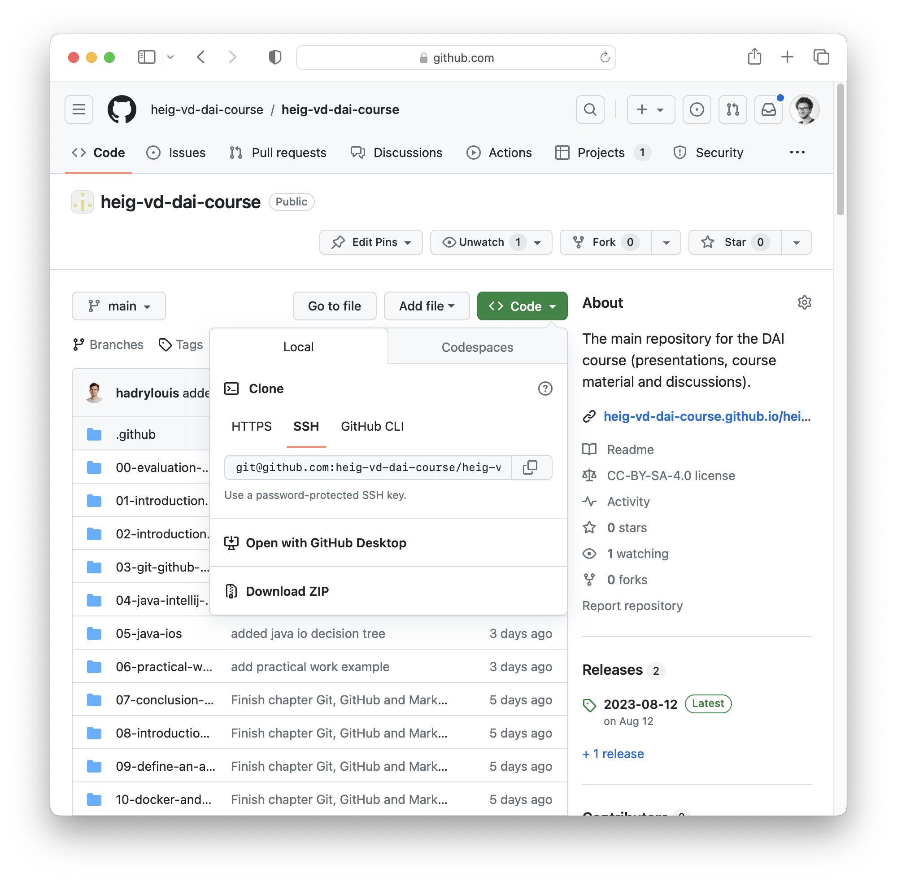

[markdown]:
  https://github.com/heig-vd-dai-course/heig-vd-dai-course/blob/main/03-git-github-and-markdown/COURSE_MATERIAL.md
[pdf]:
  https://heig-vd-dai-course.github.io/heig-vd-dai-course/03-git-github-and-markdown/03-git-github-and-markdown-course-material.pdf
[license]:
  https://github.com/heig-vd-dai-course/heig-vd-dai-course/blob/main/LICENSE.md
[discussions]: https://github.com/orgs/heig-vd-dai-course/discussions/2
[illustration]:
  https://images.unsplash.com/photo-1618401471353-b98afee0b2eb?fit=crop&h=720

# Git, GitHub and Markdown - Course material

<https://github.com/heig-vd-dai-course>

[Markdown][markdown] · [PDF][pdf]

L. Delafontaine and H. Louis, with the help of Copilot.

This work is licensed under the [CC BY-SA 4.0][license] license.

![Main illustration][illustration]

## Table of contents

- [Table of contents](#table-of-contents)
- [Objectives](#objectives)
- [Git](#git)
  - [Architecture](#architecture)
  - [Commits, hashes and tags](#commits-hashes-and-tags)
  - [Branches](#branches)
  - [Merging branches](#merging-branches)
  - [Conflicts](#conflicts)
  - [Ignore files](#ignore-files)
  - [Summary](#summary)
  - [Cheat sheet](#cheat-sheet)
  - [Alternatives](#alternatives)
  - [Resources](#resources)
- [GitHub](#github)
  - [Social platform](#social-platform)
  - [Free features and PRO features](#free-features-and-pro-features)
  - [Users and organizations](#users-and-organizations)
  - [Issues, pull requests and forks](#issues-pull-requests-and-forks)
  - [Summary](#summary-1)
  - [Alternatives](#alternatives-1)
  - [Resources](#resources-1)
- [Markdown](#markdown)
  - [Markdown and output formats](#markdown-and-output-formats)
  - [Syntax](#syntax)
  - [Specifications](#specifications)
  - [Summary](#summary-2)
  - [Alternatives](#alternatives-2)
  - [Resources](#resources-2)
- [Practical content](#practical-content)
  - [Install and configure Git](#install-and-configure-git)
  - [Create and configure your GitHub account](#create-and-configure-your-github-account)
  - [Enable SSH authentication](#enable-ssh-authentication)
  - [Sign commits with SSH](#sign-commits-with-ssh)
  - [Create your own profile README](#create-your-own-profile-readme)
  - [Add yourself to the list of students in the GitHub organization](#add-yourself-to-the-list-of-students-in-the-github-organization)
  - [Go further](#go-further)
- [Conclusion](#conclusion)
  - [What did you do and learn?](#what-did-you-do-and-learn)
  - [Test your knowledge](#test-your-knowledge)
- [Finished? Was it easy? Was it hard?](#finished-was-it-easy-was-it-hard)
- [What will you do next?](#what-will-you-do-next)
- [Sources](#sources)

## Objectives

This chapter will help you to understand how Git and GitHub work, and how you
can use Markdown to write documentation.

These skills are essential for the rest of the course (and your future!), as you
will use Git and GitHub to submit your practical work and to collaborate with
your team.

Documentation is also very important, as any code you write is meant to be used
by other people. Even if you are the only one working on a project, you will
need to understand your own code in a few months or years.

They will want to know that is the purpose of your project and how to use it. A
good documentation is a good publicity for your project.

Let's get started!

## Git

> [Git](https://git-scm.com/) is a free and open source distributed version
> control system (VCS) designed to handle everything from small to very large
> projects with speed and efficiency.

Created by Linus Torvalds in 2005 to manage the Linux kernel source code, Git
allows to track changes in any set of files, usually used for coordinating work
among programmers during software development.

### Architecture

Git is a client-server system, where the server is called a **repository** and
the clients are called **clones**.

The repository is the single source of truth, and the clones are the local
copies of the repository.

Git is a **distributed** VCS, which means that each clone is a full copy of the
repository. This allows to work offline.

### Commits, hashes and tags

Git uses **commits** to track changes. A commit is a snapshot of the repository
at a given time. Each commit has a unique identifier, called a **hash**. The
hash is computed from the content of the commit, so it is impossible to modify a
commit without changing its hash.

Commits can be **tagged** to create a reference to a commit. This is often used
to mark a commit as a release.

Commits can be **signed** to prove that the commit was made by a specific
person. This is done for security reasons.

### Branches

Git uses **branches** to track different versions of the repository. The default
branch is often called `main` (the legacy name was `master`).

Each branch has a name and a pointer to a commit. The pointer is called a
**head**. The head of the main branch is called `HEAD`.

Often, when implementing a new feature, a new branch is created. This is done by
creating a new branch from the main branch.

Once you made all the changes, the modified files are **staged** and a new
commit is created. The commit is then **pushed** to the repository.

Commits can be compared to see the **differences** between the staged files and
the working directory. This is done by comparing the files with the last commit.

Commits can be **pulled** from the repository into the current branch.

### Merging branches

Collaborating on a project is done by creating branches, making and committing
changes, pushing and merging the branches back into the target branch.

There are three main ways to merge branches:

- **Merge**: merge the changes from the two branches into a new commit. This is
  the default behavior of Git.
- **Rebase**: append the source branch to the target branch so no new commits
  are created. This is a more advanced technique.
- **Squash**: Combine multiple commits into a single one to reduce the number of
  commits in a branch.

### Conflicts

Working collaboratively can lead to **conflicts**. Conflicts happen when two or
more people make changes to the same file at the same time. Git is able to
detect conflicts and will ask the user to resolve them.

### Ignore files

Files can be **ignored** by Git. This is done by creating a `.gitignore` file at
the root of the repository. This allows to avoid committing files that should
not be committed, such as IDE configuration files.

We encourage you **not** to use gitignore generators (such as
<https://gitignore.io/>), as they often add too many files to the ignore list.
It is better to add files to the ignore list as you need it.

### Summary

- Git is a distributed VCS
- Git uses commits to track changes
- Git uses branches to track different versions of the repository
- Git can pull changes from a branch into another
- Git can merge, rebase or squash branches/commits
- Git can detect and resolve conflicts

We encourage you to learn how to use Git from the command line, so you can still
use it everywhere (even on a server).

### Cheat sheet

```sh
# Clone a Git repository
git clone <url>

# Create a branch and switch to it
git checkout -b <branch-name>

# Switch to a branch
git checkout <branch-name>

# Add changes to the staging area
git add <file>

# View differences between the working directory and the staging area
git diff <file>

# Check Git status
git status

# Commit changes
git commit -m "Commit message"

# Push changes to a branch
git push origin <branch-name>

# Pull changes from a branch
git pull origin <branch-name>

# Merge a branch into another
git merge <branch-name>
```

### Alternatives

_Alternatives are here for general knowledge. No need to learn them._

- [Subversion](https://subversion.apache.org/)
- [Mercurial](https://www.mercurial-scm.org/)
- [Bazaar](https://bazaar.canonical.com/en/)

_Missing item in the list? Feel free to open a pull request to add it! ✨_

### Resources

_Resources are here to help you. They are not mandatory to read._

- [Atlassian Git tutorials - Beginner](https://www.atlassian.com/git/tutorials/what-is-version-control) -
  Atlassian tutorials are great!
- [Atlassian Git tutorials - Getting started](https://www.atlassian.com/git/tutorials/setting-up-a-repository)
- [Atlassian Git tutorials - Collaborating](https://www.atlassian.com/git/tutorials/syncing)
- [Atlassian Git tutorials - Advanced Tips](https://www.atlassian.com/git/tutorials/advanced-overview)
- [Learn Git Branching](https://learngitbranching.js.org/)

_Missing item in the list? Feel free to open a pull request to add it! ✨_

## GitHub

> [GitHub](https://github.com) is a platform and cloud-based service for
> software development and version control using Git, allowing developers to
> store and manage their code.

GitHub is a web-based Git repository hosting service. It provides all the
features of Git, plus some additional features.

It is the most popular Git repository hosting service, with more than 372
million repositories (January 2023), a home for many open source projects and a
place where many companies host their private repositories.

### Social platform

GitHub is a **social** platform. It allows to **follow** other users and to
**star** repositories. It also allows to **fork** repositories, which means to
create a copy of a repository in your own account.

### Free features and PRO features

GitHub offers features on top of Git. Some features are only available for
public repositories. To enable them for private repositories, you need to
upgrade to a **PRO** account, which is not free.

As a HEIG-VD student, you can get a **PRO** account for free with the
[GitHub Global Campus for students](https://docs.github.com/en/education/explore-the-benefits-of-teaching-and-learning-with-github-education/github-global-campus-for-students)
program.

### Users and organizations

Repositories can be owned by a **user** or by an **organization**.

An organization can have multiple members, and repositories can be shared
between members. It is a good practice to create an organization for a project
that will be worked on by multiple people.

### Issues, pull requests and forks

GitHub also provides a **wiki** for each repository, a **project board** to
manage tasks, an **issue tracker** to report bugs and a **pull request** system
to review and merge changes.

Contributing to a project hosted on GitHub is done by **forking** the
repository, making changes and opening a **pull request** to merge the changes
back into the original repository.

Forking is only needed if you are not a member of the repository or
organization.

Once a branch is ready to be merged into the target branch, it is good practice
to open a **pull request** (or a **merge request** on GitLab). A pull request is
a request to merge a branch into another. It is a way to discuss the changes
before merging them.

Reviewing a pull request is done by **commenting** on the changes. The reviewer
can ask for changes to be made before merging the branch or can approve the
changes.

Once the pull request is approved, the branch can be **merged** into the target
branch.

By default, GitHub does not delete the branch once it is merged. You might want
to enable this by default in your repository settings or delete it manually. It
avoids to cumulate out-dated branches in your repository.

### Summary

The whole process would be as follow:

1. Open an issue to discuss the feature (optional, but recommended)
2. Clone or fork the project and checkout to a new branch
3. Make your changes, commit and push them as often as you want
4. Create the pull request
5. The maintainers review and merge if OK
6. You can delete the branch or the fork

### Alternatives

_Alternatives are here for general knowledge. No need to learn them._

- [GitLab](https://gitlab.com/) - My personal favorite
- [Bitbucket](https://bitbucket.org/) - My least favorite
- [Gitea](https://gitea.io/) - Very good self-hosted alternative
- [Gogs](https://gogs.io/)

_Missing item in the list? Feel free to open a pull request to add it! ✨_

### Resources

_Resources are here to help you. They are not mandatory to read._

- [The Basics of GitHub](https://github.com/education/github-starter-course) - A
  great Git repository to learn the basics of GitHub!

_Missing item in the list? Feel free to open a pull request to add it! ✨_

## Markdown

> [Markdown](https://daringfireball.net/projects/markdown/) is a lightweight
> markup language for creating formatted text using a plain-text editor.

Markdown was created by John Gruber in 2004 with the help of Aaron Swartz
(co-founder of Reddit and an Internet hacktivist). It is a simple markup
language that allows to create formatted text using a plain-text editor.

It is widely used on the Internet, especially on GitHub, and GitLab. It is also
used in many static site generators, such as [Hugo](https://gohugo.io/) and
[MkDocs](https://www.mkdocs.org/).

### Markdown and output formats

The syntax of Markdown is very simple and easy to learn. It is a good
alternative to HTML for creating simple web pages, documentation, README files,
etc. The extension of a Markdown file is `.md`.

You can export Markdown files to HTML, PDF, DOCX, etc. making it a very
versatile format.

It is also possible to use HTML in Markdown files, so it is possible to create
more complex documents.

In fact, the exact current document you are reading right now is written in
Markdown.

### Syntax

Markdown is a markup language, which means that it uses special characters to
format the text. It is very similar to the syntax used in Discord, Telegram,
WhatsApp, etc.

#### Headings

To create headings, use the `#` character. The number of `#` characters
determines the level of the heading.

```markdown
# Heading 1

## Heading 2

### Heading 3

#### Heading 4

##### Heading 5
```

#### Text formatting

Text formatting can be done using `*`, `_`, `~`, `` ` `` or `>` characters.

```markdown
_This is italic_ and _this as well_.

**This is bold** and **this as well**.

This is ~~strikethrough~~.

This is `inline code`.

> This is a quote
```

#### Code blocks

Code blocks can highlight code syntax for many languages. Horizontal rules can
be used to separate sections with `---`.

````markdown
```java
System.out.println("Hello World!");
```

```javascript
console.log("Hello World!");
```

```python
print("Hello World!")
```
````

#### Unordered lists

Unordered lists can be created using `-` or `*` characters.

```markdown
List one

- Item 1
- Item 2
- Item 3

List two

- Item 1
- Item 2
- Item 3
```

#### Ordered lists

Ordered lists can be created using numbers followed by a `.` character. Only the
first number matters, the rest can be anything (but it is not recommended for
readability).

```markdown
1. Item 1
2. Item 2
3. Item 3
4. Still item 4
5. Still item 5
```

#### Links

Links can link to local files, headings, or references.

```markdown
[GitHub](https://github.com/)

<https://gitlab.com>

[`README.md`](./README.md)

[Jump to "Markdown"](#markdown)

[HEIG-VD][heig-vd]

[heig-vd]: https://heig-vd.ch
```

#### Images

Images can be added using the same syntax as links, but with a `!` character in
front of the link. The text field will be used as the alt text for accessibility
and SEO. An optional title can be set with `""` characters.

```markdown


```

#### Tables

Tables can be created using the `|` character to separate columns and `-`
characters to separate the header from the content. The header is optional. The
text alignment can be specified using `:` characters.

```markdown
| Header 1 | Header 2 | Header 3 |
| -------- | :------: | -------: |
| Cell 1   |  Cell 2  |   Cell 3 |
| Cell 4   |  Cell 5  |   Cell 6 |
```

#### HTML

HTML can be used in Markdown files. This allows to create more complex
documents. It is also possible to use CSS to style the document. This is not
covered in this course and I would not recommend it as the goal of Markdown is
to be simple.

If you have a look at the source code of this document (the Markdown version on
GitHub), you will see that it is written in Markdown and that it uses HTML to
create the slides with the help of [Marp](https://marp.app/).

#### "Hacky" tips

You can use HTML comments to hide content from the Markdown parser. The same can
be achieved using a link-reference.

```markdown
<!-- This is a comment -->

[This is a comment]: #
```

New lines can be added between two lines with two spaces at the end of the line
or by using a backslash at the end of a line.

```markdown
<!-- You might want to highlight these lines to see the double spaces -->

A line  
Another line

A line\
Another line
```

### Specifications

Markdown is not a standard and there are many implementations. The most popular
one is [CommonMark](https://commonmark.org/). GitHub uses a slightly different
version called [GitHub Flavored Markdown](https://github.github.com/gfm/).

Some projects use custom extensions to add more features to Markdown. For
example:

- [Material for MkDocs](https://squidfunk.github.io/mkdocs-material/) uses
  custom extensions to add more features to Markdown.
- [Marp](https://marp.app/) uses a custom syntax to manage background images in
  slides.

### Summary

- Markdown is easy to learn and use
- Markdown can be used to create documentation
- Markdown can be used to create slides
- Markdown can be exported to many formats
  - The presentations are exported to Web and PDF with the help of
    [Marp](https://marp.app/)
  - The course material is exported to PDF with the help of
    [Pandoc](https://pandoc.org/)

### Alternatives

_Alternatives are here for general knowledge. No need to learn them._

- [reStructuredText](https://docutils.sourceforge.io/rst.html)
- [AsciiDoc](https://asciidoc.org/)
- [Textile](https://textile-lang.com/)
- [LaTeX](https://www.latex-project.org/) - You might want to consider this if
  you need to write a scientific paper and/or your bachelor/master thesis as it
  is the standard in the scientific community and much more powerful than
  Markdown.

_Missing item in the list? Feel free to open a pull request to add it! ✨_

### Resources

_Resources are here to help you. They are not mandatory to read._

- [Markdown Guide](https://www.markdownguide.org/) - Examples and explanations
  on Markdown specification
- [GitHub Flavored Markdown Spec](https://github.github.com/gfm/)
- [CommonMark Spec](https://commonmark.org/)

_Missing item in the list? Feel free to open a pull request to add it! ✨_

## Practical content

### Install and configure Git

Git will be used for the rest of the course to work collaboratively and to
submit your practical work. It is important to have it installed and configured
properly.

In this section, you will install Git on your system. If you already have it,
please check that it is up to date.

#### Install Git

Go to the official website and follow the instructions on how to install Git on
your system: <https://git-scm.com/downloads>.

#### Check the installation

Open a terminal and type `git --version`.

The output should be similar to this:

```text
git version 2.41.0
```

#### Configure Git

Git needs to know your name and email address to be able to label your commits
properly.

Open a terminal and type the following commands:

```sh
# Set your name
git config --global user.name "Your Name"

# Set your email address
git config --global user.email "Your Email"
```

### Create and configure your GitHub account

GitHub is a social platform, home for many open source projects. You will use it
to publish your work and to collaborate with your team. It is a great visibility
tool for your (future) career.

In this section, you will create and configure your GitHub account. If you
already have one, ensure that it is properly configured. Please avoid the use of
GitHub CLI/Desktop or any other application to manage your repositories to be
able to use Git everywhere.

#### Create a GitHub account

If you do not have a GitHub account yet, you will need to create one.

Follow the official documentation to create your account:
<https://docs.github.com/en/get-started/signing-up-for-github/signing-up-for-a-new-github-account>.

> **Note**  
> Do not forget to
> [verify your email address](https://docs.github.com/en/get-started/signing-up-for-github/verifying-your-email-address)!

#### Enable two-factor authentication (optional, but highly recommended)

Two-factor authentication adds an extra layer of security to your account. It
will require you to enter a code sent to your phone each time you log in to your
account.

Follow the official documentation to enable two-factor authentication:
<https://docs.github.com/en/authentication/securing-your-account-with-two-factor-authentication-2fa>.

#### Enable your PRO account

Having a PRO account will allow you to unlock all the features of GitHub and
other products, such as Copilot. As a HEIG-VD student, you can get a PRO account
for free.

Follow the official documentation to enable your PRO account:
<https://docs.github.com/en/education/explore-the-benefits-of-teaching-and-learning-with-github-education/github-global-campus-for-students>.

### Enable SSH authentication

SSH is a secure protocol to communicate with a server. It is used to
authenticate users on GitHub. Using SSH, you will not have to input your
username and password each time you want to push or pull changes from a
repository, contrary to HTTPS.

In this section you will enable SSH authentication on your GitHub account.

#### Generate a SSH key

Follow the official documentation to generate a SSH key:
<https://docs.github.com/en/authentication/connecting-to-github-with-ssh/generating-a-new-ssh-key-and-adding-it-to-the-ssh-agent>

> **Warning**  
> Never share your private key with anyone! It must be kept secret and
> confidential, just like a password.

#### Add the public SSH key to your GitHub account

Follow the official documentation to add the public SSH key to your GitHub
account:
<https://docs.github.com/en/authentication/connecting-to-github-with-ssh/adding-a-new-ssh-key-to-your-github-account>

#### Test the configuration

You can try to clone this very repository using SSH:

```sh
# Clone the course repository using SSH in a directory named "heig-vd-dai-course"
git clone git@github.com:heig-vd-dai-course/heig-vd-dai-course.git "heig-vd-dai-course"
```

If you are able to clone the repository, it means that your SSH key is properly
configured.

The URL of a repository can be found in the **Code** tab of the repository, as
shown in the following screenshot:



### Sign commits with SSH

Signing commits is a good practice to prove that you are the author of a commit.

In this section, you will sign all your commits with SSH.

All information about signing commits can be found in the official
documentation:
<https://docs.github.com/en/authentication/managing-commit-signature-verification/about-commit-signature-verification#ssh-commit-signature-verification>.

#### Add a new SSH signing key to your GitHub account

Follow the official documentation to add a new SSH signing key to your GitHub
account:
<https://docs.github.com/en/authentication/connecting-to-github-with-ssh/adding-a-new-ssh-key-to-your-github-account>.

> **Note**  
> You can use the same public SSH key as the one used to authenticate yourself.
> Add the SSH key as a **signing key**.

#### Tell Git to sign commits with SSH

Follow the official documentation to tell Git about your SSH key:
<https://docs.github.com/en/authentication/managing-commit-signature-verification/telling-git-about-your-signing-key#telling-git-about-your-ssh-key>.

#### Enable commit signing in your Git configuration

Git can sign commits on demand or automatically. It is more convenient to sign
commits automatically.

Follow the official documentation to enable commit signing in your Git
configuration:
<https://docs.github.com/en/authentication/managing-commit-signature-verification/signing-commits>.

> **Note**  
> The documentation mentions GPG. It is not needed if you use SSH. Just follow
> the instructions and it should work the same.

### Create your own profile README

The GitHub profile README is a special repository that will be used to set your
GitHub profile. It is a great way to introduce yourself and to show your
interests.

This will allow you to create your first repository and to learn how to use Git
and GitHub when working on your own projects.

An example of a profile README is shown in the following screenshot:


#### Create a new repository

Follow the official documentation to create a new repository for your profile
README:
<https://docs.github.com/en/account-and-profile/setting-up-and-managing-your-github-profile/customizing-your-profile/managing-your-profile-readme>.

#### Clone the repository locally

You could use the GitHub web interface to edit the files, but for the sake of
learning, you will use Git to clone the repository locally.

Clone the repository locally using SSH:

```sh
# Clone the repository using SSH
git clone YOUR_GITHUB_PROFILE_README_SSH_URL
```

#### Fill your profile

Fill the `README.md` file with the content you want to show on your profile
using Markdown.

Feel free to be creative! You can add images, links, tables, etc.

Missing inspiration? There are plenty of generators to help you create your
profile README!

#### Commit your changes

Commit your changes and push them to the repository:

```sh
# Add the staged files to the staging area
git add README.md

# Commit the changes
git commit -m "Update profile README"
```

> **Note**  
> There is not a clear convention on how to write commit messages. The most
> important thing is to be consistent. We have found using an infinitive verb
> followed by a short description of the changes to be a good practice.

#### Push your changes

Push your changes to the repository:

```sh
# Push the changes to the repository
git push
```

> **Note**  
> You might see sometimes the following command `git push origin main`. This is
> just a more explicit way to push the changes to the `main` branch of the
> `origin` remote. `origin` is the default name of the remote when cloning a
> repository.

#### Check the results

Reload your GitHub profile and check the results. You should see your profile
README!

#### Share your profile in GitHub Discussions

Share your profile in the GitHub Discussions of this organization:
<https://github.com/orgs/heig-vd-dai-course/discussions>.

Create a new discussion with the following information:

- **Title**: DAI 2023-2024 - Check out my GitHub profile! -
  @YOUR_GITHUB_USERNAME
- **Category**: Show and tell
- **Description**: The link to your GitHub profile README!

This will notify us that you have completed the exercise and we will check your
beautiful profile README!

#### Summary

In this section, you have learned how to create a repository, clone it locally,
make changes, commit them and push them to the repository.

You have also learned how to share your profile README in the GitHub
Discussions.

Feel free to update your profile README as you learn new things!

Feel also free to open any GitHub Discussions to ask questions or to share
interesting content!

The GitHub Discussions are a great way to interact with your peers and to learn
new things. This is where official announcements will be made. You should
receive notifications when a new discussion is created and you are mentioned.

### Add yourself to the list of students in the GitHub organization

In this section, you will add yourself to the list of students in the GitHub
organization README using a workflow we named the Issue, Fork and Pull request
(PR) workflow. This will allow you to contribute to other projects in the
future.

#### Create a new issue

Create a new issue in the <https://github.com/heig-vd-dai-course/.github>
repository describing what you want to do:

- **Title**: Add myself (@GITHUB_USERNAME) to the list of students
- **Description**: I would like to add myself to the list of students in the
  GitHub organization README.

> **Note**  
> While totally optional, it is a good to create an issue before starting to
> work on any new feature. It allows to discuss the feature with the maintainers
> of the project. Maybe the maintainers have some ideas on how to implement the
> feature or maybe the feature is already planned and you can help them! This
> avoids to waste time on a feature that will not be implemented or two people
> working on the same feature at the same time.

#### Fork the repository

This repository is protected and you will not be able to push changes directly
to it. You will need to fork the repository and open a pull request.

Fork the repository using the **Fork** button in the top right corner of the
repository page as shown in the following screenshot:


You will be asked to choose where to fork the repository. Choose your own
account. You can change the name of the repository if you want.

#### Clone the repository locally

Forking the repository will create a copy of the repository in your own account.

Clone the repository locally and open it in your favorite IDE.

#### Create a new branch

Create a new branch to add yourself to the list of students. Replace the
`github-username` with your own GitHub username:

```sh
git checkout -b add-myself-github-username-to-the-list-of-students
```

> **Note**  
> As for the commit messages, there is not a clear convention on how to name
> branches. We have found using an infinitive verb followed by a short
> description of the changes to be a good practice.

#### Add yourself to the list

Add yourself to the list of students in the `profile/README.md` file. Please add
yourself in alphabetical order (by last name) as mentioned in the HTML comment
in the README file.

#### Check the staging area

Check the staging area by running the following command:

```sh
# Check the changes
git status
```

This will show you the files that have changed. You should see the
`profile/README.md` file in the list of modified files.

#### Check the differences

Check the differences between the working directory and the staging area:

```sh
# Check the differences
git diff profile/README.md
```

This will display the differences made inside the file with new lines starting
with `+` and removed lines starting with `-`.

#### Commit your changes

Commit your changes:

```sh
# Add the staged files to the staging area
git add profile/README.md

# Commit the changes
git commit -m "Add myself to the list of students"
```

#### Intentionally create a conflict

In the next section, you will intentionally create a conflict to learn how to
resolve it.

Checkout to a new branch and change the title of the `.profile/README.md` file
to `# This change is made on the branch 'this-branch-will-create-a-conflict'`
and commit:

```sh
# Checkout to a new branch
git checkout -b this-branch-will-create-a-conflict

# Make your changes

# Add the staged files to the staging area
git add profile/README.md

# Commit the changes
git commit -m "This change was done on branch 'this-branch-will-create-a-conflict'"
```

Checkout to the branch you created earlier and try to merge the branch you just
created:

```sh
# Checkout to the branch you created earlier
git checkout add-myself-github-username-to-the-list-of-students
```

> **Note**  
> You might notice you did not use the `-b` argument when checking out to the
> branch you created earlier. This is because the branch already exists. If you
> try to checkout to a branch that does not exist, you will need to use the `-b`
> argument.

Change the title of the `.profile/README.md` file to
`# This change is made on the branch 'add-myself-github-username-to-the-list-of-students'`
and commit the changes:

```sh
# Add the staged files to the staging area
git add profile/README.md

# Commit the changes
git commit -m "This change was done on branch 'add-myself-github-username-to-the-list-of-students'"
```

Merge the branch you just created:

```sh
# Merge the branch you just created
git merge this-branch-will-create-a-conflict
```

> **Note**  
> `git merge` will merge the changes from the branch you are merging into the
> current branch. In this case, you are merging the changes from the
> `change-title-of-readme-file` branch into the
> `add-myself-github-username-to-the-list-of-students`.

You should see the following error:

```text
Auto-merging profile/README.md
CONFLICT (content): Merge conflict in profile/README.md
Automatic merge failed; fix conflicts and then commit the result.
```

#### Resolve the conflict

Git was not able to merge the changes automatically. This is called a **merge
conflict**. This happens when two or more people make changes to the same file
at the same time.

Open the file in your favorite IDE and you should see the conflict.

The `HEAD` part is the content of the current branch. The
`this-branch-will-create-a-conflict` part is the content of the branch you are
trying to merge.

Replace the whole content back to its original state:

```markdown
# HEIG-VD DAI Course
```

Once you are done, add the file to the staging area and commit the changes:

```sh
# Add the staged files to the staging area
git add profile/README.md

# Commit the changes
git commit -m "Resolve the merge conflict"
```

Congratulations! You have resolved your first merge conflict!

#### Revert the commits

As this conflict was intentional, you can revert the commits to get back to the
original state of the repository before the intentional conflict.

Check the log to see the history of the repository:

```sh
# Check the log
git log
```

You should see the commits you made:

```text
commit 27fabbdb3b808bf3b32d25e72a388dc60c5bca24 (HEAD -> add-myself-github-username-to-the-list-of-students)
Merge: 9061c5f eca5084
Author: Ludovic Delafontaine <ludovic.delafontaine@gmail.com>
Date:   Tue Sep 12 16:26:38 2023 +0200

    Resolve the merge conflict

commit 9061c5f37e41ea3664e1be4541af66b50444c64b
Author: Ludovic Delafontaine <ludovic.delafontaine@gmail.com>
Date:   Tue Sep 12 16:23:57 2023 +0200

    This change was done on branch 'add-myself-github-username-to-the-list-of-students'

commit eca508463561e2f426eabec56a0208635c0b938c (this-branch-will-create-a-conflict)
Author: Ludovic Delafontaine <ludovic.delafontaine@gmail.com>
Date:   Tue Sep 12 16:21:14 2023 +0200

    This change was done on branch 'this-branch-will-create-a-conflict'

commit 7cfbc3c4d50e353e66cb235b06bf4376e69b3ddb (origin/main, main)
Author: Ludovic Delafontaine <ludovic.delafontaine@gmail.com>
Date:   Mon Sep 4 14:39:51 2023 +0200

    Add myself to the list of teaching staff
```

To quit the log, press `q`.

The commit hashes are unique identifiers for each commit. They will, of course,
be different on your screen. They are used to identify a commit. They are also
used to create branches and tags.

As this conflict was intentional, you can revert the commits to get back to the
original state of the repository before the intentional conflict:

```sh
# Revert the commits
git reset --hard 7cfbc3c4d50e353e66cb235b06bf4376e69b3ddb
```

> **Warning**  
> A `git reset --hard` will delete all the changes made since the commit you
> reset to. Be careful when using it! This is OK in this case as the conflict
> was intentional and no commits were pushed to the remote repository. If
> commits were pushed to the remote repository, you would need to use
> `git revert` instead.

#### Get latest changes from `main`

As maintainers might have added new students to the list of students, you will
need to get the latest changes from the `main` branch.

Checkout to the `main` branch:

```sh
# Checkout to the main branch
git checkout main
```

Pull the changes from the `main` branch:

```sh
# Pull the changes
git pull
```

Checkout to the branch you created earlier:

```sh
# Checkout to the branch you created earlier
git checkout add-myself-github-username-to-the-list-of-students
```

Merge the `main` branch into the branch you created earlier:

```sh
# Merge the main branch into the branch you created earlier
git merge main
```

#### Push your changes

Push your changes to the repository:

```sh
# Push the changes to the repository
git push
```

#### Create a pull request

Create a pull request by clicking on the **Contribute** button in your
repository page.

> **Note**  
> If the notification does not appear, you can create a pull request by clicking
> on the **Pull requests** tab and then on the **New pull request** button.
> Select the branches you want to merge and click on the **Create pull request**
> button.

The title of the pull request should be filled automatically with the message of
the last commit. We consider this to be a bad practice. Instead,rename the pull
request to something meaningful. The title of the issue you created earlier is a
good candidate as it describes what you want to do.

> **Warning**  
> You must allow maintainers to update the pull request. This is needed to
> resolve conflicts. If you do not allow maintainers to update the pull request,
> you will need to resolve the conflicts yourself.
>
> Check the **Allow edits by maintainers** checkbox.

Fill the description with `#<number of the issue you created earlier>` or
`Fixes #<number of the issue you created earlier>` or
`Closes #<number of the issue you created earlier>`. This will automatically
link the issue to the pull request.

Once the description is filled, click on the **Create pull request** button.

You might want to continue to work on the pull request. You can do so by pushing
new commits to the branch. You can also add a comment to the pull request if you
want to discuss something with the maintainers.

> **Note**  
> If your pull request is not ready yet, you can mark it as a draft by clicking
> on the **Mark as draft** button. This will inform the maintainers that the
> pull request is not ready yet and that they should not review it yet. When you
> are ready, you can mark it as ready by clicking on the **Ready for review**
> button.

Once you are ready, mark the pull request as ready.

Add a comment with the usernames of the
[`@teaching-staff`](https://github.com/orgs/heig-vd-dai-course/teams/teaching-staff)
team to let them know that your pull request is ready for review. Add a link to
the issue as well.

#### Wait for review

The maintainers will review your pull request and will ask for changes if
needed.

They will then add you as a member of the GitHub organization and will add you
to the `[@students](https://github.com/orgs/heig-vd-dai-course/teams/students)`
team.

<details>
<summary>Checklist for the maintainers</summary>

Check the following elements:

- The student is in the list of students
- The student is in alphabetical order
- The GitHub profile is mentioned next to the name of the student
- The issue is linked to the pull request, if not, link it yourself as the
  student do not have the rights to do so

If they are conflicts because the students are editing the same lines, fix the
conflict yourself so the students can focus on the content. You can use the
GitHub web interface. Please be aware that GitHub can take some time to update
the changes.

Add the student to the GitHub organization and the right team.

</details>

#### Accept the invitation

Once the pull request is approved, you will receive an invitation to join the
GitHub organization. Accept the invitation so you are part of the course and we
can notify all the students at the same time using GitHub Discussions.

#### Make changes if needed

The maintainers might ask for changes. If they do, you will need to make the
changes locally, commit them and push them to the repository.

#### Check the results

Once the pull request is approved and merged, you can check the results on the
organization README.

#### Fetch the changes

Fetch the changes to your local repository:

```sh
# Pull the changes
git fetch
```

Fetching will download the changes from the remote repository without the files.

It will display if new branches have been created or if new commits have been
added to existing branches.

#### Checkout to the main branch

Checkout to the main branch:

```sh
# Checkout to the main branch
git checkout main
```

#### Pull the changes

Pull the changes to your local repository:

```sh
# Pull the changes
git pull
```

Now files will be downloaded to your local repository. Maybe some of your peers
have added themselves to the list of students!

You are now ready to start the cycle again!

You can optionally delete the branch you created earlier:

```sh
# Delete the branch
git branch -d add-myself-github-username-to-the-list-of-students
```

This will delete the branch locally.

#### Delete the fork (optional)

You can delete the fork you created earlier if you want. You can go in the
settings of your repository and **General** > **Danger zone**. This will not
delete the repository in the organization nor the changes you made.

#### Summary

In this section, you have learned how to open an issue, create an issue, fork a
repository, clone it locally, create a new branch, make changes, commit them,
push them to the repository, create a pull request, wait for review, make
changes if needed and check the results. You have also learned how to fetch and
pull changes from a remote repository.

There are many ways to contribute to a project. This is just one of them that we
find easy to understand and to use.

Feel free to contribute to other projects using this workflow!

You are now ready to work professionally with Git and GitHub!

### Go further

This is an optional section. Feel free to skip it if you do not have time.

- Go in the GitHub Discussions, check the others profiles and follow them! You
  will be able to see their activity on your GitHub feed (what they star, what
  they do, etc.)!
- Can you think of an open source project you like? Give them a star on GitHub!

## Conclusion

### What did you do and learn?

In this chapter, you have installed and configured Git properly. You have also
created your own GitHub account and profile README for your future social
profile as a computer scientist engineer.

Finally, you have added yourself to the list of students in the GitHub
organization using the issue, fork and pull request workflow, enabling you to
contribute to other projects in the future.

Git is a valuable tool for collaborative work but we only scratched the surface.
Refer to the resources for more useful content!

### Test your knowledge

At this point, you should be able to answer the following questions:

- How does Git work?
- What is the difference between Git and GitHub?
- How is Markdown different from Word?
- What is a repository? What is a clone?
- What is a tag? What is the difference with a commit?
- Describe a typical Git workflow.

## Finished? Was it easy? Was it hard?

Can you let us know what was easy and what was difficult for you during this
chapter?

This will help us to improve the course and adapt the content to your needs. If
we notice some difficulties, we will come back to you to help you.

➡️ [GitHub Discussions][discussions]

You can use reactions to express your opinion on a comment!

## What will you do next?

In the next chapter, you will learn the following topics:

- Java: why is Java a popular programming language?
- IntelliJ IDEA: tips and tricks for a better (collaborative) experience
- Maven: Java project structure, dependencies and build tool

## Sources

- Main illustration by [Roman Synkevych](https://unsplash.com/@synkevych) on
  [Unsplash](https://unsplash.com/photos/wX2L8L-fGeA)
