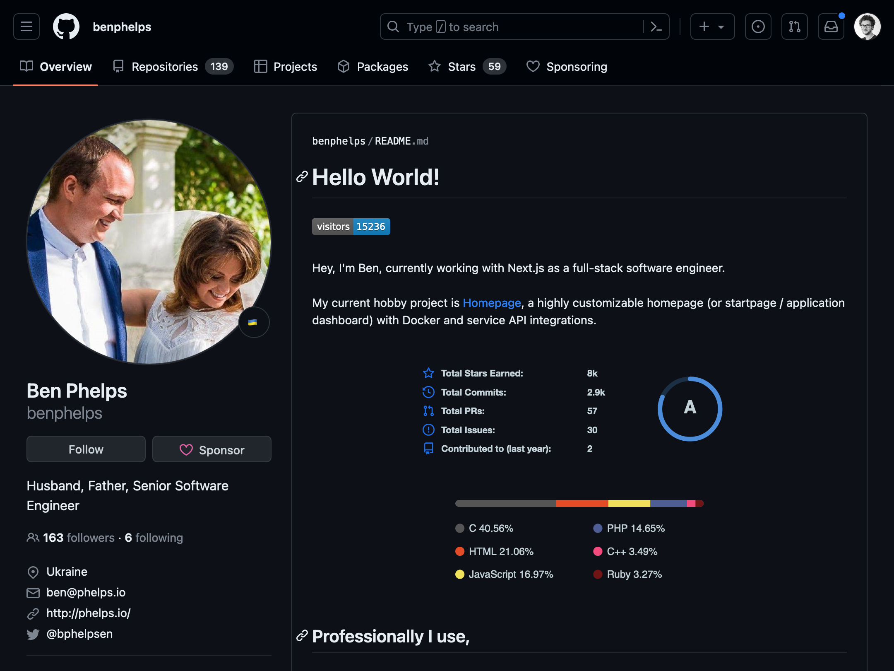
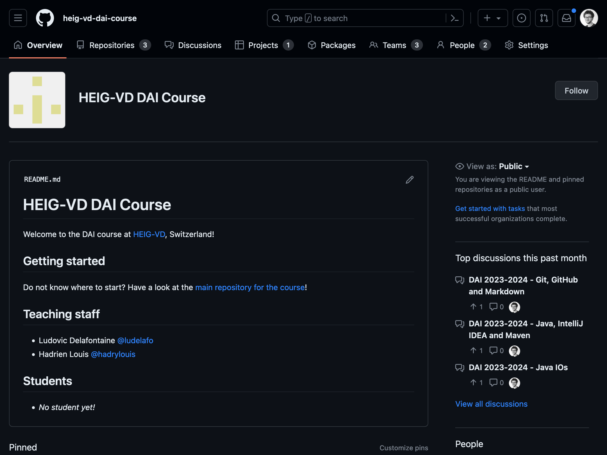

<!--
theme: gaia
size: 16:9
paginate: true
author: L. Delafontaine and H. Louis, with the help of Copilot
title: HEIG-VD DAI Course - Git, GitHub and Markdown
description: Git, GitHub and Markdown for the DAI course at HEIG-VD, Switzerland
url: https://heig-vd-dai-course.github.io/heig-vd-dai-course/03-git-github-and-markdown/
footer: '**HEIG-VD** - DAI Course 2023-2024 - CC BY-SA 4.0'
style: |
    :root {
        --color-background: #fff;
        --color-foreground: #333;
        --color-highlight: #f96;
        --color-dimmed: #888;
        --color-headings: #7d8ca3;
    }
    blockquote {
        font-style: italic;
    }
    table {
        width: 100%;
    }
    th:first-child {
        width: 15%;
    }
    h1, h2, h3, h4, h5, h6 {
        color: var(--color-headings);
    }
    h2, h3, h4, h5, h6 {
        font-size: 1.5rem;
    }
    h1 a:link, h2 a:link, h3 a:link, h4 a:link, h5 a:link, h6 a:link {
        text-decoration: none;
    }
    section:not([class=lead]) > p, blockquote {
        text-align: justify;
        hyphens: auto;
    }
headingDivider: 4
-->

[web]:
  https://heig-vd-dai-course.github.io/heig-vd-dai-course/03-git-github-and-markdown/
[pdf]:
  https://heig-vd-dai-course.github.io/heig-vd-dai-course/03-git-github-and-markdown/03-git-github-and-markdown.pdf
[video]: #
[license]: https://github.com/heig-vd-dai-course/heig-vd-dai-course/blob/main/LICENSE.md
[discussions]: https://github.com/orgs/heig-vd-dai-course/discussions/2
[illustration]:
  https://images.unsplash.com/photo-1618401471353-b98afee0b2eb?fit=crop&h=720

# Git, GitHub and Markdown

<!--
_class: lead
_paginate: false
-->

<https://github.com/heig-vd-dai-course>

[Web][web] | [PDF][pdf]<!-- | [Video (in French)][video]-->

<small>L. Delafontaine and H. Louis, with the help of Copilot.</small>

<small>Based on the original course by O. Liechti and J. Ehrensberger.</small>

<small>This work is licensed under the [CC BY-SA 4.0][license] license.</small>

![bg opacity:0.1][illustration]

## Objectives

## Git

<!-- _class: lead -->

More details for this section in the [course material](https://github.com/heig-vd-dai-course/heig-vd-dai-course/blob/main/03-git-github-and-markdown/COURSE_MATERIAL.md#git).

### Git

### Architecture

### Commits, hashes and tags

### Branches

### Merging branches

### Conflicts

### Ignore files

### Summary

## GitHub

<!-- _class: lead -->

More details for this section in the [course material](https://github.com/heig-vd-dai-course/heig-vd-dai-course/blob/main/03-git-github-and-markdown/COURSE_MATERIAL.md#github).

### GitHub

### Social platform

### Free features and PRO features

### Users and organizations

### Issues, pull requests and merge requests

### Summary

## Markdown

<!-- _class: lead -->

More details for this section in the [course material](https://github.com/heig-vd-dai-course/heig-vd-dai-course/blob/main/03-git-github-and-markdown/COURSE_MATERIAL.md#markdown).

### Markdown

### Mardown and output formats

### Syntax

### Specifications

### Summary

## Practical content

<!-- _class: lead -->

### What will you do?

- Install and configure Git
- Create and configure your GitHub account
- Create your own GitHub profile README
- Add yourself to the list of students in the GitHub organization

### Find the practical content

<!-- _class: lead -->

You can find the practical content for this chapter on
[GitHub](https://github.com/heig-vd-dai-course/heig-vd-dai-course/blob/main/03-git-github-and-markdown/COURSE_MATERIAL.md#practical-content).

## Conclusion

<!-- _class: lead -->

### What did you do and learn?

In this chapter, you have installed and configured Git properly. You have also
created your own GitHub account and profile README for your future social
profile as a computer scientist engineer.

Finally, you have added yourself to the list of students in the GitHub
organization using the issue, fork and pull request workflow, enabling you to
contribute to open source projects in the future.

Git is a valuable tool for collaborative work but we only scratched the surface.
Refer to the resources for more useful content!

### Test your knowledge

At this point, you should be able to answer the following questions:

- How does Git work?
- What is the difference between Git and GitHub?
- How is Markdown different from Word?
- What is a repository? What is a clone?
- What is a tag? What is the difference with a commit?
- Describe a typical Git workflow.

## Finished? Was it easy? Was it hard?

Can you let us know what was easy and what was difficult for you during this
chapter?

This will help us to improve the course and adapt the content to your needs. If
we notice some difficulties, we will come back to you to help you.

➡️ [GitHub Discussions][discussions]

You can use reactions to express your opinion on a comment!

## What will you do next?

In the next chapter, you will learn the following topics:

- Java: why is Java a popular programming language?
- IntelliJ IDEA: tips and tricks for a better (collaborative) experience
- Maven: Java project structure, dependencies and build tool

## Sources

- Main illustration by [Roman Synkevych](https://unsplash.com/@synkevych) on
  [Unsplash](https://unsplash.com/photos/wX2L8L-fGeA)
