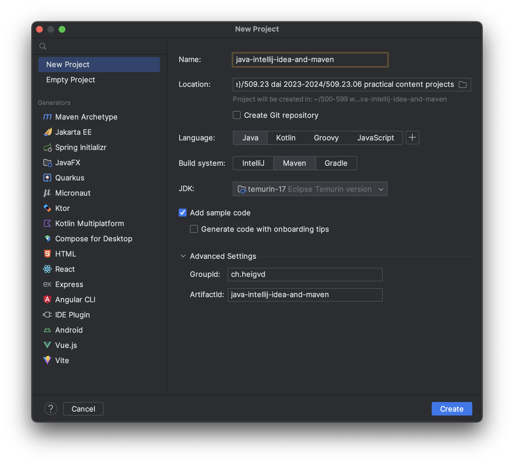

[markdown]:
  https://github.com/heig-vd-dai-course/heig-vd-dai-course/blob/main/04-java-intellij-idea-and-maven/COURSE_MATERIAL.md
[pdf]:
  https://heig-vd-dai-course.github.io/heig-vd-dai-course/04-java-intellij-idea-and-maven/04-java-intellij-idea-and-maven-course-material.pdf
[license]:
  https://github.com/heig-vd-dai-course/heig-vd-dai-course/blob/main/LICENSE.md
[discussions]: https://github.com/orgs/heig-vd-dai-course/discussions/3
[illustration]:
  https://images.unsplash.com/photo-1497935586351-b67a49e012bf?fit=crop&h=720

# Java, IntelliJ IDEA and Maven - Course material

<https://github.com/heig-vd-dai-course>

[Markdown][markdown] · [PDF][pdf]

L. Delafontaine and H. Louis, with the help of Copilot.

This work is licensed under the [CC BY-SA 4.0][license] license.

![Main illustration][illustration]

## Table of contents

- [Table of contents](#table-of-contents)
- [Objectives](#objectives)
- [Java](#java)
  - [Java virtual machine](#java-virtual-machine)
  - [JVM versions](#jvm-versions)
  - [Java versions and version managers](#java-versions-and-version-managers)
  - [Compiling and running Java programs](#compiling-and-running-java-programs)
  - [Summary](#summary)
  - [Alternatives](#alternatives)
  - [Resources](#resources)
- [IntelliJ IDEA](#intellij-idea)
  - [Community Edition and Ultimate Edition](#community-edition-and-ultimate-edition)
  - [IntelliJ IDEA Toolbox App](#intellij-idea-toolbox-app)
  - [Configuration files and Git](#configuration-files-and-git)
  - [Summary](#summary-1)
  - [Alternatives](#alternatives-1)
  - [Resources](#resources-1)
- [Maven](#maven)
  - [Maven project structure](#maven-project-structure)
  - [`pom.xml` file](#pomxml-file)
  - [Maven lifecycle](#maven-lifecycle)
  - [Maven Repository](#maven-repository)
  - [Maven "installation" and Maven wrapper](#maven-installation-and-maven-wrapper)
  - [Summary](#summary-2)
  - [Alternatives](#alternatives-2)
  - [Resources](#resources-2)
  - [Cheat sheet](#cheat-sheet)
- [Practical content](#practical-content)
  - [Install Java](#install-java)
  - [Download and run Maven](#download-and-run-maven)
  - [Install and configure IntelliJ IDEA](#install-and-configure-intellij-idea)
  - [Create and run a new Maven project with IntelliJ IDEA](#create-and-run-a-new-maven-project-with-intellij-idea)
  - [Go further](#go-further)
- [Conclusion](#conclusion)
  - [What did you do and learn?](#what-did-you-do-and-learn)
  - [Test your knowledge](#test-your-knowledge)
- [Finished? Was it easy? Was it hard?](#finished-was-it-easy-was-it-hard)
- [What will you do next?](#what-will-you-do-next)
- [Sources](#sources)

## Objectives

This chapter will help you understand how Java can run on all platforms, how to
install and switch between different versions of Java, how to use IntelliJ IDEA
to develop Java applications, how to use Maven to manage dependencies and build
Java applications.

These skills are essential to develop Java applications in a professional
environment to share them with other developers.

Let's get started!

## Java

> [Java](https://www.java.com/) is a general-purpose, class-based,
> object-oriented programming language. It is intended to let programmers write
> once, run anywhere (WORA), meaning that compiled Java code can run on all
> platforms that support Java, thanks to the Java virtual machine (JVM).

Java was created by James Gosling at Sun Microsystems (now part of Oracle
Corporation) and released in 1995.

Java is a very popular programming language, especially for client-server web
applications.

### Java virtual machine

Java is a **compiled** language, meaning that the source code is compiled to
bytecode, which is then executed by a **Java virtual machine (JVM)**.

Java is intended to be **portable**, meaning that compiled Java code can run on
all platforms that support Java, without the need for recompilation, thanks to
the JVM.

### JVM versions

Many implementations of the JVM exist, targeting **different hardware and
software environments and/or specific optimizations** for a given platform
and/or use-case.

In order to install Java on your computer, you may find the **JDK (Java
Development Kit)** or the **JRE (Java Runtime Environment)** packages.

If you want to develop Java applications, you will need the JDK. If you want to
run Java applications, you will need the JRE.

### Java versions and version managers

Java has various **versions**, each with its **own set of features and
improvements**. The latest Long term support (LTS) version is **Java 17**.

As projects can use different versions of Java, it is common to use a **version
manager** such as [SDKMAN!](https://sdkman.io/) or [asdf](https://asdf-vm.com/).

Version managers allow you to **install and switch between different versions of
Java**.

While working on a project, you should **use the same version of Java as the
other developers** to ensure that the project compiles and runs correctly.

You can develop Java applications using a text editor and the command line, but
it is more convenient to use an **Integrated Development Environment (IDE)**.

### Compiling and running Java programs

A (simple) Java application can be compiled using the `javac` command:

```bash
javac HelloWorld.java
```

The resulting bytecode can be executed using the `java` command:

```bash
java HelloWorld
```

Output:

```text
Hello DAI students!
```

A Java application can be packaged into a **JAR (Java ARchive)** file, which is
a **ZIP file** containing the compiled bytecode and other resources.

A JAR file can be executed using the `java` command:

```bash
java -Xmx1024M -Xms1024M -jar minecraft_server.1.20.1.jar nogui
```

The `-Xmx1024M` and `-Xms1024M` options define the **maximum** and **initial**
memory allocation pool for a Java virtual machine (JVM), respectively.

These options can tweak the performance of the JVM, depending on the
application.

As many Java applications depend on external libraries, it is common to use a
**dependency manager** such as **[Maven](https://maven.apache.org/)** or
**[Gradle](https://gradle.org/)**.

### Summary

- Java is a general-purpose, class-based, object-oriented programming language.
- Java is compiled to bytecode, which is then executed by a Java virtual machine
  (JVM).
- Java is intended to be portable, thanks to the JVM.
- Java has various versions, each with its own set of features and improvements.
- Versions managers allow you to install and switch between different versions
  of Java.

### Alternatives

_Alternatives are here for general knowledge. No need to learn them._

- [Kotlin](https://kotlinlang.org/)
- [Scala](https://www.scala-lang.org/)
- [Groovy](https://groovy-lang.org/)

_Missing item in the list? Feel free to open a pull request to add it! ✨_

### Resources

_Resources are here to help you. They are not mandatory to read._

- [Which Version of JDK Should I Use?](https://whichjdk.com/) - Very useful
  website to help you choose the right version of Java for your project. TL;DR:
  Use
  [Adoptium Eclipse Temurin 17](https://whichjdk.com/#adoptium-eclipse-temurin).
- [SDKMAN!](https://sdkman.io/) - SDKMAN! is a tool for managing Java versions.
- [asdf](https://asdf-vm.com/) - An alternative to SDKMAN!.

_Missing item in the list? Feel free to open a pull request to add it! ✨_

## IntelliJ IDEA

> [IntelliJ IDEA](https://www.jetbrains.com/idea/) is an integrated development
> environment (IDE) written in Java for developing computer software. It is
> developed by JetBrains, and is available as an Apache 2 Licensed community
> edition, and in a proprietary commercial edition.

IntelliJ IDEA is a very popular IDE for Java development, but it also supports
many other programming languages.

### Community Edition and Ultimate Edition

IntelliJ IDEA is available in two editions: the **Community Edition** (free and
open-source) and the **Ultimate Edition** (proprietary).

You are eligible for a **free student license** for the Ultimate Edition, which
you can obtain by following the instructions on the
[JetBrains Student License](https://www.jetbrains.com/community/education/#students)
page.

IntelliJ IDEA is available for Windows, macOS and Linux. Feel free to use
another IDE if you prefer, but we have great experience with IntelliJ IDEA.

### IntelliJ IDEA Toolbox App

The **IntelliJ IDEA Toolbox App** is a desktop application that allows you to
**install and manage multiple JetBrains IDEs**.

It is a convenient way to install and update IntelliJ IDEA and other JetBrains
IDEs in a single place.

### Configuration files and Git

When creating a new project, IntelliJ IDEA will create a `.idea` directory
containing the project configuration files.

Some of these files must be **ignored** by Git, as they contain **local
configuration** that is specific to your computer.

Other files must be **committed** to Git, as they contain **project
configuration** that is shared between all developers.

This allows you to **share the project configuration** with other developers, so
that they can open the project in their instance of IntelliJ IDEA and have the
same configuration as you and ensure that the project compiles and runs
correctly.

### Summary

- IntelliJ IDEA is an integrated development environment (IDE) written in Java
  for developing computer software.
- IntelliJ IDEA is available in two editions: the Community Edition (free and
  open-source) and the Ultimate Edition (proprietary).
- You are eligible for a free student license for the Ultimate Edition.
- When creating a new project, IntelliJ IDEA will create a `.idea` directory
  containing the project configuration files.
- Some of these files must be ignored by Git, as they contain local
  configuration that is specific to your computer.

### Alternatives

_Alternatives are here for general knowledge. No need to learn them._

- [Visual Studio Code](https://code.visualstudio.com/) with the
  [Java Extension Pack](https://marketplace.visualstudio.com/items?itemName=vscjava.vscode-java-pack)
- [Eclipse](https://www.eclipse.org/ide/) if you **really** want to use it
- [NetBeans](https://netbeans.apache.org/) if you **really** want to use it

_Missing item in the list? Feel free to open a pull request to add it! ✨_

### Resources

_Resources are here to help you. They are not mandatory to read._

- _None for now_

_Missing item in the list? Feel free to open a pull request to add it! ✨_

## Maven

> [Apache Maven](https://maven.apache.org/) is a software project management and
> comprehension tool. Based on the concept of a project object model (POM),
> Maven can manage a project's build, reporting and documentation from a central
> piece of information.

Maven is a **dependency manager** for Java projects. It is used to **manage
external libraries** (also called **dependencies**) used by your application.
Maven is a **command-line tool**. It can be used using the `mvn` command.

Maven is also a **build automation tool**. It is used to **compile** your
application, **run** your unit tests, **package** your application, etc.

### Maven project structure

Maven defines a **standard directory structure** for Java projects, so that all
developers can find the source code, unit tests, etc. in the same place. It
**standardizes the build process** of your application, so that all developers
can build the project in the same way.

When creating a new project in IntelliJ IDEA, you can choose between different
**project templates**.

In this course, you will use the **Maven** project template.

IntelliJ IDEA will automatically create a **Maven project structure** for you,
with the following files:

- `pom.xml`: the **Project Object Model (POM)** file, which is the core of a
  Maven project.
- `src/main/java`: the **source code** of your application.
- `src/test/java`: the **unit tests** of your application.

### `pom.xml` file

The `pom.xml` file contains the **configuration** of your Maven project.

It also contains the **build configuration** of your application, which defines
how your application is compiled, tested, packaged, etc.

It contains the **dependencies** of your application, which are **external
libraries** used by your application.

The `pom.xml` file is **shared** between all developers, so that they can
**compile** and **run** the application in the same way.

The standard `pom.xml` file contains the following sections (among others):

- `groupId`: the name of the organization that created the project. It defines
  the **namespace** of the project.
- `artifactId`: the name of the project.
- `version`: the version of the project.
- `packaging`: the packaging type of the project.
- `name` and `description`: the name and description of the project.
- `dependencies`: the dependencies of the project.

The `artifactId`, `version` and `packaging` sets the **name of the JAR file**.

### Maven lifecycle

Maven defines a **standard build process** for Java projects, called the **Maven
lifecycle**.

The Maven lifecycle is composed of **phases**. Each phase is composed of
**plugin goals**.

For example, the `compile` phase is composed of the `compiler:compile` plugin
goal and the `package` phase is composed of the `jar:jar` and
`plugin:addPluginArtifactMetadata` plugin goal, which will generate a JAR file.

More details about the Maven lifecycle can be found in the official
documentation:
<https://maven.apache.org/guides/introduction/introduction-to-the-lifecycle.html>.

### Maven Repository

The [Maven Repository](https://mvnrepository.com/) is a **public repository** of
**Java libraries**. It contains many libraries that you can use in your
projects.

You can search for a library and copy the **dependency declaration** to your
`pom.xml` file.

For example, the following dependency declaration adds the
**[Logback](https://mvnrepository.com/artifact/ch.qos.logback/logback-classic/1.4.11)**
library to your project:

```xml
<!-- https://mvnrepository.com/artifact/ch.qos.logback/logback-classic -->
<dependency>
    <groupId>ch.qos.logback</groupId>
    <artifactId>logback-classic</artifactId>
    <version>1.4.11</version>
    <scope>test</scope>
</dependency>
```

### Maven "installation" and Maven wrapper

Maven is distributed as a **single archive**. This means that you have to
extract it and add it to your `PATH` so it can be used anywhere. This is not
very convenient.

Most Linux distributions provide a **package** for Maven, so that you can
install it using the package manager of your distribution. It will then be
available in your `PATH` and you will be able to use the `mvn` command anywhere.

The same applies to macOS with the help of [Homebrew](https://brew.sh/).

On Windows, you have to add Maven to your `PATH` manually. This is not very
convenient either.

This is why some Maven projects use a **Maven wrapper**. The Maven wrapper is a
**script** (a shell script on Linux and macOS and a Batch script on Windows)
that will download and run Maven for you.

The Maven wrapper defines the **version of Maven** to use, so that all
developers use the same version of Maven.

The Maven wrapper and its configuration file are **committed** to Git but the
Maven executable file is **ignored** by Git.

A new developer can then **run** the Maven wrapper to **download** and
**execute** Maven.

### Summary

- Maven is a software project management and comprehension tool.
- Maven is a dependency manager for Java projects.
- Maven is a build automation tool for Java projects.
- Maven defines a standard directory structure for Java projects.
- Maven defines a standard build process for Java projects.
- The `pom.xml` file contains the configuration of your Maven project.

### Alternatives

_Alternatives are here for general knowledge. No need to learn them._

- [Gradle](https://gradle.org/)
- [Ant](https://ant.apache.org/)
- [Make](https://www.gnu.org/software/make/)
- [Bazel](https://bazel.build/)

_Missing item in the list? Feel free to open a pull request to add it! ✨_

### Resources

_Resources are here to help you. They are not mandatory to read._

- [Introduction to the Build Lifecycle](https://maven.apache.org/guides/introduction/introduction-to-the-lifecycle.html)
- [Maven Build Lifecycle, Phases, and Goals](https://www.digitalocean.com/community/tutorials/maven-build-lifecycle-phases-goals)

_Missing item in the list? Feel free to open a pull request to add it! ✨_

### Cheat sheet

```sh
# Download the dependencies
mvn dependency:resolve

# Delete the compiled classes
mvn clean

# Compile the source code
mvn compile

# Package the application
mvn package
```

Multiple phases can be executed in a single command:

```sh
# Delete the compiled classes, compile the source code and package the application
mvn clean compile package
```

## Practical content

### Install Java

In this section, you will install Java using the version 17 from Temurin.

#### Install Java

If you are using Linux (WSL excluded) or macOS, you can install and use
[SDKMAN!](https://sdkman.io/) to install and switch between different versions
of Java.

Then, install Java 17 Temurin:

```sh
# Install Java 17 Temurin
sdk install java 17.0.8-tem
```

If you are on Windows, we recommend to install Java 17 directly on your system,
without using a version manager even if you are using WSL.

Install Java 17 Temurin from the official website: <https://adoptium.net/>.

#### Check the installation

Open a terminal and type `java --version`.

The output should be similar to this:

```text
openjdk 17.0.8 2023-07-18
OpenJDK Runtime Environment Temurin-17.0.8+7 (build 17.0.8+7)
OpenJDK 64-Bit Server VM Temurin-17.0.8+7 (build 17.0.8+7, mixed mode, sharing)
```

### Download and run Maven

In this section, you will download and run Maven manually. In a future section,
you will initialize the Maven wrapper using Maven itself.

#### Download Maven

Download the latest version of Maven from the official website:
<https://maven.apache.org/download.cgi>. Download the **Binary archive**, not
the Source archive. Once downloaded, you can extract the archive.

#### Run Maven

Open a terminal and switch to the directory where you extracted the archive.

If you are using Linux (WSL excluded) or macOS, you can then run Maven with the
following command:

```sh
# Switch to the directory where you extracted the archive
cd ~/Downloads/apache-maven-*

# Run Maven
./bin/mvn --version
```

If you are using Windows, you can then run Maven with the following command:

```sh
# Switch to the directory where you extracted the archive
cd %USERPROFILE%\Downloads\apache-maven-*

# Run Maven
.\bin\mvn.cmd --version
```

The output should be similar to this:

```text
Apache Maven 3.9.4 (dfbb324ad4a7c8fb0bf182e6d91b0ae20e3d2dd9)
Maven home: /Users/ludelafo/Downloads/apache-maven-3.9.4
Java version: 17.0.8, vendor: Eclipse Adoptium, runtime: /Users/ludelafo/.sdkman/candidates/java/17.0.8-tem
Default locale: en_US, platform encoding: UTF-8
OS name: "mac os x", version: "13.5.1", arch: "x86_64", family: "mac"
```

This means that Maven is correctly running.

#### "Install" Maven by adding it to your `PATH`

If you are using Linux (WSL excluded) or macOS, use your package manager to
install Maven. This will add Maven to your `PATH` so you can use it anywhere.

If you are using Windows, you can add Maven to your `PATH` manually. You can
follow this tutorial: <https://phoenixnap.com/kb/install-maven-windows>.

> **Note**  
> I (Ludovic) am interested if one of you could improve this section with
> instructions and/or screenshots. As I am not using Windows myself, I cannot
> test it entirely.
>
> Feel free to open an issue and a pull request on GitHub if you want to help!
> Thanks!

### Install and configure IntelliJ IDEA

In this section, you will install and configure IntelliJ IDEA Ultimate Edition.

You can use another IDE if you prefer, but we have great experience with
IntelliJ IDEA.

#### Enable the IntelliJ student license

Follow the official documentation to enable the IntelliJ student license:
<https://www.jetbrains.com/community/education/#students>

#### Download and install IntelliJ Toolbox App

Go to the official website and following the instructions on how to install
IntelliJ Toolbox App on your system: <https://www.jetbrains.com/toolbox/app>.

#### Enable the student license in IntelliJ Toolbox App

Open IntelliJ Toolbox App and login with your JetBrains account.

> **Note**  
> I (Ludovic) am interested if one of you could improve this section with
> instructions and/or screenshots. I did not do it myself for a long time, maybe
> it has changed and my memory is not up to date anymore.
>
> Feel free to open an issue and a pull request on GitHub if you want to help!
> Thanks!

#### Install IntelliJ IDEA Ultimate Edition

Install IntelliJ IDEA from the Toolbox App and you should be good to go!

### Create and run a new Maven project with IntelliJ IDEA

In this section, you will create a new Maven project with IntelliJ IDEA.

#### Create the IntelliJ IDEA project

Open IntelliJ IDEA and create a new project. Fill the form as shown in the
following screenshot:



#### Run the Java project from IntelliJ IDEA

Press the "Run" button in the toolbar to run the Maven project.

The output should be `Hello World!` in the "Run" tab.

#### Initialize the Maven wrapper

Open a terminal within IntelliJ IDEA. Initialize the Maven wrapper using the
Maven binary you downloaded previously:

```sh
# Initialize the Maven wrapper
~/Downloads/apache-maven-3.9.4/bin/mvn wrapper:wrapper
```

This will create the Maven wrapper files in your project:

```text
.
├── .mvn
│   └── wrapper
│       ├── maven-wrapper.jar
│       └── maven-wrapper.properties
├── mvnw
└── mvnw.cmd
```

The `mvnw` and `mvnw.cmd` files are the Maven wrapper scripts. These files are
committed to Git.

The `maven-wrapper.jar` file is the Maven wrapper itself. This file is not
committed to Git.

The `maven-wrapper.properties` file contains the configuration of the Maven
wrapper. This file is committed to Git.

Now, instead of using the Maven binary you downloaded previously, you can use
the Maven wrapper:

```sh
# Check the Maven version
./mvnw --version
```

The output should be similar to the previous execution of Maven.

#### Update the `pom.xml` file to generate a JAR file

Maven uses the `pom.xml` file to define the **build process** of your
application.

Maven has a plugin called `maven-jar-plugin` that can be used to **generate a
JAR file** from your application.

Add the following configuration to the `pom.xml` file:

```xml
    <build>
        <plugins>
            <plugin>
                <artifactId>maven-jar-plugin</artifactId>
                <version>3.3.0</version>
                <configuration>
                    <archive>
                        <manifest>
                            <mainClass>ch.heigvd.Main</mainClass>
                        </manifest>
                    </archive>
                </configuration>
            </plugin>
        </plugins>
    </build>
```

You can find the latest version of the `maven-jar-plugin` on the Maven
Repository:
<https://mvnrepository.com/artifact/org.apache.maven.plugins/maven-jar-plugin>.

#### Package and run the project from the command line

You can now generate a JAR file using the `package` command:

```sh
# Package the application
./mvnw package
```

Maven will generate a JAR file in the `target` directory.

Run the JAR file using the `java` command:

```sh
# Run the application
java -jar target/java-intellij-idea-and-maven-1.0-SNAPSHOT.jar
```

The output should be `Hello World!`.

Congratulations! You have successfully created and run your first Maven project!

You could share this JAR file with other developers and they could run it on
their computer, without having to install IntelliJ IDEA or Maven.

#### Store the Maven configuration as IntelliJ IDEA Run/Debug configuration

Running Maven commands from the command line is not very convenient. You can
store the Maven configuration as an IntelliJ IDEA Run/Debug configuration.

This will allow you to run Maven commands from IntelliJ IDEA, without having to
open a terminal.

Other developers will also be able to run Maven commands from IntelliJ IDEA, as
the Run/Debug configurations can be committed to Git.

In the "Run" tab, click on the "Edit Configurations..." button.

Click on the "+" button and select "Maven".

Fill the form as shown in the following screenshot:


Notice the **Run** command: `dependency:resolve clean compile package`.

This will **download the dependencies**, **delete** the compiled classes,
**compile** the source code and **package** the application.

By checking the **Store as project file** checkbox, the Run/Debug configuration
will be stored in the `.idea` directory, which can be committed to Git.

Make usage of the Maven wrapper by modifying the **Maven option**.

Save the configuration and run it by pressing the "Run" button in the toolbar.

The output should be similar to the previous execution of Maven.

#### Add a dependency

Let's add the
[Logback](https://mvnrepository.com/artifact/ch.qos.logback/logback-classic)
dependency to the `pom.xml` file.

```xml
    <dependencies>
        <!-- https://mvnrepository.com/artifact/ch.qos.logback/logback-classic -->
        <dependency>
            <groupId>ch.qos.logback</groupId>
            <artifactId>logback-classic</artifactId>
            <version>1.4.11</version>
        </dependency>
    </dependencies>
```

> **Note**  
> What is the difference between a Maven dependency and a Maven plugin ? A
> plugin performs a specific task, such as compiling the source code or
> generating a JAR file. It won't be included in the JAR file generated by
> Maven. A dependency is an external library used by your application, such as
> Logback. It will be included in the JAR file generated by Maven.
>
> You can find more information about this in
> [this StackOverflow answer](https://stackoverflow.com/a/52119718)

Update the `src/main/java/ch/heigvd/Main.java` file to use Logback:

```java
package ch.heigvd;

import org.slf4j.Logger;
import org.slf4j.LoggerFactory;

public class Main {
    public static void main(String[] args) {
        Logger logger = LoggerFactory.getLogger(Main.class);

        logger.debug("Hello World!");
    }
}
```

Download the Logback dependency by running the Maven `dependency:resolve`
command:

```sh
# Download the dependencies
./mvnw dependency:resolve
```

Run the **Current file** Run/Debug configuration to execute the application
within IntelliJ IDEA.

> **Note**  
> Having trouble with IntelliJ IDEA not recognizing the `Logger` class? Try the
> following: **Right-click on the project** > **Maven** > **Reload project**.
> This will reload the Maven project and download the dependencies.

#### Build and run the project

Build the project using the Maven `package` command:

```sh
# Package the application
./mvnw package
```

Run the JAR file using the `java` command:

```sh
# Run the application
java -jar target/java-intellij-idea-and-maven-1.0-SNAPSHOT.jar
```

It does not work! The output is an error message:

```text
Exception in thread "main" java.lang.NoClassDefFoundError: org/slf4j/LoggerFactory
        at ch.heigvd.Main.main(Main.java:8)
Caused by: java.lang.ClassNotFoundException: org.slf4j.LoggerFactory
        at java.base/jdk.internal.loader.BuiltinClassLoader.loadClass(BuiltinClassLoader.java:641)
        at java.base/jdk.internal.loader.ClassLoaders$AppClassLoader.loadClass(ClassLoaders.java:188)
        at java.base/java.lang.ClassLoader.loadClass(ClassLoader.java:521)
        ... 1 more
```

Why? Because the `maven-jar-plugin` does not include the dependencies in the JAR
file by default.

Let's fix this.

#### Update the `pom.xml` file to include the dependencies in the JAR file

Update the `pom.xml` file to include the dependencies in the JAR file. You need
to replace the previous `build` section with the following:

```xml
    <build>
        <plugins>
            <plugin>
                <groupId>org.apache.maven.plugins</groupId>
                <artifactId>maven-shade-plugin</artifactId>
                <version>3.5.0</version>
                <executions>
                    <execution>
                        <phase>package</phase>
                        <goals>
                            <goal>shade</goal>
                        </goals>
                        <configuration>
                            <transformers>
                                <transformer implementation="org.apache.maven.plugins.shade.resource.ManifestResourceTransformer">
                                    <mainClass>ch.heigvd.Main</mainClass>
                                </transformer>
                                <transformer implementation="org.apache.maven.plugins.shade.resource.DontIncludeResourceTransformer">
                                    <resource>MANIFEST.MF</resource>
                                </transformer>
                            </transformers>
                        </configuration>
                    </execution>
                </executions>
            </plugin>
        </plugins>
    </build>
```

This will use the `maven-shade-plugin` to include the dependencies in the JAR
file.

You can find the latest version of the `maven-shade-plugin` on the Maven
Repository:
<https://mvnrepository.com/artifact/org.apache.maven.plugins/maven-shade-plugin>.

This plugin will intervene in the `package` phase of the Maven build process. It
will execute the `shade` goal, which will transform the JAR file to include the
dependencies.

A goal is a specific command that can be executed by a plugin.

Build and run the project using the following commands:

```sh
# Download the dependencies
./mvnw dependency:resolve

# Package the application
./mvnw package

# Run the application
java -jar target/java-intellij-idea-and-maven-1.0-SNAPSHOT.jar
```

The output should now be `Hello World!` again!

You should notice the following elements:

- The `target` directory contains the
  `java-intellij-idea-and-maven-1.0-SNAPSHOT.jar` file
- A new `original-java-intellij-idea-and-maven-1.0-SNAPSHOT.jar` file was
  created
- A new `dependency-reduced-pom.xml` file was created

The `java-intellij-idea-and-maven-1.0-SNAPSHOT.jar` file is the JAR file
generated by the `maven-shade-plugin` plugin with all dependencies included.

The `original-java-intellij-idea-and-maven-1.0-SNAPSHOT.jar` file is the JAR
file generated by the `maven-shade-plugin` plugin without all dependencies
included. If you try to run the application with this JAR file, you will get the
same error as before.

The `dependency-reduced-pom.xml` file is a **reduced version** of the `pom.xml`
file, containing only the dependencies used by the application and not the
transitive dependencies.

> **Note**  
> _Why is it so complex to package an application with Java and Maven? Why do we
> need to use a plugin to include the dependencies in the JAR file?_
>
> Java can be used to develop many different types of applications, such as
> desktop applications, mobile applications, web applications, librairies, etc.
> Each type of application has its own needs and specificities. This is why
> Maven does not include the dependencies in the JAR file by default. This is
> also why we need to use a plugin to include the dependencies in the JAR file.
>
> We will not go any deeper in this topic in this course. You will learn more
> about this in other future courses. Our goal here is to give you the tools to
> develop Java applications and share them with other developers easily.

#### Initialize a local Git repository

Open a terminal within IntelliJ IDEA and initialize a local Git repository:

```sh
# Initialize a local Git repository with a branch called `main`
git init --initial-branch=main
```

#### Ignore files for Git

By default, IntelliJ IDEA did create a `.gitignore` file and a
`.idea/.gitignore` file containing the files to be ignored by Git.

If you open these files, you will notice that it contains many files and
directories that are specific to IntelliJ IDEA, but also for other IDEs and
specific configurations.

Many tools exist to generate `.gitignore` files, such as
<https://gitignore.io/>.

We consider this as **bad practice** as it makes the comprehension of the
codebase harder (_What am I really using?_). You should **only ignore files that
are specific to your project**, the tools you are using and the environment you
are working in.

Let's clean the `.gitignore` files.

Open the `.gitignore` file update the content to the following:

```sh
## IntelliJ IDEA

# General
.idea/libraries/
.idea/shelf/
.idea/compiler.xml
.idea/jarRepositories.xml
.idea/modules.xml
.idea/workspace.xml
*.iws
*.iml
*.ipr

# Editor-based HTTP Client requests
.idea/httpRequests/

# Datasource local storage ignored files
.idea/dataSources/
.idea/dataSources.local.xml

## Linux

# Temporary files
*~

## macOS

# Files created by macOS Finder
.DS_Store

## Maven
.mvn/wrapper/maven-wrapper.jar
target/

## Windows

# Windows thumbnail cache files
Thumbs.db

# Folder config file
[Dd]esktop.ini
```

Delete the `.idea/.gitignore` file.

#### Add a README

Add a `README.md` file to explain what the project is, how to build it and how
to run it.

#### Create a GitHub repository

Create a new GitHub repository as seen in a previous chapter. Do not initialize
it with a README, a license or a `.gitignore` file.

> **Warning**  
> Do not initialize the repository with a README, a license or a `.gitignore`
> file! You will add these files later.

#### Add the remote repository and push the project to GitHub

GitHub should provide you with the commands to add the remote repository and
push the project to GitHub:

```sh
# Add the remote repository
git remote add origin <URL_TO_YOUR_GITHUB_REPOSITORY>

# Add the files to the staging area
git add .

# Check that only the required files are added to the staging area
git status

# Commit the files to the local repository
git commit -m "Initial commit"

# Push the project to GitHub
git push --set-upstream origin main
```

The last command will push the `main` branch to the `origin` remote repository
and set the `main` branch as the default branch.

Open the GitHub repository in your browser and check that the files have been
pushed to GitHub.

#### Share your project in GitHub Discussions

Share your project in the GitHub Discussions of this organization:
<https://github.com/orgs/heig-vd-dai-course/discussions>.

Create a new discussion with the following information:

- **Title**: DAI 2023-2024 - My IntelliJ + Maven project - @YOUR_GITHUB_USERNAME
- **Category**: Show and tell
- **Description**: The link to your GitHub repository

This will notify us that you have completed the exercise and we can check your
work.

### Go further

This is an optional section. Feel free to skip it if you do not have time.

- Can you change Logback output by using its configuration file? Check out the
  [documentation](http://logback.qos.ch/manual/configuration.html) and try it
  out!
- Try to clone and run one of your classmates' project shared in GitHub
  Discussions. Do you have any issues? If yes, can you help them to improve
  their project?

## Conclusion

### What did you do and learn?

In this chapter, you have installed and configured Java, IntelliJ IDEA and
Maven. You have created a Java project with Maven, added a dependency to a Maven
project, and built a JAR that you can execute everywhere. You have learned how
these tools can help you to develop Java applications and share them with other
developers.

Dependencies management is a very important (yet tricky) topic. In the context
of this course, you will not go any deeper as you will cover in other future
courses.

### Test your knowledge

At this point, you should be able to answer the following questions:

- How can Java run on all platforms?
- How can you install and switch between different versions of Java?
- Why should you ignore some files created by IntelliJ IDEA?
- What is the purpose of the `pom.xml` file?
- How can a tool like Maven help you to develop Java applications?

## Finished? Was it easy? Was it hard?

Can you let us know what was easy and what was difficult for you during this
chapter?

This will help us to improve the course and adapt the content to your needs. If
we notice some difficulties, we will come back to you to help you.

➡️ [GitHub Discussions][discussions]

You can use reactions to express your opinion on a comment!

## What will you do next?

In the next chapter, you will learn the following topics:

- Java IOs: input/output processing

## Sources

- Main illustration by [Nathan Dumlao](https://unsplash.com/@nate_dumlao) on
  [Unsplash](https://unsplash.com/photos/KixfBEdyp64)
