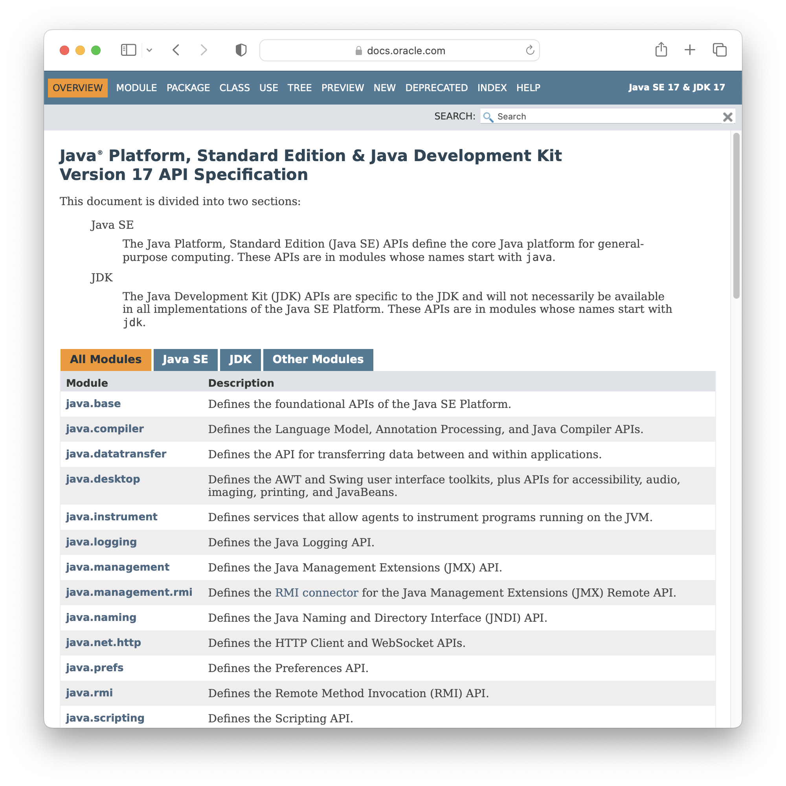
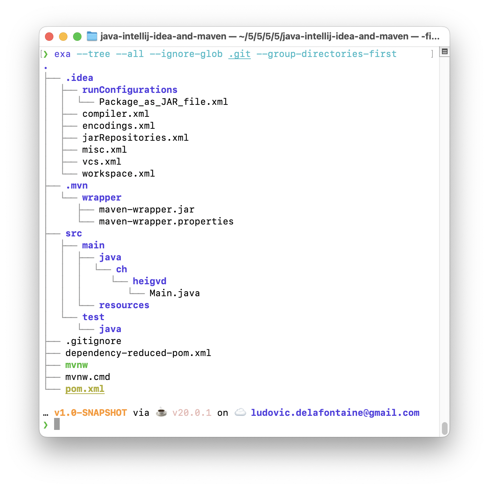
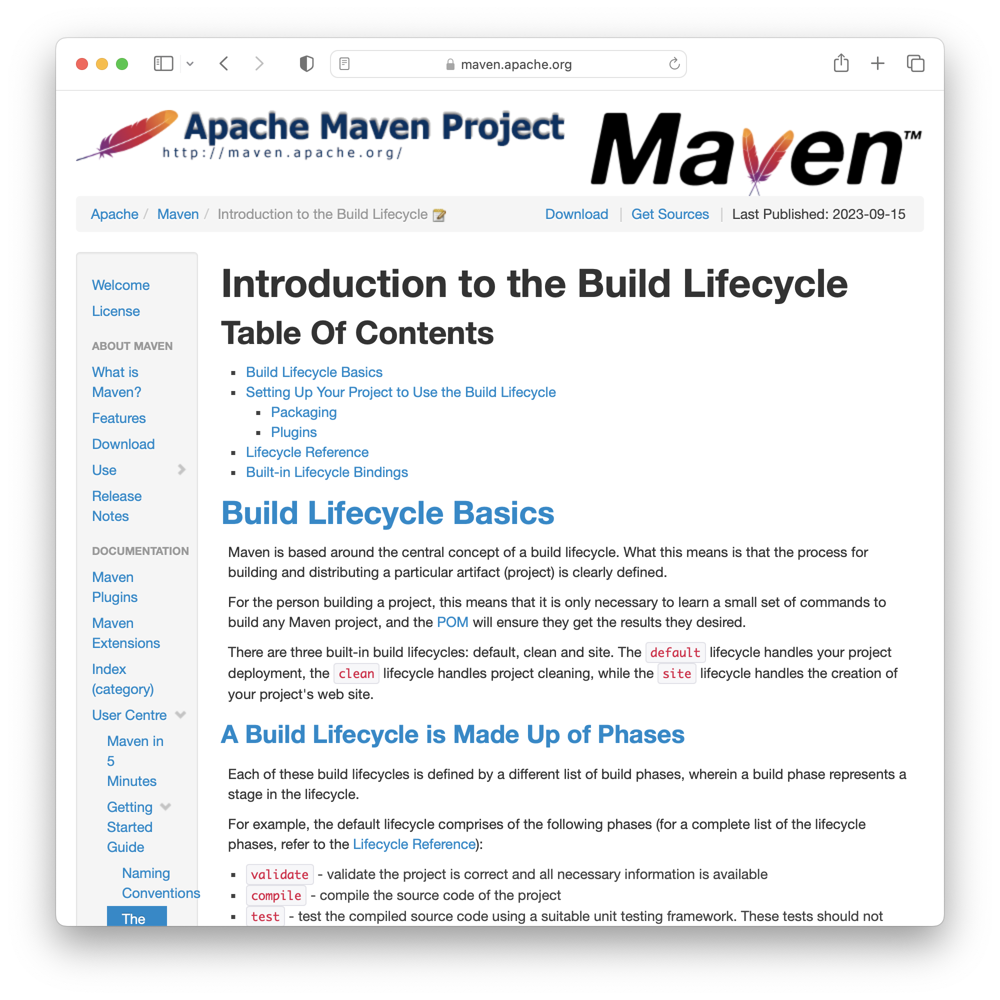
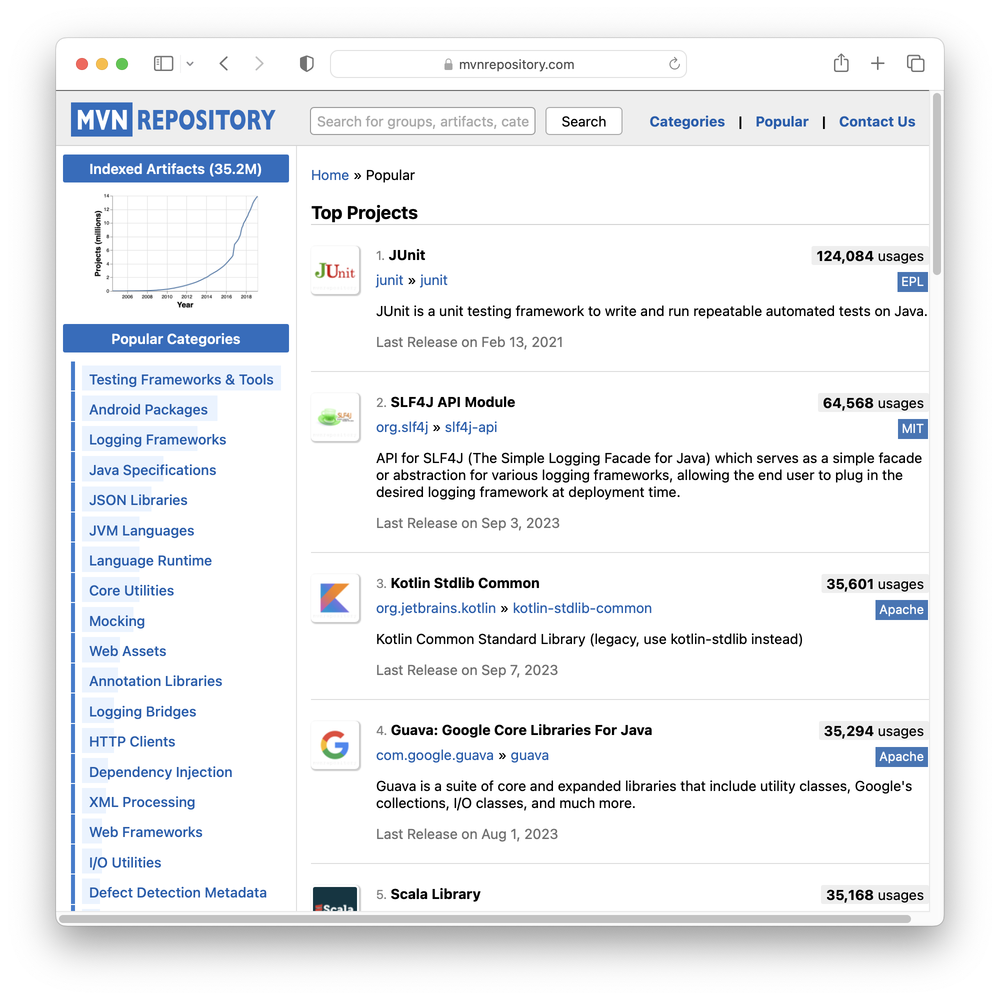
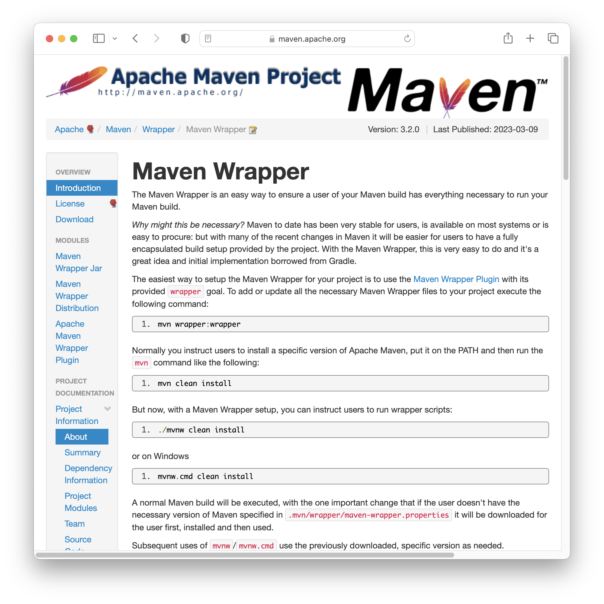
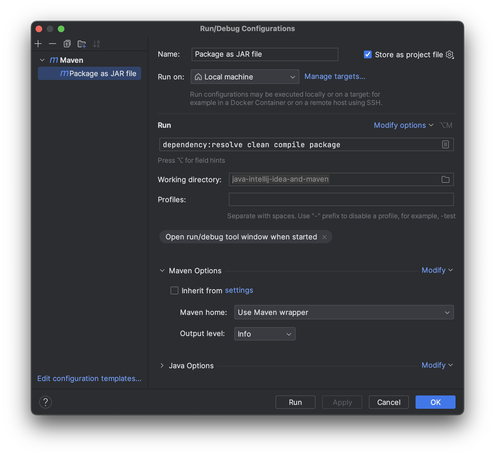

<!--
theme: gaia
size: 16:9
paginate: true
author: L. Delafontaine and H. Louis, with the help of ChatGPT
title: HEIG-VD DAI Course - Java, IntelliJ IDEA and Maven
description: Java, IntelliJ IDEA and Maven for the DAI course at HEIG-VD, Switzerland
url: https://heig-vd-dai-course.github.io/heig-vd-dai-course/04-java-intellij-idea-and-maven/
footer: '**HEIG-VD** - DAI Course 2023-2024 - CC BY-SA 4.0'
style: |
    :root {
        --color-background: #fff;
        --color-foreground: #333;
        --color-highlight: #f96;
        --color-dimmed: #888;
        --color-headings: #7d8ca3;
    }
    blockquote {
        font-style: italic;
    }
    table {
        width: 100%;
    }
    th:first-child {
        width: 15%;
    }
    h1, h2, h3, h4, h5, h6 {
        color: var(--color-headings);
    }
    h2, h3, h4, h5, h6 {
        font-size: 1.5rem;
    }
    h1 a:link, h2 a:link, h3 a:link, h4 a:link, h5 a:link, h6 a:link {
        text-decoration: none;
    }
    section:not([class=lead]) > p, blockquote {
        text-align: justify;
    }
headingDivider: 4
-->

[web]:
  https://heig-vd-dai-course.github.io/heig-vd-dai-course/04-java-intellij-idea-and-maven/
[pdf]:
  https://heig-vd-dai-course.github.io/heig-vd-dai-course/04-java-intellij-idea-and-maven/04-java-intellij-idea-and-maven-presentation.pdf
[license]:
  https://github.com/heig-vd-dai-course/heig-vd-dai-course/blob/main/LICENSE.md
[discussions]: https://github.com/orgs/heig-vd-dai-course/discussions/3
[illustration]:
  https://images.unsplash.com/photo-1497935586351-b67a49e012bf?fit=crop&h=720

# Java, IntelliJ IDEA and Maven

<!--
_class: lead
_paginate: false
-->

<https://github.com/heig-vd-dai-course>

[Web][web] · [PDF][pdf]

<small>L. Delafontaine and H. Louis, with the help of ChatGPT.</small>

<small>This work is licensed under the [CC BY-SA 4.0][license] license.</small>

![bg opacity:0.1][illustration]

## Objectives

- Learn why Java is a popular programming language
- Develop Java apps with IntelliJ IDEA and Maven
- Manage dependencies with Maven
- Develop essential skills for professional Java development


## Java

<!-- _class: lead -->

More details for this section in the
[course material](https://github.com/heig-vd-dai-course/heig-vd-dai-course/blob/main/04-java-intellij-idea-and-maven/COURSE_MATERIAL.md#java).
You can find other resources and alternatives as well.

### Java

- General-purpose, object-oriented language
- Write once, run anywhere (WORA)
- Created by James Gosling, 1995 at Sun Microsystems


### Java virtual machine

- Compiles source code to bytecode
- Executes in Java virtual machine (JVM)
- Where a JVM exists, Java can run (most of the time)



### JVM versions

- Multiple implementations exist
- Can target different platforms and/or specific features
- JDK for development, JRE for running


### Java versions and version managers

- Java 17 is the latest LTS
- You can use [SDKMAN!](https://sdkman.io/) or [asdf](https://asdf-vm.com/)
- Match versions for project consistency


### Compiling and running Java programs

- Compile manually with `javac` command

  ```sh
  javac HelloWorld.java
  ```

- Execute with `java` command

  ```sh
  java HelloWorld
  ```

- Modern way: package into JAR files with the help of Maven

  ```sh
  java -Xmx1024M -Xms1024M -jar minecraft_server.1.20.1.jar nogui
  ```

### Summary

- Java is a general-purpose, class-based, object-oriented programming language.
- Java is compiled to bytecode, which is then executed by a Java virtual machine
  (JVM).
- Java is intended to be portable, thanks to the JVM.
- Java has various versions, each with its own set of features and improvements.
- Versions managers allow you to install and switch between different versions
  of Java.

## IntelliJ IDEA

<!-- _class: lead -->

More details for this section in the
[course material](https://github.com/heig-vd-dai-course/heig-vd-dai-course/blob/main/04-java-intellij-idea-and-maven/COURSE_MATERIAL.md#intellij-idea).
You can find other resources and alternatives as well.

## IntelliJ IDEA

- IDE for (Java) software development
- Developed by JetBrains
- Works on Windows, macOS, Linux


### Community and Ultimate Edition

- Community (free) and Ultimate (paid)
- Free student license available


### IntelliJ IDEA Toolbox App

- Manage multiple JetBrains IDEs
- Install and update in one place


### Configuration files and Git

- `.idea` directory for project config
- Ignore local config in Git
- Commit shared project config


### Summary

- IntelliJ IDEA is an integrated development environment (IDE) written in Java
  for developing computer software.
- IntelliJ IDEA is available in two editions: the Community Edition (free and
  open-source) and the Ultimate Edition (proprietary).
- You are eligible for a free student license for the Ultimate Edition.
- When creating a new project, IntelliJ IDEA will create a `.idea` directory
  containing the project configuration files.
- Some of these files must be ignored by Git, as they contain local
  configuration that is specific to your computer.

## Maven

<!-- _class: lead -->

More details for this section in the
[course material](https://github.com/heig-vd-dai-course/heig-vd-dai-course/blob/main/04-java-intellij-idea-and-maven/COURSE_MATERIAL.md#maven).
You can find other resources and alternatives as well.

### Maven

- Maintained by Apache Software Foundation
- Software project management tool
- Manages dependencies
- Build automation tool


### Maven project structure

- Standardized directory structure
  - `src/main/java`
  - `src/main/resources`
  - `src/test/java`
- Simplifies build process



### `pom.xml` file

- Configuration and build settings
- Shared among developers


### Maven lifecycle

- Maven defines build process
- Composed of phases and goals
- Phases load plugin goals



### Maven Repository

- Public repository of Java libraries
- Maven can download dependencies automatically
- You can publish your own libraries



### Maven "installation" and Maven wrapper

- Single archive file
- Add it to your `PATH` environment variable
- Run manually from the archive directory
- Use Maven wrapper script



### Summary

- Maven is a software project management and comprehension tool.
- Maven is a dependency manager for Java projects.
- Maven is a build automation tool for Java projects.
- Maven defines a standard directory structure for Java projects.
- Maven defines a standard build process for Java projects.
- The `pom.xml` file contains the configuration of your Maven project.

## Practical content

<!-- _class: lead -->

### What will you do?

- Install and configure Java, IntelliJ IDEA and Maven
- Create and run a new Maven project with IntelliJ IDEA and a Maven dependency
- Publish your project on GitHub




### Find the practical content

<!-- _class: lead -->

You can find the practical content for this chapter on
[GitHub](https://github.com/heig-vd-dai-course/heig-vd-dai-course/blob/main/04-java-intellij-idea-and-maven/COURSE_MATERIAL.md#practical-content).

## Finished? Was it easy? Was it hard?

Can you let us know what was easy and what was difficult for you during this
chapter?

This will help us to improve the course and adapt the content to your needs. If
we notice some difficulties, we will come back to you to help you.

➡️ [GitHub Discussions][discussions]

You can use reactions to express your opinion on a comment!

## What will you do next?

In the next chapter, you will learn the following topics:

- Java IOs: input/output processing

## Sources

- Main illustration by [Nathan Dumlao](https://unsplash.com/@nate_dumlao) on
  [Unsplash](https://unsplash.com/photos/KixfBEdyp64)
- Illustration by [Aline de Nadai](https://unsplash.com/@alinedenadai) on
  [Unsplash](https://unsplash.com/photos/j6brni7fpvs)
- Java logo by [Java](https://www.java.com/)
- SDKMAN! logo by [SDKMAN!](https://sdkman.io/)
- IntelliJ IDEA and Intellij Toolbox logos by
  [JetBrains](https://www.jetbrains.com/)
- Maven logo by [Apache Software Foundation](https://maven.apache.org/)
