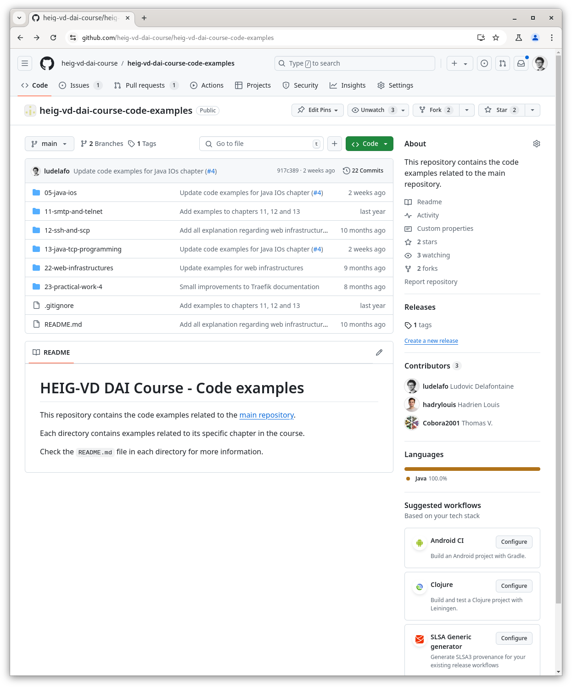
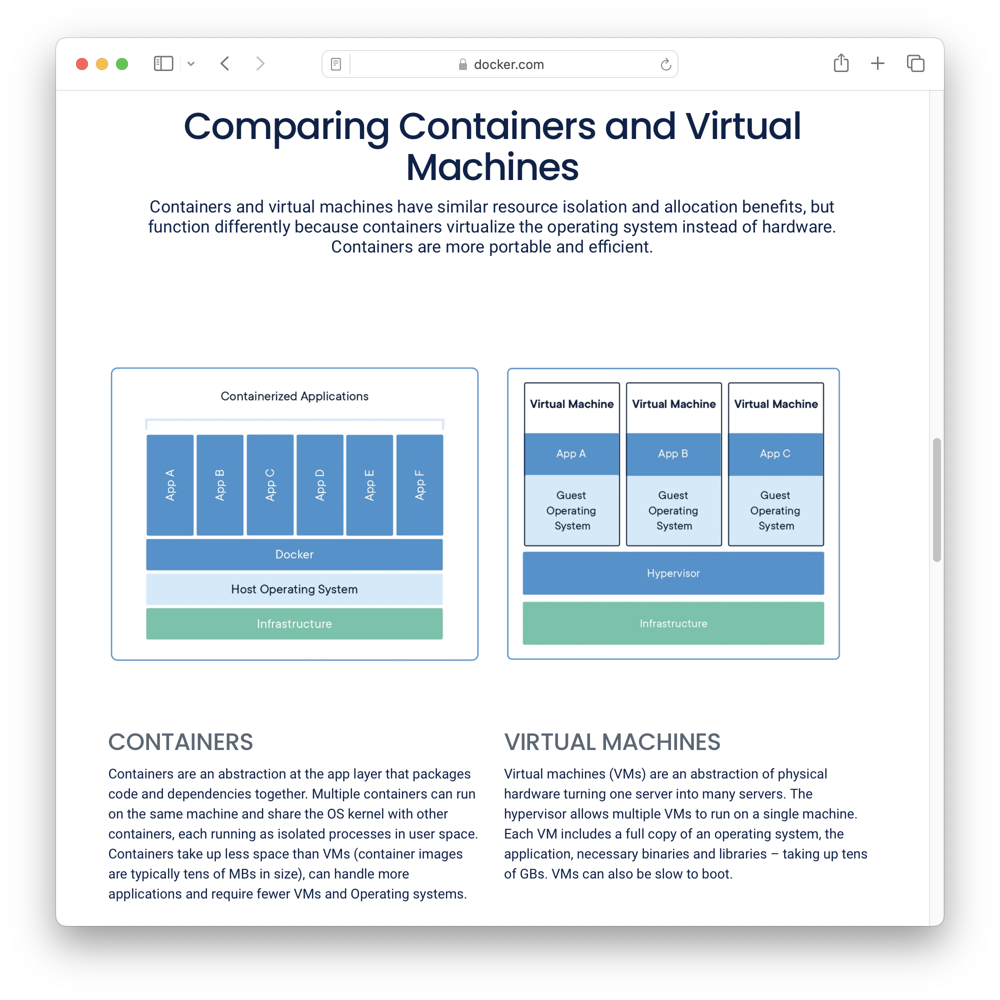
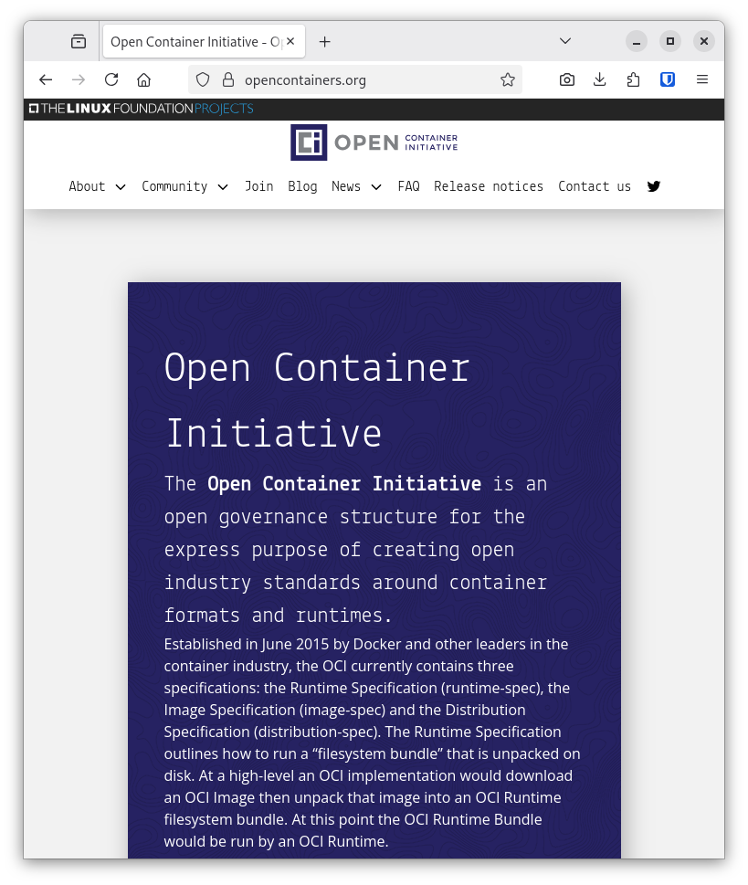
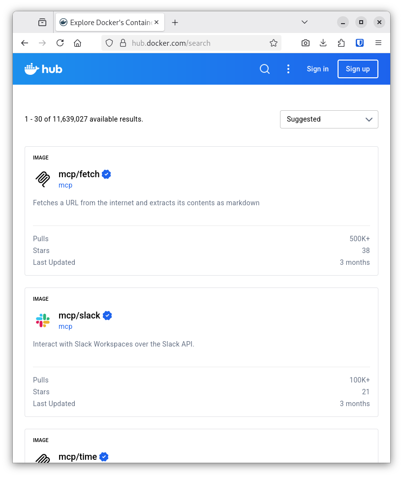
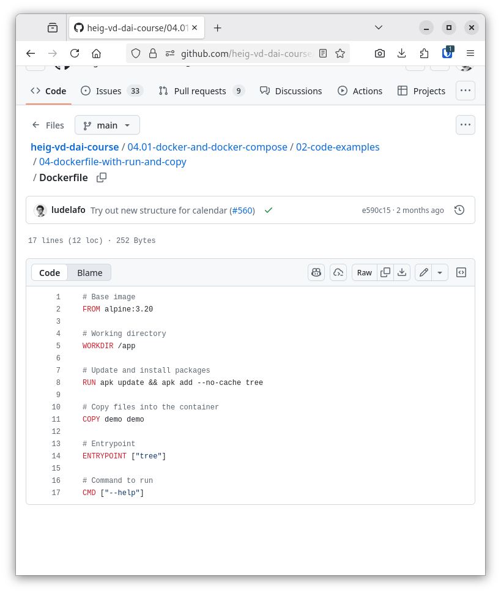
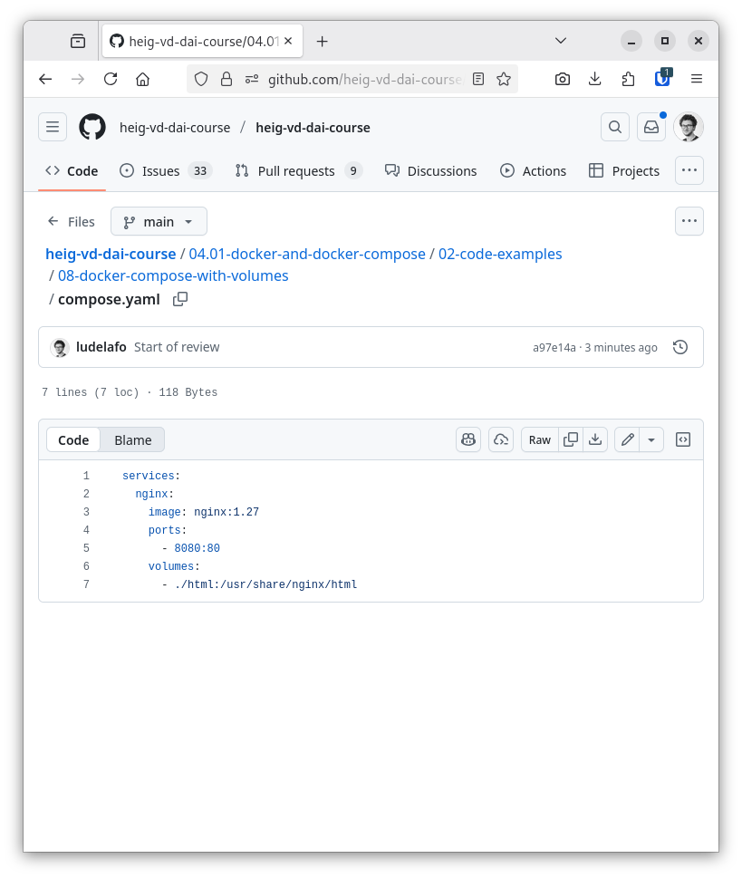
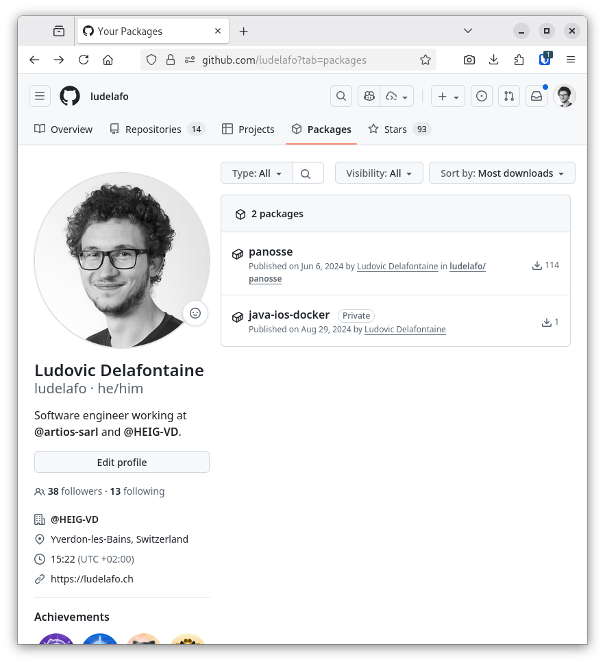

<!--
theme: custom-marp-theme
size: 16:9
paginate: true
author: L. Delafontaine and H. Louis, with the help of GitHub Copilot
title: HEIG-VD DAI Course - Docker and Docker Compose
description: Docker and Docker Compose for the DAI course at HEIG-VD, Switzerland
footer: '[**HEIG-VD**](https://heig-vd.ch) - [DAI Course 2025-2026](https://github.com/heig-vd-dai-course) - [CC BY-SA 4.0](https://github.com/heig-vd-dai-course/heig-vd-dai-course/blob/main/LICENSE.md)'
headingDivider: 6
-->

[web]:
	https://heig-vd-dai-course.github.io/heig-vd-dai-course/06-docker-and-docker-compose/
[pdf]:
	https://heig-vd-dai-course.github.io/heig-vd-dai-course/06-docker-and-docker-compose/06-docker-and-docker-compose-presentation.pdf
[license]:
	https://github.com/heig-vd-dai-course/heig-vd-dai-course/blob/main/LICENSE.md
[discussions]: https://github.com/orgs/heig-vd-dai-course/discussions/113
[illustration]: ./images/main-illustration.jpg
[course-material]:
	https://github.com/heig-vd-dai-course/heig-vd-dai-course/blob/main/06-docker-and-docker-compose/COURSE_MATERIAL.md
[course-material-qr-code]:
	https://quickchart.io/qr?format=png&ecLevel=Q&size=400&margin=1&text=https://github.com/heig-vd-dai-course/heig-vd-dai-course/blob/main/06-docker-and-docker-compose/COURSE_MATERIAL.md
[code-examples]:
	https://github.com/heig-vd-dai-course/heig-vd-dai-course-code-examples/tree/main

# Docker and Docker Compose

<!--
_class: lead
_paginate: false
-->

<https://github.com/heig-vd-dai-course>

[Web][web] · [PDF][pdf]

<small>L. Delafontaine and H. Louis, with the help of GitHub Copilot.</small>

<small>This work is licensed under the [CC BY-SA 4.0][license] license.</small>

![bg opacity:0.1][illustration]

## Objectives

- Learn the differences between bare metal, virtualization and containerization
- Learn how the OCI specification defines images, containers, and registries
- Learn how to use Docker and Docker Compose to build, publish, and run
  applications in containers

## Prepare and setup your environment

<!-- _class: lead -->

More details for this section in the [course material][course-material]. You can
find other resources and alternatives as well.

### Install Docker and Docker Compose

- Install Docker and Docker Compose
- Configure Docker and Docker Compose to:
  - Run without `sudo` (root)
  - Start automatically at boot

### Check and run the code examples

- Check the code examples
- Run the code examples
- Helps to understand the concepts
- Modify/play with the code examples

## Bare metal, virtualization and containerization

<!-- _class: lead -->

More details for this section in the [course material][course-material]. You can
find other resources and alternatives as well.

### Bare metal, virtualization and containerization

- Bare metal: software runs directly on hardware
- Virtualization: software runs on a virtual machine
- Containerization: software runs in a container

### Bare metal

- The traditional way to run software
- Software runs directly on hardware
- Software has full access to the hardware
- Security issues, hard to maintain, hard to migrate

### Virtualization

- Virtualization runs virtual machines
- A virtual machine is complete operating system
- A virtual machine is isolated from the host
- Virtual machines are heavy and use a lot of resources

### Containerization

- Containerization starts containers
- Containers contain all the dependencies to run the software
- Containers are isolated from each other
- Containers are lightweight and use the host kernel

## OCI, images, containers, and registries

<!-- _class: lead -->

More details for this section in the [course material][course-material]. You can
find other resources and alternatives as well.

### OCI, images, containers, and registries

- Image: read-only template for container creation
- Container: runnable instance of an image
- Registry: service storing images

### Docker Hub

- The official registry
- Hosts millions of images
- Can be used to store and share images

### GitHub Container Registry

- GitHub's registry
- Hosts images in the same place as the code
- Will be used in this course for simplicity

## Docker

<!-- _class: lead -->

More details for this section in the [course material][course-material]. You can
find other resources and alternatives as well.

### Docker

- Created in 2013
- Container engine
- Composed of two parts:
  - Docker daemon (background process)
  - Docker CLI
- Can be used to build, run and publish containers

### Dockerfile specification

- Build a Docker image
- Based on an existing image
- Defines a set of instructions to build the image
- Written in plain text

### Code examples

Check the code examples in the
[`heig-vd-dai-course-code-examples`][code-examples] Git repository:

- Basic Dockerfile
- Dockerfile with command
- Dockerfile with entrypoint and command
- Dockerfile with run and copy commands
- Dockerfile with build arguments

### Summary

- Docker is a container engine composed of two parts: the Docker daemon and the
  Docker CLI
- The Docker CLI is used to manage containers and images
- The Dockerfile specification defines a standard for building Docker images
- A Dockerfile is used to build a Docker image
- A Docker image is used to create a container
- A container is a runnable, isolated, instance of an image

## Docker Compose

<!-- _class: lead -->

More details for this section in the [course material][course-material]. You can
find other resources and alternatives as well.

### Docker Compose

- Can be used to deploy a multi-container application
- Can be committed with the application
- Can be used to deploy the application on any Docker host
- Easy to use

### Docker Compose specification

- Defines the application
  - Services: containers
  - Volumes: shared directories
  - Networks: network communication
- Written in YAML

### Code examples

Check the code examples in the
[`heig-vd-dai-course-code-examples`][code-examples] Git repository:

- Basic Docker Compose
- Docker Compose with ports
- Docker Compose with volumes
- Docker Compose with environment variables

### Summary

- Docker Compose allows to define a multi-container Docker application in a
  Docker Compose file
- A Docker Compose file can consist of a set of services, volumes and networks
- A Docker Compose file (`docker-compose.yaml`) can be easily shared and
  versioned with the application

## Make containers communicate with each other using Docker networks

<!-- _class: lead -->

More details for this section in the [course material][course-material]. You can
find other resources and alternatives as well.

### Make containers communicate with each other using Docker networks

Docker networks allow containers to communicate with each other. Each container
can be connected to one or more networks.

Check the code examples in the
[`heig-vd-dai-course-code-examples`][code-examples] Git repository:

- Make two containers communicate with each other with Docker
- Make two containers communicate with each other with Docker Compose

## Questions

<!-- _class: lead -->

Do you have any questions?

## Practical content

<!-- _class: lead -->

### What will you do?

Containerize the previous Java IOs project:

- Create the Dockerfile and Docker Compose files
- Publish on GitHub Container Registry
- Run it on any Docker host

### Find the practical content

<!-- _class: lead -->

You can find the practical content for this chapter on
[GitHub][course-material].

![bg right w:75%][course-material-qr-code]

## Finished? Was it easy? Was it hard?

Can you let us know what was easy and what was difficult for you during this
chapter?

This will help us to improve the course and adapt the content to your needs. If
we notice some difficulties, we will come back to you to help you.

➡️ [GitHub Discussions][discussions]

You can use reactions to express your opinion on a comment!

## What will you do next?

We are arriving at the end of the first part of the course.

An evaluation will be done to check your understanding of all the content seen
in this first part.

More details will be given in the next chapter.

## Sources

- Main illustration by [CHUTTERSNAP](https://unsplash.com/@chuttersnap) on
  [Unsplash](https://unsplash.com/photos/xewrfLD8emE)
- Illustration by [Rafif Prawira](https://unsplash.com/@rafifatmaka) on
  [Unsplash](https://unsplash.com/photos/aerial-photo-of-maze-race-SgTLuX6t8Yo)
- Illustration by [Taylor Vick](https://unsplash.com/@tvick) on
  [Unsplash](https://unsplash.com/photos/cable-network-M5tzZtFCOfs)
- Illustration by [Aline de Nadai](https://unsplash.com/@alinedenadai) on
  [Unsplash](https://unsplash.com/photos/j6brni7fpvs)
- Illustration by [Scott Webb](https://unsplash.com/@scottwebb) on
  [Unsplash](https://unsplash.com/photos/yekGLpc3vro)
- Illustration by [MChe Lee](https://unsplash.com/@mclee) on
  [Unsplash](https://unsplash.com/photos/PC91Jm1DlWA)
