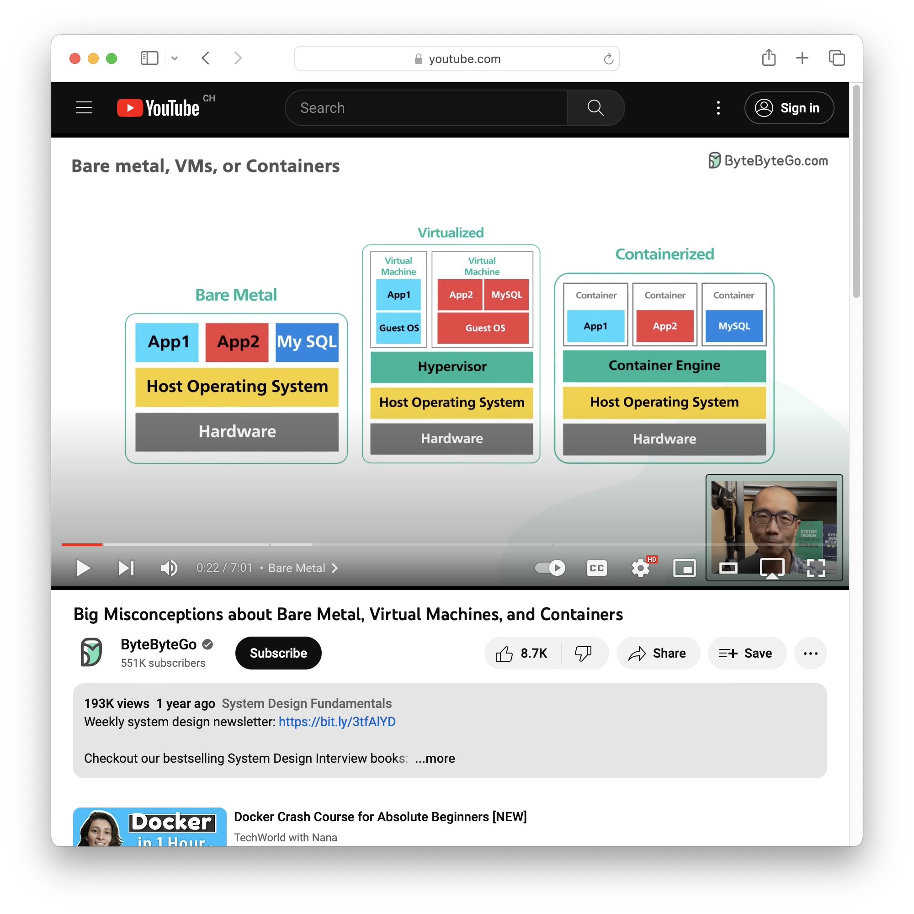
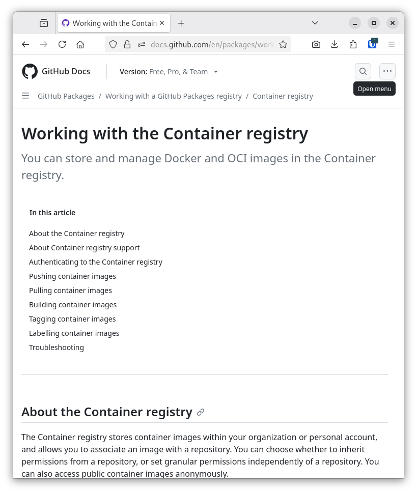
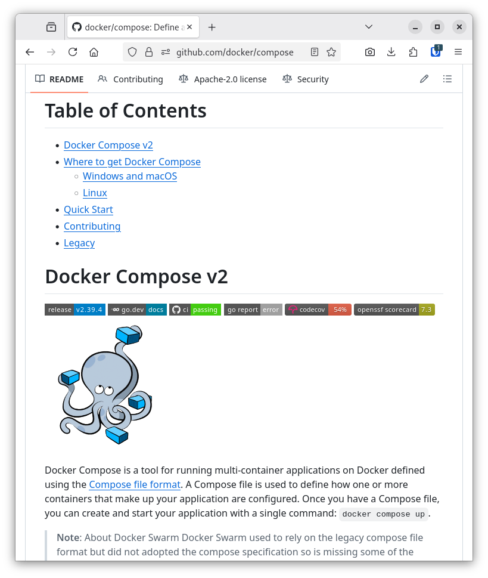

<!--
theme: custom-marp-theme
size: 16:9
paginate: true
author: L. Delafontaine and H. Louis, with the help of GitHub Copilot
title: HEIG-VD DAI - Docker and Docker Compose
description: Docker and Docker Compose for the DAI course at HEIG-VD, Switzerland
header: '[**Docker and Docker Compose**](https://github.com/heig-vd-dai-course/heig-vd-dai-course/tree/main/04.01-docker-and-docker-compose)'
footer: '[**HEIG-VD**](https://heig-vd.ch) - [DAI 2025-2026](https://github.com/heig-vd-dai-course/heig-vd-dai-course) - [CC BY-SA 4.0](https://github.com/heig-vd-dai-course/heig-vd-dai-course/blob/main/LICENSE.md)'
headingDivider: 6
-->

# Docker and Docker Compose

<!--
_class: lead
_paginate: false
-->

[Link to the course][course]

<small>L. Delafontaine and H. Louis, with the help of
[GitHub Copilot](https://github.com/features/copilot).</small>

<small>This work is licensed under the [CC BY-SA 4.0][license] license.</small>

![bg opacity:0.1][illustration]

## Objectives

- Learn the differences between bare metal, virtualization and containerization.
- Learn how the OCI specification defines images, containers, and registries.
- Learn how to use Docker and Docker Compose to build, publish, and run
  applications in containers.

## Prepare and setup your environment

<!-- _class: lead -->

More details for this section in the [course material][course]. You can find
other resources and alternatives as well.

### Install Docker and Docker Compose

- Install Docker and Docker Compose.
- Configure Docker and Docker Compose to:
  - Run without `sudo` (root).
  - Start automatically at boot.

### Check and run the code examples

- Check the code examples.
- Run the code examples.
- Helps to understand the concepts.
- Modify/play with the code examples.

## Bare metal, virtualization and containerization

<!-- _class: lead -->

More details for this section in the [course material][course]. You can find
other resources and alternatives as well.

### Bare metal, virtualization and containerization

- Bare metal: software runs directly on hardware.
- Virtualization: software runs on a virtual machine.
- Containerization: software runs in a container.

### Bare metal

- The traditional way to run software.
- Software runs directly on hardware.
- Software has full access to the hardware.
- Security issues, hard to maintain, hard to migrate.

### Virtualization

- Virtualization runs virtual machines.
- A virtual machine is a complete operating system.
- A virtual machine is isolated from the host.
- Virtual machines are heavy and use a lot of resources.

### Containerization

- Containerization starts containers.
- Containers contain all the dependencies to run the software.
- Containers are isolated from each other.
- Containers are lightweight and use the host kernel.

## OCI, images, containers, and registries

<!-- _class: lead -->

More details for this section in the [course material][course]. You can find
other resources and alternatives as well.

### OCI, images, containers, and registries

- Image: read-only template for container creation.
- Container: running instance of an image.
- Registry: service storing images.

### Docker Hub

- The official registry.
- Hosts millions of images.
- Can be used to store and share images.

### GitHub Container Registry

- GitHub's registry.
- Hosts images in the same place as the code.
- Will be used in this course for simplicity.

## Docker

<!-- _class: lead -->

More details for this section in the [course material][course]. You can find
other resources and alternatives as well.

### Docker

- Created in 2013.
- Container engine.
- Composed of two parts:
  - Docker daemon (background process).
  - Docker CLI.
- Can be used to build, run and publish containers.

### Dockerfile specification

- Build a Docker image.
- Based on an existing image.
- Defines a set of instructions to build the image.
- Written in plain text.

### Code examples

Check the code examples in the [`02-code-examples`][code-examples] directory:

- Basic Dockerfile.
- Dockerfile with command.
- Dockerfile with entrypoint and command.
- Dockerfile with run and copy commands.
- Docker run with ports.

### Summary

- Docker is a container engine composed of two parts: the Docker daemon and the
  Docker CLI.
- The Docker CLI is used to manage containers and images.
- The Dockerfile specification defines a standard for building Docker images.
- A Dockerfile is used to build a Docker image.
- A Docker image is used to create a container.
- A container is a runnable, isolated, instance of an image.

## Docker Compose

<!-- _class: lead -->

More details for this section in the [course material][course]. You can find
other resources and alternatives as well.

### Docker Compose

- Can be used to deploy a multi-container application (called a _"stack"_).
- Can be committed to Git.
- Can be used to deploy the application on any Docker host.
- Much easier than plain Docker commands.

### Docker Compose specification (1/2)

- Defines the stack:
  - Services: containers that can interact together.
  - Volumes: shared directories to store data.
  - Networks: network communications between services.

### Docker Compose specification (2/2)

- A Docker Compose file is written in YAML:
  - `compose.yaml` (new standard)
  - `docker-compose.yaml` (old standard).

### Docker Compose v1 vs. Docker Compose v2

- Docker Compose v1 written in Python (`docker-compose`).
- Docker Compose v2 written in Go (`docker compose`).
- Docker Compose v1 is deprecated.

### Code examples

Check the code examples in the [`02-code-examples`][code-examples] directory:

- Basic Docker Compose.
- Docker Compose with ports.
- Docker Compose with volumes.
- Docker Compose with environment variables.

### Summary

- Docker Compose allows to define a multi-container Docker application in a
  Docker Compose file.
- A Docker Compose file can consist of a set of services, volumes and networks
  called a _"stack"_.
- A Docker Compose file (`compose.yaml`) can be easily shared and versioned with
  the application.

## Make containers communicate with each other using Docker networks

<!-- _class: lead -->

More details for this section in the [course material][course]. You can find
other resources and alternatives as well.

### Make containers communicate with each other using Docker networks

- Containers are isolated by default.
- When defined in a Docker Compose file, containers are connected to a default
  network, allowing them to communicate with each other.
- Custom Docker networks can be defined with `docker network` command and/or in
  a Docker Compose file and shared between services and/or stacks.
- Each container connected to a network can be reached by its name.

### Code examples

Check the code examples in the [`02-code-examples`][code-examples] directory:

- Make two containers communicate with each other with Docker.
- Make two containers communicate with each other with Docker Compose.

## Questions

<!-- _class: lead -->

Do you have any questions?

## Practical content

<!-- _class: lead -->

### What will you do?

Containerize the previous Java IOs project:

- Create the Dockerfile and Docker Compose files.
- Publish on GitHub Container Registry.
- Run it on any Docker host.

### Now it's your turn!

- Read the course material.
- Do the practical content.
- Ask questions if you have any.

➡️ [Find the course on GitHub][course].

**Do not hesitate to help each other! There's no need to rush!**

![bg right w:75%][course-qr-code]

## Finished? Was it easy? Was it hard?

Can you let us know what was easy and what was difficult for you during this
chapter?

This will help us to improve the course and adapt the content to your needs. If
we notice some difficulties, we will come back to you to help you.

➡️ [GitHub Discussions][discussions]

You can use reactions to express your opinion on a comment!

## Sources

- Main illustration by [CHUTTERSNAP](https://unsplash.com/@chuttersnap) on
  [Unsplash](https://unsplash.com/photos/xewrfLD8emE)
- Illustration by [Rafif Prawira](https://unsplash.com/@rafifatmaka) on
  [Unsplash](https://unsplash.com/photos/aerial-photo-of-maze-race-SgTLuX6t8Yo)
- Illustration by [Taylor Vick](https://unsplash.com/@tvick) on
  [Unsplash](https://unsplash.com/photos/cable-network-M5tzZtFCOfs)
- Illustration by [Aline de Nadai](https://unsplash.com/@alinedenadai) on
  [Unsplash](https://unsplash.com/photos/j6brni7fpvs)
- Illustration by [Scott Webb](https://unsplash.com/@scottwebb) on
  [Unsplash](https://unsplash.com/photos/yekGLpc3vro)

[course]:
	https://github.com/heig-vd-dai-course/heig-vd-dai-course/tree/main/04.01-docker-and-docker-compose
[license]:
	https://github.com/heig-vd-dai-course/heig-vd-dai-course/blob/main/LICENSE.md
[discussions]: https://github.com/orgs/heig-vd-dai-course/discussions/113
[illustration]: ./images/main-illustration.jpg
[course-qr-code]:
	https://quickchart.io/qr?format=png&ecLevel=Q&size=400&margin=1&text=https://github.com/heig-vd-dai-course/heig-vd-dai-course/blob/main/06-docker-and-docker-compose/COURSE_MATERIAL.md
[code-examples]:
	https://github.com/heig-vd-dai-course/heig-vd-dai-course/tree/main/04.01-docker-and-docker-compose/02-code-examples
