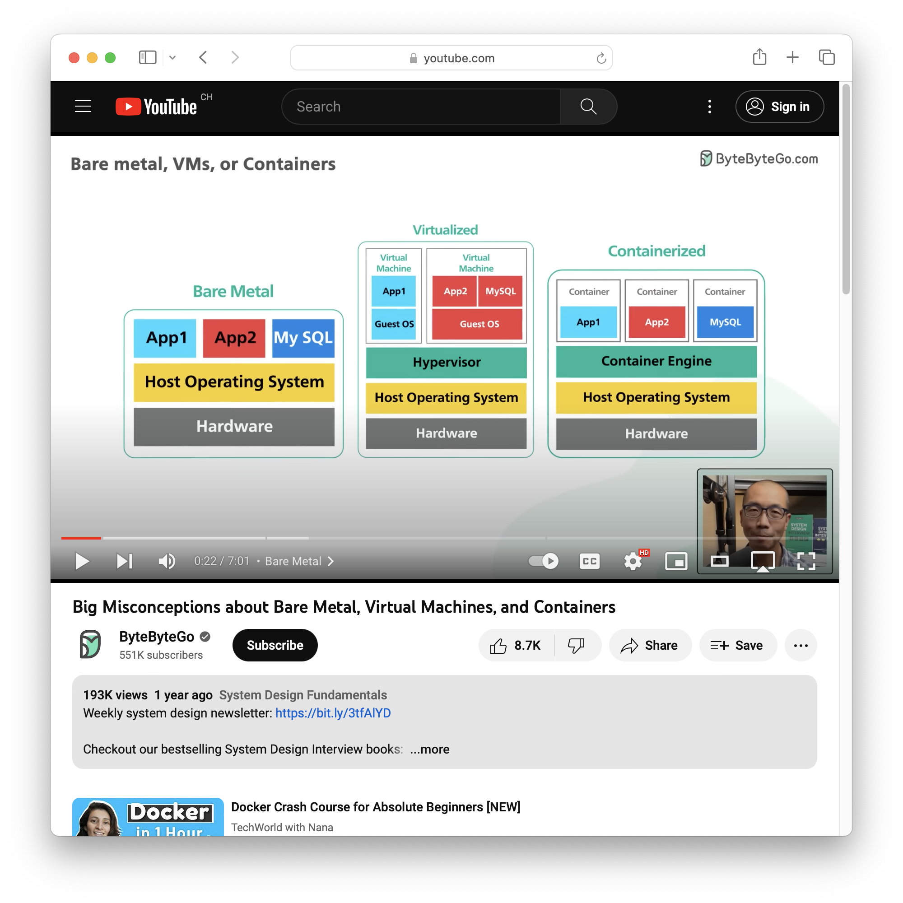
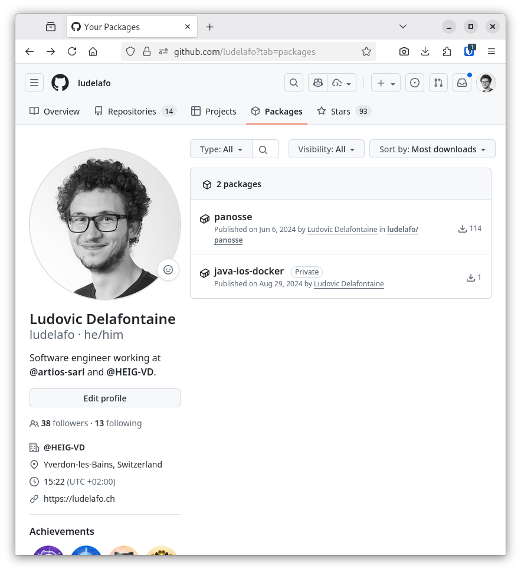

# Docker and Docker Compose


L. Delafontaine and H. Louis, with the help of
[GitHub Copilot](https://github.com/features/copilot).

This work is licensed under the [CC BY-SA 4.0][license] license.

## Resources

- Objectives, teaching and learning methods, and evaluation methods:
  [Link to content](..)
- Course material: [Link to content](../01-course-material/README.md) ·
  [Presentation (web)](https://heig-vd-dai-course.github.io/heig-vd-dai-course/04.01-docker-and-docker-compose/01-course-material/index.html)
  ·
  [Presentation (PDF)](https://heig-vd-dai-course.github.io/heig-vd-dai-course/04.01-docker-and-docker-compose/01-course-material/04.01-docker-and-docker-compose-presentation.pdf)
- Code examples: [Link to content](../02-code-examples/)
- Solution: [Link to content](../03-solution/)

## Table of contents

- [Resources](#resources)
- [Table of contents](#table-of-contents)
- [Objectives](#objectives)
- [Prepare and setup your environment](#prepare-and-setup-your-environment)
  - [Install Docker and Docker Compose](#install-docker-and-docker-compose)
  - [Alternatives](#alternatives)
  - [Resources](#resources-1)
  - [Check and run the code examples](#check-and-run-the-code-examples)
- [Bare metal, virtualization and containerization](#bare-metal-virtualization-and-containerization)
  - [Bare metal](#bare-metal)
  - [Virtualization](#virtualization)
  - [Containerization](#containerization)
- [OCI, images, containers and registries](#oci-images-containers-and-registries)
  - [Docker Hub](#docker-hub)
  - [GitHub Container Registry](#github-container-registry)
  - [Alternatives](#alternatives-1)
  - [Resources](#resources-2)
- [Docker](#docker)
  - [Dockerfile specification](#dockerfile-specification)
  - [Summary](#summary)
  - [Cheatsheet](#cheatsheet)
  - [Alternatives](#alternatives-2)
  - [Resources](#resources-3)
- [Docker Compose](#docker-compose)
  - [Docker Compose specification](#docker-compose-specification)
  - [Docker Compose v1 vs. Docker Compose v2](#docker-compose-v1-vs-docker-compose-v2)
  - [Summary](#summary-1)
  - [Cheatsheet](#cheatsheet-1)
  - [Alternatives](#alternatives-3)
  - [Resources](#resources-4)
- [Make containers communicate with each other using Docker networks](#make-containers-communicate-with-each-other-using-docker-networks)
- [Practical content](#practical-content)
  - [Package your own applications with Docker](#package-your-own-applications-with-docker)
  - [Publish your own applications with Docker](#publish-your-own-applications-with-docker)
  - [Run your own applications with Docker and Docker Compose](#run-your-own-applications-with-docker-and-docker-compose)
  - [Share your Docker Compose application](#share-your-docker-compose-application)
  - [Go further](#go-further)
- [Conclusion](#conclusion)
  - [What did you do and learn?](#what-did-you-do-and-learn)
  - [Test your knowledge](#test-your-knowledge)
- [Finished? Was it easy? Was it hard?](#finished-was-it-easy-was-it-hard)
- [Additional resources](#additional-resources)
- [Solution](#solution)
- [Optional content](#optional-content)
  - [Security considerations](#security-considerations)
  - [Free some space](#free-some-space)
  - [Ignore files](#ignore-files)
  - [Healthchecks](#healthchecks)
  - [Multi-stage builds](#multi-stage-builds)
  - [Multi-architecture builds](#multi-architecture-builds)
- [Sources](#sources)

## Objectives

In this course, you will learn about the differences between bare metal,
virtualization and containerization.

You will learn what the OCI specification is and how it defines images,
containers and registries.

You will then use Docker and Docker Compose to build, publish, and run
applications in containers so you can run them and share them with others
without the need to install anything else than Docker and Docker Compose on the
target machine.

In a nutshell, by the end of this course, you should be able to:

- Learn the differences between bare metal, virtualization and containerization.
- Learn how the OCI specification defines images, containers, and registries.
- Learn how to use Docker and Docker Compose to build, publish, and run
  applications in containers.

As this course is quite abstract, you will first setup your environment to be
able to run some code examples along with the theory.

## Prepare and setup your environment

### Install Docker and Docker Compose

In this section, you will install Docker and Docker Compose on your computer.

#### Install Docker and Docker Compose on Linux and Windows (WSL)

Go to the official website and follow the instructions to install
[Docker Engine](https://docs.docker.com/engine/) on your distribution **from the
repository** (not using Docker Desktop):

- Debian: <https://docs.docker.com/engine/install/debian/>
- Fedora: <https://docs.docker.com/engine/install/fedora/>
- Ubuntu: <https://docs.docker.com/engine/install/ubuntu/>
- Other distributions: <https://docs.docker.com/engine/install/>

> [!NOTE]
>
> While it is possible to install Docker Desktop on Linux (not WSL), we would
> not recommend it. It is better to install Docker Engine and Docker Compose
> directly on your system to avoid any overhead.

Then, follow the post-installation steps to finalize the installation:
<https://docs.docker.com/engine/install/linux-postinstall/> (steps _"Manage
Docker as a non-root user"_ and _"Configure Docker to start on boot with
systemd"_).

##### Install Docker and Docker Compose on macOS

Go to the official website and follow the instructions on how to install Docker
Desktop on your system: <https://docs.docker.com/desktop/>.

This will install Docker Engine and Docker Compose in a virtual machine.

##### Check the installation

Once Docker and Docker Compose are installed, you can check the installation by
running the following commands in a terminal:

```sh
# Check the Docker version
docker --version

# Check the Docker Compose version
docker compose version
```

The output should be similar to the following:

```text
Docker version 27.1.2, build d01f264

Docker Compose version v2.29.1
```

Ensure that the Docker daemon is running if you have any issue.

### Alternatives

_Alternatives are here for general knowledge. No need to learn them._

- [OrbStack](https://orbstack.dev/) (macOS)
- [Colima](https://github.com/abiosoft/colima) (macOS)

_Missing item in the list? Feel free to open a pull request to add it! ✨_

### Resources

_Resources are here to help you. They are not mandatory to read._

- _None for now_

_Missing item in the list? Feel free to open a pull request to add it! ✨_

### Check and run the code examples

In this section, you will clone the code examples repository to check and run
the code examples along with the theory.

#### Clone or fetch latest changes from the main repository to get the code examples

Clone or fetch latest changes from the
[`heig-vd-dai-course/heig-vd-dai-course`](https://github.com/heig-vd-dai-course/heig-vd-dai-course)
repository to get the code examples:

```sh
# Clone the repository if you have not done it yet
git clone git@github.com:heig-vd-dai-course/heig-vd-dai-course.git
```

or fetch latest changes if you have already cloned it:

```sh
# Navigate to the cloned repository
cd heig-vd-dai-course

# Checkout to the main branch
git checkout main

# Pull latest changes
git pull
```

#### Open the repository in your IDE

Open the `heig-vd-dai-course` repository in your favorite IDE.

#### Access the code examples in your terminal

Open a terminal and navigate to the
`heig-vd-dai-course/04.01-docker-and-docker-compose/02-code-examples` directory.

#### Explore and run the code examples

Check out the
`heig-vd-dai-course/04.01-docker-and-docker-compose/02-code-examples/README.md`
file to learn how to run the code examples.

You now have everything you need to run the code examples. Let's dive into the
theory!

## Bare metal, virtualization and containerization

Bare metal, virtualization and containerization are three different ways to run
software on a computer (remember, a server is only a computer - the "Cloud" is
only someone else's computer).

A good way to understand the differences between bare metal, virtualization and
containerization is to watch the following video:



You can find this video in the [Additional resources](#additional-resources)
section for more information.

### Bare metal

Bare metal is the traditional way to run software on a computer. The software is
installed directly on the computer. The software has access to all the resources
of the computer. This is the fastest and most straightforward way to run
software on a computer/server

### Virtualization

Virtualization is another way to run software on a computer. The software is
installed in a virtual machine. The virtual machine is a virtual computer. The
virtual machine might have limited access to the resources of the
computer/server. The virtual machine is isolated from the rest of the
computer/server. This is a good way to run software when you want to isolate the
software from the rest of the computer/server.

Virtualization starts full operating systems. This is quite heavy and not very
efficient (takes time to start, takes a lot of space and/or ressources on the
computer/server, etc.).

### Containerization

Containerization is another way to run software on a computer/server. The
software is installed in a container. The container is a virtual environment.

A container is, however, much lighter than a virtual machine. It is (way) faster
to start than a virtual machine.

This is because a container shares the underlying operating system of the
computer/server. It starts only the software needed to run the application but
in a virtual environment that can also have limited access to the resources of
the computer/server.

## OCI, images, containers and registries

The OCI specification defines a standard for container images. The OCI
specification is implemented by Docker, but also by other container engines.

The OCI specification defines the following terms (among others):

- Image: a read-only template with instructions for creating a container.
- Container: a running instance of an image.
- Registry: a service that stores images.

A container image is an executable package that contains everything needed to
run an application. It contains the application and all its dependencies. It
also contains metadata about the image, such as the author, the version, the
description, etc.

A container image is immutable. It cannot be modified. If you want to modify a
container image, you need to create a new image.

A container image is composed of layers. Each layer is a set of
instructions/files that specifies the container.

A container image is stored in a container registry. A container registry is a
service that stores container images. The most popular container registry is
[Docker Hub](#docker-hub).

A container image can be uploaded/downloaded to/from a container registry.

A container image can be used to create a container. A container is a runnable
instance of an image.

Containers can be inherited from other containers.

A container is isolated from the rest of the computer as well as from other
containers. Access to the host system is restricted and must be explicitly
granted.

### Docker Hub

> Docker Hub is the world's largest library and community for container images.
>
> <https://hub.docker.com>

Docker Hub is a public container registry. It is the default registry for
Docker.

Other container registries are available. Some are public (anyone can pull your
images), some are private (a username and password are required to pull them).

### GitHub Container Registry

> The Container registry stores container images within your organization or
> personal account, and allows you to associate an image with a repository.
>
> <https://docs.github.com/en/packages/working-with-a-github-packages-registry/working-with-the-container-registry>

In this course, we will use the GitHub Container Registry to store your images.
It will allow to store your images in the same place as your code.

### Alternatives

_Alternatives are here for general knowledge. No need to learn them._

- [GitLab Container Registry](https://docs.gitlab.com/ee/user/packages/container_registry/)

_Missing item in the list? Feel free to open a pull request to add it! ✨_

### Resources

_Resources are here to help you. They are not mandatory to read._

- _None for now_

_Missing item in the list? Feel free to open a pull request to add it! ✨_

## Docker

> Docker is a set of platform as a service (PaaS) products that use OS-level
> virtualization to deliver software in packages called containers.
>
> <https://www.docker.com>

Docker is composed of two parts:

- The Docker daemon: a background service that manages containers.
- The Docker CLI: a command-line interface to interact with the Docker daemon.

On Linux, the Docker daemon runs natively. The Docker CLI communicates with the
Docker daemon through a socket.

On macOS and Windows, the Docker daemon runs in a virtual machine. The Docker
CLI communicates with the Docker daemon through a socket.

The Docker CLI is used to manage containers. It is used to create, start, stop,
restart, delete, etc. containers. It is also used to manage images. It is used
to download, upload, build, etc. images.

Let's start our first container!

Run the following command in a terminal:

```sh
# Run a container with the hello-world image
docker run hello-world:latest
```

The `run` command is used to run a container. It is followed by the name of the
image to use.

The `hello-world` image is an image often used to test if Docker is correctly
installed.

The `:latest` tag is used to specify the version of the image. It is not
required. If no tag is specified, the `:latest` tag is used by default.

The output should be similar to the following:

```text
Unable to find image 'hello-world:latest' locally
latest: Pulling from library/hello-world
c1ec31eb5944: Pull complete
Digest: sha256:53cc4d415d839c98be39331c948609b659ed725170ad2ca8eb36951288f81b75
Status: Downloaded newer image for hello-world:latest

Hello from Docker!
This message shows that your installation appears to be working correctly.

To generate this message, Docker took the following steps:
 1. The Docker client contacted the Docker daemon.
 2. The Docker daemon pulled the "hello-world" image from the Docker Hub.
    (amd64)
 3. The Docker daemon created a new container from that image which runs the
    executable that produces the output you are currently reading.
 4. The Docker daemon streamed that output to the Docker client, which sent it
    to your terminal.

To try something more ambitious, you can run an Ubuntu container with:
 $ docker run -it ubuntu bash

Share images, automate workflows, and more with a free Docker ID:
 https://hub.docker.com/

For more examples and ideas, visit:
 https://docs.docker.com/get-started/
```

Congratulations! You have just run your first container!

Take some time to read the output. It explains what Docker did to run the
container. It confirms that Docker is correctly installed on your computer as
well.

Just as the output suggests, you can run other Linux containers with the
following commands:

```sh
# Run an Ubuntu container
docker run --rm -it ubuntu /bin/bash

# Run a Debian container
docker run --rm -it debian /bin/bash

# Run a Fedora container
docker run --rm -it fedora /bin/bash

# Run an Alpine container
docker run --rm -it alpine /bin/ash
```

As all these containers are (certainly) not on your computer yet, Docker will
download their images from the Docker Hub and will start them as containers on
your computer.

The `--rm` option is used to remove the container when it exits. It is not
required. If the container is not removed, it will be stopped but not deleted.

The `-it` option is used to run the container in interactive mode. It is used to
attach the container's standard input, standard output and standard error to the
terminal.

The `/bin/bash` and `/bin/ash` arguments is used to override the default command
of the container. The default command of the container is defined in the
Dockerfile of the image. You will learn more about this later.

Inside the container, you can run any command, just as you would on your system:
you can install software, modify files, etc. Each change you do will be lost
when the container is stopped.

To exit the container, you can type `exit` in the shell.

### Dockerfile specification

The Dockerfile specification defines a standard for building Docker images. The
Dockerfile specification is implemented by Docker, but also by other container
engines.

The Dockerfile specification defines the following terms (among others):

- Dockerfile: a text file that contains instructions for building a Docker
  image.
- Build context: a directory that contains the files needed to build a Docker
  image.

The Dockerfile specification defines a set of instructions. Each instruction
corresponds to a command that can be run in a shell. The instructions are
executed in order. Each instruction creates a new layer in the image.

The Dockerfile specification defines the following instructions (among others):

- `FROM`: specifies the base image.
- `ARG`: specifies an argument to be passed to the build command.
- `RUN`: runs a command in the container.
- `COPY`: copies files from the build context to the container.
- `CMD`: specifies the command to run when the container starts.
- `ENTRYPOINT`: specifies the entry point of the container.
- `ENV`: specifies an environment variable.
- `EXPOSE`: specifies the port to expose.
- `WORKDIR`: specifies the working directory.
- `VOLUME`: specifies a volume.

A Dockerfile is then used to build a Docker image. The Dockerfile is passed to
the `docker build` command. The `docker build` command builds the image from the
Dockerfile. The `docker build` command takes the Dockerfile and the build
context as arguments.

Once the image is built, it can be run with the `docker run` command. The
`docker run` command takes the image name as argument.

Most Docker images are based on Linux but others are available as well (Windows
for instance). It is possible to run Linux containers on Linux, macOS and
Windows (with the help of the Linux virtual machine).

More information about the Dockerfile specification can be found in the official
documentation: <https://docs.docker.com/engine/reference/builder/>.

Check the code examples in the
`heig-vd-dai-course/04.01-docker-and-docker-compose/02-code-examples` directory:

- Basic Dockerfile.
- Dockerfile with command.
- Dockerfile with entrypoint and command.
- Dockerfile with run and copy commands.
- Docker run with ports.

Carefully read the README files to understand how to run them and what they do.

### Summary

- Docker is a container engine composed of two parts: the Docker daemon and the
  Docker CLI.
- The Docker CLI is used to manage containers and images.
- The Dockerfile specification defines a standard for building Docker images.
- A Dockerfile is used to build a Docker image.
- A Docker image is used to create a container.
- A container is a running instance of an image.
- A container is isolated from the rest of the computer.

### Cheatsheet

```sh
# Build and tag an image
docker build -t <image-name> <build-context>

# Start a container using its image name
docker run <image-name>

# Start a container in background
docker run -d <image-name>

# Display all running containers
docker ps

# Stop a container
docker stop <container-id>

# Access a running container
docker exec -it <container-id> /bin/sh

# Start a container and override the entry point
docker run --entrypoint /bin/sh <image-name>

# Start a container and override the command
docker run <image-name> <command>

# Delete all stopped containers
docker container prune

# Delete all images
docker image prune
```

### Alternatives

_Alternatives are here for general knowledge. No need to learn them._

- [podman](https://podman.io/)
- [containerd](https://containerd.io/)
- [LXC](https://linuxcontainers.org/lxc/introduction/)
- [Kubernetes](https://kubernetes.io/)
- [kaniko](https://github.com/GoogleContainerTools/kaniko)

_Missing item in the list? Feel free to open a pull request to add it! ✨_

### Resources

_Resources are here to help you. They are not mandatory to read._

- [Get started with Docker](https://docs.docker.com/get-started/)

_Missing item in the list? Feel free to open a pull request to add it! ✨_

## Docker Compose

> Docker Compose is a tool for defining and running multi-container Docker
> applications.
>
> <https://docs.docker.com/compose/>

Docker Compose is a tool that is used to run multiple containers (called a
_"stack"_). It is used to run multiple containers that are related to each
other. It is used to run multiple containers that are part of the same
application (a backend and its database for example).

### Docker Compose specification

The Docker Compose specification defines a standard for defining and running
multi-container Docker applications. The Docker Compose specification is
implemented by Docker, but also by other tools.

The Docker Compose specification defines the following terms (among others):

- Service: a container that is part of a multi-container Docker application.
- Volume: a directory that is shared between the container and the host.
- Network: a network that is shared between containers.

Docker Compose allows to define a multi-container Docker application in a Docker
Compose file. It is easier to use than plain Docker commands and can be
versioned with the application.

The format of the Docker Compose file is [YAML](https://yaml.org/). The Docker
Compose file is named `compose.yml` (new standard) or `docker-compose.yml` (old
standard) by convention.

More information about the Docker Compose specification can be found in the
official documentation: <https://docs.docker.com/compose/compose-file/>.

Check the code examples in the
`heig-vd-dai-course/04.01-docker-and-docker-compose/02-code-examples` directory:

- Basic Docker Compose.
- Docker Compose with ports.
- Docker Compose with volumes.
- Docker Compose with environment variables.

Carefully read the README files to understand how to run them and what they do.

### Docker Compose v1 vs. Docker Compose v2

Please be aware that there are two versions of Docker Compose: Docker Compose v1
and Docker Compose v2.

Docker Compose v1 is the original version of Docker Compose. It was built with
Python and is now deprecated. It is still available but it is not recommended to
use it. The command to use Docker Compose v1 was `docker-compose`.

Docker Compose v2 is the new version of Docker Compose. It is built with Go and
it is the recommended version to use. The new command to use Docker Compose v2
is `docker compose`.

You will find some old code examples on the Internet using Docker Compose v1.
You can run them by replacing `docker-compose` with `docker compose`.

### Summary

- Docker Compose allows to define a multi-container Docker application in a
  Docker Compose file.
- A Docker Compose file can consist of a set of services, volumes and networks
  called a _"stack"_.
- A Docker Compose file (`compose.yml`) can be easily shared and versioned with
  the application.
- Docker Compose v2 is the recommended version to use.

### Cheatsheet

```sh
# Start all services defined in the compose.yaml file
# This will also create the containers and other resources if they do not exist
docker compose up

# Start all services defined in the compose.yaml file in background
docker compose up -d

# Display all running services
docker compose ps

# Stop all services defined in the compose.yaml file
# This will also remove all created resources (containers, networks, ...)
docker compose down

# Stop all services defined in the compose.yaml file
# This will not remove any created resources (containers, ...)
docker compose stop

# Start all services defined in the compose.yaml file
# This can be used to restart services that were previously stopped using the stop comamnd
docker compose start

# Check the logs of a service
docker compose logs <service-name>

# Check the logs of all services defined in the compose.yaml file
docker compose logs

# Follow the logs of a service
docker compose logs -f <service-name>
```

### Alternatives

_Alternatives are here for general knowledge. No need to learn them._

- [Docker Swarm](https://docs.docker.com/engine/swarm/)
- [Kubernetes](https://kubernetes.io/)
- [Nomad](https://www.nomadproject.io/)
- [Rancher](https://rancher.com/)

_Missing item in the list? Feel free to open a pull request to add it! ✨_

### Resources

_Resources are here to help you. They are not mandatory to read._

- _None for now_

_Missing item in the list? Feel free to open a pull request to add it! ✨_

## Make containers communicate with each other using Docker networks

As each container is isolated from the rest of the computer, it is not possible
to communicate between containers by default.

To make containers communicate with each other, you need to create a network.

A network is a virtual network that is shared between containers. It allows
containers to communicate with each other.

To create a network, you can use the `docker network create` command:

```sh
# Create a network
docker network create <network name>
```

To list all networks, you can use the `docker network list` command:

```sh
# List all networks
docker network list
```

To delete a network, you can use the `docker network rm` command:

```sh
# Delete a network
docker network rm <network name>
```

Once a network is created, you can start containers and connect them to the
network.

Docker Compose allows to create networks and connect containers to them in a
Docker Compose file.

Custom networks can be used to communicate between containers and/or stacks.

Check the code examples in the
`heig-vd-dai-course/04.01-docker-and-docker-compose/02-code-examples` directory:

- Make two containers communicate with each other with Docker.
- Make two containers communicate with each other with Docker Compose.

Carefully read the README files to understand how to run them and what they do.

## Practical content

In this practical content, you will learn how to package, publish and run your
own applications with Docker and Docker Compose.

You will need the output (the JAR file) of the practical content from course
[Java IOs](../../02.01-java-ios/).

If you do not have the output of the practical content from course Java IOs, you
can use the solution mentioned in the Java IOs course. Clone and compile the
solution to have the output for this practical content.

### Package your own applications with Docker

In this section, you will package your own applications with Docker.

You will write a Dockerfile, build it specifying its tag and run it with Docker.

Using all the elements you have learned so far, create a Dockerfile that will
run the JAR file you have from the Java IOs course.

You can create a new file named `Dockerfile` (without any extension) at the root
level of the Java IOs project.

Use the following content as a starting point. You can then complete it with the
instructions you need to run the JAR file:

```dockerfile
# Base image
FROM eclipse-temurin:21-jre
```

The base image is the `eclipse-temurin:21-jre` image. It is an image that
contains the Java 21 Runtime Environment (JRE) to run Java applications with the
help of the `java` command.

You must now write the rest of the Dockerfile to copy the JAR file in the image
and run it using the code examples you have seen so far.

> [!NOTE]
>
> Take some time to write the Dockerfile file. It is important to understand
> each instruction and what it does.
>
> You can find the solution in the [Solution](#solution) section if needed.

Once the Dockerfile has been written, you can build the image with the following
command:

```sh
# Build the image with the java-ios-docker tag
docker build -t java-ios-docker .
```

Validate that the image has been built correctly by running the following
commands:

```sh
# Write a 100-bytes.bin file to /data/100-bytes.bin
docker run --rm -v "$(pwd):/data" java-ios-docker \
  --implementation BUFFERED_BINARY \
  /data/100-bytes.bin \
  write \
  --size 100

# Read the 100-bytes.bin file from /data/100-bytes.bin
docker run --rm -v "$(pwd):/data" java-ios-docker \
  --implementation BUFFERED_BINARY \
  /data/100-bytes.bin \
  read
```

Notice how the volume `/data` is mounted to the container to read and write
files from the host system. It allows to persist the files between container
runs as each run is isolated.

Congrats! You have just packaged your own application with Docker!

### Publish your own applications with Docker

In this section, you will publish your own applications with Docker to the
GitHub Container Registry.

It will allow you to share your images with others.

#### Create a personal access token

You will need a personal access token to publish an image on GitHub Container
Registry.

A personal access token is a token that you can use to authenticate to GitHub
instead of using your password. It is more secure than using your password.

Follow the instructions on the official website to authenticate with a personal
access token (classic):
<https://docs.github.com/en/packages/working-with-a-github-packages-registry/working-with-the-container-registry>.

> [!NOTE]
>
> You can find the personal access token in the settings of your GitHub account:
> **Settings** > **Developer settings** (at the very end of the left side bar) >
> **Personal access tokens** > **Tokens (classic)**.

#### Login to GitHub Container Registry

Login to GitHub Container Registry with the following command, replacing
`<username>` with your GitHub username:

```sh
# Login to GitHub Container Registry
docker login ghcr.io -u <username>
```

When asked for the password, use the personal access token you created earlier.

The output should be similar to the following:

```text
Login Succeeded
```

#### Tag the image correctly for GitHub Container Registry

The image must be tagged with the following format:
`ghcr.io/<username>/<image>:<tag>`.

Run the following command to tag the image with the correct format, replacing
`<username>` with your GitHub username:

```sh
# Tag the image with the correct format
docker tag java-ios-docker ghcr.io/<username>/java-ios-docker:latest
```

You can list all the images with the following command:

```sh
# List all the images
docker images
```

The output should be similar to the following:

```text
REPOSITORY                                                                                    TAG       IMAGE ID       CREATED         SIZE
java-ios-docker                                                                               latest    8214c1a1c97c   3 minutes ago   282MB
ghcr.io/ludelafo/java-ios-docker                                                              latest    8214c1a1c97c   3 minutes ago   282MB
```

You can delete the local `java-ios-docker` image with the following command:

```sh
# Delete java-ios-docker image
docker rmi java-ios-docker
```

#### Publish the image on GitHub Container Registry

Now publish the image on GitHub Container Registry with the following command,
replacing `<username>` with your GitHub username:

```sh
# Publish the image on GitHub Container Registry
docker push ghcr.io/<username>/java-ios-docker
```

The output should be similar to the following:

```text
The push refers to repository [ghcr.io/ludelafo/java-ios-docker]
130abe5d3a5e: Pushed
90ab30cf733e: Pushed
6cc5022303de: Pushed
750416b760e2: Pushed
f975d1357d1a: Pushed
0bf35e9086dc: Pushed
f36fd4bb7334: Pushed
latest: digest: sha256:d0d83a97c4522ddbeb8968e9d509fdebecf0450ca1651c13c14ca774f01e8675 size: 1784
```

You can now go to the GitHub Container Registry page of your repository to check
that the image has been published, replacing `<username>` with your GitHub
username: `https://github.com/<username>?tab=packages`, as shown in the
following screenshot:



As you can notice, the image is private by default. You can change the
visibility of the image in the settings of the image.

You can keep your images private if you want. Just be aware that you will need
to authenticate to GitHub Container Registry to pull the image.

You can delete the local image if you want.

Congrats! You have just published your first image on GitHub Container Registry!

### Run your own applications with Docker and Docker Compose

In this section, you will use the published image with Docker and Docker Compose

#### Pull the image from GitHub Container Registry

Run the following command to pull the image from GitHub Container Registry,
replacing `<username>` with your GitHub username:

```sh
# Pull the image from GitHub Container Registry
docker pull ghcr.io/<username>/java-ios-docker
```

The output should be similar to the following if you have deleted the
`ghcr.io/<username>/java-ios-docker` image locally:

```text
Using default tag: latest
latest: Pulling from ludelafo/java-ios-docker
eb993dcd6942: Already exists
62ad162d7203: Already exists
4577d4ade6f1: Already exists
4670d85c19d4: Already exists
86ec1c7b50a4: Already exists
38a1672e662b: Already exists
ed73061654ac: Already exists
Digest: sha256:d0d83a97c4522ddbeb8968e9d509fdebecf0450ca1651c13c14ca774f01e8675
Status: Downloaded newer image for ghcr.io/ludelafo/java-ios-docker:latest
ghcr.io/ludelafo/java-ios-docker:latest
```

#### Run the image with Docker

Running the image with Docker is pretty straightforward. You just need to run
the following command to run the image with Docker, replacing `<username>` with
your GitHub username:

```sh
# Write a 100-bytes.bin file to /data/100-bytes.bin
docker run --rm -v "$(pwd):/data" ghcr.io/<username>/java-ios-docker \
  --implementation BUFFERED_BINARY \
  /data/100-bytes.bin \
  write \
  --size 100

# Read the 100-bytes.bin file from /data/100-bytes.bin
docker run --rm -v "$(pwd):/data" ghcr.io/<username>/java-ios-docker \
  --implementation BUFFERED_BINARY \
  /data/100-bytes.bin \
  read
```

The results will be the same as when you ran the image locally but this time
with the image pulled from GitHub Container Registry.

#### Run the image with Docker Compose

In this section, you will run the same container with Docker Compose.

You will write a Docker Compose file that will run the image you have published
on GitHub Container Registry.

Using all the elements you have learned so far, create a Docker Compose file
that will run the image you have published on GitHub Container Registry with two
services:

- `writer`: a service that will write a 100-bytes.bin file from the `/data`
  volume
- `reader`: a service that will read the 100-bytes.bin file from the `/data`
  volume

> [!NOTE]
>
> Take some time to write the Docker Compose file. It is important to understand
> each instruction and what it does.
>
> You can find the solution in the [Solution](#solution) section if needed.

Once the Docker Compose file has been written, you can run the image with the
following command:

```sh
# Write a 100-bytes.bin file to /data/100-bytes.bin
docker compose up writer

# Read the 100-bytes.bin file from /data/100-bytes.bin
docker compose up reader
```

### Share your Docker Compose application

Create a new Git repository and push your code to it.

Share your Docker Compose application in the GitHub Discussions of this
organization: <https://github.com/orgs/heig-vd-dai-course/discussions>.

Create a new discussion with the following information:

- **Title**: [DAI 2025-2026 Class \<class ID\>] My Docker Compose application -
  \<first name\> \<last name\> (replace `<class ID>`, `<first name>` and
  `<last name>` with your information, where `<class ID>` is either `A`, `B` or
  `C` depending on your class).
- **Category**: Show and tell.
- **Description**: The link to your GitHub repository with a screenshot of your
  Docker image published on GitHub Container Registry.

This will notify us that you have completed the exercise and we can check your
work.

You can compare your solution with the official one stated in the
[Solution](#solution) section, however, **we highly recommend you to try to
complete the practical content by yourself first to learn the most**.

### Go further

This is an optional section. Feel free to skip it if you do not have time.

- Are you able to use environment variables in your Docker Compose file to
  specify the implementation to use and the size of the file to write? As it
  requires a few tricks, here are some tips:
  - You need to define a new entrypoint to use a shell (like `/bin/bash`) to run
    the Java application with the environment variables.
  - You need to define a new command in order to invoke the Java application
    with the environment variables with the `-c` option of the shell (to run a
    command in the shell).
  - In order to escape the environment variables in the command, you can use the
    `$$` syntax.
  - You need to define the environment variables in the Docker Compose file with
    the `environment` instruction.

## Conclusion

### What did you do and learn?

In this course, you have installed Docker and Docker Compose. You have learned
the basics of Docker and Docker Compose and you have used them to build,
publish, and run a Docker image.

Using Docker and Docker Compose, you have been able to run applications without
the need to install the software directly on your computer.

Docker and Docker Compose are very powerful tools. They are used by a lot of
companies to build and run their applications in production on different
environments.

### Test your knowledge

At this point, you should be able to answer the following questions:

- What is the difference between an image and a container?
- What is the difference between a Dockerfile and a Docker Compose file?
- What is the difference between the `ENTRYPOINT` and `CMD` instructions?
- What is the difference between the `RUN` and `CMD` instructions?
- How can a volume be used to persist data?

## Finished? Was it easy? Was it hard?

Can you let us know what was easy and what was difficult for you during this
course?

This will help us to improve the course and adapt the content to your needs. If
we notice some difficulties, we will come back to you to help you.

> [!NOTE]
>
> Vous pouvez évidemment poser toutes vos questions et/ou vos propositions
> d'améliorations en français ou en anglais.
>
> N'hésitez pas à nous dire si vous avez des difficultés à comprendre un concept
> ou si vous avez des difficultés à réaliser les éléments demandés dans le
> cours. Nous sommes là pour vous aider !

➡️ [GitHub Discussions][discussions]

You can use reactions to express your opinion on a comment!

## Additional resources

_Resources are here to help you. They are not mandatory to read._

- [_"Big Misconceptions about Bare Metal, Virtual Machines, and Containers"_ by ByteByteGo](https://www.youtube.com/watch?v=Jz8Gs4UHTO8)

_Missing item in the list? Feel free to open a pull request to add it! ✨_

## Solution

You can find the solution to the practical content in the
[`solution`](../03-solution/) directory.

If you have any questions about the solution, feel free to ask as described in
the [Finished? Was it easy? Was it hard?](#finished-was-it-easy-was-it-hard)
section.

## Optional content

The following content is optional. It is here to help you and for your general
knowledge.

### Security considerations

A container is isolated from the rest of the computer. It is isolated from other
containers. It is not isolated from the Docker daemon. The Docker daemon has
access to the container.

A container is not a virtual machine. It is not a sandbox. It is not a security
boundary. It is not a security boundary between the container and the Docker
daemon.

The Docker daemon runs with root privileges. You must be careful when running
containers. A security vulnerability in a container can lead to a full
compromise of the host. Always try to run containers with a non-root user.

It is not always possible to run a container with a non-root user. Some
containers require root privileges to run. Some containers requires access to
the Docker daemon. This is usually explicitly stated in the documentation of the
container.

### Free some space

Docker images, containers and volumes can take a lot of space on your computer.

You can use the following commands to free some space:

```sh
# Delete all stopped containers, all networks not used by at least one container, all anonymous volumes not used by at least one container, all images without at least one container associated to them and all build cache
docker system prune --all --volumes
```

### Ignore files

When building an image, Docker will send the build context to the Docker daemon.

The build context is the directory that contains the Dockerfile. To ignore files
that are not needed to build the image, you can create a `.dockerignore` file in
the build context. The `.dockerignore` file is similar to the `.gitignore` file.

This can be useful to ignore files such as the `target` directory of a Maven
project or private keys so that they are not sent to the Docker daemon.

### Healthchecks

Healthchecks are used to check if a container is healthy. They are used to check
if the container is ready to accept requests.

Healthchecks are defined in the Dockerfile. They are defined with the
`HEALTHCHECK` instruction.

The `HEALTHCHECK` instruction takes the following arguments:

- `--interval`: the interval between two healthchecks
- `--timeout`: the timeout of a healthcheck
- `--start-period`: the time to wait before starting the healthchecks
- `--retries`: the number of retries before considering the container unhealthy
- `CMD`: the command to run to check the health of the container

For example, the following instruction defines a healthcheck that runs every 30
seconds and that times out after 10 seconds:

```dockerfile
HEALTHCHECK --interval=30s --timeout=10s \
  CMD curl -f http://localhost/ || exit 1
```

If no healthcheck is defined, Docker will use the default healthcheck. The
default healthcheck is to check if the container is running.

If no healthcheck is defined, the container will be considered healthy as soon
as it is running. This is not always what you want. You might want to wait for
the container to be ready to accept requests.

You can define a healthcheck directly in the Docker Compose file with the
`healthcheck` option. It will then check the health of the container on startup.

For example, the following option defines a healthcheck that runs every 30
seconds and that times out after 10 seconds:

```yaml
healthcheck:
  test: ["CMD", "curl", "-f", "http://localhost/"]
  interval: 30s
  timeout: 10s
```

### Multi-stage builds

When working with Docker, you usually start with a base image and you do the
following:

1. Install the dependencies of your application.
2. Copy your application source to the image.
3. Build the application.
4. Run it.

This process creates a large image. It contains the base image, the
dependencies, the source code and the build tools, even if they are not needed
anymore.

You can use multi-stage builds to reduce the size of the final image. The
process would be as follows:

1. Start from a base image named `builder`.
2. Install the dependencies to build your application.
3. Copy your application source to the image.
4. Build the application.
5. Start from a base image named `runner`.
6. Install the dependencies to run your application (if needed).
7. Copy the build artifacts from the `builder` image to the `runner` image.
8. Run the application.

The final image will only contain the dependencies to run your application and
the build artifacts. It will not contain the build tools, the source code or the
dependencies to build your application, reducing significantly the size of the
image.

This topic will not be covered in this course. You can however find more
information about multi-stage builds in the official documentation:
<https://docs.docker.com/develop/develop-images/multistage-build/>.

### Multi-architecture builds

By default, Docker will use the architecture of your computer. If you are using
a computer with an `amd64` architecture, Docker will use the `amd64` version of
the image.

You can use multi-architecture builds to build images for multiple
architectures, such as `amd64`, `arm64` and `armv7`. You can then publish the
images on a registry. When you will pull the image, Docker will automatically
use the version that matches the architecture of your computer, making your
application compatible with multiple architectures.

This topic will not be covered in this course. You can however find more
information about multi-architecture builds in the official documentation:
<https://docs.docker.com/build/building/multi-platform/>.

## Sources

- Main illustration by [CHUTTERSNAP](https://unsplash.com/@chuttersnap) on
  [Unsplash](https://unsplash.com/photos/xewrfLD8emE)

[license]:
	https://github.com/heig-vd-dai-course/heig-vd-dai-course/blob/main/LICENSE.md
[discussions]: https://github.com/orgs/heig-vd-dai-course/discussions/113
