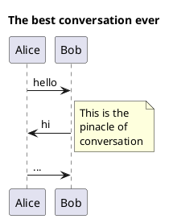

# Docker run with ports

This example demonstrates how to use the `--publish` (or `-p`) option with the
`docker run` command to map a port from the host to a port in the Docker
container.

For this example, we will run a PlantUML server in a Docker container.

> PlantUML is a highly versatile tool that facilitates the rapid and
> straightforward creation of a wide array of diagrams.
>
> <https://plantuml.com>

PlantUML is a powerful tool (written in Java) that allows you to create diagrams
from plain text descriptions. It supports various diagram types, including
sequence diagrams, use case diagrams, class diagrams, activity diagrams,
component diagrams, and more.

All diagrams used in this teaching unit were created using PlantUML.

Installing and configuring PlantUML can be quite complex, as it requires Java
and Graphviz to be installed and properly configured on your system.

On the other hand, they provide an online server where you can enter your
PlantUML diagrams and generate images. However, this requires an internet
connection and may not be suitable for all use cases. It can also be sometimes
slow or unreliable.

To simplify this process, you can use a Docker container that has PlantUML
pre-installed. This way, you do not have to worry about the underlying
dependencies and the availability of the online server.

## Run the PlantUML server

To run the PlantUML server in a Docker container, use the following command:

```sh
# Run the PlantUML server in a Docker container
docker run -d --rm -p 8080:8080 plantuml/plantuml-server
```

The `-d` option runs the container in detached mode, meaning it runs in the
background.

The `--rm` option automatically removes the container when it stops.

The `-p 8080:8080` option maps port `8080` on the host to port `8080` in the
container.

This allows you to access the PlantUML server from your host machine. Without
this option, the server would only be accessible from within the container.

You can now access the PlantUML server by opening your web browser and
navigating to <http://localhost:8080>.

You should see the PlantUML server interface, where you can enter your PlantUML
diagrams and generate images.

## Create a PlantUML diagram

You can try the following PlantUML diagram description to see how it works:



You can copy and paste this description into the PlantUML server interface at
<http://localhost:8080>. The diagram will be generated automatically.

All available diagram types and features are documented on the PlantUML website
at <https://plantuml.com>.

## Stop the PlantUML server

To stop the PlantUML server, you need to find the container ID and then stop it.

First, list the running containers:

```sh
# List the running containers
docker ps
```

The output should be similar to the following:

```text
CONTAINER ID   IMAGE                      COMMAND            CREATED         STATUS         PORTS                                         NAMES
63e5ff730e35   plantuml/plantuml-server   "/entrypoint.sh"   3 minutes ago   Up 3 minutes   0.0.0.0:8080->8080/tcp, [::]:8080->8080/tcp   sleepy_khorana
```

Copy the `CONTAINER ID` of the PlantUML server container (in this case,
`63e5ff730e35`) and use it to stop the container:

```sh
# Stop the PlantUML server container
docker stop 63e5ff730e35
```

The container will be stopped and removed automatically because we used the
`--rm` option when starting it.
