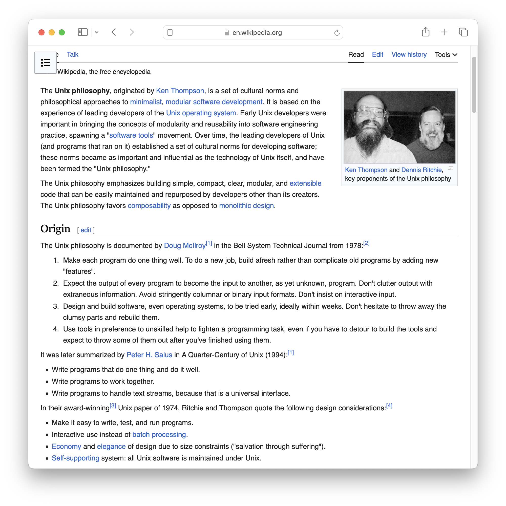
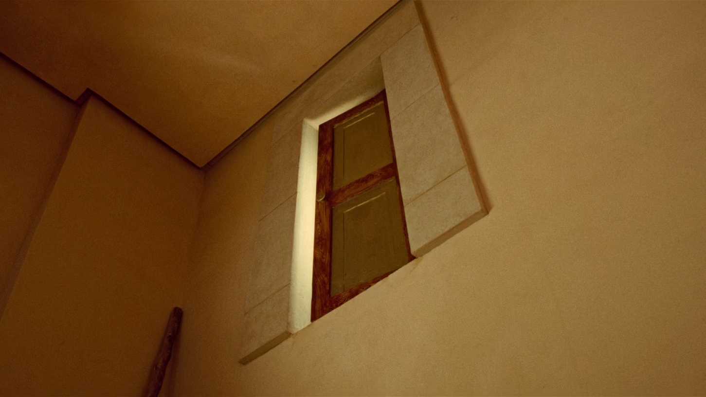

<!--
theme: gaia
size: 16:9
paginate: true
author: L. Delafontaine and H. Louis, with the help of GitHub Copilot
title: HEIG-VD DAI Course - Practical work 1
description: Practical work 1 for the DAI course at HEIG-VD, Switzerland
url: https://heig-vd-dai-course.github.io/heig-vd-dai-course/07-practical-work-1/
footer: '**HEIG-VD** - DAI Course 2024-2025 - CC BY-SA 4.0'
style: |
    :root {
        --color-background: #fff;
        --color-foreground: #333;
        --color-highlight: #f96;
        --color-dimmed: #888;
        --color-headings: #7d8ca3;
    }
    blockquote {
        font-style: italic;
    }
    table {
        width: 100%;
    }
    th:first-child {
        width: 15%;
    }
    h1, h2, h3, h4, h5, h6 {
        color: var(--color-headings);
    }
    h2, h3, h4, h5, h6 {
        font-size: 1.5rem;
    }
    h1 a:link, h2 a:link, h3 a:link, h4 a:link, h5 a:link, h6 a:link {
        text-decoration: none;
    }
    section:not([class=lead]) > p, blockquote {
        text-align: justify;
    }
headingDivider: 6
-->

[web]:
  https://heig-vd-dai-course.github.io/heig-vd-dai-course/07-practical-work-1/
[pdf]:
  https://heig-vd-dai-course.github.io/heig-vd-dai-course/07-practical-work-1/07-practical-work-1-presentation.pdf
[license]:
  https://github.com/heig-vd-dai-course/heig-vd-dai-course/blob/main/LICENSE.md
[discussions]: https://github.com/orgs/heig-vd-dai-course/discussions/5
[illustration]: ./images/main-illustration.jpg
[course-material]:
  https://github.com/heig-vd-dai-course/heig-vd-dai-course/blob/main/07-practical-work-1/COURSE_MATERIAL.md
[course-material-qr-code]:
  https://quickchart.io/qr?format=png&ecLevel=Q&size=400&margin=1&text=https://github.com/heig-vd-dai-course/heig-vd-dai-course/blob/main/07-practical-work-1/COURSE_MATERIAL.md

# Practical work 1

<!--
_class: lead
_paginate: false
-->

<https://github.com/heig-vd-dai-course>

[Web][web] · [PDF][pdf]

<small>L. Delafontaine and H. Louis, with the help of GitHub Copilot.</small>

<small>This work is licensed under the [CC BY-SA 4.0][license] license.</small>

![bg opacity:0.1][illustration]

## Objectives

- Create a command line tool (CLI) to process files with Java IOs
- Practice Java, Maven and [picocli](https://picocli.info/)
- Practice a Git workflow to share your work with your team
- You can choose what the CLI will do (you can be creative! - extract metrics
  from a text file, grayscale a JPEG file, etc.)


## Demo

Compile the project:

```sh
./mvnw clean package
```

Run the CLI without any arguments:

```sh
java -jar target/practical-work-1-demo-1.0-SNAPSHOT.jar
```

---

```text
Missing required options: '--input=<inputFile>', '--output=<outputFile>'
Usage: practical-work-1-demo-1.0-SNAPSHOT.jar [-hV] -i=<inputFile>
       [-I=<inputEncoding>] -o=<outputFile> [-O=<outputEncoding>] [COMMAND]
Process an input file and return a result.
  -h, --help                Show this help message and exit.
  -i, --input=<inputFile>   The input file.
  -I, --input-encoding=<inputEncoding>
                            The input file encoding (default: UTF-8).
  -o, --output=<outputFile> The output file.
  -O, --output-encoding=<outputEncoding>
                            The output file encoding (default: UTF-8).
  -V, --version             Print version information and exit.
Commands:
  uppercase  Converts the input file to uppercase.
  lowercase  Converts the input file to lowercase.
```

---

Run the CLI with the `uppercase` command:

```sh
java -jar target/practical-work-1-demo-1.0-SNAPSHOT.jar \
  --input input.txt \
  --output output.txt \
  uppercase
```

You can also specify the encoding of the input and output files:

```sh
java -jar target/practical-work-1-demo-1.0-SNAPSHOT.jar \
  --input input.txt --input-encoding UTF-8 \
  --output output.txt --output-encoding US-ASCII \
  uppercase
```

## See the result

Input file:

```text
$ cat input.txt
Bonjour, comment ça va aujourd'hui ?
```

Output file:

```text
$ cat output.txt
BONJOUR, COMMENT ?A VA AUJOURD'HUI ?
```

Why is the `ç` not converted to uppercase?

## Group composition

<!-- _class: lead -->

More details for this section in the [course material][course-material].

### Group composition

- 2 or 3 students per group
- Create a GitHub Discussion to:
  - Announce your group members
  - Announce your idea (even a draft is fine)
- **Do it as soon as possible before next week!**
  - This helps us to plan the presentations


## Idea validation

<!-- _class: lead -->

More details for this section in the [course material][course-material].

### Idea validation

- You must state your idea on your GitHub Discussion
- We might ask you to change your idea if it is too simple or too complex
- We will help you to find a good idea if needed
- **Do it as soon as possible before next week!**


## Grading criteria

<!-- _class: lead -->

More details for this section in the [course material][course-material].

### Grading criteria

You can find all the grading criteria in the [course material][course-material]:

- 0 point - The work is insufficient
- 0.1 point - The work is done
- 0.2 point - The work is well done (without the need of being perfect)

Maximum grade: 25 points \* 0.2 + 1 = 6


## Constraints

<!-- _class: lead -->

More details for this section in the [course material][course-material].

### Constraints

- The application must be written in Java, compatible with Java 21
- The application must be built using Maven with the `maven-shade-plugin` plugin
- The application must use the picocli dependency
- You can only use the Java classes seen in the course to process the files (you
  can use other libraries to help you once the files are opened)
- Your application must be slightly more complex and slightly different than the
  examples presented during the course

## Tips

<!-- _class: lead -->

More details for this section in the [course material][course-material].

### The UNIX philosophy and the KISS principle

- _Write programs that do one thing and do it well._
- _Write programs to work together._
- _Write programs to handle text streams, because that is a universal
  interface._



---

The KISS principle summarizes the Unix philosophy in a simple sentence: _Keep it
simple, silly!_

- Do not try to do too much
- Focus on the essentials
- Do it well

Do not be Numérobis from the movie _Astérix et Obélix : Mission Cléopâtre_!

<small>Check the movie scene here:
[YouTube](https://www.youtube.com/watch?v=dEP7aEyTOf0)</small>



### External libraries

- You can use any external librairies you want in your Maven project
- You must explain why and how you use it in your README
- **You cannot use some external libraries to open/close the files**


### Add members to the repository

- Add your team members to your repository as collaborators
- This allows them to push directly to the repository


### Protect your main branch

- GitHub allows to protect the main branch:
  - Force pull requests
  - Force code review
  - Force signed commits
- This is a good practice to guarantee quality


## Submission

<!-- _class: lead -->

More details for this section in the [course material][course-material].

### Submission

Your work is due as follow:

- DAI-TIC-C (Friday mornings): **17.10.2024 23:59**
- DAI-TIC-B (Monday mornings): **20.10.2024 23:59**

Update the GitHub Discussion with the link to your repository as mentioned in
the course material.

**If you do not submit your work on time and/or correctly, you will be penalized
(-1 point on the final grade for each day of delay).**

## Presentations

<!-- _class: lead -->

More details for this section in the [course material][course-material].

### Presentations

The practical work presentations will take place in **room B51a** on:

- DAI-TIC-C (Friday mornings): **18.10.2024 8:30-10:25**
- DAI-TIC-B (Monday mornings): **28.10.2024 8:30-10:25**

We only have **6 minutes per group**. You decide what you want to show us and
how you want to present it.

**Come 5 minutes before your time slot** with your computer. You will have
access to a video projector.

## Grades and feedback

Grades will be entered into GAPS, followed by an email with the feedback.

The evaluation will use exactly the same grading grid as shown in the course
material.

Each criterion will be accompanied by a comment explaining the points obtained,
a general comment on your work and the final grade.

If you have any questions about the evaluation, you can contact us!

## Questions

<!-- _class: lead -->

Do you have any questions?

## Find the practical work

<!-- _class: lead -->

You can find the practical work for this part on [GitHub][course-material].

[![bg right w:75%][course-material-qr-code]][course-material]

## Finished? Was it easy? Was it hard?

Can you let us know what was easy and what was difficult for you during this
practical work?

This will help us to improve the course and adapt the content to your needs. If
we notice some difficulties, we will come back to you to help you.

➡️ [GitHub Discussions][discussions]

You can use reactions to express your opinion on a comment!

## Sources

- Main illustration by
  [Birmingham Museums Trust](https://unsplash.com/@birminghammuseumstrust) on
  [Unsplash](https://unsplash.com/photos/ScZwMqoxcls)
- Illustration by [Aline de Nadai](https://unsplash.com/@alinedenadai) on
  [Unsplash](https://unsplash.com/photos/j6brni7fpvs)
- Illustration by [Josh Calabrese](https://unsplash.com/@joshcala) on
  [Unsplash](https://unsplash.com/photos/five-men-riding-row-boat-Ev1XqeVL2wI)
- Illustration by [Nicole Baster](https://unsplash.com/@nicolebaster) on
  [Unsplash](https://unsplash.com/photos/traffic-light-aGx-CFsM3fE)
- Illustration by [Chris LaBarge](https://unsplash.com/@chrislabarge) on
  [Unsplash](https://unsplash.com/photos/a-sign-that-is-on-a-tree-in-the-woods-dy1GA9Ow6JA)
- Scene from the movie _Astérix et Obélix : Mission Cléopâtre (2002)_ by Alain
  Chabat
