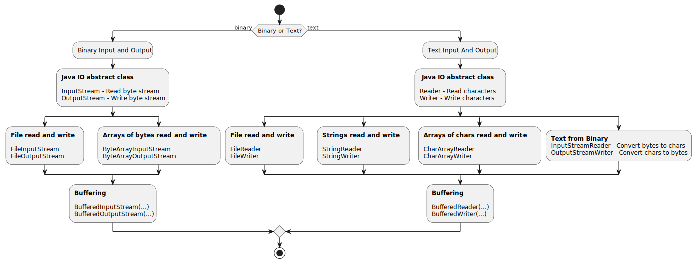

[markdown]:
  https://github.com/heig-vd-dai-course/heig-vd-dai-course/blob/main/05-java-ios/COURSE_MATERIAL.md
[pdf]:
  https://heig-vd-dai-course.github.io/heig-vd-dai-course/05-java-ios/05-java-ios-course-material.pdf
[license]:
  https://github.com/heig-vd-dai-course/heig-vd-dai-course/blob/main/LICENSE.md
[discussions]: https://github.com/orgs/heig-vd-dai-course/discussions/4
[illustration]:
  https://images.unsplash.com/photo-1549319114-d67887c51aed?fit=crop&h=720

# Java IOs - Course material

<https://github.com/heig-vd-dai-course>

[Markdown][markdown] · [PDF][pdf]

L. Delafontaine and H. Louis, with the help of Copilot.

Based on the original course by O. Liechti and J. Ehrensberger.

This work is licensed under the [CC BY-SA 4.0][license] license.

![Main illustration][illustration]

## Table of contents

- [Table of contents](#table-of-contents)
- [Objectives](#objectives)
- [Processing binary data vs. text data](#processing-binary-data-vs-text-data)
  - [Ancestor of character representations: ASCII](#ancestor-of-character-representations-ascii)
  - [Extended ASCII: codes pages](#extended-ascii-codes-pages)
  - [Unicode](#unicode)
  - [UTF-8](#utf-8)
  - [What happens if you ignore the character encoding?](#what-happens-if-you-ignore-the-character-encoding)
  - [End of line characters](#end-of-line-characters)
  - [A quick note on little endian vs. big endian](#a-quick-note-on-little-endian-vs-big-endian)
- [Sources, streams and sinks of data](#sources-streams-and-sinks-of-data)
- [The Java IO API](#the-java-io-api)
  - [Performance and buffering](#performance-and-buffering)
  - [Dealing with errors](#dealing-with-errors)
  - [When to use which IO?](#when-to-use-which-io)
- [Practical content](#practical-content)
  - [Check and try-out the code examples](#check-and-try-out-the-code-examples)
  - [Benchmarking the different types of streams](#benchmarking-the-different-types-of-streams)
  - [Go further](#go-further)
- [Conclusion](#conclusion)
  - [What did you do and learn?](#what-did-you-do-and-learn)
  - [Test your knowledge](#test-your-knowledge)
- [Finished? Was it easy? Was it hard?](#finished-was-it-easy-was-it-hard)
- [What will you do next?](#what-will-you-do-next)
- [Resources](#resources)
- [Sources](#sources)

## Objectives

This chapter will help you understand why IOs are important in network
programming and how to use them in Java.

Network programming is about reading and writing data (= files) from and to the
network. Files are a great example to understand how IOs work in the first place
without the hassle of network programming.

You might need to use different types of IOs depending on the type of data you
want to process. You will learn how to use the right IOs for the right data.

These skills are essential to be able to process data from the network later on
this course!

Let's get started!

## Processing binary data vs. text data

There are two main types of data you can process: binary data and text data.

Binary data processing is the most basic type of data processing: you open a
file, you read the bits and you write the bits to another file. You do not have
to interpret the bits, you just copy them.

What is the difference between binary data and text data?

Computers only understand binary data. Binary data is a sequence of bits (`0`s
and `1`s). Binary data can represent anything: text, images, videos, etc. On the
file system, everything is binary data.

The real question is: how do we interpret these bits?

### Ancestor of character representations: ASCII

The **American Standard Code for Information Interchange (ASCII)** is one of the
first character encodings. It is a character encoding that maps 128 binary
values to 128 characters. For example, the binary data `01000001` is mapped to
the character `A`.

The first implementation of ASCII was published in 1963. It was meant to be used
for the English language only. It was later extended to support other languages.

### Extended ASCII: codes pages

As ASCII is a very limited character encoding (only 8 bits, leaving 128 other
possible values), many other character encodings were created to support more
characters and languages.

These extended ASCII character encodings are called **code pages**. They were
then standardized by the **International Organization for Standardization
(ISO)**.

Common code pages are **ISO-8859-1** (also called **Latin-1**), **ISO-8859-15**
(also called **Latin-9**), **Windows-1252** (also called **CP1252**), etc.

### Unicode

**Unicode** is a newer character encoding standard that was meant to **solve the
issues of ASCII and code pages** that could not support all specificities of all
languages:

- Languages with more than 256 characters (like Chinese)
- Languages with more than one alphabet (like Serbian)
- Languages with more than one writing system (like Chinese or Japanese)

The Unicode specification defines 1,112,064 characters.

This is enough to **support all languages in the world** as well as emojis (for
our greatest pleasure... 🥲).

Implementations of the Unicode standard are called **Unicode Transformation
Formats (UTF)**. The most common implementations is **UTF-8**.

### UTF-8

**UTF-8** is a variable-length character encoding that uses 1 to 4 bytes to
encode a character. It is the most common implementation of the Unicode
standard. It is the default character encoding on the Internet and many other
applications.

UTF-8 is backward compatible with ASCII. This means that if you have a file
encoded in ASCII, it is also encoded in UTF-8.

| Binary data                                 | Meaning           |
| ------------------------------------------- | ----------------- |
| `0xxxxxxx`                                  | 1 byte character  |
| `110xxxxx` `10xxxxxx`                       | 2 bytes character |
| `1110xxxx` `10xxxxxx` `10xxxxxx`            | 3 bytes character |
| `11110xxx` `10xxxxxx` `10xxxxxx` `10xxxxxx` | 4 bytes character |

As some bits are used to encode the length of the character, the number of
possible characters is limited, hence the 1,112,064 characters limit.

Other implementations of the Unicode standard exist, such as UTF-16 and UTF-32.
They are not as common as UTF-8 and are not backward compatible with ASCII.

Java strings for instance uses UTF-16, meaning a character is encoded in 2 bytes
(in C/C++, a character is encoded in 1 byte).

### What happens if you ignore the character encoding?

When you open a file, you need to know the character encoding used to encode the
file.

The character encoding is not usually stored in the file. You need to know it in
advance to be able to read the file correctly.

When the character encoding is not known in advance or misinterpreted, it can
lead to issues like displaying the wrong characters or not being able to display
the characters at all.

A good example is when you open a text file encoded in UTF-8 with a text editor
that does not support UTF-8. The text editor will try to interpret the file as
ASCII and will display the wrong characters (`é` instead of `é` for example).

### End of line characters

Another important thing to know when dealing with text files is the **end of
line character**.

The end of line character is a special character that marks the end of a line.

There are different end of line characters depending on the operating system:

- Unix/Linux/macOS: `'\n'`, called Line feed (`LF`)
- Windows: `'\r\n'`, called Carriage Return + Line feed (`CR`+`LF`)

When you read a text file line by line, the string you get will **not** contain
the end of line character(s). You have to add it yourself if you want to write
the string to another file. Just something to keep in mind.

### A quick note on little endian vs. big endian

When working with binary data, you need to know if the data is encoded in
**little endian** or in **big endian**.

**Little endian** means that the least significant byte is stored first. **Big
endian** means that the most significant byte is stored first.

For example, the number `0x12345678` is stored as `0x78 0x56 0x34 0x12` in
little endian and as `0x12 0x34 0x56 0x78` in big endian.

This is important to know when you read or write binary data. If you read or
write binary data in the wrong endian, the data will be corrupted.

Java uses big endian by default. You can use little endian by using the
`ByteBuffer` class. We will not cover this in this course.

## Sources, streams and sinks of data

Whenever you want to read or write data, you need to have a source of data and a
sink of data, using a stream to let the data flow from the source to the sink.

This representation is an abstraction of the real world. It is a way to
represent the flow of data from one place to another.

A **source of data** is **where the data comes from**. It can be a file, a
network connection, a keyboard, etc. A common term for a source of data is
something that **produces** data (**a producer**).

A **sink of data** is **where the data goes**. It can be another file, a network
connection, a screen, etc. A common term for a sink of data is something that
**consumes** data (**a consumer**).

A **stream** is **a way to read or write data** from or to a source or a sink.

## The Java IO API

The Java documentation is separated in modules. The Java IO API is part of the
`java.base` module.

In the `java.base` module, there are two main packages to read and write data:

- `java.io`: the standard Java IO API
- `java.nio`: the Java NIO API

The `java.io` package is called **Java IO API** or the **standard Java IO API**.

The **Java NIO API** was introduced in Java 1.4. It is a more modern API that
can be more efficient and more flexible than the Java IO API in some use-case.
It is also more complex to use and is meant for more advanced use cases (writing
scalable servers for example). We will not cover it in this course.

The documentation of the Java IO API is quite complex. It is not easy to find
the right class to use for the right use case.

You might need to check several classes before finding the right one.

### Performance and buffering

When reading and writing data, data can be read or written byte by byte or using
a buffer.

If you don’t use buffered IOs, calling `read()` will issue one system call to
retrieve one single byte... which is not efficient.

With buffered IOs, calling `read()` will pre-fetch "several" bytes and store it
in a temporary memory space (i.e. in a buffer).

"Several" defines the buffer size. Subsequent calls to `read()` will be able to
fetch bytes directly from the buffer, which is very fast.

When the buffer is empty, a new system call will be issued to fetch more bytes.

If the buffer is full, a new system call will be issued to flush the buffer.

If the buffer is half full, it must be flushed before it can be filled again.

Calling `close()` will automatically flush the buffer as well but sometimes you
want to flush the buffer without closing the file for performance reasons.

If you want to be sure that all data is written to the file, you need to call
`flush()` manually. Calling `flush()` will make a system call to write the
content of the buffer to the file and empty the buffer.

### Dealing with errors

When using the Java IO API, you need to open and close a file before and after
reading or writing data.

If you do not close the file properly, you might lose data or corrupt the file.

When accessing a file, many things can go wrong. The file might not exist, the
file might be corrupted, the file might be locked by another process, etc.

When you open a file, you need to handle these errors. You can do this by
catching the `IOException` exception. This is done with a
`try`/`catch`/`finally` block or, more recently, with a `try-with-resources`
block. Using the `try-with-resources` block is the preferred way to handle
errors as it is more concise and less error-prone.

The common exceptions you might encounter are:

- `FileNotFoundException`: the file does not exist
- `IOException`: the file cannot be accessed for other reasons
- `UnsupportedEncodingException`: the file is encoded in an unsupported
  character encoding

The same applies when you use the network: the network might be down, the
connection might be lost, etc.

You will have to manage these errors when you will work with the network.

### When to use which IO?

The Java IO API is very powerful. It can be used to read and write data from and
to different sources and sinks of data using different types of streams.

It can sometimes be overwhelming to know which IO to use for which use case.

Here is a simple decision tree to help you choose the right IO for the right use
case:

## Practical content

### Check and try-out the code examples

In this section, you will learn how to read and write data from and to different
sources and sinks of data using different types of streams.

#### Clone the repository

Clone the
[`heig-vd-dai-course/heig-vd-dai-course-code-examples`](https://github.com/heig-vd-dai-course/heig-vd-dai-course-code-examples)
repository to get the code examples.

#### Explore and run the code examples

Checkout the `README.md` file to know how to run the code examples.

Take some time to explore the code examples. Run them and see what they do.

### Benchmarking the different types of streams

In this section, you will learn how to read and write data from and to different
sources and sinks of data using different types of streams.

#### Create and clone the repository

You can create a new GitHub project using the template we have prepared for you.
When you create a new repository, you can choose to use a template. Select the
`heig-vd-dai-course/heig-vd-dai-course-java-ios-practical-content` template as
shown in the following screenshot:

Clone the repository locally.

#### Implement the different types of streams

Take some time to explore the codebase from the template we have prepared for
you.

You will benchmark the different types of streams to see which one is the most
efficient for your use case:

- Open a binary file for byte per byte reading
- Write a binary file for byte per byte writing
- Open a binary file for buffer reading
- Write a binary file for buffer writing
- Open a text file for byte per byte reading
- Write a text file for byte per byte writing
- Open a text file for buffer reading
- Write a text file for buffer writing

You will also generate random data to benchmark the different types of streams.

Read the course material carefully to find the right classes to use. You can
also have a look at the Java documentation to find more details on the right
classes to use and how to use them:
<https://docs.oracle.com/en/java/javase/17/docs/api/index.html>

Please be aware that you **always** have to set the encoding when you read or
write text data. If you do not set the encoding, the default encoding will be
used, which is not what you want.

#### Compare the results

Generate different files with different sizes (1B, 1KiB, 1MiB, 5MiB). Compare
the results with the execution time of the different types of streams. Which one
is the most efficient for each use case?

#### Share your results

Share your results in the GitHub Discussions of this organization:
<https://github.com/orgs/heig-vd-dai-course/discussions>.

Create a new discussion with the following information:

- **Title**: DAI 2023-2024 - Java IOs benchmarking - First name Last Name
- **Category**: Show and tell
- **Description**: The link to your GitHub repository, the results of your
  benchmarking in Markdown table and add your conclusions to the following
  questions:
  - Which type of stream is the most efficient for each use case?
  - Why is it more efficient than the other types of streams?
  - What is the difference between binary data and text data?
  - What is a character encoding?
  - Why is this methodology important?

This will notify us that you have completed the exercise and we can check your
work.

### Go further

- You can do the same benchmarking with the Java NIO API. How is it different
  from the Java IO API?

## Conclusion

### What did you do and learn?

In this chapter, you have learned how to read and write data from and to
different sources and sinks of data using different types of streams, more
specifically binary and text data.

You have learned the importance of character encodings and how to handle them
when reading and writing data.

You have learned how to benchmark the different types of streams to find the
most efficient one for your use case.

You have also learned how to handle errors to avoid your program to crash.

### Test your knowledge

At this point, you should be able to answer the following questions:

- What is a source of data?
- What is a sink of data?
- What is a stream?
- What is the difference between binary data and text data?
- What is a character encoding?
- What is UTF-8? How is it different from ASCII and Unicode?
- What happens if you ignore the character encoding?
- How is a buffer more efficient than reading or writing byte by byte?

## Finished? Was it easy? Was it hard?

Can you let us know what was easy and what was difficult for you during this
chapter?

This will help us to improve the course and adapt the content to your needs. If
we notice some difficulties, we will come back to you to help you.

➡️ [GitHub Discussions][discussions]

You can use reactions to express your opinion on a comment!

## What will you do next?

You will start the practical work!

## Resources

_Resources are here to help you. They are not mandatory to read._

- [Informatique au gymnase : apprendre - Les caractères](https://apprendre.modulo-info.ch/rep-info/caracteres.html)

_Missing item in the list? Feel free to open a pull request to add it! ✨_

## Sources

- Main illustration by [Nathan Dumlao](https://unsplash.com/@nate_dumlao) on
  [Unsplash](https://unsplash.com/photos/KixfBEdyp64)
