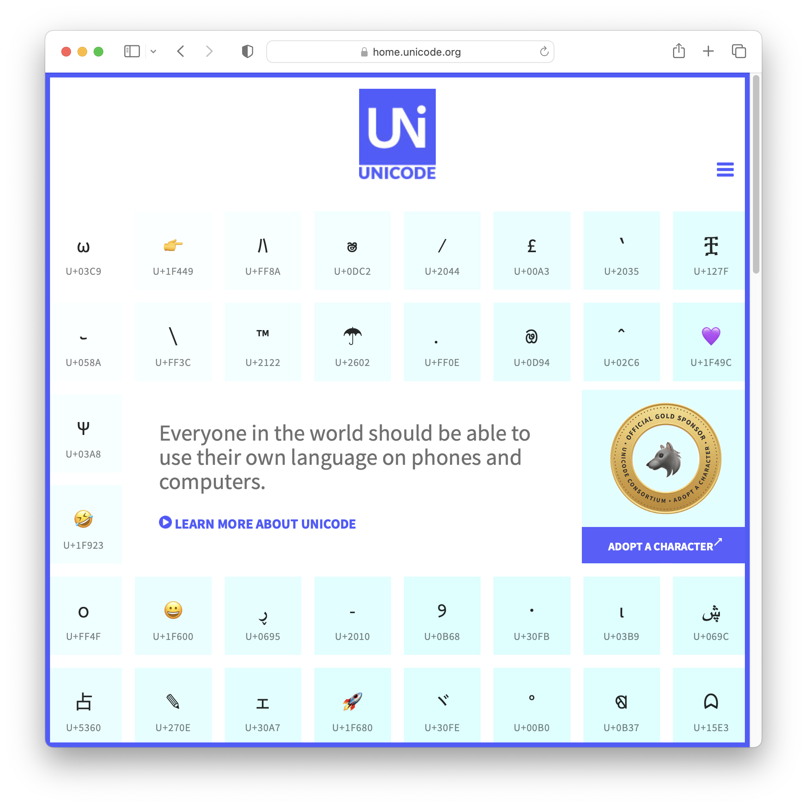
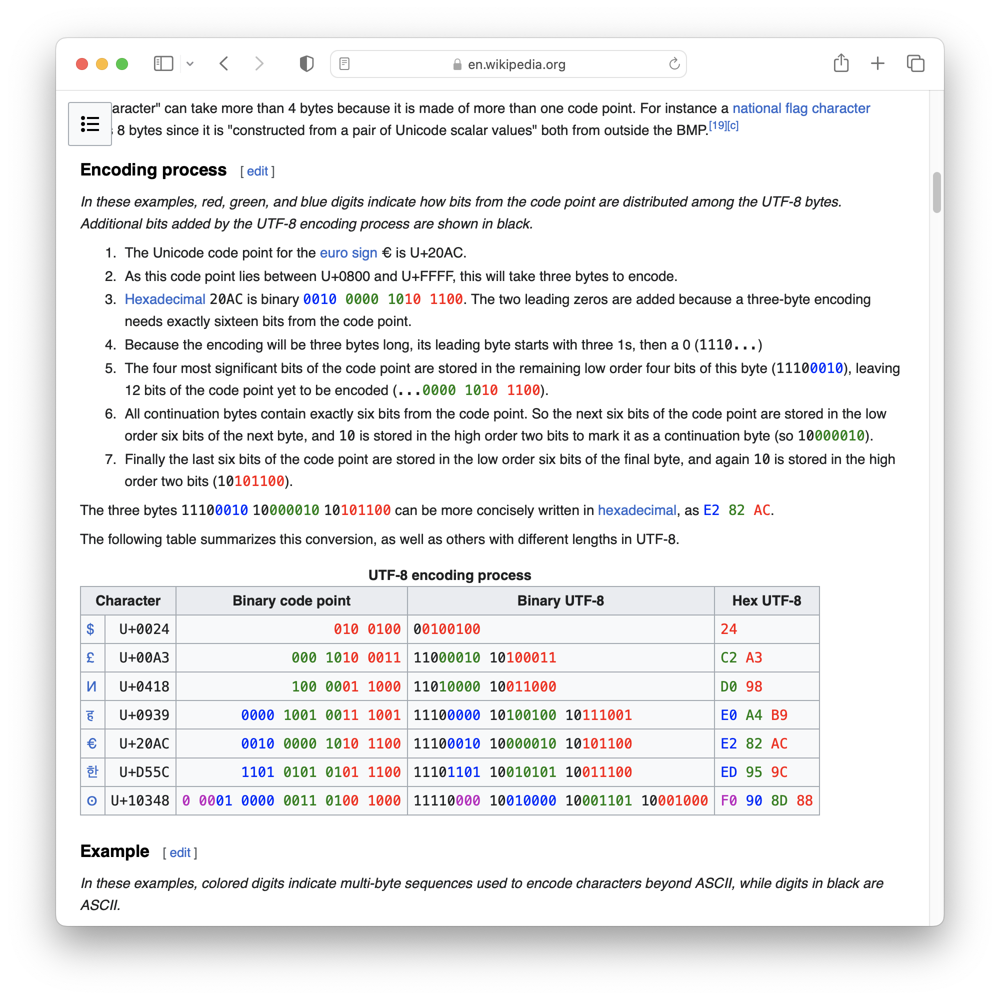

<!--
theme: gaia
size: 16:9
paginate: true
author: L. Delafontaine and H. Louis, with the help of ChatGPT
title: HEIG-VD DAI Course - Java IOs
description: Java IOs for the DAI course at HEIG-VD, Switzerland
url: https://heig-vd-dai-course.github.io/heig-vd-dai-course/05-java-ios/
footer: '**HEIG-VD** - DAI Course 2023-2024 - CC BY-SA 4.0'
style: |
    :root {
        --color-background: #fff;
        --color-foreground: #333;
        --color-highlight: #f96;
        --color-dimmed: #888;
        --color-headings: #7d8ca3;
    }
    blockquote {
        font-style: italic;
    }
    table {
        width: 100%;
    }
    th:first-child {
        width: 15%;
    }
    h1, h2, h3, h4, h5, h6 {
        color: var(--color-headings);
    }
    h2, h3, h4, h5, h6 {
        font-size: 1.5rem;
    }
    h1 a:link, h2 a:link, h3 a:link, h4 a:link, h5 a:link, h6 a:link {
        text-decoration: none;
    }
    section:not([class=lead]) > p, blockquote {
        text-align: justify;
    }
headingDivider: 4
-->

[web]: https://heig-vd-dai-course.github.io/heig-vd-dai-course/05-java-ios/
[pdf]:
  https://heig-vd-dai-course.github.io/heig-vd-dai-course/05-java-ios/05-java-ios-presentation.pdf
[license]:
  https://github.com/heig-vd-dai-course/heig-vd-dai-course/blob/main/LICENSE.md
[discussions]: https://github.com/orgs/heig-vd-dai-course/discussions/4
[illustration]:
  https://images.unsplash.com/photo-1549319114-d67887c51aed?fit=crop&h=720
[practical-content]:
  https://github.com/heig-vd-dai-course/heig-vd-dai-course/blob/main/05-java-ios/COURSE_MATERIAL.md#practical-content
[practical-content-qr-code]:
  https://quickchart.io/qr?format=png&ecLevel=Q&size=400&margin=1&text=https://github.com/heig-vd-dai-course/heig-vd-dai-course/blob/main/05-java-ios/COURSE_MATERIAL.md#practical-content

# Java IOs

<!--
_class: lead
_paginate: false
-->

<https://github.com/heig-vd-dai-course>

[Web][web] · [PDF][pdf]

<small>L. Delafontaine and H. Louis, with the help of ChatGPT.</small>

<small>Based on the original course by O. Liechti and J. Ehrensberger.</small>

<small>This work is licensed under the [CC BY-SA 4.0][license] license.</small>

![bg opacity:0.1][illustration]

## Objectives

- Understanding different IO types
  - Binary vs. text
  - Character encoding
- Using IOs in Java

## Processing binary data vs. text data

<!-- _class: lead -->

More details for this section in the
[course material](https://github.com/heig-vd-dai-course/heig-vd-dai-course/blob/main/05-java-ios/COURSE_MATERIAL.md#processing-binary-data-vs-text-data).
You can find other resources and alternatives as well.

### Processing binary data vs. text data

- Two types of data: binary and text
- Both are `0`s and `1`s - the difference is in interpretation
- Binary data: pure copying
- Text data: interpretation

### Ancestor of character representations: ASCII

- ASCII: 128 binary values
- Mapping binary to characters
- Published in 1963 and meant for English

### Extended ASCII: codes pages

- Extended ASCII (code pages)
- Support for more characters using the remaining 128 values

### Unicode

- Unicode: solves ASCII limitations
- Standard to support all languages
- Different implementations
  - UTF-8
  - UTF-16
  - UTF-32

### UTF-8

- UTF-8: variable-length encoding
- Most common Unicode implementation

### What happens if you ignore the character encoding?

- Need to know character encoding
- Misinterpretation leads to issues

### End of line characters

- Different end-of-line characters on different systems
  - Unix/Linux/macOS: `\n` (LF)
  - Windows: `\r\n` (CR + LF)

## Sources, streams and sinks of data

<!-- _class: lead -->

More details for this section in the
[course material](https://github.com/heig-vd-dai-course/heig-vd-dai-course/blob/main/05-java-ios/COURSE_MATERIAL.md#sources-streams-and-sinks-of-data).
You can find other resources and alternatives as well.

### Sources, streams and sinks of data

- Abstraction of data flow
- Source: where data comes from
- Sink: where data goes
- Stream: for data flow

## The Java IO API

<!-- _class: lead -->

More details for this section in the
[course material](https://github.com/heig-vd-dai-course/heig-vd-dai-course/blob/main/05-java-ios/COURSE_MATERIAL.md#the-java-io-api).
You can find other resources and alternatives as well.

### The Java IO API

- Part of `java.base` module
  - `java.io`
  - `java.nio`
- Different classes for different IO types

### Performance and buffering

- Buffered IO vs. byte-by-byte
- Buffer improves read/write efficiency using a memory buffer to store and fetch
  data
- Manual flushing with `flush()`

### Dealing with errors

- Proper file open/close
- Handling exceptions with `try-with-resources`

### When to use which IO?

## Practical content

<!-- _class: lead -->

### What will you do?

- Explore and try-out code examples
- Run benchmarks for different IO types
- Understand the differences between IO types and their use cases

### Find the practical content

<!-- _class: lead -->

You can find the practical content for this chapter on
[GitHub][practical-content].

[![bg right w:75%][practical-content-qr-code]][practical-content]

## Finished? Was it easy? Was it hard?

Can you let us know what was easy and what was difficult for you during this
chapter?

This will help us to improve the course and adapt the content to your needs. If
we notice some difficulties, we will come back to you to help you.

➡️ [GitHub Discussions][discussions]

You can use reactions to express your opinion on a comment!

## What will you do next?

<!-- _class: lead -->

You will start the practical work!

## Sources

- Main illustration by [Martijn Baudoin](https://unsplash.com/@martijnbaudoin)
  on [Unsplash](https://unsplash.com/photos/4h0HqC3K4-c)
- Illustration by [T K](https://unsplash.com/@realaxer) on
  [Unsplash](https://unsplash.com/photos/9AxFJaNySB8)
- Illustration by [Anna Dudkova](https://unsplash.com/@annadudkova) on
  [Unsplash](https://unsplash.com/photos/urs_y9NwFcc)
- Illustration by [Sigmund](https://unsplash.com/@sigmund) on
  [Unsplash](https://unsplash.com/photos/By-tZImt0Ms)
