<!--
theme: custom-marp-theme
size: 16:9
paginate: true
author: L. Delafontaine and H. Louis, with the help of GitHub Copilot
title: HEIG-VD DAI - SMTP and ncat
description: SMTP and ncat for the DAI course at HEIG-VD, Switzerland
header: '[**SMTP and ncat**](https://github.com/heig-vd-dai-course/heig-vd-dai-course/tree/main/05.03-smtp-and-ncat)'
footer: '[**HEIG-VD**](https://heig-vd.ch) - [DAI 2025-2026](https://github.com/heig-vd-dai-course/heig-vd-dai-course) - [CC BY-SA 4.0](https://github.com/heig-vd-dai-course/heig-vd-dai-course/blob/main/LICENSE.md)'
headingDivider: 6
-->

# SMTP and ncat

<!--
_class: lead
_paginate: false
-->

[Link to the course][course]

<small>L. Delafontaine and H. Louis, with the help of
[GitHub Copilot](https://github.com/features/copilot).</small>

<small>Based on the original course by O. Liechti and J. Ehrensberger.</small>

<small>This work is licensed under the [CC BY-SA 4.0][license] license.</small>

![bg opacity:0.1][illustration]

## Objectives

- Refresher on networking concepts.
- Learn electronic messaging protocols:
  - SMTP.
  - POP3.
  - IMAP.
- Focus on the SMTP protocol.
- Learn how to use ncat and Java to send an email to an SMTP server.

## A quick reminder about networking

<!-- _class: lead -->

More details for this section in the [course material][course]. You can find
other resources and alternatives as well.

### The Internet Protocol (IP)

- Each computer has a unique IP address
- IPv4 addresses are limited.
- NAT routers share IP addresses.
- IPv6 fixes this issue.
- IP addresses are used to route packets.

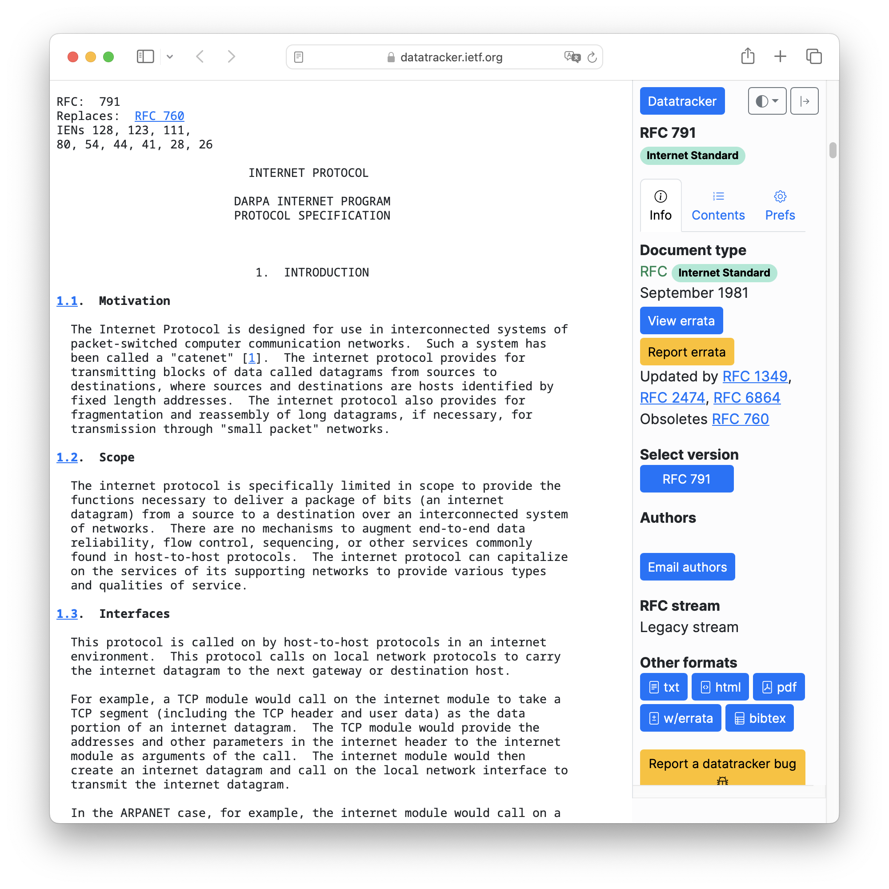

### The Domain Name System (DNS)

- DNS maps domain names to IP addresses.
- Example: `heig-vd.ch` to `193.134.223.20`.
- dig and nslookup are useful tools to query DNS servers.

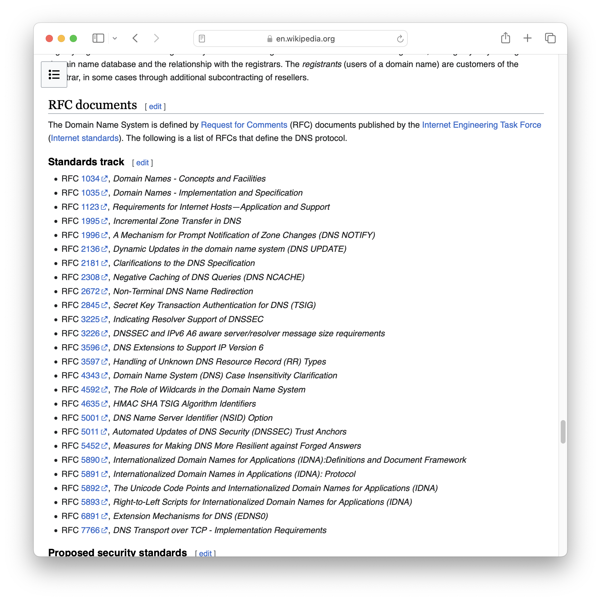

### Common DNS records

DNS records map a domain name to other services/IPs:

- `NS`: Name Server.
- `CNAME`: Alias.
- `A`: IPv4 address.
- `AAAA`: IPv6 address.

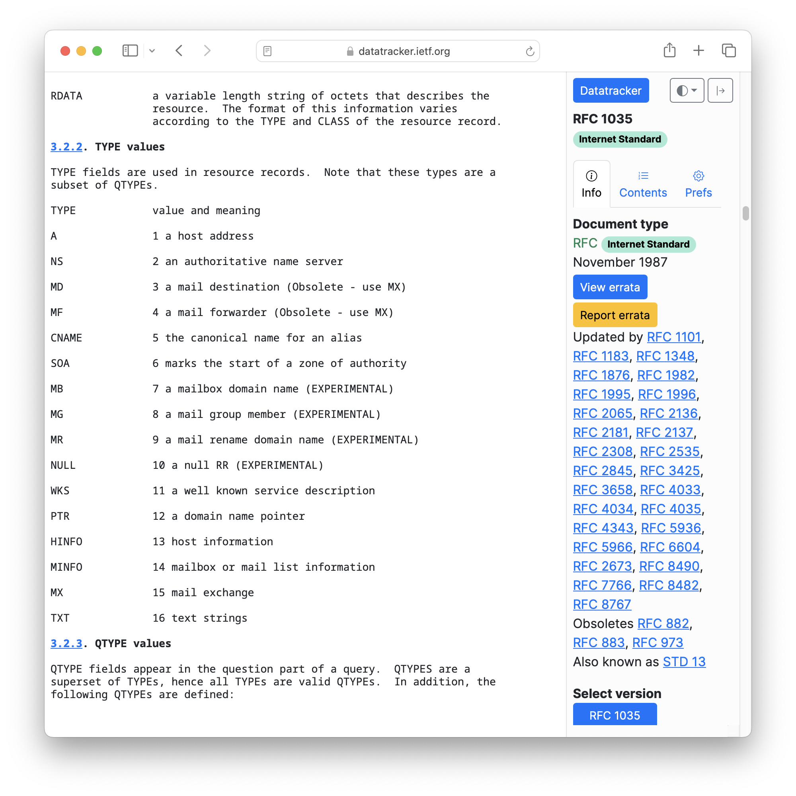

### Reserved ports

- Ports identify processes or services.
- Analogy: an IP address is like a street address. A port is like an apartment
  number.
- Ports are 16-bit unsigned numbers, maximum 65535.
- Reserved ports: 0-1023.
- Other ports: far west.

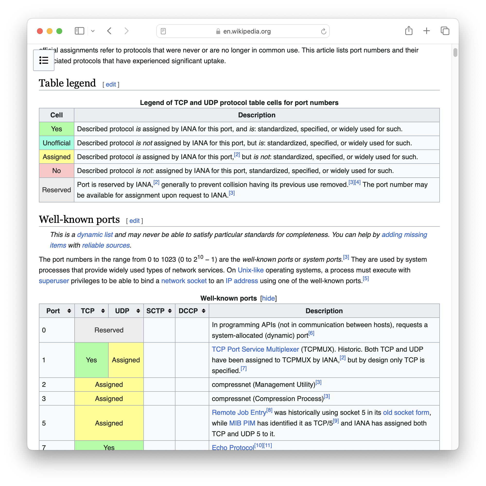

## Electronic messaging protocols: SMTP, POP3 and IMAP

<!-- _class: lead -->

More details for this section in the [course material][course]. You can find
other resources and alternatives as well.

### Electronic messaging protocols: SMTP, POP3 and IMAP

- Email clients are called _"Mail User Agents (MUA)"_.
- Email servers are called _"Mail Transfer Agents (MTA)"_.
- They use different protocols to communicate.

### SMTP

- SMTP: Simple Mail Transfer Protocol.
- Uses TCP port 25 (unencrypted) or 465 (encrypted).
- Used to send emails.

### POP3

- POP3: Post Office Protocol.
- Uses TCP port 110 (unencrypted) or 995 (encrypted).
- Used to retrieve emails from a server.

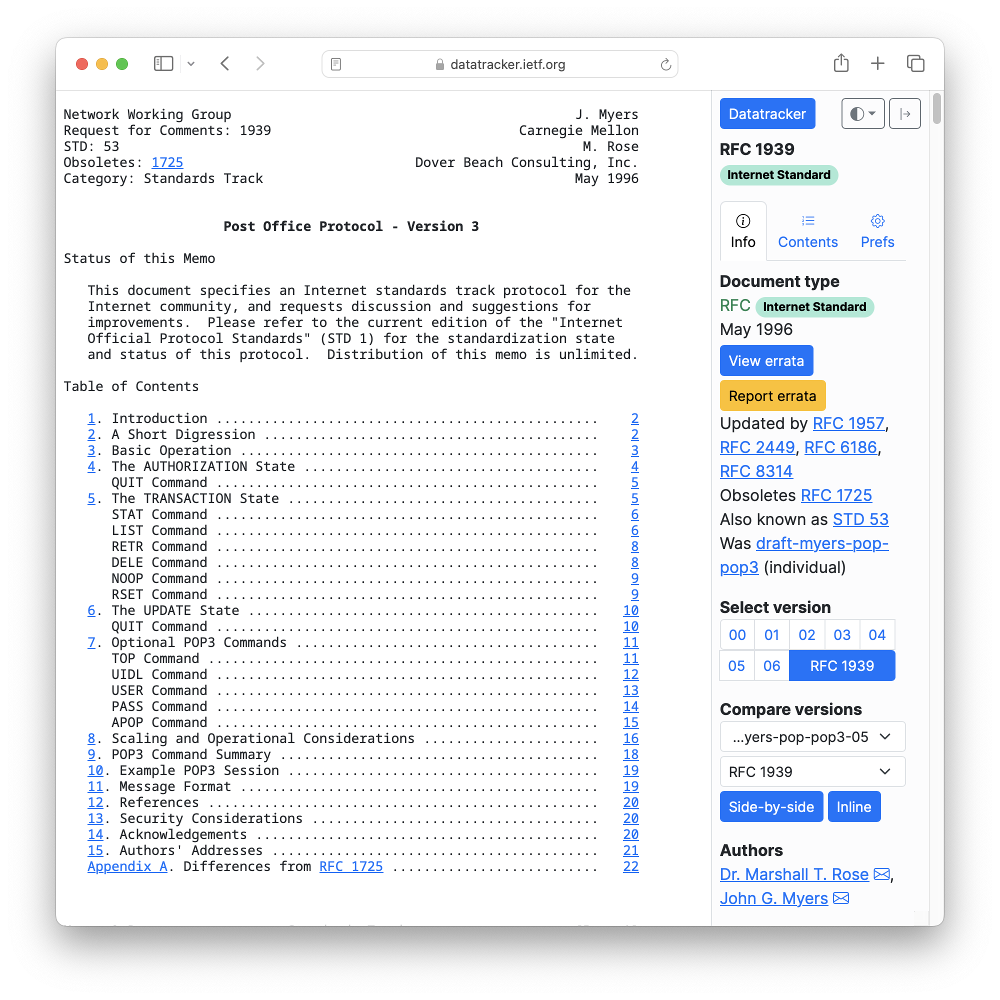

### IMAP

- IMAP: Internet Message Access Protocol.
- Uses TCP port 143 (unencrypted) or 993 (encrypted).
- Used to retrieve emails from a server.
- Much more powerful than POP3 (synchronization, ...).

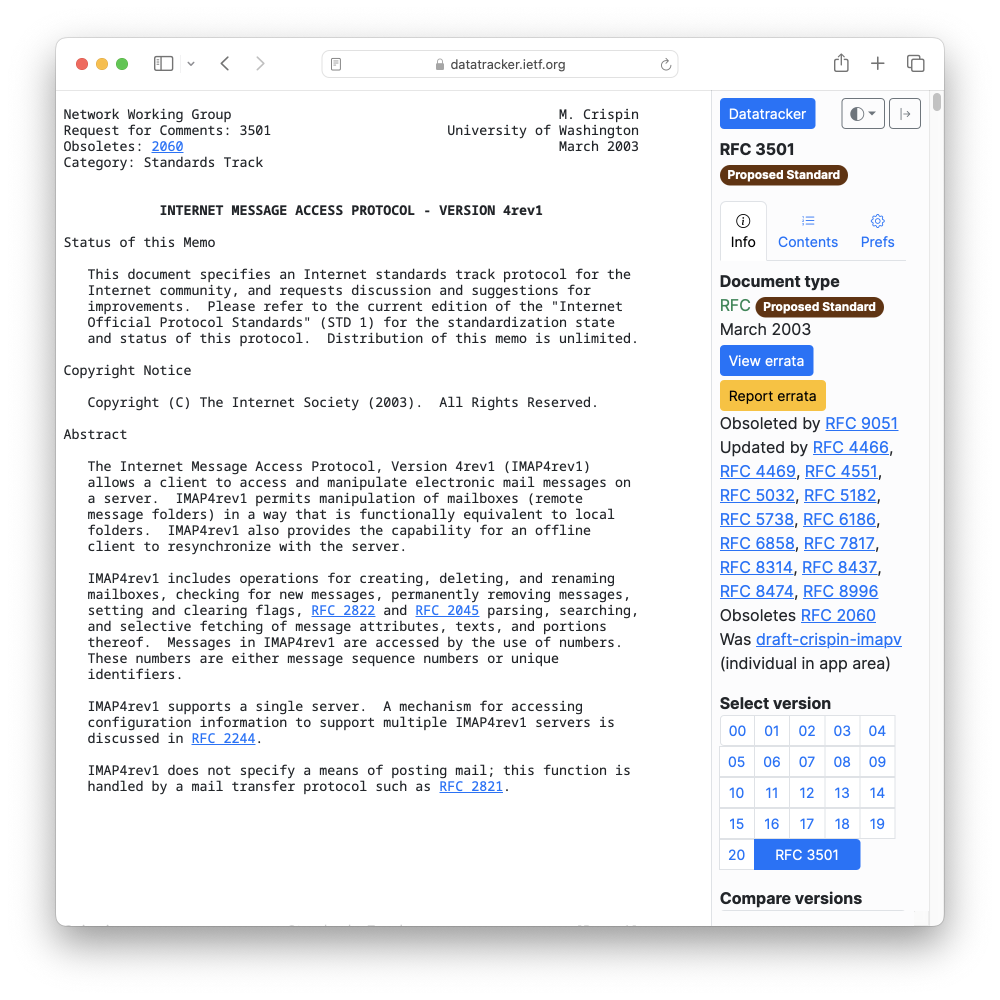

## DNS records related to email

<!-- _class: lead -->

More details for this section in the [course material][course]. You can find
other resources and alternatives as well.

### DNS records related to email

- `MX`: Mail eXchange - Specifies the mail server responsible for a domain name.
- `TXT`: Store any text-based information. Used for `SPF` records, for email
  authentication.

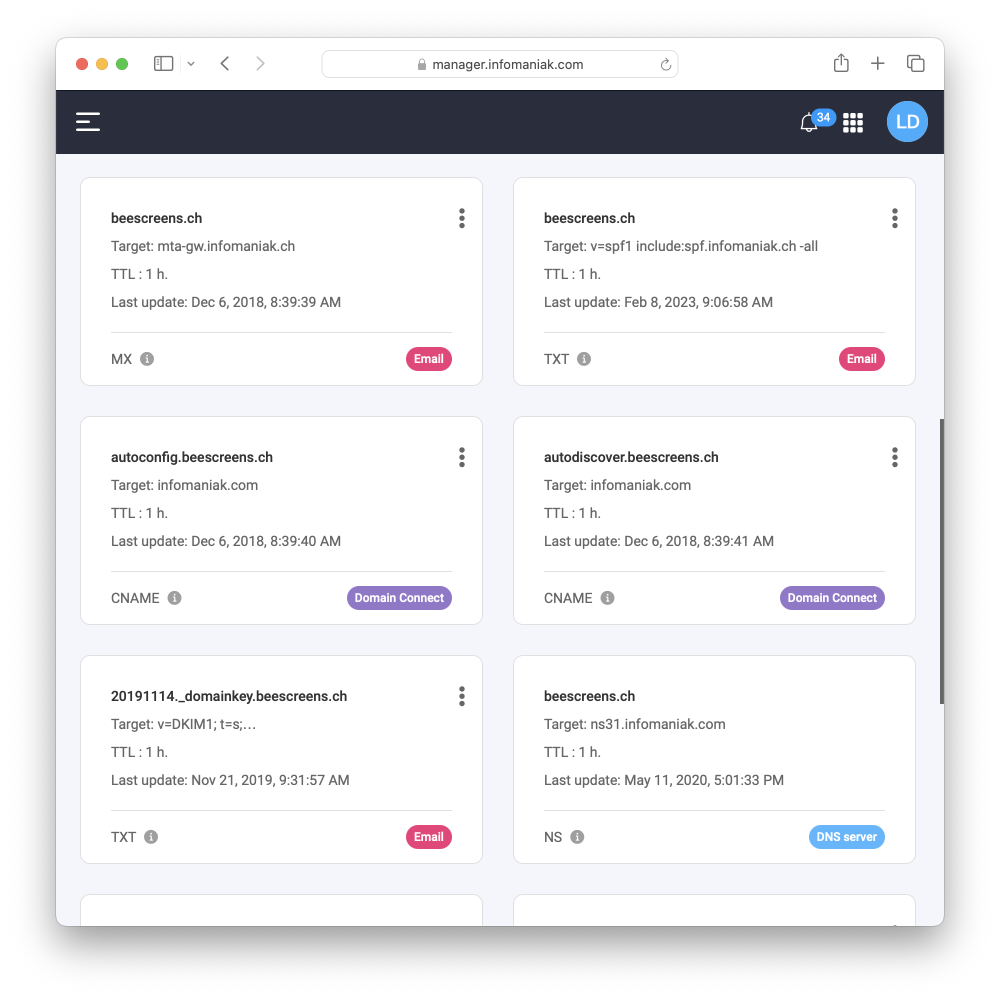

## Security concerns and spam

<!-- _class: lead -->

More details for this section in the [course material][course]. You can find
other resources and alternatives as well.

### Security concerns and spam

- SMTP is old and insecure.
- Easy to spoof and forge emails.
- Hard to maintain.
- ➡️ Your email server can be used for spam and can be blocked.
- ➡️ We will use a mock server to simulate an email server.

## A focus on the SMTP protocol

<!-- _class: lead -->

More details for this section in the [course material][course]. You can find
other resources and alternatives as well.

### A focus on the SMTP protocol

- SMTP is a text-based protocol.
- Messages are sent by the client to the server.
- The server responds with a status code.
- The client can send the next command.

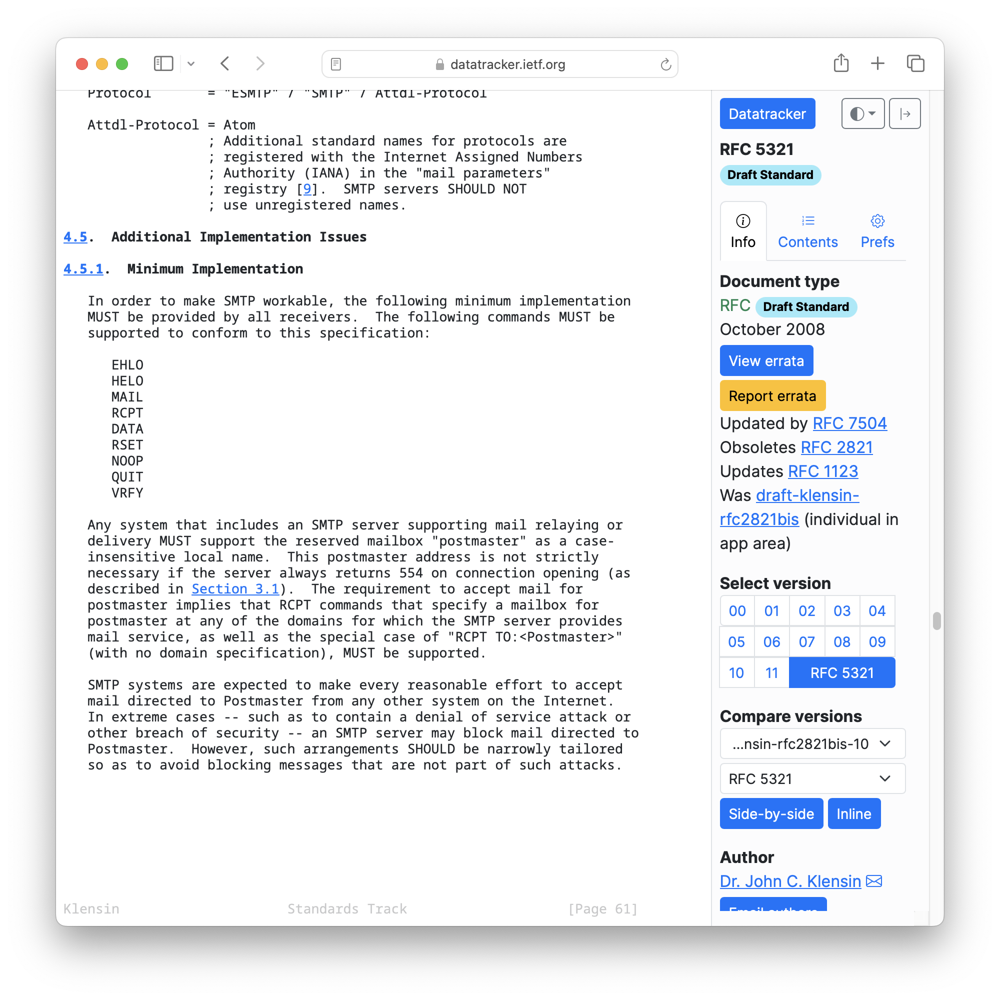

---

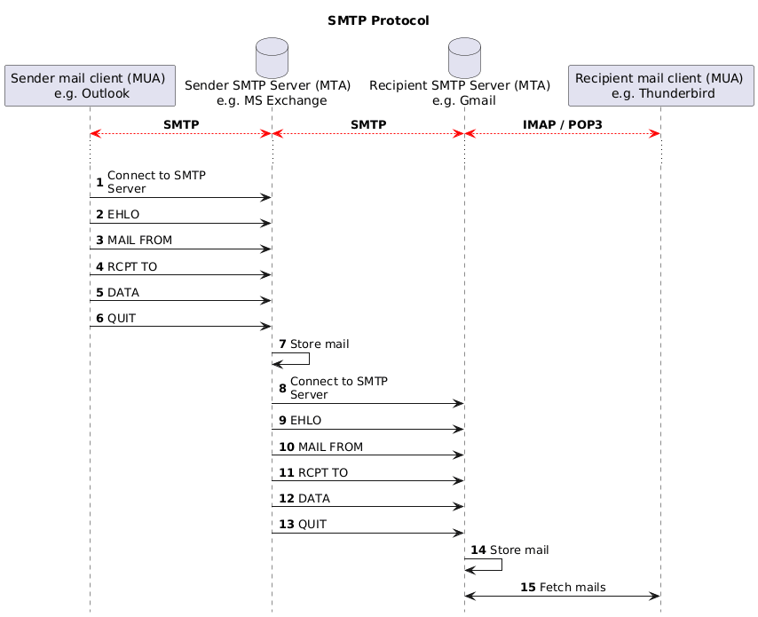

## ncat

<!-- _class: lead -->

More details for this section in the [course material][course]. You can find
other resources and alternatives as well.

### ncat

- ncat is network utility for reading from and writing to network connections.
- It is used to connect to a remote server (SMTP, HTTP, ...).
- We will use it to interact with a SMTP server.

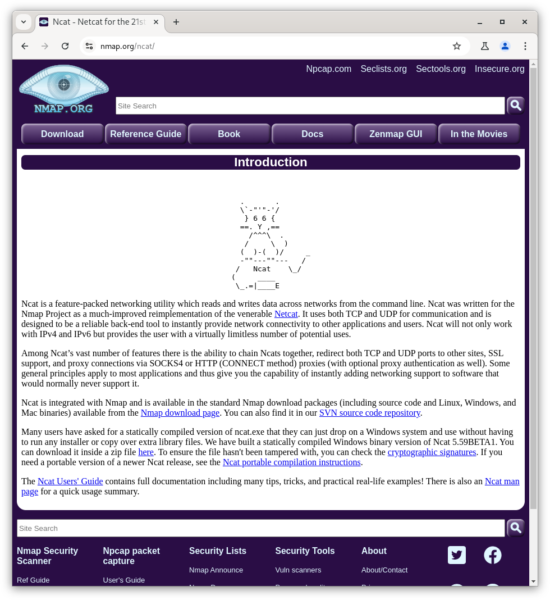

## Questions

<!-- _class: lead -->

Do you have any questions?

## Practical content

<!-- _class: lead -->

### What will you do?

- Install and configure ncat.
- Start a SMTP server with Docker Compose.
- Send an email with ncat to the SMTP server.
- Send an email with Java to the SMTP server.

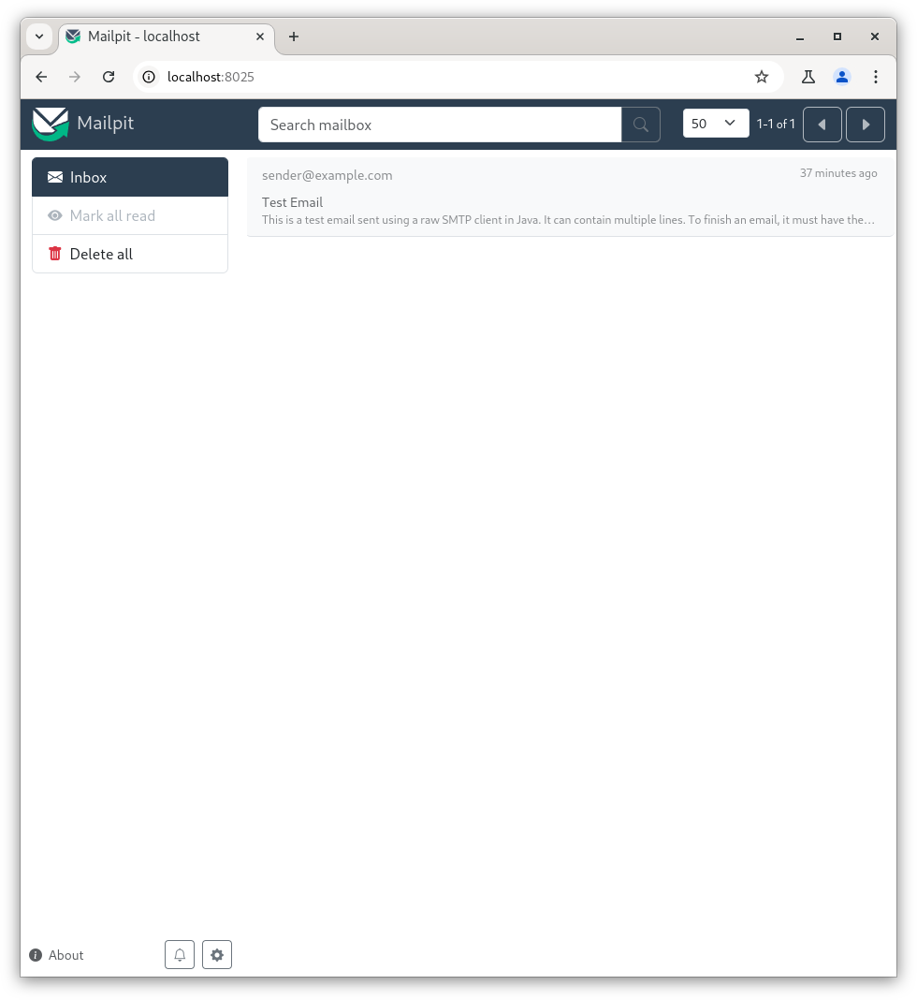

### Now it's your turn!

- Read the course material.
- Do the practical content.
- Ask questions if you have any.

➡️ [Find the course on GitHub][course].

**Do not hesitate to help each other! There's no need to rush!**

![bg right w:75%][course-qr-code]

## Finished? Was it easy? Was it hard?

Can you let us know what was easy and what was difficult for you during this
course?

This will help us to improve the course and adapt the content to your needs. If
we notice some difficulties, we will come back to you to help you.

➡️ [GitHub Discussions][discussions]

You can use reactions to express your opinion on a comment!

## Sources

- Main illustration by [Joanna Kosinska](https://unsplash.com/@joannakosinska)
  on [Unsplash](https://unsplash.com/photos/uGcDWKN91Fs)
- Illustration by [Aline de Nadai](https://unsplash.com/@alinedenadai) on
  [Unsplash](https://unsplash.com/photos/j6brni7fpvs)
- Illustration by [Nik](https://unsplash.com/@helloimnik) on
  [Unsplash](https://unsplash.com/photos/brown-eggs-on-white-textile-LUYD2b7MNrg)
- Illustration by [MChe Lee](https://unsplash.com/@mclee) on
  [Unsplash](https://unsplash.com/photos/PC91Jm1DlWA)

[course]:
	https://github.com/heig-vd-dai-course/heig-vd-dai-course/tree/main/05.03-smtp-and-ncat
[license]:
	https://github.com/heig-vd-dai-course/heig-vd-dai-course/blob/main/LICENSE.md
[discussions]: https://github.com/orgs/heig-vd-dai-course/discussions/114
[illustration]: ./images/main-illustration.jpg
[course-qr-code]:
	https://quickchart.io/qr?format=png&ecLevel=Q&size=400&margin=1&text=https://github.com/heig-vd-dai-course/heig-vd-dai-course/tree/main/05.03-smtp-and-ncat
