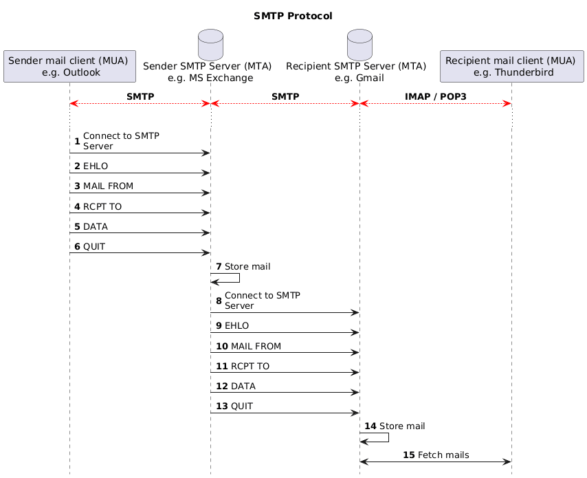

# SMTP and ncat


L. Delafontaine and H. Louis, with the help of
[GitHub Copilot](https://github.com/features/copilot).

Based on the original course by O. Liechti and J. Ehrensberger.

This work is licensed under the [CC BY-SA 4.0][license] license.

## Resources

- Objectives, teaching and learning methods, and evaluation methods:
  [Link to content](..)
- Course material: [Link to content](../01-course-material/README.md) ·
  [Presentation (web)](https://heig-vd-dai-course.github.io/heig-vd-dai-course/05.03-smtp-and-ncat/01-course-material/index.html)
  ·
  [Presentation (PDF)](https://heig-vd-dai-course.github.io/heig-vd-dai-course/05.03-smtp-and-ncat/01-course-material/05.03-smtp-and-ncat-presentation.pdf)
- Code examples: [Link to content](../02-code-examples/)

## Table of contents

- [Resources](#resources)
- [Table of contents](#table-of-contents)
- [Objectives](#objectives)
- [A quick reminder about networking](#a-quick-reminder-about-networking)
  - [The Internet Protocol (IP)](#the-internet-protocol-ip)
  - [The Domain Name System (DNS)](#the-domain-name-system-dns)
  - [Common DNS records](#common-dns-records)
  - [Reserved ports](#reserved-ports)
- [Electronic messaging protocols: SMTP, POP3 and IMAP](#electronic-messaging-protocols-smtp-pop3-and-imap)
  - [SMTP](#smtp)
  - [POP3](#pop3)
  - [IMAP](#imap)
- [DNS records related to email](#dns-records-related-to-email)
- [Security concerns and spam](#security-concerns-and-spam)
- [A focus on the SMTP protocol](#a-focus-on-the-smtp-protocol)
- [ncat](#ncat)
  - [Alternatives](#alternatives)
  - [Resources](#resources-1)
- [Practical content](#practical-content)
  - [Install and configure ncat](#install-and-configure-ncat)
  - [Start Mailpit](#start-mailpit)
  - [Send an email to Mailpit with ncat](#send-an-email-to-mailpit-with-ncat)
  - [Send an email to Mailpit with a Java SMTP client](#send-an-email-to-mailpit-with-a-java-smtp-client)
  - [Stop Mailpit](#stop-mailpit)
  - [Go further](#go-further)
- [Conclusion](#conclusion)
  - [What did you do and learn?](#what-did-you-do-and-learn)
  - [Test your knowledge](#test-your-knowledge)
- [Finished? Was it easy? Was it hard?](#finished-was-it-easy-was-it-hard)
- [Additional resources](#additional-resources)
- [Sources](#sources)

## Objectives

In this course, you will have a refresher on networking concepts.

Then, you will learn about the different electronic messaging protocols with a
focus on the SMTP protocol. You will also learn how to use the SMTP protocol to
send an email to an SMTP server using ncat and a Java client.

In short, by the end of this course, you should be able to:

- Refresher on networking concepts.
- Learn electronic messaging protocols:
  - SMTP.
  - POP3.
  - IMAP.
- Focus on the SMTP protocol.
- Learn how to use ncat and Java to send an email to an SMTP server.

## A quick reminder about networking

### The Internet Protocol (IP)

Each computer connected to the Internet has an
[IP (Internet Protocol) address](https://en.wikipedia.org/wiki/IP_address). This
IP address is used to identify the computer on the Internet. It is a unique
address. As [IPv4](https://en.wikipedia.org/wiki/Internet_Protocol_version_4)
addresses are limited, there are
[NAT (Network Address Translation)](https://en.wikipedia.org/wiki/Network_address_translation)
routers that allow to share a single IP address between multiple computers. This
is why [IPv6](https://en.wikipedia.org/wiki/IPv6) was created.

### The Domain Name System (DNS)

The [Domain Name System (DNS)](https://en.wikipedia.org/wiki/Domain_Name_System)
is a system that allows to map a domain name to an IP address. For example, the
domain name `heig-vd.ch` is mapped to the IP address `193.134.223.20`.

You can check this by running the following command with
[nslookup](https://en.wikipedia.org/wiki/Nslookup):

```sh
nslookup heig-vd.ch
```

The output should be similar to the following:

```text
Server:         8.8.8.8
Address:        8.8.8.8#53

Non-authoritative answer:
Name:   heig-vd.ch
Address: 193.134.223.20
```

Note the `Address` line. It is the IP mapping the DNS record.

The current DNS server used to resolve the DNS query is `8.8.8.8`.

When you browse the web, your browser will use the DNS to find the IP address of
the web server. Then, it will use the IP address to request the content of the
web page on the web server.

### Common DNS records

The DNS holds what are called DNS records. These records are used to map a
domain name to an IP address. There are many types of DNS records. The most
common ones are:

- `NS`: This record specifies the name servers for a given domain name.
- `CNAME`: This record specifies an alias for a given domain name.
- `A`: This record specifies the IP address of a given domain name (IPv4).
- `AAAA`: This record specifies the IP address of a given domain name (IPv6).

Some of these records will be used later in this teaching unit.

### Reserved ports

In computer networking, a port is a communication endpoint. At the software
level, within an operating system, a port is a logical construct that identifies
a specific process or a type of network service. Ports are identified for each
protocol and address combination by 16-bit unsigned numbers, commonly known as
the port number.

A possible analogy is this: an IP address is like a street address, and a port
is like an apartment number. The IP address identifies the computer, and the
port number identifies the specific process running on that computer.

Using 16-bit unsigned numbers, the maximum number of ports is 65536 (from 0 to
65535). However, not all ports can be used by anyone. Some ports are reserved
for specific protocols.

The first 0 to 1023 ports are called _"well-known ports"_. These ports are
reserved for specific protocols. Using these ports might require special
privileges on Unix systems.

Here is a list of examples for common well-known ports:

- `20` and `21`: FTP
- `22`: SSH
- `23`: Telnet
- `25`, `465` and `587`: SMTP
- `53`: DNS
- `80` and `443`: HTTP/HTTPS
- `110` and `995`: POP3
- `123`: NTP
- `143` and `993`: IMAP

The next 1024 to 49151 ports are called _"registered ports"_. Some ports are
officially registered by the IANA (Internet Assigned Numbers Authority) and some
are not. They can be used by anyone.

Here is a list of examples for common registered ports:

- `3306`: MySQL
- `5000–5500`: League of Legends
- `5432`: PostgreSQL
- `6379`: Redis
- `8080`: HTTP alternative port
- `25565`: Minecraft
- `27017`: MongoDB

The last 49152 to 65535 ports are called _"dynamic ports"_. They are usually
used for private, customized services, or for temporary purposes. These ports
cannot be registered and can be used by anyone.

Here is a list of examples for common dynamic ports:

- `51820`: WireGuard
- `64738`: Mumble

Wikipedia has a
[list of TCP and UDP port numbers](https://en.wikipedia.org/wiki/List_of_TCP_and_UDP_port_numbers)
that you can use to find the port number of a specific protocol.

## Electronic messaging protocols: SMTP, POP3 and IMAP

There are three main protocols used for electronic messaging:

- SMTP (Simple Mail Transfer Protocol).
- POP3 (Post Office Protocol).
- IMAP (Internet Message Access Protocol).

You could use any email clients (called _"Mail User Agents (MUA)"_) such as
Thunderbird, GMail or Outlook to use these protocols. They will send and receive
emails from an email server (called _"Mail Transfer Agent (MTA)"_).

### SMTP

SMTP is the protocol used to send emails. It is a simple text-based protocol
that uses TCP port 25, 465 or 587. The port 25 is used for unencrypted
connections, while the ports 465 and 587 are used for encrypted connections. The
port 587 is the newer and recommended port for encrypted connections.

It is used by email clients to send emails to an email server.

### POP3

POP3 is a protocol used to retrieve emails. It is a simple text-based protocol
that uses TCP port 110 or 995. The port 110 is used for unencrypted connections,
while the port 995 is used for encrypted connections.

It is used by email clients to retrieve emails from an email server.

### IMAP

IMAP is a protocol used to retrieve and synchronize emails. It is a more complex
protocol that uses TCP port 143 or 993. The port 143 is used for unencrypted
connections, while the port 993 is used for encrypted connections.

It is used by email clients to synchronize emails from and to an email server
between the email server and the email client. This means that if you read an
email on your email client, it will be marked as read on the email server, while
POP3 does not allow this.

## DNS records related to email

When you send an email, your email client will use the DNS to find the IP
address of the email server. Then, it will use the IP address to send the email
to the email server.

To find the IP address of the email server, your email client will look for the
following DNS records:

- `MX`: This record specifies the email server that will receive emails for a
  given domain name. For example, the `MX` record for `heig-vd.ch` is
  `heigvd-ch01b.mail.protection.outlook.com.`.
- `A`: This record specifies the IPv4 address of a given domain name. For
  example, the `A` record for `heig-vd.ch` is `193.134.223.20`.
- `TXT`: The `SPF` record, as stated by CloudFlare
  (<https://www.cloudflare.com/en-gb/learning/dns/dns-records/dns-spf-record>),
  _"[] are a type of DNS TXT record commonly used for email authentication. SPF
  records include a list of IP addresses and domains authorized to send emails
  from that domain."_. For example, one of the `TXT` record contains these
  information for `heig-vd.ch`.

You can check these records by running the following command with
[dig](<https://en.wikipedia.org/wiki/Dig_(command)>):

```sh
dig heig-vd.ch any
```

The `any` option allows to display all DNS records for the given domain name. By
default, dig will only display the `A` records.

The output should be similar to the following:

```text

; <<>> DiG 9.10.6 <<>> heig-vd.ch any
;; global options: +cmd
;; Got answer:
;; ->>HEADER<<- opcode: QUERY, status: NOERROR, id: 57402
;; flags: qr rd ra; QUERY: 1, ANSWER: 17, AUTHORITY: 0, ADDITIONAL: 1

;; OPT PSEUDOSECTION:
; EDNS: version: 0, flags:; udp: 512
;; QUESTION SECTION:
;heig-vd.ch.                    IN      ANY

;; ANSWER SECTION:
heig-vd.ch.             300     IN      A       193.134.223.20
heig-vd.ch.             3600    IN      NS      ns-1308.awsdns-35.org.
heig-vd.ch.             3600    IN      NS      ns-2025.awsdns-61.co.uk.
heig-vd.ch.             3600    IN      NS      ns-459.awsdns-57.com.
heig-vd.ch.             3600    IN      NS      ns-811.awsdns-37.net.
heig-vd.ch.             3600    IN      NS      ns01.heig-vd.ch.
heig-vd.ch.             3600    IN      NS      ns02.heig-vd.ch.
heig-vd.ch.             3600    IN      SOA     ns01.heig-vd.ch. noc.heig-vd.ch. 2022060836 3600 600 1209600 3600
heig-vd.ch.             300     IN      MX      0 heigvd-ch01b.mail.protection.outlook.com.
heig-vd.ch.             21600   IN      TXT     "MS=ms50694826"
heig-vd.ch.             21600   IN      TXT     "_globalsign-domain-verification=KwkbjUch-6S14SrWPzp272TN8uENyWwrdQZsoQTI_J"
heig-vd.ch.             21600   IN      TXT     "adobe-idp-site-verification=38a35c2c3cc6e86da35b8375404692f367713de605009c52e448eb39368c1203"
heig-vd.ch.             21600   IN      TXT     "atlassian-domain-verification=gKTmd7bpHiB/2YT6iD6xu8e4EcLbgvoWjCKrKp1lGX2LeLNPWgQti2nsPGn6i3BS"
heig-vd.ch.             21600   IN      TXT     "atlassian-sending-domain-verification=dad47472-4668-4676-b0ec-1421cff8a150"
heig-vd.ch.             21600   IN      TXT     "msyx415nv8c4jm0ytjr5kyklfcs0df21"
heig-vd.ch.             21600   IN      TXT     "swisssign-check=uC1XddBVk6xjFFVza2UjLeEyODs5l1ELm8tk1KY2Nb"
heig-vd.ch.             21600   IN      TXT     "v=spf1 ip4:193.134.218.124 ip4:145.232.233.54 ip4:27.126.146.0/24 ip4:103.28.42.0/24 ip4:146.88.28.0/24 ip4:163.47.180.0/22 ip4:203.55.21.0/24 ip4:204.75.142.0/24 " "ip4:185.144.39.35/32 ip4:185.144.39.39/32  include:spf.hefr.ch include:aspmx.pardot.com include:_spf.fullfabric.com include:alumnforce.org include:spf.protection.outlook.com -all"

;; Query time: 79 msec
;; SERVER: 8.8.8.8#53(8.8.8.8)
;; WHEN: Tue Oct 17 10:50:46 CEST 2023
;; MSG SIZE  rcvd: 1209
```

The output is more verbose than with `nslookup`, but it contains the same
information.

Note the `ANSWER SECTION` line. The `A` record the IP mapping the DNS record.
The `MX` record is the email server that will receive emails for the given
domain name. One of the `TXT` contains the `SPF` records with `v=spf1 [...]`.

## Security concerns and spam

The email protocols are quite old and were not designed with security in mind in
the first place.

If we look at the SMTP protocol, we can see that:

- SMTP does not require authentication.
- SMTP does not require encryption.
- SMTP does not require the sender address to be valid.
- SMTP does not require the sender address to be the same as the email address
  used to authenticate.
- And many other issues.

Because of this, SMTP is often used by spammers to send spam emails. To prevent
this, there are many denylists that contain IP addresses of known spammers. If
an email server is on a denylist, it will not be able to send emails to some
email servers.

Maintaining email servers is a complex task that requires a lot of knowledge
about the protocols and the security issues. This is why many companies use
third-party email services such as Google or Microsoft 365.

> [!CAUTION]
>
> Considering these security flaws, please be aware that spoofing an email
> address is really not that hard. However, the HEIG-VD has a strict policy
> regarding the use of its email addresses.
>
> If you are caught spoofing an email address, you could get in trouble. Please
> use the Mailpit SMTP server for your tests to avoid any issues.

In this course, we will use what is called a mock server. A mock server imitates
the functionalities of a real server for testing purposes. In this case, we will
use a simple SMTP server with a web interface to send and check emails.

A really simple SMTP server called Mailpit can be used and run with Docker for
exactly this purpose: <https://github.com/axllent/mailpit>.

## A focus on the SMTP protocol

The SMTP protocol is described in
[RFC 5321](https://datatracker.ietf.org/doc/html/rfc5321).

It uses the TCP protocol on port 25, 465 or 587. It is a text-based protocol
with the following commands (among others):

- `HELO` or `EHLO`: Used to identify the sender
- `MAIL FROM`: Used to specify the sender email address
- `RCPT TO`: Used to specify the recipient email address
- `DATA`: Used to specify the email content
- `QUIT`: Used to close the connection

To send an email, you will need to use the following commands:

```text
EHLO <sender>
MAIL FROM: <sender email address>
RCPT TO: <recipient email address>
DATA
<email content>
.
QUIT
```

The following diagram shows the sequence of commands to send an email:



## ncat

[ncat](https://nmap.org/ncat/) is a client/server network utility that can read
and write data across network connections using the TCP or UDP protocols.

ncat can be used to connect to many services such as HTTP, SMTP, POP3, IMAP,
etc.

In this course, we will use ncat to connect to an SMTP server and send an email.

ncat can be used to test services such as SMTP and/or to configure network
devices such as routers that you might have to configure during your career.
This is why we will use it in this course for local testing.

### Alternatives

_Alternatives are here for general knowledge. No need to learn them._

- Netcat
- Telnet

_Missing item in the list? Feel free to open a pull request to add it! ✨_

### Resources

_Resources are here to help you. They are not mandatory to read._

- _None for now_

_Missing item in the list? Feel free to open a pull request to add it! ✨_

## Practical content

### Install and configure ncat

In this section, you will install and configure ncat on your operating system.

#### Install ncat

ncat is a widely used network utility that is available on most operating
systems.

Install ncat using the package manager of your operating system:

> [!NOTE]
>
> Remember: if you use WSL, you need to install ncat in your WSL distribution.
> You can use any Linux distribution you want. The commands below are for
> Ubuntu. If you use another distribution, please adapt the commands
> accordingly.

```sh
# Install ncat on Ubuntu
sudo apt install ncat
```

#### Check the installation

You can check the installation by running the following command:

```sh
# Check the installation
ncat --version
```

The output should be similar to the following:

```text
Ncat: Version 7.94SVN ( https://nmap.org/ncat )
```

### Start Mailpit

In this section, you will start Mailpit using Docker Compose.

#### Clone or fetch latest changes from the main repository to get the code examples

Clone or fetch latest changes from the
[`heig-vd-dai-course/heig-vd-dai-course`](https://github.com/heig-vd-dai-course/heig-vd-dai-course)
repository to get the code examples:

```sh
# Clone the repository if you have not done it yet
git clone git@github.com:heig-vd-dai-course/heig-vd-dai-course.git
```

or fetch latest changes if you have already cloned it:

```sh
# Navigate to the cloned repository
cd heig-vd-dai-course

# Checkout to the main branch
git checkout main

# Pull latest changes
git pull
```

#### Open the repository in your IDE

Open the `heig-vd-dai-course` repository in your favorite IDE.

#### Access the code examples in your terminal

Open a terminal and navigate to the
`heig-vd-dai-course/05.03-smtp-and-ncat/02-code-examples` directory.

#### Start Mailpit with Docker Compose

Explore the directory containing the Mailpit example with Docker Compose.

Take some time to read the `compose.yaml` file. It contains the configuration to
start Mailpit with Docker Compose.

Run the following command to start Mailpit:

```sh
# Start Mailpit in background
docker compose up -d
```

The output should be similar to the following:

```text
[+] Running 4/4
 ✔ mailpit Pulled                                  5.4s
   ✔ 43c4264eed91 Already exists                   0.0s
   ✔ acf8b88d34d5 Pull complete                    2.4s
   ✔ 345ad78f8587 Pull complete                    2.5s
[+] Running 2/2
 ✔ Network 15-smtp-and-ncat_default      Created   0.2s
 ✔ Container 15-smtp-and-ncat-mailpit-1  Started   0.4s
```

This will start the Mailpit SMTP server and the Mailpit web interface.

Display and follow the logs of the container with the following command:

```sh
docker compose logs -f
```

The `-f` option allows to follow the logs. To stop following the logs, you can
press `Ctrl` + `C`.

The output should be similar to the following:

```text
mailpit-1  | time="2024/10/26 08:49:01" level=info msg="[smtpd] starting on [::]:1025 (no encryption)"
mailpit-1  | time="2024/10/26 08:49:01" level=info msg="[http] starting on [::]:8025"
mailpit-1  | time="2024/10/26 08:49:01" level=info msg="[http] accessible via http://localhost:8025/"
```

You can access the Mailpit web interface at <http://localhost:8025>.

### Send an email to Mailpit with ncat

In this section, you will send an email with ncat to the Mailpit SMTP server.

#### Connect to the SMTP server

Now that Mailpit is running, you can send an email with ncat.

Open a new terminal and run the following command:

```sh
ncat -C localhost 1025
```

The `-C` option allows to use the CRLF line endings. This is required by the
SMTP protocol.

The output should be similar to the following:

```text
220 f3a8189f0ff4 Mailpit ESMTP Service ready
```

This means that you are connected to the Mailpit SMTP server.

#### Send an email

In the ncat session, run the following commands. Each command should return you
a status code. Feel free to change the content of the email (you must keep the
`<>` characters):

Say hello to the SMTP server:

```text
EHLO the-smtp-domain-name.tld
```

Tell the SMTP server who you are:

```text
MAIL FROM: <your-email@gmail.com>
```

Tell the SMTP server who the recipient is:

```text
RCPT TO: <recipient@example.com>
```

Start the email content:

```text
DATA
```

Set the email headers

```text
Subject: Your Subject
```

```text
From: Your Name <your-email@gmail.com>
```

```text
To: Recipient Name <recipient@example.com>
```

```text
Content-Type: text/plain; charset="utf-8"
```

An empty line is required between the headers and the content:

```text

```

Set the email content:

```text
Your email content goes here.

It can be multiple lines.

A line with a dot (.) by itself indicates the end of the email content.
```

```text
.
```

The SMTP protocol relies on the `MAIL FROM:` and `RCPT TO:` commands to specify
the sender and recipient email addresses. As SMTP does not require
authentication, you can specify any email address you want. SMTP will then
accept the email and send it to the recipient email server, regardless of the
sender email address. This demonstrates the security issues related to SMTP and
why it is often used by spammers and mail spoofers to social engineer people as
the email will be sent from a trusted domain.

In order to spoof an email address, you need to have access to an SMTP server
and send the email from this SMTP server that you share in your network.

The `From:` and `To:` are used by the email client to display the sender and
recipient names. They are not related to the SMTP protocol. They are part of the
email content and helps to display the email content in a human-readable way.

The `.`, on a line by itself, indicates the end of the email content.

The output should be similar to this:

```text
250 2.0.0 Ok: queued as YXmrXP7s4GwckUDLoqVSnk
```

The mail has been sent to the Mailpit SMTP server. You can check it in the
Mailpit web interface at <http://localhost:8025>.

Congratulations! You have sent your first email with ncat!

As you can see, the commands used to prepare and send the email are quite
simple. However, the email content is not. This is why we use email clients
instead of ncat to send emails.

These commands follow the SMTP protocol. In the next course, you will learn more
about application protocols and how to use them.

To quit the SMTP session, run the following command:

```text
QUIT
```

The output should be similar to the following:

```text
221 2.0.0 f3a8189f0ff4 Mailpit ESMTP Service closing transmission channel
```

To exit ncat, press `Ctrl` + `C`.

### Send an email to Mailpit with a Java SMTP client

In this section, you will send an email with Java to the Mailpit SMTP server.

#### Explore the Java client

Take some time to explore the Java client located in the
`SmtpClientExample.java` file. It is a simple Java client that sends an email to
the Mailpit SMTP server.

The Java client uses the `java.net.Socket` class to connect to the Mailpit SMTP
server and send an email.

What can you say about the code? Do you understand how it works? How does it
compare to the ncat commands and the Java IOs we studied in previous courses?

#### Run the Java client

Compile the Java client:

```sh
# Compile the Java client
javac SmtpClientExample.java
```

Run the Java client:

```sh
# Run the Java client
java SmtpClientExample
```

#### Check the email

The email should be sent to the Mailpit SMTP server. You can check it in the
Mailpit web interface at <http://localhost:8025>.

Using the Java Socket IO, you have sent an email to the Mailpit SMTP server,
congratulations!

### Stop Mailpit

To stop Mailpit, run the following command:

```sh
# Stop Mailpit
docker compose down
```

This will stop and remove the Mailpit container.

### Go further

This is an optional section. Feel free to skip it if you do not have time.

- Are you able to send an email with a CC recipient?
- Are you able to send an email with a BCC recipient?
- Are you able to send an email with HTML content?
- Are you able to send an email with an attachment?

## Conclusion

### What did you do and learn?

In this course, you have had a refresh about networking with IP adresses and DNS
records. You have also learned about the SMTP protocol and how to use ncat to
send an email to an SMTP server.

Based on the official RFC, you have learned that SMTP is a simple text-based
protocol to send emails with rather simple commands.

With the help of Mailpit and Docker, you have now a way to test your emails with
a fake SMTP server (called a _"mock server"_) for all your other applications!

### Test your knowledge

At this point, you should be able to answer the following questions:

- What are the difference between SMTP, POP3 and IMAP?
- What are the DNS records related to email?
- What are the security concerns related to email?
- What is ncat?
- What are the SMTP commands to send an email?
- What is the difference between the SMTP commands and the email content?

## Finished? Was it easy? Was it hard?

Can you let us know what was easy and what was difficult for you during this
course?

This will help us to improve the course and adapt the content to your needs. If
we notice some difficulties, we will come back to you to help you.

> [!NOTE]
>
> Vous pouvez évidemment poser toutes vos questions et/ou vos propositions
> d'améliorations en français ou en anglais.
>
> N'hésitez pas à nous dire si vous avez des difficultés à comprendre un concept
> ou si vous avez des difficultés à réaliser les éléments demandés dans le
> cours. Nous sommes là pour vous aider !

➡️ [GitHub Discussions][discussions]

You can use reactions to express your opinion on a comment!

## Additional resources

_Resources are here to help you. They are not mandatory to read._

- _None yet_

_Missing item in the list? Feel free to open a pull request to add it! ✨_

## Sources

- Main illustration by [Joanna Kosinska](https://unsplash.com/@joannakosinska)
  on [Unsplash](https://unsplash.com/photos/uGcDWKN91Fs)

[license]:
	https://github.com/heig-vd-dai-course/heig-vd-dai-course/blob/main/LICENSE.md
[discussions]: https://github.com/orgs/heig-vd-dai-course/discussions/114
