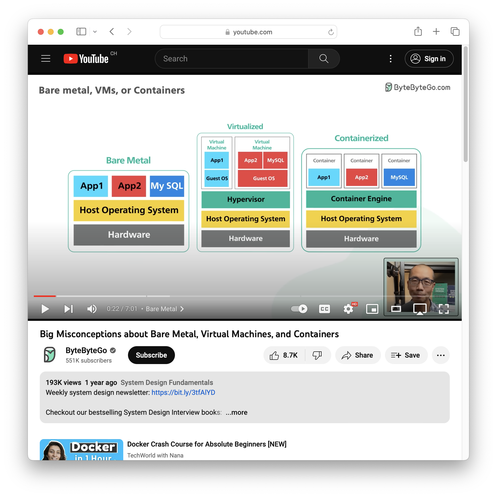
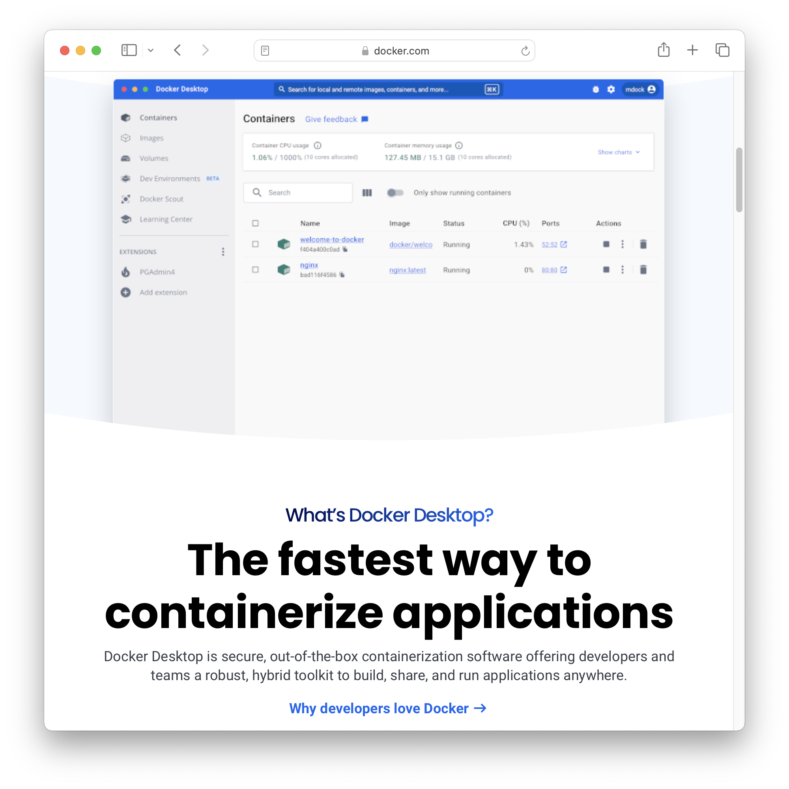
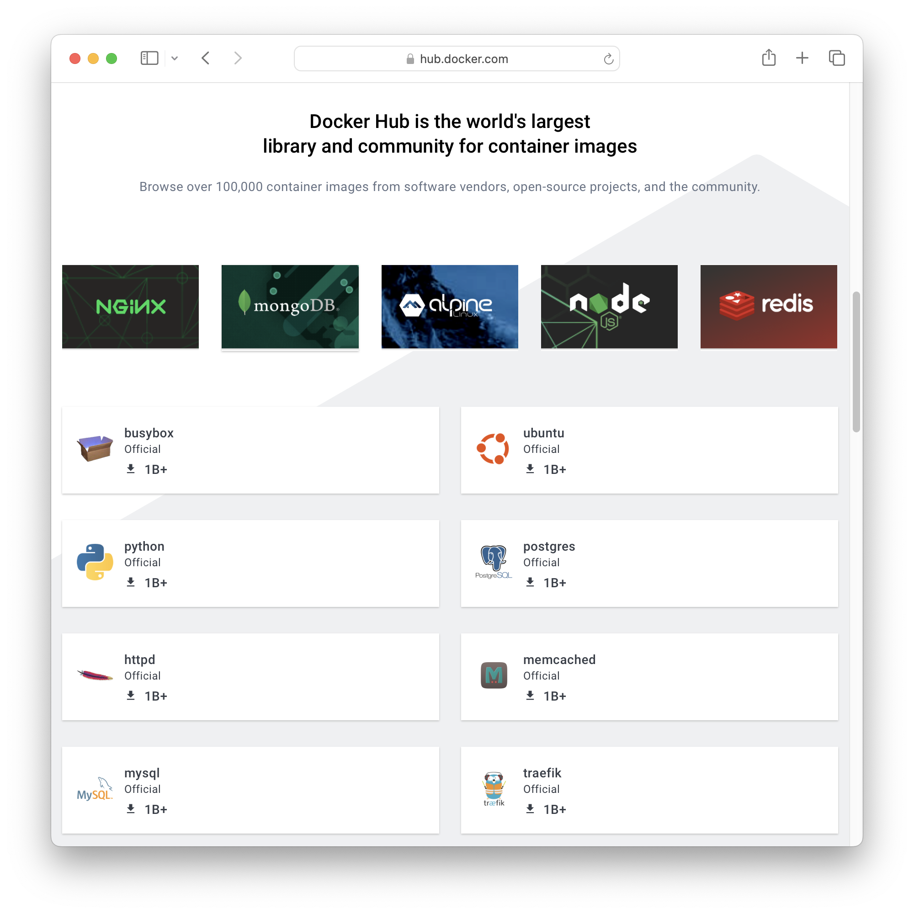
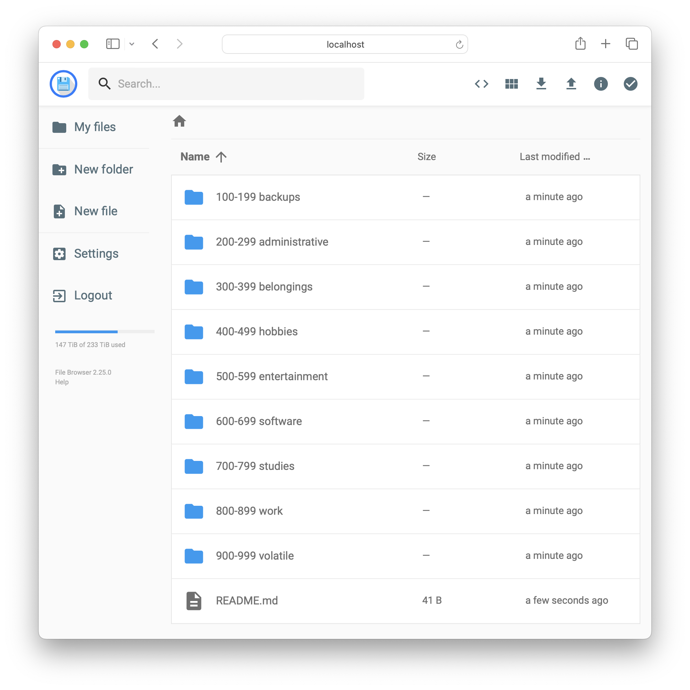

<!--
theme: gaia
size: 16:9
paginate: true
author: L. Delafontaine and H. Louis, with the help of GitHub Copilot
title: HEIG-VD DAI Course - Docker and Docker Compose
description: Docker and Docker Compose for the DAI course at HEIG-VD, Switzerland
url: https://heig-vd-dai-course.github.io/heig-vd-dai-course/06-docker-and-docker-compose/
footer: '**HEIG-VD** - DAI Course 2023-2024 - CC BY-SA 4.0'
style: |
    :root {
        --color-background: #fff;
        --color-foreground: #333;
        --color-highlight: #f96;
        --color-dimmed: #888;
        --color-headings: #7d8ca3;
    }
    blockquote {
        font-style: italic;
    }
    table {
        width: 100%;
    }
    th:first-child {
        width: 15%;
    }
    h1, h2, h3, h4, h5, h6 {
        color: var(--color-headings);
    }
    h2, h3, h4, h5, h6 {
        font-size: 1.5rem;
    }
    h1 a:link, h2 a:link, h3 a:link, h4 a:link, h5 a:link, h6 a:link {
        text-decoration: none;
    }
    section:not([class=lead]) > p, blockquote {
        text-align: justify;
    }
headingDivider: 4
-->

[web]:
  https://heig-vd-dai-course.github.io/heig-vd-dai-course/06-docker-and-docker-compose/
[pdf]:
  https://heig-vd-dai-course.github.io/heig-vd-dai-course/06-docker-and-docker-compose/06-docker-and-docker-compose-presentation.pdf
[license]:
  https://github.com/heig-vd-dai-course/heig-vd-dai-course/blob/main/LICENSE.md
[discussions]: https://github.com/orgs/heig-vd-dai-course/discussions/113
[illustration]:
  https://images.unsplash.com/photo-1511578194003-00c80e42dc9b?fit=crop&h=720
[course-material]:
  https://github.com/heig-vd-dai-course/heig-vd-dai-course/blob/main/06-docker-and-docker-compose/COURSE_MATERIAL.md
[course-material-qr-code]:
  https://quickchart.io/qr?format=png&ecLevel=Q&size=400&margin=1&text=https://github.com/heig-vd-dai-course/heig-vd-dai-course/blob/main/06-docker-and-docker-compose/COURSE_MATERIAL.md

# Docker and Docker Compose

<!--
_class: lead
_paginate: false
-->

<https://github.com/heig-vd-dai-course>

[Web][web] · [PDF][pdf]

<small>L. Delafontaine and H. Louis, with the help of GitHub Copilot.</small>

<small>This work is licensed under the [CC BY-SA 4.0][license] license.</small>

![bg opacity:0.1][illustration]

## Objectives

Learn software installation challenges and containerization benefits.

- Traditional software installation vs. containerization
- Learn what an OCI images and containers are
- Install & run software with Docker
- Long, yet (very) useful chapter


## Issues with software installation

<!-- _class: lead -->

More details for this section in the
[course material](https://github.com/heig-vd-dai-course/heig-vd-dai-course/blob/main/06-docker-and-docker-compose/COURSE_MATERIAL.md#issues-with-software-installation).
You can find other resources and alternatives as well.

### The problem

- Installing a software is easy
- However, maintenance is hard:
  - What to do when a new version is available?
  - How to keep track of configuration changes?
  - How to migrate to a new server?


### A solution

- A solution can be containerization
- Containerization allows to:
  - Package software with its dependencies
  - Run software in an isolated environment
  - Share software with others


### An example

- You work as a database administrator
- You have to maintain multiple database servers
- Some projects use MySQL 5.7, others MySQL 8.0
- You must install and maintain multiple versions of MySQL
- Versions can be incompatible with each other
- You must keep track of configuration changes
- Migration to a new server is hard as you have to reinstall each time
- Your life is miserable and depressing... How to solve this?

---

- Just install a container engine (e.g. Docker) on each server
- Find official images for MySQL 5.7 and MySQL 8.0 on the registry
- Start these images as containers - one for each version
- Want to try a new version? Just start a new container!
- Each container is isolated from the others so no more conflicts
- Each container has its own configuration that is easy to track
- Migration is easier: move the data and start the containers!

Containerization has its own challenges but it can help to solve some issues you
may have with software installation and maintenance.

## Bare metal, virtualization and containerization

<!-- _class: lead -->

More details for this section in the
[course material](https://github.com/heig-vd-dai-course/heig-vd-dai-course/blob/main/06-docker-and-docker-compose/COURSE_MATERIAL.md#bare-metal-virtualization-and-containerization).
You can find other resources and alternatives as well.

### Bare metal, virtualization and containerization

- Bare metal: software runs directly on hardware
- Virtualization: software runs on a virtual machine
- Containerization: software runs in a container



### Bare metal

- The traditional way to run software
- Software runs directly on hardware
- Software has full access to the hardware
- Security issues, hard to maintain, hard to migrate


### Virtualization

- Virtualization runs virtual machines
- A virtual machine is complete operating system
- A virtual machine is isolated from the host
- Virtual machines are heavy and use a lot of resources


### Containerization

- Containerization starts containers
- Containers contain all the dependencies to run the software
- Containers are isolated from each other
- Containers are lightweight and use the host kernel


---

<!-- _class: lead -->

A good resource to better understand the differences between bare metal,
virtualization and containerization is the following video:

[_"Big Misconceptions about Bare Metal, Virtual Machines, and Containers"_ by ByteByteGo](https://www.youtube.com/watch?v=Jz8Gs4UHTO8)

## OCI, images, containers, and registries

<!-- _class: lead -->

More details for this section in the
[course material](https://github.com/heig-vd-dai-course/heig-vd-dai-course/blob/main/06-docker-and-docker-compose/COURSE_MATERIAL.md#oci-images-containers-and-registries).
You can find other resources and alternatives as well.

### OCI, images, containers, and registries

- Container: runnable instance of an image
- Image: read-only template for container creation
- Registry: service storing images


## Docker

<!-- _class: lead -->

More details for this section in the
[course material](https://github.com/heig-vd-dai-course/heig-vd-dai-course/blob/main/06-docker-and-docker-compose/COURSE_MATERIAL.md#docker).
You can find other resources and alternatives as well.

### Docker

- Created in 2013
- Container engine
- Composed of two parts:
  - Docker daemon (background process)
  - Docker CLI
- Can be used to build, run and publish containers


### Dockerfile specification

- Build a Docker image
- Based on an existing image
- Defines a set of instructions to build the image
- Written in plain text
- Each step creates a layer in the image (takes disk space)


### Security considerations

- Docker daemon runs as root (= as an admin user), meaning:
  - It has access to the host filesystem
  - It has access to the host network
- The containers have limited access but you still need to be careful
- It is good practice to run containers as non-root users


### Ignore files

- Same as the `.gitignore` file
- Named `.dockerignore`
- Can be used to exclude files from the build context

```dockerignore
# Ignore target directory
/target

# Ignore all files with .md extension
*.md
```


### Summary

- Docker is a container engine composed of two parts: the Docker daemon and the
  Docker CLI
- The Docker CLI is used to manage containers and images
- The Dockerfile specification defines a standard for building Docker images
- A Dockerfile is used to build a Docker image
- A Docker image is used to create a container
- A container is a runnable, isolated, instance of an image

## Docker Compose

<!-- _class: lead -->

More details for this section in the
[course material](https://github.com/heig-vd-dai-course/heig-vd-dai-course/blob/main/06-docker-and-docker-compose/COURSE_MATERIAL.md#docker).
You can find other resources and alternatives as well.

### Docker Compose

- Can be used to deploy a multi-container application
- Can be committed with the application
- Can be used to deploy the application on any Docker host
- Easy to use


### Docker Compose specification

- Defines the application
  - Services: containers
  - Volumes: shared directories
  - Networks: network communication
- Written in YAML


### Docker Compose v1 vs. Docker Compose v2

- Docker Compose v1 written in Python (`docker-compose`)
- Docker Compose v2 written in Go (`docker compose`)
- Docker Compose v1 is deprecated


### Summary

- Docker Compose allows to define a multi-container Docker application in a
  Docker Compose file
- A Docker Compose file can consist of a set of services, volumes and networks
- A Docker Compose file (`docker-compose.yml`) can be easily shared and
  versioned with the application
- Docker Compose v2 is the recommended version to use

## Docker Desktop

<!-- _class: lead -->

More details for this section in the
[course material](https://github.com/heig-vd-dai-course/heig-vd-dai-course/blob/main/06-docker-and-docker-compose/COURSE_MATERIAL.md#docker).
You can find other resources and alternatives as well.

### Docker Desktop

- A tool for macOS and Windows
- Runs a Linux virtual machine to run Docker
- Allows to run Docker and Docker Compose commands



## Docker Hub and GitHub Container Registry

<!-- _class: lead -->

More details for this section in the
[course material](https://github.com/heig-vd-dai-course/heig-vd-dai-course/blob/main/06-docker-and-docker-compose/COURSE_MATERIAL.md#docker).
You can find other resources and alternatives as well.

### Docker Hub and GitHub Container Registry

- Docker Hub is the official registry, hosting millions of images
- We will use GitHub Container Registry to keep everything in one place



### Tips and tricks

Some tips and tricks are described in the course material (not mandatory to
read):

- Healthchecks
- Free some space
- Multi-stage builds
- Multi-architecture builds


## Practical content

<!-- _class: lead -->

### What will you do?

- Install and configure Docker
- Install and configure Docker Compose
- Build, run and publish a container with Docker and Docker Compose
- Containerize a simple web application



### Find the practical content

<!-- _class: lead -->

You can find the practical content for this chapter on
[GitHub][course-material].

[![bg right w:75%][course-material-qr-code]][course-material]

## Finished? Was it easy? Was it hard?

Can you let us know what was easy and what was difficult for you during this
chapter?

This will help us to improve the course and adapt the content to your needs. If
we notice some difficulties, we will come back to you to help you.

➡️ [GitHub Discussions][discussions]

You can use reactions to express your opinion on a comment!

## What will you do next?

In the next chapter, you will learn the following topics:

- Experiment with the SMTP protocol and Telnet with Docker and Docker Compose
  - How to send emails with SMTP? How is structured an email?
  - Run a SMTP server with Docker and send an email with Telnet


## Sources

- Main illustration by [CHUTTERSNAP](https://unsplash.com/@chuttersnap) on
  [Unsplash](https://unsplash.com/photos/xewrfLD8emE)
- Illustration by [Rafif Prawira](https://unsplash.com/@rafifatmaka) on
  [Unsplash](https://unsplash.com/photos/aerial-photo-of-maze-race-SgTLuX6t8Yo)
- Illustration by [Taylor Vick](https://unsplash.com/@tvick) on
  [Unsplash](https://unsplash.com/photos/cable-network-M5tzZtFCOfs)
- Illustration by [Aline de Nadai](https://unsplash.com/@alinedenadai) on
  [Unsplash](https://unsplash.com/photos/j6brni7fpvs)
- Illustration by [Scott Webb](https://unsplash.com/@scottwebb) on
  [Unsplash](https://unsplash.com/photos/yekGLpc3vro)
- Illustration by [Joanna Kosinska](https://unsplash.com/@joannakosinska) on
  [Unsplash](https://unsplash.com/photos/uGcDWKN91Fs)
