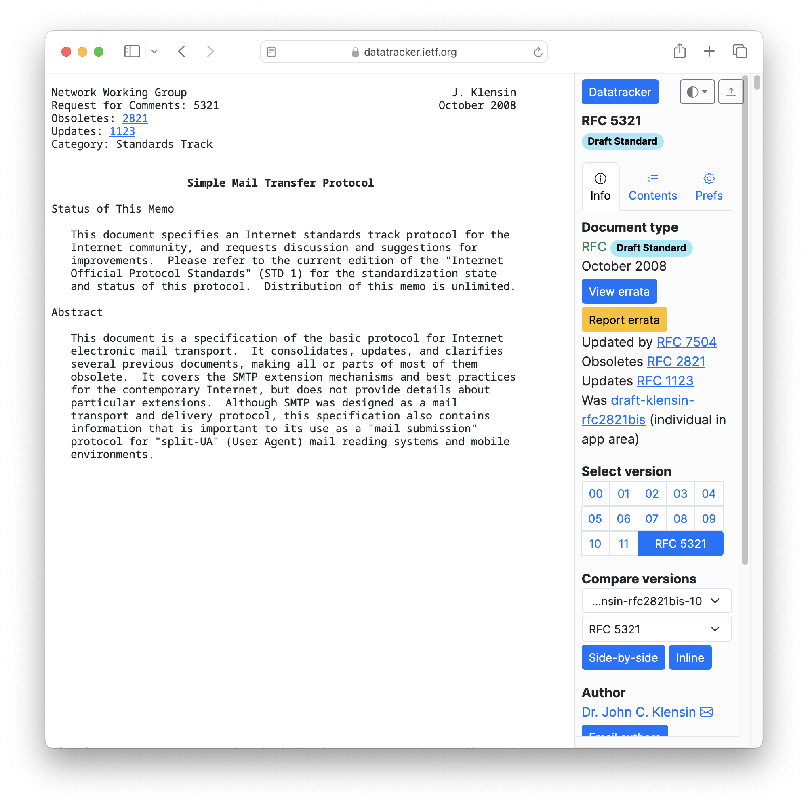
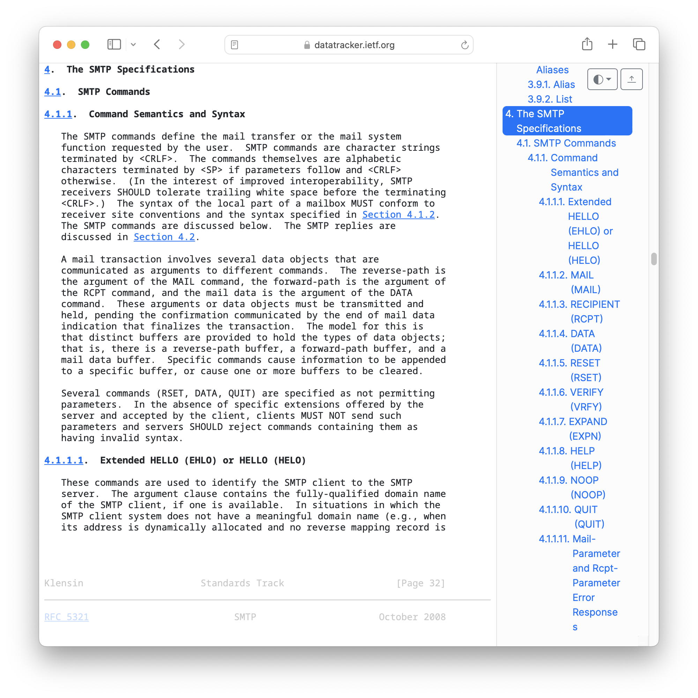
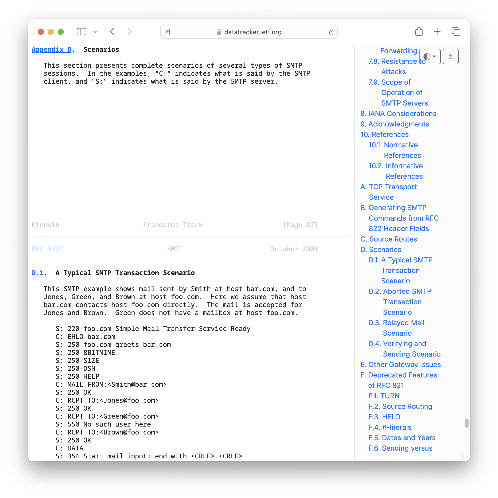

<!--
theme: custom-marp-theme
size: 16:9
paginate: true
author: L. Delafontaine and H. Louis, with the help of GitHub Copilot
title: HEIG-VD DAI - Define an application protocol
description: Define an application protocol for the DAI course at HEIG-VD, Switzerland
header: '[**Define an application protocol**](https://github.com/heig-vd-dai-course/heig-vd-dai-course/tree/main/06.01-define-an-application-protocol)'
footer: '[**HEIG-VD**](https://heig-vd.ch) - [DAI 2025-2026](https://github.com/heig-vd-dai-course/heig-vd-dai-course) - [CC BY-SA 4.0](https://github.com/heig-vd-dai-course/heig-vd-dai-course/blob/main/LICENSE.md)'
headingDivider: 6
-->

# Define an application protocol

<!--
_class: lead
_paginate: false
-->

[Link to the course][course]

<small>L. Delafontaine and H. Louis, with the help of
[GitHub Copilot](https://github.com/features/copilot).</small>

<small>This work is licensed under the [CC BY-SA 4.0][license] license.</small>

![bg opacity:0.1][illustration]

## Objectives

- Refresh on networking
- Learn where to find information about application protocols
- Understand application protocol
- Define application protocols
- How to use an application protocol
- **While quite short, one of the most important chapters of the course!**

## What is an application protocol

<!-- _class: lead -->

More details for this section in the [course material][course]. You can find
other resources and alternatives as well.

### What is an application protocol

- Defines application communication
- RFCs on the IETF website:
  - Relies on transport and network protocols
  - Multiple revisions exist

## How is structured an application protocol

<!-- _class: lead -->

More details for this section in the [course material][course]. You can find
other resources and alternatives as well.

### How is structured an application protocol

- Defined by a set of rules to follow in a RFC
- Rules define:
  - Transport protocol
  - Messages order
  - Examples and errors

## How to define an application protocol

<!-- _class: lead -->

More details for this section in the [course material][course]. You can find
other resources and alternatives as well.

### How to define an application protocol

- Lot of work and thinking
- A protocol is never perfect
- The more you take your time to think and design it, the less you will have to
  change it later

---

- Simplified structure for this course:
  - Section 1 - Overview
  - Section 2 - Transport protocol
  - Section 3 - Messages
  - Section 4 - Examples

### Section 1 - Overview

This section defines the purpose of the protocol:

- What is the goal of the protocol?
- What is the problem that it tries to solve?
- What the application protocol is used for?

### Section 2 - Transport protocol

This section defines the transport protocol used by the application protocol:

- What protocol(s) is/are involved? On which port(s)?
- How are messages/actions encoded?
- How are messages/actions delimited?
- How are messages/actions treated (text or binary)?
- Who initiates/closes the communication?
- What happens on an unknown message/action/exception?

### Section 3 - Messages

This section defines the messages that can be exchanged between the client and
the server.

- What are the messages/actions?
- What are the parameters?
- What are the return values?
- What are the exceptions?

Try to describe these for a given context, not from each point of view. It makes
it way easier to understand and to implement.

### Section 4 - Examples

This section defines examples of messages that can be exchanged between the
client and the server and the exchange order:

- What are the examples of messages/actions?
- What are the examples of exceptions?

It is important to define these examples to illustrate the protocol and to help
the reader to understand the protocol using sequence or state diagrams.

## Example - The SMS protocol

<!-- _class: lead -->

More details for this section in the [course material][course]. You can find
other resources and alternatives as well.

### Example - The SMS protocol

> You are working for a startup that wants to create a new communication app.
>
> The app is simple: it allows users (with unique usernames) to send small text
> messages (maximum 100 characters) to each other. The server is in charge of
> sending the messages to the recipients.
>
> You are asked to define the application protocol that will be used by the
> clients and the server.

## Questions

<!-- _class: lead -->

Do you have any questions?

## Practical content

<!-- _class: lead -->

### What will you do?

- Define two custom application protocols:
  - _"Guess the number"_ game
  - _"Temperature monitoring"_ application

These application protocols will be used in the next chapters to implement them!

### Now it's your turn!

- Read the course material.
- Do the practical content.
- Ask questions if you have any.

➡️ [Find the course on GitHub][course].

**Do not hesitate to help each other! There's no need to rush!**

![bg right w:75%][course-qr-code]

## Finished? Was it easy? Was it hard?

Can you let us know what was easy and what was difficult for you during this
chapter?

This will help us to improve the course and adapt the content to your needs. If
we notice some difficulties, we will come back to you to help you.

➡️ [GitHub Discussions][discussions]

You can use reactions to express your opinion on a comment!

## Sources

- Main illustration by [Iñaki del Olmo](https://unsplash.com/@inakihxz) on
  [Unsplash](https://unsplash.com/photos/NIJuEQw0RKg)
- Illustration by [Aline de Nadai](https://unsplash.com/@alinedenadai) on
  [Unsplash](https://unsplash.com/photos/j6brni7fpvs)
- Illustration by [Henry Be](https://unsplash.com/@henry_be) on
  [Unsplash](https://unsplash.com/photos/lc7xcWebECc)
- Illustration by [CHUTTERSNAP](https://unsplash.com/@chuttersnap) on
  [Unsplash](https://unsplash.com/photos/xewrfLD8emE)

[course]:
	https://github.com/heig-vd-dai-course/heig-vd-dai-course/tree/main/06.01-define-an-application-protocol
[license]:
	https://github.com/heig-vd-dai-course/heig-vd-dai-course/blob/main/LICENSE.md
[discussions]: https://github.com/orgs/heig-vd-dai-course/discussions
[illustration]: ./images/main-illustration.jpg
[course-qr-code]:
	https://quickchart.io/qr?format=png&ecLevel=Q&size=400&margin=1&text=https://github.com/heig-vd-dai-course/heig-vd-dai-course/tree/main/06.01-define-an-application-protocol
