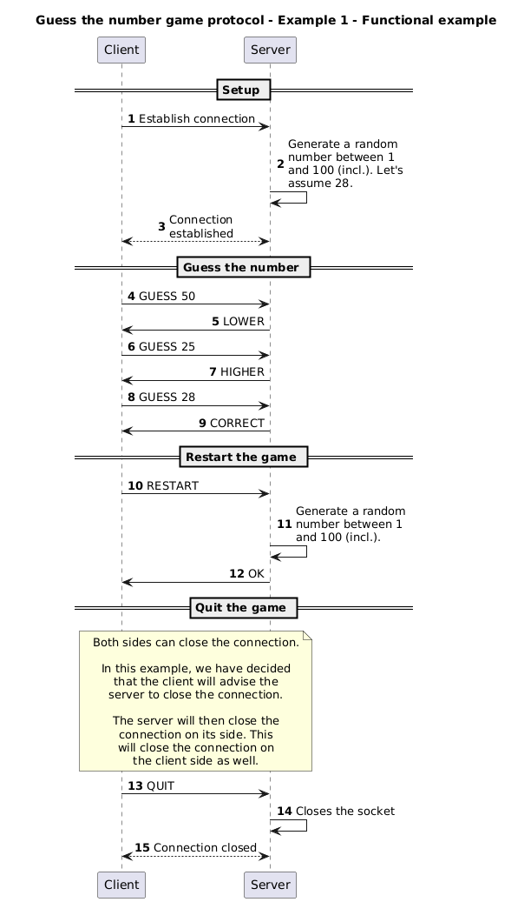
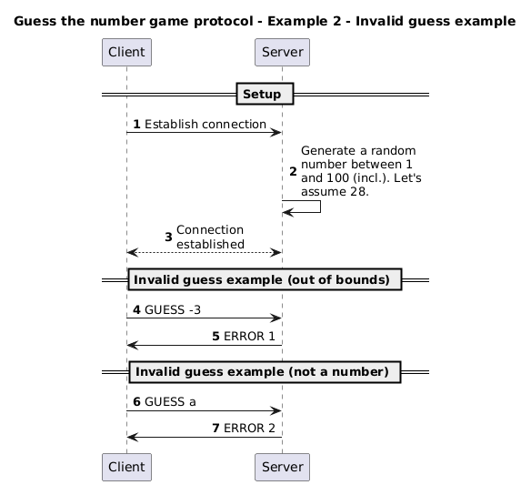
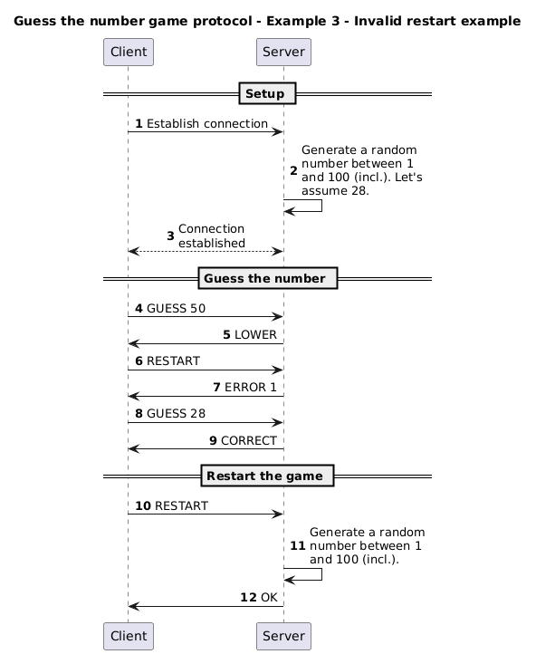
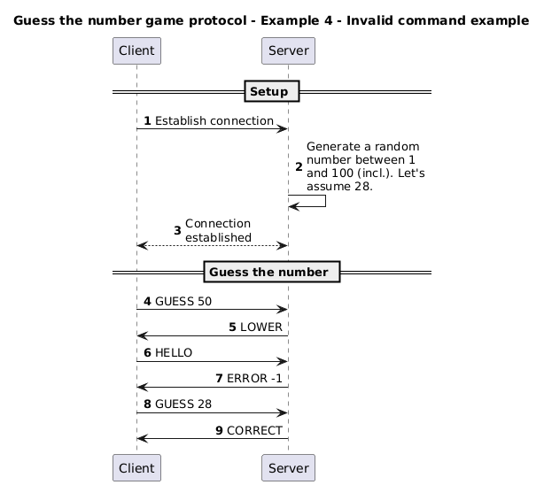

# The _"Guess the number"_ protocol

You are working for a game company that wants to create a new game called
_"Guess the number"_.

The game is simple: the server generates a random number between 1 and 100
(inclusive).

The client has to guess the number. The server will respond with a message to
indicate if the number is higher, lower or correct than the number guessed by
the client.

Once the client has guessed the number, the client can ask the server to restart
the game or quit the game.

Here is **one of the possible results**.

> [!NOTE]
>
> Each person can have a different way to define the protocol. This is one of
> the possible ways to define the protocol. Your might be different and that is
> totally fine. The most important is to define the protocol in a clear and
> explicit way.
>
> The application protocol can be implemented using both TCP and UDP. The choice
> of the transport protocol depends on the requirements of the application. For
> this example, we have decided to use TCP.

## Section 1 - Overview

The _"Guess the number"_ protocol is a communication protocol that allows a
client to try guessing a number randomly generated by the server.

## Section 2 - Transport protocol

The _"Guess the number"_ protocol is a text transport protocol. It uses the TCP
transport protocol to ensure the reliability of data transmission. The port it
uses is the port number 6433.

Every message must be encoded in UTF-8 and delimited by a newline character
(`\n`). The messages are treated as text messages.

The initial connection must be established by the client.

Once the connection is established, the server generates a number between 1 and
100 (inclusive).

The client can then send a number to guess.

The server's role is to verify if the received number is valid (is it even a
number?) and in between given bounds (1 and 100).

If these conditions are met, the server will compare his generated number and
the client's guess and return if the guess is `HIGHER`, `LOWER` or `CORRECT`.

Otherwise, the server sends an error message to the client.

The error must specify which condition has not been met.

On an unknown message, the server must send an error to the client.

Once the number is guessed, the client can either `RESTART`, which will start
the cycle again or `QUIT` which will close the connection on the server side.

> [!NOTE]
>
> The network connection can be closed on both sides (client and server).
>
> In the SMS protocol, the client closes the connection. In this example, we
> have decided that the client will advise the server to close the connection.
> The server will then close the connection on its side. This will close the
> connection on the client side as well.
>
> Both solutions are possible.

## Section 3 - Messages

### Guessing a number

The client sends a guess to the server indicating the number they think the
server has.

#### Request

```text
GUESS <number>
```

#### Response

- `LOWER`: the number sent by the client is lower than the number of the server
- `HIGHER`: the number sent by the client is higher than the number of the
  server
- `CORRECT`: the number sent by the client is equal to the one of the server
- `ERROR <code>`: an error occurred while sending the message. The error code is
  an integer between 1 and 2 inclusive. The error codes are as follows:
  - 1: the number is not between the bounds
  - 2: the guess is not a number

### Restart

Once the correct number was guessed, the client can restart another game.

#### Request

```text
RESTART
```

#### Response

- `OK`: the server is ready to start a new game and await a `GUESS`
- `ERROR <code>`: an error occurred while sending the message. The error code is
  an integer between 1 and 1 inclusive. The error code is as follows:
  - 1: a guessing game is already in session

### Quit

A client can quit at any time and the server must close off the connection.

#### Request

```text
QUIT
```

#### Response

None.

### Invalid message

If the server receives an unknown message, it must send an error message to the
client.

#### Response

- `ERROR <code>`: an error occurred while sending the message. The error code is
  an integer between -1 and -1 inclusive. The error code is as follows:
  - -1: invalid message

## Section 4 - Examples

### Functional example



### Invalid guess example



### Invalid restart example



### Invalid command example


