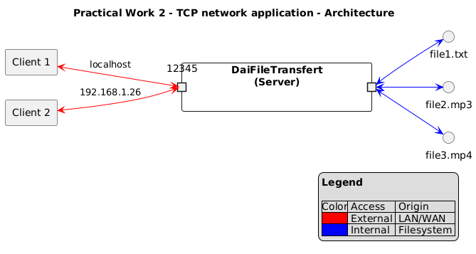
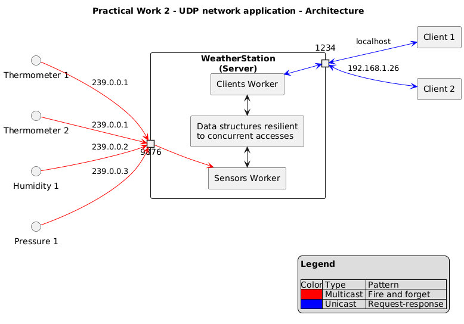

# Practical work 2


L. Delafontaine and H. Louis, with the help of
[GitHub Copilot](https://github.com/features/copilot).

This work is licensed under the [CC BY-SA 4.0][license] license.

## Resources

- Objectives, teaching and learning methods, and evaluation methods:
  [Link to content](..)
- Course material: [Link to content](../01-course-material/README.md) ·
  [Presentation (web)](<https://heig-vd-dai-course.github.io/heig-vd-dai-course/02.02-practical-work-1-(1-of-5)/01-course-material/index.html>)
  ·
  [Presentation (PDF)](<https://heig-vd-dai-course.github.io/heig-vd-dai-course/02.02-practical-work-1-(1-of-5)/01-course-material/02.02-practical-work-1-(1-of-5)-presentation.pdf>)

## Table of contents

- [Resources](#resources)
- [Table of contents](#table-of-contents)
- [Introduction](#introduction)
- [Objectives](#objectives)
- [Demo](#demo)
  - [Demo 1](#demo-1)
  - [Demo 2](#demo-2)
- [Group composition](#group-composition)
- [Idea validation](#idea-validation)
- [Grading criteria](#grading-criteria)
  - [Category 1 - Docker and Docker Compose](#category-1---docker-and-docker-compose)
  - [Category 2 - Define an application protocol](#category-2---define-an-application-protocol)
  - [Category 3 - Java TCP/UDP programming](#category-3---java-tcpudp-programming)
  - [Category 4 - Java network concurrency](#category-4---java-network-concurrency)
  - [Category 5 - Presentation and questions](#category-5---presentation-and-questions)
- [Constraints](#constraints)
- [Submission](#submission)
- [Presentations](#presentations)
  - [DAI-TIC-C (Wednesday mornings)](#dai-tic-c-wednesday-mornings)
  - [DAI-TIC-B (Wednesday afternoons)](#dai-tic-b-wednesday-afternoons)
  - [DAI-TIC-A (Thursdays)](#dai-tic-a-thursdays)
- [Grades and feedback](#grades-and-feedback)
- [Tips](#tips)
  - [Create diagrams](#create-diagrams)
  - [Extract the command and parameters from the message](#extract-the-command-and-parameters-from-the-message)
  - [The POSIX standard](#the-posix-standard)
- [Finished? Was it easy? Was it hard?](#finished-was-it-easy-was-it-hard)
- [Sources](#sources)

## Introduction

Network applications are everywhere. They are used to communicate, to play
games, to watch videos, to listen to music, to browse the web, to send emails,
etc.

In this practical work, you will create your own network application.

The network application will be defined by an application protocol and two
processes that communicate over the network.

The application protocol and the network protocol(s) it uses (TCP and/or UDP)
will be defined by you.

Feel free to be creative! For example, you can choose to create a chat
application, a chess game, a shopping list, the simulation of an Internet of
Things (IoT) network, etc. If you do not have any idea, come to see us and we
can give you.

Multiple groups can choose the same processing and you can share your
methodology and take inspiration from/help each other. However, you are not
allowed to plagiarize the code of another group. You will be penalized if you do
so.

## Objectives

- Define a network application protocol.
- Implement the application protocol as a network application using the TCP
  and/or UDP protocol(s).
- Package, publish and run a network application with Docker.

## Demo

### Demo 1

A simple file transfer application made with TCP.



Compile the project:

```sh
./mvnw clean package
```

Run the CLI without any arguments:

```sh
java -jar target/practical-work-2-demo-1-1.0-SNAPSHOT.jar
```

```text
Missing required subcommand
Usage: DaiFileTransfer [COMMAND]
A simple file transfer application
Commands:
  server  Start a TCP server to serve files
  client  Start a client to download files from a server
```

Start the server:

```sh
java -jar target/practical-work-2-demo-1-1.0-SNAPSHOT.jar server -p 12345 -t 4
```

Start the client:

```sh
java -jar target/practical-work-2-demo-1-1.0-SNAPSHOT.jar client -p 12345
```

```text
  _____          _____   _____           _                  _
 |  __ \   /\   |_   _| |  __ \         | |                | |
 | |  | | /  \    | |   | |__) | __ ___ | |_ ___   ___ ___ | |
 | |  | |/ /\ \   | |   |  ___/ '__/ _ \| __/ _ \ / __/ _ \| |
 | |__| / ____ \ _| |_  | |   | | | (_) | || (_) | (_| (_) | |
 |_____/_/    \_\_____| |_|   |_|  \___/ \__\___/ \___\___/|_|

You are connected to server on port 12345 with IP address localhost.

Available commands:
LS - list available files on server
GET <file> - get file from server
QUIT - quit the client
>
```

List available files:

```text
> ls
Available files on server:
demo.txt
my-passwords-in-clear.txt
rzr-sc2.exe
```

Get one of the available files:

```text
> GET my-passwords-in-clear.txt
Downloading file from server...
File saved to my-passwords-in-clear.txt
```

Get a file that does not exist:

```text
> GET not-found.txt
The specified file was not found on the server.
```

Quit:

```text
> QUIT
Bye.
```

If a client tries to connect to the server when no thread is available, the
client has to wait to be served.

### Demo 2

A weather station application made with UDP.



Compile the project:

```sh
./mvnw clean package
```

Run the CLI without any arguments:

```sh
java -jar target/practical-work-2-demo-2-1.0-SNAPSHOT.jar
```

```text
Missing required subcommand
Usage: practical-work-2-demo-2-1.0-SNAPSHOT.jar [-hV] [COMMAND]
DAI Weather Station
  -h, --help      Show this help message and exit.
  -V, --version   Print version information and exit.
Commands:
  thermometer-emitter      Emits temperature values.
  pressure-emitter         Emits pressure values.
  humidity-emitter         Emits humidity values.
  weather-station          Start an UDP multicast receiver.
  weather-client           Start an UDP weather client.
  list-network-interfaces  List all available network interfaces.
```

Start the weather station:

```sh
java -jar target/practical-work-2-demo-2-1.0-SNAPSHOT.jar weather-station \
  -i eth0 \
  --port 9876 \
  --server-port 1234
```

Output:

```text
Multicast receiver started (10.11.12.25:9876)
Unicast receiver started (10.11.12.25:1234)
```

Start the emitters:

```sh
java -jar target/practical-work-2-demo-2-1.0-SNAPSHOT.jar thermometer-emitter \
  --delay=0 \
  --frequency 10000 \
  -i eth0 \
  -p 9876

java -jar target/practical-work-2-demo-2-1.0-SNAPSHOT.jar pressure-emitter \
  --delay=0 \
  --frequency 10000 \
  -i eth0 \
  -p 9876
```

Output:

```text
Emitter of type thermometer started (10.11.12.25:9876).
Multicasting measure : 30.0 to 239.0.0.1:9876 on interface eth0
Multicasting measure : 23.0 to 239.0.0.1:9876 on interface eth0
Multicasting measure : 28.0 to 239.0.0.1:9876 on interface eth0
Multicasting measure : 19.0 to 239.0.0.1:9876 on interface eth0
Multicasting measure : 15.0 to 239.0.0.1:9876 on interface eth0
```

```text
Emitter of type pressure started (10.11.12.25:9876).
Multicasting measure : 982.0 to 239.0.0.2:9876 on interface eth0
Multicasting measure : 1027.0 to 239.0.0.2:9876 on interface eth0
Multicasting measure : 970.0 to 239.0.0.2:9876 on interface eth0
Multicasting measure : 996.0 to 239.0.0.2:9876 on interface eth0
Multicasting measure : 982.0 to 239.0.0.2:9876 on interface eth0
```

Start the weather client:

```sh
java -jar practical-work-2-demo-2-1.0-SNAPSHOT.jar weather-client
```

Output:

```text
Welcome to the weather client!
Please enter the measures you want to get
1. Temperature
2. Humidity
3. Pressure
4. Quit
>
```

You can then select the measures you want to get.

```text
> 1
List all measures (1) or only the average? (2)
> 1
----------------------------------------
Received measures: [30.0, 23.0, 28.0, 19.0, 15.0]
----------------------------------------
Please enter the measures you want to get
1. Temperature
2. Humidity
3. Pressure
4. Quit
>
```

The client will then display all the measures received from the weather station.

```text
> 3
List all measures (1) or only the average? (2)
> 2
----------------------------------------
Received average: 991.11
----------------------------------------
Please enter the measures you want to get
1. Temperature
2. Humidity
3. Pressure
4. Quit
> 4
```

The client can then quit the application.

## Group composition

You will work in groups of two (2) to three (3) students. You can choose your
partner(s). If you do not have a partner, we will assign you one.

To announce your group, create a new GitHub Discussion at
<https://github.com/orgs/heig-vd-dai-course/discussions> with the following
information:

- **Title**: [DAI 2025-2026 Class \<class ID\>] Practical work 2 - \<first name
  member 1\> \<last name member 1\>, \<first name member 2\> \<last name member
  2\> and \<first name member 3\> \<last name member 3\> (if applicable)
  (replace `<class ID>`, `<first name>` and `<last name>` with your information,
  where `<class ID>` is either `A`, `B` or `C` depending on your class).
- **Category**: Show and tell.
- **Description**: A quick description of what you will achieve during this
  practical work.

> [!CAUTION]
>
> **You must do it before the next course**, even if you do not have a clear
> idea yet as it will help us to plan the practical work presentations.
>
> Please refer to the [Constraints](#constraints) section to know what is
> expected from you.

## Idea validation

The teaching staff might ask you to change the scope of your practical work if
it is too complex or too simple.

This will ensure that you have a good balance between the complexity of the
practical work and the time you have to complete it.

If you do not have any idea, come to see us and we can help you finding some
ideas.

## Grading criteria

- **0 point** - The work is missing, off-topic, or shows a very limited
  understanding of the subject.
- **0.1 point** - The work shows partial understanding: some key elements are
  missing, unclear, or poorly implemented.
- **0.2 point** - The work is complete, accurate, and shows a clear and thorough
  understanding of the subject.

Maximum grade: 25 points \* 0.2 + 1 = 6

> [!CAUTION]
>
> While the grading criteria might not be as detailed as in the previous
> practical work(s) for each section, you **must** continue to apply all the
> good practices you have learned so far (Git, GitHub and Markdown, Java,
> IntelliJ IDEA and Maven, Java IOs, etc.). **You might be penalized if you do
> not follow these practices.**
>
> Check the [Constraints](#constraints) section for more information and
> remember the UNIX philosophy and the KISS principle: _Keep it simple, silly!_

If your repository is private, you must add us as collaborators to your
repository!

### Category 1 - Docker and Docker Compose

|   # | Criterion                                                                                                                                                                                                                                                                      | Points |
| --: | :----------------------------------------------------------------------------------------------------------------------------------------------------------------------------------------------------------------------------------------------------------------------------- | -----: |
|   1 | The network application is packaged with Docker using a Dockerfile                                                                                                                                                                                                             |    0.2 |
|   2 | The network application is published to GitHub Container Registry                                                                                                                                                                                                              |    0.2 |
|   3 | The README describes explicit commands[^explicit-commands] to build and publish your network application with Docker to GitHub Container Registry so contributors to your project know how to publish your application with Docker                                             |    0.2 |
|   4 | The README describes explicit commands[^explicit-commands] to use your network application with Docker so new users can use it without installing anything other than Docker on their computer (`docker run` is enough for this practical work, no need to use Docker Compose) |    0.2 |

### Category 2 - Define an application protocol

|   # | Criterion                                                                                                                  | Points |
| --: | :------------------------------------------------------------------------------------------------------------------------- | -----: |
|   5 | The README contains the application protocol or a link to the application protocol that describes your network application |    0.2 |
|   6 | The application protocol defines the overview of the network application                                                   |    0.2 |
|   7 | The application protocol defines the transport protocol(s) the network application uses                                    |    0.2 |
|   8 | The application protocol defines the port(s) the network application uses                                                  |    0.2 |
|   9 | The application protocol defines the available messages/actions/commands for the client/server to communicate              |    0.2 |
|  10 | The application protocol defines the success/error codes and their explanations                                            |    0.2 |
|  11 | The application protocol is described using at least one successful communication example diagram                          |    0.2 |
|  12 | The application protocol is described using at least one unsuccessful/error communication example diagram                  |    0.2 |

### Category 3 - Java TCP/UDP programming

|   # | Criterion                                                                                                                                | Points |
| --: | :--------------------------------------------------------------------------------------------------------------------------------------- | -----: |
|  13 | The server starts/listens on the defined port(s) by default (you must be able to change it via picocli if needed)                        |    0.2 |
|  14 | The client accesses the server on a given host (you must be able to change it via picocli if needed)                                     |    0.2 |
|  15 | The client accesses the server on the defined port(s) by default (you must be able to change it via picocli if needed)                   |    0.2 |
|  16 | A REPL (Read-Eval-Print Loop) is implemented on the client side to interact with the server without ever leaving the network application |    0.2 |
|  17 | The server correctly processes the messages/actions/commands                                                                             |    0.2 |
|  18 | The client correctly processes the messages/actions/commands                                                                             |    0.2 |
|  19 | The client and server correctly manage resources in case a problem occurs or when one decides to close the connection                    |    0.2 |
|  20 | Explicit errors messages[^explicit-error-messages] are displayed on invalid/missing inputs and/or network errors.                        |    0.2 |

### Category 4 - Java network concurrency

|   # | Criterion                                                                                | Points |
| --: | :--------------------------------------------------------------------------------------- | -----: |
|  21 | The network application accepts connections from multiple clients at the same time       |    0.2 |
|  22 | The data structures used in the network application are resilient to concurrent accesses |    0.2 |

### Category 5 - Presentation and questions

|   # | Criterion                                                                                                                                              | Points |
| --: | :----------------------------------------------------------------------------------------------------------------------------------------------------- | -----: |
|  23 | The presentation is clear and well prepared.                                                                                                           |    0.2 |
|  24 | The application is presented as you would do it to a colleague/another team/boss/client/investor so they can understand what you created, why and how. |    0.2 |
|  25 | Everyone speaks during the presentation.                                                                                                               |    0.2 |

## Constraints

- The whole team must contribute to the project and all members must be able to
  explain it in details if asked.
- A GitHub Discussion must be opened during the first week of the project to
  explain the idea of the project so the teachers can validate the idea.
- The GitHub Discussion must be updated with the link to the repository and a
  related commit hash before the deadline - every 24 hours after the deadline
  will result in a -1 point penalty on the final grade.
- You can only use the Java classes seen in the course to implement the network
  application (you can use any other libraries for other aspects of the
  application, such as UI, etc.)
- The application must be slightly more complex and slightly different than the
  examples presented during the course (we emphasize the word _slightly_, no
  need to shoot for the moon).
- You must state your sources if you have used elements that you are not the
  author (code from the Internet, code generated from AI tools, etc.). You must
  also state for which usage you did use the source(s)/tool(s) in your README.
  If you plagiarize the code of another group, all groups involved will receive
  a grade of 1.
- Elements that are supposed to be acquired through the teaching unit or
  previous practical work(s) must not be omitted, forgotten or poorly
  implemented (you must continue to use the Git/GitHub workflow, allow users to
  understand your application, etc.).

> [!CAUTION]
>
> Failure to comply with these constraints may result in serious penalties, up
> to -1 point penalty on the final grade _**for each criterion not met**_.

## Submission

Your work is due as follows:

- DAI-TIC-C (Wednesday mornings): **Tuesday 02.12.25 at 23:59**.
- DAI-TIC-B (Wednesday afternoons): **Wednesday 03.12.25 at 11:59**.
- DAI-TIC-A (Thursdays): **Wednesday 03.12.25 at 23:59**.

> [!CAUTION]
>
> Each day of delay will result in a penalty of -1 point on the final grade.

You must update the GitHub Discussion you created previously with the following
information:

- **Description**: The link to your repository as well as the commit hash you
  want to submit

> [!CAUTION]
>
> If you do not update the GitHub Discussion with the link to your repository
> and the commit hash before the deadline, it is considered as a late submission
> and you will be penalized.

## Presentations

- DAI-TIC-C (Wednesday mornings): **Wednesday 03.12.25** starting at **10:30**
  in room **B51a**
- DAI-TIC-B (Wednesday afternoons): **Wednesday 03.12.25** starting at **14:45**
  in room **B38**
- DAI-TIC-A (Thursdays): **Thursday 04.12.25** starting at **16:30** in room
  **B51a**

The exact schedule will be communicated once the groups are known.

<!-- (Un)comment the following lines to hide/show the note about the presentations -->

We only have **8 minutes per group**. You decide what you want to show us and
how you want to present it.

**Come 5 minutes before your time slot** with your computer. You will have
access to a video projector.

The presentation order is random and is stated in the next tables:

- [DAI-TIC-C (Wednesday mornings)](#dai-tic-c-wednesday-mornings)
- [DAI-TIC-B (Wednesday afternoons)](#dai-tic-b-wednesday-afternoons)
- [DAI-TIC-A (Thursdays)](#dai-tic-a-thursdays)

### DAI-TIC-C (Wednesday mornings)

|   # | Group                                                           | Passage     |
| --: | :-------------------------------------------------------------- | :---------- |
|   1 | Gabriel Bader and Mauro Santos                                  | 10:30-10:38 |
|   2 | Theo Bensaci and Yasser Gasmi                                   | 10:40-10:48 |
|   3 | Pierre Thiébaud and Victor Giordani                             | 10:50-10:58 |
|   4 | Koray Akgul and Nathan Stampfli                                 | 11:00-11:08 |
|   5 | Romain Durussel and Abram Zweifel                               | 11:10-11:18 |
|   6 | Léo Bernard and Yann Mermoud                                    | 11:20-11:28 |
|   7 | Sofian Ethenoz, François de Courville and Mouhamed Sakho        | 11:30-11:38 |
|   8 | Nolan Evard, Maikol Correia Da Silva and Alberto De Sousa Lopes | 11:40-11:48 |

### DAI-TIC-B (Wednesday afternoons)

| # | Group                                 | Passage     |
|--:|:--------------------------------------|:------------|
| 1 | Pierre Gellet and Mirco Profico       | 14:45-14:53 |
| 2 | Yuuta Jorand and Agron Markaj         | 14:55-15:03 |
| 3 | Samuel dos Santos and Fabien Léger    | 15:05-15:13 |
| 4 | Arnaud Bersier and Jonathan Nicolet   | 15:15-15:23 |
| 5 | Marc Ischi and Arnaut Leyre           | 15:25-15:33 |
| 6 | Julien Gorgerat and Audrey Mauroux    | 15:35-15:43 |
| 7 | Louis Garcia and Tiago Ferreira       | 15:45-15:53 |
| 8 | Maxime Regenass and Santiago Sugrañes | 15:55-16:03 |

### DAI-TIC-A (Thursdays)

|   # | Group                                                        | Passage     |
| --: | :----------------------------------------------------------- | :---------- |
|   1 | Thomas Boltshauser, Christopher Pardo and Charles Perfect    | 10:05-10:13 |
|   2 | Sofia Garfo Henriques, Quentin Eschmann and Thibault Matthey | 12:10-12:18 |
|   3 | Pei-Wen Liao, Maksym Makovskyi and Guo Yu Wu                 | 12:20-12:28 |
|   4 | Kym Bolomey, Paul Reynard and Robiel Tesfazghi               | 12:40-12:48 |
|   5 | Gianni Bee and Quentin Michon                                | 16:30-16:38 |
|   6 | Aymeric Siegenthaler, Fateme Pirhayati and Luis Oswaldo      | 16:40-16:48 |
|   7 | Louis Bindschedler, Benoît Essinger and Laszlo Meylan        | 16:50-16:58 |
|   8 | Tadeusz Kondracki, Yanni Skawronski and Jules Rossier        | 17:00-17:08 |
|   9 | Colin Stefani and Simão Romano Schindler                     | 17:10-17:18 |

<!-- (Un)comment the following lines to hide/show the note about the presentations -->

## Grades and feedback

Grades will be entered into GAPS, followed by an email with the feedback.

The evaluation will use exactly the same grading grid as shown in the course
material.

Each criterion will be accompanied by a comment explaining the points obtained,
a general comment on your work and the final grade.

If you have any questions about the evaluation, you can contact us!

<details>
<summary>Email template for the teaching staff</summary>

```text
[DAI 202X-202Y] Retours sur le travail pratique Z

Bonjour,

Vous trouverez en pièce jointe les retours que nous vous avons faits pour le
travail pratique.

La note a été saisie dans GAPS également.

Nous restons à votre disposition pour toute question.

Cordialement,
[Le personnel enseignant]
```

</details>

## Tips

### Create diagrams

You can use [PlantUML](https://plantuml.com/), [draw.io](https://draw.io/), pen
and paper as scanned diagrams or any other tools you want to create your
diagrams.

PDF, PNG, SVG, etc. are all accepted formats in your repository.

### Extract the command and parameters from the message

The Short Message Service (SMS) protocol presented in the
[_"Define an application protocol"_](https://github.com/heig-vd-dai-course/heig-vd-dai-course/tree/main/06.01-define-an-application-protocol)
course defines the following message:

```text
RECEIVE <message> <username>
```

This message is sent by the server to a client to inform them that they have
received a message from another user.

The command is `RECEIVE` and the parameters are `<message>` and `<username>`.

The message can be up to 100 characters long.

You can use the following snippet of code to extract the command and the
parameters from the message:

```java
// Extract the command and the parameters from the message and store them in a
// List. The first element of the List is the command and the second element is
// the parameters.
//
// The second parameter of the split method is the maximum number of parts
// that can be created. If the message contains more than one space, the
// remaining parts will be added to the last part.
List<String> messageParts = Arrays.asList(emitterMessage.split(" ", 2));

// Get the command from the message
String command = messageParts.get(0);

// Switch on the command
switch (command) {
  // Other cases can be defined here...
  case "RECEIVE" -> {
    // We check that the message contains at least two parts (the command and
    // its parameters). If not, the message is invalid (from the application
    // protocol) and we ignore it (or we can send an error message to the
    // client).
    if (messageParts.size() < 2) {
      System.out.println("Invalid message, ignoring...");
      break;
    }

    // Get the parameters from the message
    List<String> parameters = Arrays.asList(messageParts.get(1).split(" "));

    // Check that the parameters contains at least two parts (the message and
    // the user). If not, the message is invalid and we ignore it (or we can
    // send an error message to the client).
    if (parameters.size() < 2) {
      System.out.println("Invalid message, ignoring...");
      break;
    }

    // Get (and remove) the user from the parameters (the last part)
    String user = parameters.removeLast();

    // Join the remaining parts with a space to form the message
    String message = String.join(" ", parameters);

    // Do something with the message and the user
    System.out.printf("Message from %s: %s\n", user, message);
    break;
  }
  // Other cases can be defined here...
}
```

### The POSIX standard

> The Portable Operating System Interface (POSIX) standard is a family of
> standards specified by the IEEE Computer Society for maintaining compatibility
> between operating systems. POSIX defines both the system and user-level
> application programming interfaces (APIs), along with command line shells and
> utility interfaces, for software compatibility (portability) with variants of
> Unix and other operating systems.
>
> <https://en.wikipedia.org/wiki/POSIX>

Not all programs are/can be POSIX compliant. But if you try to comply with the
POSIX standard, you will be able to run your program on various operating
systems without any issues.

## Finished? Was it easy? Was it hard?

Can you let us know what was easy and what was difficult for you during this
practical work?

This will help us to improve the course and adapt the content to your needs. If
we notice some difficulties, we will come back to you to help you.

> [!NOTE]
>
> Vous pouvez évidemment poser toutes vos questions et/ou vos propositions
> d'améliorations en français ou en anglais.
>
> N'hésitez pas à nous dire si vous avez des difficultés à comprendre un concept
> ou si vous avez des difficultés à réaliser les éléments demandés dans le
> cours. Nous sommes là pour vous aider !

➡️ [GitHub Discussions][discussions]

You can use reactions to express your opinion on a comment!

## Sources

- Main illustrations by [Rafael Rex Felisilda](https://unsplash.com/@rafaelrex)
  on
  [Unsplash](https://unsplash.com/photos/chess-pieces-on-chess-board-rCxTJlaU5Yc)
  and [Jorge Ramirez](https://unsplash.com/@jorgedevs) on
  [Unsplash](https://unsplash.com/photos/a-cell-phone-tower-in-a-park-with-a-lake-in-the-background-0vmMg1r7FRU)

[^explicit-commands]:
    Explicit commands are commands that can be run in a terminal to clone and
    build your application. It has to be working commands that can be run by a
    new user/developer without any additional information.

[^explicit-error-messages]:
    Explicit error messages are error messages that clearly explain what went
    wrong and how to fix it. They should be user-friendly and easy to
    understand.

[license]:
	https://github.com/heig-vd-dai-course/heig-vd-dai-course/blob/main/LICENSE.md
[discussions]: https://github.com/orgs/heig-vd-dai-course/discussions/5
