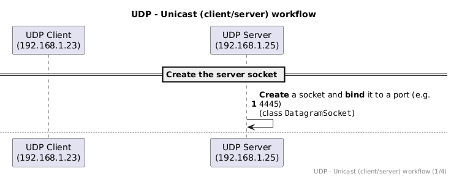
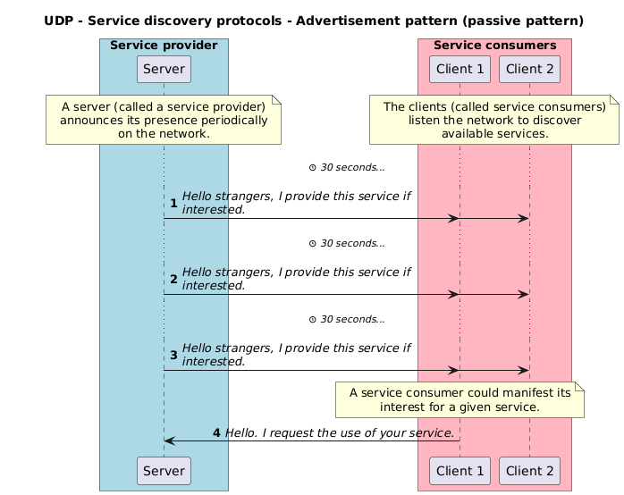
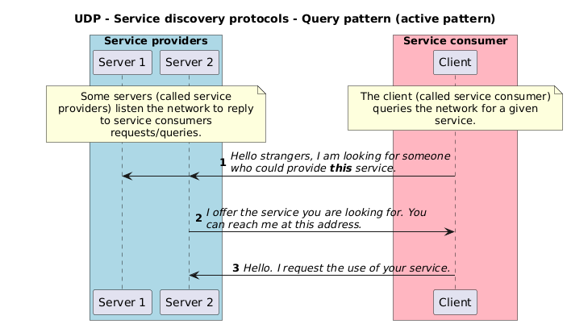

<!--
theme: custom-marp-theme
size: 16:9
paginate: true
author: L. Delafontaine and H. Louis, with the help of GitHub Copilot
title: HEIG-VD DAI - Java TCP and UDP programming
description: Java TCP and UDP programming for the DAI course at HEIG-VD, Switzerland
header: '[**Java TCP and UDP programming**](https://github.com/heig-vd-dai-course/heig-vd-dai-course/tree/main/07.01-java-tcp-and-udp-programming-(1-of-2))'
footer: '[**HEIG-VD**](https://heig-vd.ch) - [DAI 2025-2026](https://github.com/heig-vd-dai-course/heig-vd-dai-course) - [CC BY-SA 4.0](https://github.com/heig-vd-dai-course/heig-vd-dai-course/blob/main/LICENSE.md)'
headingDivider: 6
-->

# Java TCP and UDP programming

<!--
_class: lead
_paginate: false
-->

[Link to the course][course]

<small>L. Delafontaine and H. Louis, with the help of
[GitHub Copilot](https://github.com/features/copilot).</small>

<small>Based on the original course by O. Liechti and J. Ehrensberger.</small>

<small>This work is licensed under the [CC BY-SA 4.0][license] license.</small>

![bg opacity:0.1][illustration]

## Objectives (1/2)

- Program your own TCP client/server applications in Java with the Socket API.
- Process data from TCP streams.
- Program your own UDP emitter/receiver applications in Java with the Socket
  API.
- Process data from UDP datagrams.


## Objectives (2/2)

- Learn the different ways to send a UDP datagram to one or multiple clients.
- How UDP can be used for service discovery.
- Make usage of a REPL.

**Your applications will be able to communicate over the network!**


## Part 1/2

<!-- _class: lead -->

In this first part, you will learn the basics of TCP and UDP programming in
Java.

### Explore the code examples

<!-- _class: lead -->

More details for this section in the [course material][course]. You can find
other resources and alternatives as well.

#### Explore the code examples

Individually, or in pair/group, **take 15 minutes to explore and discuss the
[code examples (part 1/2)](<https://github.com/heig-vd-dai-course/heig-vd-dai-course/tree/main/07.01-java-tcp-and-udp-programming-(1-of-2)/02-code-examples>)**.

Answer the questions available in the course material:

- How do the code examples work?
- What are the main takeaways of the code examples?
- What are the main differences between the code examples?

If needed, use the theoretical content to help you.

### The Socket API

<!-- _class: lead -->

More details for this section in the [course material][course]. You can find
other resources and alternatives as well.

#### The Socket API

- Java API to create TCP and UDP network applications.
- Described in the
  [`java.net` package](https://docs.oracle.com/en/java/javase/21/docs/api/java.base/java/net/package-summary.html)
  in the
  [`java.base` module](https://docs.oracle.com/en/java/javase/21/docs/api/java.base/module-summary.html).
- Originally developed by Berkeley University for the Unix operating system.
- Ported to Java and many other languages.
- Provides classes and methods to create sockets, connect to remote hosts, send
  and receive data, etc.

### TCP

<!-- _class: lead -->

More details for this section in the [course material][course]. You can find
other resources and alternatives as well.

#### TCP

TCP is a transport protocol that is similar to a phone call:

1. A connection is established between two parties (unicast).
2. Data sent is guaranteed to arrive in the same order.
3. Data can be sent again if needed (retransmission).


#### TCP in the Socket API

- The Socket API provides two classes to create TCP applications:
  - [`ServerSocket`](https://docs.oracle.com/en/java/javase/21/docs/api/java.base/java/net/ServerSocket.html)
    (server side).
  - [`Socket`](https://docs.oracle.com/en/java/javase/21/docs/api/java.base/java/net/Socket.html)
    (client side).
- A TCP socket is a connection endpoint between two parties using a host and a
  port.
- A server socket listens for incoming connections on a specific port.
- A client socket connects to a server socket using the server's host and port.
- Once connected, data can be exchanged between the two sockets.

---


---


---


---


---


#### Processing data from streams

- Sockets use data streams to send and receive data, just like files:
  - Get an input stream to read data from a socket.
  - Get an output stream to write data to a socket.


---

Get the streams from a socket:

```java
// Get input stream
input = socket.getInputStream();

// Get output stream
output = socket.getOutputStream();
```

Read and write data from/to the streams as text:

```java
// Get input stream as text
input = new InputStreamReader(socket.getInputStream(), StandardCharsets.UTF_8);

// Get output stream as text
output = new OutputStreamWriter(socket.getOutputStream(), StandardCharsets.UTF_8);
```

---

Improve performance with a buffer (with a binary stream):

```java
// Get input stream as binary with buffer
input = new BufferedInputStream(socket.getInputStream());

// Get output stream as binary with buffer
output = new BufferedOutputStream(socket.getOutputStream());
```

**Everything you have learned about Java IOs applies here!**

### UDP

<!-- _class: lead -->

More details for this section in the [course material][course]. You can find
other resources and alternatives as well.

#### UDP

- A transport layer protocol just like TCP.
- Connectionless protocol - does not require to establish a connection before
  sending data.
- Unreliable protocol - does not guarantee delivery but is fast.
- Analogy: sending postcards through the postal service.


#### UDP datagrams

- Datagrams are discrete chunks of data (packets) sent over the network.
- Sent individually and independently, just as postcards.
- Each datagram is self-contained and has all the information needed for routing
  and delivery, thanks to its header.
- The header contains the source's IP, source and destination ports, length,
  checksum, etc. and a payload (data).
- Maximum size of a UDP datagram is 65,535 bytes (including header).

#### Reliability

- UDP is unreliable (no guarantee of delivery, no guarantee of order).
- The application must implement its own reliability mechanism.
- In some cases, reliability is not needed (e.g. streaming).
- Handling reliability is complex - not covered in this course.


#### UDP in the Socket API

- `DatagramSocket` is used to send and receive datagrams.
- A datagram is created with the `DatagramPacket` class.
- A datagram socket can send and receive datagrams to/from any host and port.
- A datagram socket can be bound to a specific port to listen for incoming
  datagrams.
- A datagram socket can be used to send and receive datagrams without
  establishing a connection.

---



---


---


---


#### Processing data from datagrams

A datagram contains a payload as a byte array.

You can create a datagram with a byte array as payload:

```java
// Create a datagram with a payload and a destination address
byte[] buffer = "Hello, World!".getBytes(StandardCharsets.UTF_8);
DatagramPacket packet = new DatagramPacket(
  buffer,
  buffer.length,
  InetAddress.getByName("localhost"),
  1234
);
```

---

You can get the payload of a received datagram as a byte array:

```java
// Create a datagram to receive data
byte[] buffer = new byte[1024];
DatagramPacket packet = new DatagramPacket(buffer, buffer.length);

// Receive a datagram
socket.receive(packet);

// Get the payload of the datagram
byte[] data = packet.getData();
int length = packet.getLength();
String message = new String(data, 0, length, StandardCharsets.UTF_8);
```

### End of part 1/2 - Questions

<!-- _class: lead -->

Do you have any questions?

### Practical content (part 1/2)

<!-- _class: lead -->

#### What will you do?

- Learn to use the debugger.
- TCP & UDP - Execute the code examples.
- Explore the Java TCP programming template.
- Explore the Java UDP programming template.

### Now it's your turn!

- Read the course material.
- Do the practical content.
- Ask questions if you have any.

➡️ [Find the course on GitHub][course].

**Do not hesitate to help each other! There's no need to rush!**

![bg right w:75%][course-qr-code]

## Part 2/2

<!-- _class: lead -->

In this second part, you will learn more about UDP and some of its unique
features compared to TCP.

### Explore the code examples

<!-- _class: lead -->

More details for this section in the [course material][course]. You can find
other resources and alternatives as well.

#### Explore the code examples

Individually, or in pair/group, **take 15 minutes to explore and discuss the
[code examples (part 2/2)](<https://github.com/heig-vd-dai-course/heig-vd-dai-course/tree/main/07.01-java-tcp-and-udp-programming-(1-of-2)/02-code-examples>)**.

Answer the questions available in the course material:

- How do the code examples work?
- What are the main takeaways of the code examples?
- What are the main differences between the code examples?

If needed, use the theoretical content to help you.

### Unicast, broadcast and multicast

<!-- _class: lead -->

More details for this section in the [course material][course]. You can find
other resources and alternatives as well.

#### Unicast, broadcast and multicast

- Unicast, broadcast and multicast are ways to send data over the network.
- TCP is unicast only - one sender and one receiver.
- UDP can be unicast, broadcast or multicast.


#### Unicast

- One-to-one communication.
- One sender and one receiver.
- To send a datagram, the sender must know:
  - The IP address of the receiver.
  - The port of the receiver.

Think of it as a private conversation between two people.


#### Broadcast

- One-to-all communication.
- One sender and multiple receivers.
- To send a datagram, the sender must know:
  - The network subnet (e.g. `192.168.255.255`).
  - The port.

Think of it as a public announcement.


### Multicast

- One-to-many communication.
- One sender and some receivers.
- To send a datagram, the sender must know:
  - The multicast address (between `239.0.0.0` and `239.255.255.255`).
  - The port.

Think of it as a group conversation.


---

- Just as with broadcast, it can be blocked by routers.
- Broadcast/multicast are quite guaranteed **not** to work on the public
  Internet.
- Made for the local network.
- Multicast is a complex topic, not covered in depth in this course.
- The course material contains some resources.


## Messaging patterns

<!-- _class: lead -->

More details for this section in the [course material][course]. You can find
other resources and alternatives as well.

### Messaging patterns

- Fire-and-forget:
  - One-way communication.
  - No response.
  - No guarantee of delivery.
- Request-response:
  - Two-way communication.
  - Response.
  - Guarantee of delivery (manual).


## Service discovery protocols

<!-- _class: lead -->

More details for this section in the [course material][course]. You can find
other resources and alternatives as well.

### Service discovery protocols

- Discover services on the network.
- Service discovery protocol patterns:
  - Advertisement (passive).
  - Query (active).


---



---



## Read-Eval-Print Loop (REPL)

<!-- _class: lead -->

More details for this section in the [course material][course]. You can find
other resources and alternatives as well.

### Read-Eval-Print Loop (REPL)

A REPL is a concept that allows you to interact with a program by sending
commands to it without restarting it.

In networking, it is used to send commands to a server that will read the
commands, evaluate them, and send back the result.

All of this is done in a loop until the client or the server decides to close
the connection.

Useful to keep a connection open and send multiple commands!

### Differences between TCP and UDP

<!-- _class: lead -->

More details for this section in the [course material][course]. You can find
other resources and alternatives as well.

### Summary of differences between TCP and UDP

- **TCP:**
  - Connection-oriented.
  - Reliable.
  - Stream protocol.
  - Unicast.
  - Request-response.
  - Used for FTP, HTTP, SMTP, SSH, etc.

---

- **UDP:**
  - Connectionless.
  - Unreliable.
  - Datagram protocol.
  - Unicast, broadcast and multicast.
  - Fire-and-forget, request-response (manual).
  - Service discovery protocols.
  - Used for DNS, streaming, gaming, etc.

### Questions

<!-- _class: lead -->

Do you have any questions?

### Practical content (part 2/2)

<!-- _class: lead -->

#### What will you do?

- TCP & UDP - Execute the remaining code examples.
- Update the _"Guess the number"_ and _"Temperature monitoring"_ application
  protocols.
- TCP - Try to access the TCP server from multiple TCP clients at the same time.
- UDP - Try to emit from multiple UDP emitters at the same time.
- Implement and Dockerize the _"Guess the number"_ game (optional).
- Implement and Dockerize the _"Temperature monitoring"_ application (optional).

## Finished? Was it easy? Was it hard?

Can you let us know what was easy and what was difficult for you during this
chapter?

This will help us to improve the course and adapt the content to your needs. If
we notice some difficulties, we will come back to you to help you.

➡️ [GitHub Discussions][discussions]

You can use reactions to express your opinion on a comment!

## Sources (1/2)

- Main illustrations by [Carl Nenzen Loven](https://unsplash.com/@archduk3) on
  [Unsplash](https://unsplash.com/photos/N8GdKC4Rcvs) and
  [Possessed Photography](https://unsplash.com/@possessedphotography) on
  [Unsplash](https://unsplash.com/photos/tiNCpHudGrw)
- Illustration by [Aline de Nadai](https://unsplash.com/@alinedenadai) on
  [Unsplash](https://unsplash.com/photos/j6brni7fpvs)
- Illustration by [Alexander Andrews](https://unsplash.com/@alex_andrews) on
  [Unsplash](https://unsplash.com/photos/black-corded-telephone-JYGnB9gTCls)
- Illustration by [Oleksandra Bardash](https://unsplash.com/@bardashka) on
  [Unsplash](https://unsplash.com/photos/green-moss-on-rocky-river-9fqMbeny89c)
- Illustration by [Becky Phan](https://unsplash.com/@beckyphan) on
  [Unsplash](https://unsplash.com/photos/white-and-brown-wooden-photo-frame-qWsVgxgo1-E)
- Illustration by [Jackson Simmer](https://unsplash.com/@simmerdownjpg) on
  [Unsplash](https://unsplash.com/photos/blue-green-and-red-plastic-clothes-pin-Vqg809B-SrE)
- Illustration by [Sam Dan Truong](https://unsplash.com/@sam_truong) on
  [Unsplash](https://unsplash.com/photos/grey-metal-tower-during-daytime-ctngce7sr_Y)

## Sources (2/2)

- Illustration by [Zuza Gałczyńska](https://unsplash.com/@zgalczynska) on
  [Unsplash](https://unsplash.com/photos/group-of-people-watching-fireworks-display-c5_eQi4rrjA)
- Illustration by [Andy Holmes](https://unsplash.com/@andyjh07) on
  [Unsplash](https://unsplash.com/photos/milky-way-during-night-time-LUpDjlJv4_c)

[license]:
	https://github.com/heig-vd-dai-course/heig-vd-dai-course/blob/main/LICENSE.md
[discussions]: https://github.com/orgs/heig-vd-dai-course/discussions/116
[illustration]: ./images/main-illustration.jpg
[course]:
	https://github.com/heig-vd-dai-course/heig-vd-dai-course/tree/main/07.01-java-tcp-and-udp-programming-(1-of-2)
[course-qr-code]:
	https://quickchart.io/qr?format=png&ecLevel=Q&size=400&margin=1&text=https://github.com/heig-vd-dai-course/heig-vd-dai-course/tree/main/07.01-java-tcp-and-udp-programming-(1-of-2)
