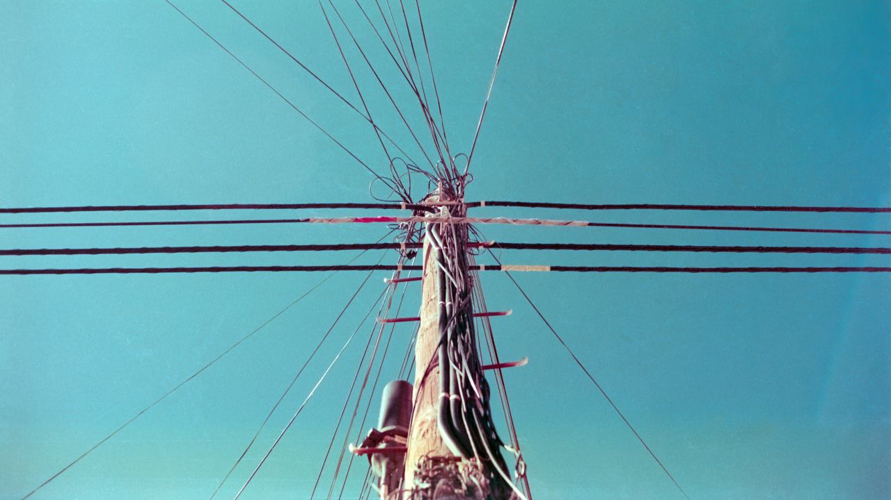
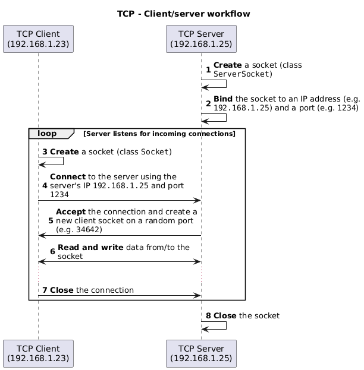
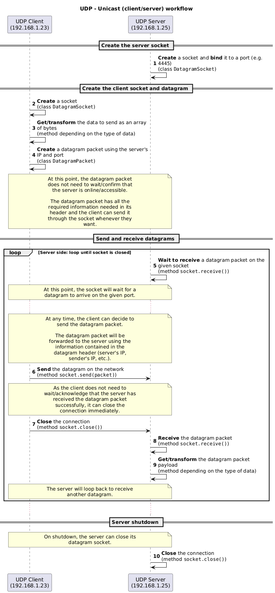
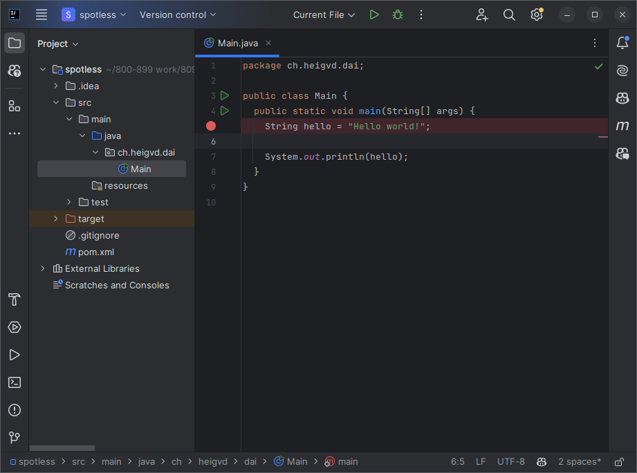
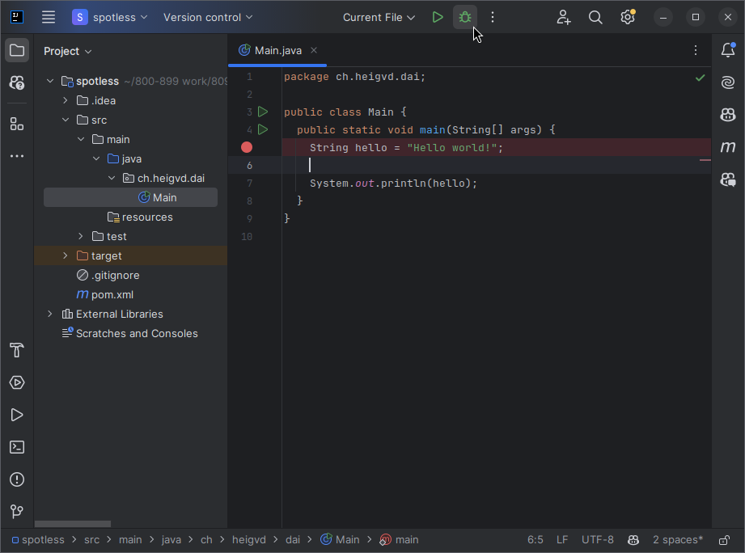
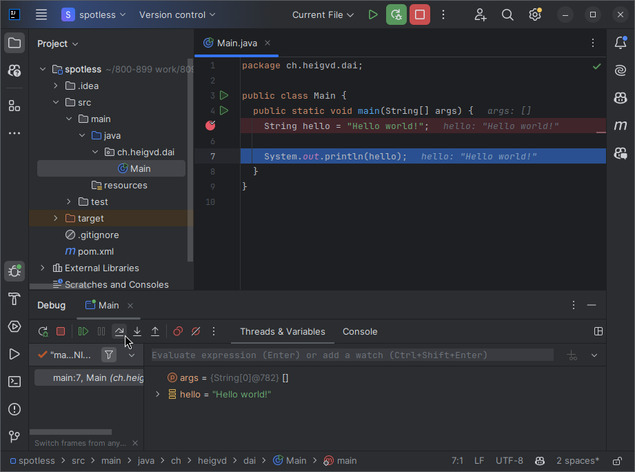
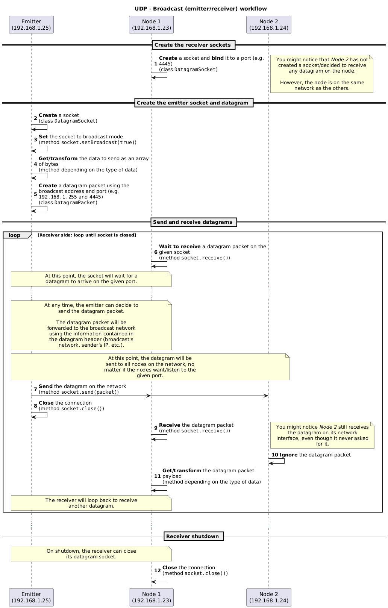
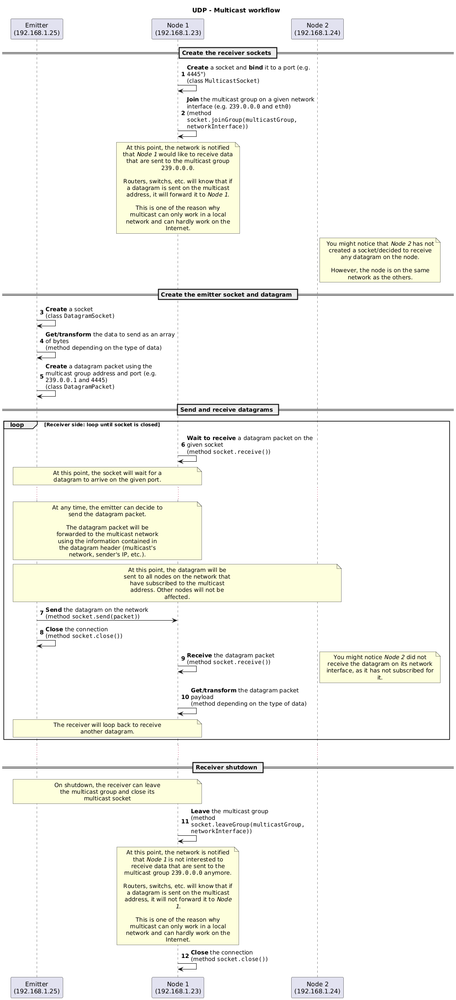
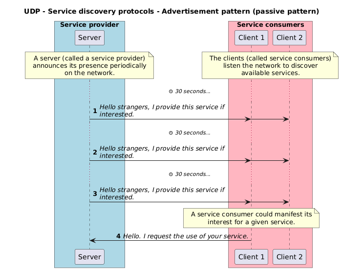
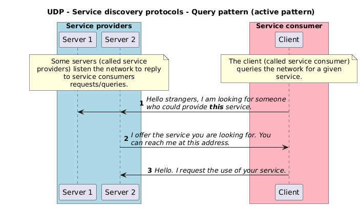

# Java TCP and UDP programming



L. Delafontaine and H. Louis, with the help of
[GitHub Copilot](https://github.com/features/copilot).

Based on the original course by O. Liechti and J. Ehrensberger.

This work is licensed under the [CC BY-SA 4.0][license] license.

## Resources

- Objectives, teaching and learning methods, and evaluation methods:
  [Link to content](..)
- Course material: [Link to content](../01-course-material/README.md) ·
  [Presentation (web)](<https://heig-vd-dai-course.github.io/heig-vd-dai-course/07.01-java-tcp-and-udp-programming-(1-of-2)/01-course-material/index.html>)
  ·
  [Presentation (PDF)](<https://heig-vd-dai-course.github.io/heig-vd-dai-course/07.01-java-tcp-and-udp-programming-(1-of-2)/01-course-material/07.01-java-tcp-and-udp-programming-(1-of-2)-presentation.pdf>)
- Code examples: [Link to content](../02-code-examples/)
- Solution: [Link to content](../03-solution/)

## Table of contents

- [Resources](#resources)
- [Table of contents](#table-of-contents)
- [Objectives](#objectives)
- [Part 1/2](#part-12)
  - [Explore the code examples](#explore-the-code-examples)
  - [The Socket API](#the-socket-api)
  - [TCP](#tcp)
  - [UDP](#udp)
  - [Practical content](#practical-content)
- [Part 2/2](#part-22)
  - [Explore the code examples](#explore-the-code-examples-1)
  - [Unicast, broadcast and multicast](#unicast-broadcast-and-multicast)
  - [Messaging patterns](#messaging-patterns)
  - [Service discovery protocols](#service-discovery-protocols)
  - [Read-eval-print loop (REPL)](#read-eval-print-loop-repl)
  - [Summary of differences between TCP and UDP](#summary-of-differences-between-tcp-and-udp)
  - [Practical content](#practical-content-1)
- [Go further](#go-further)
  - [Implement the _"Guess the number"_ game](#implement-the-guess-the-number-game)
  - [Implement the _"Temperature monitoring"_ application](#implement-the-temperature-monitoring-application)
- [Conclusion](#conclusion)
  - [What did you do and learn?](#what-did-you-do-and-learn)
  - [Test your knowledge](#test-your-knowledge)
- [Finished? Was it easy? Was it hard?](#finished-was-it-easy-was-it-hard)
- [Additional resources](#additional-resources)
- [Solution](#solution)
- [Optional content](#optional-content)
  - [Variable length data](#variable-length-data)
- [Sources](#sources)

## Objectives

As you have seen in previous courses, applications communicate with each other
using application protocols.

In this course, you will learn how to implement such communication by
programming your own TCP and UDP clients and servers (or emitters and receivers)
in Java.

This will allow you to create your own network applications, such as a chat
server, a file server, a web server, a real-time multiplayer game server, etc.

In other words, now that you understand how application protocols work, you will
learn how to put them into practice using TCP and UDP in Java.

In a nutshell, at the end of this course, you will be able to:

- Program your own TCP client/server applications in Java with the Socket API.
- Process data from TCP streams.
- Program your own UDP emitter/receiver applications in Java with the Socket
  API.
- Process data from UDP datagrams.
- Learn the different ways to send a UDP datagram to one or multiple clients.
- How UDP can be used for service discovery.
- Make usage of a REPL.

## Part 1/2

In this first part, you will learn the basics of TCP and UDP programming in
Java.

### Explore the code examples

Individually, or in pair/group, **take 15 minutes to explore and discuss the
code examples (part 1/2)** provided in the
[`heig-vd-dai-course/07.01-java-tcp-and-udp-programming-(1-of-2)/02-code-examples`](../02-code-examples/)
directory.

Do not forget to clone the repository or pull the latest changes to get the code
examples.

Try to answer the following questions:

- How do the code examples work?
- What are the main takeaways of the code examples?
- What are the main differences between the code examples?

You can use the following theoretical content to help you.

### The Socket API

The Socket API is a Java API that allows you to create TCP and UDP network
applications.

It is described in the
[`java.net` package](https://docs.oracle.com/en/java/javase/21/docs/api/java.base/java/net/package-summary.html)
in the
[`java.base` module](https://docs.oracle.com/en/java/javase/21/docs/api/java.base/module-summary.html).

It has originally been developed in C in the context of the Unix operating
system by Berkeley University. It has been ported to Java and is now available
on many platform and languages.

The Socket API provides a simple API to create TCP and UDP network applications.

### TCP

TCP is a transport protocol. It is used to transfer data between two
applications.

TCP is a connection-oriented protocol: a connection must be established between
the two applications before data can be exchanged in a bidirectional way.

TCP can only do unicast: one client can communicate with one other server at the
same time. To communicate with multiple servers a client has to establish a 
separate TCP connection with each server.

TCP is considered as a reliable protocol as data sent is guaranteed to be
received by the other side. If data is lost (for example due to network issues),
it will be retransmitted until it is received.

A good analogy is to think of TCP as a phone call: you must first establish a
connection with the other person before you can talk to them. Once the
connection is established, you can talk to the other person and they will hear
everything you say. If they did not hear you well, you can repeat what you said
until they hear you. They can, of course, also talk to you.

TCP is a stream-oriented protocol: data is sent as a stream of bytes. The
application must split the data into segments. Each segment is identified by a
sequence number.

TCP segments are encapsulated in IP packets, called payloads.

Thanks to the sequence numbers, TCP is able to reassemble the segments in the
correct order. If a segment is lost, TCP will retransmit it.

#### TCP in the Socket API

The Socket API provides classes to create TCP sockets.

To make it simple, a TCP socket is just like a file that you can open, read
from, write to and close. To exchange data, TCP sockets on both sides must be
connected. The processing is the same as with files, seen in the
[Java IOs](../../02.01-java-ios/) course.

A TCP socket is identified by an IP address and a port number.

A TCP socket can act as a client or as a server:

- A TCP socket accepting connections is called a server socket (class
  [`ServerSocket`](https://docs.oracle.com/en/java/javase/21/docs/api/java.base/java/net/ServerSocket.html)).
- A TCP socket initiating a connection is called a client socket (class
  [`Socket`](https://docs.oracle.com/en/java/javase/21/docs/api/java.base/java/net/Socket.html)).

The following schema shows the workflow of a TCP client/server application:



#### Processing data from streams

Sockets use data streams to send and receive data, just like files.

You get an input stream to read data from a socket and an output stream to write
data to a socket:

```java
// Get input stream
input = socket.getInputStream();

// Get output stream
output = socket.getOutputStream();
```

You can then decorate the input and output streams with other streams to process
the data, just as with IOs:

```java
// Get input stream as text
input = new InputStreamReader(socket.getInputStream(), StandardCharsets.UTF_8);

// Get output stream as text
output = new OutputStreamWriter(socket.getOutputStream(), StandardCharsets.UTF_8);
```

Use buffered streams to improve performance:

```java
// Get input stream as binary with buffer
input = new BufferedInputStream(socket.getInputStream());

// Get output stream as binary with buffer
output = new BufferedOutputStream(socket.getOutputStream());
```

> [!IMPORTANT]
>
> Do not forget to flush the output stream after writing data to it. Otherwise,
> the remaining data in the buffer will not be sent to the other application!
>
> ```java
> out.flush();
> ```
>
> Also, do not forget all the good practices seen in the
> [Java IOs](../../02.01-java-ios/) course (encoding, buffering, etc.). They
> must be applied here too!

### UDP

UDP is a transport layer protocol, just like TCP. It is used to send data over
the network. However, there are numerous differences between TCP and UDP.

UDP is a connectionless protocol, which means that it does not require to
establish a connection before sending data.

UDP does not provide any reliability mechanism, meaning it does not guarantee
that the data will be received by the receiver at all, nor that the data will be
received in the same order as it was sent.

A good analogy is to think of UDP as the postal service with postcards: you
write multiple postcards and send them to someone. You do not know if the
postcards will be received nor if they will arrive in the same order as they
were sent. You do not know if the postcards will be received at all if the
postal service loses them.

Just as with postcards, UDP is used when reliability is not required.

#### UDP datagrams

Unlike TCP, UDP is not a stream protocol. It is a datagram protocol. It means
that UDP sends data in discrete chunks called _"datagrams"_.

Datagrams are like the postcards in the previous analogy. They are sent
independently from each other and they are not related to each other. They
contain a destination address, a payload and the sender address. If you need to,
you can use the sender address to reply to the sender.

UDP datagrams are composed of a header and a payload. The header contains
information about the datagram, such as the source and destination port. The
payload contains the data to send.

The size of the payload is limited to 65,507 bytes. It is because the payload
length is encoded on 16 bits in the header.

The payload of a UDP datagram can be a notification, a request, a query, a
response, etc. It is up to the application to define the payload format.

If the payload is too large, the datagram will be fragmented. It means that the
payload will be split into multiple datagrams. The receiver will have to
reassemble the datagrams to get the original payload.

#### Reliability

As UDP does not provide any reliability mechanism, it is up to the application
to implement it. For example, the application can implement a mechanism to
acknowledge the reception of a datagram and ask for retransmission if some parts
of the data was not received.

What is offered by default with TCP has to be implemented by the application
with UDP.

In certain cases, reliability is not required. Some applications are tolerant to
data loss.

For example, streaming can be a perfect use case for UDP. If a datagram is lost,
it does not matter much: the receiver will receive the next datagram and the
stream will continue. A good example would be the streaming of a live event on
your television:

- If a few datagrams are lost, the receiver might notice it with a few glitches
  (video artifacts) but it will not affect the entire stream.
- If too many datagrams are lost, the receiver will not be able to reassemble
  the payload and the stream will stop.

Some video services such as [Jitsi](https://jitsi.org/) (an open source
Zoom/Google Meet/Teams alternative) can make usage of the UDP protocol with the
help of [WebRTC](https://webrtc.org/). However, even these applications might
prefer to make usage of the TCP protocol to guarantee the reliability of their
services.

The game [Factorio](https://www.factorio.com/) (a video game where you build and
manage factories) is another good example of an application that makes use of
the UDP protocol when playing on a multiplayer server:

> Factorio uses UDP only. The game builds its own "reliable delivery" layer
> built on UDP to deal with packet loss and reordering issues.
>
> <https://wiki.factorio.com/Multiplayer>

As mentioned before, it is up to the application to implement a reliability
mechanism if required (with a message ID and an acknowledgement for example,
just as TCP).

We can illustrate this with the following example:

You have developed a very simple application protocol where clients can send
`INCREMENT` and `DECREMENT` commands to increment/decrement a counter on the
server. The counter is shared between all clients.

If the clients send 10 `INCREMENT` commands, the counter should be incremented
by 10.

In a perfect world, the server would receive 10 `INCREMENT` commands and the
counter would be incremented by 10.

However, we know one of the datagrams could be lost. If the server receives 9
`INCREMENT` commands, the counter will be incremented by 9 instead of 10.

Both parties (the client and the server) could implement a reliability mechanism
to solve this issue.

This mechanism could acknowledge the reception of a datagram. If a client does
not receive an acknowledgement _within a specific period_, it should retransmit
the datagram.

However, even the acknowledgement could be lost. The client could retransmit the
datagram multiple times and the server could receive it multiple times.

The server could implement a mechanism to detect duplicate datagrams and ignore
them. It could also implement a mechanism to detect out-of-order datagrams and
reorder them.

Handling reliability is quite challenging. In the context of this teaching unit,
reliability is not required. We can assume the network will never fail. We will
focus on the UDP protocol itself and not on the reliability mechanism(s).

If you are interested, you can have a look at the
[Automatic Repeat reQuest (ARQ)](https://en.wikipedia.org/wiki/Automatic_repeat_request)
protocol. It is a mechanism used to detect and retransmit lost datagrams.

#### UDP in the Socket API

As seen with TCP, the Socket API is a Java API that allows you to create servers
and clients. The Socket API also allows you to create UDP emitters (clients) and
receivers (servers).

The Socket API is described in the
[`java.net` package](https://docs.oracle.com/en/java/javase/21/docs/api/java.base/java/net/package-summary.html)
in the
[`java.base` module](https://docs.oracle.com/en/java/javase/21/docs/api/java.base/module-summary.html).

In the UDP world, the `Socket` class is replaced by the
[`DatagramSocket`](https://docs.oracle.com/en/java/javase/21/docs/api/java.base/java/net/DatagramSocket.html)
class.

The `DatagramSocket` class is used to create UDP clients and servers. It is used
to send and receive UDP datagrams.

A datagram is created with the
[`DatagramPacket`](https://docs.oracle.com/en/java/javase/21/docs/api/java.base/java/net/DatagramPacket.html)
class. It is used to create a datagram with a payload and a destination address.

A multicast socket is created with the
[`MulticastSocket`](https://docs.oracle.com/en/java/javase/21/docs/api/java.base/java/net/MulticastSocket.html)
class. It is used to create a multicast datagram with a payload and a multicast
address, allowing multiple hosts to receive the datagram, just like a message
sent to a group of people.

UDP can be used to create a client-server architecture. However, it is not
required. It is possible to create a peer-to-peer architecture with UDP.

The following schema shows the workflow of a UDP unicast (client/server)
application:



#### Processing data from datagrams

A datagram contains a payload. The payload is a byte array. You can convert it
to a string or any other data type.

You can create a datagram with a byte array as payload:

```java
// Create a datagram with a payload and a destination address
byte[] buffer = "Hello, World!".getBytes(StandardCharsets.UTF_8);
DatagramPacket packet = new DatagramPacket(buffer, buffer.length, InetAddress.getByName("localhost"), 1234);
```

You can get the payload of a received datagram as a byte array:

```java
// Create a datagram to receive data
byte[] buffer = new byte[1024];
DatagramPacket packet = new DatagramPacket(buffer, buffer.length);

// Receive a datagram
socket.receive(packet);

// Get the payload of the datagram
byte[] data = packet.getData();
int length = packet.getLength();
String message = new String(data, 0, length, StandardCharsets.UTF_8);
```

### Practical content

#### Learn to use the debugger

Every decent IDE has a debugger. The debugger is a tool that allows you to
inspect the state of your program at runtime.

The debugger allows you to:

- Set breakpoints: a breakpoint is a point in your code where the program will
  stop when it is reached.
- Step through your code: you can step through your code line by line to see
  what is happening.
- Inspect variables and expressions: you can inspect the value of variables and
  expressions at runtime.

The debugger is a powerful tool to understand what is happening in your program.

In IntelliJ IDEA, set a breakpoint by clicking on the left side of the line
number, as shown in the following screenshot:



Then, run the program in debug mode by clicking on the bug icon, as shown in the
following screenshot:



The program will stop at the breakpoint. You can then use the debugger to step
through the code, inspect variables and expressions, etc., as shown in the
following screenshot:



Take some time to learn how to use the debugger in your favorite IDE, this is a
very useful tool.

#### TCP & UDP - Execute the code examples

Return to the code examples and take some time to execute them, understand them
and see the results. Use the debugger to step through the code and see what is
happening.

#### Explore the Java TCP programming template

In this section, you will explore the Java TCP programming template.

This is a simple template that you can use to create your own TCP clients and
servers in Java.

The template is located in the
[`heig-vd-dai-course/heig-vd-dai-course-java-tcp-programming-template`](https://github.com/heig-vd-dai-course/heig-vd-dai-course-java-tcp-programming-practical-content-template).

Take some time to explore the template. Then, try to answer the following
questions:

- How would you use it to create your own TCP clients and servers?
- What are the main takeaways of the template?
- How you would you implement a TCP network application using the template and
  the provided code examples?

You can use the template to create your own TCP network applications.

#### Explore the Java UDP programming template

In this section, you will explore the Java UDP programming template.

This is a simple template that you can use to create your own UDP
emitters/clients and receivers/servers in Java.

The template is located in the
[`heig-vd-dai-course/heig-vd-dai-course-java-udp-programming-template`](https://github.com/heig-vd-dai-course/heig-vd-dai-course-java-udp-programming-practical-content-template).

Take some time to explore the template. Then, try to answer the following
questions:

- How would you use it to create your own UDP emitters/clients and
  receivers/servers?
- What are the main takeaways of the template?
- How you would you implement a UDP network application using the template and
  the provided code examples?

You can use the template to create your own UDP network applications.

## Part 2/2

In this second part, you will learn more about UDP and some of its unique
features compared to TCP.

### Explore the code examples

Individually, or in pair/group, **take 15 minutes to explore and discuss the
code examples (part 2/2)** provided in the
[`heig-vd-dai-course/07.01-java-tcp-and-udp-programming-(1-of-2)/02-code-examples`](../02-code-examples/)
directory.

Do not forget to clone the repository or pull the latest changes to get the code
examples.

Try to answer the following questions:

- How do the code examples work?
- What are the main takeaways of the code examples?
- What are the main differences between the code examples?

You can use the following theoretical content to help you.

### Unicast, broadcast and multicast

Unlike TCP, UDP supports three types of communication: unicast, broadcast and
multicast (TCP only supports unicast).

#### Unicast

Unicast is the most common type of communication. It is a one-to-one
communication. It means that a datagram is sent from one host to another host,
just like TCP.


Think of it as a private conversation between two people.

To send a unicast datagram, the sender must know the IP address and port of the
receiver. It is mostly the same as TCP, without all the reliability features
provided by TCP but with all the performance of UDP.


#### Broadcast

Broadcast is a one-to-all communication. It means that a datagram is sent from
one host to all hosts on the network.


Think of it as a public announcement.

To send a broadcast datagram, the sender must know the broadcast address. The
broadcast address is a special address that represents all hosts on the network
and/or all hosts of a specific subnet.

The broadcast address is defined by the subnet mask. The subnet mask is a 32-bit
number. It is represented as four numbers separated by a dot (e.g.
`255.255.255.0`). Sometimes, the subnet mask is represented as a single number
(e.g. `/24` for `255.255.255.0` as 24 bits are set to `1`).

A good example is stated in the following table (source:
<https://en.wikipedia.org/wiki/Broadcast_address>):

| Network IP address breakdown for `172.16.0.0/12`                                                                                                                                                                                                                                  | Binary form                             | Dot-decimal notation |
| --------------------------------------------------------------------------------------------------------------------------------------------------------------------------------------------------------------------------------------------------------------------------------- | --------------------------------------- | -------------------- |
| 1. Network IP Address                                                                                                                                                                                                                                                             | 10101100.0001**0000.00000000.00000000** | 172.16.0.0           |
| 2. Subnet Mask, or just "Netmask" for short (The `/12` in the IP address in this case means only the left-most 12 bits are `1`s, as shown here. This reserves the left 12 bits for the network address (prefix) and the right `32 - 12 = 20` bits for the host address (suffix).) | 11111111.1111**0000.00000000.00000000** | 255.240.0.0          |
| 3. Bit Complement (Bitwise NOT) of the Subnet Mask                                                                                                                                                                                                                                | 00000000.0000**1111.11111111.11111111** | 0.15.255.255         |
| 4. Broadcast address (Bitwise OR of _Network IP Address_ and _Bit Complement of the Subnet Mask_. This makes the broadcast address the _largest possible IP address (and host address, since the host address portion is all `1`s) for any given network address._)               | 10101100.0001**1111.11111111.11111111** | 172.31.255.255       |

If you want to send a broadcast to all devices on all network subnets, you can
use the `255.255.255.255` broadcast address.

> [!IMPORTANT]  
> You must be aware that there can be restrictions on the use of broadcast. For
> example, broadcast is limited to the local network but can still be blocked by
> a firewall and/or a router.



#### Multicast

Multicast is a one-to-many communication. It means that a datagram is sent from
one host to multiple hosts.


Think of it as a group conversation.

To send a multicast datagram, the sender uses a multicast address. The multicast
address is a special address that represents a group of hosts on the network.
Think of it as a radio channel or a Discord channel: everyone on the channel
will receive the messages sent in a given channel.

Multicast addresses are specific IP addresses in the range from `224.0.0.0` to
`239.255.255.255` for IPv4 and `f00::/8` for IPv6.

Just as for ports, some multicast addresses are reserved for specific purposes.
A complete list is available on the
[IANA website](https://www.iana.org/assignments/multicast-addresses/multicast-addresses.xhtml)
and further described in the
[RFC 5771](https://datatracker.ietf.org/doc/html/rfc5771).

For local networks, the multicast range is from the **Administratively Scoped
Bloc** of the RFC. More details are available in the
[RFC 2365](https://datatracker.ietf.org/doc/html/rfc2365).

Any multicast addresses in the range `239.0.0.0` to `239.255.255.255` can be
used for your own applications.

Just as for broadcast, the sender must know the multicast address to send a
datagram to a multicast group. Just as for broadcast as well, there can be
restrictions on the use of multicast.



Multicast is quite guaranteed **not** to work on the public Internet. It is only
guaranteed to work on a local network. If you need to use multicast between
multiple networks, you must use a tunnel such as a virtual private network (VPN)
to bypass this restriction.

Multicast is presented in this teaching unit because it is an important concept
in service discovery protocols. However, you must be aware that it is quite not
possible to use multicast on the public Internet, thus it greatly limits its
usage.

In this teaching unit, if you decide to use multicast, we assume you will use it
on a (reliable) local network.

Also, Multicast is a complex topic. It is not covered in depth in this teaching
unit. For a deeper understanding of possible usages of multicast on the
Internet, you can read the following resources:

- [IP multicast](https://en.wikipedia.org/wiki/IP_multicast)
- [Internet Group Management Protocol](https://en.wikipedia.org/wiki/Internet_Group_Management_Protocol)
- [Internet Protocol television](https://en.wikipedia.org/wiki/Internet_Protocol_television)

### Messaging patterns

As UDP does not provide a connection mechanism, it is up to the application to
define the messaging pattern (how to send and receive data).

There are two common messaging patterns: fire-and-forget and request-response.

The fire-and-forget pattern is the simplest messaging pattern. It is a one-way
communication. It means that a datagram is sent from one host to another host
without expecting a response.

The fire-and-forget pattern is used when the sender does not need to know if the
datagram was received or not.

The request-response (sometimes called request-reply) pattern is a two-way
communication. It means that a datagram is sent from one host to another host
and a response is expected.

When creating a datagram, it is possible to specify a port. While not mandatory,
this port can be used by the receiver to know whom to reply to.

If no port is specified, the operating system will simply assign a random port
for the out going datagram.

The receiver of the datagram can then extract the sender's IP address and port
and use them to reply to the sender using unicast.

The request-response pattern can be used when the sender needs to know if the
datagram was received or not.

Both sides of the communication can send a request and receive a response.

### Service discovery protocols

With unicast, the sender must know who the receiver is; the sender must know the
IP address of the receiver.

With broadcast and multicast, the sender does not need to know who the receivers
are; the sender does not need to know the IP address of the receivers. The
sender knows that nodes nearby (or those who expressed interest in the
broadcast) will receive the datagram.

Using this property, it is possible to create service discovery protocols.

Service discovery protocols are used to discover services on the network. They
are used to find services without knowing their IP address.

There are two types of service discovery protocols: passive and active.

Passive service discovery protocols are based on broadcast or multicast. They
are used to announce the presence of a service on the network.

Active service discovery protocols are also based on broadcast or multicast but
then switch to unicast. They are used to query the network to find a service.

There are many service discovery protocol patterns. The most common are the
following:

- Advertisement - A passive discovery protocol pattern: a server (called a
  service provider) announces its presence on the network. The service provider
  sends a broadcast or multicast datagram to announce its presence. The datagram
  contains information about the service (name, IP address, port, etc.). The
  datagram is sent periodically to announce that the service is still available.

  The clients (called service consumers) listen to the broadcast or multicast
  datagrams to discover the services on the network.

  If a service consumer is interested by the service provider announcement, it
  can manifest its interest.

  

- Query - An active discovery protocol pattern: a client (called a service
  consumer) queries the network to find a service. The client sends a multicast
  or broadcast datagram on the network to request information about a service.

  If a service that provides the requested service (called a service provider)
  is available, it replies with a unicast datagram containing the requested
  information to connect to the service, just as seen with the request-response
  messaging pattern.

  

These patterns can still be used with other protocols such as TCP.

### Read-eval-print loop (REPL)

In order to run multiple commands/actions on the server without closing the
connection, you can use what is called a
[read-eval-print loop (REPL)](https://en.wikipedia.org/wiki/Read%E2%80%93eval%E2%80%93print_loop).

To make it simple, a REPL is simply a loop that will ask the user to input
commands. The loop will then execute the command and display the result. The
loop will continue until the user decides to exit the loop.

In the context of a server, the server will wait for the client to send a
command. The server will then execute the command and send the result back to
the client. The server will continue to wait for the client to send a new
command without closing the connection.

On the client side, the client can interact with the server by sending commands
to the server until they decide to close the connection.

Both the client and the server can close the connection at any time. It is up to
the developer to decide when and who manage to close the connection.

### Summary of differences between TCP and UDP

The following table summarizes the differences between TCP and UDP.

| TCP                                 | UDP                                        |
| ----------------------------------- | ------------------------------------------ |
| Connection-oriented                 | Connectionless                             |
| Reliable                            | Unreliable                                 |
| Stream protocol                     | Datagram protocol                          |
| Unicast                             | Unicast, broadcast and multicast           |
| Request-response                    | Fire-and-forget, request-response (manual) |
| -                                   | Service discovery protocols                |
| Used for FTP, HTTP, SMTP, SSH, etc. | Used for DNS, streaming, gaming, etc.      |

### Practical content

#### TCP & UDP - Execute the code examples

Return to the code examples and take some time to execute them, understand them
and see the results. Use the debugger to step through the code and see what is
happening.

#### Update your application protocols

Now that you have gained new knowledge regarding TCP and UDP, update the
application protocols you have created for the _"Guess the number"_ game and the
_"Temperature monitoring"_ application seen in the
[Define an application protocol](../../06.01-define-an-application-protocol/)
course.

You can check the official solutions in the
[Define an application protocol](../../06.01-define-an-application-protocol/)
course.

#### TCP - Try to access the TCP server from multiple TCP clients at the same time

Try to access the TCP server from multiple TCP clients at the same time (start
the client multiple times from the example _"TCP REPL client/server example"_).
You will see that the server can only handle one client at a time.

Do you have any idea why? You will find the answer in a future chapter but you
can try to find it by yourself now. Discuss with your peers if needed to share
your findings.

#### UDP - Try to emit from multiple UDP emitters at the same time

Try to emit from multiple UDP emitters at the same time (start the emitter
multiple times from the example _"UDP fire-and-forget messaging pattern
example"_). You will see that the server will receive all messages from the
emitters.

Do you have any idea why? How does it compare to the TCP examples you just have
seen?

You will find the answer in a future chapter but you can try to find it by
yourself now. Discuss with your peers if needed to share your findings.

## Go further

This is an optional section. Feel free to skip it if you do not have time.

### Implement the _"Guess the number"_ game

Implement the _"Guess the number"_ game using the application protocol you have
made from the
[Define an application protocol](../../06.01-define-an-application-protocol/)
course.

You can use the application protocol you have made or the one provided in the
solution if you have not done it.

Use the template and the code examples you just explored to help you implement
the game.

When you create a new repository, you can choose to use a template. Select the
`heig-vd-dai-course/heig-vd-dai-course-java-tcp-programming-practical-content`
template.

> [!WARNING]
>
> Please make sure that the repository owner is your personal GitHub account and
> not the `heig-vd-dai-course` organization.

#### Dockerize the application

Using the Docker knowledge you have acquired in the
[Docker and Docker Compose](../../04.01-docker-and-docker-compose/) course,
dockerize the application.

The steps to dockerize the application are the following:

- Create a `Dockerfile` for the application
- Publish the application to GitHub Container Registry

You should then be able to run the server and the client in Docker containers
and access the server from the client using the following commands:

```sh
# Start the server
docker run --rm -it --name the-server <docker-image-tag> server

# Start the client and access the server container
docker run --rm -it <docker-image-tag> client --host the-server
```

> [!NOTE]
>
> I (Ludovic) was not able to test these commands thoroughly. You might need to
> adapt them to make them work. If something does not work, feel free to tell me
> so I can update the commands.

The `--name` sets the name of the container as well as the hostname of the
container. This allows to access the server container using its hostname from
the client.

You might notice that no ports are published to the host. As both container run
on Docker, they share the same network bridge. They can thus communicate
together without passing by the host.

#### Compare your solution with the official one

Compare your solution with the official one stated in the [Solution](#solution)
section.

#### Go one step further

- Can you update the network application to allow the client to specify the
  range of the number to guess before starting the game?
- Can you implement the "_Temperature monitoring_" application with TCP?

### Implement the _"Temperature monitoring"_ application

Implement the _"Temperature monitoring"_ game using the application protocol you
have made from the
[Define an application protocol](../../06.01-define-an-application-protocol/)
course.

You can use the application protocol you have made or the one provided in the
solution if you have not done it.

Use the template and the code examples you just explored to help you implement
the game.

When you create a new repository, you can choose to use a template. Select the
`heig-vd-dai-course/heig-vd-dai-course-java-udp-programming-practical-content`
template.

> [!WARNING]
>
> Please make sure that the repository owner is your personal GitHub account and
> not the `heig-vd-dai-course` organization.

#### Dockerize the application

Using the Docker knowledge you have acquired in the
[Docker and Docker Compose](../../04.01-docker-and-docker-compose/) course,
dockerize the application.

The steps to dockerize the application are the following:

- Create a `Dockerfile` for the application
- Publish the application to GitHub Container Registry

You should then be able to run the emitter, the receiver and the operator in
Docker containers and access the receiver from the operator using the following
commands:

```sh
# Start the emitter
docker run --rm -it <docker-image-tag> emitter

# Start the receiver
docker run --rm -it --name the-receiver <docker-image-tag> receiver --network-interface eth0

# Start the operator and access the receiver container
docker run --rm -it <docker-image-tag> operator --host the-receiver
```

> [!NOTE]
>
> I (Ludovic) was not able to test these commands thoroughly. You might need to
> adapt them to make them work. If something does not work, feel free to tell me
> so I can update the commands.

The `--name` sets the name of the container as well as the hostname of the
container. This allows to access the receiver container using its hostname from
the operator.

You might notice that no ports are published to the host. As both container run
on Docker, they share the same network bridge. They can thus communicate
together without passing by the host.

#### Compare your solution with the official one

Compare your solution with the official one stated in the [Solution](#solution)
section.

#### Go one step further

- Can you update the application protocol to allow the operator to have the
  latest temperature for a given room or the average temperature of that room?
  - **Tip**: this will require to store all the temperatures received for a
    given room and to calculate the average temperature instead of storing only
    the latest temperature.
- Can you implement the "_Guess the number_" game with UDP?

## Conclusion

### What did you do and learn?

In this chapter, you have learned how to use the Socket API to create your own
TCP clients and servers in Java.

You have also learned how to use the UDP protocol to build different kind of
network applications and the differences between TCP and UDP.

Congratulations! It is a big step forward!

You are now able to create your own network applications, such as a chat server,
a file server, a web server, etc.

Using Java and Docker and Docker Compose, you were able to containerize your
network application to use it anywhere.

As for now, only one TCP client can access the TCP server at the same time. You
will see in a future course how to manage multiple clients at the same time!

### Test your knowledge

At this point, you should be able to answer the following questions:

- What is a socket?
- What is the difference between a server socket and a client socket?
- How do sockets compare to files?
- Why is TCP considered as a reliable protocol?
- What are the differences between UDP and TCP?
- Why is UDP unreliable? How to mitigate this?
- What is a datagram? How can a datagram be sent without a server listening?
- What are the differences between unicast, broadcast and multicast?
- What are the messaging protocols and their differences?
- What are the service discovery protocols? How do they compare to each other?

## Finished? Was it easy? Was it hard?

Can you let us know what was easy and what was difficult for you during this
chapter?

This will help us to improve the course and adapt the content to your needs. If
we notice some difficulties, we will come back to you to help you.

> [!NOTE]
>
> Vous pouvez évidemment poser toutes vos questions et/ou vos propositions
> d'améliorations en français ou en anglais.
>
> N'hésitez pas à nous dire si vous avez des difficultés à comprendre un concept
> ou si vous avez des difficultés à réaliser les éléments demandés dans le
> cours. Nous sommes là pour vous aider !

➡️ [GitHub Discussions][discussions]

You can use reactions to express your opinion on a comment!

## Additional resources

_Resources are here to help you. They are not mandatory to read._

- _None yet_

_Missing item in the list? Feel free to open a pull request to add it! ✨_

## Solution

You can find the solution to the practical content in the
[`solution`](../03-solution/) directory.

If you have any questions about the solution, feel free to ask as described in
the [Finished? Was it easy? Was it hard?](#finished-was-it-easy-was-it-hard)
section.

## Optional content

The following content is optional. It is here to help you and for your general
knowledge.

### Variable length data

Depending on the application protocol, the data sent can have a variable length.

There are two ways to handle variable length data:

1. Use a delimiter.
2. Use a fixed length.

If the data has a delimiter, you can use a buffered reader to read the data
until the delimiter is found.

```java
// End of transmission character
String EOT = "\u0004";

// Read data until the delimiter is found
String line;
while ((line = in.readLine()) != null && !line.equals(EOT)) {
  System.out.println(
    "[Server] received data from client: " + line
  );
}
```

If the data has a fixed length, you must send the length of the data before
sending the data itself.

```java
// Send the length of the data
out.write("DATA_LENGTH " + data.length() + "\n");

// Send the data
out.write(data);
```

```java
// Read the length of the data
String[] parts = in.readLine().split(" ");
int dataLength = Integer.parseInt(parts[1]);

// Read the data
for (int i = 0; i < dataLength; i++) {
  System.out.print((char) in.read());
}
```

## Sources

- Main illustration by [Carl Nenzen Loven](https://unsplash.com/@archduk3) on
  [Unsplash](https://unsplash.com/photos/N8GdKC4Rcvs)

[license]:
	https://github.com/heig-vd-dai-course/heig-vd-dai-course/blob/main/LICENSE.md
[discussions]: https://github.com/orgs/heig-vd-dai-course/discussions/116
