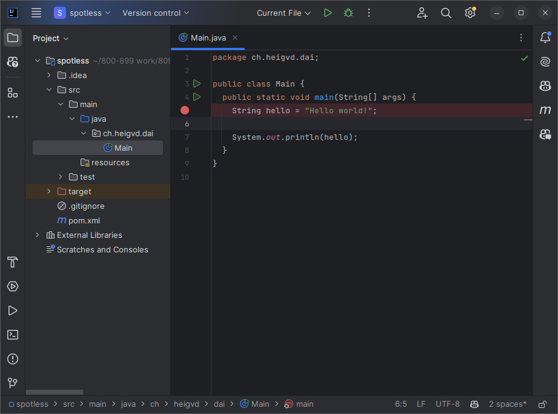
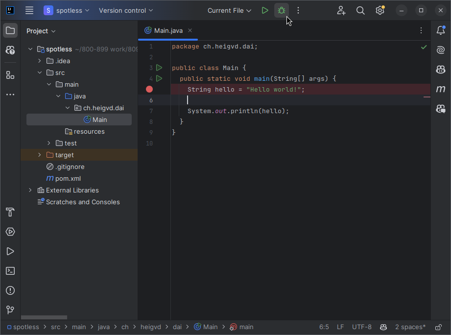
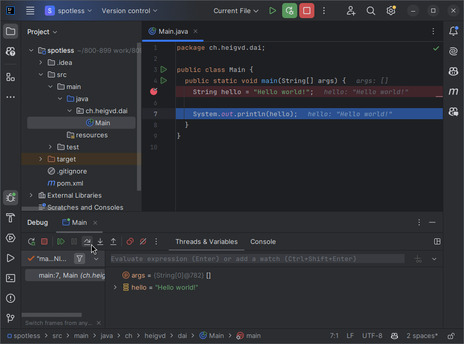

[markdown]:
	https://github.com/heig-vd-dai-course/heig-vd-dai-course/blob/main/13-java-udp-programming/COURSE_MATERIAL.md
[pdf]:
	https://heig-vd-dai-course.github.io/heig-vd-dai-course/13-java-udp-programming/13-java-udp-programming-course-material.pdf
[license]:
	https://github.com/heig-vd-dai-course/heig-vd-dai-course/blob/main/LICENSE.md
[discussions]: https://github.com/orgs/heig-vd-dai-course/discussions/120
[illustration]: ./images/main-illustration.jpg

# Java UDP programming - Course material

<https://github.com/heig-vd-dai-course>

[Markdown][markdown] · [PDF][pdf]

L. Delafontaine and H. Louis, with the help of
[GitHub Copilot](https://github.com/features/copilot).

Based on the original course by O. Liechti and J. Ehrensberger.

This work is licensed under the [CC BY-SA 4.0][license] license.

![Main illustration][illustration]

## Table of contents

- [Table of contents](#table-of-contents)
- [Objectives](#objectives)
- [Explore the code examples](#explore-the-code-examples)
- [UDP](#udp)
- [Differences between TCP and UDP](#differences-between-tcp-and-udp)
- [UDP datagrams](#udp-datagrams)
- [Reliability](#reliability)
- [UDP in the Socket API](#udp-in-the-socket-api)
- [Unicast, broadcast and multicast](#unicast-broadcast-and-multicast)
  - [Unicast](#unicast)
  - [Broadcast](#broadcast)
  - [Multicast](#multicast)
- [Messaging patterns](#messaging-patterns)
- [Service discovery protocols](#service-discovery-protocols)
- [Practical content](#practical-content)
  - [Execute the code examples](#execute-the-code-examples)
  - [Try to emit from multiple emitters at the same time](#try-to-emit-from-multiple-emitters-at-the-same-time)
  - [Update your application protocol](#update-your-application-protocol)
  - [Learn to use the debugger](#learn-to-use-the-debugger)
  - [Explore the Java UDP programming template](#explore-the-java-udp-programming-template)
  - [Go further](#go-further)
  - [Compare your solution with the official one](#compare-your-solution-with-the-official-one)
- [Conclusion](#conclusion)
  - [What did you do and learn?](#what-did-you-do-and-learn)
  - [Test your knowledge](#test-your-knowledge)
- [Finished? Was it easy? Was it hard?](#finished-was-it-easy-was-it-hard)
- [Additional resources](#additional-resources)
- [Solution](#solution)
- [Sources](#sources)

## Objectives

You have seen and experimented with TCP in the previous chapter. You have seen
that TCP is a connection-oriented protocol. It means that a connection must be
established before sending data.

In this chapter, you will see and experiment with UDP. UDP is mainly used when
reliability is not required. It is used for streaming, gaming, etc.

UDP is sensibly different from TCP and it is important to understand the
differences between the two protocols.

## Explore the code examples

Individually, or in pair/group, **take 15 minutes to explore and discuss the
code examples** provided in the
[`heig-vd-dai-course/heig-vd-dai-course-code-examples`](https://github.com/heig-vd-dai-course/heig-vd-dai-course-code-examples)
repository. Clone it or pull the latest changes to get the code examples.

The code examples are located in the `13-java-udp-programming` directory.

Try to answer the following questions:

- How do the code examples work?
- What are the main takeaways of the code examples?
- What are the main differences between the code examples?

You can use the following theoretical content to help you.

## Practical content

### Execute the code examples

Return to the code examples and take some time to execute them, understand them
and see the results.

### Try to emit from multiple emitters at the same time

Try to emit from multiple emitters at the same time (start the emitter multiple
times). You will see that the server will receive all messages from the
emitters.

Do you have any idea why? How does it compare to the TCP examples you have seen
in the
[Java TCP programming](https://github.com/heig-vd-dai-course/heig-vd-dai-course/tree/main/13-java-udp-programming)
chapter?

You will find the answer in a future chapter but you can try to find it by
yourself now. Discuss with your peers if needed to share your findings.

### Update your application protocol

Now that you have gained new knowledge regarding UDP, update the application
protocol you have created for the _"Temperature monitoring"_ application in the
[Define an application protocol chapter](https://github.com/heig-vd-dai-course/heig-vd-dai-course/tree/main/11-define-an-application-protocol)
chapter to reflect the usage of the UDP protocol.

You can check the official solution in the
[Define an application protocol chapter](https://github.com/heig-vd-dai-course/heig-vd-dai-course/tree/main/11-define-an-application-protocol).

### Learn to use the debugger

Every decent IDE has a debugger. The debugger is a tool that allows you to
inspect the state of your program at runtime.

The debugger allows you to:

- Set breakpoints: a breakpoint is a point in your code where the program will
  stop when it is reached.
- Step through your code: you can step through your code line by line to see
  what is happening.
- Inspect variables and expressions: you can inspect the value of variables and
  expressions at runtime.

The debugger is a powerful tool to understand what is happening in your program.

In IntelliJ IDEA, set a breakpoint by clicking on the left side of the line
number, as shown in the following screenshot:



Then, run the program in debug mode by clicking on the bug icon, as shown in the
following screenshot:



The program will stop at the breakpoint. You can then use the debugger to step
through the code, inspect variables and expressions, etc., as shown in the
following screenshot:



Take some time to learn how to use the debugger in your favorite IDE, this is a
very useful tool.

### Explore the Java UDP programming template

In this section, you will explore the Java UDP programming template.

This is a simple template that you can use to create your own UDP
emitters/clients and receivers/servers in Java.

The template is located in the
[`heig-vd-dai-course/heig-vd-dai-course-java-udp-programming-template`](https://github.com/heig-vd-dai-course/heig-vd-dai-course-java-udp-programming-practical-content-template).

Take some time to explore the template. Then, try to answer the following
questions:

- How would you use it to create your own UDP emitters/clients and
  receivers/servers?
- What are the main takeaways of the template?
- How you would you implement a UDP network application using the template and
  the provided code examples?

You can use the template to create your own UDP network applications.

### Go further

This is an optional section. Feel free to skip it if you do not have time.

#### Implement the _"Temperature monitoring"_ application

Implement the _"Temperature monitoring"_ game using the application protocol you
have made from the
[Define an application protocol chapter](https://github.com/heig-vd-dai-course/heig-vd-dai-course/tree/main/11-define-an-application-protocol).

You can use the application protocol you have made or the one provided in the
solution if you have not done it.

Use the template and the code examples you just explored to help you implement
the game.

When you create a new repository, you can choose to use a template. Select the
`heig-vd-dai-course/heig-vd-dai-course-java-udp-programming-practical-content`
template.

> [!WARNING]
>
> Please make sure that the repository owner is your personal GitHub account and
> not the `heig-vd-dai-course` organization.

#### Dockerize the application

Using the Docker knowledge you have acquired in the
[Docker and Docker Compose chapter](https://github.com/heig-vd-dai-course/heig-vd-dai-course/tree/main/06-docker-and-docker-compose),
dockerize the application.

The steps to dockerize the application are the following:

- Create a `Dockerfile` for the application
- Publish the application to GitHub Container Registry

You should then be able to run the emitter, the receiver and the operator in
Docker containers and access the receiver from the operator using the following
commands:

```sh
# Start the emitter
docker run --rm -it <docker-image-tag> emitter

# Start the receiver
docker run --rm -it --name the-receiver <docker-image-tag> receiver --network-interface eth0

# Start the operator and access the receiver container
docker run --rm -it <docker-image-tag> operator --host the-receiver
```

> [!NOTE]
>
> I (Ludovic) was not able to test these commands thoroughly. You might need to
> adapt them to make them work. If something does not work, feel free to tell me
> so I can update the commands.

The `--name` sets the name of the container as well as the hostname of the
container. This allows to access the receiver container using its hostname from
the operator.

You might notice that no ports are published to the host. As both container run
on Docker, they share the same network bridge. They can thus communicate
together without passing by the host.

### Compare your solution with the official one

Compare your solution with the official one stated in the [Solution](#solution)
section.

If you have any questions about the solution, feel free to ask as described in
the [Finished? Was it easy? Was it hard?](#finished-was-it-easy-was-it-hard)
section.

#### Go one step further

- Can you update the application protocol to allow the operator to have the
  latest temperature for a given room or the average temperature of that room?
  - **Tip**: this will require to store all the temperatures received for a
    given room and to calculate the average temperature instead of storing only
    the latest temperature.
- Can you implement the "_Guess the number_" game with UDP?

## Conclusion

### What did you do and learn?

In this chapter, you have learned how to use the UPD protocol to build different
kind of network applications and the differences between TCP and UDP.

Using Java and Docker and Docker Compose, you were able to containerize your
network application to use it anywhere.

Just as with TCP, you have now all the knowledge to build bigger and better
network applications. We continue our journey toward network application
programming.

### Test your knowledge

At this point, you should be able to answer the following questions:

- What are the differences between UDP and TCP?
- Why is UDP unreliable? How to mitigate this?
- What is a datagram? How can a datagram be sent without a server listening?
- What are the differences between unicast, broadcast and multicast?
- What are the messaging protocols and their differences?
- What are the service discovery protocols? How do they compare to each other?

## Finished? Was it easy? Was it hard?

Can you let us know what was easy and what was difficult for you during this
chapter?

This will help us to improve the course and adapt the content to your needs. If
we notice some difficulties, we will come back to you to help you.

> [!NOTE]
>
> Vous pouvez évidemment poser toutes vos questions et/ou vos propositions
> d'améliorations en français ou en anglais.
>
> N'hésitez pas à nous dire si vous avez des difficultés à comprendre un concept
> ou si vous avez des difficultés à réaliser les éléments demandés dans le
> cours. Nous sommes là pour vous aider !

➡️ [GitHub Discussions][discussions]

You can use reactions to express your opinion on a comment!

## Additional resources

_Resources are here to help you. They are not mandatory to read._

- _None yet_

_Missing item in the list? Feel free to open a pull request to add it! ✨_

## Solution

You can find the solution to the practical content in the
[`heig-vd-dai-course/heig-vd-dai-course-solutions`](https://github.com/heig-vd-dai-course/heig-vd-dai-course-solutions)
repository.

If you have any questions about the solution, feel free to open an issue to
discuss it!

## Sources

- Main illustration by
  [Possessed Photography](https://unsplash.com/@possessedphotography) on
  [Unsplash](https://unsplash.com/photos/tiNCpHudGrw)
