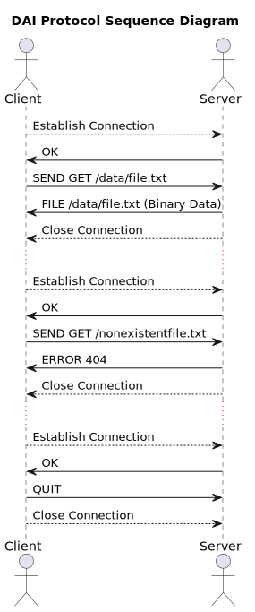

[markdown]:
  https://github.com/heig-vd-dai-course/heig-vd-dai-course/blob/main/09-define-an-application-protocol/COURSE_MATERIAL.md
[pdf]:
  https://heig-vd-dai-course.github.io/heig-vd-dai-course/09-define-an-application-protocol/09-define-an-application-protocol-course-material.pdf
[license]:
  https://github.com/heig-vd-dai-course/heig-vd-dai-course/blob/main/LICENSE.md
[discussions]: https://github.com/orgs/heig-vd-dai-course/discussions/95
[illustration]:
  https://images.unsplash.com/photo-1521587760476-6c12a4b040da?fit=crop&h=720

# Define an application protocol - Course material

<https://github.com/heig-vd-dai-course>

[Markdown][markdown] · [PDF][pdf]

L. Delafontaine and H. Louis, with the help of Copilot.

This work is licensed under the [CC BY-SA 4.0][license] license.

![Main illustration][illustration]

## Table of contents

- [Table of contents](#table-of-contents)
- [Objectives](#objectives)
- [What is an application protocol?](#what-is-an-application-protocol)
- [How is structured an application protocol?](#how-is-structured-an-application-protocol)
- [How to define an application protocol?](#how-to-define-an-application-protocol)
  - [Section 1 - Overview](#section-1---overview)
  - [Section 2 - Transport protocol](#section-2---transport-protocol)
  - [Section 3 - Messages](#section-3---messages)
  - [Section 4 - Examples](#section-4---examples)
- [Reserved ports](#reserved-ports)
- [A quick note on the Unix philosophy and POSIX](#a-quick-note-on-the-unix-philosophy-and-posix)
- [Practical content](#practical-content)
  - [Explore existing application protocols](#explore-existing-application-protocols)
  - [Define your own application protocol](#define-your-own-application-protocol)
  - [Go further](#go-further)
- [Conclusion](#conclusion)
  - [What did you do and learn?](#what-did-you-do-and-learn)
  - [Test your knowledge](#test-your-knowledge)
- [Finished? Was it easy? Was it hard?](#finished-was-it-easy-was-it-hard)
- [What will you do next?](#what-will-you-do-next)
- [Additional resources](#additional-resources)
- [Sources](#sources)

## Objectives

This chapter will help you understand how to understand and define an
application protocol.

An application protocol is a document that is used to define how applications
exchange information between them (usually a between a client and a server). It
is defined by a set of rules that each party must follow to communicate.

In this chapter, you will learn where to find information about application
protocols, how is defined an application protocol and how to define your own
application protocol. In future chapters, you will learn how to interact with
well known application protocol.

## What is an application protocol?

An application protocol is a document that defines how two applications can
communicate.

These documents are usually called RFC (Request For Comments) and are available
on the [IETF website](https://www.ietf.org/), an organization that defines
standards for the Internet (among others).

The name RFC comes from the fact that these documents are usually the result of
a discussion between multiple people. The RFC is a document that is open to
comments and suggestions. It is usually updated multiple times before being
considered as a standard.

An application protocol relies on a transport protocol (TCP or UDP) and a
network protocol (IP). It comes on top of these protocols and defines how
applications can communicate.

Multiple revisions of the same protocol can exist. For example, the HTTP
protocol has multiple revisions (HTTP/1.0, HTTP/1.1, HTTP/2, HTTP/3). Each
revision is defined by a different RFC and has different features.

## How is structured an application protocol?

An application protocol is usually defined by a set of rules that each party
must follow to communicate.

These rules are usually defined in a RFC as messages. The RFC defines the
messages that can be exchanged between the client and the server, the format of
these messages and the order in which they can be exchanged.

For example, the SMTP protocol defines the following messages (among others):

- `HELO`: used to initiate a connection with the server
- `EHLO`: used to initiate a connection with the server (extended version of
  `HELO`)
- `MAIL`: used to specify the sender of the message
- `RCPT`: used to specify the recipient of the message
- `DATA`: used to send the content of the message
- `RSET`: used to reset the connection

Each message has a specific format. For example, the `MAIL` message has the
following format:

```
MAIL FROM:<sender>
```

The `MAIL` message is used to specify the sender of the message. The sender is
specified after the `MAIL FROM:` keyword. You will learn more about the SMTP
protocol in a future chapter to illustrate this example.

A RFC also defines the order in which messages can be or must be exchanged.

This is done using a sequence diagram, depending on the nature/complexity of the
protocol.

A sequence diagram is a diagram that defines the different messages that can be
exchanged between the client and the server and the order in which they can be
exchanged.

An RFC also defines edge cases and error cases, using the same diagrams. It is
important to define these cases to avoid any ambiguity and define how the
protocol should behave in these cases.

## How to define an application protocol?

Defining an application protocol is not an easy task. It requires a lot of
thinking and a lot of testing.

It is also important to keep in mind that a protocol is never perfect. It can
always be improved. It is important to keep an open mind and to be ready to
change the protocol if needed.

The more you think and design your application protocols, the less you will have
to change them in the future and discover issues.

### Section 1 - Overview

This section defines the purpose of the protocol. What is the goal of the
protocol? What is the problem that it tries to solve?

> The DAI protocol is meant to transfer files over the network.
>
> The DAI protocol is a client-server protocol.
>
> The client connects to a server and request a file. The server sends the file
> or an error message if the file does not exist.

### Section 2 - Transport protocol

> The DAI protocol uses the TCP protocol. The server runs on port 55555.
>
> The client has to know the IP address of the server to connect to. It establishes the connection with the server.
>
> The server closes the connection when the transfer is done or if an error
> occurs (e.g. the file was not found).

### Section 3 - Messages

This section defines the messages that can be exchanged between the client and
the server.

> The client can send the following messages:
>
> - `GET <file>`: used to request a file from the server
>   - `<file>`: the name of the file to request - The filename is an absolute
>     path to the file (`/data/file.txt`)
> - `QUIT`: used to close the connection with the server
>
> The server can send the following messages:
>
> - `OK`: used to notify the client that the connection was successful and the
>   server is ready to receive commands
> - `FILE <file>`: used to send the content of the requested file - the
>   connection is closed after this message
> - `ERROR <code>`: used to notify the client that an error occurred - the
>   connection is closed after this message
>   - `400`: the request was malformed
>   - `404`: the file was not found
>
> All messages are UTF-8 encoded and end with a new line character (`\n`).
>
> If the file exists, the server sends the file content as binary data.

### Section 4 - Examples

This section defines examples of messages that can be exchanged between the
client and the server and the exchange order. It is important to define these
examples to illustrate the protocol and to help the reader to understand the
protocol using sequence or state diagrams for example.



## Reserved ports

In computer networking, a port is a communication endpoint. At the software
level, within an operating system, a port is a logical construct that identifies
a specific process or a type of network service. Ports are identified for each
protocol and address combination by 16-bit unsigned numbers, commonly known as
the port number.

Using 16-bit unsigned numbers, the maximum number of ports is 65536. However,
not all ports can be used by anyone. Some ports are reserved for specific
protocols.

The first 0 to 1023 ports are called well-known ports. These ports are reserved
for specific protocols. Using these ports might require special privileges on
Unix systems.

Here is a list of examples for common well-known ports:

- `20` and `21`: FTP
- `22`: SSH
- `23`: Telnet
- `25`, `465` and `587`: SMTP
- `53`: DNS
- `80` and `443`: HTTP/HTTPS
- `110` and `995`: POP3
- `123`: NTP
- `143` and `993`: IMAP

The next 1024 to 49151 ports are called registered ports. Some ports are
officially registered by the IANA (Internet Assigned Numbers Authority) and some
are not. They can be used by anyone.

Here is a list of examples for common registered ports:

- `3306`: MySQL
- `5000–5500`: League of Legends
- `5432`: PostgreSQL
- `6379`: Redis
- `8080`: HTTP alternative port
- `25565`: Minecraft
- `27017`: MongoDB

The last 49152 to 65535 ports are called dynamic ports. These ports cannot be
registered and can be used by anyone. They are usually used for private or
customized services or for temporary purposes.

Here is a list of examples for common dynamic ports:

- `51820`: WireGuard
- `64738`: Mumble

Wikipedia has a
[list of TCP and UDP port numbers](https://en.wikipedia.org/wiki/List_of_TCP_and_UDP_port_numbers)
that you can use to find the port number of a specific protocol.

## A quick note on the Unix philosophy and POSIX

> The [Unix philosophy](https://en.wikipedia.org/wiki/Unix_philosophy),
> originated by Ken Thompson, is a set of cultural norms and philosophical
> approaches to minimalist, modular software development. It is based on the
> experience of leading developers of the Unix operating system.

The Unix philosophy is a set of rules that defines how Unix programs should be
designed. It is used to define the Unix operating system and the programs that
are used on this operating system.

The Unix philosophy can be defined by the following rules, among others:

- Write programs that do one thing and do it well.
- Write programs to work together.
- Write programs to handle text streams, because that is a universal interface.

You can inspire yourself from the Unix philosophy to define your own application
protocol and tools, such as the CLI tool that you created in the previous
chapter.

> The
> [Portable Operating System Interface (POSIX)](https://en.wikipedia.org/wiki/POSIX)
> standard is a family of standards specified by the IEEE Computer Society for
> maintaining compatibility between operating systems. POSIX defines both the
> system and user-level application programming interfaces (APIs), along with
> command line shells and utility interfaces, for software compatibility
> (portability) with variants of Unix and other operating systems.

Not all programs are/can be POSIX compliant. If you try to comply with the POSIX
standard, you will be able to run your program on various operating systems
without any issues.

## Practical content

### Explore existing application protocols

In this section, you will explore the existing application protocols. This will
help you to better understand how an application protocol is defined and how to
define your own application protocol.

These protocols are some of the most common protocols. Many other protocols
exist but we might not have the time to explore them all. Some of them will be
studied in future chapters.

#### Better understand the SMTP protocol

Try to answer the following questions using the
[official RFC for the SMTP protocol](https://tools.ietf.org/html/rfc5321):

- What is the purpose of the SMTP protocol?
- On which port does the SMTP protocol work?
- On which protocol does the SMTP protocol work?
- Who initiates the connection?
- What are the available messages?

#### Better understand the POP3 protocol

Try to answer the following questions using the
[official RFC for the POP3 protocol](https://datatracker.ietf.org/doc/html/rfc1939):

- What is the purpose of the POP3 protocol?
- On which port does the POP3 protocol work?
- On which protocol does the POP3 protocol work?
- Who initiates the connection?
- What are the available messages?
- What is the difference between POP3 and SMTP?

#### Better understand the IMAP protocol

Try to answer the following questions using the
[official RFC for the IMAP protocol](rfc3501):

- What is the purpose of the IMAP protocol?
- On which port does the IMAP protocol work?
- On which protocol does the IMAP protocol work?
- Who initiates the connection?
- What are the available messages?
- What is the difference between POP3, SMTP and IMAP?

#### Better understand the SSH protocol

Try to answer the following questions using the
[official RFC for the SSH protocol](https://tools.ietf.org/html/rfc4253):

- What is the purpose of the SSH protocol?
- On which port does the SSH protocol work?
- On which protocol does the SSH protocol work?
- Who initiates the connection?
- What are the available messages?
- How is the version exchange done?

#### Better understand the HTTP protocol

Try to answer the following questions using the
[official RFC for the HTTP/3 protocol](https://datatracker.ietf.org/doc/html/rfc9113):

- What is the purpose of the HTTP protocol?
- On which port does the HTTP protocol work?
- On which protocol does the HTTP protocol work? Is there a difference between
  HTTP/2 and HTTP/3?
- Who initiates the connection?
- What are the available messages?

### Define your own application protocol

In this section, you will define your own application protocol based on a given
context.

#### The context

You are working for a company that wants to create a new application protocol
for their new application. This application will be used to send text messages
between users.

The users use a client to interact with the server.

The server runs on a specific port (1234). The clients connect to the server.
The server can only accept a limited number of connections (5). The server can
refuse a connection if it is already full.

Once connected, the users can send text messages to other users.

The server accepts text messages from the client and sends them to the
recipient.

The serveur can only accept text messages from users that are connected. The
text messages can only be of a certain length (100 characters).

#### The exercise

You are asked to define the application protocol that will be used by the
clients and the server.

Keep in mind the following points:

- What is the purpose of the protocol?
- On which port(s) does the protocol work?
- On which protocol(s) does the protocol work?
- Who initiates the connection?
- What are the available messages/actions?
- What is the format of the messages/actions?
- Are there any edge cases or error cases? What happens in these cases?

You can represent your application protocol using a sequence diagram.

You can use [PlantUML](https://plantuml.com/), [Draw.io](https://draw.io/) or
any other tools you want to create your diagrams.

#### Share your application protocol

Share your application protocol in the GitHub Discussions of this organization:
<https://github.com/orgs/heig-vd-dai-course/discussions>.

Create a new discussion with the following information:

- **Title**: DAI 2023-2024 - Check out my application protocol! - First name
  Last Name
- **Category**: Show and tell
- **Description**: Copy/paste your application protocol.

This will notify us that you have completed the exercise and we can check your
work.

### Go further

This is an optional section. Feel free to skip it if you do not have time.

- You can check the RFC for the FTP protocol, DNS protocol and the DHCP
  protocol. Are they similar to the protocols you have seen before? What are the
  differences?

## Conclusion

### What did you do and learn?

In this chapter, you have learned how an application protocol is defined using
RFCs.

You are able to understand an existing application protocol and define your own
application protocol.

You have also learned the importance of defining an application protocol and the
different steps to follow to define an application protocol.

These skills are essential to understand how applications communicate with each
other and how to define your own application protocol for others to use.

### Test your knowledge

At this point, you should be able to answer the following questions:

- How is structured an application protocol?
- Why is it important to define an application protocol?
- How to define an application protocol?
- Where can you find information about application protocols?
- What is a RFC?
- How can a diagram help you to understand an application protocol?

## Finished? Was it easy? Was it hard?

Can you let us know what was easy and what was difficult for you during this
chapter?

This will help us to improve the course and adapt the content to your needs. If
we notice some difficulties, we will come back to you to help you.

➡️ [GitHub Discussions][discussions]

You can use reactions to express your opinion on a comment!

## What will you do next?

In the next chapter, you will learn the following topics:

- Docker and Docker Compose

## Additional resources

_Resources are here to help you. They are not mandatory to read._

- _None yet_

_Missing item in the list? Feel free to open a pull request to add it! ✨_

## Sources

- Main illustration by [Iñaki del Olmo](https://unsplash.com/@inakihxz) on
  [Unsplash](https://unsplash.com/photos/NIJuEQw0RKg)
