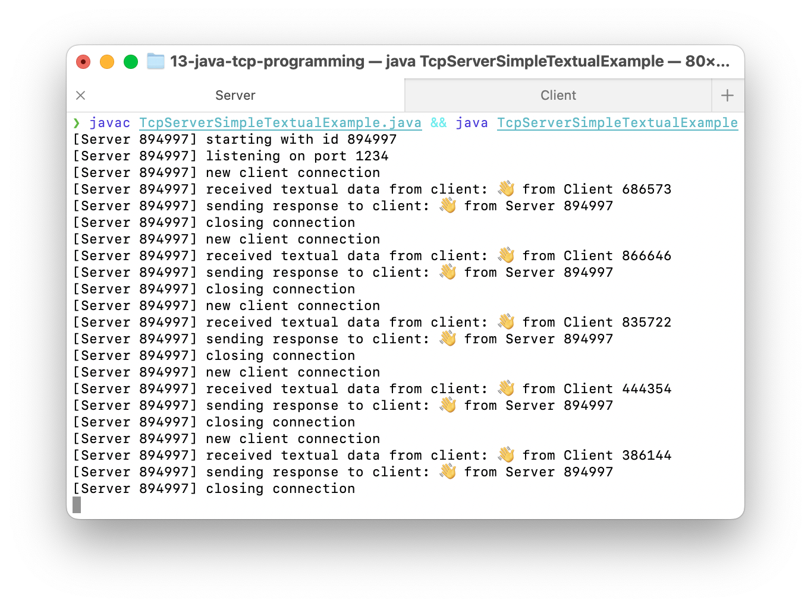
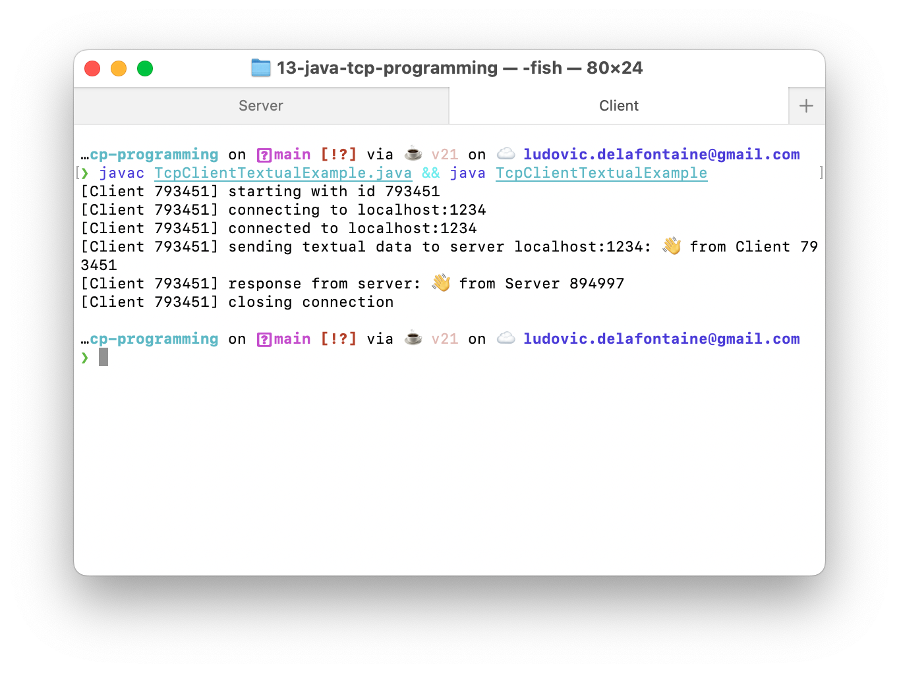

<!--
theme: custom-marp-theme
size: 16:9
paginate: true
author: L. Delafontaine and H. Louis, with the help of GitHub Copilot
title: HEIG-VD DAI - Java network concurrency
description: Java network concurrency for the DAI course at HEIG-VD, Switzerland
header: '[**Java network concurrency**](https://github.com/heig-vd-dai-course/heig-vd-dai-course/tree/main/09.01-java-network-concurrency)'
footer: '[**HEIG-VD**](https://heig-vd.ch) - [DAI 2025-2026](https://github.com/heig-vd-dai-course/heig-vd-dai-course) - [CC BY-SA 4.0](https://github.com/heig-vd-dai-course/heig-vd-dai-course/blob/main/LICENSE.md)'
headingDivider: 6
-->

# Java network concurrency

<!--
_class: lead
_paginate: false
-->

[Link to the course][course]

<small>L. Delafontaine and H. Louis, with the help of
[GitHub Copilot](https://github.com/features/copilot).</small>

<small>Based on the original course by O. Liechti and J. Ehrensberger.</small>

<small>This work is licensed under the [CC BY-SA 4.0][license] license.</small>

![bg opacity:0.1][illustration]

## Objectives

- Learn what is concurrency
- Learn the different ways to handle multiple clients at the same time:
  - Multi-processing
  - Multi-threading
  - Asynchronous programming
- Learn how to implement and manage concurrency in Java network applications


## Disclaimer

<!-- _class: lead -->

More details for this section in the [course material][course-material]. You can
find other resources and alternatives as well.

### Disclaimer

- **This is not a course on concurrency**
- Many many things are not covered
- Focus on concurrency for network applications
- Other ways and mechanisms to handle concurrency will be covered in other
  courses


## Explore the code examples

<!-- _class: lead -->

More details for this section in the [course material][course-material]. You can
find other resources and alternatives as well.

### Explore the code examples

Individually, or in pair/group, **take 10 minutes to explore and discuss the
[code examples](https://github.com/heig-vd-dai-course/heig-vd-dai-course-code-examples)**.

Answer the questions available in the course material:

- How do the code examples work?
- What are the main takeaways of the code examples?
- What are the main differences between the code examples?

If needed, use the theoretical content to help you.

## Concurrency: an introduction

<!-- _class: lead -->

More details for this section in the [course material][course-material]. You can
find other resources and alternatives as well.

### Concurrency: an introduction

- Ability to handle multiple tasks at the same time
- Differs from parallelism, the ability to execute multiple tasks simultaneously
- Before we dive into concurrency, let's take a step back and remember what a
  processor is


### What is a processor?

- Piece of hardware that executes millions of instructions every second
- Gives the illusion of executing multiple tasks at the same time
- However, it can execute only one instruction at a time
- When managing multiple tasks, the processor switches between tasks


### What is a core?

- A physical unit inside a processor that executes instructions (always one at a
  time)
- A processor can have multiple cores, called multi-core processors
- Cores can execute multiple instructions at the same time (parallelism) - not
  covered in this course


### What is a process?

- A process is an instance of a program that is being executed
- A process can have multiple threads (such as picocli)
- Processes are isolated from each other and have their own memory space
- Heavier than threads: expensive to create and manage


### What is a thread?

- A thread is a sequence of instructions that can be executed by a core
- A core can manage multiple threads at the same time
- The main thread is the thread that starts when the application starts
- More lightweight than processes and share the same memory space


### What problems can concurrency cause?

- What happens when a client connects to the server?
- How to isolate the data sent by one client from the others?
- What happens when multiple clients want to access the same resource
  (variables) at the same time?


### What happens when multiple threads access the same resource?

- The processor has to switch between threads
- The order in which the threads are executed is not guaranteed
- The threads can access the same resource at the same time


## Handling one client at a time

<!-- _class: lead -->

More details for this section in the [course material][course-material]. You can
find other resources and alternatives as well.

### Handling one client at a time

1. Create a socket to listen to incoming connections
2. Create a new socket for the client
3. Handle the connection

Analogy: a restaurant with one table

➡️ Simple but quite useless...


## Handling multiple clients with concurrency

<!-- _class: lead -->

More details for this section in the [course material][course-material]. You can
find other resources and alternatives as well.

### Handling multiple clients at the same time

Handling multiple clients at the same time is called concurrency.

Concurrency can be achieved with:

- Multi-processing
- Multi-threading
- Asynchronous programming


### Multi-processing

- Create an entirely new process for each client
- Heavyweight and slow
- Not recommended
- Analogy: a new restaurant for each customer, including the kitchen, waiters,
  etc.


### Multi-threading

- Create a new thread for each client
- More lightweight and faster than multi-processing
- Recommended with thread pool to limit resource usage
- Not enough or too many threads can slow down the system
- Analogy: a new or limited number of tables for each customer


### Asynchronous programming

- Handle multiple clients with a single thread
- Very performant!
- Analogy: a food truck - you get a ticket, wait, get your food and leave
- Out of scope for this course but interesting to know! Node.js is a good
  example for this approach


## Handling multiple threads in Java

<!-- _class: lead -->

More details for this section in the [course material][course-material]. You can
find other resources and alternatives as well.

### Handling multiple threads in Java

- Java provides the
  [`ExecutorService`](https://docs.oracle.com/en/java/javase/21/docs/api/java.base/java/util/concurrent/ExecutorService.html)
  interface to manage threads
- It uses different
  [`Executors`](https://docs.oracle.com/en/java/javase/21/docs/api/java.base/java/util/concurrent/Executors.html)
  implementations
- Each implementation has its own pros and cons
- You have used threads with picocli (each sub-command is a thread)


---

```java
@Override
public Integer call() {
  try (ExecutorService executorService = Executors.newFixedThreadPool(2); ) {
    executorService.submit(this::emittersWorker);
    executorService.submit(this::operatorsWorker);
  } catch (Exception e) {
    System.out.println("[Receiver] Exception: " + e);

    return 1;
  }

  return 0;
}

public Integer emittersWorker() {
  // Manage emitters
}


public Integer operatorsWorker() {
  // Manage operators
}
```

## Concurrent safe variable types and data structures in Java

<!-- _class: lead -->

More details for this section in the [course material][course-material]. You can
find other resources and alternatives as well.

### Concurrent safe variable types and data structures in Java

- A thread-safe variable type and/or data structure is a variable type/data
  structure that can be accessed by multiple threads at the same time
- Java provides several thread-safe variable types and data structures


---

- **Variables types**:
  - `AtomicBoolean` instead of `boolean`/`Boolean`
  - `AtomicInteger` instead of `int`/`Integer`
  - `AtomicLong` instead of `long`/`Long`
- **Data structures**:
  - `ConcurrentHashMap` instead of `HashMap`
  - `ConcurrentLinkedQueue` instead of `LinkedList`
  - `CopyOnWriteArrayList` instead of `ArrayList`
  - `CopyOnWriteArraySet` instead of `HashSet`

---

- Multiple concurrent variable types and/or data structures can be co-dependent
- You must use them together with locks (the equivalent to mutexes and
  semaphores in C/C++) to avoid inconsistencies

Locks will not be covered (and not expected to be used) in this course but you
can find additional information in the [course material][course-material].


## Questions

<!-- _class: lead -->

Do you have any questions?

## Practical content

<!-- _class: lead -->

### What will you do?

- Run full client/server examples and understand how concurrent clients are
  handled
- Explore and answer questions about some concurrent strategies
- Update previous game/application to handle multiple clients (optional)




### Now it's your turn!

- Read the course material.
- Do the practical content.
- Ask questions if you have any.

➡️ [Find the course on GitHub][course].

**Do not hesitate to help each other! There's no need to rush!**

![bg right w:75%][course-qr-code]

## Finished? Was it easy? Was it hard?

Can you let us know what was easy and what was difficult for you during this
chapter?

This will help us to improve the course and adapt the content to your needs. If
we notice some difficulties, we will come back to you to help you.

➡️ [GitHub Discussions][discussions]

You can use reactions to express your opinion on a comment!

## Sources

- Main illustration by [Brent Olson](https://unsplash.com/@helixgames) on
  [Unsplash](https://unsplash.com/photos/person-in-green-and-black-shorts-riding-on-black-and-red-bicycle-_aV5y0nLNew)
- Illustration by [Aline de Nadai](https://unsplash.com/@alinedenadai) on
  [Unsplash](https://unsplash.com/photos/j6brni7fpvs)
- Illustration by [Bernard Hermant](https://unsplash.com/@bernardhermant) on
  [Unsplash](https://unsplash.com/photos/white-and-black-signage-mountain-on-wall--iVnye8VaHY)
- Illustration by [alexey turenkov](https://unsplash.com/@2renkov) on
  [Unsplash](https://unsplash.com/photos/woman-playing-assorted-color-balls-NmTVRg4zfkI)
- Illustration by [Andrey Matveev](https://unsplash.com/@zelebb) on
  [Unsplash](https://unsplash.com/photos/a-close-up-of-a-computer-motherboard-0Sdxy9Ev6oQ)
- Illustration by [BoliviaInteligente](https://unsplash.com/@boliviainteligente)
  on
  [Unsplash](https://unsplash.com/photos/a-close-up-of-a-computer-motherboard-with-intel-chips-rfXMr--MQRU)
- Illustration by [BoliviaInteligente](https://unsplash.com/@boliviainteligente)
  on
  [Unsplash](https://unsplash.com/photos/a-close-up-of-a-computer-processor-chip-yPo7IBTDGGc)
- Illustration by [BoliviaInteligente](https://unsplash.com/@boliviainteligente)
  on
  [Unsplash](https://unsplash.com/photos/an-image-of-an-apple-logo-on-a-circuit-board-m6sD50Q2iOE)

---

- Illustration by [That's Her Business](https://unsplash.com/@thatsherbusiness)
  on
  [Unsplash](https://unsplash.com/photos/white-ceramic-mug-with-coffee-KzeOMdcEswk)
- Illustration by [Jens Herrndorff](https://unsplash.com/@jens_h) on
  [Unsplash](https://unsplash.com/photos/aerial-photography-of-cross-streets-8osoVBQWWHc)
- Illustration by [Elliott Stallion](https://unsplash.com/@eagleboobs) on
  [Unsplash](https://unsplash.com/photos/white-plastic-bottle-on-brown-wooden-table-near-glass-window-ci7b3Q77n0c)
- Illustration by [K8](https://unsplash.com/@_k8_) on
  [Unsplash](https://unsplash.com/photos/people-in-restaurant-sWEpcc0Rm0U)
- Illustration by [bckfwd](https://unsplash.com/@bckfwd) on
  [Unsplash](https://unsplash.com/photos/lighted-chandelier-inside-cafe-ifkd981FUdM)
- Illustration by [James Elchico](https://unsplash.com/@jdelchico) on
  [Unsplash](https://unsplash.com/photos/blue-and-brown-padded-chairs-near-table-zB4A-PP49ww)
- Illustration by [micheile henderson](https://unsplash.com/@micheile) on
  [Unsplash](https://unsplash.com/photos/woman-selling-inside-store-during-daytime-7NFwwp-vZk8)
- Illustration by [Afrah](https://unsplash.com/@ahmedafrah) on
  [Unsplash](https://unsplash.com/photos/coffee-bean-lot-0x-_TV1zQFU)
- Illustration by [Pop & Zebra](https://unsplash.com/@popnzebra) on
  [Unsplash](https://unsplash.com/photos/a-rack-filled-with-lots-of-yellow-hard-hats-wp81DxKUd1E)
- Illustration by [Kateryna Miller](https://unsplash.com/@sammountain) on
  [Unsplash](https://unsplash.com/photos/black-white-and-green-hanging-decors-mkll7wvtv_o)

[course]:
	https://github.com/heig-vd-dai-course/heig-vd-dai-course/tree/main/09.01-java-network-concurrency
[license]:
	https://github.com/heig-vd-dai-course/heig-vd-dai-course/blob/main/LICENSE.md
[discussions]: https://github.com/orgs/heig-vd-dai-course/discussions/453
[illustration]: ./images/main-illustration.jpg
[course-material]:
	https://github.com/heig-vd-dai-course/heig-vd-dai-course/blob/main/14-java-network-concurrency/COURSE_MATERIAL.md
[course-qr-code]:
	https://quickchart.io/qr?format=png&ecLevel=Q&size=400&margin=1&text=https://github.com/heig-vd-dai-course/heig-vd-dai-course/tree/main/09.01-java-network-concurrency
