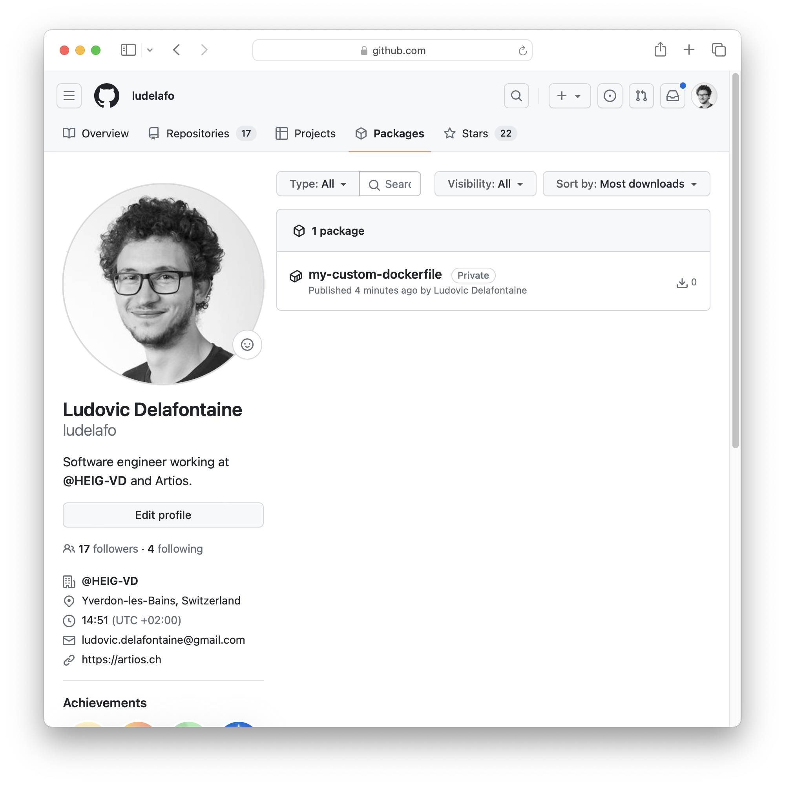

[markdown]:
  https://github.com/heig-vd-dai-course/heig-vd-dai-course/blob/main/10-docker-and-docker-compose/COURSE_MATERIAL.md
[pdf]:
  https://heig-vd-dai-course.github.io/heig-vd-dai-course/10-docker-and-docker-compose/10-docker-and-docker-compose-course-material.pdf
[license]:
  https://github.com/heig-vd-dai-course/heig-vd-dai-course/blob/main/LICENSE.md
[discussions]: https://github.com/orgs/heig-vd-dai-course/discussions/4
[illustration]:
  https://images.unsplash.com/photo-1511578194003-00c80e42dc9b?fit=crop&h=720

# Docker and Docker Compose - Course material

<https://github.com/heig-vd-dai-course>

[Markdown][markdown] · [PDF][pdf]

L. Delafontaine and H. Louis, with the help of Copilot.

This work is licensed under the [CC BY-SA 4.0][license] license.

![Main illustration][illustration]

## Table of contents

- [Table of contents](#table-of-contents)
- [Objectives](#objectives)
- [Installation of software: traditional vs. containerization](#installation-of-software-traditional-vs-containerization)
- [OCI, images, containers and registries](#oci-images-containers-and-registries)
- [Docker](#docker)
  - [Dockerfile specification](#dockerfile-specification)
  - [Security considerations](#security-considerations)
  - [Ignore files](#ignore-files)
  - [Summary](#summary)
  - [Cheatsheet](#cheatsheet)
  - [Alternatives](#alternatives)
  - [Resources](#resources)
- [Docker Compose](#docker-compose)
  - [Docker Compose specification](#docker-compose-specification)
  - [Docker Compose v1 vs. Docker Compose v2](#docker-compose-v1-vs-docker-compose-v2)
  - [Summary](#summary-1)
  - [Cheatsheet](#cheatsheet-1)
  - [Alternatives](#alternatives-1)
  - [Resources](#resources-1)
- [Docker Desktop](#docker-desktop)
  - [Alternatives](#alternatives-2)
- [Docker Hub](#docker-hub)
  - [Alternatives](#alternatives-3)
- [Tips and tricks](#tips-and-tricks)
  - [Healthchecks](#healthchecks)
  - [Free some space](#free-some-space)
  - [Multi-stage builds](#multi-stage-builds)
  - [Multi-architecture builds](#multi-architecture-builds)
- [Practical content](#practical-content)
  - [Install Docker and Docker Compose](#install-docker-and-docker-compose)
  - [Run a container with Docker](#run-a-container-with-docker)
  - [Write a Dockerfile, build and run an image with Docker](#write-a-dockerfile-build-and-run-an-image-with-docker)
  - [Publish an image on GitHub Container Registry](#publish-an-image-on-github-container-registry)
  - [Use the published image with Docker](#use-the-published-image-with-docker)
  - [Run a container with Docker Compose](#run-a-container-with-docker-compose)
  - [Build and run the application with Docker Compose](#build-and-run-the-application-with-docker-compose)
  - [Go further](#go-further)
- [Conclusion](#conclusion)
  - [What did you do and learn?](#what-did-you-do-and-learn)
  - [Test your knowledge](#test-your-knowledge)
- [Finished? Was it easy? Was it hard?](#finished-was-it-easy-was-it-hard)
- [What will you do next?](#what-will-you-do-next)
- [Additional resources](#additional-resources)
- [Sources](#sources)

## Objectives

In this chapter, you will learn how installation of software can be tedious and
how containerization can help you with that.

You will learn how to install and run software on your computer with the help of
Docker and Docker Compose to avoid the need to install the software directly on
your computer.

This is a fairly long and complete chapter. It will take you some time to
complete it. Do not hesitate to take breaks. The content of this chapter will be
useful for the rest of the course.

## Installation of software: traditional vs. containerization

When you want to install a software on your computer, the traditional way is to
download an installer, run it and follow the instructions. The installer will
install the software on your computer, and you will be able to use it.

The installer has written some files on your computer, and it has modified some
settings. It can be quite difficult to know what the installer has done on your
computer. It can also be difficult to uninstall the software, because you need
to know what the installer has done. Even if the installer has an uninstaller,
it could not have removed everything.

The problem arises when you want to install another version of the software or
on another computer: if you install the new version, it will overwrite the old
version. If you want to keep the old version, you need to install the new
version in another directory. If you want to keep both versions, you need to
install the new version in another directory, and you need to change the
application's settings to use the new version. It becomes quite a mess.

If you want to install the software on another computer, you need to manually
change the settings; it can be difficult to know what to change.

Containerization solves these problems. With containerization, you can install
the software in a container. The container is a virtual environment that
contains the software and all its dependencies. The container is isolated from
the rest of the computer. The container can be run on any computer that has the
containerization software installed.

Each container is independent from the others. You can run multiple containers
on the same computer. You can run multiple containers of a software using
different versions, knowing that they will not interfere with each other.

Containers are lightweight. They are faster to start than virtual machines. They
are also faster to create and destroy than virtual machines.

The containerization software is called a container engine. The most popular
container engine is Docker. Docker is an implementation of the Open Container
Initiative (OCI) specification.

## OCI, images, containers and registries

The OCI specification defines a standard for container images and container
runtimes. The OCI specification is implemented by Docker, but also by other
container engines.

The OCI specification defines the following terms (among others):

- Image: a read-only template with instructions for creating a container
- Container: a runnable instance of an image
- Registry: a service that stores images

A container image is a package that contains everything needed to run an
application. It contains the application and all its dependencies. It also
contains metadata about the image, such as the author, the version, the
description, etc.

A container image is immutable. It cannot be modified. If you want to modify a
container image, you need to create a new image.

A container image is composed of layers. Each layer is a set of files. The
layers are stacked on top of each other. The layers are read-only. When you
modify a file, the file is copied to the top layer. The original file is not
modified.

A container image is stored in a container registry. A container registry is a
service that stores container images. The most popular container registry is
Docker Hub. It is a public registry. You can also create your own private
registry.

A container image can be downloaded from a container registry. It can also be
uploaded to a container registry.

A container image can be used to create a container. A container is a runnable
instance of an image. A container is created from an image. It is possible to
create multiple containers from the same image.

A container is isolated from the rest of the computer. It is isolated from other
containers.

## Docker

> [Docker](https://www.docker.com/) is a set of platform as a service (PaaS)
> products that use OS-level virtualization to deliver software in packages
> called containers.

Docker is composed of two parts:

- The Docker daemon: a background service that manages containers
- The Docker CLI: a command-line interface to interact with the Docker daemon

On Linux, the Docker daemon runs natively. The Docker CLI communicates with the
Docker daemon through a socket.

On macOS and Windows, the Docker daemon runs in a virtual machine. The Docker
CLI communicates with the Docker daemon through a socket.

The Docker CLI is used to manage containers. It is used to create, start, stop,
restart, delete, etc. containers. It is also used to manage images. It is used
to download, upload, build, etc. images.

### Dockerfile specification

The Dockerfile specification defines a standard for building Docker images. The
Dockerfile specification is implemented by Docker, but also by other container
engines.

The Dockerfile specification defines the following terms (among others):

- Dockerfile: a text file that contains instructions for building a Docker image
- Build context: a directory that contains the files needed to build a Docker

The Dockerfile specification defines a set of instructions. Each instruction
corresponds to a command that can be run in a shell. The instructions are
executed in order. Each instruction creates a new layer in the image.

The Dockerfile specification defines the following instructions (among others):

- `FROM`: specifies the base image
- `ARG`: specifies an argument to be passed to the build command
- `RUN`: runs a command in the container
- `COPY`: copies files from the build context to the container
- `CMD`: specifies the command to run when the container starts
- `ENTRYPOINT`: specifies the entry point of the container
- `ENV`: specifies an environment variable
- `EXPOSE`: specifies the port to expose
- `WORKDIR`: specifies the working directory
- `VOLUME`: specifies a volume

A Dockerfile is then used to build a Docker image. The Dockerfile is passed to
the `docker build` command. The `docker build` command builds the image from the
Dockerfile. The `docker build` command takes the Dockerfile and the build
context as arguments.

Once the image is built, it can be run with the `docker run` command. The
`docker run` command takes the image name as argument.

Most Docker images are based on Linux but others are available as well (Windows
for instance). It is possible to run Linux containers on Linux, macOS and
Windows (with the help of the Linux virtual machine).

More information about the Dockerfile specification can be found in the official
documentation: <https://docs.docker.com/engine/reference/builder/>.

### Security considerations

A container is isolated from the rest of the computer. It is isolated from other
containers. It is not isolated from the Docker daemon. The Docker daemon has
access to the container.

A container is not a virtual machine. It is not a sandbox. It is not a security
boundary. It is not a security boundary between the container and the Docker
daemon.

The Docker daemon runs with root privileges. You must be careful when running
containers. A security vulnerability in a container can lead to a full
compromise of the host. Always try to run containers with a non-root user.

It is not always possible to run a container with a non-root user. Some
containers require root privileges to run. Some containers requires access to
the Docker daemon. This is usually explicitly stated in the documentation of the
container.

### Ignore files

When building an image, Docker will send the build context to the Docker daemon.

The build context is the directory that contains the Dockerfile. To ignore files
that are not needed to build the image, you can create a `.dockerignore` file in
the build context. The `.dockerignore` file is similar to the `.gitignore` file.

This can be useful to ignore files such as the `target` directory of a Maven
project or private keys so that they are not sent to the Docker daemon.

### Summary

- Docker is a container engine
- Docker is composed of two parts: the Docker daemon and the Docker CLI
- The Docker CLI is used to manage containers and images
- The Dockerfile specification defines a standard for building Docker images
- A Dockerfile is used to build a Docker image
- A Docker image is used to create a container
- A container is a runnable instance of an image
- A container is isolated from the rest of the computer

### Cheatsheet

```sh
# Build and tag an image
docker build -t <image-name> <build-context>

# Start a container using its image name
docker run <image-name>

# Start a container in background
docker run -d <image-name>

# Display all running containers
docker ps

# Stop a container
docker stop <container-id>

# Access a running container
docker exec -it <container-id> /bin/sh

# Start a container and override the entry point
docker run --entrypoint /bin/sh <image-name>

# Start a container and override the command
docker run <image-name> <command>

# Check the logs of a container
docker logs <container-id>

# Delete all stopped containers
docker container prune

# Delete all images
docker image prune
```

### Alternatives

_Alternatives are here for general knowledge. No need to learn them._

- [podman](https://podman.io/)
- [containerd](https://containerd.io/)
- [LXC](https://linuxcontainers.org/lxc/introduction/)
- [Kubernetes](https://kubernetes.io/)
- [kaniko](https://github.com/GoogleContainerTools/kaniko)

_Missing item in the list? Feel free to open a pull request to add it! ✨_

### Resources

_Resources are here to help you. They are not mandatory to read._

- [Get started with Docker](https://docs.docker.com/get-started/)

_Missing item in the list? Feel free to open a pull request to add it! ✨_

## Docker Compose

> [Docker Compose](https://docs.docker.com/compose/) is a tool for defining and
> running multi-container Docker applications.

Docker Compose is a tool that is used to run multiple containers. It is used to
run multiple containers that are related to each other. It is used to run
multiple containers that are part of the same application (a backend and its
database for example).

### Docker Compose specification

The Docker Compose specification defines a standard for defining and running
<<<<<<< Updated upstream
multi-container Docker applications.
=======
<<<<<<< Updated upstream
multi-container Docker applications. The Docker Compose specification is
implemented by Docker Compose, but also by other tools.
=======
multi-container Docker applications together.
>>>>>>> Stashed changes
>>>>>>> Stashed changes

The Docker Compose specification defines the following terms (among others):

- Service: a container that is part of a multi-container Docker application
- Volume: a directory that is shared between the container and the host
- Network: a network that is shared between containers

<<<<<<< Updated upstream
TODO
=======
<<<<<<< Updated upstream
=======
Docker Compose allows to define a multi-container Docker application in a Docker
Compose file. It is easier to use than plain Docker commands and can be
versioned with the application.
>>>>>>> Stashed changes

More information about the Docker Compose specification can be found in the
official documentation: <https://docs.docker.com/compose/compose-file/>.

<<<<<<< Updated upstream
=======
### Docker Compose v1 vs. Docker Compose v2

Please be aware that there are two versions of Docker Compose: Docker Compose v1
and Docker Compose v2.

Docker Compose v1 is the original version of Docker Compose. It was built with
Python and is now deprecated. It is still available but it is not recommended to
use it. The command to use Docker Compose v1 was `docker-compose`.

Docker Compose v2 is the new version of Docker Compose. It is built with Go and
it is the recommended version to use. The new command to use Docker Compose v2
is `docker compose`.

>>>>>>> Stashed changes
>>>>>>> Stashed changes
### Summary

- Docker Compose allows to define a multi-container Docker application in a
  Docker Compose file
- A Docker Compose file can consist of a set of services, volumes and networks
- A Docker Compose file (`docker-compose.yml`) can be easily shared and
  versioned with the application
- Docker Compose v2 is the recommended version to use

### Cheatsheet

```sh
# Start all services defined in the docker-compose.yml file
docker compose up

# Start all services defined in the docker-compose.yml file in background
docker compose up -d

# Display all running services
docker compose ps

# Stop all services defined in the docker-compose.yml file
docker compose down

# Check the logs of a service
docker compose logs <service-name>

# Check the logs of all services defined in the docker-compose.yml file
docker compose logs

# Follow the logs of a service
docker compose logs -f <service-name>
```

### Alternatives

_Alternatives are here for general knowledge. No need to learn them._

- [Docker Swarm](https://docs.docker.com/engine/swarm/)
- [Kubernetes](https://kubernetes.io/)
- [Nomad](https://www.nomadproject.io/)
- [Rancher](https://rancher.com/)

_Missing item in the list? Feel free to open a pull request to add it! ✨_

### Resources

_Resources are here to help you. They are not mandatory to read._

- _None yet_

_Missing item in the list? Feel free to open a pull request to add it! ✨_

## Docker Desktop

Docker Desktop is the easiest way to install Docker on your computer. It is
available for macOS and Windows. As a student, you can get use it for free.

Docker Desktop manages a Linux virtual machine. The Linux virtual machine runs
the Docker daemon.

As Docker Desktop uses a virtual machine, some configuration (mostly network)
might be a bit different than the one you can find on a Linux machine
(workstation or server).

### Alternatives

_Alternatives are here for general knowledge. No need to learn them._

- [Rancher Desktop](https://rancherdesktop.io/)
- [OrbStack](https://orbstack.dev/) - for macOS only

_Missing item in the list? Feel free to open a pull request to add it! ✨_

## Docker Hub

> [Docker Hub](https://hub.docker.com) is the world's largest library and
> community for container images.

Docker Hub is a public container registry. It is the default registry for
Docker.

Other container registries are available. Some are public, some are private.

In this course, we will use the
[GitHub Container Registry](https://docs.github.com/en/packages/working-with-a-github-packages-registry/working-with-the-container-registry)
to store our images.

### Alternatives

_Alternatives are here for general knowledge. No need to learn them._

- [GitHub Container Registry](https://docs.github.com/en/packages/working-with-a-github-packages-registry/working-with-the-container-registry)

_Missing item in the list? Feel free to open a pull request to add it! ✨_

## Tips and tricks

### Healthchecks

Healthchecks are used to check if a container is healthy. They are used to check
if the container is ready to accept requests.

Healthchecks are defined in the Dockerfile. They are defined with the
`HEALTHCHECK` instruction.

The `HEALTHCHECK` instruction takes the following arguments:

- `--interval`: the interval between two healthchecks
- `--timeout`: the timeout of a healthcheck
- `--start-period`: the time to wait before starting the healthchecks
- `--retries`: the number of retries before considering the container unhealthy
- `CMD`: the command to run to check the health of the container

For example, the following instruction defines a healthcheck that runs every 30
seconds and that times out after 10 seconds:

```dockerfile
HEALTHCHECK --interval=30s --timeout=10s \
  CMD curl -f http://localhost/ || exit 1
```

If no healthcheck is defined, Docker will use the default healthcheck. The
default healthcheck is to check if the container is running.

If no healthcheck is defined, the container will be considered healthy as soon
as it is running. This is not always what you want. You might want to wait for
the container to be ready to accept requests.

You can define a healthcheck that checks if the container is ready to accept in
the Docker Compose file. You can use the `healthcheck` option to define a
healthcheck.

For example, the following option defines a healthcheck that runs every 30
seconds and that times out after 10 seconds:

```yaml
healthcheck:
  test: ["CMD", "curl", "-f", "http://localhost/"]
  interval: 30s
  timeout: 10s
```

### Free some space

Docker images, containers and volumes can take a lot of space on your computer.

You can use the following commands to free some space:

```sh
# Delete all stopped containers, all networks not used by at least one container, all anonymous volumes not used by at least one container, all images without at least one container associated to them and all build cache
docker system prune --all --volumes
```

### Multi-stage builds

When working with Docker, you usually start with a base image and you do the
following:

1. Install the dependencies of your application.
2. Copy your application source to the image.
3. Build the application.
4. Run it.

This process creates a large image. It contains the base image, the
dependencies, the source code and the build tools, even if they are not needed
anymore.

You can use multi-stage builds to reduce the size of the final image. The
process would be as follow:

1. Start from a base image named `builder`.
2. Install the dependencies to build your application.
3. Copy your application source to the image.
4. Build the application.
5. Start from a base image named `runner`.
6. Install the dependencies to run your application (if needed).
7. Copy the build artifacts from the `builder` image to the `runner` image.
8. Run the application.

The final image will only contain the dependencies to run your application and
the build artifacts. It will not contain the build tools, the source code or the
dependencies to build your application, reducing significantly the size of the
image.

This topic will not be covered in this course. You can however find more
information about multi-stage builds in the official documentation:
<https://docs.docker.com/develop/develop-images/multistage-build/>.

### Multi-architecture builds

By default, Docker will use the architecture of your computer. If you are using
a computer with an `amd64` architecture, Docker will use the `amd64` version of
the image.

You can use multi-architecture builds to build images for multiple
architectures, such as `amd64`, `arm64` and `armv7`. You can then publish the
images on a registry. When you will pull the image, Docker will automatically
use the version that matches the architecture of your computer, making your
application compatible with multiple architectures.

This topic will not be covered in this course. You can however find more
information about multi-architecture builds in the official documentation:
<https://docs.docker.com/build/building/multi-platform/>.

## Practical content

### Install Docker and Docker Compose

In this section, you will install Docker and Docker Compose on your computer.

#### Install Docker and Docker Compose on Linux

> **Note**  
> While it is possible to install Docker Desktop on Linux, we would not
> recommend it. It is better to install Docker Engine and Docker Compose
> directly on your system to avoid any overhead.

Go to the official website and follow the instructions to install
[Docker Engine](https://docs.docker.com/engine/) on your distribution:

- Debian: <https://docs.docker.com/engine/install/debian/>
- Fedora: <https://docs.docker.com/engine/install/fedora/>
- Ubuntu: <https://docs.docker.com/engine/install/ubuntu/>
- Other distributions: <https://docs.docker.com/engine/install/>

Then, follow the post-installation steps to finalize the installation:
<https://docs.docker.com/engine/install/linux-postinstall/>.

Docker Compose is not installed by default. You can install it by following the
instructions on the official website:
<https://docs.docker.com/compose/install/linux/>. We recommend to install Docker
Compose using the repository.

#### Install Docker and Docker Compose on macOS and Windows

Go to the official website and follow the instructions on how to install Docker
Desktop on your system: <https://docs.docker.com/desktop/>.

This will install Docker Engine and Docker Compose in a virtual machine.

#### Check the installation

Once Docker and Docker Compose are installed, you can check the installation by
running the following commands in a terminal:

```sh
# Check the Docker version
docker --version

# Check the Docker Compose version
docker compose version
```

The output should be similar to the following:

```text
Docker version 24.0.6, build ed223bc

Docker Compose version v2.21.0-desktop.1
```

Ensure that the Docker daemon is running if you have any issue.

### Run a container with Docker

<<<<<<< Updated upstream
=======
<<<<<<< Updated upstream
=======
>>>>>>> Stashed changes
In this section, you will run a container with Docker.

#### Run a `hello-world` container with Docker

Run the following command in a terminal:

```sh
# Run a container with the hello-world image
docker run hello-world:latest
```

The `run` command is used to run a container. It is followed by the name of the
image to use.

The `hello-world` image is a minimal image. It is often used to test if Docker
is correctly installed.

The `:latest` tag is used to specify the version of the image. It is not
required. If no tag is specified, the `:latest` tag is used by default.

The output should be similar to the following:

```text
Unable to find image 'hello-world:latest' locally
latest: Pulling from library/hello-world
719385e32844: Pull complete
Digest: sha256:4f53e2564790c8e7856ec08e384732aa38dc43c52f02952483e3f003afbf23db
Status: Downloaded newer image for hello-world:latest

Hello from Docker!
This message shows that your installation appears to be working correctly.

To generate this message, Docker took the following steps:
 1. The Docker client contacted the Docker daemon.
 2. The Docker daemon pulled the "hello-world" image from the Docker Hub.
    (amd64)
 3. The Docker daemon created a new container from that image which runs the
    executable that produces the output you are currently reading.
 4. The Docker daemon streamed that output to the Docker client, which sent it
    to your terminal.

To try something more ambitious, you can run an Ubuntu container with:
 $ docker run -it ubuntu bash

Share images, automate workflows, and more with a free Docker ID:
 https://hub.docker.com/

For more examples and ideas, visit:
 https://docs.docker.com/get-started/
```

Take some time to read the output. It explains what Docker did to run the
container. It confirms that Docker is correctly installed on your computer as
well.

#### Run an interactive container with Docker

Run the following command in a terminal:

```sh
# Run an interactive container with the alpine image
docker run --rm -it alpine:3.18 /bin/sh
```

The `--rm` option is used to remove the container when it exits. It is not
required. If the container is not removed, it will be stopped but not deleted.

The `-it` option is used to run the container in interactive mode. It is used to
attach the container's standard input, standard output and standard error to the
terminal.

The `alpine` image is a minimal image based on
[Alpine Linux](https://www.alpinelinux.org/). It is often used to run small and
optimized containers.

The `:3.18` tag is used to specify the version of the image. It is not required.
If no tag is specified, the `:latest` tag is used by default. You can find all
the available tags on the Docker Hub page of the image:
<https://hub.docker.com/_/alpine>.

The `/bin/sh` argument is used to override the default command of the container.
The default command of the container is defined in the Dockerfile of the image.

The output should be similar to the following:

```text
Unable to find image 'alpine:3.18' locally
3.18: Pulling from library/alpine
Digest: sha256:eece025e432126ce23f223450a0326fbebde39cdf496a85d8c016293fc851978
Status: Downloaded newer image for alpine:3.18
/ #
```

Docker will check if the image is available locally. If it is not available
locally, Docker will download it from the Docker Hub, the default registry.

> **Note**  
> Please be aware that Docker will check if the image is available locally using
> the name and the tag of _any_ image available locally. If you have a local
> image named `alpine:3.18` from a Ubuntu container that you have created on
> your own, Docker will not download the `alpine:3.18` image from the registry.
> It will use the local image instead. This can be confusing at first.

You are now inside the container. You can run commands in the container. For
example, you can run the following command to display the content of the
`/etc/os-release` file to check the version of Alpine Linux:

```sh
# Display the content of the /etc/os-release file
cat /etc/os-release
```

The output should be similar to the following:

```text
NAME="Alpine Linux"
ID=alpine
VERSION_ID=3.18.4
PRETTY_NAME="Alpine Linux v3.18"
HOME_URL="https://alpinelinux.org/"
BUG_REPORT_URL="https://gitlab.alpinelinux.org/alpine/aports/-/issues"
```

You can run the following command to exit the container:

```sh
# Exit the container
exit
```

#### Run a detached container with Docker

Run the following command in a terminal:

```sh
# Run a detached container with the alpine image
docker run --rm -d alpine:3.18 /bin/sh -c "while true; do echo 'Hello world!'; sleep 5; done"
```

The `-d` option is used to run the container in detached mode. It is used to
detach the container from the terminal.

The `/bin/sh -c "while true; do echo 'Hello world!'; sleep 5; done"` argument is
used to override the default command of the container. It will run an infinite
loop that prints `Hello world!` every 5 seconds.

The output should be similar to the following, displaying the container ID:

```text
1c8562b3df6e9fcfc1237c581a54108c47fb30132122da31af869a73b8f7ea13
```

No other output is displayed. This is because the container is running in
detached mode. The container is running in the background.

You can run the following command to display all running containers:

```sh
# Display all running containers
docker ps
```

The output should be similar to the following:

```text
CONTAINER ID   IMAGE         COMMAND                  CREATED         STATUS         PORTS     NAMES
1c8562b3df6e   alpine:3.18   "/bin/sh -c 'while t…"   4 seconds ago   Up 2 seconds             upbeat_almeida
```

The `ps` command is used to display all running containers. It can be followed
by the `--all` option to display all containers, including the stopped ones.

You can display the logs of the container with the following command:

```sh
# Display the logs of the container
docker logs 1c8562b3df6e
```

Replace `1c8562b3df6e` with the ID of your container.

The output should be similar to the following:

```text
Hello world!
```

Of course, our container is not very useful. It is just an example to show how
to run a container in detached mode and check its logs.

You can run the following command to stop the container:

```sh
# Stop the container
docker stop 1c8562b3df6e
```

Replace `1c8562b3df6e` with the ID of your container.

The output should be similar to the following, confirming that the container has
been stopped:

```text
1c8562b3df6e
```

You can check that the container has been stopped with the `docker ps` command
as seen previously.
<<<<<<< Updated upstream
=======

### Write a Dockerfile, build and run an image with Docker

In this section, you will write a Dockerfile, build it with a tag and run it
with Docker.

#### Write, build and run a simple Dockerfile

Create a new directory named `my-custom-dockerfile` and go into it:

```sh
# Create a new directory
mkdir my-custom-dockerfile
```

Create a new file named `Dockerfile` in the `my-custom-dockerfile` directory and
put the following content in it:

```dockerfile
# Start from the alpine image
FROM alpine:3.18

# Set an GREETINGS environment variable
ENV GREETINGS=Hello

# Set a simple command
CMD ["/bin/sh", "-c", "echo \"$GREETINGS from my custom Dockerfile!\""]
```

The `FROM` instruction is used to specify the base image. It is the first
instruction of the Dockerfile. It is required.

The `ENV` instruction is used to specify an environment variable. It is used to
specify the value of the `GREETINGS` environment variable. An environment
variable is available during the build and the run of the container.

The `CMD` instruction is used to specify the command to run when the container
starts. In this case, it will invoke the shell to run the `echo` command with
the value of the `GREETINGS` environment variable.

You can now build the image with the following command:

```sh
# Build the image with the my-custom-dockerfile:v1.0 tag
docker build \
  -t my-custom-dockerfile:v1.0 \
  my-custom-dockerfile
```

The `-t` option is used to tag the image. It is used to specify the name and the
tag of the image. The name and the tag are separated by a colon (`:`).

The `my-custom-dockerfile` argument is used to specify the build context. It is
used to specify the directory that contains the Dockerfile. If you have a
Dockerfile named `Dockerfile` in the current directory, you can omit this
argument.

The `v1.0` tag is used to specify the version of the image. It is not required.

The output should be similar to the following:

```text
docker build -t my-custom-dockerfile:v1.0 my-custom-dockerfile
[+] Building 0.1s (5/5) FINISHED                                                                                                                                                 docker:desktop-linux
 => [internal] load build definition from Dockerfile                                                                                                                                             0.1s
 => => transferring dockerfile: 145B                                                                                                                                                             0.0s
 => [internal] load .dockerignore                                                                                                                                                                0.1s
 => => transferring context: 2B                                                                                                                                                                  0.0s
 => [internal] load metadata for docker.io/library/alpine:3.18                                                                                                                                 0.0s
 => [1/1] FROM docker.io/library/alpine:3.18                                                                                                                                                   0.0s
 => exporting to image                                                                                                                                                                           0.0s
 => => exporting layers                                                                                                                                                                          0.0s
 => => writing image sha256:1210ca793235e534e370c97ad78fc30603dfff0fd6332460598d43d5a9ba5dd8                                                                                                     0.0s
 => => naming to docker.io/library/my-custom-dockerfile:v1.0
```

You can now run the image with the following command:

```sh
# Run the image with the my-custom-dockerfile:v1.0 tag
docker run --rm \
  my-custom-dockerfile:v1.0
```

The output should be similar to the following:

```text
Hello from my custom Dockerfile!
```

Congratulations! You have just ran your first Docker image!

You can change the value of the `GREETINGS` environment variable with the
following command:

```sh
# Run the image with the my-custom-dockerfile:v1.0 tag and override the environment variable
docker run --rm \
  --env GREETINGS=Hi \
  my-custom-dockerfile:v1.0
```

The `--env` option is used to override the value of an environment variable. It
is used to specify the name and the value of the environment variable. The name
and the value are separated by an equal sign (`=`).

The output should be similar to the following:

```text
Hi from my custom Dockerfile!
```

Environment variables are really useful to configure your application. You can
use them to configure the database connection for example.

#### Write, build and run a more complex Dockerfile

Update the `Dockerfile` with the following content:

```dockerfile
# Start from the alpine image
FROM alpine:3.18

# Install the tree package using the apk package manager
RUN apk add --no-cache tree

# Set the working directory
WORKDIR /app

# Copy the current directory to the /app directory in the container
COPY . .

# Set a volume
VOLUME /app/data

# Set the entry point
ENTRYPOINT ["tree", "--dirsfirst"]

# Set the default command
CMD ["/app"]
```

The `RUN` instruction is used to run a command in the container. It is used to
install the `tree` package using the `apk` package manager from Alpine Linux.
The `--no-cache` option is used to not cache the index locally. It is used to
reduce the size of the image.

The `WORKDIR` instruction is used to set the working directory of the container
to `/app`. All the following instructions will be executed in the `/app`
directory.

The `COPY` instruction is used to copy the content of the current directory to
the `/app` directory in the container.

The `VOLUME` instruction is used to specify a volume. It is used to specify a
directory that will be shared between the container and the host. The
`/app/data` directory will be shared between the container and the host. This is
only informative and can be omitted.

The `ENTRYPOINT` instruction is used to specify the entry point of the
container. It is used to specify the command that will be run when the container
starts.

The `CMD` instruction is used to specify the default command of the container.
It is used to specify the arguments that will be passed to the entry point.

You can now build the image with the following command:

```sh
# Build the image with the my-custom-dockerfile:v2.0 tag
docker build \
  -t my-custom-dockerfile:v2.0 \
  my-custom-dockerfile
```

Run the container with the following command:

```sh
# Run the image with the my-custom-dockerfile:v2.0 tag
docker run --rm \
  my-custom-dockerfile:v2.0
```

The output should be similar to the following:

```text
/app
├── data
└── Dockerfile

2 directories, 1 file
```

The `tree` command is used to display the content of a directory. It is not
available by default in Alpine Linux. It was installed with the `apk` package
manager.

By default, the `tree` command displays the content of the `/app` directory
inside the container.

You can run the following command to display the content of the `/app/data`
directory inside the container:

```sh
# Run the image with the my-custom-dockerfile:v2.0 tag and override the command
docker run --rm my-custom-dockerfile:v2.0 /app/data
```

The output should be similar to the following:

```text
/app/data

0 directories, 0 files
```

The command was overridden with the `/app/data` argument. The `tree` command
displayed the content of the `/app/data` directory instead of the `/app`
directory.

At the moment, the `/app/data` directory is empty. Let's create a file in the
`/app/data` directory inside the container:

```sh
# Run the image with the my-custom-dockerfile:v2.0 tag and override the entrypoint
docker run --rm --entrypoint /bin/sh my-custom-dockerfile:v2.0 -c "touch /app/data/my-file.txt"
```

The `--entrypoint` option is used to override the entry point of the container.
It is used to specify the command that will be run when the container starts,
replacing the default entry point `tree` command by the `/bin/sh` command.

The `-c` option is used to execute a command with `/bin/sh` in the container. It
is used to run the `touch /app/data/my-file.txt` command in the container to
create a file named `my-file.txt` in the `/app/data` directory.

There should be no output this time. You can run the following command to
display the content of the `/app/data` directory inside the container:

```sh
# Run the image with the my-custom-dockerfile:v2.0 tag and override the command
docker run --rm my-custom-dockerfile:v2.0 /app/data
```

The output should be similar to the following:

```text
/app/data

0 directories, 0 files
```

What happened? The `/app/data` directory is empty again!

This is because the container is stateless. All the changes made in the
container are lost when the container is stopped. When working with containers,
you should not store any data in the container. You should store the data in a
volume instead.

Let's run the container again, but this time, let's mount a volume on the
`/app/data` directory inside the container:

```sh
# Run the image with the my-custom-dockerfile:v2.0 tag and mount a volume
docker run --rm -v ./my-custom-dockerfile/my-data:/app/data --entrypoint /bin/sh my-custom-dockerfile:v2.0 -c "touch /app/data/my-file.txt"
```

The `-v` option is used to mount a volume. It is used to specify a directory on
the host that will be mounted on the `/app/data` directory inside the container.

The `./my-data` argument is used to specify the directory on the host to mount
on the `/app/data` directory inside the container. It is a relative path. It is
relative to the current directory and should be created automatically if it does
not exist.

The container should have created a file named `my-file.txt` in the `./my-data`
directory on the host. You can now run the initial command to display the
content of the `/app/data` directory inside the container that is mapped to the
`./my-data` directory on the host:

```sh
# Run the image with the my-custom-dockerfile:v2.0 tag and override the command
docker run --rm -v ./my-custom-dockerfile/my-data:/app/data my-custom-dockerfile:v2.0 /app/data
```

The output should be similar to the following:

```text
/app/data
└── my-file.txt

1 directory, 1 file
```

The files are persisted on the host!

Run the container again without overriding the command to display all `/app`
files inside the container:

```sh
# Run the image with the my-custom-dockerfile:v2.0 tag
docker run --rm -v ./my-custom-dockerfile/my-data:/app/data my-custom-dockerfile:v2.0
```

The output should be similar to the following:

```text
/app
├── data
│   └── my-file.txt
└── Dockerfile

2 directories, 2 files
```

All the files are displayed, the `Dockerfile` file from the container and the
files persisted in the volume.

The `Dockerfile` file will be the same each time the container is run as it was
copied from the host when it was created. The files persisted in the volume will
be persisted between each run of the container.

More information about volumes can be found in the official documentation:
<https://docs.docker.com/storage/volumes/>.

#### Write, build and run an even more complex Dockerfile

We will use [File Browser](https://github.com/filebrowser/filebrowser) in this
example.

File Browser is a web-based file manager. It is written in Go. It is available
as a Docker image but we will create our own image to illustrate how to use a
Dockerfile to install an application.

Update the `Dockerfile` with the following content:

```dockerfile
# Start from the sigoden/dufs image
FROM alpine:3.18

# Set File Browser version as an argument
ARG FILEBROWSER_VERSION=2.25.0-r0

# Install the main filebrowser package from the testing repository
RUN apk add --no-cache --repository=https://dl-cdn.alpinelinux.org/alpine/edge/testing "filebrowser=$FILEBROWSER_VERSION"

# Install additional packages
RUN apk add --no-cache curl

# Set the working directory
WORKDIR /app

# Set volumes
VOLUME /app/config
VOLUME /app/data

# Set the exposed ports
EXPOSE 5000

# Set a healthcheck
HEALTHCHECK --start-period=2s --interval=5s --timeout=3s \
    CMD curl -f http://localhost:5000/health || exit 1

# Override the entrypoint
ENTRYPOINT ["/usr/bin/filebrowser"]

# Set the default command
CMD ["--address", "0.0.0.0", "--port", "5000", "--database", "/app/config/database.db", "--root", "/app/data"]
```

The `ARG` instruction is used to specify an argument. An argument is only used
during the build of the image. It is not used when the container is run.

It can be used to customize the build of the image. It can be used to specify
the version of the application to install for example.

The `EXPOSE` instruction is used to specify the ports that will be exposed by
the container. This is only informative and can be omitted.

The `HEALTHCHECK` instruction is used to specify a healthcheck. It is used to
specify a command that will be run periodically to check if the container is
healthy.

The `ENTRYPOINT` instruction is used to start the application. The `CMD` are the
arguments that will be passed to the entry point.

You can now build the image with the following command:

```sh
# Build the image with the my-custom-dockerfile:v3.0 tag
docker build \
  -t my-custom-dockerfile:v3.0 \
  my-custom-dockerfile
```

Start the container with the following command:

```sh
# Run the image with the my-custom-dockerfile:v3.0 tag
docker run --rm -p 8080:5000 -v ./my-custom-dockerfile/my-data:/app/data -v ./my-custom-dockerfile/my-config:/app/config my-custom-dockerfile:v3.0
```

The `-p` option is used to publish a container's port(s) to the host. It is used
to specify the port of the container that will be mapped to the port of the host
to access the application.

The output should be similar to the following:

```text
2023/10/09 09:59:25 No config file used
2023/10/09 09:59:25 Listening on [::]:5000
```

As you can notice, the application is running inside the container on the
port 5000. However, we have mapped the port 5000 of the container to the port
8080 of the host. You can now open your browser and go to
<http://localhost:8080> to access the application.

The default username is `admin` and the default password is `admin`. You can
change it in the settings of the application.

You should have access to the previous files created in the `/app/data`
directory as it is mounted on the `./my-data` directory on the host. If you try
to create a new file, it should appear in the `./my-data` directory on the host.

The directory `/app/config` contains the database of the application. It is
mounted on the `./my-config` directory on the host.

You can now stop the container with `CTRL+C`.

Start the container again with the following command:

```sh
# Run the image with the my-custom-dockerfile:v3.0 tag
docker run --rm -d -p 8080:5000 -v ./my-custom-dockerfile/my-data:/app/data -v ./my-custom-dockerfile/my-config:/app/config my-custom-dockerfile:v3.0
```

This will start the container in detached mode.

Check the container health with the following command:

```sh
# Check the container health
docker ps
```

The output should be similar to the following:

```text
CONTAINER ID   IMAGE                       COMMAND                  CREATED          STATUS                    PORTS                    NAMES
67c49b39eb41   my-custom-dockerfile:v3.0   "/usr/bin/filebrowse…"   38 seconds ago   Up 38 seconds (healthy)   0.0.0.0:8080->5000/tcp   interesting_blackburn
```

The `STATUS` column should display `(healthy)`.

You can stop the container with the `docker stop` command as seen previously.

#### Delete the images

You can delete the images with the following command:

```sh
# Delete the my-custom-dockerfile:v1.0 image
docker image rm my-custom-dockerfile:v1.0

# Delete the my-custom-dockerfile:v2.0 image
docker image rm my-custom-dockerfile:v2.0
```

You will keep the `my-custom-dockerfile:v3.0` image for the next section.

### Publish an image on GitHub Container Registry

In this section, you will publish an image on GitHub Container Registry.

#### Create a personal access token

You will need a personal access token to publish an image on the GitHub
Container Registry.

A personal access token is a token that you can use to authenticate to GitHub
instead of using your password. It is more secure than using your password.

Follow the instructions on the official website to authenticate with a personal
access token (classic):
<https://docs.github.com/en/packages/working-with-a-github-packages-registry/working-with-the-container-registry>.

#### Login to GitHub Container Registry

Run the following command in a terminal to export the personal access token as
an environment variable:

```sh
# Export the personal access token as an environment variable
export GITHUB_CR_PAT=YOUR_TOKEN
```

Then, login to GitHub Container Registry with the following command, replacing
`<username>` with your GitHub username:

```sh
# Login to GitHub Container Registry
echo $GITHUB_CR_PAT | docker login ghcr.io -u <username> --password-stdin
```

The output should be similar to the following:

```text
Login Succeeded
```

#### Correctly tag the image

The image must be tagged with the following format:
`ghcr.io/<username>/<image>:<tag>`.

Run the following command to tag the image with the correct format, replacing
`<username>` with your GitHub username:

```sh
# Tag the image with the correct format
docker tag my-custom-dockerfile:v3.0 ghcr.io/<username>/my-custom-dockerfile:v3.0
```

You can list all the images with the following command:

```sh
# List all the images
docker images
```

The output should be similar to the following:

```text
REPOSITORY                              TAG           IMAGE ID       CREATED        SIZE
my-custom-dockerfile                    v3.0          e42e7597d672   3 hours ago    28MB
ghcr.io/<username>/my-custom-dockerfile   v3.0          e42e7597d672   3 hours ago    28MB
```

You can delete the `my-custom-dockerfile:v3.0` image with the following command:

```sh
# Delete the my-custom-dockerfile:v3.0 image
docker image rm my-custom-dockerfile:v3.0
```

#### Publish the image on GitHub Container Registry

Now publish the image on GitHub Container Registry with the following command,
replacing `<username>` with your GitHub username:

```sh
# Publish the image on GitHub Container Registry
docker push ghcr.io/<username>/my-custom-dockerfile:v3.0
```

The output should be similar to the following:

```text
The push refers to repository [ghcr.io/<username>/my-custom-dockerfile]
c0b7c5c10b2e: Pushed
409ef710a552: Pushed
1f2bcdca11cf: Pushed
cc2447e1835a: Pushed
v3.0: digest: sha256:e2df66ffaf748cb32b00d58226f2b89017e99b234e8d9de1fb2bde971f626ce5 size: 1156
```

You can now go to the GitHub Container Registry page of your repository to check
that the image has been published, replacing `username` with your GitHub
username: <https://github.com/username?tab=packages>, as shown in the following
screenshot:



As you can notice, the image is private by default. You can change the
visibility of the image in the settings of the image.

You can keep your images private if you want. Just be aware that you will need
to authenticate to GitHub Container Registry to pull the image.

You can delete the local image if you want.

Congrats! You have just published your first image on GitHub Container Registry!

### Use the published image with Docker

In this section, you will use the published image with Docker.

#### Pull the image from GitHub Container Registry

Run the following command to pull the image from GitHub Container Registry,
replacing `<username>` with your GitHub username:

```sh
# Pull the image from GitHub Container Registry
docker pull ghcr.io/<username>/my-custom-dockerfile:v3.0
```

The output should be similar to the following if you have deleted the
`ghcr.io/<username>/my-custom-dockerfile:v3.0` image locally:

```text
v3.0: Pulling from <username>/my-custom-dockerfile
Digest: sha256:e2df66ffaf748cb32b00d58226f2b89017e99b234e8d9de1fb2bde971f626ce5
Status: Downloaded newer image for ghcr.io/<username>/my-custom-dockerfile:v3.0
ghcr.io/<username>/my-custom-dockerfile:v3.0

What's Next?
  View a summary of image vulnerabilities and recommendations → docker scout quickview ghcr.io/<username>/my-custom-dockerfile:v3.0
```

#### Run the image with Docker

Running the image with Docker is pretty straightforward. You just need to run
the following command to run the image with Docker, replacing `<username>` with
your GitHub username:

```sh
# Run the image with Docker
docker run --rm -p 8080:5000 -v ./my-custom-dockerfile/my-data:/app/data -v ./my-custom-dockerfile/my-config:/app/config ghcr.io/<username>/my-custom-dockerfile:v3.0
```

If you have not deleted the local volumes, you should have access to the
previous files created with File Browser, just as before, using the image you
have published on GitHub Container Registry!

>>>>>>> Stashed changes
### Run a container with Docker Compose
>>>>>>> Stashed changes

### Write a Dockerfile, build and run an image with Docker

In this section, you will write a Dockerfile, build it with a tag and run it
with Docker.

#### Write, build and run a simple Dockerfile

Create a new directory named `my-custom-dockerfile` and go into it:

```sh
# Create a new directory
mkdir my-custom-dockerfile
```

Create a new file named `Dockerfile` in the `my-custom-dockerfile` directory and
put the following content in it:

```dockerfile
# Start from the alpine image
FROM alpine:latest

# Set an GREETINGS environment variable
ENV GREETINGS=Hello

# Set a simple command
CMD ["/bin/sh", "-c", "echo \"$GREETINGS from my custom Dockerfile!\""]
```

The `FROM` instruction is used to specify the base image. It is the first
instruction of the Dockerfile. It is required.

The `ENV` instruction is used to specify an environment variable. It is used to
specify the value of the `GREETINGS` environment variable. An environment
variable is available during the build and the run of the container.

The `CMD` instruction is used to specify the command to run when the container
starts. In this case, it will invoke the shell to run the `echo` command with
the value of the `GREETINGS` environment variable.

You can now build the image with the following command:

```sh
# Build the image with the my-custom-dockerfile:v1.0 tag
docker build \
  -t my-custom-dockerfile:v1.0 \
  my-custom-dockerfile
```

The `-t` option is used to tag the image. It is used to specify the name and the
tag of the image. The name and the tag are separated by a colon (`:`).

The `my-custom-dockerfile` argument is used to specify the build context. It is
used to specify the directory that contains the Dockerfile. If you have a
Dockerfile named `Dockerfile` in the current directory, you can omit this
argument.

The `v1.0` tag is used to specify the version of the image. It is not required.

The output should be similar to the following:

```text
docker build -t my-custom-dockerfile:v1.0 my-custom-dockerfile
[+] Building 0.1s (5/5) FINISHED                                                                                                                                                 docker:desktop-linux
 => [internal] load build definition from Dockerfile                                                                                                                                             0.1s
 => => transferring dockerfile: 145B                                                                                                                                                             0.0s
 => [internal] load .dockerignore                                                                                                                                                                0.1s
 => => transferring context: 2B                                                                                                                                                                  0.0s
 => [internal] load metadata for docker.io/library/alpine:latest                                                                                                                                 0.0s
 => [1/1] FROM docker.io/library/alpine:latest                                                                                                                                                   0.0s
 => exporting to image                                                                                                                                                                           0.0s
 => => exporting layers                                                                                                                                                                          0.0s
 => => writing image sha256:1210ca793235e534e370c97ad78fc30603dfff0fd6332460598d43d5a9ba5dd8                                                                                                     0.0s
 => => naming to docker.io/library/my-custom-dockerfile:v1.0
```

You can now run the image with the following command:

```sh
# Run the image with the my-custom-dockerfile:v1.0 tag
docker run --rm \
  my-custom-dockerfile:v1.0
```

The output should be similar to the following:

```text
Hello from my custom Dockerfile!
```

Congratulations! You have just ran your first Docker image!

You can change the value of the `GREETINGS` environment variable with the
following command:

```sh
# Run the image with the my-custom-dockerfile:v1.0 tag and override the environment variable
docker run --rm \
  --env GREETINGS=Hi \
  my-custom-dockerfile:v1.0
```

The `--env` option is used to override the value of an environment variable. It
is used to specify the name and the value of the environment variable. The name
and the value are separated by an equal sign (`=`).

The output should be similar to the following:

```text
Hi from my custom Dockerfile!
```

Environment variables are really useful to configure your application. You can
use them to configure the database connection for example.

#### Write, build and run a more complex Dockerfile

Update the `Dockerfile` with the following content:

```dockerfile
# Start from the alpine image
FROM alpine:latest

# Install the tree package using the apk package manager
RUN apk add --no-cache tree

# Set the working directory
WORKDIR /app

# Copy the current directory to the /app directory in the container
COPY . .

# Set a volume
VOLUME /app/data

# Set the entry point
ENTRYPOINT ["tree", "--dirsfirst"]

# Set the default command
CMD ["/app"]
```

The `RUN` instruction is used to run a command in the container. It is used to
install the `tree` package using the `apk` package manager from Alpine Linux.
The `--no-cache` option is used to not cache the index locally. It is used to
reduce the size of the image.

The `WORKDIR` instruction is used to set the working directory of the container
to `/app`. All the following instructions will be executed in the `/app`
directory.

The `COPY` instruction is used to copy the content of the current directory to
the `/app` directory in the container.

The `VOLUME` instruction is used to specify a volume. It is used to specify a
directory that will be shared between the container and the host. The
`/app/data` directory will be shared between the container and the host. This is
only informative and can be omitted.

The `ENTRYPOINT` instruction is used to specify the entry point of the
container. It is used to specify the command that will be run when the container
starts.

The `CMD` instruction is used to specify the default command of the container.
It is used to specify the arguments that will be passed to the entry point.

You can now build the image with the following command:

```sh
# Build the image with the my-custom-dockerfile:v2.0 tag
docker build \
  -t my-custom-dockerfile:v2.0 \
  my-custom-dockerfile
```

Run the container with the following command:

```sh
# Run the image with the my-custom-dockerfile:v2.0 tag
docker run --rm \
  my-custom-dockerfile:v2.0
```

The output should be similar to the following:

```text
/app
├── data
└── Dockerfile

2 directories, 1 file
```

The `tree` command is used to display the content of a directory. It is not
available by default in Alpine Linux. It was installed with the `apk` package
manager.

By default, the `tree` command displays the content of the `/app` directory
inside the container.

You can run the following command to display the content of the `/app/data`
directory inside the container:

```sh
# Run the image with the my-custom-dockerfile:v2.0 tag and override the command
docker run --rm my-custom-dockerfile:v2.0 /app/data
```

The output should be similar to the following:

```text
/app/data

0 directories, 0 files
```

The command was overridden with the `/app/data` argument. The `tree` command
displayed the content of the `/app/data` directory instead of the `/app`
directory.

At the moment, the `/app/data` directory is empty. Let's create a file in the
`/app/data` directory inside the container:

```sh
# Run the image with the my-custom-dockerfile:v2.0 tag and override the entrypoint
docker run --rm --entrypoint /bin/sh my-custom-dockerfile:v2.0 -c "touch /app/data/my-file.txt"
```

The `--entrypoint` option is used to override the entry point of the container.
It is used to specify the command that will be run when the container starts,
replacing the default entry point `tree` command by the `/bin/sh` command.

The `-c` option is used to execute a command with `/bin/sh` in the container. It
is used to run the `touch /app/data/my-file.txt` command in the container to
create a file named `my-file.txt` in the `/app/data` directory.

There should be no output this time. You can run the following command to
display the content of the `/app/data` directory inside the container:

```sh
# Run the image with the my-custom-dockerfile:v2.0 tag and override the command
docker run --rm my-custom-dockerfile:v2.0 /app/data
```

The output should be similar to the following:

```text
/app/data

0 directories, 0 files
```

What happened? The `/app/data` directory is empty again!

This is because the container is stateless. All the changes made in the
container are lost when the container is stopped. When working with containers,
you should not store any data in the container. You should store the data in a
volume instead.

Let's run the container again, but this time, let's mount a volume on the
`/app/data` directory inside the container:

```sh
# Run the image with the my-custom-dockerfile:v2.0 tag and mount a volume
docker run --rm -v ./my-custom-dockerfile/my-data:/app/data --entrypoint /bin/sh my-custom-dockerfile:v2.0 -c "touch /app/data/my-file.txt"
```

The `-v` option is used to mount a volume. It is used to specify a directory on
the host that will be mounted on the `/app/data` directory inside the container.

The `./my-data` argument is used to specify the directory on the host to mount
on the `/app/data` directory inside the container. It is a relative path. It is
relative to the current directory and should be created automatically if it does
not exist.

The container should have created a file named `my-file.txt` in the `./my-data`
directory on the host. You can now run the initial command to display the
content of the `/app/data` directory inside the container that is mapped to the
`./my-data` directory on the host:

```sh
# Run the image with the my-custom-dockerfile:v2.0 tag and override the command
docker run --rm -v ./my-custom-dockerfile/my-data:/app/data my-custom-dockerfile:v2.0 /app/data
```

The output should be similar to the following:

```text
/app/data
└── my-file.txt

1 directory, 1 file
```

The files are persisted on the host!

Run the container again without overriding the command to display all `/app`
files inside the container:

```sh
# Run the image with the my-custom-dockerfile:v2.0 tag
docker run --rm -v ./my-custom-dockerfile/my-data:/app/data my-custom-dockerfile:v2.0
```

The output should be similar to the following:

```text
/app
├── data
│   └── my-file.txt
└── Dockerfile

2 directories, 2 files
```

All the files are displayed, the `Dockerfile` file from the container and the
files persisted in the volume.

The `Dockerfile` file will be the same each time the container is run as it was
copied from the host when it was created. The files persisted in the volume will
be persisted between each run of the container.

More information about volumes can be found in the official documentation:
<https://docs.docker.com/storage/volumes/>.

#### Write, build and run an even more complex Dockerfile

We will use [File Browser](https://github.com/filebrowser/filebrowser) in this
example.

File Browser is a web-based file manager. It is written in Go. It is available
as a Docker image but we will create our own image to illustrate how to use a
Dockerfile to install an application.

Update the `Dockerfile` with the following content:

```dockerfile
# Start from the sigoden/dufs image
FROM alpine:latest

# Set File Browser version as an argument
ARG FILEBROWSER_VERSION=2.25.0-r0

# Install the main filebrowser package from the testing repository
RUN apk add --no-cache --repository=https://dl-cdn.alpinelinux.org/alpine/edge/testing "filebrowser=$FILEBROWSER_VERSION"

# Install additional packages
RUN apk add --no-cache curl

# Set the working directory
WORKDIR /app

# Set volumes
VOLUME /app/config
VOLUME /app/data

# Set the exposed ports
EXPOSE 5000

# Set a health check
HEALTHCHECK --start-period=2s --interval=5s --timeout=3s \
    CMD curl -f http://localhost:5000/health || exit 1

# Override the entrypoint
ENTRYPOINT ["/usr/bin/filebrowser"]

# Set the default command
CMD ["--address", "0.0.0.0", "--port", "5000", "--database", "/app/config/database.db", "--root", "/app/data"]
```

The `ARG` instruction is used to specify an argument. An argument is only used
during the build of the image. It is not used when the container is run.

It can be used to customize the build of the image. It can be used to specify
the version of the application to install for example.

The `EXPOSE` instruction is used to specify the ports that will be exposed by
the container. This is only informative and can be omitted.

The `HEALTHCHECK` instruction is used to specify a health check. It is used to
specify a command that will be run periodically to check if the container is
healthy.

The `ENTRYPOINT` instruction is used to start the application. The `CMD` are the
arguments that will be passed to the entry point.

You can now build the image with the following command:

```sh
# Build the image with the my-custom-dockerfile:v3.0 tag
docker build \
  -t my-custom-dockerfile:v3.0 \
  my-custom-dockerfile
```

Start the container with the following command:

```sh
# Run the image with the my-custom-dockerfile:v3.0 tag
docker run --rm -p 8080:5000 -v ./my-custom-dockerfile/my-data:/app/data -v ./my-custom-dockerfile/my-config:/app/config my-custom-dockerfile:v3.0
```

The `-p` option is used to publish a container's port(s) to the host. It is used
to specify the port of the container that will be mapped to the port of the host
to access the application.

The output should be similar to the following:

```text
2023/10/09 09:59:25 No config file used
2023/10/09 09:59:25 Listening on [::]:5000
```

As you can notice, the application is running inside the container on the
port 5000. However, we have mapped the port 5000 of the container to the port
8080 of the host. You can now open your browser and go to
<http://localhost:8080> to access the application.

The default username is `admin` and the default password is `admin`. You can
chage it in the settings of the application.

You should have access to the previous files created in the `/app/data`
directory as it is mounted on the `./my-data` directory on the host. If you try
to create a new file, it should appear in the `./my-data` directory on the host.

The directory `/app/config` contains the database of the application. It is
mounted on the `./my-config` directory on the host.

You can now stop the container with `CTRL+C`.

Start the container again with the following command:

```sh
# Run the image with the my-custom-dockerfile:v3.0 tag
docker run --rm -d -p 8080:5000 -v ./my-custom-dockerfile/my-data:/app/data -v ./my-custom-dockerfile/my-config:/app/config my-custom-dockerfile:v3.0
```

This will start the container in detached mode.

Check the container health with the following command:

```sh
# Check the container health
docker ps
```

The output should be similar to the following:

```text
CONTAINER ID   IMAGE                       COMMAND                  CREATED          STATUS                    PORTS                    NAMES
67c49b39eb41   my-custom-dockerfile:v3.0   "/usr/bin/filebrowse…"   38 seconds ago   Up 38 seconds (healthy)   0.0.0.0:8080->5000/tcp   interesting_blackburn
```

The `STATUS` column should display `(healthy)`.

You can stop the container with the `docker stop` command as seen previously.

#### Delete the images

You can delete the images with the following command:

```sh
# Delete the my-custom-dockerfile:v1.0 image
docker image rm my-custom-dockerfile:v1.0

# Delete the my-custom-dockerfile:v2.0 image
docker image rm my-custom-dockerfile:v2.0
```

You will keep the `my-custom-dockerfile:v3.0` image for the next section.

### Publish an image on GitHub Container Registry

In this section, you will publish an image on GitHub Container Registry.

#### Create a personal access token

You will need a personal access token to publish an image on the GitHub
Container Registry.

A personal access token is a token that you can use to authenticate to GitHub
instead of using your password. It is more secure than using your password.

Follow the instructions on the official website to authenticate with a personal
access token (classic):
<https://docs.github.com/en/packages/working-with-a-github-packages-registry/working-with-the-container-registry>.

#### Login to GitHub Container Registry

Run the following command in a terminal to export the personal access token as
an environment variable:

```sh
# Export the personal access token as an environment variable
export GITHUB_CR_PAT=YOUR_TOKEN
```

Then, login to GitHub Container Registry with the following command, replacing
`<username>` with your GitHub username:

```sh
# Login to GitHub Container Registry
echo $GITHUB_CR_PAT | docker login ghcr.io -u <username> --password-stdin
```

The output should be similar to the following:

```text
Login Succeeded
```

#### Correctly tag the image

The image must be tagged with the following format:
`ghcr.io/<username>/<image>:<tag>`.

Run the following command to tag the image with the correct format, replacing
`<username>` with your GitHub username:

```sh
# Tag the image with the correct format
docker tag my-custom-dockerfile:v3.0 ghcr.io/<username>/my-custom-dockerfile:v3.0
```

You can list all the images with the following command:

```sh
# List all the images
docker images
```

The output should be similar to the following:

```text
REPOSITORY                              TAG           IMAGE ID       CREATED        SIZE
my-custom-dockerfile                    v3.0          e42e7597d672   3 hours ago    28MB
ghcr.io/ludelafo/my-custom-dockerfile   v3.0          e42e7597d672   3 hours ago    28MB
```

You can delete the `my-custom-dockerfile:v3.0` image with the following command:

```sh
# Delete the my-custom-dockerfile:v3.0 image
docker image rm my-custom-dockerfile:v3.0
```

#### Publish the image on GitHub Container Registry

Now publish the image on GitHub Container Registry with the following command,
replacing `<username>` with your GitHub username:

```sh
# Publish the image on GitHub Container Registry
docker push ghcr.io/<username>/my-custom-dockerfile:v3.0
```

The output should be similar to the following:

```text
The push refers to repository [ghcr.io/ludelafo/my-custom-dockerfile]
c0b7c5c10b2e: Pushed
409ef710a552: Pushed
1f2bcdca11cf: Pushed
cc2447e1835a: Pushed
v3.0: digest: sha256:e2df66ffaf748cb32b00d58226f2b89017e99b234e8d9de1fb2bde971f626ce5 size: 1156
```

You can now go to the GitHub Container Registry page of your repository to check
that the image has been published, replacing `username` with your GitHub
username: <https://github.com/username?tab=packages>, as shown in the following
screenshot:


As you can notice, the image is private by default. You can change the
visibility of the image in the settings of the image.

You can keep your images private if you want. Just be aware that you will need
to authenticate to GitHub Container Registry to pull the image.

You can delete the local image if you want.

Congrats! You have just published your first image on GitHub Container Registry!

### Use the published image with Docker

<<<<<<< Updated upstream
In this section, you will use the published image with Docker.

#### Pull the image from GitHub Container Registry

Run the following command to pull the image from GitHub Container Registry,
replacing `<username>` with your GitHub username:

```sh
# Pull the image from GitHub Container Registry
docker pull ghcr.io/<username>/my-custom-dockerfile:v3.0
```

The output should be similar to the following if you have deleted the
`ghcr.io/ludelafo/my-custom-dockerfile:v3.0` image locally:

```text
v3.0: Pulling from ludelafo/my-custom-dockerfile
Digest: sha256:e2df66ffaf748cb32b00d58226f2b89017e99b234e8d9de1fb2bde971f626ce5
Status: Downloaded newer image for ghcr.io/ludelafo/my-custom-dockerfile:v3.0
ghcr.io/ludelafo/my-custom-dockerfile:v3.0

What's Next?
  View a summary of image vulnerabilities and recommendations → docker scout quickview ghcr.io/ludelafo/my-custom-dockerfile:v3.0
```

#### Run the image with Docker

Running the image with Docker is pretty straightforward. You just need to run
the following command to run the image with Docker, replacing `<username>` with
your GitHub username:

```sh
# Run the image with Docker
docker run --rm -p 8080:5000 -v ./my-custom-dockerfile/my-data:/app/data -v ./my-custom-dockerfile/my-config:/app/config ghcr.io/<username>/my-custom-dockerfile:v3.0
```

If you have not deleted the local volumes, you should have access to the
previous files created with File Browser, just as before, using the image you
have published on GitHub Container Registry!

### Run a container with Docker Compose

In this section, you will run the same container with Docker Compose.

A Docker Compose file is a YAML file that describes the services that make up
your application. It can be used to run a single container or multiple
containers.

The Docker Compose file is easier to read and re-use than pure Docker commands.

The Docker Compose file is named `docker-compose.yml` by default. You can use
the `-f` option to specify a different file name.

=======
<<<<<<< Updated upstream
### Use the published image with Docker Compose
=======
>>>>>>> Stashed changes
#### Write a Docker Compose file

Create a new file named `docker-compose.yml` in the `my-custom-dockerfile`
directory and put the following content in it, replacing `<username>` with your
GitHub username:

```yaml
services:
  filebrowser:
    image: ghcr.io/<username>/my-custom-dockerfile:v3.0
    ports:
      - "8080:5000"
    volumes:
      - ./my-data:/app/data
      - ./my-config:/app/config
```

The Docker Compose file is composed of services. Each service is a container.

It is mostly a translation of the Docker commands you have seen previously. The
file is more readable than pure Docker commands and is easier to re-use as well.

A Docker Compose file can easily be shared with your team in a Git repository.

In future chapters, you will see Docker Compose in more details.

#### Run the application with Docker Compose

Run the following command to run the application with Docker Compose (in the
same directory as the `docker-compose.yml` file):

```sh
# Run the container with Docker Compose
docker compose up -d
```

The `-d` option is used to run the container in detached mode.

The output should be similar to the following:

```text
[+] Running 2/2
 ✔ Network my-custom-dockerfile_default            Created     0.1s
 ✔ Container my-custom-dockerfile-filebrowser-1    Started     0.0s
```

As you can notice, Docker Compose has created a network for you. It is used to
connect the services together. Custom networks can be created to connect
services together with Docker as well.

You can now open your browser and go to <http://localhost:8080> to access the
application.

You can check the status of the services with the following command:

```sh
# Check the status of the container with Docker Compose
docker compose ps
```

The output should be similar to the following:

```text
NAME                                 IMAGE                                        COMMAND                                                                                                    SERVICE       CREATED         STATUS                   PORTS
<<<<<<< Updated upstream
my-custom-dockerfile-filebrowser-1   ghcr.io/ludelafo/my-custom-dockerfile:v3.0   "/usr/bin/filebrowser --address 0.0.0.0 --port 5000 --database /app/config/database.db --root /app/data"   filebrowser   4 minutes ago   Up 4 minutes (healthy)   0.0.0.0:8080->5000/tcp
=======
my-custom-dockerfile-filebrowser-1   ghcr.io/<username>/my-custom-dockerfile:v3.0   "/usr/bin/filebrowser --address 0.0.0.0 --port 5000 --database /app/config/database.db --root /app/data"   filebrowser   4 minutes ago   Up 4 minutes (healthy)   0.0.0.0:8080->5000/tcp
>>>>>>> Stashed changes
```

You can check the logs of the service with the following command:

```sh
# Display the logs of the service with Docker Compose
docker compose logs filebrowser
```

If you omit the service name, Docker Compose will display the logs of all the
services.

You can stop the application with the following command:

```sh
# Stop the application with Docker Compose
docker compose down
```

### Build and run the application with Docker Compose

Docker Compose can be used to build the image from the Dockerfile as well.

In this section, you will build the image from the Dockerfile with Docker
Compose and run it with Docker Compose.

#### Update the Docker Compose file

Update the `docker-compose.yml` file with the following content, replacing
`<username>` with your GitHub username:

```yaml
services:
  filebrowser:
    build:
      context: .
      dockerfile: Dockerfile
    image: ghcr.io/<username>/my-custom-dockerfile:v3.0
    ports:
      - "8080:5000"
    volumes:
      - ./my-data:/app/data
      - ./my-config:/app/config
```

The `build` instruction is used to build the image from the Dockerfile. It is
used to specify the build context and the Dockerfile.

Defining the `image` is optional. If you do not define it, Docker Compose will
generate a name for you. If you define it, Docker Compose will use it instead.

Please note that the `image` is not the same as the `build` context. The `image`
is the name of the image that will be built. The `build` context is the
directory that contains the Dockerfile.

#### Build the image with Docker Compose

Run the following command to build the image with Docker Compose:

```sh
# Build the image with Docker Compose
docker compose build
```

The output should be similar to this:

```text
[+] Building 0.1s (8/8) FINISHED                                  docker:desktop-linux
 => [filebrowser internal] load .dockerignore                                     0.0s
 => => transferring context: 2B                                                   0.0s
 => [filebrowser internal] load build definition from Dockerfile                  0.0s
 => => transferring dockerfile: 848B                                              0.0s
<<<<<<< Updated upstream
 => [filebrowser internal] load metadata for docker.io/library/alpine:latest      0.0s
 => [filebrowser 1/4] FROM docker.io/library/alpine:latest                        0.0s
=======
 => [filebrowser internal] load metadata for docker.io/library/alpine:3.18      0.0s
 => [filebrowser 1/4] FROM docker.io/library/alpine:3.18                        0.0s
>>>>>>> Stashed changes
 => CACHED [filebrowser 2/4] RUN apk add --no-cache --repository=https://dl-cdn.  0.0s
 => CACHED [filebrowser 3/4] RUN apk add --no-cache curl                          0.0s
 => CACHED [filebrowser 4/4] WORKDIR /app                                         0.0s
 => [filebrowser] exporting to image                                              0.0s
 => => exporting layers                                                           0.0s
 => => writing image sha256:7a159529e8f3b5687c77710aeed97d3679216db7bd3a45e9c2bb  0.0s
<<<<<<< Updated upstream
 => => naming to ghcr.io/ludelafo/my-custom-dockerfile:v3.0                       0.0s
=======
 => => naming to ghcr.io/<username>/my-custom-dockerfile:v3.0                       0.0s
>>>>>>> Stashed changes
```

As most layers are already cached, the build is pretty fast.

<<<<<<< Updated upstream
Try to change the port used in the `Dockerfile` (do not forget to update the health check as well) and run the
`docker compose build` command again. Do not forget to update the Docker Compose file to map the right port as well.
=======
Try to change the port used in the `Dockerfile` (do not forget to update the
healthcheck's port) and run the `docker compose build` command again. Do not
forget to update the Docker Compose file to map the right port as well.
>>>>>>> Stashed changes

#### Run the image with Docker Compose

Run the following command to run the image with Docker Compose:

```sh
# Run the image with Docker Compose
docker compose up -d
```

You can now open your browser and go to <http://localhost:8080> to access the
application.

#### Pull the image from GitHub Container Registry

Run the following command to pull the image from GitHub Container Registry:

```sh
# Pull the image from GitHub Container Registry
docker compose pull
```

<<<<<<< Updated upstream
This will replace the local image you built with the image from GitHub Container Registry.
=======
This will replace the local image you built with the image from GitHub Container
Registry.
>>>>>>> Stashed changes
>>>>>>> Stashed changes

### Go further

This is an optional section. Feel free to skip it if you do not have time.

- Are you able to use Docker to run the application you have developed in the
  previous practical work? Add the required files and instructions to your
  repository!
- Are you able to make usage of the multi-stage builds to reduce the size of
  your image? Update the required files and instructions to your repository!

## Conclusion

### What did you do and learn?

In this chapter, you have installed Docker and Docker Compose. You have learned
the basics of Docker and Docker Compose and you have used them to build and run
a Docker image.

Docker and Docker Compose are very powerful tools. They are used by a lot of
companies to build and run their applications in production on different
environments.

### Test your knowledge

At this point, you should be able to answer the following questions:

- What is the difference between a container and an image?
- What is the difference between a Dockerfile and a Docker Compose file?
- What is the difference between the `RUN` and `CMD` instructions?
- What is the difference between the `ENTRYPOINT` and `CMD` instructions?
- What is the purpose of the `HEALTHCHECK` instruction?
- What is the purpose of the `EXPOSE` instruction? Is it required?
- How can a volume be used to persist data?

## Finished? Was it easy? Was it hard?

Can you let us know what was easy and what was difficult for you during this
chapter?

This will help us to improve the course and adapt the content to your needs. If
we notice some difficulties, we will come back to you to help you.

➡️ [GitHub Discussions][discussions]

You can use reactions to express your opinion on a comment!

## What will you do next?

In the next chapter, you will learn the following topics:

- Use Docker and Docker compose to experiment with the SMTP protocol and telnet

## Additional resources

_Resources are here to help you. They are not mandatory to read._

- _None yet_

_Missing item in the list? Feel free to open a pull request to add it! ✨_

## Sources

- Main illustration by [CHUTTERSNAP](https://unsplash.com/@chuttersnap) on
  [Unsplash](https://unsplash.com/photos/xewrfLD8emE)
