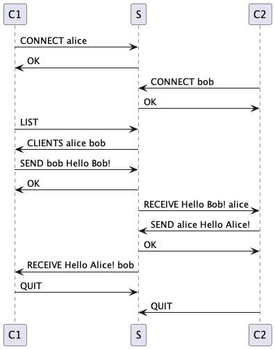
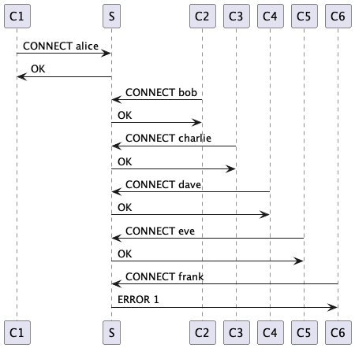
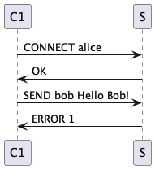
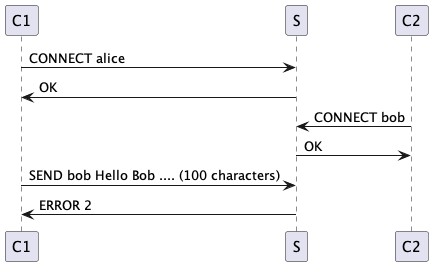

[markdown]:
  https://github.com/heig-vd-dai-course/heig-vd-dai-course/blob/main/11-define-an-application-protocol/COURSE_MATERIAL.md
[pdf]:
  https://heig-vd-dai-course.github.io/heig-vd-dai-course/11-define-an-application-protocol/11-define-an-application-protocol-course-material.pdf
[license]:
  https://github.com/heig-vd-dai-course/heig-vd-dai-course/blob/main/LICENSE.md
[discussions]: https://github.com/orgs/heig-vd-dai-course/discussions/95
[illustration]:
  https://images.unsplash.com/photo-1521587760476-6c12a4b040da?fit=crop&h=720

# Define an application protocol - Course material

<https://github.com/heig-vd-dai-course>

[Markdown][markdown] · [PDF][pdf]

L. Delafontaine and H. Louis, with the help of GitHub Copilot.

This work is licensed under the [CC BY-SA 4.0][license] license.

![Main illustration][illustration]

## Table of contents

- [Table of contents](#table-of-contents)
- [Objectives](#objectives)
- [A quick reminder about networking](#a-quick-reminder-about-networking)
  - [The Internet Protocol (IP)](#the-internet-protocol-ip)
  - [The Domain Name System (DNS)](#the-domain-name-system-dns)
  - [Common DNS records](#common-dns-records)
  - [Reserved ports](#reserved-ports)
- [What is an application protocol](#what-is-an-application-protocol)
- [How is structured an application protocol](#how-is-structured-an-application-protocol)
- [How to define an application protocol](#how-to-define-an-application-protocol)
  - [Section 1 - Overview](#section-1---overview)
  - [Section 2 - Transport protocol](#section-2---transport-protocol)
  - [Section 3 - Messages](#section-3---messages)
  - [Section 4 - Examples](#section-4---examples)
- [Example - The SMS protocol](#example---the-sms-protocol)
  - [Section 1 - Overview](#section-1---overview-1)
  - [Section 2 - Transport protocol](#section-2---transport-protocol-1)
  - [Section 3 - Messages](#section-3---messages-1)
  - [Section 4 - Examples](#section-4---examples-1)
- [Practical content](#practical-content)
  - [Define the application protocol for the _"Guess the number"_ game](#define-the-application-protocol-for-the-guess-the-number-game)
  - [Define the application protocol for the "Temperature monitoring" application](#define-the-application-protocol-for-the-temperature-monitoring-application)
  - [The context](#the-context-1)
  - [Share your application protocols](#share-your-application-protocols)
  - [Go further](#go-further)
- [Conclusion](#conclusion)
  - [What did you do and learn?](#what-did-you-do-and-learn)
  - [Test your knowledge](#test-your-knowledge)
- [Finished? Was it easy? Was it hard?](#finished-was-it-easy-was-it-hard)
- [What will you do next?](#what-will-you-do-next)
- [Additional resources](#additional-resources)
- [Solution](#solution)
- [Sources](#sources)

## Objectives

An application protocol is a document that is used to define how applications
exchange information between them (usually a between a client and a server). It
is defined by a set of rules that each party must follow to communicate.

In this chapter, you will have a refresh about networking and you will learn
where to find information about application protocols, how is defined an
application protocol and how to define your own application protocol. In future
chapters, you will learn how to interact with well known application protocols.

> [!IMPORTANT]
>
> While quite short, this chapter is one of the most important in the course. It
> will help you to understand how applications communicate with each other and
> how to define your own application protocol for others to use.

## A quick reminder about networking

### The Internet Protocol (IP)

Each computer connected to the Internet has an
[IP (Internet Protocol) address](https://en.wikipedia.org/wiki/IP_address). This
IP address is used to identify the computer on the Internet. It is a unique
address. As [IPv4](https://en.wikipedia.org/wiki/Internet_Protocol_version_4)
addresses are limited, there are
[NAT (Network Address Translation)](https://en.wikipedia.org/wiki/Network_address_translation)
routers that allow to share a single IP address between multiple computers. This
is why [IPv6](https://en.wikipedia.org/wiki/IPv6) was created.

### The Domain Name System (DNS)

The [Domain Name System (DNS)](https://en.wikipedia.org/wiki/Domain_Name_System)
is a system that allows to map a domain name to an IP address. For example, the
domain name `heig-vd.ch` is mapped to the IP address `193.134.223.20`.

You can check this by running the following command with
[nslookup](https://en.wikipedia.org/wiki/Nslookup):

```sh
nslookup heig-vd.ch
```

The output should be similar to the following:

```text
Server:         8.8.8.8
Address:        8.8.8.8#53

Non-authoritative answer:
Name:   heig-vd.ch
Address: 193.134.223.20
```

Note the `Address` line. It is the IP mapping the DNS record.

The current DNS server used to resolve the DNS query is `8.8.8.8`.

When you browse the web, your browser will use the DNS to find the IP address of
the web server. Then, it will use the IP address to request the content of the
web page on the web server.

### Common DNS records

The DNS holds what are called DNS records. These records are used to map a
domain name to an IP address. There are many types of DNS records. The most
common ones are:

- `NS`: This record specifies the name servers for a given domain name.
- `CNAME`: This record specifies an alias for a given domain name.
- `A`: This record specifies the IP address of a given domain name (IPv4).
- `AAAA`: This record specifies the IP address of a given domain name (IPv6).

In this course, you will learn to use a few of these records in future chapters.

### Reserved ports

In computer networking, a port is a communication endpoint. At the software
level, within an operating system, a port is a logical construct that identifies
a specific process or a type of network service. Ports are identified for each
protocol and address combination by 16-bit unsigned numbers, commonly known as
the port number.

A possible analogy is this: an IP address is like a street address, and a port
is like an apartment number. The IP address identifies the computer, and the
port number identifies the specific process running on that computer.

Using 16-bit unsigned numbers, the maximum number of ports is 65536. However,
not all ports can be used by anyone. Some ports are reserved for specific
protocols.

The first 0 to 1023 ports are called well-known ports. These ports are reserved
for specific protocols. Using these ports might require special privileges on
Unix systems.

Here is a list of examples for common well-known ports:

- `20` and `21`: FTP
- `22`: SSH
- `23`: Telnet
- `25`, `465` and `587`: SMTP
- `53`: DNS
- `80` and `443`: HTTP/HTTPS
- `110` and `995`: POP3
- `123`: NTP
- `143` and `993`: IMAP

The next 1024 to 49151 ports are called registered ports. Some ports are
officially registered by the IANA (Internet Assigned Numbers Authority) and some
are not. They can be used by anyone.

Here is a list of examples for common registered ports:

- `3306`: MySQL
- `5000–5500`: League of Legends
- `5432`: PostgreSQL
- `6379`: Redis
- `8080`: HTTP alternative port
- `25565`: Minecraft
- `27017`: MongoDB

The last 49152 to 65535 ports are called dynamic ports. They are usually used
for private, customized services, or for temporary purposes. These ports cannot
be registered and can be used by anyone.

Here is a list of examples for common dynamic ports:

- `51820`: WireGuard
- `64738`: Mumble

Wikipedia has a
[list of TCP and UDP port numbers](https://en.wikipedia.org/wiki/List_of_TCP_and_UDP_port_numbers)
that you can use to find the port number of a specific protocol.

## What is an application protocol

An application protocol is a document that defines how two applications can
communicate.

These documents are usually called RFC (Request For Comments) and are available
on the [IETF website](https://www.ietf.org/), an organization that defines
standards for the Internet (among others).

The name RFC comes from the fact that these documents are usually the result of
a discussion between multiple people. The RFC is a document that is open to
comments and suggestions. It is usually updated multiple times before being
considered as a standard.

An application protocol relies on a transport protocol (TCP or UDP) and a
network protocol (IP). It comes on top of these protocols and defines how
applications can communicate.

Multiple revisions of the same protocol can exist. For example, the HTTP
protocol has multiple revisions (HTTP/1.0, HTTP/1.1, HTTP/2, HTTP/3). Each
revision is defined by a different RFC and has different features.

Here are some examples of application protocols:

- [Official RFC for the SMTP protocol](https://tools.ietf.org/html/rfc5321):
- [Official RFC for the POP3 protocol](https://datatracker.ietf.org/doc/html/rfc1939)
- [Official RFC for the IMAP protocol](https://datatracker.ietf.org/doc/html/rfc3501)
- [Official RFC for the SSH protocol](https://datatracker.ietf.org/doc/html/rfc4253)
- [Official RFC for the HTTP/3 protocol](https://datatracker.ietf.org/doc/html/rfc9113):

## How is structured an application protocol

An application protocol is usually defined by a set of rules that each party
must follow to communicate.

These rules are usually defined in a RFC as _messages_ (also known as _actions_
or _commands_). The RFC defines the messages that can be exchanged between the
client and the server, the format of these messages and the order in which they
can be exchanged.

For example, the SMTP protocol defines the following messages (among others):

- `HELO`: used to initiate a connection with the server
- `EHLO`: used to initiate a connection with the server (extended version of
  `HELO`)
- `MAIL`: used to specify the sender of the message
- `RCPT`: used to specify the recipient of the message
- `DATA`: used to send the content of the message
- `RSET`: used to reset the connection

Each message has a specific format. For example, the `MAIL` message has the
following format:

```text
MAIL FROM:<sender>
```

The `MAIL` message is used to specify the sender of the message. The sender is
specified after the `MAIL FROM:` keyword. You will learn more about the SMTP
protocol in a future chapter to illustrate this example.

A RFC also defines the order in which messages can be or must be exchanged.

This is done using a sequence diagram, depending on the nature/complexity of the
protocol.

A sequence diagram is a diagram that defines the different messages that can be
exchanged between the client and the server and the order in which they can be
exchanged.

An RFC also defines edge cases and error cases, using the same diagrams. It is
important to define these cases to avoid any ambiguity and define how the
protocol should behave in these cases.

## How to define an application protocol

Defining an application protocol is not an easy task. It requires a lot of
thinking and a lot of testing.

It is also important to keep in mind that a protocol is never perfect. It can
always be improved. It is important to keep an open mind and to be ready to
change the protocol if needed.

The more you think and design your application protocols, the less you will have
to change them in the future and discover issues.

As you have seen, an application protocol is defined by a RFC. A RFC is a
document that defines the rules that each party must follow to communicate.

These rules are usually defined in multiple sections. Each section defines a
specific part of the protocol but they can vary a lot depending on the protocol
and can be hard to define/understand as they can be very technical.

As there is no strict rule to define an application protocol, we will define a
simple structure that you can use to define your own application protocol used
in this course:

- [Section 1 - Overview](#section-1---overview)
- [Section 2 - Transport protocol](#section-2---transport-protocol)
- [Section 3 - Messages](#section-3---messages)
- [Section 4 - Examples](#section-4---examples)

This structure, while simple, will help you to define your own application
protocols in a clear and concise way.

### Section 1 - Overview

This section defines the purpose of the protocol:

- What is the goal of the protocol?
- What is the problem that it tries to solve?
- What the application protocol is used for?

### Section 2 - Transport protocol

This section defines the transport protocol used by the application protocol:

- What protocol(s) is/are involved?
- On which port(s)?
- How are messages/actions encoded?
- How are messages/actions delimited?
- How are messages/actions treated?
- Who initiates/closes the communication?
- What happens on an unknown message/action/exception?

### Section 3 - Messages

This section defines the messages that can be exchanged between the client and
the server.

- What are the messages/actions?
- What are the parameters?
- What are the return values?
- What are the exceptions?

Always try to describe these for a given context, not from each point of view
(e.g. _"making an order"_ with the input/outputs from the client to the server
and the responses instead of _"the client sends these messages and the server
replies these messages with these outputs"_). It makes it way easier to
understand and to implement.

### Section 4 - Examples

This section defines examples of messages that can be exchanged between the
client and the server and the exchange order:

- What are the examples of messages/actions?
- What are the examples of exceptions?

It is important to define these examples to illustrate the protocol and to help
the reader to understand the protocol using sequence or state diagrams.

## Example - The SMS protocol

You are working for a startup that wants to create a new communication app.

The app is simple: it allows users to send text messages to each other. The
server is in charge of sending the messages to the recipients.

You are asked to define the application protocol that will be used by the
clients and the server.

Here is **one of the possible results**.

> [!NOTE]
>
> Each person can have a different way to define the protocol. This is one of
> the possible ways to define the protocol. Your might be different and that is
> totally fine. The most important is to define the protocol in a clear and
> explicit way.

### Section 1 - Overview

The SMS (Short Message Service) protocol is a communication protocol that allows
the sending of text messages (generally short) between users.

### Section 2 - Transport protocol

The SMS protocol is a text message transport protocol. It must use the TCP
(Transmission Control Protocol) to ensure the reliability of data transmission
and must also use port 1234.

The initial connection must be established by the client. The server can refuse
the connection if the maximum number of connections is reached. The maximum
number of connections per server is 5. Beyond this number, the server refuses
the connection.

Once the connection is established, the client can send a text message to the
server indicating the message recipient.

The server must verify that the recipient is connected and that the message does
not exceed 100 characters. If these conditions are met, the server sends the
message to the recipient. Otherwise, the server sends an error message to the
client who sent the message.

### Section 3 - Messages

The messages sent by the client and the server are text messages. The messages
sent by the client are in the following form:

#### Connexion

##### Request

```text
CONNECT <name>
```

- `name`: the name of the client

##### Response

- `OK`: the connection has been successfully established
- `ERROR <code>`: an error occurred during the connection. The error code is an
  integer between 1 and 2 inclusive. The error codes are as follows:
  - 1: the maximum number of connections is reached
  - 2: the client's name is already in use

#### Sending a message

Le client envoie un message au serveur en indiquant le destinataire du message.
Le serveur est alors en charge de transmettre le message au destinataire.

##### Request

```text
SEND <recipent> <message>
```

##### Response

- `OK`: the message has been successfully sent
- `ERROR <code>`: an error occurred while sending the message. The error code is
  an integer between 1 and 2 inclusive. The error codes are as follows:
  - 1: the recipient is not connected
  - 2: the message exceeds 100 characters

#### Receiving a message

The server sends a message to the recipient indicating the sender of the
message. The client is then responsible for displaying the received message.

##### Request

```text
RECEIVE <message> <sender>
```

- `message`: the received message
- `sender`: the name of the message sender

##### Response

None.

#### List connected clients

##### Request

```text
LIST
```

##### Response

- `CLIENTS <client1> <client2> <client3> ...`: the list of connected clients.
  The clients are separated by a space.

#### Disconnection

##### Request

```text
QUIT
```

##### Response

None.

### Section 4 - Examples

#### Functional communication between a client and a server



#### Communication between a client and a server with the maximum number of connections reached



#### Communication between a client and a server with a duplicate client name



#### Communication between a client and a server with an unconnected recipient


#### Communication between a client and a server with a too long message



## Practical content

### Define the application protocol for the _"Guess the number"_ game

In this section, you will define your own application protocol based on a given
context.

#### The context

You are working for a game company that wants to create a new game called
_"Guess the number"_.

The game is simple: the server generates a random number between 1 and 100
(customizable).

The client has to guess the number. The server will respond with `HIGHER`,
`LOWER` or `CORRECT` depending on the number guessed by the client.

Once the client has guessed the number, the server will respond with `CORRECT`
and the game will end.

#### The exercise

You are asked to define the application protocol that will be used by the
clients and the server.

Keep in mind the following points:

- What is the purpose of the protocol?
- On which port(s) does the protocol work?
- On which protocol(s) does the protocol work?
- Who initiates the connection?
- What are the available messages/actions?
- What is the format of the messages/actions?
- Are there any edge cases or error cases? What happens in these cases?

You can represent your application protocol using a sequence diagram.

You can use [PlantUML](https://plantuml.com/), [Draw.io](https://draw.io/) or
any other tools you want to create your diagrams.

This protocol will be used in a future chapter to implement the game.

### Define the application protocol for the "Temperature monitoring" application

In this section, you will define your own application protocol based on a given
context.

### The context

You are working for an energy company that is interested in monitoring the
temperature of its buildings. The company wants to create a new application
called _"Temperature monitoring"_.

The application is simple: each room (customizable) has a temperature sensor (an
emitter) that emits its own temperature to a receiver (a server).

The server will store the latest temperature of each room.

An operator (client) can connect to the server and request the temperature of a
specific room. The server will respond with the temperature of the room.

#### The exercise

You are asked to define the application protocol that will be used by the
sensors (the emitters), the receiver (the server) and the operator (client).

Keep in mind the following points:

- What is the purpose of the protocol?
- On which port(s) does the protocol work?
- On which protocol(s) does the protocol work?
- Who initiates the connection?
- What are the available messages/actions?
- What is the format of the messages/actions?
- Are there any edge cases or error cases? What happens in these cases?

You can represent your application protocol using a sequence diagram.

You can use [PlantUML](https://plantuml.com/), [Draw.io](https://draw.io/) or
any other tools you want to create your diagrams.

This protocol will be used in a future chapter to implement the application.

### Share your application protocols

Share your application protocols in the GitHub Discussions of this organization:
<https://github.com/orgs/heig-vd-dai-course/discussions>.

Create a new discussion with the following information:

- **Title**: DAI 2024-2025 - Check out my application protocols! - First name
  Last Name
- **Category**: Show and tell
- **Description**: Copy/paste your application protocols in two distinct
  sections.

This will notify us that you have completed the exercise and we can check your
work.

You can compare your solution with the official one stated in the
[Solution](#solution) section, however, **we highly recommend you to try to
complete the practical content by yourself first to learn the most**.

### Go further

This is an optional section. Feel free to skip it if you do not have time.

- You can check the RFC for the FTP protocol, DNS protocol and the DHCP
  protocol. Are they similar to the protocols you have seen before? What are the
  differences?

## Conclusion

### What did you do and learn?

In this chapter, you have learned how an application protocol is defined using
RFCs.

You are able to understand an existing application protocol and define your own
application protocols.

You have also learned the importance of defining an application protocol and the
different steps to follow to define an application protocol.

These skills are essential to understand how applications communicate with each
other and how to define your own application protocol for others to use.

### Test your knowledge

At this point, you should be able to answer the following questions:

- How is structured an application protocol?
- Why is it important to define an application protocol?
- How to define an application protocol?
- Where can you find information about application protocols?
- What is a RFC?
- How can a diagram help you to understand an application protocol?

## Finished? Was it easy? Was it hard?

Can you let us know what was easy and what was difficult for you during this
chapter?

This will help us to improve the course and adapt the content to your needs. If
we notice some difficulties, we will come back to you to help you.

> [!NOTE]
>
> Vous pouvez évidemment poser toutes vos questions et/ou vos propositions
> d'améliorations en français ou en anglais.
>
> N'hésitez pas à nous dire si vous avez des difficultés à comprendre un concept
> ou si vous avez des difficultés à réaliser les éléments demandés dans le
> cours. Nous sommes là pour vous aider !

➡️ [GitHub Discussions][discussions]

You can use reactions to express your opinion on a comment!

## What will you do next?

In the next chapter, you will learn the following topics:

- Java TCP programming
  - How to create a TCP server
  - How to create a TCP client
  - Implement the "Guess the number" game using TCP

## Additional resources

_Resources are here to help you. They are not mandatory to read._

- _None yet_

_Missing item in the list? Feel free to open a pull request to add it! ✨_

## Solution

You can find the solution to the practical content in the
[`heig-vd-dai-course/heig-vd-dai-course-solutions`](https://github.com/heig-vd-dai-course/heig-vd-dai-course-solutions)
repository.

If you have any questions about the solution, feel free to open an issue to
discuss it!

## Sources

- Main illustration by [Iñaki del Olmo](https://unsplash.com/@inakihxz) on
  [Unsplash](https://unsplash.com/photos/NIJuEQw0RKg)
