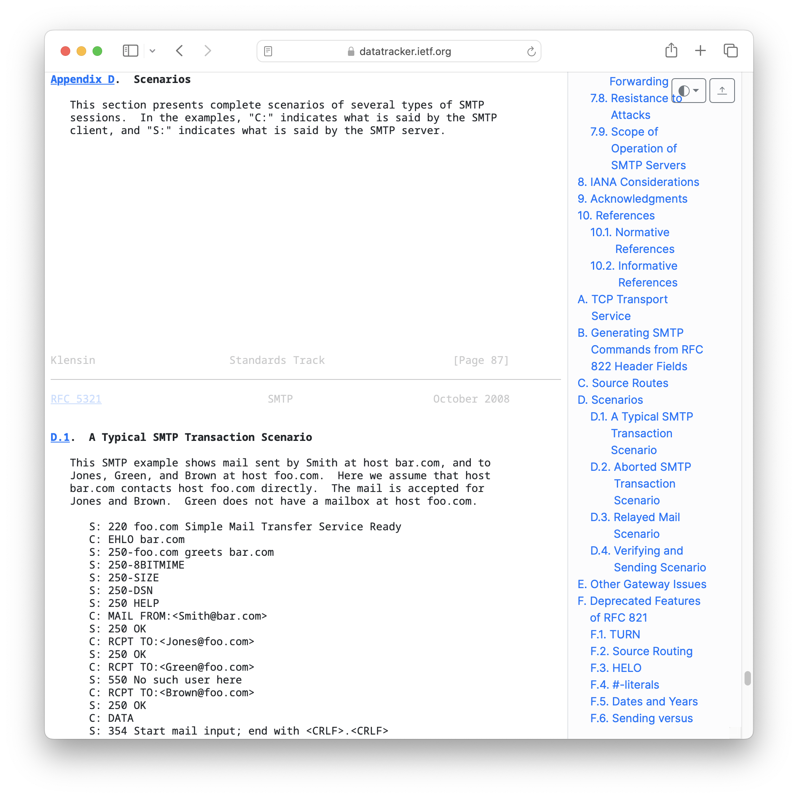
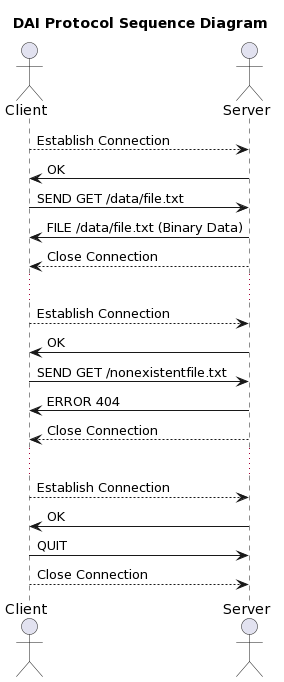

<!--
theme: gaia
size: 16:9
paginate: true
author: L. Delafontaine and H. Louis, with the help of AI tools
title: HEIG-VD DAI Course - Define an application protocol
description: Define an application protocol for the DAI course at HEIG-VD, Switzerland
url: https://heig-vd-dai-course.github.io/heig-vd-dai-course/11-define-an-application-protocol/
footer: '**HEIG-VD** - DAI Course 2023-2024 - CC BY-SA 4.0'
style: |
    :root {
        --color-background: #fff;
        --color-foreground: #333;
        --color-highlight: #f96;
        --color-dimmed: #888;
        --color-headings: #7d8ca3;
    }
    blockquote {
        font-style: italic;
    }
    table {
        width: 100%;
    }
    th:first-child {
        width: 15%;
    }
    h1, h2, h3, h4, h5, h6 {
        color: var(--color-headings);
    }
    h2, h3, h4, h5, h6 {
        font-size: 1.5rem;
    }
    h1 a:link, h2 a:link, h3 a:link, h4 a:link, h5 a:link, h6 a:link {
        text-decoration: none;
    }
    section:not([class=lead]) > p, blockquote {
        text-align: justify;
    }
headingDivider: 4
-->

[web]:
  https://heig-vd-dai-course.github.io/heig-vd-dai-course/11-define-an-application-protocol/
[pdf]:
  https://heig-vd-dai-course.github.io/heig-vd-dai-course/11-define-an-application-protocol/11-define-an-application-protocol-presentation.pdf
[license]:
  https://github.com/heig-vd-dai-course/heig-vd-dai-course/blob/main/LICENSE.md
[discussions]: https://github.com/orgs/heig-vd-dai-course/discussions
[illustration]:
  https://images.unsplash.com/photo-1521587760476-6c12a4b040da?fit=crop&h=720
[course-material]:
  https://github.com/heig-vd-dai-course/heig-vd-dai-course/blob/main/11-define-an-application-protocol/COURSE_MATERIAL.md
[course-material-qr-code]:
  https://quickchart.io/qr?format=png&ecLevel=Q&size=400&margin=1&text=https://github.com/heig-vd-dai-course/heig-vd-dai-course/blob/main/11-define-an-application-protocol/COURSE_MATERIAL.md

# Define an application protocol

<!--
_class: lead
_paginate: false
-->

<https://github.com/heig-vd-dai-course>

[Web][web] · [PDF][pdf]

<small>L. Delafontaine and H. Louis, with the help of AI tools</small>

<small>This work is licensed under the [CC BY-SA 4.0][license] license.</small>

![bg opacity:0.1][illustration]

## Objectives

- Learn where to find information about application protocols
- Understand application protocol
- Define application protocols
- How to use an application protocol

## What is an application protocol?

<!-- _class: lead -->

More details for this section in the
[course material](https://github.com/heig-vd-dai-course/heig-vd-dai-course/blob/main/11-define-an-application-protocol/COURSE_MATERIAL.md#what-is-an-application-protocol).
You can find other resources and alternatives as well.

### What is an application protocol?

- Defines application communication
- RFCs on IETF
- Relies on transport and network protocols
- Multiple revisions exist

## How is structured an application protocol?

<!-- _class: lead -->

More details for this section in the
[course material](https://github.com/heig-vd-dai-course/heig-vd-dai-course/blob/main/11-define-an-application-protocol/COURSE_MATERIAL.md#how-is-structured-an-application-protocol).
You can find other resources and alternatives as well.

### How is structured an application protocol?

- Defined by rules
- Messages format
- Order of message exchange using sequence diagram(s)
- Edge and error cases

## How to define an application protocol?

<!-- _class: lead -->

More details for this section in the
[course material](https://github.com/heig-vd-dai-course/heig-vd-dai-course/blob/main/11-define-an-application-protocol/COURSE_MATERIAL.md#how-to-define-an-application-protocol).
You can find other resources and alternatives as well.

### How to define an application protocol?

- Lot of work and thinking
- A protocol is never perfect
- The more you think and design, the less you will have to change it later

### Section 1 - Overview

This section defines the purpose of the protocol. What is the goal of the
protocol? What is the problem that it tries to solve?

> The DAI protocol is meant to transfer files over the network.
>
> The DAI protocol is a client-server protocol.
>
> The client connects to a server and request a file. The server sends the file
> or an error message if the file does not exist.

### Section 2 - Transport protocol

This section defines the transport protocol, the port that will be used and who
initiates and who closes the connection.

> The DAI protocol uses the TCP protocol. The server runs on port 55555.
>
> The client has to know the IP address of the server to connect to. It
> establishes the connection with the server.
>
> The server closes the connection when the transfer is done or if an error
> occurs (e.g. the file was not found).

### Section 3 - Messages

This section defines the messages that can be exchanged between the client and
the server.

> The client can send the following messages:
>
> - `GET <file>`: used to request a file from the server
>   - `<file>`: the name of the file to request - The filename is an absolute
>     path to the file (`/data/file.txt`)
> - `QUIT`: used to close the connection with the server

---

> The server can send the following messages:
>
> - `OK`: used to notify the client that the connection was successful and the
>   server is ready to receive commands
> - `FILE <file>`: used to send the content of the requested file - the
>   connection is closed after this message
> - `ERROR <code>`: used to notify the client that an error occurred - the
>   connection is closed after this message
>   - `400`: the request was malformed
>   - `404`: the file was not found

---

> All messages are UTF-8 encoded and end with a new line character (`\n`).
>
> If the file exists, the server sends the file content as binary data.

### Section 4 - Examples

This section defines examples of messages that can be exchanged between the
client and the server and the exchange order.

## Reserved ports

<!-- _class: lead -->

More details for this section in the
[course material](https://github.com/heig-vd-dai-course/heig-vd-dai-course/blob/main/11-define-an-application-protocol/COURSE_MATERIAL.md#reserved-ports).
You can find other resources and alternatives as well.

### Reserved ports

- Ports identify processes or services
- Ports are 16-bit unsigned numbers
- Well-known ports: 0-1023
- Registered ports: 1024-49151
- Dynamic ports: 49152-65535

## A quick note on the Unix philosophy and POSIX

<!-- _class: lead -->

More details for this section in the
[course material](https://github.com/heig-vd-dai-course/heig-vd-dai-course/blob/main/11-define-an-application-protocol/COURSE_MATERIAL.md#a-quick-note-on-the-unix-philosophy-and-posix).
You can find other resources and alternatives as well.

### A quick note on the Unix philosophy and POSIX

- Unix philosophy: minimalist, modular software
- POSIX defines APIs for portability on multiple operating systems

## Practical content

<!-- _class: lead -->

### What will you do?

- Explore existing application protocols
- Define your own application protocol based a use case

Understanding how an application protocol is defined will help you to understand
how to use them in future chapters!

### Find the practical content

<!-- _class: lead -->

You can find the practical content for this chapter on
[GitHub][course-material].

[![bg right w:75%][course-material-qr-code]][course-material]

## Finished? Was it easy? Was it hard?

Can you let us know what was easy and what was difficult for you during this
chapter?

This will help us to improve the course and adapt the content to your needs. If
we notice some difficulties, we will come back to you to help you.

➡️ [GitHub Discussions][discussions]

You can use reactions to express your opinion on a comment!

## What will you do next?

In the next chapter, you will learn the following topics:

- Docker and Docker Compose: how to containerize your applications
  - What is an image?
  - What is a container?
  - How to try out new software without installing it?

## Sources

- Main illustration by [Iñaki del Olmo](https://unsplash.com/@inakihxz) on
  [Unsplash](https://unsplash.com/photos/NIJuEQw0RKg)
- Illustration by [Aline de Nadai](https://unsplash.com/@alinedenadai) on
  [Unsplash](https://unsplash.com/photos/j6brni7fpvs)
- Illustration by [Henry Be](https://unsplash.com/@henry_be) on
  [Unsplash](https://unsplash.com/photos/lc7xcWebECc)
- Illustration by [CHUTTERSNAP](https://unsplash.com/@chuttersnap) on
  [Unsplash](https://unsplash.com/photos/xewrfLD8emE)
