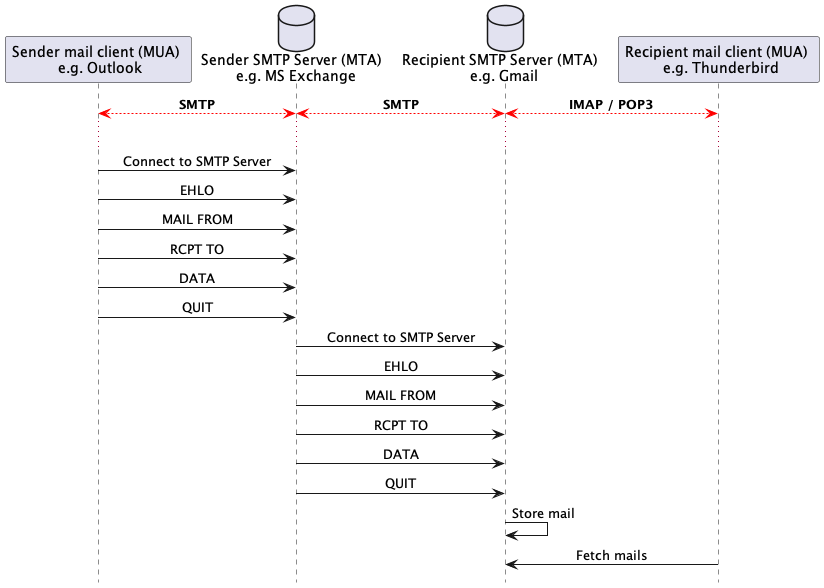

[markdown]:
  https://github.com/heig-vd-dai-course/heig-vd-dai-course/blob/main/11-smtp-and-telnet/COURSE_MATERIAL.md
[pdf]:
  https://heig-vd-dai-course.github.io/heig-vd-dai-course/11-smtp-and-telnet/11-smtp-and-telnet-course-material.pdf
[license]:
  https://github.com/heig-vd-dai-course/heig-vd-dai-course/blob/main/LICENSE.md
[discussions]: https://github.com/orgs/heig-vd-dai-course/discussions/114
[illustration]:
  https://images.unsplash.com/photo-1526554850534-7c78330d5f90?fit=crop&h=720

# SMTP and Telnet - Course material

<https://github.com/heig-vd-dai-course>

[Markdown][markdown] · [PDF][pdf]

L. Delafontaine and H. Louis, with the help of Copilot.

Based on the original course by O. Liechti and J. Ehrensberger.

This work is licensed under the [CC BY-SA 4.0][license] license.

![Main illustration][illustration]

## Table of contents

- [Table of contents](#table-of-contents)
- [Objectives](#objectives)
- [A quick reminder about networking](#a-quick-reminder-about-networking)
- [Electronic messaging protocols: SMTP, POP3 and IMAP](#electronic-messaging-protocols-smtp-pop3-and-imap)
  - [SMTP](#smtp)
  - [POP3](#pop3)
  - [IMAP](#imap)
- [DNS records related to email](#dns-records-related-to-email)
- [Security concerns and blacklisting](#security-concerns-and-blacklisting)
- [A focus on the SMTP protocol](#a-focus-on-the-smtp-protocol)
- [Telnet](#telnet)
- [Practical content](#practical-content)
  - [Install and configure Telnet](#install-and-configure-telnet)
  - [Start MailHog](#start-mailhog)
  - [Send an email with Telnet](#send-an-email-with-telnet)
  - [Stop MailHog](#stop-mailhog)
  - [Go further](#go-further)
- [Conclusion](#conclusion)
  - [What did you do and learn?](#what-did-you-do-and-learn)
  - [Test your knowledge](#test-your-knowledge)
- [Finished? Was it easy? Was it hard?](#finished-was-it-easy-was-it-hard)
- [What will you do next?](#what-will-you-do-next)
- [Additional resources](#additional-resources)
- [Sources](#sources)

## Objectives

In this chapter, you will have a refresh about networking and learn about the
SMTP protocol. You will also learn how to use the Telnet protocol to send an
email to an SMTP server.

## A quick reminder about networking

Each computer connected to the Internet has an
[IP (Internet Protocol) address](https://en.wikipedia.org/wiki/IP_address). This
IP address is used to identify the computer on the Internet. It is a unique
address. As [IPv4](https://en.wikipedia.org/wiki/Internet_Protocol_version_4)
addresses are limited, there are
[NAT (Network Address Translation)](https://en.wikipedia.org/wiki/Network_address_translation)
routers that allow to share a single IP address between multiple computers. This
is why [IPv6](https://en.wikipedia.org/wiki/IPv6) was created.

The [Domain Name System (DNS)](https://en.wikipedia.org/wiki/Domain_Name_System)
is a system that allows to map a domain name to an IP address. For example, the
domain name `heig-vd.ch` is mapped to the IP address `193.134.223.20`.

You can check this by running the following command with
[nslookup](https://en.wikipedia.org/wiki/Nslookup):

```sh
nslookup heig-vd.ch
```

The output should be similar to the following:

```text
Server:         8.8.8.8
Address:        8.8.8.8#53

Non-authoritative answer:
Name:   heig-vd.ch
Address: 193.134.223.20
```

Note the `Address` line. It is the IP mapping the DNS record.

The current DNS server used to resolve the DNS query is `8.8.8.8`.

When you send an email, your email client will use the DNS to find the IP
address of the email server. Then, it will use the IP address to send the email
to the email server.

## Electronic messaging protocols: SMTP, POP3 and IMAP

There are three main protocols used for electronic messaging:

- SMTP
- POP3
- IMAP

You could use any email clients (called Mail User Agents (MUA) in the RFCs) such
as Thunderbird, Gmail or Outlook to use these protocols.

### SMTP

SMTP is the protocol used to send emails. It is a simple text-based protocol
that uses TCP port 25, 465 or 587. The port 25 is used for unencrypted
connections, while the ports 465 and 587 are used for encrypted connections. The
port 587 is the newer and recommended port for encrypted connections.

It is used by email clients to send emails to an email server.

### POP3

POP3 is a protocol used to retrieve emails. It is a simple text-based protocol
that uses TCP port 110 or 995. The port 110 is used for unencrypted connections,
while the port 995 is used for encrypted connections.

It is used by email clients to retrieve emails from an email server.

### IMAP

IMAP is a protocol used to retrieve and synchronize emails. It is a more complex
protocol that uses TCP port 143 or 993. The port 143 is used for unencrypted
connections, while the port 993 is used for encrypted connections.

It is used by email clients to synchronize emails from and to an email server
between the email server and the email client. This means that if you read an
email on your email client, it will be marked as read on the email server, while
POP3 does not allow this.

## DNS records related to email

When you send an email, your email client will use the DNS to find the IP
address of the email server. Then, it will use the IP address to send the email
to the email server.

To find the IP address of the email server, your email client will look for the
following DNS records:

- `MX`: This record specifies the email server that will receive emails for a
  given domain name. For example, the `MX` record for `heig-vd.ch` is
  `heigvd-ch01b.mail.protection.outlook.com.`.
- `A`: This record specifies the IP address of a given domain name. For example,
  the `A` record for `heig-vd.ch` is `193.134.223.20`.
- `TXT`: The `SPF` record, as stated by CloudFlare
  (<https://www.cloudflare.com/en-gb/learning/dns/dns-records/dns-spf-record>),
  _"[] are a type of DNS TXT record commonly used for email authentication. SPF
  records include a list of IP addresses and domains authorized to send emails
  from that domain."_. For example, one of the `TXT` record contains these
  information for `heig-vd.ch`.

You can check these records by running the following command with
[dig](<https://en.wikipedia.org/wiki/Dig_(command)>):

```sh
dig heig-vd.ch any
```

The `any` option allows to display all DNS records for the given domain name. By
default, dig will only display the `A` records.

The output should be similar to the following:

```text

; <<>> DiG 9.10.6 <<>> heig-vd.ch any
;; global options: +cmd
;; Got answer:
;; ->>HEADER<<- opcode: QUERY, status: NOERROR, id: 57402
;; flags: qr rd ra; QUERY: 1, ANSWER: 17, AUTHORITY: 0, ADDITIONAL: 1

;; OPT PSEUDOSECTION:
; EDNS: version: 0, flags:; udp: 512
;; QUESTION SECTION:
;heig-vd.ch.                    IN      ANY

;; ANSWER SECTION:
heig-vd.ch.             300     IN      A       193.134.223.20
heig-vd.ch.             3600    IN      NS      ns-1308.awsdns-35.org.
heig-vd.ch.             3600    IN      NS      ns-2025.awsdns-61.co.uk.
heig-vd.ch.             3600    IN      NS      ns-459.awsdns-57.com.
heig-vd.ch.             3600    IN      NS      ns-811.awsdns-37.net.
heig-vd.ch.             3600    IN      NS      ns01.heig-vd.ch.
heig-vd.ch.             3600    IN      NS      ns02.heig-vd.ch.
heig-vd.ch.             3600    IN      SOA     ns01.heig-vd.ch. noc.heig-vd.ch. 2022060836 3600 600 1209600 3600
heig-vd.ch.             300     IN      MX      0 heigvd-ch01b.mail.protection.outlook.com.
heig-vd.ch.             21600   IN      TXT     "MS=ms50694826"
heig-vd.ch.             21600   IN      TXT     "_globalsign-domain-verification=KwkbjUch-6S14SrWPzp272TN8uENyWwrdQZsoQTI_J"
heig-vd.ch.             21600   IN      TXT     "adobe-idp-site-verification=38a35c2c3cc6e86da35b8375404692f367713de605009c52e448eb39368c1203"
heig-vd.ch.             21600   IN      TXT     "atlassian-domain-verification=gKTmd7bpHiB/2YT6iD6xu8e4EcLbgvoWjCKrKp1lGX2LeLNPWgQti2nsPGn6i3BS"
heig-vd.ch.             21600   IN      TXT     "atlassian-sending-domain-verification=dad47472-4668-4676-b0ec-1421cff8a150"
heig-vd.ch.             21600   IN      TXT     "msyx415nv8c4jm0ytjr5kyklfcs0df21"
heig-vd.ch.             21600   IN      TXT     "swisssign-check=uC1XddBVk6xjFFVza2UjLeEyODs5l1ELm8tk1KY2Nb"
heig-vd.ch.             21600   IN      TXT     "v=spf1 ip4:193.134.218.124 ip4:145.232.233.54 ip4:27.126.146.0/24 ip4:103.28.42.0/24 ip4:146.88.28.0/24 ip4:163.47.180.0/22 ip4:203.55.21.0/24 ip4:204.75.142.0/24 " "ip4:185.144.39.35/32 ip4:185.144.39.39/32  include:spf.hefr.ch include:aspmx.pardot.com include:_spf.fullfabric.com include:alumnforce.org include:spf.protection.outlook.com -all"

;; Query time: 79 msec
;; SERVER: 8.8.8.8#53(8.8.8.8)
;; WHEN: Tue Oct 17 10:50:46 CEST 2023
;; MSG SIZE  rcvd: 1209

```

The output is more verbose than with `nslookup`, but it contains the same
information.

Note the `ANSWER SECTION` line. The `A` record the IP mapping the DNS record.
The `MX` record is the email server that will receive emails for the given
domain name. One of the `TXT` contains the `SPF` records with `v=spf1 [...]`.

## Security concerns and blacklisting

The email protocols are quite old and were not designed with security in mind.
If we look at the SMTP protocol, we can see that:

- SMTP does not require authentication
- SMTP does not require encryption
- SMTP does not require the sender address to be valid
- SMTP does not require the sender address to be the same as the email address
  used to authenticate
- And many other issues

Because of this, SMTP is often used by spammers to send spam emails. To prevent
this, there are many blacklists that contain IP addresses of known spammers. If
an email server is on a blacklist, it will not be able to send emails to some
email servers.

Maintaining email servers is a complex task that requires a lot of knowledge
about the protocols and the security issues. This is why many companies use
third-party email services such as Google or Microsoft 365.

In this course, we will use a simple SMTP server with a Web interface to send
emails. This SMTP server is called MailHog and can be run with Docker:
<https://github.com/mailhog/MailHog>.

> **Warning**  
> Considering these security flaws, please be aware that spoofing an email
> address is really not that hard. However, the HEIG-VD has a strict policy
> regarding the use of its email addresses. If you are caught spoofing an email
> address, you could get in trouble. Please use the MailHog SMTP server for your
> tests to avoid any issues.

## A focus on the SMTP protocol

The SMTP protocol is described in
[RFC 5321](https://datatracker.ietf.org/doc/html/rfc5321).

It uses the TCP protocol on port 25, 465 or 587. It is a text-based protocol
with the following commands (among others):

- `HELO` or `EHLO`: Used to identify the sender
- `MAIL FROM`: Used to specify the sender email address
- `RCPT TO`: Used to specify the recipient email address
- `DATA`: Used to specify the email content
- `QUIT`: Used to close the connection

To send an email, you will need to use the following commands:

```text
EHLO <sender>
MAIL FROM: <sender email address>
RCPT TO: <recipient email address>
DATA
<email content>
.
QUIT
```



## Telnet

[Telnet](https://en.wikipedia.org/wiki/Telnet) is a client/server protocol that
allows to connect to a server and send commands to it.

Telnet can be used to connect to many services such as HTTP, SMTP, POP3, IMAP,
etc. In this course, we will use Telnet to connect to an SMTP server and send an
email.

The Telnet protocol is described in
[RFC 854](https://datatracker.ietf.org/doc/html/rfc854).

As SMTP, Telnet is very old and is not considered secure. However, it is still
used to test services such as SMTP locally and/or to configure network devices
such as routers that you might have to configure during your career. This is why
we will use it in this course for local testing.

## Practical content

### Install and configure Telnet

In this section, you will install and configure Telnet on your operating system.

#### Install Telnet

Telnet is a widely used protocol that is available on most operating systems.
However, as it is not secure, it is often not installed by default.

Check out the following resources to install/enable Telnet on your operating
system. You only need the **client**, not the server:

- Linux: <https://www.baeldung.com/linux/telnet>
- macOS: <https://osxdaily.com/2018/07/18/get-telnet-macos/>
- Windows: <https://www.makeuseof.com/enable-telnet-windows/>

#### Check the installation

You can check the installation by running the following command:

```sh
# Check the installation
telnet
```

The output should be similar to the following:

```text
telnet>
```

You are now in a Telnet session. You can exit it with the `quit` command.

### Start MailHog

Pull the latest changes from the previously cloned
[`heig-vd-dai-course/heig-vd-dai-course-code-examples`](https://github.com/heig-vd-dai-course/heig-vd-dai-course-code-examples)
repository or clone it if you have not done it yet.

Explore the `11-smtp-and-telnet` directory containing the MailHog example with
Docker Compose. Make sure to show hidden files and directories to see the `.env`
file.

In the `11-smtp-and-telnet` directory, run the following command:

```sh
# Start MailHog in background
docker-compose up -d
```

The output should be similar to the following:

```text
[+] Running 8/8
 ✔ mailhog 7 layers [⣿⣿⣿⣿⣿⣿⣿]      0B/0B      Pulled                                                                                                        19.5s
   ✔ df20fa9351a1 Pull complete                                                                                                                              0.6s
   ✔ ed8968b2872e Pull complete                                                                                                                              0.6s
   ✔ a92cc7c5fd73 Pull complete                                                                                                                              0.5s
   ✔ f17c8f1adafb Pull complete                                                                                                                              7.3s
   ✔ 03954754c53a Pull complete                                                                                                                              1.0s
   ✔ 60493946972a Pull complete                                                                                                                              1.2s
   ✔ 368ee3bc1dbb Pull complete                                                                                                                              1.4s
[+] Running 2/2
 ✔ Network 11-smtp-and-telnet_default      Created                                                                                                           0.1s
 ✔ Container 11-smtp-and-telnet-mailhog-1  Created
```

This will start the MailHog SMTP server and the MailHog Web interface.

Display and follow the logs of the container with the following command:

```sh
docker compose logs -f
```

The `-f` option allows to follow the logs. To stop following the logs, you can
press `Ctrl` + `C`.

The output should be similar to the following:

```text
11-smtp-and-telnet-mailhog-1  | 2023/10/17 08:16:26 Using in-memory storage
11-smtp-and-telnet-mailhog-1  | 2023/10/17 08:16:26 [SMTP] Binding to address: 0.0.0.0:1025
11-smtp-and-telnet-mailhog-1  | [HTTP] Binding to address: 0.0.0.0:8025
11-smtp-and-telnet-mailhog-1  | 2023/10/17 08:16:26 Serving under http://0.0.0.0:8025/
11-smtp-and-telnet-mailhog-1  | Creating API v1 with WebPath:
11-smtp-and-telnet-mailhog-1  | Creating API v2 with WebPath:
11-smtp-and-telnet-mailhog-1  | [HTTP] Binding to address: 0.0.0.0:8025
11-smtp-and-telnet-mailhog-1  | 2023/10/17 08:16:33 Using in-memory storage
11-smtp-and-telnet-mailhog-1  | 2023/10/17 08:16:33 [SMTP] Binding to address: 0.0.0.0:1025
11-smtp-and-telnet-mailhog-1  | 2023/10/17 08:16:33 Serving under http://0.0.0.0:8025/
11-smtp-and-telnet-mailhog-1  | Creating API v1 with WebPath:
11-smtp-and-telnet-mailhog-1  | Creating API v2 with WebPath:
11-smtp-and-telnet-mailhog-1  | [APIv1] KEEPALIVE /api/v1/events
```

You can access the MailHog Web interface at <http://localhost:8025>.

### Send an email with Telnet

In this section, you will send an email with Telnet to the MailHog SMTP server.

#### Connect to the SMTP server

Now that MailHog is running, you can send an email with Telnet.

Open a new terminal and run the following command:

```sh
telnet localhost 1025
```

The output should be similar to the following:

```text
Trying ::1...
Connected to localhost.
Escape character is '^]'.
220 mailhog.example ESMTP MailHog
```

This means that you are connected to the MailHog SMTP server.

#### Send an email

In the Telnet session, run the following commands, replace all `<>` values with
your own values (you must keep the `<` and `>` characters!) and the
`the-smtp-domain-name.tld` with any domain name you want:

```text
EHLO the-smtp-domain-name.tld
MAIL FROM: <your-email@gmail.com>
RCPT TO: <recipient@example.com>
DATA
Subject: Your Subject
From: Your Name <your-email@gmail.com>
To: Recipient Name <recipient@example.com>
Content-Type: text/plain; charset="utf-8"

Your email content goes here.
.
```

The SMTP protocol relies on the `MAIL FROM:` and `RCPT TO:` commands to specify
the sender and recipient email addresses. As SMTP does not require
authentication, you can specify any email address you want. SMTP will then
accept the email and send it to the recipient email server, regardless of the
sender email address. This demonstrates the security issues related to SMTP and
why it is often used by spammers and mail spoofers to social engineer people as
the email will be sent from a trusted domain.

In order to spoof an email address, you need to have access to an SMTP server
and send the email from this SMTP server that you share in your network.

The `From:` and `To:` are used by the email client to display the sender and
recipient names. They are not related to the SMTP protocol. They are part of the
email content and helps to display the email content in a human-readable way.

The `.`, on a line by itself, indicates the end of the email content.

In this section, you will install and configure Telnet on your operating system.

The output should be similar to this:

```text
250 Ok: queued as nE5VmMF5saBAV-vC0V2Em7f_p8pgsh5589hamlAl2WQ=@mailhog.example
```

The mail has been sent to the MailHog SMTP server. You can check it in the
MailHog Web interface at <http://localhost:8025>.

Congratulations! You have sent your first email with Telnet!

As you can see, the commands used to prepare and send the email are quite
simple. However, the email content is not. This is why we use email clients
instead of Telnet to send emails.

These commands follow the SMTP protocol, just as any other application protocols
such as the one you created in a previous chapter and the ones you will create
in the future.

To quit the Telnet session, run the following command:

```text
QUIT
```

### Stop MailHog

To stop MailHog, run the following command:

```sh
docker compose down
```

This will stop and remove the MailHog container.

### Go further

This is an optional section. Feel free to skip it if you do not have time.

- Are you able to send an email with a CC recipient?
- Are you able to send an email with a BCC recipient?
- Are you able to send an email with HTML content?
- Are you able to send an email with an attachment?

## Conclusion

### What did you do and learn?

In this chapter, you have had a refresh about networking with IP adresses and
DNS records. You have also learned about the SMTP protocol and how to use Telnet
to send an email to an SMTP server.

Based on the official RFC, you have learned that SMTP is a simple text-based
protocol to send emails with rather simple commands.

With the help of MailHog and Docker, you have now a way to test your emails with
a fake SMTP server for all your other applications!

### Test your knowledge

At this point, you should be able to answer the following questions:

- What are the difference between SMTP, POP3 and IMAP?
- What are the DNS records related to email?
- What are the security concerns related to email?
- What is Telnet?
- What are the SMTP commands to send an email?
- What is the difference between the SMTP commands and the email content?

## Finished? Was it easy? Was it hard?

Can you let us know what was easy and what was difficult for you during this
chapter?

This will help us to improve the course and adapt the content to your needs. If
we notice some difficulties, we will come back to you to help you.

➡️ [GitHub Discussions][discussions]

You can use reactions to express your opinion on a comment!

## What will you do next?

In the next chapter, you will learn the following topics:

- Experiment with the SSH protocol and SCP with Docker and Docker Compose
  - How to access remote servers?
  - Run a SSH server with Docker and copy files from/to a server with SCP

## Additional resources

_Resources are here to help you. They are not mandatory to read._

- _None yet_

_Missing item in the list? Feel free to open a pull request to add it! ✨_

## Sources

- Main illustration by [Joanna Kosinska](https://unsplash.com/@joannakosinska)
  on [Unsplash](https://unsplash.com/photos/uGcDWKN91Fs)
