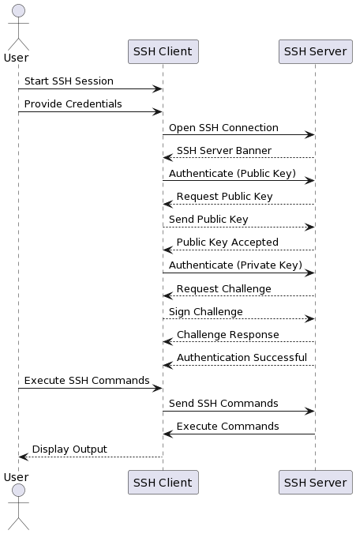
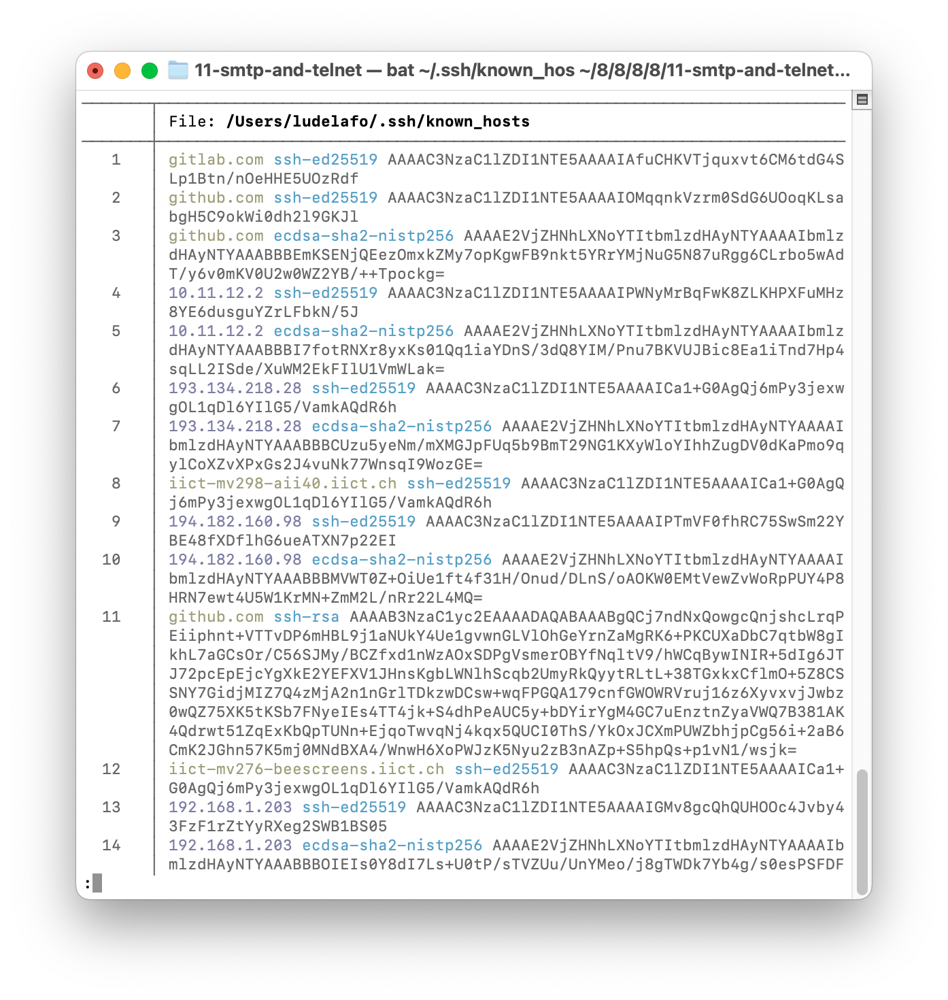
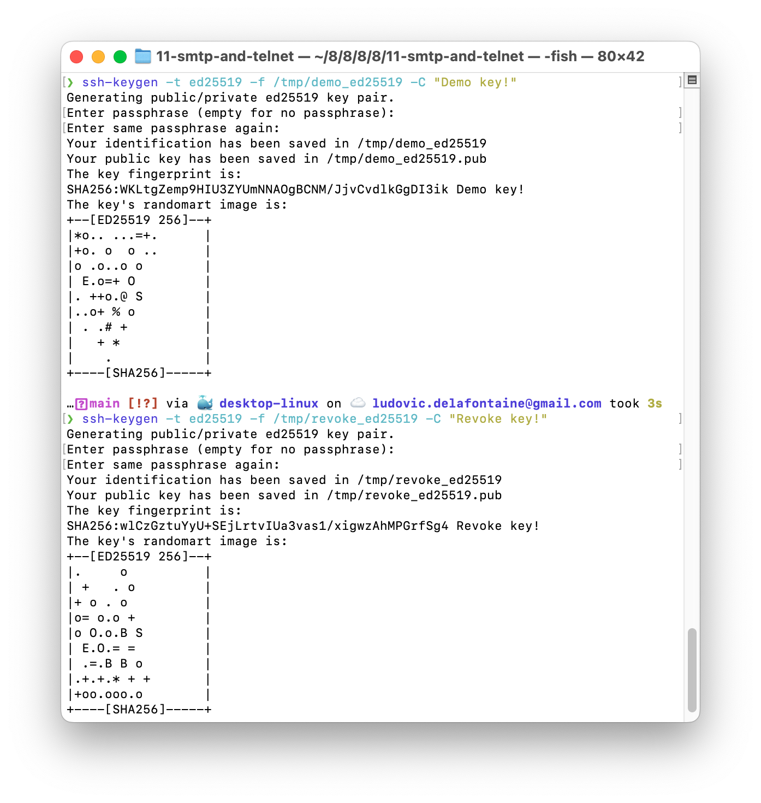
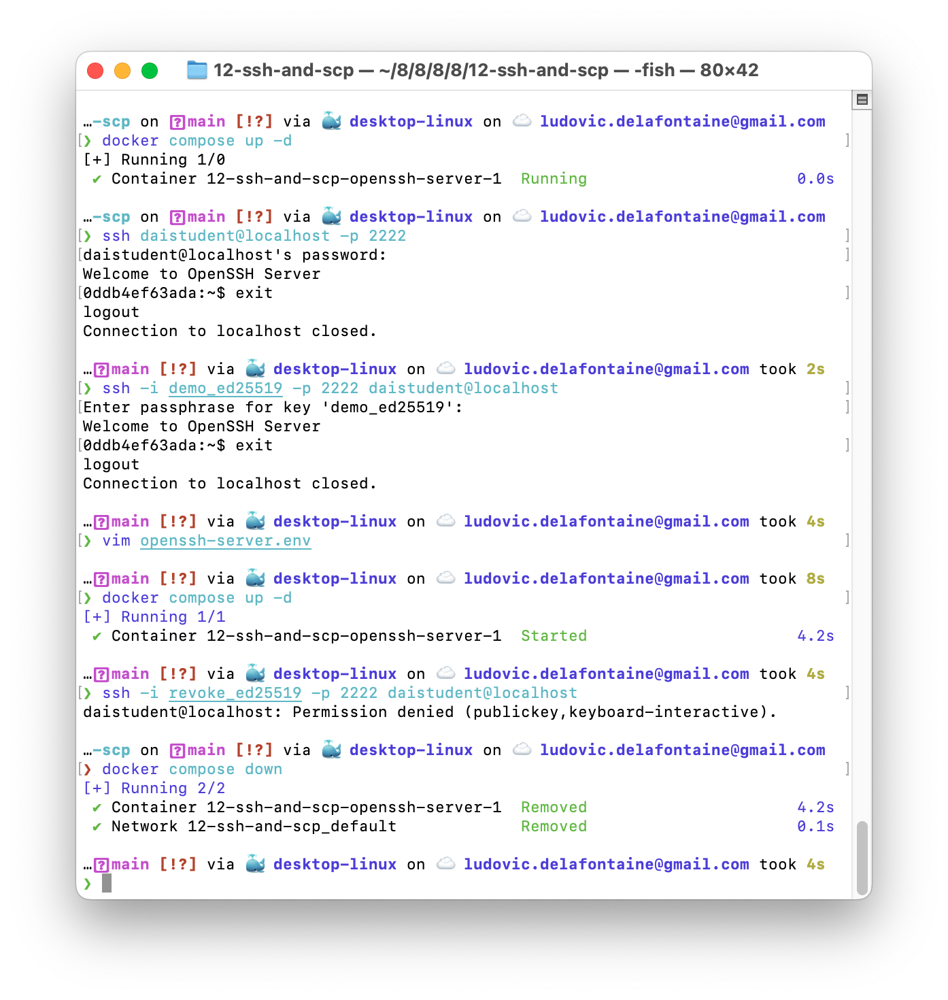

<!--
theme: custom-marp-theme
size: 16:9
paginate: true
author: L. Delafontaine and H. Louis, with the help of GitHub Copilot
title: HEIG-VD DAI - SSH and SCP
description: SSH and SCP for the DAI course at HEIG-VD, Switzerland
header: '[**SSH and SCP**](https://github.com/heig-vd-dai-course/heig-vd-dai-course/tree/main/11.01-ssh-and-scp)'
footer: '[**HEIG-VD**](https://heig-vd.ch) - [DAI 2025-2026](https://github.com/heig-vd-dai-course/heig-vd-dai-course) - [CC BY-SA 4.0](https://github.com/heig-vd-dai-course/heig-vd-dai-course/blob/main/LICENSE.md)'
headingDivider: 6
-->

# SSH and SCP

<!--
_class: lead
_paginate: false
-->

[Link to the course][course]

<small>L. Delafontaine and H. Louis, with the help of
[GitHub Copilot](https://github.com/features/copilot).</small>

<small>This work is licensed under the [CC BY-SA 4.0][license] license.</small>

![bg opacity:0.1][illustration]

## Objectives

- Refresh on security
- Acquire a virtual machine (= a server) on the cloud
- Install and configure the virtual machine/server
- Learn how to use the SSH protocol to connect to a remote server
- Learn how to use the SCP protocol to transfer files to a remote server

## A quick reminder about security

<!-- _class: lead -->

More details for this section in the [course material][course]. You can find
other resources and alternatives as well.

### A quick reminder about security

- A secure protocol ensures the confidentiality of the data exchanged
- Most secure protocols rely on cryptography
- Cryptography is based on algorithms and keys

## SSH

<!-- _class: lead -->

More details for this section in the [course material][course]. You can find
other resources and alternatives as well.

### SSH

- Secure Shell
- Uses TCP port 22
- A protocol to connect to a remote server
- Can be used to execute commands on a remote server
- The standard way to connect to a remote server

### SSH key algorithms

The most common key algorithms are:

- RSA
- DSA
- ECDSA
- Ed25519

Ed25519 and ECDSA are the recommended algorithms.

### SSH key fingerprint

- Short version of a public key
- Used to verify the identity of a public key
- Can help detect man-in-the-middle attacks
- Stored in the `~/.ssh/known_hosts` file

### SSH key generation

- Use the `ssh-keygen` command
- Choose the key algorithm
- Generate a private key and a public key
- Can be done with or without a passphrase

## SCP

<!-- _class: lead -->

More details for this section in the [course material][course]. You can find
other resources and alternatives as well.

### SCP

- Secure Copy
- Uses TCP port 22
- A protocol to transfer files to/from a remote server
- Can be used to transfer files between two remote servers as well

## Questions

<!-- _class: lead -->

Do you have any questions?

## Practical content

<!-- _class: lead -->

### What will you do?

- Acquire a virtual machine (= a server) on the cloud
- Install and configure the virtual machine (SSH, Docker and Docker Compose)
- Transfer files to/from the virtual machine with SCP

### Now it's your turn!

- Read the course material.
- Do the practical content.
- Ask questions if you have any.

➡️ [Find the course on GitHub][course].

**Do not hesitate to help each other! There's no need to rush!**

![bg right w:75%][course-qr-code]

## Finished? Was it easy? Was it hard?

Can you let us know what was easy and what was difficult for you during this
chapter?

This will help us to improve the course and adapt the content to your needs. If
we notice some difficulties, we will come back to you to help you.

➡️ [GitHub Discussions][discussions]

You can use reactions to express your opinion on a comment!

## Sources

- Main illustration by [Mathew Schwartz](https://unsplash.com/@cadop) on
  [Unsplash](https://unsplash.com/photos/sb7RUrRMaC4)
- Illustration by [Aline de Nadai](https://unsplash.com/@alinedenadai) on
  [Unsplash](https://unsplash.com/photos/j6brni7fpvs)
- Illustration by [Kelly Sikkema](https://unsplash.com/@kellysikkema) on
  [Unsplash](https://unsplash.com/photos/white-and-black-checkered-board-huT1A8nW_Ho)
- Illustration by [Carl Nenzen Loven](https://unsplash.com/@archduk3) on
  [Unsplash](https://unsplash.com/photos/N8GdKC4Rcvs)

[course]:
	https://github.com/heig-vd-dai-course/heig-vd-dai-course/tree/main/11.01-ssh-and-scp
[license]:
	https://github.com/heig-vd-dai-course/heig-vd-dai-course/blob/main/LICENSE.md
[discussions]: https://github.com/orgs/heig-vd-dai-course/discussions/115
[illustration]: ./images/main-illustration.jpg
[course-qr-code]:
	https://quickchart.io/qr?format=png&ecLevel=Q&size=400&margin=1&text=https://github.com/heig-vd-dai-course/heig-vd-dai-course/tree/main/11.01-ssh-and-scp
