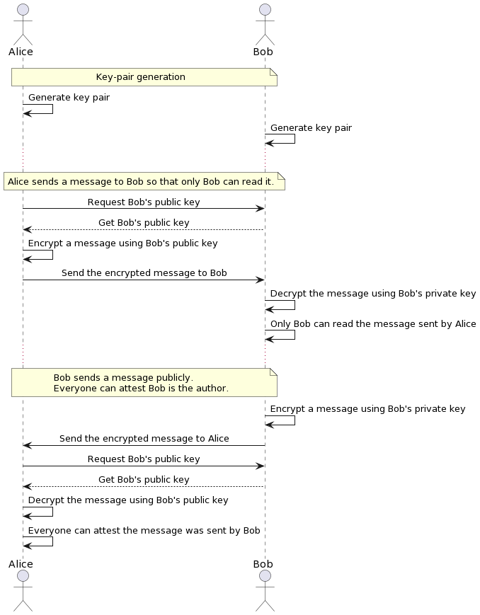
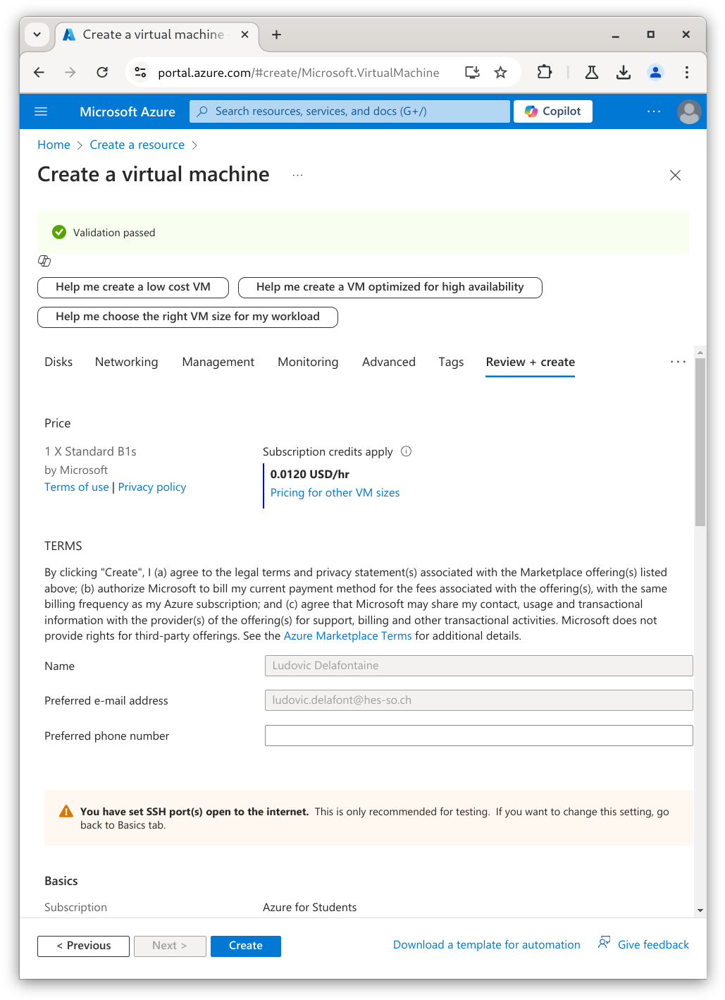
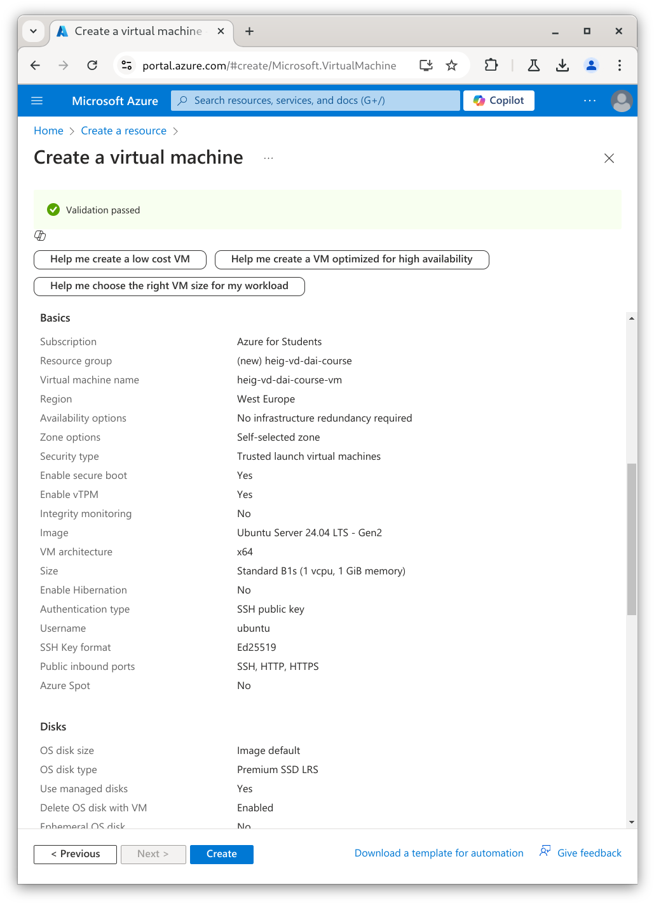
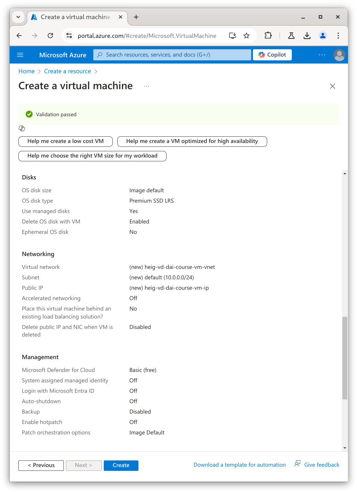
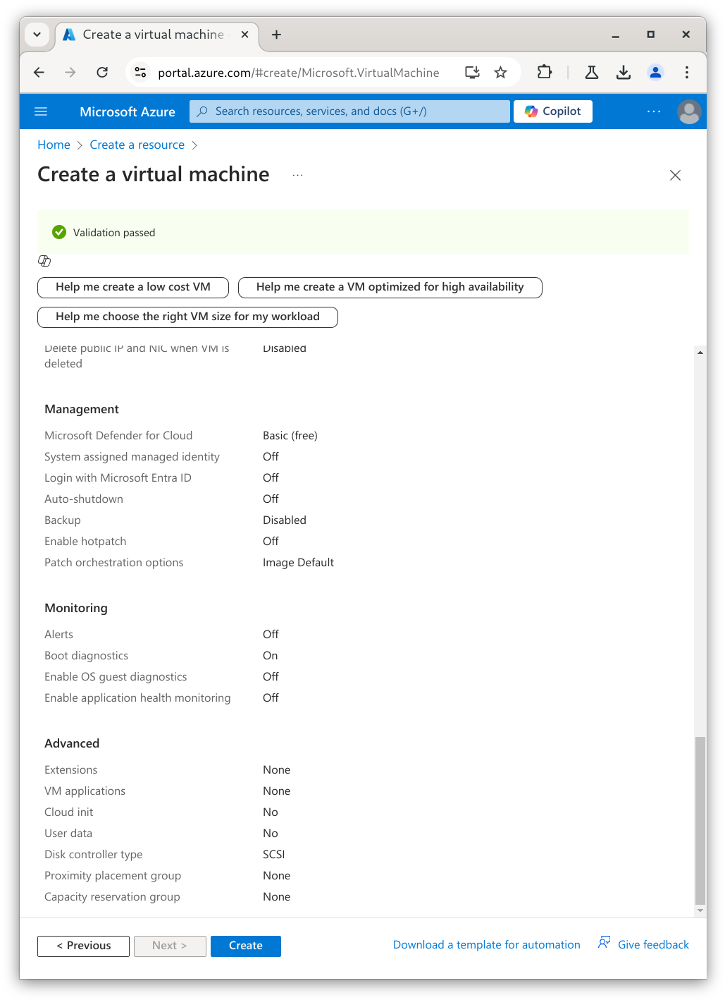
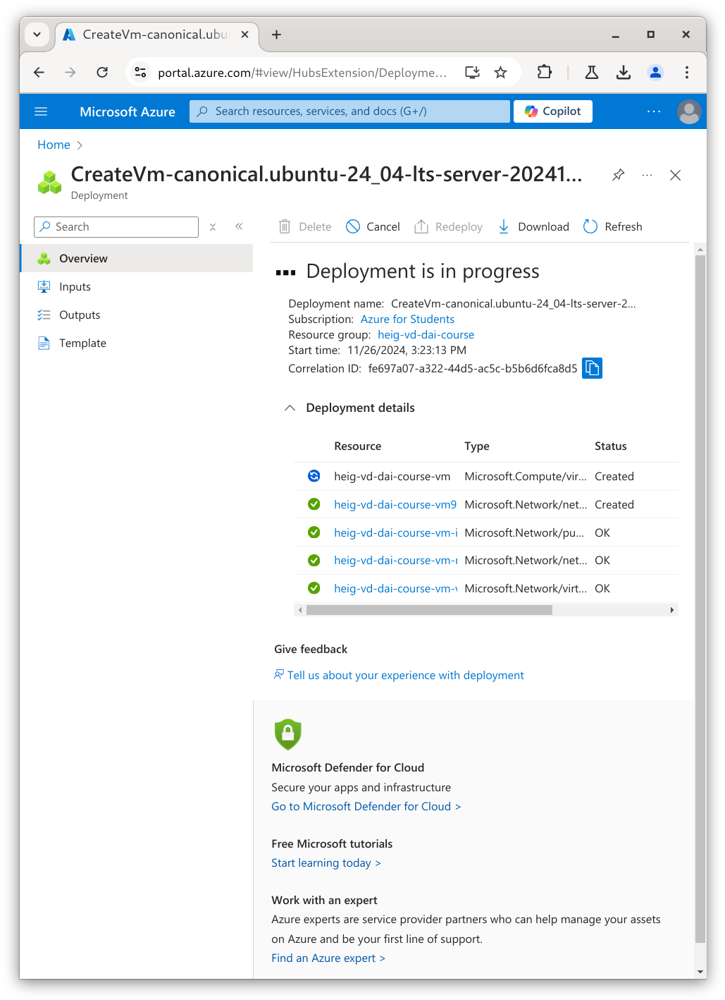

[markdown]:
	https://github.com/heig-vd-dai-course/heig-vd-dai-course/blob/main/20-ssh-and-scp/COURSE_MATERIAL.md
[pdf]:
	https://heig-vd-dai-course.github.io/heig-vd-dai-course/20-ssh-and-scp/20-ssh-and-scp-course-material.pdf
[license]:
	https://github.com/heig-vd-dai-course/heig-vd-dai-course/blob/main/LICENSE.md
[discussions]: https://github.com/orgs/heig-vd-dai-course/discussions/115
[illustration]: ./images/main-illustration.jpg

# SSH and SCP - Course material

<https://github.com/heig-vd-dai-course>

[Markdown][markdown] · [PDF][pdf]

L. Delafontaine and H. Louis, with the help of
[GitHub Copilot](https://github.com/features/copilot).

This work is licensed under the [CC BY-SA 4.0][license] license.

![Main illustration][illustration]

## Table of contents

- [Table of contents](#table-of-contents)
- [Objectives](#objectives)
- [A quick reminder about security](#a-quick-reminder-about-security)
- [SSH](#ssh)
  - [SSH key algorithms](#ssh-key-algorithms)
  - [SSH key fingerprint](#ssh-key-fingerprint)
  - [SSH key generation](#ssh-key-generation)
  - [Alternatives](#alternatives)
  - [Resources](#resources)
- [SCP](#scp)
  - [Alternatives](#alternatives-1)
  - [Resources](#resources-1)
- [Practical content](#practical-content)
  - [Install and configure SSH (and SCP)](#install-and-configure-ssh-and-scp)
  - [Acquire a virtual machine on a cloud provider](#acquire-a-virtual-machine-on-a-cloud-provider)
  - [Access and configure the virtual machine](#access-and-configure-the-virtual-machine)
  - [Copy files with SCP](#copy-files-with-scp)
  - [Add the teaching staff's public key to the virtual machine](#add-the-teaching-staffs-public-key-to-the-virtual-machine)
  - [Optional but recommended: shutdown the virtual machine](#optional-but-recommended-shutdown-the-virtual-machine)
  - [Go further](#go-further)
- [Conclusion](#conclusion)
  - [What did you do and learn?](#what-did-you-do-and-learn)
  - [Test your knowledge](#test-your-knowledge)
- [Finished? Was it easy? Was it hard?](#finished-was-it-easy-was-it-hard)
- [Additional resources](#additional-resources)
- [Sources](#sources)

## Objectives

In this chapter, you will have a refresh about security and learn how to use the
Secure Shell (SSH) protocol to connect to a remote machine. You will also learn
how to transfer files from/to a remote machine with Secure Copy (SCP).

For this, you will acquire a virtual machine on a cloud provider and configure
it. You will then connect to the virtual machine with SSH and copy files from/to
the virtual machine with SCP.

## A quick reminder about security

A secure protocol means that the data sent between the client and the server is
encrypted, ensuring the confidentiality and the integrity of the data.

Most secure protocols rely on cryptography to encrypt the data. The data is
encrypted with an encryption key.

It is not possible to read the data without the encryption key.

Most secure protocols rely on a key pair to authenticate the client (SSH, GPG
etc.). The key pair is composed of a public key and a private key.

The public key can be shared with anyone. The private key must be kept secret.

If Alice wants to send a message to Bob, Alice encrypts the message with Bob's
public key. Bob decrypts the message with his private key.

If Bob wants to send a message to Alice, Bob encrypts the message with Alice's
public key. Alice decrypts the message with their private key.

If Bob wants to send a message to the rest of the world proving that only Bob
was the author of the message, Bob encrypts the message with their private key.
Bob can then send the message to whom suites best. The receipts can then decrypt
the message with Bob's public key. If the message can be decrypted, it means
that Bob is the author of the message.

In the case of SSH and GPG, the public key is used to encrypt the data and the
private key is used to decrypt the data.

This principle is used to authenticate the client: the client sends the public
key to the server. The server uses the public key to encrypt a message and sends
it to the client. The client uses the private key to decrypt the message.

If the client is able to decrypt the message, it means that the client has the
private key. The client is authenticated.

The private key is a file that must be kept secret. If someone has access to the
private key, this person can impersonate the client.

The following diagram illustrates the communication between the client and the
server:



## SSH

SSH is a protocol that allows you to connect to a remote machine. It is a
replacement for the Telnet protocol.

The SSH protocol is described in many RFCs:

- [RFC 4250](https://datatracker.ietf.org/doc/html/rfc4250)
- [RFC 4251](https://datatracker.ietf.org/doc/html/rfc4251)
- [RFC 4252](https://datatracker.ietf.org/doc/html/rfc4252)
- [RFC 4253](https://datatracker.ietf.org/doc/html/rfc4253).
- [RFC 4254](https://datatracker.ietf.org/doc/html/rfc4254)

The SSH protocol uses the TCP protocol on port 22. It uses public/private keys
to authenticate the client. It is also possible to use a password to
authenticate the client but it is not recommended because it is less secure.

The SSH protocol is used to connect to a remote machine. It is also used to copy
files from/to a remote machine with SCP.

SSH is also the name of the software that implements the SSH protocol. It is
available on most operating systems and is considered as a standard.


### SSH key algorithms

SSH supports different key algorithms. The most common are:

- RSA
- DSA
- ECDSA
- Ed25519

Out of the four algorithms, Ed25519 and ECDSA are the most recent and are
considered as more secure than RSA and DSA.

### SSH key fingerprint

The SSH key fingerprint is a hash of the public key. It is used to identify the
public key.

The fingerprint is displayed when the key is generated. It is also displayed
when the key is used to connect to a remote machine.

The fingerprint is used to verify that the public key is the same as the one
used to connect to the remote machine.

This can help detect man-in-the-middle attacks.

Public keys are stored in the `~/.ssh/known_hosts` file. The file contains the
fingerprint of the public key and the hostname of the remote machine.

### SSH key generation

The SSH key generation is done with the `ssh-keygen` command.

The `ssh-keygen` command generates a key pair composed of a public key and a
private key.

By default, the key pair is generated in the `~/.ssh` directory. The private key
is stored in the `~/.ssh/<key>` file and the public key is stored in the
`~/.ssh/<key>.pub` file.

The private key must be kept secret. The public key can be shared with anyone.

A passphrase can be used to protect the private key. The passphrase is used to
encrypt the private key. The passphrase must be entered every time the private
key is used.

### Alternatives

_Alternatives are here for general knowledge. No need to learn them._

- _None for now_

_Missing item in the list? Feel free to open a pull request to add it! ✨_

### Resources

_Resources are here to help you. They are not mandatory to read._

- [Introduction to SSH](https://www.baeldung.com/cs/ssh-intro)

_Missing item in the list? Feel free to open a pull request to add it! ✨_

## SCP

SCP is a protocol that allows you to copy files from/to a remote machine. It is
a replacement for the FTP protocol.

The SCP protocol relies on the SSH protocol to authenticate the client.

SCP is an illustration of the client/server architecture using the SSH protocol.

### Alternatives

_Alternatives are here for general knowledge. No need to learn them._

- [SFTP](https://en.wikipedia.org/wiki/SSH_File_Transfer_Protocol)
- [rsync](https://rsync.samba.org)

_Missing item in the list? Feel free to open a pull request to add it! ✨_

### Resources

_Resources are here to help you. They are not mandatory to read._

- _None for now_

_Missing item in the list? Feel free to open a pull request to add it! ✨_

## Practical content

### Install and configure SSH (and SCP)

In this section, you will install and configure SSH on your operating system.
This will automatically install SCP as well.

#### Install the SSH client

The SSH client is available on most operating systems.

You certainly already have it installed on your operating system as you used it
in the
[Git, GitHub and Markdown](https://github.com/heig-vd-dai-course/heig-vd-dai-course/tree/main/03-git-github-and-markdown)
chapter.

If not, follow the instructions below to install it:

```sh
# Install the SSH client
sudo apt install openssh-client
```

#### Check the installation

Open a terminal and type `ssh -V`.

The output should be similar to this:

```text
OpenSSH_9.6p1 Ubuntu-3ubuntu13.5, OpenSSL 3.0.13 30 Jan 2024
```

### Acquire a virtual machine on a cloud provider

In this section, you will acquire a virtual machine on a cloud provider.

Many other cloud providers exist and offer free tiers (= free resources for a
limited time). You can check the following Git repository for a list of cloud
providers offering free tiers:
<https://github.com/cloudcommunity/Cloud-Free-Tier-Comparison> if you want to
explore more on this topic.

In this course, we will use a virtual machine from
[Microsoft Azure](https://azure.microsoft.com).

Using your HES-SO email address, you can apply for the
[Azure for Students](https://azure.microsoft.com/en-us/free/students/) offer to
get free credits without the need for a credit card.

#### Access Microsoft Azure

Access the Azure portal with the following link: <https://portal.azure.com>.

Use your HES-SO email address to log in (`<first name>.<last name>@hes-so.ch`
where `<first name>` and `<last name>` are 8 characters max) and the password
you usually use to log in to the HES-SO services (GAPS, Cyberlearn, etc.).

#### Apply for the Azure for Students offer

Once you are logged in, you can apply for the Azure for Students offer with the
following link: <https://azure.microsoft.com/en-us/free/students/>.

If needed, log in with your HES-SO email address again.

Fill the form with your information and set up your account.

You should now have access to the Azure portal with free credits.

#### Create a virtual machine

Return to the Azure portal and create a new virtual machine from the dashboard
in section `Create a resource`.

Select a virtual machine with the following characteristics:

- **Project details**
  - **Subscription**: Azure for Students
  - **Resource group**: Create new with the name `heig-vd-dai-course`
- **Instance details**
  - **Virtual machine name**: `heig-vd-dai-course-vm`
  - **Region**: (Europe) West Europe
  - **Availability options**: No infrastructure redundancy required
  - **Security type**: Trusted launch virtual machines (the default)
  - **Image**: Ubuntu Server 24.04 LTS - x64 Gen2 (the default)
  - **VM architecture**: x64
  - **Size**: `Standard_B1s` - you might need to click _"See all sizes"_ to see
    this option
- **Administrator account**
  - **Authentication type**: SSH public key
  - **Username**: `ubuntu` - please use this username so the teaching staff can
    help you if needed
  - **SSH public key source**: Use existing public key
  - **SSH public key**: Paste your public key here - see the note below for more
    information
- **Inbound port rules**
  - **Public inbound ports**: Allow selected ports
  - **Select inbound ports**: HTTP (80), HTTPS (443), SSH (22)

> [!NOTE]
>
> You can use the same public key you used to sign your commits if Git as seen
> in the
> [Git, GitHub and Markdown](https://github.com/heig-vd-dai-course/heig-vd-dai-course/tree/main/03-git-github-and-markdown)
> chapter or you can generate a new one with the `ssh-keygen` command for the
> purpose of this chapter.

Although the `Standard_B1s` size is one of the
[cheapest](https://azure.microsoft.com/en-us/pricing/details/virtual-machines/linux/)
and least powerful option, it will be enough for this course. It will allow you
to use your remaining credits for other services.

Click on the `Review + create` button.

Validate the configuration and click on the `Create` button.









It might take a few minutes to create the virtual machine. Once the virtual
machine is created, you can access it with the `Go to resource` button.

Note the public IP address of the virtual machine. You will need it to connect
to the virtual machine with SSH later.




### Access and configure the virtual machine

In this section, you will access the virtual machine with SSH and configure it.

#### Access the virtual machine with SSH

Using the public IP address of the virtual machine, you can connect to the
virtual machine with SSH with the following command:

```sh
# Connect to the virtual machine with SSH
ssh ubuntu@<vm public ip>
```

The first time you connect to the virtual machine, you will be asked to confirm
the fingerprint of the public key of the virtual machine.

The output should be similar to the following:

```text
The authenticity of host '20.73.17.105 (20.73.17.105)' can't be established.
ED25519 key fingerprint is SHA256:Xl0X5kv+aeZV28XA9iJ/L+geFVVvOvG4foRixbGRYnY.
This key is not known by any other names.
Are you sure you want to continue connecting (yes/no/[fingerprint])?
```

This is a security feature to avoid man-in-the-middle attacks.

As it is very unlikely that someone is trying to impersonate the virtual machine
at this exact moment, you can type `yes` and press the `Enter` key.

If someone tries to impersonate the virtual machine in the future (= a future
SSH login), you will not be able to connect to the virtual machine and you will
see an error message warning you that the fingerprint has changed.

> [!TIP]
>
> To validate the fingerprint, you have to compare it with the one stored on the
> server. The keys are stored in the `/etc/ssh` directory. You can use the
> following command to display the fingerprints of the keys:
>
> ```sh
> # Display the fingerprints of the keys
> find /etc/ssh -name '*.pub' -exec ssh-keygen -l -f {} \;
> ```
>
> But how to validate the fingerprint if you have never connected to the server
> before? You can install and use the
> [Azure CLI](https://learn.microsoft.com/cli/azure/) (there is even a Docker
> image for you to use!) to access the virtual machine and execute remote
> commands with the help of the
> [`az vm run-command invoke`](https://learn.microsoft.com/en-us/cli/azure/vm/run-command?view=azure-cli-latest#az-vm-run-command-invoke)
> command.
>
> To display the fingerprint of the virtual machine, you can use the following
> command:
>
> ```sh
> # Display the fingerprint of the virtual machine
> az vm run-command invoke \
>   --resource-group <resource group> \
>   --name <virtual machine name> \
>   --command-id RunShellScript \
>   --scripts "find /etc/ssh -name '*.pub' -exec ssh-keygen -l -f {} \;"
> ```
>
> Replace `<resource group>` with the name of the resource group and
> `<virtual machine name>` with the name of the virtual machine.
>
> The output should be similar to the following:
>
> ```json
> {
> 	"value": [
> 		{
> 			"code": "ProvisioningState/succeeded",
> 			"displayStatus": "Provisioning succeeded",
> 			"level": "Info",
> 			"message": "Enable succeeded: \n[stdout]\n256 SHA256:mpdGi2XQsOV6FXJ33Uqvow9/ZP6VLwSuDghJJehzRCg root@heig-vd-dai-course-vm (ECDSA)\n3072 SHA256:BezFAeGxQWe13HR5b/KccM73p1pwivSwjFJIimIAk0o root@heig-vd-dai-course-vm (RSA)\n256 SHA256:Xl0X5kv+aeZV28XA9iJ/L+geFVVvOvG4foRixbGRYnY root@heig-vd-dai-course-vm (ED25519)\n\n[stderr]\n",
> 			"time": null
> 		}
> 	]
> }
> ```
>
> You can now compare the fingerprints of the public keys displayed in the
> `message` field with the one displayed when you connect to the virtual for the
> first time.
>
> These instructions are highly inspired by the following resource, a course
> made for the COMEM+ students:
> <https://github.com/MediaComem/comem-archidep/blob/main/ex/azure-setup.md#question-optionally-get-your-machines-public-ssh-key>.

#### Update and secure the virtual machine

Once connected to the virtual machine, you can update the packages with the
following command:

```sh
# Update the available packages
sudo apt update

# Upgrade the packages
sudo apt upgrade
```

You can then reboot the virtual machine with the following command to apply all
the updates:

```sh
# Reboot the virtual machine
sudo reboot
```

Securing a Linux server is a vast topic. You can check the following resource
for more information:
<https://github.com/imthenachoman/How-To-Secure-A-Linux-Server>.

As of this course, you have followed the following steps to secure the virtual
machine:

- [x] You have set up the SSH server with a key pair. This has automatically
      disabled the password authentication on the SSH server.
- [x] You have only allowed the SSH port (22) and the HTTP (80) and HTTPS (443)
      ports on the virtual machine. This is a good practice to avoid unnecessary
      ports being open to the internet.
- [x] You have updated the packages on the virtual machine. This is a good
      practice to avoid security vulnerabilities.

#### Install and configure Docker and Docker Compose

Install and configure Docker and Docker Compose on the virtual machine as seen
in the
[Docker and Docker Compose](https://github.com/heig-vd-dai-course/heig-vd-dai-course/tree/main/06-docker-and-docker-compose)
chapter. You will need Docker and Docker Compose for the rest of the course.

Congratulations! You have now an up-to-date and configured virtual machine to
use for the rest of the course.

### Copy files with SCP

In this section, you will learn how to copy files from/to a remote machine with
SCP.

Copying files with SCP is similar to copying files with the `cp` command.

#### Create a file on the local machine

On the local machine, create a new file called `local.txt`:

```sh
# Create a file on the local machine
echo "This file is on the local machine" > local.txt
```

You should now have a `local.txt` file in the current directory.

#### Create a file on the remote machine

On the remote machine, create a new file called `remote.txt`:

```sh
# Create a file on the remote machine
echo "This file is on the remote machine" > remote.txt
```

You should now have a `remote.txt` file in the home directory of the user on the
remote machine.

#### Copy the file from the local machine to the remote machine

In a terminal, run the following command, replacing `<username>` and
`<vm public ip>` with the username and the public IP address of your virtual
machine:

```sh
# Copy the file from the local machine to the remote machine
scp local.txt <username>@<vm public ip>:~/local.txt
```

> [!IMPORTANT]
>
> SCP must be run from the local machine.

The syntax is similar to the `cp` command:

```text
[username@source-ip:]source [username@destination-ip:]destination
```

The first `local.txt` is the file to copy from the local machine. The second
`~/local.txt` is the file to copy to the remote machine. In this case, the file
is copied to the home directory of the user on the remote machine.

The output should be similar to the following:

```text
local.txt           100%   34    30.2KB/s   00:00
```

Congratulations! The transfer was successful.

If you log on the remote machine, you should see the `local.txt` file in the
home directory of the user with its content:

```sh
# Display the content of the local.txt file
cat local.txt
```

#### Copy a file from the remote machine to the local machine

To copy a file from the remote machine to the local machine, you can use the
same command as before but with the source and destination inverted:

```sh
# Copy the file from the remote machine to the local machine
scp <username>@<vm public ip>:~/remote.txt remote.txt
```

> [!IMPORTANT]
>
> SCP must be run from the local machine.

The output should be similar to the following:

```text
remote.txt          100%   34    25.8KB/s   00:00
```

Congratulations! The transfer was successful.

You should see the `remote.txt` file in the current directory with its content:

```sh
# Display the content of the remote.txt file
cat remote.txt
```

### Add the teaching staff's public key to the virtual machine

In this section, you will add the teaching staff's public key to the virtual
machine. This will allow the teaching staff to connect to the virtual machine
with SSH and help you if needed.

The teaching staff's public key is the following:

```text
ssh-ed25519 AAAAC3NzaC1lZDI1NTE5AAAAIF5deyMbQaRaiO4ojymkCoWBtwPyG8Y+4BbLQsb413KC heig-vd-dai-course
```

You can add the public key to the `~/.ssh/authorized_keys` file of the user on
the virtual machine using the following command:

```sh
# Export the public key to the authorized_keys file
export TEACHING_STAFF_SSH_PUBLIC_KEY="ssh-ed25519 AAAAC3NzaC1lZDI1NTE5AAAAIF5deyMbQaRaiO4ojymkCoWBtwPyG8Y+4BbLQsb413KC heig-vd-dai-course"

# Add the teaching staff's public key to the authorized_keys file
echo "${TEACHING_STAFF_SSH_PUBLIC_KEY}" | ssh ubuntu@<vm public ip> "cat >> ~/.ssh/authorized_keys"
```

> [!IMPORTANT]
>
> This command must be run from the local machine.

SSH can be used to execute a command on a remote machine. In this case, the
`cat` command is executed on the remote machine to append the public key to the
`~/.ssh/authorized_keys` file.

As mentioned before, the public key can be shared with anyone. The private key
must be kept secret.

By executing the command above, you are allowing the teaching staff to connect
to the virtual machine with the private key associated with the public key.

> [!TIP]
>
> You can also add the public key to the `~/.ssh/authorized_keys` file
> automatically with the help of the
> [`ssh-copy-id`](https://man7.org/linux/man-pages/man1/ssh-copy-id.1.html)
> command. You must however have the private key associated with the public key
> to use this command. This is why you had to do it manually in this case.

You can check the `~/.ssh/authorized_keys` file to verify that the public key
has been added to the file.

If you ever need to revoke the public key, you can remove it from the
`~/.ssh/authorized_keys` file with the help of an editor such as Vi/Vim or Nano.

Revoking a public key is as easy as removing it from the `authorized_keys` file.

### Optional but recommended: shutdown the virtual machine

If you want to stop the virtual machine to avoid consuming your free credits,
you can stop the virtual machine with the following command:

```sh
# Stop the virtual machine
sudo poweroff
```

You can start the virtual machine again from the Azure portal.

Please be aware that stopping the virtual machine will stop all the services
running on it. No one will be able to connect to the virtual machine while it is
stopped.

However, after submitting your work for the
[practical work 3](https://github.com/heig-vd-dai-course/heig-vd-dai-course/tree/main/24-practical-work-3),
please keep the virtal machine running so the teaching staff can access it to
grade your work.

### Go further

This is an optional section. Feel free to skip it if you do not have time.

- Are you able to secure the virtual machine further using the resources
  provided in the
  [_Update and secure the virtual machine_](#update-and-secure-the-virtual-machine)
  section? Be careful not to lock yourself out of the virtual machine!

## Conclusion

### What did you do and learn?

In this chapter, you have had a refresh about security and learned how to use
SSH to connect to a remote machine. You have also learned how to copy files
from/to a remote machine with SCP.

SSH and SCP are very useful tools to connect to a remote machine and copy files
from/to a remote machine. They are widely used in the industry and you will use
it for the practical work in the next chapters.

### Test your knowledge

At this point, you should be able to answer the following questions:

- What is SSH ?
- How does SSH work?
- How to copy files from/to a remote machine with SCP?
- Why is it not recommended to use a password to connect to a remote machine?
- What is the difference between the private key and the public key?

## Finished? Was it easy? Was it hard?

Can you let us know what was easy and what was difficult for you during this
chapter?

This will help us to improve the course and adapt the content to your needs. If
we notice some difficulties, we will come back to you to help you.

> [!NOTE]
>
> Vous pouvez évidemment poser toutes vos questions et/ou vos propositions
> d'améliorations en français ou en anglais.
>
> N'hésitez pas à nous dire si vous avez des difficultés à comprendre un concept
> ou si vous avez des difficultés à réaliser les éléments demandés dans le
> cours. Nous sommes là pour vous aider !

➡️ [GitHub Discussions][discussions]

You can use reactions to express your opinion on a comment!

## Additional resources

_Resources are here to help you. They are not mandatory to read._

- _None yet_

_Missing item in the list? Feel free to open a pull request to add it! ✨_

## Sources

- Main illustration by [Mathew Schwartz](https://unsplash.com/@cadop) on
  [Unsplash](https://unsplash.com/photos/sb7RUrRMaC4)
