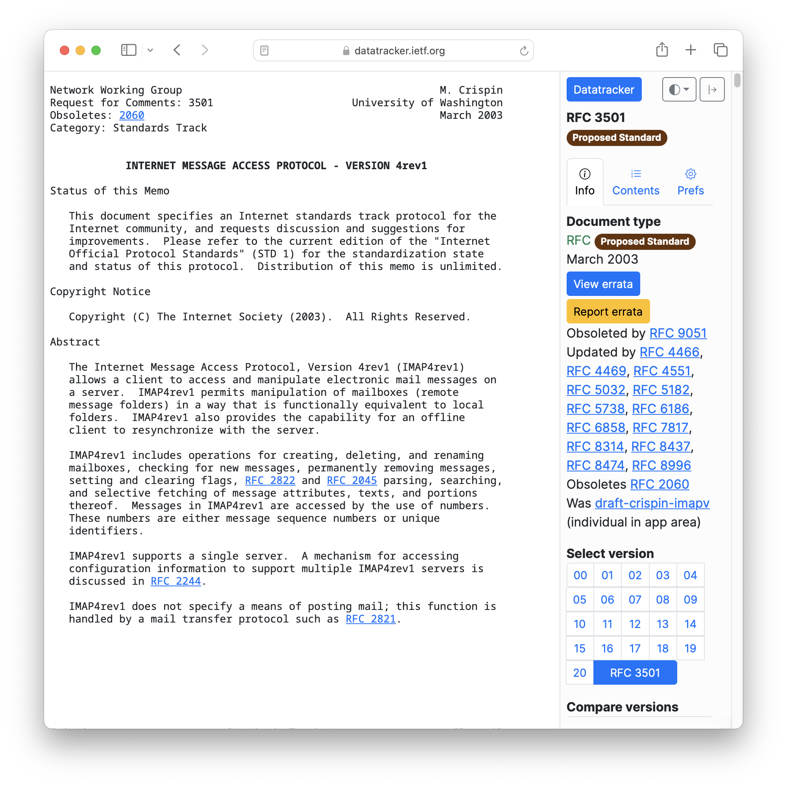

<!--
theme: gaia
size: 16:9
paginate: true
author: L. Delafontaine and H. Louis, with the help of GitHub Copilot
title: HEIG-VD DAI Course - SMTP and Telnet
description: SMTP and Telnet for the DAI course at HEIG-VD, Switzerland
url: https://heig-vd-dai-course.github.io/heig-vd-dai-course/12-smtp-and-ncat/
footer: '**HEIG-VD** - DAI Course 2023-2024 - CC BY-SA 4.0'
style: |
    :root {
        --color-background: #fff;
        --color-foreground: #333;
        --color-highlight: #f96;
        --color-dimmed: #888;
        --color-headings: #7d8ca3;
    }
    blockquote {
        font-style: italic;
    }
    table {
        width: 100%;
    }
    th:first-child {
        width: 15%;
    }
    h1, h2, h3, h4, h5, h6 {
        color: var(--color-headings);
    }
    h2, h3, h4, h5, h6 {
        font-size: 1.5rem;
    }
    h1 a:link, h2 a:link, h3 a:link, h4 a:link, h5 a:link, h6 a:link {
        text-decoration: none;
    }
    section:not([class=lead]) > p, blockquote {
        text-align: justify;
    }
headingDivider: 4
-->

[web]: https://heig-vd-dai-course.github.io/heig-vd-dai-course/12-smtp-and-ncat/
[pdf]:
  https://heig-vd-dai-course.github.io/heig-vd-dai-course/12-smtp-and-ncat/12-smtp-and-ncat-presentation.pdf
[license]:
  https://github.com/heig-vd-dai-course/heig-vd-dai-course/blob/main/LICENSE.md
[discussions]: https://github.com/orgs/heig-vd-dai-course/discussions/114
[illustration]:
  https://images.unsplash.com/photo-1526554850534-7c78330d5f90?fit=crop&h=720
[course-material]:
  https://github.com/heig-vd-dai-course/heig-vd-dai-course/blob/main/12-smtp-and-ncat/COURSE_MATERIAL.md
[course-material-qr-code]:
  https://quickchart.io/qr?format=png&ecLevel=Q&size=400&margin=1&text=https://github.com/heig-vd-dai-course/heig-vd-dai-course/blob/main/12-smtp-and-ncat/COURSE_MATERIAL.md

# SMTP and Telnet

<!--
_class: lead
_paginate: false
-->

<https://github.com/heig-vd-dai-course>

[Web][web] · [PDF][pdf]

<small>L. Delafontaine and H. Louis, with the help of GitHub Copilot.</small>

<small>Based on the original course by O. Liechti and J. Ehrensberger.</small>

<small>This work is licensed under the [CC BY-SA 4.0][license] license.</small>

![bg opacity:0.1][illustration]

## Objectives

- Refresh on networking
- Learn electronic messaging protocols
- Focus on the SMTP protocol
- Learn how to use Telnet to send an email to an SMTP server

## A quick reminder about networking

<!-- _class: lead -->

More details for this section in the
[course material](https://github.com/heig-vd-dai-course/heig-vd-dai-course/blob/main/12-smtp-and-ncat/COURSE_MATERIAL.md#a-quick-reminder-about-networking).
You can find other resources and alternatives as well.

### The Internet Protocol (IP)

- Each computer has a unique IP address
- IPv4 addresses are limited; NAT routers share IP addresses
- IPv6 fixes this issue
- IP addresses are used to route packets

### The Domain Name System (DNS)

- DNS maps domain names to IP addresses
- Example: `heig-vd.ch` → `193.134.223.20`
- dig and nslookup are useful tools to query DNS servers

### Common DNS records

Records map a domain name to an IP address.

- `NS`: Name Server
- `CNAME`: Alias
- `A`: IPv4 address
- `AAAA`: IPv6 address

## Electronic messaging protocols: SMTP, POP3 and IMAP

<!-- _class: lead -->

More details for this section in the
[course material](https://github.com/heig-vd-dai-course/heig-vd-dai-course/blob/main/12-smtp-and-ncat/COURSE_MATERIAL.md#electronic-messaging-protocols-smtp-pop3-and-imap).
You can find other resources and alternatives as well.

### Electronic messaging protocols: SMTP, POP3 and IMAP

- Email clients are called Mail User Agents (MUA)
- Email servers are called Mail Transfer Agents (MTA)
- They use these protocols

### SMTP

- SMTP: Simple Mail Transfer Protocol
- Uses TCP port 25 (unencrypted) or 465 (encrypted)
- Used to send emails

### POP3

- POP3: Post Office Protocol
- Uses TCP port 110 (unencrypted) or 995 (encrypted)
- Used to retrieve emails from a server

### IMAP

- IMAP: Internet Message Access Protocol
- Uses TCP port 143 (unencrypted) or 993 (encrypted)
- Used to retrieve emails from a server
- Much more powerful than POP3 (synchronization, ...)

## DNS records related to email

<!-- _class: lead -->

More details for this section in the
[course material](https://github.com/heig-vd-dai-course/heig-vd-dai-course/blob/main/12-smtp-and-ncat/COURSE_MATERIAL.md#dns-records-related-to-email).
You can find other resources and alternatives as well.

### DNS records related to email

- `MX`: Mail eXchange - Specifies the mail server responsible for a domain name
- `TXT`: Store any text-based information. Used for `SPF` records, for email
  authentication

## Security concerns and blacklisting

<!-- _class: lead -->

More details for this section in the
[course material](https://github.com/heig-vd-dai-course/heig-vd-dai-course/blob/main/12-smtp-and-ncat/COURSE_MATERIAL.md#security-concerns-and-blacklisting).
You can find other resources and alternatives as well.

### Security concerns and blacklisting

- SMTP is old and insecure
- Easy to spoof and forge emails
- Hard to maintain
- ➡️ Your email server can be used for spam and can be blacklisted
- ➡️ We will use a mock server to simulate an email server

## A focus on the SMTP protocol

<!-- _class: lead -->

More details for this section in the
[course material](https://github.com/heig-vd-dai-course/heig-vd-dai-course/blob/main/12-smtp-and-ncat/COURSE_MATERIAL.md#a-focus-on-the-smtp-protocol).
You can find other resources and alternatives as well.

### A focus on the SMTP protocol

- SMTP is a text-based protocol
- Commands are sent by the client to the server
- The server responds with a status code
- The client can send the next command

---

- `HELO` /`EHLO`
- `MAIL FROM`
- `RCPT TO`
- `DATA`
  - `Subject:`
  - `From:`
  - `To:`
  - End by `.`
- `QUIT`

## Telnet

<!-- _class: lead -->

More details for this section in the
[course material](https://github.com/heig-vd-dai-course/heig-vd-dai-course/blob/main/12-smtp-and-ncat/COURSE_MATERIAL.md#telnet).
You can find other resources and alternatives as well.

### Telnet

- Telnet is a text-based protocol
- It is used to connect to a remote server
- Old and insecure protocol but still useful to test network applications
- We will use it to connect to an SMTP server

## Practical content

<!-- _class: lead -->

### What will you do?

- Install and configure Telnet
- Start a SMTP server with Docker Compose
- Send an email with Telnet to the SMTP server

### Find the practical content

<!-- _class: lead -->

You can find the practical content for this chapter on
[GitHub][course-material].

[![bg right w:75%][course-material-qr-code]][course-material]

## Finished? Was it easy? Was it hard?

Can you let us know what was easy and what was difficult for you during this
chapter?

This will help us to improve the course and adapt the content to your needs. If
we notice some difficulties, we will come back to you to help you.

➡️ [GitHub Discussions][discussions]

You can use reactions to express your opinion on a comment!

## What will you do next?

In the next chapter, you will learn the following topics:

- Experiment with the SSH protocol and SCP with Docker and Docker Compose
  - How to access remote servers?
  - Run a SSH server with Docker and copy files from/to a server with SCP

## Sources

- Main illustration by [Joanna Kosinska](https://unsplash.com/@joannakosinska)
  on [Unsplash](https://unsplash.com/photos/uGcDWKN91Fs)
- Illustration by [Aline de Nadai](https://unsplash.com/@alinedenadai) on
  [Unsplash](https://unsplash.com/photos/j6brni7fpvs)
- Illustration by [Nik](https://unsplash.com/@helloimnik) on
  [Unsplash](https://unsplash.com/photos/brown-eggs-on-white-textile-LUYD2b7MNrg)
- Illustration by [Mathew Schwartz](https://unsplash.com/@cadop) on
  [Unsplash](https://unsplash.com/photos/sb7RUrRMaC4)
