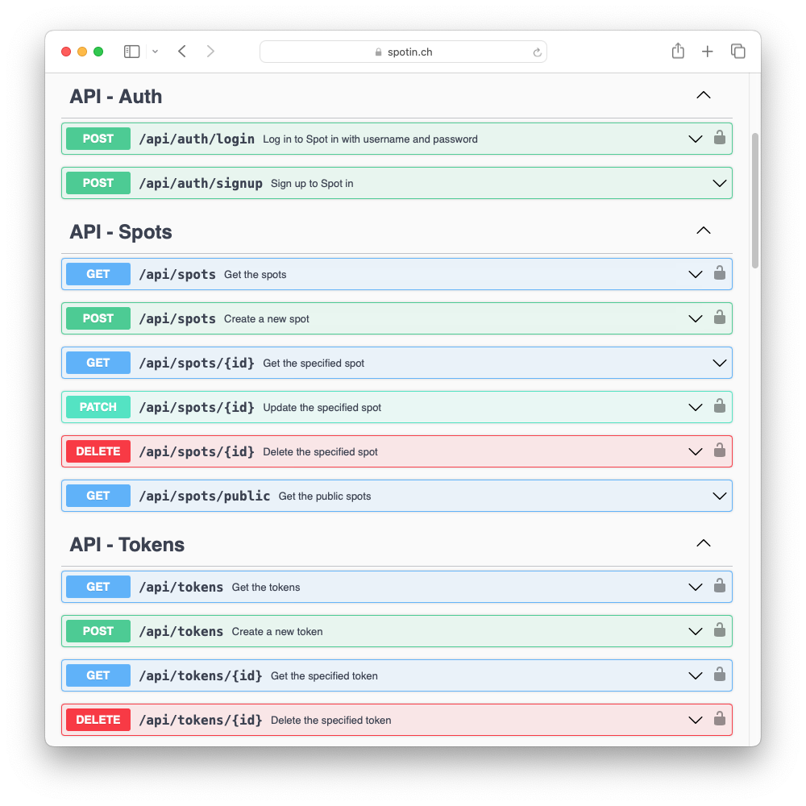
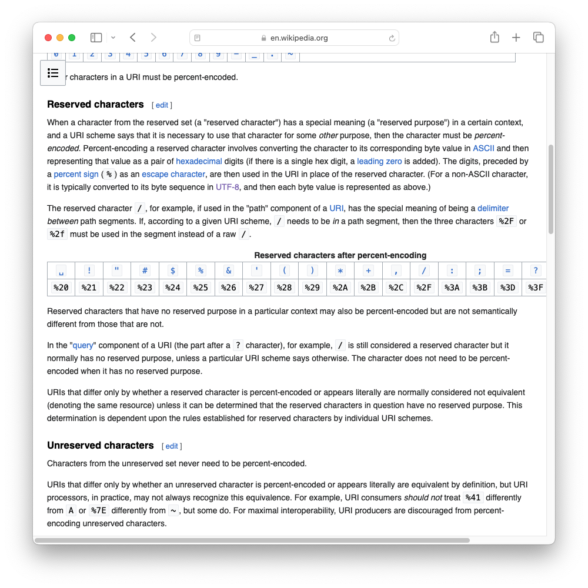
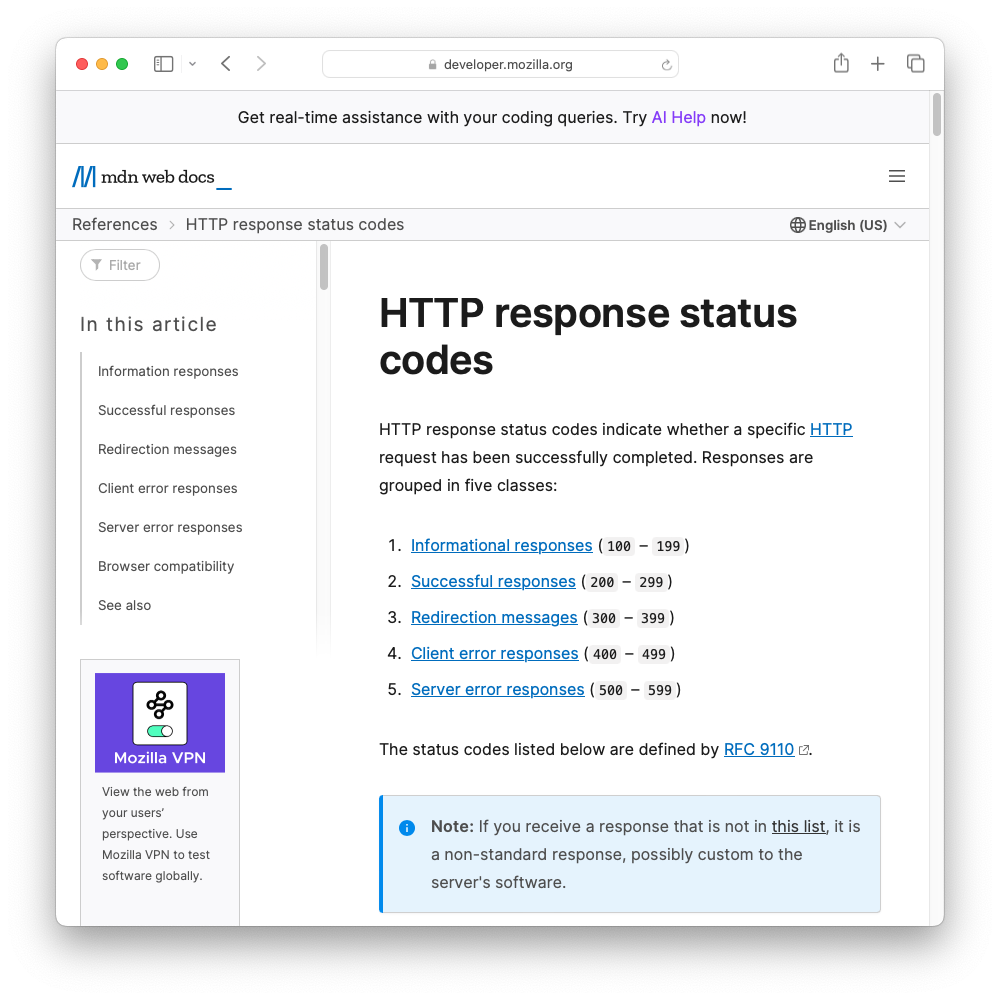
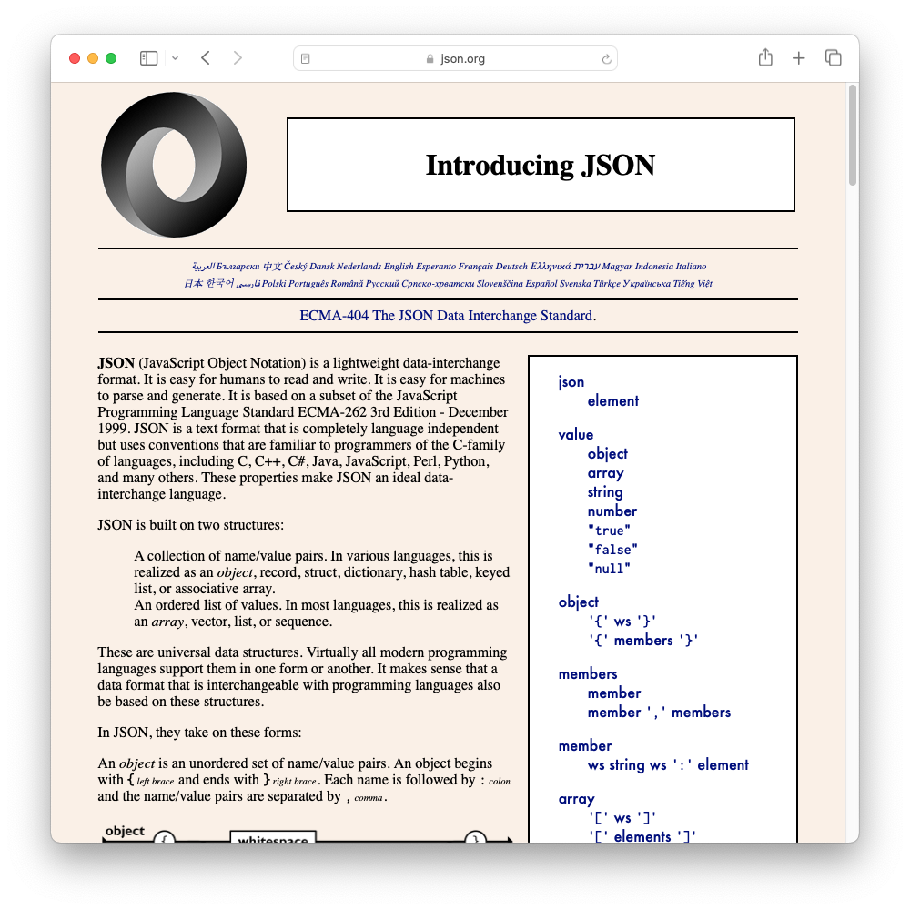
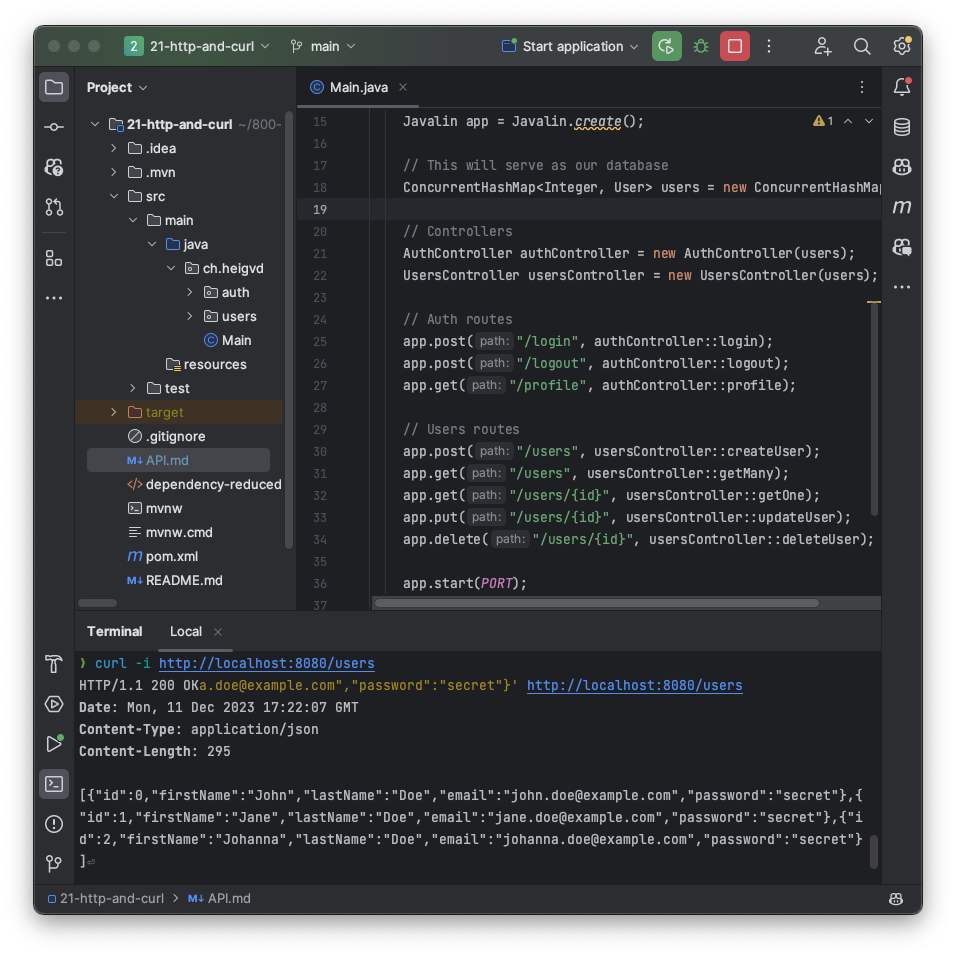

<!--
theme: custom-marp-theme
size: 16:9
paginate: true
author: L. Delafontaine and H. Louis, with the help of GitHub Copilot
title: HEIG-VD DAI - HTTP and curl
description: HTTP and curl for the DAI course at HEIG-VD, Switzerland
header: '[**HTTP and curl**](https://github.com/heig-vd-dai-course/heig-vd-dai-course/tree/main/12.01-http-and-curl)'
footer: '[**HEIG-VD**](https://heig-vd.ch) - [DAI 2025-2026](https://github.com/heig-vd-dai-course/heig-vd-dai-course) - [CC BY-SA 4.0](https://github.com/heig-vd-dai-course/heig-vd-dai-course/blob/main/LICENSE.md)'
headingDivider: 6
-->

# HTTP and curl

<!--
_class: lead
_paginate: false
-->

[Link to the course][course]

<small>L. Delafontaine and H. Louis, with the help of
[GitHub Copilot](https://github.com/features/copilot).</small>

<small>Based on the original course by O. Liechti and J. Ehrensberger.</small>

<small>This work is licensed under the [CC BY-SA 4.0][license] license.</small>

![bg opacity:0.1][illustration]

## Objectives

- Apply the basic concepts of HTTP.
- Apply the basic concepts of APIs.
- Use curl to test APIs.
- Design, document and develop a simple API.
- Interact with a simple CRUD API.


## Disclaimer

<!-- _class: lead -->

More details for this section in the [course material][course]. You can find
other resources and alternatives as well.

### Disclaimer

- **This is not a course on web development**.
- Many many things are not covered.
- Focus on HTTP version 1.1.
- [Javalin](https://javalin.io/) used for learning purposes.
- For production, use a framework like [Quarkus](https://quarkus.io/) or
  [Spring Boot](https://spring.io/projects/spring-boot).


## Prepare and setup your environment

<!-- _class: lead -->

More details for this section in the [course material][course]. You can find
other resources and alternatives as well.

### curl

- An open source command-line tool.
- Used to transfer data using various protocols:
  - HTTP/HTTPS.
  - FTP.
  - etc.
- Used to test APIs.


### Javalin

- A lightweight web framework for Java and Kotlin.
- Easy to learn and use: perfect for learning purposes.
- Production ready but not as powerful as Quarkus or Spring Boot.


## HTTP

<!-- _class: lead -->

More details for this section in the [course material][course]. You can find
other resources and alternatives as well.

### HTTP (1/2)

- HTTP stands for HyperText Transfer Protocol.
- Initiated by Tim Berners-Lee at CERN in 1989.
- First release in 1990 to transfer HyperText Markup Language (HTML) documents.
- Built on top of:
  - TCP (HTTP/1.0, HTTP/1.1 and HTTP/2.0)
  - UDP/QUIC (HTTP/3).
- Uses ports **80** (HTTP) or **443** (HTTPS).

### HTTP (2/2)

- An application protocol with many features.
- Used to transfer data between a client (an **user agent**) and a server.
- A client can be a web browser, a mobile application, a command-line tool,
  household appliance, etc.
- The client requests a **resource** from the server.


### HTTP versions

Multiple versions exist:

- HTTP/1.0 (1996).
- HTTP/1.1 (1997).
- HTTP/2 (2015).
- HTTP/3 (2022).

The most used version is HTTP/1.1. Each version is to improve performance.


### HTTP resources (1/2)

- A resource is identified by a Uniform Resource Locator (URL).
- A resource can be a file, a document, a video, etc.
- Sometimes called an **endpoint** or a **route**.



### HTTP resources (2/2)

An example of a URL is the following. It returns a HTML document.

```text
https://gaps.heig-vd.ch/consultation/fiches/uv/uv.php?id=6573
```

- Protocol: `http://` or `https://`.
- Host: `gaps.heig-vd.ch`.
- Port: `:80` or `:443` (optional).
- Path: `/consultation/fiches/uv/uv.php`.
- Query parameters: `?id=6573`.

### URL encoding

- URLs can only contain a limited set of characters.
- Some characters are reserved for special purposes.
- Some characters must be encoded: (Space -> `%20`).
- For example, `Hello world` becomes `Hello%20world`.



### HTTP request methods

- `GET` - Get a resource.
- `POST` - Create a resource.
- `PATCH`/`PUT` - Update a resource.
- `DELETE` - Delete a resource.

A browser does `GET` methods by default.


### HTTP request and response format (1/4)

- To request a resource, a client sends a HTTP request to a server.
- The server processes the request and sends back a HTTP response.

HTTP is based on a **request-response** model.


### HTTP request and response format (2/4)

The HTTP request and response are composed of:

- A **start line** with:
  - The **method**.
  - The **URL**.
  - The **version**.
- **Headers** with metadata.
- An **empty line**.
- An optional **body** with data.

### HTTP request and response format (3/4)

Structure of a HTTP request:

```text
<HTTP method> <URL> HTTP/<HTTP version>
<HTTP headers>
<Empty line if there is a body>
<HTTP body (optional)>
```

```text
GET / HTTP/1
Host: gaps.heig-vd.ch
User-Agent: curl/8.1.2
Accept: */*
```

### HTTP request and response format (4/4)

Structure of a HTTP response:

```text
HTTP/<HTTP version> <HTTP status code> <HTTP status message>
<HTTP headers>
<Empty line if there is a body>
<HTTP body>
```

```text
HTTP/1.1 200 OK
Content-Type: text/html; charset=ISO-8859-1
Content-Length: 6111

<!DOCTYPE HTML>
...
```

### HTTP response status codes

Grouped by categories:

- 1xx: Informational.
- 2xx: Success.
- 3xx: Redirection.
- 4xx: Client error.
- 5xx: Server error.



### HTTP path parameters, query parameters and body

These elements are used to pass data to the server.

Path parameters and query parameters are part of the URL.

Headers are part of the HTTP request or response.

#### HTTP path parameters

An example of a path parameter is the following:

```text
/users/{user-id}
```

The `{user-id}` part is a path parameter.

With values: `/users/123` -> `123` is the user ID.

#### HTTP query parameters

An example of a query parameter is the following:

```text
/users?firstName=John&lastName=Doe
```

The `?` character separates the path from the query parameters.

The `&` character separates query parameters.

Each query parameter is composed of a key and a value.

#### HTTP body

An example of a HTTP body is the following:

```text
HTTP/1.1 200 OK
Content-Type: text/html; charset=ISO-8859-1
Content-Length: 6111

<!DOCTYPE HTML [...]>
<html>

[...]

</html>
```

### HTTP headers

HTTP headers are used to pass metadata to/from the server.

- `Accept` - The media types accepted by the client.
- `Content-Type` - The media type of the body.
- `Content-Length` - The length of the body.
- `User-Agent` - The user agent of the client.
- `Host`- The host of the server.
- `Set-Cookie` - The cookies set by the server.

### HTTP content negotiation

The `Accept` header is used to negotiate the content type between the client and
the server. These are based on the MIME types:

- `Accept: text/html` - HTML.
- `Accept: application/json` - JSON.
- etc.

The same URL can return different content types based on the `Accept` header.

### HTTP sessions (1/2)

As HTTP is based on the request-response model, each request is independent of
the others. This is called a stateless protocol.

This means that the server cannot know/identify who is the author of each
request without additional information. Let's take an example:

1. A first user accesses the homepage of a website.
2. A second user accesses the homepage of the same website.

Who is the author of each request?

### HTTP sessions (2/2)

Why does the server not know who you are?

It is because you have not stated who you are. In other words, you do not have a
session with the server.

They are two ways to maintain a session: (1) using a query parameter. (2) using
cookies.


#### HTTP sessions using a query parameter

A query parameter can be used to maintain a session:

```text
C: POST /login
S: 302 Found (redirect to /profile?token=1234567890)
C: GET /profile?token=1234567890
S: 200 OK (profile page)
```

Advantages: Easy to implement.

Disadvantages: The token is visible in the URL (security issue).

#### HTTP sessions using a cookie

A cookie can be used to maintain a session:

```text
C: POST /login
S: 200 OK (set a cookie with the token)
C: GET /profile (the cookie is sent by the client)
S: 200 OK (profile page)
```

Advantages: The token is not visible in the URL (more secure).

Disadvantages: A bit more complex to implement.

### Do all websites use sessions? (1/2)

Not all applications need a session.

For example, a calculator application that waits for a calculation and directly
sends the result does not need to keep track of the client:

- Each request is independent of the others.
- The server can directly respond to each request.

The server does not have to know who is the author of the request: it can send
the result directly to the client. No session is needed (stateless).

### Do all websites use sessions? (2/2)

On the other hand, an e-commerce application where the user can add items to a
shopping cart needs to keep track of the client:

- The user can add/remove items to the shopping cart.
- The user can buy the items in the shopping cart.

The server must know who is the author of each request in order to maintain the
shopping cart. Sessions are needed (stateful).

## API design

<!-- _class: lead -->

More details for this section in the [course material][course]. You can find
other resources and alternatives as well.

### API design (1/2)

Developing a web application is not easy.

In order to make it easier, we follow patterns and a set of rules such as an
**Application Programming Interface** (API).

**An API is a contract between the client and the server that must be
documented.**

Most APIs are based on HTTP and exchange data in JSON format, the most used
format for APIs.

### API design (2/2)

JSON is an easy to read and write format for humans and to parse for computers.

Example of a JSON document:

```json
{
	"firstName": "John",
	"lastName": "Doe",
	"age": 42
}
```



### Simple APIs with CRUD operations (1/2)

CRUD stands for:

- **C**reate
- **R**ead
- **U**pdate
- **D**elete

CRUD APIs are used to manage data.


### Simple APIs with CRUD operations (2/2)

A simple API with CRUD operations to manage users will expose the following
endpoints:

- `POST /users` - Create a new user
- `GET /users` - List all users
- `GET /users/{id}` - Read a user
- `PUT /users/{id}` - Update a user
- `PATCH /users/{id}` - Partially update a user
- `DELETE /users/{id}` - Delete a user

### REST APIs

A REST API is a set of (strict) rules to design APIs.

The REST pattern is based around a six following principles.

Is is an improvement over CRUD APIs.

Not all APIs are REST APIs but all REST APIs are APIs.

REST APIs are hard to implement correctly. In this teaching unit, we will stay
with CRUD APIs. We mention REST APIs for completeness.

### How to document an API

- Documentation is important for developers as well as users.
- An API exposes the features of an application to the outside world.
- There exist many tools to document APIs such as
  [OpenAPI](https://www.openapis.org/).
- As these tools are complex, we will use a simple solution: a text file.
  [#Define an application protocol](https://github.com/heig-vd-dai-course/heig-vd-dai-course/tree/main/06.01-define-an-application-protocol)


### How to persist data

- In the course material, we store data in memory.
- Data can be (and should be!) stored in a database.
- Out of scope for this teaching unit but you can find resources in the course
  material.


### How to secure an API

- Not all APIs are public.
- Some APIs are private and require authentication.
- Out of scope for this teaching unit but you can find resources in the course
  material.

It is more important to understand the basics of how to design, develop and
document an API.


## Questions

<!-- _class: lead -->

Do you have any questions?

## Practical content

<!-- _class: lead -->

### What will you do?

- Try out all the main concepts of HTTP (methods, status codes, headers, JSON,
  etc.).
- Learn how to use curl.
- Build a simple web application to manage users.
- Learn how to design and document a simple API.



### Now it's your turn!

- Read the course material.
- Do the practical content.
- Ask questions if you have any.

➡️ [Find the course on GitHub][course].

**Do not hesitate to help each other! There's no need to rush!**

![bg right w:75%][course-qr-code]

## Finished? Was it easy? Was it hard?

Can you let us know what was easy and what was difficult for you during this
course?

This will help us to improve the course and adapt the content to your needs. If
we notice some difficulties, we will come back to you to help you.

➡️ [GitHub Discussions][discussions]

You can use reactions to express your opinion on a comment!

## Sources (1/2)

- Main illustration by [Ashley Knedler](https://unsplash.com/@ashkned) on
  [Unsplash](https://unsplash.com/photos/KvD36NRFjl4)
- Illustration by [Aline de Nadai](https://unsplash.com/@alinedenadai) on
  [Unsplash](https://unsplash.com/photos/j6brni7fpvs)
- Illustration by [Bernard Hermant](https://unsplash.com/@bernardhermant) on
  [Unsplash](https://unsplash.com/photos/white-and-black-signage-mountain-on-wall--iVnye8VaHY)
- Illustration by [Pavan Trikutam](https://unsplash.com/@ptrikutam) on
  [Unsplash](https://unsplash.com/photos/minimalist-photography-of-three-crank-phones-71CjSSB83Wo)
- Illustration by [Chien Nguyen Minh](https://unsplash.com/@wru_fightming) on
  [Unsplash](https://unsplash.com/photos/man-in-white-dress-shirt-holding-yellow-balloon-sY6zEnUM0Cw)
- Illustration by [Iñaki del Olmo](https://unsplash.com/@inakihxz) on
  [Unsplash](https://unsplash.com/photos/NIJuEQw0RKg)
- Illustration by [Jan Antonin Kolar](https://unsplash.com/@jankolar) on
  [Unsplash](https://unsplash.com/photos/brown-wooden-drawer-lRoX0shwjUQ)
- Illustration by [Amol Tyagi](https://unsplash.com/@amoltyagi2) on
  [Unsplash](https://unsplash.com/photos/silver-skeleton-key-on-black-surface-0juktkOTkpU)

## Sources (2/2)

- Illustration by [Nicolas Picard](https://unsplash.com/@artnok) on
  [Unsplash](https://unsplash.com/photos/-lp8sTmF9HA)

[course]:
	https://github.com/heig-vd-dai-course/heig-vd-dai-course/tree/main/12.01-http-and-curl
[license]:
	https://github.com/heig-vd-dai-course/heig-vd-dai-course/blob/main/LICENSE.md
[discussions]: https://github.com/orgs/heig-vd-dai-course/discussions/121
[illustration]: ./images/main-illustration.jpg
[course-qr-code]:
	https://quickchart.io/qr?format=png&ecLevel=Q&size=400&margin=1&text=https://github.com/heig-vd-dai-course/heig-vd-dai-course/blob/main/21-http-and-curl/COURSE_MATERIAL.md
