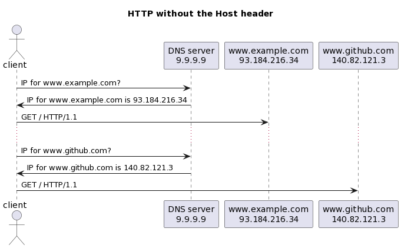
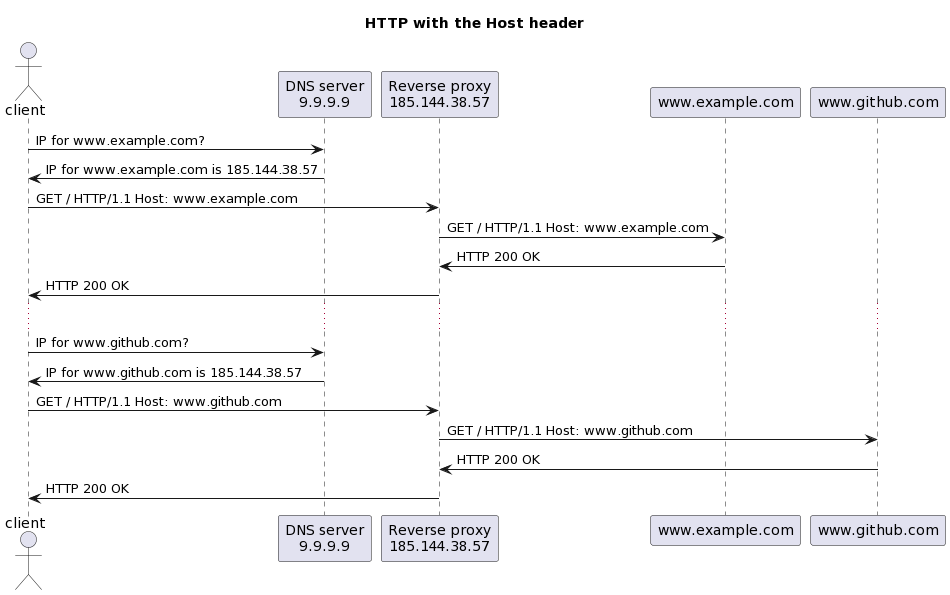

<!--
theme: custom-marp-theme
size: 16:9
paginate: true
author: L. Delafontaine and H. Louis, with the help of GitHub Copilot
title: HEIG-VD DAI - Web infrastructures
description: Web infrastructures for the DAI course at HEIG-VD, Switzerland
header: '[**Web infrastructures**](https://github.com/heig-vd-dai-course/heig-vd-dai-course/tree/main/13.01-web-infrastructures)'
footer: '[**HEIG-VD**](https://heig-vd.ch) - [DAI 2025-2026](https://github.com/heig-vd-dai-course/heig-vd-dai-course) - [CC BY-SA 4.0](https://github.com/heig-vd-dai-course/heig-vd-dai-course/blob/main/LICENSE.md)'
headingDivider: 6
-->

# Web infrastructures

<!--
_class: lead
_paginate: false
-->

[Link to the course][course]

<small>L. Delafontaine and H. Louis, with the help of
[GitHub Copilot](https://github.com/features/copilot).</small>

<small>Based on the original course by O. Liechti and J. Ehrensberger.</small>

<small>This work is licensed under the [CC BY-SA 4.0][license] license.</small>

![bg opacity:0.1][illustration]

## Objectives

- Understand the concepts of web infrastructures
- Understand how HTTP features can help to build web infrastructures
- Understand the concepts of a reverse proxy
- Understand the concepts of load balancing

## Prepare and setup your environment

<!-- _class: lead -->

More details for this section in the [course material][course]. You can find
other resources and alternatives as well.

### Prepare and setup your environment

**Take 20 minutes to set up your environment using the [course
material][course]**:

- Clone the code examples repository on the virtual machine
- Validate you have access to the virtual machine from the Internet on ports 80
  and 443
- Obtain a domain name
- Add the required DNS records to the DNS zone

This will allow to run the examples along the theory in this chapter.

## Functional and non-functional requirements

<!-- _class: lead -->

More details for this section in the [course material][course]. You can find
other resources and alternatives as well.

### Functional and non-functional requirements

- Requirements used to **define the scope of a system**.
- An **abstract representation** of the system that will be implemented.
- Can help to **define the architecture of the system**.
- **Functional requirements**: features that a system must have to satisfy the
  needs of its users. It is the "what" of a system.
- **Non-functional requirements**: constraints on the system. It is the "how" of
  a system.

---

Examples of **functional requirements**:

- **User management**: Users must be able to register, login, logout, etc.
- **Product management**: Users must be able to create, read, update, delete
  products, etc.
- **Order management**: Users must be able to create, read, update, delete
  orders, etc.
- **Payment management**: Users must be able to pay for their orders, etc.

---

Examples of **non-functional requirements**:

- **Response time**: Time between a request and a response (end user)
- **Throughput**: Number of requests/interval (service provider)
- **Scalability**: Property of a system to handle a varying amount of work
- **Availability**: Percentage of time that the system provides a satisfactory
  service
- **Maintainability**: How easily the system can be managed
- **Security**: Confidentiality, authentication, authorization, etc.
- [...and many, many more](https://en.wikipedia.org/wiki/Non-functional_requirement)

## Web infrastructure definition

<!-- _class: lead -->

More details for this section in the [course material][course]. You can find
other resources and alternatives as well.

### Web infrastructure definition

Software and hardware components that are necessary to support:

- the **development**
- the **deployment**
- the **management**

of web applications.

## The `Host` header

<!-- _class: lead -->

More details for this section in the [course material][course]. You can find
other resources and alternatives as well.

### The `Host` header

- Part of the HTTP request
- Used to specify the domain name of the server
- Can be used to **host multiple websites on the same server** using a reverse
  proxy
- The reverse proxy will **route the request to the correct website** based on
  the `Host` header

---

---

## Forward proxy and reverse proxy

<!-- _class: lead -->

More details for this section in the [course material][course]. You can find
other resources and alternatives as well.

### Forward proxy and reverse proxy

- Proxies are components that **intercept** requests and responses and
  **filter/forward/change** them to another component.
- **Forward proxy**: used by a client to access external servers
- **Reverse proxy**: used by an external server to access internal servers

### Forward proxy

- Operates between clients and external systems
- Can be used to:
  - Restrict access to external systems
  - Regulate traffic
  - Mask the identity of the client
  - Enforce security policies

### Reverse proxy

- Operates between external systems and internal systems
- Can be used to:
  - Restrict access
  - Load balance requests to internal systems
  - Cache responses from internal systems

### Traefik as a reverse proxy

- Works well with Docker Compose and Kubernetes
- Issue and renew [Let's Encrypt](https://letsencrypt.org/) (HTTPS) certificates
  automatically
- Easy to use with
  [Docker Compose labels](https://docs.docker.com/compose/compose-file/compose-file-v3/#labels)

### Experiment with Traefik

**Take 20 minutes to experiment with Traefik using the [course material][course]
and the
[code examples](https://github.com/heig-vd-dai-course/heig-vd-dai-course-code-examples)**:

- Run the _"whoami with host-based routing"_ example
- Run the _"whoami with host-based and path-based routing"_ example
- Run the _"whoami with host-based, path-based routing and `StripPrefix`
  middleware"_ example

You should have a better understanding of how Traefik works.

## System scalability

<!-- _class: lead -->

More details for this section in the [course material][course]. You can find
other resources and alternatives as well.

### System scalability

- Capacity of a system to handle a varying amount of work
- Can be achieved by:
  - **Vertical scaling** (adding more hardware resources to a server, also known
    as _scale up_)
  - **Horizontal scaling** (adding more servers to share the load, also known as
    _scale out_)

### Vertical scaling

Adding more resources to a server:

- More/better RAM
- More/better CPU
- More/better storage
- etc.

Limited by the hardware: at a certain point, you cannot add more/better
resources to a server.

### Horizontal scaling

Add more servers to a system and distribute the load between them.

Limited by the software - your software must be able to run on multiple servers:

- Backends/APIs accessing the same database(s)
- Frontends accessing backends/API

### When to use scale up or scale out?

- Determined by the **non-functional requirements** of the system
- You need metrics to determine when to scale up or scale out to identify
  bottlenecks
- Once the bottleneck is identified (from monitoring), you can decide to scale
  up or scale out

### How to monitor a system?

Out of scope for this course, but here are some tools you can use:

- [Prometheus](https://prometheus.io/)
- [Grafana](https://grafana.com/)
- [Sentry](https://sentry.io/)
- [LibreNMS](https://www.librenms.org/)

## Load balancing

<!-- _class: lead -->

More details for this section in the [course material][course]. You can find
other resources and alternatives as well.

### Load balancing

Process of **distributing the load** between multiple servers.

This can work thanks to the **stateless** nature of HTTP and the `Host` header.

The load balancer must know the **pool of servers** it can forward the requests
to.

---

Multiple strategies can be used to distribute the load:

- **Round-robin**: each server in the pool in turn (covered in this course)
- **Least connections**: least number of active connections
- **Least response time**: least response time
- **Hashing**: based on a hash of the request (e.g. the IP address of the
  client, the URL of the request, etc.)

---

An issue with load balancing is **session management**: the load balancer could
forward requests from the same client to different servers, loosing their
session.

As HTTP is stateless, the load balancer must know how to forward requests from
the same client to the same server. A solution is **sticky sessions** with the
help of a cookie.

---

**Take 20 minutes to experiment with Traefik using the [course material][course]
and the
[code examples](https://github.com/heig-vd-dai-course/heig-vd-dai-course-code-examples)**:

- Run the _"whoami with host-based routing and sticky sessions"_ example

You should have a better understanding of how sticky sessions work.

For those who have time, you can check the _"Go further"_ section in the course
material.

## Questions

<!-- _class: lead -->

Do you have any questions?

## Finished? Was it easy? Was it hard?

Can you let us know what was easy and what was difficult for you during this
course?

This will help us to improve the course and adapt the content to your needs. If
we notice some difficulties, we will come back to you to help you.

➡️ [GitHub Discussions][discussions]

You can use reactions to express your opinion on a comment!

## Sources

- Main illustration by [Nicolas Picard](https://unsplash.com/@artnok) on
  [Unsplash](https://unsplash.com/photos/-lp8sTmF9HA)
- Illustration by [Aline de Nadai](https://unsplash.com/@alinedenadai) on
  [Unsplash](https://unsplash.com/photos/j6brni7fpvs)
- Illustration by [Mohammadreza alidoos](https://unsplash.com/@mralidoost) on
  [Unsplash](https://unsplash.com/photos/black-and-silver-laptop-computer-0rUp9vgyEYo)
- Illustration by [Gaurav Dhwaj Khadka](https://unsplash.com/@gauravdhwajkhadka)
  on
  [Unsplash](https://unsplash.com/photos/brown-wooden-table-near-window-eRQ5Pk59p9s)
- Illustration by [Imre Tömösvári](https://unsplash.com/@timester12) on
  [Unsplash](https://unsplash.com/photos/gray-suv-on-road-during-daytime-FbhuN53_330)
- Illustration by [Kelvin T](https://unsplash.com/@gogofoto) on
  [Unsplash](https://unsplash.com/photos/blue-weighing-scale-at-0-FE_uysP-cfw)
- Illustration by [Alfred Kenneally](https://unsplash.com/@alken) on
  [Unsplash](https://unsplash.com/photos/black-beetle-on-green-grass-during-daytime-VrsNMCejQEw)
- Illustration by [Mikhail Vasilyev](https://unsplash.com/@miklevasilyev) on
  [Unsplash](https://unsplash.com/photos/colony-of-fire-ant-Vf1JrKMUS0Q)

---

- Illustration by [Ibrahim Boran](https://unsplash.com/@ibrahimboran) on
  [Unsplash](https://unsplash.com/photos/black-flat-screen-tv-turned-on-near-black-and-gray-audio-component-iYkqHp5cGQ4)
- Illustration by [Elena Mozhvilo](https://unsplash.com/@miracleday) on
  [Unsplash](https://unsplash.com/photos/person-sitting-on-chair-in-front-of-table-with-food-slaDjF7-HHQ)
- Illustration by [Evan Krause](https://unsplash.com/@evankrause_) on
  [Unsplash](https://unsplash.com/photos/assorted-box-lot-pdFMl6enmeo)
- Illustration by [Markus Spiske](https://unsplash.com/@markusspiske) on
  [Unsplash](https://unsplash.com/photos/a-toy-tractor-and-rocks-CBtiTnW_6Kk)

[course]:
	https://github.com/heig-vd-dai-course/heig-vd-dai-course/tree/main/13.01-web-infrastructures
[license]:
	https://github.com/heig-vd-dai-course/heig-vd-dai-course/blob/main/LICENSE.md
[discussions]: https://github.com/orgs/heig-vd-dai-course/discussions/122
[illustration]: ./images/main-illustration.jpg
