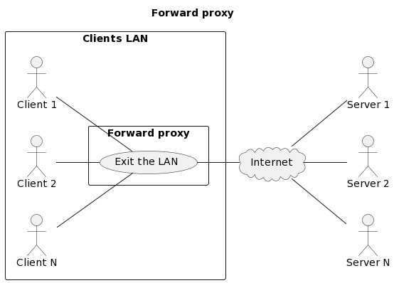
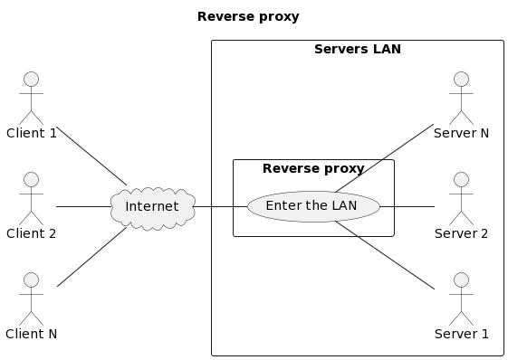

# Web infrastructures


L. Delafontaine and H. Louis, with the help of
[GitHub Copilot](https://github.com/features/copilot).

Based on the original course by O. Liechti and J. Ehrensberger.

This work is licensed under the [CC BY-SA 4.0][license] license.

## Resources

- Objectives, teaching and learning methods, and evaluation methods:
  [Link to content](..)
- Course material: [Link to content](../01-course-material/README.md) ·
  [Presentation (web)](https://heig-vd-dai-course.github.io/heig-vd-dai-course/13.01-web-infrastructures/01-course-material/index.html)
  ·
  [Presentation (PDF)](https://heig-vd-dai-course.github.io/heig-vd-dai-course/13.01-web-infrastructures/01-course-material/13.01-web-infrastructures-presentation.pdf)

## Table of contents

- [Resources](#resources)
- [Table of contents](#table-of-contents)
- [Objectives](#objectives)
- [Prepare and setup your environment](#prepare-and-setup-your-environment)
  - [Check and run the code examples](#check-and-run-the-code-examples)
  - [Validate you have access to the virtual machine from the Internet on ports 80 and 443](#validate-you-have-access-to-the-virtual-machine-from-the-internet-on-ports-80-and-443)
  - [Obtain a domain name](#obtain-a-domain-name)
  - [Add the required DNS records to the DNS zone](#add-the-required-dns-records-to-the-dns-zone)
- [Functional and non-functional requirements](#functional-and-non-functional-requirements)
- [Web infrastructure definition](#web-infrastructure-definition)
- [The `Host` header](#the-host-header)
- [Forward proxy and reverse proxy](#forward-proxy-and-reverse-proxy)
  - [Forward proxy](#forward-proxy)
  - [Reverse proxy](#reverse-proxy)
  - [Traefik as a reverse proxy](#traefik-as-a-reverse-proxy)
  - [Experiment with Traefik](#experiment-with-traefik)
- [System scalability](#system-scalability)
  - [Vertical scaling](#vertical-scaling)
  - [Horizontal scaling](#horizontal-scaling)
  - [When to use scale up or scale out?](#when-to-use-scale-up-or-scale-out)
  - [How to monitor your system?](#how-to-monitor-your-system)
- [Load balancing](#load-balancing)
- [Go further](#go-further)
- [Conclusion](#conclusion)
  - [What did you do and learn?](#what-did-you-do-and-learn)
  - [Test your knowledge](#test-your-knowledge)
- [Finished? Was it easy? Was it hard?](#finished-was-it-easy-was-it-hard)
- [Additional resources](#additional-resources)
- [Sources](#sources)

## Objectives

In this course, you will learn how to build a web infrastructure.

You will learn how to use a reverse proxy and a load balancer to scale your
system.

Thanks to HTTP features, the reverse proxy will be able to serve multiple
domains on the same IP address.

Finally, you will learn how to monitor your system.

In a nutshell, at the end of this chapter, you will be able to:

- Describe the concepts of web infrastructures.
- Build reliable web infrastructure using HTTP features.
- Use a reverse proxy to host multiple web applications on the same server.
- Use load balancing to distribute traffic across multiple servers.

As this chapter is quite abstract, you will first setup your environment to be
able to run some code examples along with the theory.

## Prepare and setup your environment

### Check and run the code examples

In this section, you will clone the code examples **on the virtual machine** to
check and run the code examples along with the theory.

#### Clone the main repository to get the code examples on the virtual machine

**On the virtual machine**, clone the
[`heig-vd-dai-course/heig-vd-dai-course`](https://github.com/heig-vd-dai-course/heig-vd-dai-course)
repository to get the code examples:

> [!NOTE]
>
> Make sure you are cloning the repository on the virtual machine you created in
> a previous course.
>
> **This time, clone it with HTTPS instead of SSH.** This will allow you to
> clone the repository without having to set up an SSH key on the virtual
> machine.

```sh
# Clone the repository (notice we use HTTPS this time)
git clone https://github.com/heig-vd-dai-course/heig-vd-dai-course.git
```

#### Access the code examples in your terminal

Open a terminal and navigate to the
`heig-vd-dai-course/13.01-web-infrastructures/02-code-examples` directory.

#### Explore and run the code examples

Check out the
`heig-vd-dai-course/13.01-web-infrastructures/02-code-examples/README.md` file
to learn how to run the code examples.

### Validate you have access to the virtual machine from the Internet on ports 80 and 443

In this section, you will validate that you have access to the virtual machine
from the Internet on ports 80 and 443 using
[whoami](https://github.com/traefik/whoami).

whoami is a tiny Go webserver that prints OS information and HTTP request to
output.

whoami will be used to test various features of HTTP.

For the time being, try to access the virtual machine from the Internet on ports
80 and 443 using the public IP address of the virtual machine.

You should notice that you have an error. This is because the virtual machine is
not configured to respond to requests on ports 80 and 443 yet: no services are
running on these ports at the moment.

Run the
[`01-whoami-on-ports-80-and-443`](../02-code-examples/01-whoami-on-ports-80-and-443/README.md)
example.

Read the README carefully. Take some time to explore the code; it should contain
comments to help you understand what is going on.

### Obtain a domain name

In this section, you will obtain a domain name.

A domain name is a human-readable name that is used to identify a website on the
Internet.

If you already own a domain name, you can use it for the purpose of this
teaching unit.

If you do not have a domain or you do not want to use your own domain, you will
obtain a free domain name for the purpose of this teaching unit.

You can chose to use any domain name provider you want from the following list:

> [!NOTE]
>
> Even though most of these providers seem fishy and old-fashioned, they are
> reliable and well-known in the free domain name community. You can use any of
> them to obtain a free domain name that you can use in this teaching unit.

> [!NOTE]
>
> As of December 2025, it seems DuckDNS has some issues recently. If you cannot
> get it to work correctly, feel free to use another provider from the list.
>
> As long as you can access your virtual machine using a domain name, you are
> good to go for the rest of the teaching unit.

- [Dynu](https://www.dynu.com/)
- [Duck DNS](https://www.duckdns.org/)
- [FreeDNS](https://freedns.afraid.org/)
- [deSEC](https://desec.io/)

_Missing item in the list? Feel free to open a pull request to add it! ✨_

Follow the instructions of your chosen domain name provider to obtain a free
domain name.

The (free) domain name can be anything you want. It does not have to be related
to the practical work nor this teaching unit and you can use it for other
purposes in the future as well.

Once you have obtained a domain name, you will add the required DNS records to
the DNS zone of your domain name provider.

### Add the required DNS records to the DNS zone

In this section, you will add the required DNS records to the DNS zone of your
domain name provider.

This will allow you to access the services hosted on the virtual machine using
the domain name and its subdomains you obtained.

#### Add the DNS records

Add an `A` record to the DNS zone of your domain name provider to point to the
IP address of the virtual machine.

> [!TIP]
>
> If you use Dynu or Duck DNS, the default are `A`/`AAAA` records. Add a record
> and it will be of the right type.

**Example**: if your domain name is `heig-vd-dai-course.freeddns.org` and your
virtual machine IP address is `20.73.17.105`, you must add an `A` record for
`heig-vd-dai-course.freeddns.org` pointing to `20.73.17.105`.

Add a second wildcard `A` record to the DNS zone of your domain name provider to
point to the IP address of the virtual machine. A wildcard record is a record
that will match all subdomains of a domain name using the `*` character. This
will allow access to all your services hosted under a subdomain of your domain
name.

> [!TIP]
>
> _"What is a wildcard DNS record?"_
>
> A wildcard DNS record is a record that will match all subdomains of a domain
> name using the `*` character. For example, a wildcard `A` record for
> `*.example.com` will match `subdomain1.example.com`, `subdomain2.example.com`,
> etc.
>
> This is useful when you want to host multiple services on the same domain name
> using different subdomains without having to create a DNS record for each
> subdomain.
>
> However, some domain name providers do not support wildcard DNS records in
> their free plans.
>
> If your domain name provider does not support wildcard DNS records in their
> free plan, you can individually create `A` records for each subdomain you want
> to use. For example, you can create `A` records for `whoami1.example.com`,
> `whoami2.example.com`, etc. pointing to the IP address of the virtual machine.
>
> This can be used on [FreeDNS](https://freedns.afraid.org/) for example.

> [!TIP]
>
> If you use Dynu, check the _Wildcard IPv4 Alias_ option when adding the `A`
> record.
>
> If you use Duck DNS, a wildcard record is automatically created when you add
> an `A` record.

**Example**: if your domain name is `heig-vd-dai-course.freeddns.org` and your
virtual machine IP address is `20.73.17.105`, you must add a wildcard `A` record
for `*.heig-vd-dai-course.freeddns.org` pointing to `20.73.17.105`. This will
allow any subdomain such as `whoami1.heig-vd-dai-course.freeddns.org`,
`whoami2.heig-vd-dai-course.freeddns.org`, etc. to resolve to the IP address of
the virtual machine.

#### Test the DNS resolution

Test the DNS resolution of the DNS records you added from the virtual machine
and from your local machine.

> [!IMPORTANT]
>
> You might have to wait a few minutes (around 15 minutes in our experience) for
> the DNS record to be propagated and get a successful response. You might need
> to try on a different network/device as well.

```sh
# Test the DNS resolution
nslookup <domain name>
```

On success, the output should be similar to the following:

```text
Server:   127.0.0.53
Address:  127.0.0.53#53

Non-authoritative answer:
Name: heig-vd-dai-course.freeddns.org
Address: 20.73.17.105
```

This output shows that the domain name resolves to the IP address of the virtual
machine.

On failure, the output should be similar to the following:

```text
Server:   127.0.0.53
Address:  127.0.0.53#53

** server can't find heig-vd-dai-course.freeddns.org: NXDOMAIN
```

Do the same for the wildcard DNS record (`*.heig-vd-dai-course.freeddns.org`).

You should now be able to access the virtual machine from the Internet using the
domain name and its subdomains you obtained. Try to access the whoami service
using the domain name and its subdomains you obtained. Any subdomain should work
such as `whoami.heig-vd-dai-course.freeddns.org`.

You should see the whoami service running on ports 80 and 443.

If you do not get the expected results, your domain name provider might not have
propagated the DNS records yet. Wait a few minutes and try again.

Once you have confirmed that you can access the virtual machine from the
Internet using the domain name and its subdomains you obtained, you can stop the
whoami service:

```sh
# Stop the containers
docker compose down
```

You are now ready for the rest of this course! Let's go back to the theory for a
moment.

## Functional and non-functional requirements

Functional and non-functional requirements are used to define the scope of a
system.

It is an abstract representation of the system that will be implemented and that
can help to define the architecture of the system.

Functional requirements are the features that a system must have to satisfy the
needs of its users. It answers the question _"What must the system do?"_.

Some examples of functional requirements:

- **User management**: Users must be able to register, login, logout, etc.
- **Product management**: Users must be able to create, read, update, delete
  products, etc.
- **Order management**: Users must be able to create, read, update, delete
  orders, etc.
- **Payment management**: Users must be able to pay for their orders, etc.

In order to provide the features that a system must have, the system must
respect some constraints. These constraints are called non-functional
requirements. It answers the question _"How must the system perform its
functions?"_.

Some examples of non-functional requirements:

- **Response time**: Time required between a request and the presentation of the
  result (most important for the end user).
- **Throughput**: Number of requests handled per time interval (most important
  for the service provider).
- **Scalability**: Property of a system to handle a varying amount of work -
  ideally we want linear or less scalability: 2x more server for 2x more users.
- **Availability**: Percentage of time that the system provides a satisfactory
  service.
- **Maintainability**: Ease with which the system can be managed and evolved.
- **Security**: Confidentiality, integrity, availability, authentication,
  authorization, etc.
- ...and many, many, MANY more:
  <https://en.wikipedia.org/wiki/Non-functional_requirement>.

Functional and non-functional requirements are used to define the scope of a
system and they strongly depend on/influence the architecture of a system.

It is important to define the functional and non-functional requirements of a
system before starting to design it.

Implementing all requirements is not always possible. Some requirements can be
in conflict with each other. For example, increasing the security of a system
can decrease its performance.

It is always a trade-off between the requirements.

## Web infrastructure definition

Web infrastructures are the software and hardware resources that are used to
support the deployment of web applications, web services, and websites on the
Internet. They must respect the functional and non-functional requirements of
the system.

Web infrastructures are composed of several components:

- **Web server**: a computer that runs web server software and responds to
  requests from a web client (e.g. a web browser, a mobile application, a
  command line tool, etc.).
- **Reverse proxy**: a proxy server that retrieves resources on behalf of a
  client from one or more servers. These resources are then returned to the
  client as though they originated from the proxy server itself.
- **Load balancer**: a device that acts as a reverse proxy and distributes
  network or application traffic across a number of servers.
- **Cache**: a component that stores data so future requests for that data can
  be served faster.
- **Content delivery network (CDN)**: a geographically distributed network of
  proxy servers and their data centers.

In this course, we will explore a few of these components and how they can be
used to build a web infrastructure.

## The `Host` header

Thanks to the HTTP protocol, web infrastructures can be built easily. HTTP
offers many features that can be used to build a web infrastructure.

One of the features HTTP offers is the `Host` header.

The `Host` header is a header which specifies the domain name of the server. It
is a header sent by the client.

Using this header, a server can handle multiple domains on the same IP address
with the help of a reverse proxy.

Before the `Host` header, a server could only handle one domain per IP address.
The following diagram shows how it worked:


The following diagram shows how the `Host` header works:


The reverse proxy receives the request from the client and forwards it to the
right web server. The web server receives the request and sends a response to
the reverse proxy. The reverse proxy receives the response and forwards it to
the client.

Multiple web servers can be hosted on the same IP address using the `Host`
header.

## Forward proxy and reverse proxy

Forward and reverse proxies are two different types of proxies.

A proxy is a component that acts as an intermediary for requests from clients
seeking resources from other servers.

### Forward proxy

As described in
[Forward Proxy vs. Reverse Proxy: The Difference Explained](https://www.strongdm.com/blog/difference-between-proxy-and-reverse-proxy)
article, a forward proxy...

> ...also known as a proxy server, operates between clients and external
> systems, regulating traffic, masking client IP addresses, and enforcing
> security policies.

It acts as an intermediary for requests from clients seeking resources from
other servers. A forward proxy is a proxy configured to handle requests from a
group of clients to any other server.

Forward proxies are often used in corporate environments to enforce security
policies (e.g., block access to certain websites, etc.) and reside in the LAN
network.



### Reverse proxy

As described in
[Forward Proxy vs. Reverse Proxy: The Difference Explained](https://www.strongdm.com/blog/difference-between-proxy-and-reverse-proxy)
article, a reverse proxy...

> ...is positioned between clients and servers, acting as a protective barrier
> for servers by accepting client requests, forwarding them to the appropriate
> server, and returning the results to the client.

It acts as an intermediary for requests from clients seeking resources from
other servers. A reverse proxy is a proxy configured to handle requests from any
client to a group of servers.

Reverse proxies are often used in web infrastructures to serve multiple domains
on the same IP address and to scale.



Reverse proxies are used in web infrastructures to serve multiple domains on the
same IP address and to scale.

A reverse proxy is a component that sits in front of one or more servers. It
receives requests from clients and forwards them to the servers. It also
receives responses from the servers and forwards them back to the clients.

A reverse proxy can be used to:

- **Load balance**: Reverse proxy can receive all traffic and distribute the
  requests on a cluster of several identical Web server instances.
- **Cache**: Reverse proxy can keep in cache responses from servers for a
  certain amount of time - if the same request is received again, the reverse
  proxy can return the cached response instead of forwarding the request to the
  server.
- **Encrypt** and **decrypt** traffic: Reverse proxy manages secure HTTPS
  connections with clients and unsecure HTTP connections with servers.
- **Protect** servers from attacks (e.g. DDoS, SQL injection, etc.): By
  filtering requests, reverse proxy can protect servers from attacks.
- **Serve static content** (e.g. images, videos, etc.): Reverse proxy can serve
  static content from a cache.
- **Serve multiple domains** on the same IP address: Reverse proxy can use the
  `Host` header to forward requests to the correct server.

A reverse proxy is a very powerful component that can be used to build a web
infrastructure.

In this teaching unit, we will use Traefik as a reverse proxy.

### Traefik as a reverse proxy

Traefik is an open-source Edge Router that makes exposing/publishing your
services on the Internet a fun and easy experience. It receives requests on
behalf of your system and finds out which components are responsible for
handling them.

Traefik is full of features and can be used as a reverse proxy, a load balancer,
a Kubernetes ingress controller, and much more. It also offers a Docker image
for us to use.

One of the main features of Traefik is to issue and renew
[Let's Encrypt](https://letsencrypt.org/) (HTTPS) certificates automatically in
conjuncture with
[Docker Compose labels](https://docs.docker.com/compose/compose-file/compose-file-v3/#labels).

We will go into more details about Traefik in the next sections.

Run the [`02-traefik`](../02-code-examples/02-traefik/README.md) example.

Read the README carefully. Take some time to explore the code; it should contain
comments to help you understand what is going on.

You should be able to access the Traefik dashboard at the subdomain you set up.

This will allow to validate Traefik configuration.

#### Alternatives

_Alternatives are here for general knowledge. No need to learn them._

- [Caddy](https://caddyserver.com/)
- [Nginx](https://www.nginx.com/)
- [Apache](https://httpd.apache.org/)
- [HAProxy](https://www.haproxy.org/)
- [certbot](https://certbot.eff.org/)

_Missing item in the list? Feel free to open a pull request to add it! ✨_

### Experiment with Traefik

Run the
[`03-whoami-with-host-based-routing`](../02-code-examples/03-whoami-with-host-based-routing/README.md)
example.

Read the README carefully. Take some time to explore the code, it should contain
comments to help you understand what is going on.

You should be able to access whoami at the subdomain you set up. You can check
the Traefik dashboard to see the configuration.

The output should be similar to the following:

```text
Hostname: 43a2c970b7ad
IP: 127.0.0.1
IP: ::1
IP: 172.18.0.4
RemoteAddr: 172.18.0.2:55832
GET / HTTP/1.1
Host: whoami1.heig-vd-dai-course.freeddns.org
User-Agent: Mozilla/5.0 (X11; Linux x86_64; rv:132.0) Gecko/20100101 Firefox/132.0
Accept: text/html,application/xhtml+xml,application/xml;q=0.9,*/*;q=0.8
Accept-Encoding: gzip, deflate, br, zstd
Accept-Language: en-US,en;q=0.5
Dnt: 1
Priority: u=0, i
Sec-Fetch-Dest: document
Sec-Fetch-Mode: navigate
Sec-Fetch-Site: none
Sec-Fetch-User: ?1
Sec-Gpc: 1
Te: trailers
Upgrade-Insecure-Requests: 1
X-Forwarded-For: 188.154.42.56
X-Forwarded-Host: whoami1.heig-vd-dai-course.freeddns.org
X-Forwarded-Port: 443
X-Forwarded-Proto: https
X-Forwarded-Server: 5f59b99ca0e6
X-Real-Ip: 188.154.42.56
```

Note the following headers:

- `Hostname`: the domain name of the whoami container.
- `IP`: the IP addresses of the whoami container.
- `GET / HTTP/1.1`: the HTTP request from the client.
- `Host: WHOAMI_FULLY_QUALIFIED_DOMAIN_NAME`: the domain name requested by the
  client.
- `X-Forwarded-For`: the IP address of the client.
- `X-Forwarded-Host`: the domain name of the client.
- `X-Forwarded-Port`: the port of the client.
- `X-Forwarded-Proto`: the protocol of the client.
- `X-Forwarded-Server`: the hostname of the reverse proxy container.

Using both the `Host` header, the HTTP request and the `X-Forwarded-*` headers,
the reverse proxy can forward the request to the correct server (whoami
container).

The request from the client has been forwarded to the reverse proxy. The reverse
proxy has forwarded the request to the whoami container. The whoami container
has sent a response to the reverse proxy. The reverse proxy has forwarded the
response to the client.

Now, run the
[`04-whoami-with-host-based-and-path-based-routing`](../02-code-examples/04-whoami-with-host-based-and-path-based-routing/README.md)
example.

Read the README carefully. Take some time to explore the code, it should contain
comments to help you understand what is going on.

You should be able to access whoami at the subdomain you set up with the path
`/whoami`. You can check the Traefik dashboard to see the configuration.

Same as before, but this time, the reverse proxy has mapped the
`WHOAMI_FULLY_QUALIFIED_DOMAIN_NAME` domain and the `/whoami` path to the whoami
container.

At the end of this section, you should have two whoami instances running on your
virtual machine, all accessible at different subdomains and paths thanks to the
reverse proxy.

You can check the Traefik dashboard to see the current services that are
configured and exposed by Traefik:


Thanks to these capabilities, a reverse proxy can be used to build a web
infrastructure that can serve multiple domains on the same IP address. It can
change the request before forwarding it to the right server (or the container in
this case) and change the response before forwarding it to the client.

## System scalability

System scalability is the capability of a system to handle a growing amount of
work, or its potential to be enlarged to accommodate that growth.

In web infrastructures, scalability is the capability of a system to handle a
growing amount of requests that are sent by clients to one or more servers.

There are two types of scalability:

- **Vertical scaling**: adding more resources (CPU/RAM/Disk) to an existing
  server. This is also called **scaling up**.
- **Horizontal scaling**: adding more servers to an existing system. Then, use
  load-balancing to distribute the work between the servers. This is also called
  **scaling out**.

Some variations of these two main types of scalability exist, such as elastic
scaling (adding or removing resources (CPU/RAM/Disk) on the fly). However, we
will not cover them in this teaching unit.

Both vertical and horizontal scaling are used to improve the performance of a
system to handle more requests (e.g. a lot of users on your website).

### Vertical scaling

Vertical scaling is limited by the hardware: at a certain point, you cannot add
more/better resources to a server.

### Horizontal scaling

Horizontal scaling is often limited by the software.

Instead of adding more resources to your server, you add more (smaller) servers
to your system.

Your software must be able to scale horizontally as well (multiple backends/API
accessing to one or more databases at the same time, multiple frontends
accessing the same backends, etc.), and it is not always possible.

### When to use scale up or scale out?

Scaling must be determined by the non-functional requirements (= needs) of of
your system. In order to determine the best scaling strategy, you must know the
bottlenecks of your system. Bottlenecks can only be identified by load testing
your system and monitoring it to get metrics.

There are a few metrics that can help you to determine the bottlenecks of your
system:

- CPU usage.
- Memory usage.
- Disk usage.
- Network usage.
- Number of requests per second.
- Response time.
- Availability.
- etc.

**Only from metrics, you can determine the bottlenecks of your system.**

Once you know the bottlenecks of your system, you can determine the best scaling
strategy.

I (Ludovic) recommend to use vertical scaling as much as possible before
switching to horizontal scaling.

Adding new resources to a server is (usually) easy and fast: you just have to
stop the server, add resources, and start it again.

Horizontal scaling is (much) more complex to setup and maintain: you have to add
new servers to your system, configure load balancing, etc.

It can introduce new issues (e.g. network latency, data consistency, etc.). It
is also more expensive (usually).

### How to monitor your system?

There are a lot of tools to monitor your system. Here are a few examples:

- [Prometheus](https://prometheus.io/).
- [Grafana](https://grafana.com/).
- [Sentry](https://sentry.io/).
- [LibreNMS](https://www.librenms.org/).

Monitoring your system is a complex task and is out of the scope of this course.
You will learn more about monitoring in future courses.

## Load balancing

Load balancing is the process of distributing a set of tasks over a set of
resources (computing units), with the aim of making their overall processing
more efficient.

Thanks to the reverse proxy and the `Host` header, a load balancer can be used
to distribute requests between multiple servers to achieve horizontal scaling.
This is only possible thanks to the fact that HTTP is a stateless protocol.

In order to distribute requests between multiple servers, a load balancer must
know the servers it can forward requests to. This is called a **pool** of
servers.

A load balancer can distribute requests between multiple servers using different
strategies:

1. **Round-robin**: the load balancer forwards requests to each server in the
   pool in turn.
2. **Sticky sessions**: the load balancer forwards requests from the same client
   to the same server with the help of a cookie.
3. **Least connections**: the load balancer forwards requests to the server with
   the least number of active connections.
4. **Least response time**: the load balancer forwards requests to the server
   with the least response time.
5. **Hashing**: the load balancer forwards requests to the server based on a
   hash of the request (e.g. the IP address of the client, the URL of the
   request, etc.).

Run the
[`05-whoami-with-host-based-routing-and-sticky-sessions`](../02-code-examples/05-whoami-with-host-based-routing-and-sticky-sessions/README.md)
example.

Read the README carefully. Take some time to explore the code, it should contain
comments to help you understand what is going on.

You should be able to access the whoami instances at
`https://WHOAMI_1_FULLY_QUALIFIED_DOMAIN_NAME` and
`https://WHOAMI_2_FULLY_QUALIFIED_DOMAIN_NAME`.

Notice that the `Hostname` and `IP` values in the output are different for each
instance.

In the first example, the load balancer uses the round-robin strategy to
distribute requests between the three whoami instances.

In the second example, the load balancer uses the sticky-session strategy to
always forward requests from the same client to the same whoami instance with
the help of a cookie.

The sticky-session strategy is useful when you want to keep the state of a
client on the same server: if a client is making an order on your website, you
want to keep the state of the order on the same server to avoid issues.

However, a new client can be forwarded to any server in the pool, leveraging the
load balancing strategy.

## Go further

This is an optional section. Feel free to skip it if you do not have time.

- Are you able to add a basic authentication to the Traefik dashboard using a
  middleware? You will have to do the following:
  - Add a
    [`BasicAuth` middleware](https://doc.traefik.io/traefik/middlewares/http/basicauth/)
    to the Traefik configuration (more information about basic authentication on
    Wikipedia at <https://en.wikipedia.org/wiki/Basic_access_authentication>).
  - Create a `auth_users.txt` file with the username and password of the users
    with the help of the
    [`htpasswd`](https://httpd.apache.org/docs/2.4/programs/htpasswd.html)
    command line tool (you might need to install it).
  - Make usage of [Docker Secrets](https://docs.docker.com/compose/use-secrets/)
    to pass sensitive information to a service.

The
[`99-traefik-with-dns-challenge`](../02-code-examples/99-traefik-with-dns-challenge/README.md)
example makes usage of this configuration if you want to check it out.

## Conclusion

### What did you do and learn?

In this course, you have learned about functional and non-functional
requirements.

Using these, you are able to build a web infrastructure using reverse proxies
and load balancers.

Thanks to the `Host` header, you have learned how a reverse proxy can serve
multiple domains on the same IP address.

Thanks to the following features of HTTP, you were able to make use of them to
build a web infrastructure to serve multiple domains on the same IP address and
to scale:

- **Statelessness**: HTTP servers don't have to store information about the
  state of a client: the client has to send all the information with each
  request (a cookie session for example) so the server can find the context to
  handle the request.
- **Scalability**: Several identical servers can handle requests without
  coordination: the client can send a request to any server, and the server can
  handle the request.
- **Reliability**: After a server failure, another server can easily take over
  the work (if the server is stateless).

### Test your knowledge

At this point, you should be able to answer the following questions:

- What is a reverse proxy? What is a load balancer? How do they differ?
- What is the `Host` header? How can it be used to serve multiple domains on the
  same IP address?
- What is the difference between vertical and horizontal scaling?

## Finished? Was it easy? Was it hard?

Can you let us know what was easy and what was difficult for you during this
course?

This will help us to improve the course and adapt the content to your needs. If
we notice some difficulties, we will come back to you to help you.

> [!NOTE]
>
> Vous pouvez évidemment poser toutes vos questions et/ou vos propositions
> d'améliorations en français ou en anglais.
>
> N'hésitez pas à nous dire si vous avez des difficultés à comprendre un concept
> ou si vous avez des difficultés à réaliser les éléments demandés dans le
> cours. Nous sommes là pour vous aider !

➡️ [GitHub Discussions][discussions]

You can use reactions to express your opinion on a comment!

## Additional resources

_Resources are here to help you. They are not mandatory to read._

- _None yet_

_Missing item in the list? Feel free to open a pull request to add it! ✨_

## Sources

- Main illustration by [Nicolas Picard](https://unsplash.com/@artnok) on
  [Unsplash](https://unsplash.com/photos/-lp8sTmF9HA)

[license]:
	https://github.com/heig-vd-dai-course/heig-vd-dai-course/blob/main/LICENSE.md
[discussions]: https://github.com/orgs/heig-vd-dai-course/discussions/122
