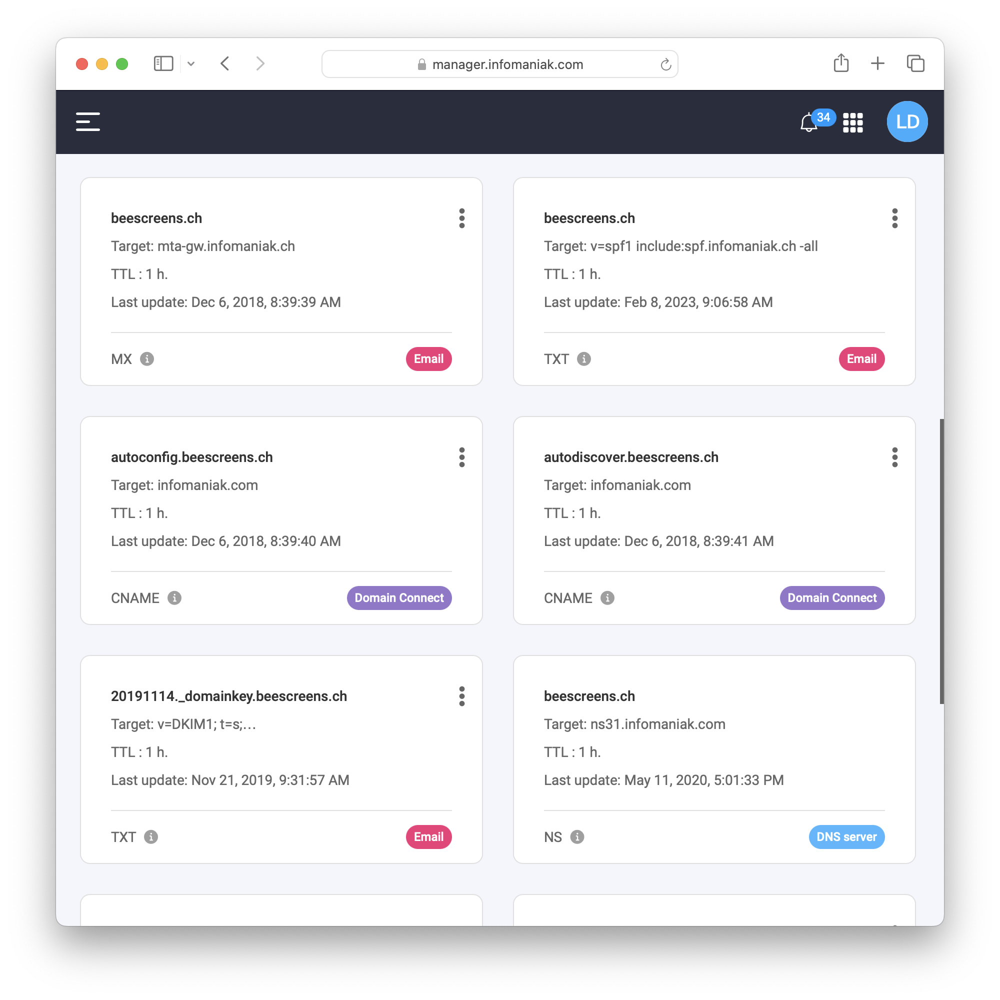
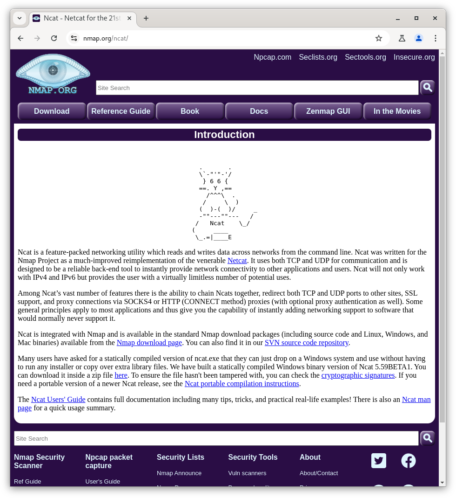

<!--
theme: gaia
size: 16:9
paginate: true
author: L. Delafontaine and H. Louis, with the help of GitHub Copilot
title: HEIG-VD DAI Course - SMTP and ncat
description: SMTP and ncat for the DAI course at HEIG-VD, Switzerland
url: https://heig-vd-dai-course.github.io/heig-vd-dai-course/15-smtp-and-ncat/
footer: '**HEIG-VD** - DAI Course 2024-2025 - CC BY-SA 4.0'
style: |
    :root {
        --color-background: #fff;
        --color-foreground: #333;
        --color-highlight: #f96;
        --color-dimmed: #888;
        --color-headings: #7d8ca3;
    }
    blockquote {
        font-style: italic;
    }
    table {
        width: 100%;
    }
    th:first-child {
        width: 15%;
    }
    h1, h2, h3, h4, h5, h6 {
        color: var(--color-headings);
    }
    h2, h3, h4, h5, h6 {
        font-size: 1.5rem;
    }
    h1 a:link, h2 a:link, h3 a:link, h4 a:link, h5 a:link, h6 a:link {
        text-decoration: none;
    }
    section:not([class=lead]) > p, blockquote {
        text-align: justify;
    }
headingDivider: 4
-->

[web]: https://heig-vd-dai-course.github.io/heig-vd-dai-course/15-smtp-and-ncat/
[pdf]:
  https://heig-vd-dai-course.github.io/heig-vd-dai-course/15-smtp-and-ncat/15-smtp-and-ncat-presentation.pdf
[license]:
  https://github.com/heig-vd-dai-course/heig-vd-dai-course/blob/main/LICENSE.md
[discussions]: https://github.com/orgs/heig-vd-dai-course/discussions/114
[illustration]:
  https://images.unsplash.com/photo-1526554850534-7c78330d5f90?fit=crop&h=720
[course-material]:
  https://github.com/heig-vd-dai-course/heig-vd-dai-course/blob/main/15-smtp-and-ncat/COURSE_MATERIAL.md
[course-material-qr-code]:
  https://quickchart.io/qr?format=png&ecLevel=Q&size=400&margin=1&text=https://github.com/heig-vd-dai-course/heig-vd-dai-course/blob/main/15-smtp-and-ncat/COURSE_MATERIAL.md

# SMTP and ncat

<!--
_class: lead
_paginate: false
-->

<https://github.com/heig-vd-dai-course>

[Web][web] · [PDF][pdf]

<small>L. Delafontaine and H. Louis, with the help of GitHub Copilot.</small>

<small>Based on the original course by O. Liechti and J. Ehrensberger.</small>

<small>This work is licensed under the [CC BY-SA 4.0][license] license.</small>

![bg opacity:0.1][illustration]

## Objectives

- Learn electronic messaging protocols:
  - SMTP
  - POP3
  - IMAP
- Focus on the SMTP protocol
- Learn how to use ncat and Java to send an email to an SMTP server

## Electronic messaging protocols: SMTP, POP3 and IMAP

<!-- _class: lead -->

More details for this section in the [course material][course-material]. You can
find other resources and alternatives as well.

### Electronic messaging protocols: SMTP, POP3 and IMAP

- Email clients are called **Mail User Agents (MUA)**
- Email servers are called **Mail Transfer Agents (MTA)**
- They use different protocols to communicate

### SMTP

- SMTP: Simple Mail Transfer Protocol
- Uses TCP port 25 (unencrypted) or 465 (encrypted)
- Used to send emails

### POP3

- POP3: Post Office Protocol
- Uses TCP port 110 (unencrypted) or 995 (encrypted)
- Used to retrieve emails from a server

### IMAP

- IMAP: Internet Message Access Protocol
- Uses TCP port 143 (unencrypted) or 993 (encrypted)
- Used to retrieve emails from a server
- Much more powerful than POP3 (synchronization, ...)

## DNS records related to email

<!-- _class: lead -->

More details for this section in the [course material][course-material]. You can
find other resources and alternatives as well.

### DNS records related to email

- `MX`: Mail eXchange - Specifies the mail server responsible for a domain name
- `TXT`: Store any text-based information. Used for `SPF` records, for email
  authentication

## Security concerns and spam

<!-- _class: lead -->

More details for this section in the [course material][course-material]. You can
find other resources and alternatives as well.

### Security concerns and spam

- SMTP is old and insecure
- Easy to spoof and forge emails
- Hard to maintain
- ➡️ Your email server can be used for spam and can be blocked
- ➡️ We will use a mock server to simulate an email server

## A focus on the SMTP protocol

<!-- _class: lead -->

More details for this section in the [course material][course-material]. You can
find other resources and alternatives as well.

### A focus on the SMTP protocol

- SMTP is a text-based protocol
- Messages are sent by the client to the server
- The server responds with a status code
- The client can send the next command

---

- `HELO` /`EHLO`
- `MAIL FROM`
- `RCPT TO`
- `DATA`
  - `Subject:`
  - `From:`
  - `To:`
  - End by `.`
- `QUIT`

## ncat

<!-- _class: lead -->

More details for this section in the [course material][course-material]. You can
find other resources and alternatives as well.

### ncat

- ncat is network utility for reading from and writing to network connections
- It is used to connect to a remote server (SMTP, HTTP, ...)
- We will use it to interact with a SMTP server

## Questions

<!-- _class: lead -->

Do you have any questions?

## Practical content

<!-- _class: lead -->

### What will you do?

- Install and configure ncat
- Start a SMTP server with Docker Compose
- Send an email with ncat to the SMTP server
- Send an email with Java to the SMTP server

### Find the practical content

<!-- _class: lead -->

You can find the practical content for this chapter on
[GitHub][course-material].

![bg right w:75%][course-material-qr-code]

## Finished? Was it easy? Was it hard?

Can you let us know what was easy and what was difficult for you during this
chapter?

This will help us to improve the course and adapt the content to your needs. If
we notice some difficulties, we will come back to you to help you.

➡️ [GitHub Discussions][discussions]

You can use reactions to express your opinion on a comment!

## What will you do next?

We are arriving at the end of the second part of the course.

An evaluation will be done to check your understanding of all the content seen
in this second part.

More details will be given in the next chapter.

## Sources

- Main illustration by [Joanna Kosinska](https://unsplash.com/@joannakosinska)
  on [Unsplash](https://unsplash.com/photos/uGcDWKN91Fs)
- Illustration by [Aline de Nadai](https://unsplash.com/@alinedenadai) on
  [Unsplash](https://unsplash.com/photos/j6brni7fpvs)
- Illustration by [Nik](https://unsplash.com/@helloimnik) on
  [Unsplash](https://unsplash.com/photos/brown-eggs-on-white-textile-LUYD2b7MNrg)
- Illustration by [MChe Lee](https://unsplash.com/@mclee) on
  [Unsplash](https://unsplash.com/photos/PC91Jm1DlWA)
