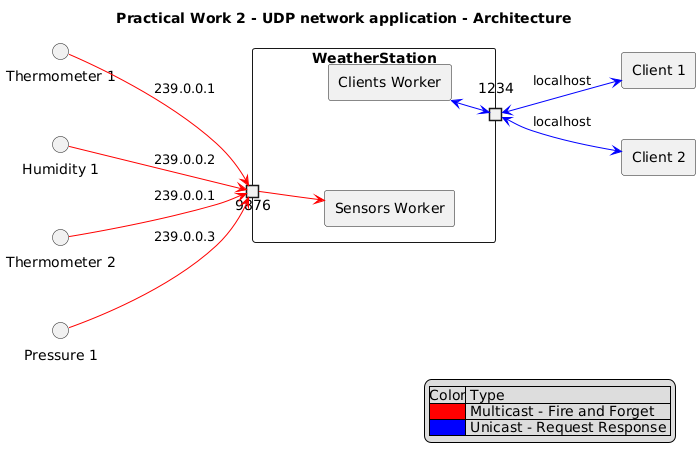

<!--
theme: gaia
size: 16:9
paginate: true
author: L. Delafontaine and H. Louis, with the help of GitHub Copilot
title: HEIG-VD DAI Course - Practical work 2
description: Practical work 2 for the DAI course at HEIG-VD, Switzerland
url: https://heig-vd-dai-course.github.io/heig-vd-dai-course/16-practical-work-2/
footer: '**HEIG-VD** - DAI Course 2024-2025 - CC BY-SA 4.0'
style: |
    :root {
        --color-background: #fff;
        --color-foreground: #333;
        --color-highlight: #f96;
        --color-dimmed: #888;
        --color-headings: #7d8ca3;
    }
    blockquote {
        font-style: italic;
    }
    table {
        width: 100%;
    }
    th:first-child {
        width: 15%;
    }
    h1, h2, h3, h4, h5, h6 {
        color: var(--color-headings);
    }
    h2, h3, h4, h5, h6 {
        font-size: 1.5rem;
    }
    h1 a:link, h2 a:link, h3 a:link, h4 a:link, h5 a:link, h6 a:link {
        text-decoration: none;
    }
    section:not([class=lead]) > p, blockquote {
        text-align: justify;
    }
headingDivider: 6
-->

[web]:
  https://heig-vd-dai-course.github.io/heig-vd-dai-course/16-practical-work-2/
[pdf]:
  https://heig-vd-dai-course.github.io/heig-vd-dai-course/16-practical-work-2/16-practical-work-2-presentation.pdf
[license]:
  https://github.com/heig-vd-dai-course/heig-vd-dai-course/blob/main/LICENSE.md
[discussions]: https://github.com/orgs/heig-vd-dai-course/discussions/117
[illustration]: ./images/main-illustration.jpg
[course-material]:
  https://github.com/heig-vd-dai-course/heig-vd-dai-course/blob/main/16-practical-work-2/COURSE_MATERIAL.md
[course-material-qr-code]:
  https://quickchart.io/qr?format=png&ecLevel=Q&size=400&margin=1&text=https://github.com/heig-vd-dai-course/heig-vd-dai-course/blob/main/16-practical-work-2/COURSE_MATERIAL.md

# Practical work 2

<!--
_class: lead
_paginate: false
-->

<https://github.com/heig-vd-dai-course>

[Web][web] · [PDF][pdf]

<small>L. Delafontaine and H. Louis, with the help of GitHub Copilot.</small>

<small>This work is licensed under the [CC BY-SA 4.0][license] license.</small>

![bg opacity:0.1][illustration]

## Objectives

- Define and implement a network application with TCP and/or UDP
- Package, publish and run a network application with Docker
- You can choose what the network application will do (you can be creative!)
  - a chat application, a chess game, a shopping list application, ...


## Demo 1

<!-- _class: lead -->

A simple file transfer application made with TCP


---

Compile the project:

```sh
./mvnw clean package
```

Run the CLI without any arguments:

```sh
java -jar target/practical-work-2-demo-1-1.0-SNAPSHOT.jar
```

```text
Missing required subcommand
Usage: DaiFileTransfer [COMMAND]
A simple file transfer application
Commands:
  server  Start a TCP server to serve files
  client  Start a client to download files from a server
```

---

Start the server:

```sh
java -jar target/practical-work-2-demo-1-1.0-SNAPSHOT.jar server -p 12345 -t 4
```

Start the client:

```sh
java -jar target/practical-work-2-demo-1-1.0-SNAPSHOT.jar client -p 12345
```

---

```text
  _____          _____   _____           _                  _
 |  __ \   /\   |_   _| |  __ \         | |                | |
 | |  | | /  \    | |   | |__) | __ ___ | |_ ___   ___ ___ | |
 | |  | |/ /\ \   | |   |  ___/ '__/ _ \| __/ _ \ / __/ _ \| |
 | |__| / ____ \ _| |_  | |   | | | (_) | || (_) | (_| (_) | |
 |_____/_/    \_\_____| |_|   |_|  \___/ \__\___/ \___\___/|_|

You are connected to server on port 12345 with IP address localhost.

Available commands:
LS - list available files on server
GET <file> - get file from server
QUIT - quit the client
>
```

---

List available files:

```text
> ls
Available files on server:
demo.txt
my-passwords-in-clear.txt
rzr-sc2.exe
```

Get one of the available files:

```text
> GET my-passwords-in-clear.txt
Downloading file from server...
File saved to my-passwords-in-clear.txt
```

---

Get a file that does not exist:

```text
> GET not-found.txt
The specified file was not found on the server.
```

Quit:

```text
> QUIT
Bye.
```

If a client tries to connect to the server when no thread is available, the
client has to wait to be served.

## Demo 2

<!-- _class: lead -->

A weather station application made with UDP


---



---

Compile the project:

```sh
./mvnw clean package
```

Run the CLI without any arguments:

```sh
java -jar target/practical-work-2-demo-2-1.0-SNAPSHOT.jar
```

---

```text
Missing required subcommand
Usage: practical-work-2-demo-2-1.0-SNAPSHOT.jar [-hV] [COMMAND]
DAI Weather Station
  -h, --help      Show this help message and exit.
  -V, --version   Print version information and exit.
Commands:
  thermometer-emitter      Emits temperature values.
  pressure-emitter         Emits pressure values.
  humidity-emitter         Emits humidity values.
  weather-station          Start an UDP multicast receiver.
  weather-client           Start an UDP weather client.
  list-network-interfaces  List all available network interfaces.
```

---

Start the weather station:

```sh
java -jar target/practical-work-2-demo-2-1.0-SNAPSHOT.jar weather-station \
  -i eth0 \
  --port 9876 \
  --server-port 1234
```

Output:

```text
Multicast receiver started (10.11.12.25:9876)
Unicast receiver started (10.11.12.25:1234)
```

---

Start the emitters:

```sh
java -jar target/practical-work-2-demo-2-1.0-SNAPSHOT.jar thermometer-emitter \
  --delay=0 \
  --frequency 10000 \
  -i eth0 \
  -p 9876

java -jar target/practical-work-2-demo-2-1.0-SNAPSHOT.jar pressure-emitter \
  --delay=0 \
  --frequency 10000 \
  -i eth0 \
  -p 9876
```

---

Output:

```text
Emitter of type thermometer started (10.11.12.25:9876).
Multicasting measure : 30.0 to 239.0.0.1:9876 on interface eth0
Multicasting measure : 23.0 to 239.0.0.1:9876 on interface eth0
Multicasting measure : 28.0 to 239.0.0.1:9876 on interface eth0
Multicasting measure : 19.0 to 239.0.0.1:9876 on interface eth0
Multicasting measure : 15.0 to 239.0.0.1:9876 on interface eth0
```

```text
Emitter of type pressure started (10.11.12.25:9876).
Multicasting measure : 982.0 to 239.0.0.2:9876 on interface eth0
Multicasting measure : 1027.0 to 239.0.0.2:9876 on interface eth0
Multicasting measure : 970.0 to 239.0.0.2:9876 on interface eth0
Multicasting measure : 996.0 to 239.0.0.2:9876 on interface eth0
Multicasting measure : 982.0 to 239.0.0.2:9876 on interface eth0
```

---

Start the weather client:

```sh
java -jar practical-work-2-demo-2-1.0-SNAPSHOT.jar weather-client
```

Output:

```text
Welcome to the weather client!
Please enter the measures you want to get
1. Temperature
2. Humidity
3. Pressure
4. Quit
>
```

You can then select the measures you want to get.

---

```text
> 1
List all measures (1) or only the average? (2)
> 1
----------------------------------------
Received measures: [30.0, 23.0, 28.0, 19.0, 15.0]
----------------------------------------
Please enter the measures you want to get
1. Temperature
2. Humidity
3. Pressure
4. Quit
>
```

The client will then display all the measures received from the weather station.

---

```text
> 3
List all measures (1) or only the average? (2)
> 2
----------------------------------------
Received average: 991.11
----------------------------------------
Please enter the measures you want to get
1. Temperature
2. Humidity
3. Pressure
4. Quit
> 4
```

The client can then quit the application.

## Group composition

<!-- _class: lead -->

More details for this section in the [course material][course-material].

### Group composition

- 2 or 3 students per group
- Create a GitHub Discussion to:
  - Announce your group members
  - Announce your idea (even a draft is fine)
- **Do it as soon as possible before next week!**
  - This helps us to plan the presentations


## Idea validation

<!-- _class: lead -->

More details for this section in the [course material][course-material].

### Idea validation

- You must state your idea on your GitHub Discussion
- We might ask you to change your idea if it is too simple or too complex
- We will help you to find a good idea if needed
- **Do it as soon as possible before next week!**


## Grading criteria

<!-- _class: lead -->

More details for this section in the [course material][course-material].

### Grading criteria

You can find all the grading criteria in the [course material][course-material]:

- 0 point - The work is insufficient
- 0.1 point - The work is done
- 0.2 point - The work is well done (without the need of being perfect)

Maximum grade: 25 points \* 0.2 + 1 = 6


## Constraints

<!-- _class: lead -->

More details for this section in the [course material][course-material].

### Constraints

- The application must be written in Java, compatible with Java 21
- The application must be built using Maven with the `maven-shade-plugin` plugin
- The application must use the picocli dependency
- You can only use the Java classes seen in the course
- Your application must be slightly more complex and slightly different than the
  examples presented during the course (we emphasize the word **slightly**, no
  need to shoot for the moon!)

## Tips

<!-- _class: lead -->

More details for this section in the [course material][course-material].

### Create diagrams

- You can use any tools you want to create your diagrams:
  - [PlantUML](https://plantuml.com/)
  - [draw.io](https://draw.io/)
  - Scans from paper diagrams
  - Any other tools you want

PDF, PNG, SVG, etc. are all accepted formats in your repository.


### Extract the command and parameters from the message

The Short Message Service (SMS) protocol presented in the
[_"Define an application protocol"_](https://github.com/heig-vd-dai-course/heig-vd-dai-course/tree/main/11-define-an-application-protocol)
chapter (accessible in the
[examples repository](https://github.com/heig-vd-dai-course/heig-vd-dai-course-code-examples)
repository) defines the following message:

```text
RECEIVE <message> <username>
```

This message is sent by the server to a client to inform them that they have
received a message from another user.

---

The command is `RECEIVE` and the parameters are `<message>` and `<username>`.

The message can be up to 100 characters long.

You can use the following snippet of code to extract the command and the
parameters from the message:

---

```java
List<String> messageParts = Arrays.asList(emitterMessage.split(" ", 2));

String command = messageParts.get(0);
switch (command) {
  // Other cases can be defined here...
  case "RECEIVE" -> {
    if (messageParts.size() < 2) {
      // Invalid message, do something about it such as logging it or returning an error...
    }

    List<String> parameters = Arrays.asList(messageParts.get(1).split(" "));

    if (parameters.size() < 2) {
      // Invalid message, do something about it such as logging it or returning an error...
    }

    String user = parameters.removeLast();
    String message = String.join(" ", parameters);

    System.out.printf("Message from %s: %s\n", user, message);
  }
  // Other cases can be defined here...
}
```

### The POSIX standard

> The Portable Operating System Interface (POSIX) standard is a family of
> standards specified by the IEEE Computer Society for maintaining compatibility
> between operating systems. POSIX defines both the system and user-level
> application programming interfaces (APIs), along with command line shells and
> utility interfaces, for software compatibility (portability) with variants of
> Unix and other operating systems.
>
> <https://en.wikipedia.org/wiki/POSIX>

## Submission

<!-- _class: lead -->

More details for this section in the [course material][course-material].

### Submission

Your work is due as follow:

- DAI-TIC-C (Friday mornings): **05.12.2024 23:59**
- DAI-TIC-B (Monday mornings): **08.12.2024 23:59**

Update the GitHub Discussion with the link to your repository as mentioned in
the course material.

**If you do not submit your work on time and/or correctly, you will be penalized
(-1 point on the final grade for each day of delay).**

## Presentations

<!-- _class: lead -->

More details for this section in the [course material][course-material].

### Presentations

The practical work presentations will take place in **B38** on:

- DAI-TIC-C (Friday mornings): **06.12.2024**
- DAI-TIC-B (Monday mornings): **09.12.2024**

We only have **10 minutes per group**. You decide what you want to show us and
how you want to present it. **Come 5 minutes before your time slot** with your
computer. You will have access to a beamer.

**Please state your group on GitHub Discussions before next week.**

## Grades and feedback

Grades will be entered into GAPS, followed by an email with the feedback.

The evaluation will use exactly the same grading grid as shown in the course
material.

Each criterion will be accompanied by a comment explaining the points obtained,
a general comment on your work and the final grade.

If you have any questions about the evaluation, you can contact us!

## Questions

<!-- _class: lead -->

Do you have any questions?

## Find the practical work

<!-- _class: lead -->

You can find the practical work for this part on [GitHub][course-material].

[![bg right w:75%][course-material-qr-code]][course-material]

## Finished? Was it easy? Was it hard?

Can you let us know what was easy and what was difficult for you during this
practical work?

This will help us to improve the course and adapt the content to your needs. If
we notice some difficulties, we will come back to you to help you.

➡️ [GitHub Discussions][discussions]

You can use reactions to express your opinion on a comment!

## Sources

- Main illustrations by [Rafael Rex Felisilda](https://unsplash.com/@rafaelrex)
  on
  [Unsplash](https://unsplash.com/photos/chess-pieces-on-chess-board-rCxTJlaU5Yc)
  and [Jorge Ramirez](https://unsplash.com/@jorgedevs) on
  [Unsplash](https://unsplash.com/photos/a-cell-phone-tower-in-a-park-with-a-lake-in-the-background-0vmMg1r7FRU)
- Illustration by [Aline de Nadai](https://unsplash.com/@alinedenadai) on
  [Unsplash](https://unsplash.com/photos/j6brni7fpvs)
- Illustration by [Josh Calabrese](https://unsplash.com/@joshcala) on
  [Unsplash](https://unsplash.com/photos/five-men-riding-row-boat-Ev1XqeVL2wI)
- Illustration by [Nicole Baster](https://unsplash.com/@nicolebaster) on
  [Unsplash](https://unsplash.com/photos/traffic-light-aGx-CFsM3fE)
- Illustration by [Chris LaBarge](https://unsplash.com/@chrislabarge) on
  [Unsplash](https://unsplash.com/photos/a-sign-that-is-on-a-tree-in-the-woods-dy1GA9Ow6JA)
