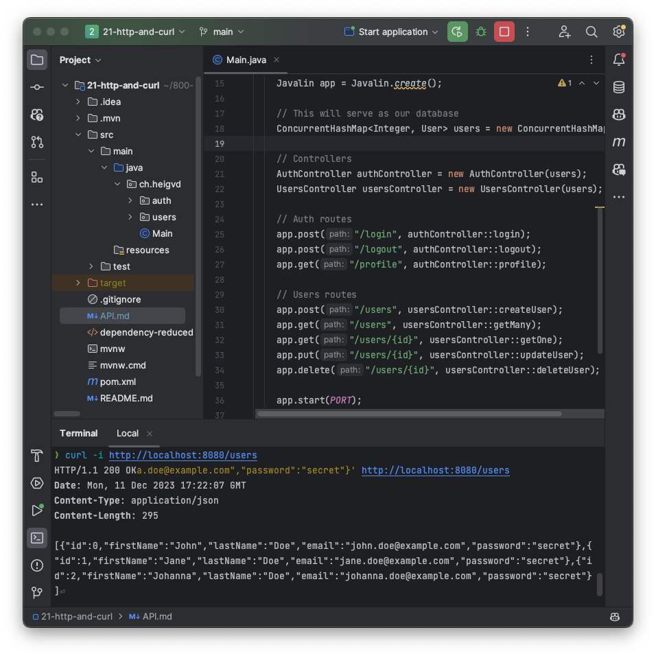

<!--
theme: gaia
size: 16:9
paginate: true
author: L. Delafontaine and H. Louis, with the help of ChatGPT
title: HEIG-VD DAI Course - HTTP and curl
description: HTTP and curl for the DAI course at HEIG-VD, Switzerland
url: https://heig-vd-dai-course.github.io/heig-vd-dai-course/21-http-and-curl/
footer: '**HEIG-VD** - DAI Course 2023-2024 - CC BY-SA 4.0'
style: |
    :root {
        --color-background: #fff;
        --color-foreground: #333;
        --color-highlight: #f96;
        --color-dimmed: #888;
        --color-headings: #7d8ca3;
    }
    blockquote {
        font-style: italic;
    }
    table {
        width: 100%;
    }
    th:first-child {
        width: 15%;
    }
    h1, h2, h3, h4, h5, h6 {
        color: var(--color-headings);
    }
    h2, h3, h4, h5, h6 {
        font-size: 1.5rem;
    }
    h1 a:link, h2 a:link, h3 a:link, h4 a:link, h5 a:link, h6 a:link {
        text-decoration: none;
    }
    section:not([class=lead]) > p, blockquote {
        text-align: justify;
    }
headingDivider: 4
-->

[web]: https://heig-vd-dai-course.github.io/heig-vd-dai-course/21-http-and-curl/
[pdf]:
  https://heig-vd-dai-course.github.io/heig-vd-dai-course/21-http-and-curl/21-http-and-curl-presentation.pdf
[license]:
  https://github.com/heig-vd-dai-course/heig-vd-dai-course/blob/main/LICENSE.md
[discussions]: https://github.com/orgs/heig-vd-dai-course/discussions/121
[illustration]:
  https://images.unsplash.com/photo-1446770145316-10a05382c470?fit=crop&h=720
[course-material]:
  https://github.com/heig-vd-dai-course/heig-vd-dai-course/blob/main/21-http-and-curl/COURSE_MATERIAL.md
[course-material-qr-code]:
  https://quickchart.io/qr?format=png&ecLevel=Q&size=400&margin=1&text=https://github.com/heig-vd-dai-course/heig-vd-dai-course/blob/main/21-http-and-curl/COURSE_MATERIAL.md

# HTTP and curl

<!--
_class: lead
_paginate: false
-->

<https://github.com/heig-vd-dai-course>

[Web][web] · [PDF][pdf]

<small>L. Delafontaine and H. Louis, with the help of ChatGPT.</small>

<small>Based on the original course by O. Liechti and J. Ehrensberger.</small>

<small>This work is licensed under the [CC BY-SA 4.0][license] license.</small>

![bg opacity:0.1][illustration]

## Objectives

TODO

## Disclaimer

<!-- _class: lead -->

More details for this section in the
[course material](TODO).
You can find other resources and alternatives as well.

### Disclaimer

TODO

## Prepare and setup your environment

<!-- _class: lead -->

More details for this section in the
[course material](TODO).
You can find other resources and alternatives as well.

### curl

TODO

### Javalin

TODO

## HTTP

<!-- _class: lead -->

More details for this section in the
[course material](TODO).
You can find other resources and alternatives as well.

### HTTP

TODO

### HTTP versions

TODO

### HTTP resources

TODO

### URL encoding

TODO

### HTTP request methods

TODO

### HTTP request and response format

TODO

### HTTP response status codes

TODO

### HTTP path parameters, query parameters and headers

TODO

### HTTP headers

TODO

### HTTP content negotiation

TODO

### HTTP sessions (stateless vs. stateful)

TODO

## APIs design

<!-- _class: lead -->

More details for this section in the
[course material](TODO).
You can find other resources and alternatives as well.

### APIs design

TODO

### Simple APIs with CRUD operations

TODO

### REST APIs

TODO

### How to document an API

TODO

### How to secure an API

TODO

## Practical content

<!-- _class: lead -->

### What will you do?

-

### Find the practical content

<!-- _class: lead -->

You can find the practical content for this chapter on
[GitHub][course-material].

[![bg right w:75%][course-material-qr-code]][course-material]

## Finished? Was it easy? Was it hard?

Can you let us know what was easy and what was difficult for you during this
chapter?

This will help us to improve the course and adapt the content to your needs. If
we notice some difficulties, we will come back to you to help you.

➡️ [GitHub Discussions][discussions]

You can use reactions to express your opinion on a comment!

## What will you do next?

In the next chapter, you will learn the following topics:

- Web infrastructures
  - How to run and maintain web applications on the Internet?
  - How to scale web applications?
  - How to secure web applications?

## Sources

- Main illustration by [Ashley Knedler](https://unsplash.com/@ashkned) on
  [Unsplash](https://unsplash.com/photos/KvD36NRFjl4)
- Illustration by [Aline de Nadai](https://unsplash.com/@alinedenadai) on
  [Unsplash](https://unsplash.com/photos/j6brni7fpvs)
- Illustration by [Nicolas Picard](https://unsplash.com/@artnok) on
  [Unsplash](https://unsplash.com/photos/-lp8sTmF9HA)
