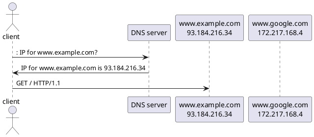
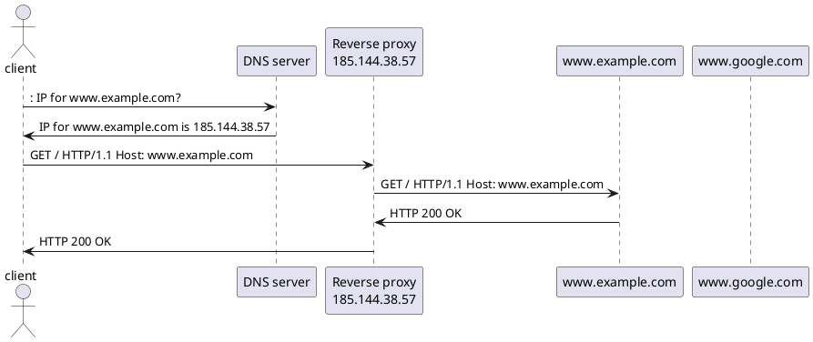

[markdown]:
  https://github.com/heig-vd-dai-course/heig-vd-dai-course/blob/main/22-web-infrastructures/COURSE_MATERIAL.md
[pdf]:
  https://heig-vd-dai-course.github.io/heig-vd-dai-course/22-web-infrastructures/22-web-infrastructures-practical-work.pdf
[license]:
  https://github.com/heig-vd-dai-course/heig-vd-dai-course/blob/main/LICENSE.md
[discussions]: https://github.com/orgs/heig-vd-dai-course/discussions/122
[illustration]:
  https://images.unsplash.com/photo-1492515114975-b062d1a270ae?fit=crop&h=720

# Web infrastructures - Course material

<https://github.com/heig-vd-dai-course>

[Markdown][markdown] · [PDF][pdf]

L. Delafontaine and H. Louis, with the help of Copilot.

Based on the original course by O. Liechti and J. Ehrensberger.

This work is licensed under the [CC BY-SA 4.0][license] license.

![Main illustration][illustration]

## Table of contents

- [Table of contents](#table-of-contents)
- [Objectives](#objectives)
- [Prepare and setup your environment](#prepare-and-setup-your-environment)
  - [Access your `hosts` file](#access-your-hosts-file)
  - [Traefik](#traefik)
  - [whoami](#whoami)
- [Definition](#definition)
- [The `Host` header](#the-host-header)
- [Reverse-proxy](#reverse-proxy)
- [System scalability](#system-scalability)
  - [Vertical scaling](#vertical-scaling)
  - [Horizontal scaling](#horizontal-scaling)
  - [When to use scale up or scale out?](#when-to-use-scale-up-or-scale-out)
  - [How to monitor your system?](#how-to-monitor-your-system)
  - [Calculate the number of servers needed](#calculate-the-number-of-servers-needed)
- [Load balancing](#load-balancing)
- [Caching](#caching)
  - [Client-side caching](#client-side-caching)
  - [Server-side caching](#server-side-caching)
  - [CDN](#cdn)
  - [Expiration and validation](#expiration-and-validation)
  - [Where to cache?](#where-to-cache)
- [Uptime and availability](#uptime-and-availability)
  - [Go further](#go-further)
- [Conclusion](#conclusion)
  - [What did you do and learn?](#what-did-you-do-and-learn)
  - [Test your knowledge](#test-your-knowledge)
- [Finished? Was it easy? Was it hard?](#finished-was-it-easy-was-it-hard)
- [What will you do next?](#what-will-you-do-next)
- [Additional resources](#additional-resources)
- [Sources](#sources)

## Objectives

- TODO

## Prepare and setup your environment

### Access your `hosts` file

In this section, you will need to access your `hosts` file.

The host file is a computer file used by an operating system to map hostnames to
IP addresses. The hosts file is a plain text file and is conventionally named
`hosts`. The hosts file can be used as an alternative to (or in conjunction
with) DNS.

On Unix-like operating systems (Linux and macOS), the hosts file is located at
`/etc/hosts`.

On Windows, the hosts file is located at
`%SystemRoot%\system32\drivers\etc\hosts`.

Ensure you can access your `hosts` file and edit it for the next steps.

### Traefik

In this section, you will install and configure
[Traefik](https://traefik.io/traefik/) using its official Docker image available
on Docker Hub: <https://hub.docker.com/_/traefik>.

Traefik is an open-source Edge Router that makes exposing/publishing your
services on the Internet a fun and easy experience. It receives requests on
behalf of your system and finds out which components are responsible for
handling them.

Traefik is full of features and can be used as a reverse proxy, a load balancer,
a Kubernetes ingress controller, and much more.

We will go into more details about Traefik in the next sections.

Run the `traefik-insecure` example from the
[`heig-vd-dai-course/heig-vd-dai-course-code-examples`](https://github.com/heig-vd-dai-course/heig-vd-dai-course-code-examples)
repository. Read the README carefully. Take some time to explore the code, it
should contain comments to help you understand what is going on.

You should be able to access the Traefik dashboard at <http://localhost:8080>
and <http://traefik.localhost>.

#### Alternatives

_Alternatives are here for general knowledge. No need to learn them._

- [Caddy](https://caddyserver.com/)
- [Nginx](https://www.nginx.com/)
- [Apache](https://httpd.apache.org/)
- [HAProxy](https://www.haproxy.org/)

_Missing item in the list? Feel free to open a pull request to add it! ✨_

### whoami

[whoami](https://github.com/traefik/whoami) is a tiny Go webserver that prints
os information and HTTP request to output.

whoami is used to test various features of Traefik/HTTP.

In the next sections, you will use whoami to test Traefik/HTTP features using
its official Docker image available on Docker Hub:
<https://hub.docker.com/r/traefik/whoami>.

#### Alternatives

_Alternatives are here for general knowledge. No need to learn them._

- _None yet_

_Missing item in the list? Feel free to open a pull request to add it! ✨_

## Definition

Web infrastructures are the software and hardware resources that are used to
support the deployment of web applications, web services, and websites on the
Internet.

Web infrastructures are composed of several components:

- **Web server**: a computer that runs web server software and responds to
  requests from a web client (e.g. a web browser, a mobile application, a
  command line tool, etc.)
- **Reverse proxy**: a proxy server that retrieves resources on behalf of a
  client from one or more servers. These resources are then returned to the
  client as though they originated from the proxy server itself.
- **Load balancer**: a device that acts as a reverse proxy and distributes
  network or application traffic across a number of servers.
- **Cache**: a component that stores data so future requests for that data can
  be served faster.
- **Content delivery network (CDN)**: a geographically distributed network of
  proxy servers and their data centers.

In this chapter, we will explore a few of these components and how they can be
used to build a web infrastructure.

## The `Host` header

Thanks to the HTTP protocol, web infrastructures can be built easily. HTTP
offers many features that can be used to build a web infrastructure.

One of the feature HTTP offers is the `Host` header.

The `Host` header is a header which specifies the domain name of the server. It
is a header sent by the client.

Using this header, a server can handle multiple domains on the same IP address
with the help of a reverse proxy.

Before the `Host` header, a server could only handle one domain per IP address.
The following diagram shows how it worked:



The following PlantUML diagram shows how the `Host` header works:



The reverse proxy receives the request from the client and forwards it to the
web server. The web server receives the request and sends a response to the
reverse proxy. The reverse proxy receives the response and forwards it to the
client.

## Reverse-proxy

As described in the previous diagram, a reverse proxy is a proxy server that
retrieves resources on behalf of a client from one or more servers. These
resources are then returned to the client as though they originated from the
proxy server itself.

A reverse proxy is a component that sits in front of one or more servers. It
receives requests from clients and forwards them to the servers. It also
receives responses from the servers and forwards them to the clients.

A reverse proxy can be used to:

- **Load balance** requests between multiple servers
- **Cache** responses from servers
- **Encrypt** and **decrypt** traffic between clients and servers
- **Protect** servers from attacks (e.g. DDoS, SQL injection, etc.)
- **Serve static content** (e.g. images, videos, etc.)
- **Serve multiple domains** on the same IP address
- etc.

A reverse proxy is a very powerful component that can be used to build a web
infrastructure.

Run the `whoami-with-traefik-pathprefix-rule` example from the
[`heig-vd-dai-course/heig-vd-dai-course-code-examples`](https://github.com/heig-vd-dai-course/heig-vd-dai-course-code-examples)
repository. Read the README carefully. Take some time to explore the code, it
should contain comments to help you understand what is going on.

You should be able to access whoami at <http://localhost/whoami>.

The output should be similar to the following:

```text
Hostname: 629ffa2f25bd
IP: 127.0.0.1
IP: 172.26.0.3
RemoteAddr: 172.26.0.2:40742
GET /whoami HTTP/1.1
Host: localhost
User-Agent: Mozilla/5.0 (Macintosh; Intel Mac OS X 10.15; rv:120.0) Gecko/20100101 Firefox/120.0
Accept: text/html,application/xhtml+xml,application/xml;q=0.9,image/avif,image/webp,*/*;q=0.8
Accept-Encoding: gzip, deflate, br
Accept-Language: en-GB,en;q=0.5
Sec-Fetch-Dest: document
Sec-Fetch-Mode: navigate
Sec-Fetch-Site: none
Sec-Fetch-User: ?1
Upgrade-Insecure-Requests: 1
X-Forwarded-For: 192.168.65.1
X-Forwarded-Host: localhost
X-Forwarded-Port: 80
X-Forwarded-Proto: http
X-Forwarded-Server: 880dafe26d2a
X-Real-Ip: 192.168.65.1
```

Note the following headers:

- `Hostname`: the domain name of the whoami container
- `IP`: the IP addresses of the whoami container
- `GET /whoami HTTP/1.1`: the HTTP request from the client
- `Host: localhost`: the domain name requested by the client
- `X-Forwarded-For`: the IP address of the client
- `X-Forwarded-Host`: the domain name of the client
- `X-Forwarded-Port`: the port of the client
- `X-Forwarded-Proto`: the protocol of the client
- `X-Forwarded-Server`: the hostname of the reverse proxy container

Using both the `Host` header, the HTTP request and the `X-Forwarded-*` headers,
the reverse proxy can forward the request to the correct server (whoami
container).

The request from the client has been forwarded to the reverse proxy. The reverse
proxy has forwarded the request to the whoami container. The whoami container
has sent a response to the reverse proxy. The reverse proxy has forwarded the
response to the client.

Now, run the `whoami-with-traefik-host-rule` example from the
[`heig-vd-dai-course/heig-vd-dai-course-code-examples`](https://github.com/heig-vd-dai-course/heig-vd-dai-course-code-examples)
repository. Read the README carefully. Take some time to explore the code, it
should contain comments to help you understand what is going on.

You should be able to access whoami at <http://whoami.localhost>.

Same as before, but this time, the reverse proxy has mapped the
`whoami.localhost` domain to the whoami container.

Now, run the `whoami-with-traefik-host-and-pathprefix-rules` example from the
[`heig-vd-dai-course/heig-vd-dai-course-code-examples`](https://github.com/heig-vd-dai-course/heig-vd-dai-course-code-examples)
repository. Read the README carefully. Take some time to explore the code, it
should contain comments to help you understand what is going on.

You should be able to access whoami at <http://whoami.localhost/whoami>.

Same as before, but this time, the reverse proxy has mapped the
`whoami.localhost` domain and the `/whoami` path to the whoami container.

Now, run the `whoami-with-traefik-pathprefix-rule-and-stripper-middleware`
example from the
[`heig-vd-dai-course/heig-vd-dai-course-code-examples`](https://github.com/heig-vd-dai-course/heig-vd-dai-course-code-examples)
repository. Read the README carefully. Take some time to explore the code, it
should contain comments to help you understand what is going on.

You should be able to access whoami at
<http://localhost/whoami-without-stripprefix> and
<http://localhost/whoami-with-stripprefix>.

The output of <http://localhost/whoami-without-stripprefix> should be similar to
the following:

```text
Hostname: 25eeca6ff2bb
IP: 127.0.0.1
IP: 172.26.0.5
RemoteAddr: 172.26.0.2:55338
GET /whoami-without-stripprefix HTTP/1.1
Host: localhost
User-Agent: Mozilla/5.0 (Macintosh; Intel Mac OS X 10.15; rv:120.0) Gecko/20100101 Firefox/120.0
Accept: text/html,application/xhtml+xml,application/xml;q=0.9,image/avif,image/webp,*/*;q=0.8
Accept-Encoding: gzip, deflate, br
Accept-Language: en-GB,en;q=0.5
Sec-Fetch-Dest: document
Sec-Fetch-Mode: navigate
Sec-Fetch-Site: none
Sec-Fetch-User: ?1
Upgrade-Insecure-Requests: 1
X-Forwarded-For: 192.168.65.1
X-Forwarded-Host: localhost
X-Forwarded-Port: 80
X-Forwarded-Proto: http
X-Forwarded-Server: 880dafe26d2a
X-Real-Ip: 192.168.65.1
```

The output of <http://localhost/whoami-with-stripprefix> should be similar to
the following:

```text
Hostname: 27cf1df3b435
IP: 127.0.0.1
IP: 172.26.0.4
RemoteAddr: 172.26.0.2:33656
GET / HTTP/1.1
Host: localhost
User-Agent: Mozilla/5.0 (Macintosh; Intel Mac OS X 10.15; rv:120.0) Gecko/20100101 Firefox/120.0
Accept: text/html,application/xhtml+xml,application/xml;q=0.9,image/avif,image/webp,*/*;q=0.8
Accept-Encoding: gzip, deflate, br
Accept-Language: en-GB,en;q=0.5
Sec-Fetch-Dest: document
Sec-Fetch-Mode: navigate
Sec-Fetch-Site: none
Sec-Fetch-User: ?1
Upgrade-Insecure-Requests: 1
X-Forwarded-For: 192.168.65.1
X-Forwarded-Host: localhost
X-Forwarded-Port: 80
X-Forwarded-Prefix: /whoami-with-stripprefix
X-Forwarded-Proto: http
X-Forwarded-Server: 880dafe26d2a
X-Real-Ip: 192.168.65.1
```

You should notice the following differences:

- `GET /whoami-without-stripprefix HTTP/1.1`: the HTTP request from the client
- `GET / HTTP/1.1`: the HTTP request from the client

The reverse proxy has stripped the `/whoami-with-stripprefix` path from the
request before forwarding it to the whoami container. The whoami container has
received the request without the `/whoami-with-stripprefix` path as if it was
the root path, thanks to the `stripprefix` middleware.

This configuration can be useful in some contexts (e.g. when you want to serve
static content from a subdirectory).

Thanks to these capabilities, a reverse proxy can be used to build a web
infrastructure that can serve multiple domains on the same IP address and that
can scale.

## System scalability

System scalability is the capability of a system to handle a growing amount of
work, or its potential to be enlarged to accommodate that growth.

In web infrastructures, scalability is the capability of a system to handle a
growing amount of requests that are sent by clients to one or more servers.

There are two types of scalability:

- **Vertical scaling**: adding more resources (CPU/RAM/Disk) to an existing
  server. This is also called **scaling up**.
- **Horizontal scaling**: adding more servers to an existing system. This is
  also called **scaling out**.

Some variations of these two main types of scalability exist, such as elastic
scaling (adding or removing resources (CPU/RAM/Disk) on the fly). However, we
will not cover them in this course.

Both vertical and horizontal scaling are used to improve the performance of a
system to handle more requests (e.g. a lot of users on your website).

### Vertical scaling

Vertical scaling is limited by the capacity of the hardware: at a certain point,
you cannot add more resources to a server.

I (Ludovic) recommend to use vertical scaling as much as possible before
switching to horizontal scaling. Adding new resources to a server is (usually)
easy and fast. Horizontal scaling is (much) more complex to setup and maintain
and can introduce new issues (e.g. network latency, data consistency, etc.). It
is also more expensive (usually).

### Horizontal scaling

Horizontal scaling is limited by the capacity of the software.

Instead of adding more resources to your server, you add more (smaller) servers
to your system.

Your software must be able to scale horizontally as well (multiple backends/API
accessing to one or more databases at the same time, multiple frontends
accessing the same backends, etc.), and it is not always possible.

### When to use scale up or scale out?

Scaling must be determined by the needs of your system. In order to determine
the best scaling strategy, you must know the bottlenecks of your system.
Bottlenecks can only be identified by load testing your system and monitoring it
to get metrics.

There are a few metrics that can help you to determine the bottlenecks of your
system:

- CPU usage
- Memory usage
- Disk usage
- Network usage
- Number of requests per second
- Response time
- Availability
- etc.

**Only from metrics, you can determine the bottlenecks of your system.**

Once you know the bottlenecks of your system, you can determine the best scaling
strategy.

### How to monitor your system?

There are a lot of tools to monitor your system. Here are a few examples:

- [Prometheus](https://prometheus.io/)
- [Grafana](https://grafana.com/)
- [Sentry](https://sentry.io/)
- [LibreNMS](https://www.librenms.org/)

Monitoring your system is a complex task and is out of the scope of this course.
You will learn more about monitoring in future courses.

### Calculate the number of servers needed

In order to calculate the number of servers needed to handle a certain amount of
requests, you can use the following formula:

```text
number_of_servers_needed = (number_of_requests_per_second * average_response_time) / (number_of_cores * requests_per_second_per_core)
```

For example, if you have a system that receives 100 requests per second and that
each request takes 100ms to be processed, and you have a server with 4 cores
that can handle 100 requests per second per core, you will need 1 server to
handle the 100 requests per second.

```text
number_of_servers_needed = (100 * 0.1) / (4 * 100)
number_of_servers_needed = 0.25
```

This is called **capacity planning** and uses the
[Little's law](https://en.wikipedia.org/wiki/Little%27s_law).

## Load balancing

Load balancing is the process of distributing a set of tasks over a set of
resources (computing units), with the aim of making their overall processing
more efficient.

Thanks to the reverse proxy and the `Host` header, a load balancer can be used
to distribute requests between multiple servers to achieve horizontal scaling.

In order to distribute requests between multiple servers, a load balancer must
know the servers it can forward requests to. This is called a **pool** of
servers.

A load balancer can distribute requests between multiple servers using different
strategies:

- **Round-robin**: the load balancer forwards requests to each server in the
  pool in turn.
- **Least connections**: the load balancer forwards requests to the server with
  the least number of active connections.
- **Least response time**: the load balancer forwards requests to the server
- **Hashing**: the load balancer forwards requests to the server based on a hash
  of the request (e.g. the IP address of the client, the URL of the request,
  etc.)

Run the `whoami-with-traefik-host-rule-and-sticky-sessions` example from the
[`heig-vd-dai-course/heig-vd-dai-course-code-examples`](https://github.com/heig-vd-dai-course/heig-vd-dai-course-code-examples)
repository. Read the README carefully. Take some time to explore the code, it
should contain comments to help you understand what is going on.

You should be able to access the whoami instances at <http://whoami1.localhost>
and <http://whoami2.localhost>.

Notice that the `Hostname` and `IP` values are different for each instance.

In the first example, the load balancer uses the round-robin strategy to
distribute requests between the three whoami instances.

In the second example, the load balancer uses the sticky-session strategy to
always forward requests from the same client to the same whoami instance.

The sticky-session strategy is useful when you want to keep the state of a
client on the same server: if a client is making an order on your website, you
want to keep the state of the order on the same server to avoid issues.

## Caching

Caching is the process of storing data in a cache. A cache is a temporary
storage component area where data is stored so that future requests for that
data can be served faster.

Caching can be done on the client-side or on the server-side.

There are many HTTP headers that can be used to control caching:

- `Cache-Control`: specifies directives for caching mechanisms in both requests
  and responses.
- `Expires`: gives the date/time after which the response is considered stale.
- `Last-Modified`: indicates the date and time at which the origin server
  believes the resource was last modified.
- `ETag`: provides the current entity tag for the selected representation.
- `If-Modified-Since`: allows a 304 Not Modified to be returned if content is
  unchanged.
- `If-None-Match`: allows a 304 Not Modified to be returned if content is
  unchanged.

### Client-side caching

Once a client has received a response from a server, it can store the response
in a cache. The next time the client needs the same resource, it can use the
cached response instead of sending a new request to the server.

The client can use the `Cache-Control` header to specify how long the response
can be cached.

### Server-side caching

A server can cache responses from other servers. This is called a **reverse
proxy cache**.

A reverse proxy cache can be used to serve static content (e.g. images, videos,
etc.) or to cache responses from servers to improve the performance of the
system.

A reverse proxy cache can use the `Cache-Control` header to specify how long the
response can be cached.

### CDN

Content delivery networks (CDNs) are a type of cache that can be used to serve
static content (e.g. images, videos, etc.) to clients.

A CDN is a geographically distributed network of proxy servers and their data
centers.

A CDN can be used to improve the performance of a system by serving static
content to clients from the closest server.

### Expiration and validation

Expiration and validation are two mechanisms that can be used to control
caching.

Expiration is the process of specifying how long a response can be cached.

Validation is the process of checking if a cached response is still valid.

### Where to cache?

Caching can be done on the client-side, on the server-side, or on a CDN.

The best would be to cache on all three sides to ensure the best performance but
it is not always possible or faisable.

## Uptime and availability

Uptime is the amount of time a system is available and operational.

Availability is the probability that a system will work as expected at a given
point in time.

A system can be unavailable for many reasons:

- Hardware failure
- Software failure
- Network failure
- Human error
- etc.

A system can be unavailable for a short period of time (e.g. a few seconds) or
for a long period of time (e.g. a few hours).

To calculate the availability of a system, you can use the following formula:

```text
availability = uptime / (uptime + downtime)
```

For example, if a system was down for 25 minutes in a year, the availability of
the system would be:

```text
availability = 525600 / (525600 + 25)
availability = 525600 / 525625
availability = 0.999952
```

The availability of the system would be 99.9952%.

Some companies offer a Service Level Agreement (SLA) to their customers. An SLA
is a commitment between a service provider and a client. The SLA specifies the
level of service expected from the service provider.

The most common downtimes allowed in an SLA are:

- 99.9% (8.76 hours per year)
- 99.99% (52.56 minutes per year)
- 99.999% (5.26 minutes per year)
- 99.9999% (31.5 seconds per year)

For example, a company can offer an SLA of 99.9% availability. This means that
the company guarantees that the system will be unavailable for the following
maximum number of minutes per year:

```text
downtime = 525600 * (1 - 0.999)
downtime = 525600 * 0.001
downtime = 525.6
```

### Go further

This is an optional section. Feel free to skip it if you do not have time.

- Are you able to add a basic authentication to the Traefik dashboard using a
  middleware?

## Conclusion

### What did you do and learn?

In this chapter, you have learned about how to build a web infrastructure using
a reverse proxy and a load balancer.

Thanks to the following features of HTTP, you were able to make use of them to
build a web infrastructure to serve multiple domains on the same IP address and
to scale:

- **Statelessness**: HTTP servers don’t have to store information about the
  state of a client: the client has to send all the information with each
  request (a cookie session for example) so the server can find the context to
  handle the request.
- **Scalability**: Several identical servers can handle requests without
  coordination: the client can send a request to any server, and the server can
  handle the request
- **Reliability**: After a server failure, another server can easily take over
  the work

### Test your knowledge

At this point, you should be able to answer the following questions:

- What is a reverse proxy? What is a load balancer? How do they differ?
- What is the `Host` header? How can it be used to serve multiple domains on the
  same IP address?
- What is the difference between vertical and horizontal scaling?
- What is the difference between a CDN and a reverse proxy cache?
- What is the difference between expiration and validation?

## Finished? Was it easy? Was it hard?

Can you let us know what was easy and what was difficult for you during this
chapter?

This will help us to improve the course and adapt the content to your needs. If
we notice some difficulties, we will come back to you to help you.

➡️ [GitHub Discussions][discussions]

You can use reactions to express your opinion on a comment!

## What will you do next?

You will start the practical work!

## Additional resources

_Resources are here to help you. They are not mandatory to read._

- _None yet_

_Missing item in the list? Feel free to open a pull request to add it! ✨_

## Sources

- Main illustration by [Nicolas Picard](https://unsplash.com/@artnok) on
  [Unsplash](https://unsplash.com/photos/-lp8sTmF9HA)
