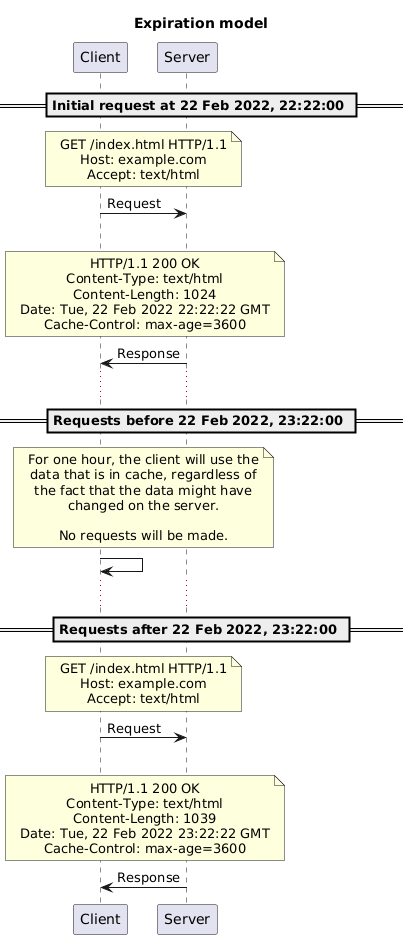
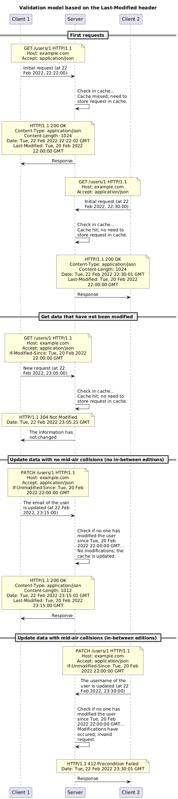
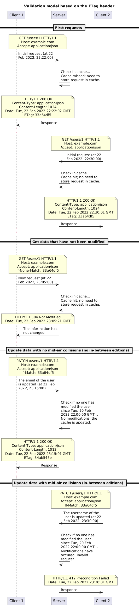
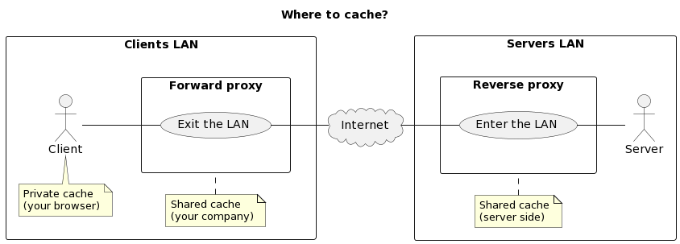

[markdown]:
  https://github.com/heig-vd-dai-course/heig-vd-dai-course/blob/main/23-caching-and-performance/COURSE_MATERIAL.md
[pdf]:
  https://heig-vd-dai-course.github.io/heig-vd-dai-course/23-caching-and-performance/23-caching-and-performance-practical-work.pdf
[license]:
  https://github.com/heig-vd-dai-course/heig-vd-dai-course/blob/main/LICENSE.md
[discussions]: https://github.com/orgs/heig-vd-dai-course/discussions/511
[illustration]:
  https://images.unsplash.com/photo-1492515114975-b062d1a270ae?fit=crop&h=720

# Caching and performance - Course material

<https://github.com/heig-vd-dai-course>

[Markdown][markdown] · [PDF][pdf]

L. Delafontaine and H. Louis, with the help of GitHub Copilot.

Based on the original course by O. Liechti and J. Ehrensberger.

This work is licensed under the [CC BY-SA 4.0][license] license.

![Main illustration][illustration]

## Table of contents

- [Table of contents](#table-of-contents)
- [Objectives](#objectives)
- [Caching](#caching)
  - [Managing cache with HTTP](#managing-cache-with-http)
  - [CDN](#cdn)
  - [Where to cache?](#where-to-cache)
- [Go further](#go-further)
- [Conclusion](#conclusion)
  - [What did you do and learn?](#what-did-you-do-and-learn)
  - [Test your knowledge](#test-your-knowledge)
- [Finished? Was it easy? Was it hard?](#finished-was-it-easy-was-it-hard)
- [What will you do next?](#what-will-you-do-next)
- [Additional resources](#additional-resources)
- [Sources](#sources)

## Objectives

TODO

## Caching

Caching is the process of storing data in a cache. A cache is a temporary
storage component area where data is stored so that future requests for that
data can be served faster.

Caching can be used to improve the performance of a system by serving cached
data instead of processing a request again. Caching significantly improves the
performance of a system because it avoids processing the same request multiple
times.

This has several advantages:

- The client will receive the response faster, especially when the client itself
  (browser) has cached the response.
- The server does not have to process the request (parse the request, query the
  database, compose the response, etc).
- The network does not have to carry the messages along the entire path between
  client and server.

It however introduces some complexity because it is difficult to know when to
invalidate a cache. If a cache is not invalidated, it can serve stale data.

Caching can be done on the client-side or on the server-side:

- **Client-side caching**: once a client has received a response from a server,
  it can store the response in a cache. The next time the client needs the same
  resource, it can use the cached response instead of sending a new request to
  the server.
- **Server-side caching**: the server stores data in a cache with the help of a
  reverse proxy. The next time the server needs the same resource, it can use
  the cached response instead of processing the request again.

### Managing cache with HTTP

Managing cache is challenging because it is difficult to know when to invalidate
a cache. If a cache is not invalidated, it can serve stale data.

There are two main caching models:

- **Expiration model**: the cache is valid for a certain amount of time.
- **Validation model**: the cache is valid until the data is modified.

Expiration and validation are two mechanisms that can be used to control
caching.

Expiration is the process of specifying how long a response can be cached.

Validation is the process of checking if a cached response is still valid.

Both can be used at the same time to improve the performance of the system.

Much more details about caching with HTTP can be found on MDN Web Docs:
<https://developer.mozilla.org/en-US/docs/Web/HTTP/Caching>.

#### Expiration model

The expiration model is the simplest caching model. It is described in
[RFC 2616](https://datatracker.ietf.org/doc/html/rfc2616#section-13.2).

The cache is invalidated after a certain amount of time. The cache can be
invalidated after a certain amount of time because the data is not expected to
change.

The expiration model can be used to cache static content (e.g. images, videos,
etc.) or to cache responses from servers to improve the performance of the
system.

The expiration model can be implemented with the following header:

- `Cache-Control: max-age=<number of seconds>`: specifies the maximum amount of
  seconds a resource will be considered fresh. and responses.

#### Validation model

The validation model is more complex than the expiration model. It is described
in [RFC 2616](https://datatracker.ietf.org/doc/html/rfc2616#section-13.3).

The cache is invalidated when the data is modified. The cache can be invalidated
when the data is modified because the data is expected to change.

The validation model can be used to cache responses from servers to improve the
performance of the system.

The main idea of the validation model is:

1. Send a request to the server to check if the data has changed.
2. If the data has not changed, the server can return a `304 Not Modified`
   response to the client.
3. If the data has changed, the server can return a `200 OK` response to the
   client with the new data.

The request to check if the data has changed is called a **conditional
request**.

There are two types of conditional requests:

- **Based on the `Last-Modified` header**: allows a `304 Not Modified` to be
  returned if content is unchanged since the last time it was modified.
- **Based on the `ETag` header**: allows a `304 Not Modified` to be returned if
  content is unchanged for the version/hash of the given entity.

##### Based on the `Last-Modified` header

With HTTP, the validation model can be implemented with the following headers:

- `Last-Modified`: indicates the date and time at which the origin server
  believes the selected representation was last modified.
- `If-Modified-Since`: allows a `304 Not Modified` to be returned if content is
  unchanged since the time specified in this field (= the value of the
  `Last-Modified` header).

The `Last-Modified` header is used to check if the data has changed since the
last time it was modified.

##### Based on the `ETag` header

With HTTP, the validation model can be implemented with the following headers:

- `ETag`: provides the current entity tag for the selected representation. Think
  of it like a version number or a hash for the given resource.
- `If-None-Match`: allows a `304 Not Modified` to be returned if content is
  unchanged for the entity specified (`ETag`) by this field (= the value of the
  `ETag` header).

The `ETag` header is used to check if the data has changed since the last time
it was modified.

### CDN

Content delivery networks (CDNs) are a type of cache that can be used to serve
static content (e.g. images, videos, etc.) to clients.

A CDN is a geographically distributed network of proxy servers and their data
centers.

A CDN can be used to improve the performance of a system by serving static
content to clients from the closest server.

### Where to cache?

Caching can be done on the client-side, on the server-side, or on a CDN.

Private caches are caches that are only used by one client. Public caches are
caches that are used by multiple clients.

The best would be to cache at each level of the system to ensure the best
performance but it is not always possible or faisable.

## Go further

This is an optional section. Feel free to skip it if you do not have time.

- Are you able to add a basic authentication to the Traefik dashboard using a
  middleware?

## Conclusion

### What did you do and learn?

In this chapter, you have learned about functional and non-functional
requirements, what a web infrastructure is and what components it is composed
of, what a reverse proxy and a load balancer are and how they can be used to
build a web infrastructure.

Thanks to the `Host` header, you have learned how a reverse proxy can serve
multiple domains on the same IP address.

Thanks to the following features of HTTP, you were able to make use of them to
build a web infrastructure to serve multiple domains on the same IP address and
to scale:

- **Statelessness**: HTTP servers don’t have to store information about the
  state of a client: the client has to send all the information with each
  request (a cookie session for example) so the server can find the context to
  handle the request.
- **Scalability**: Several identical servers can handle requests without
  coordination: the client can send a request to any server, and the server can
  handle the request.
- **Reliability**: After a server failure, another server can easily take over
  the work (if the server is stateless).

### Test your knowledge

At this point, you should be able to answer the following questions:

- What is a reverse proxy? What is a load balancer? How do they differ?
- What is the `Host` header? How can it be used to serve multiple domains on the
  same IP address?
- What is the difference between vertical and horizontal scaling?
- What is the difference between a CDN and a reverse proxy cache?
- What is the difference between expiration and validation caching models?

## Finished? Was it easy? Was it hard?

Can you let us know what was easy and what was difficult for you during this
chapter?

This will help us to improve the course and adapt the content to your needs. If
we notice some difficulties, we will come back to you to help you.

> [!NOTE]
>
> Vous pouvez évidemment poser toutes vos questions et/ou vos propositions
> d'améliorations en français ou en anglais.
>
> N'hésitez pas à nous dire si vous avez des difficultés à comprendre un concept
> ou si vous avez des difficultés à réaliser les éléments demandés dans le
> cours. Nous sommes là pour vous aider !

➡️ [GitHub Discussions][discussions]

You can use reactions to express your opinion on a comment!

## What will you do next?

We are arriving at the end of the third part of the course. An evaluation will
be done to check your understanding of all the content seen in this third part.

## Additional resources

_Resources are here to help you. They are not mandatory to read._

- _None yet_

_Missing item in the list? Feel free to open a pull request to add it! ✨_

## Sources

- Main illustration by [Nicolas Picard](https://unsplash.com/@artnok) on
  [Unsplash](https://unsplash.com/photos/-lp8sTmF9HA)
