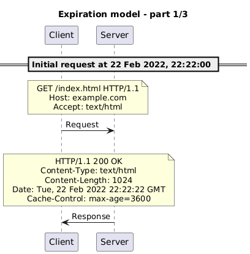
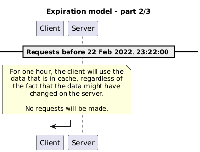
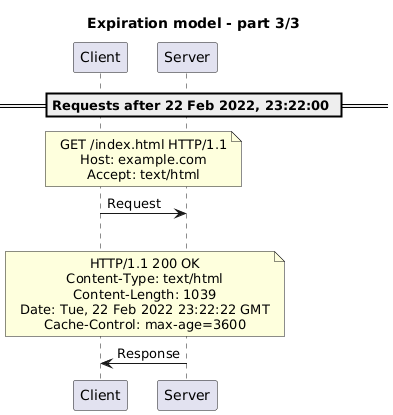
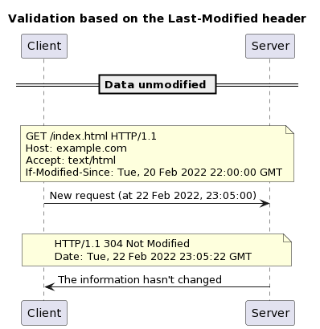
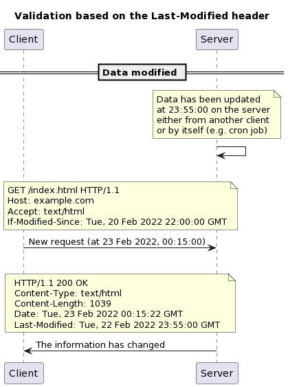
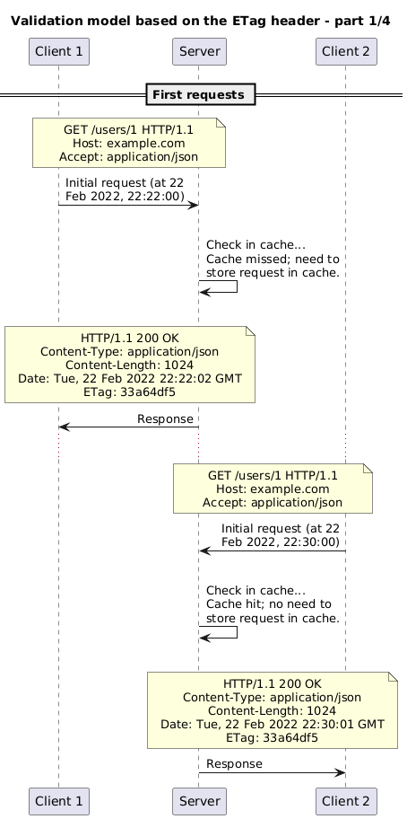
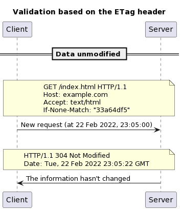
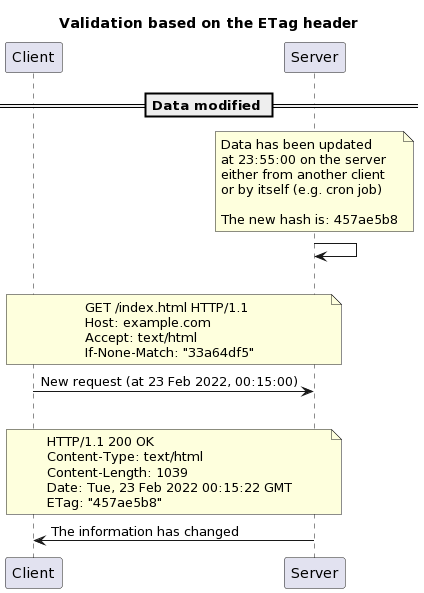
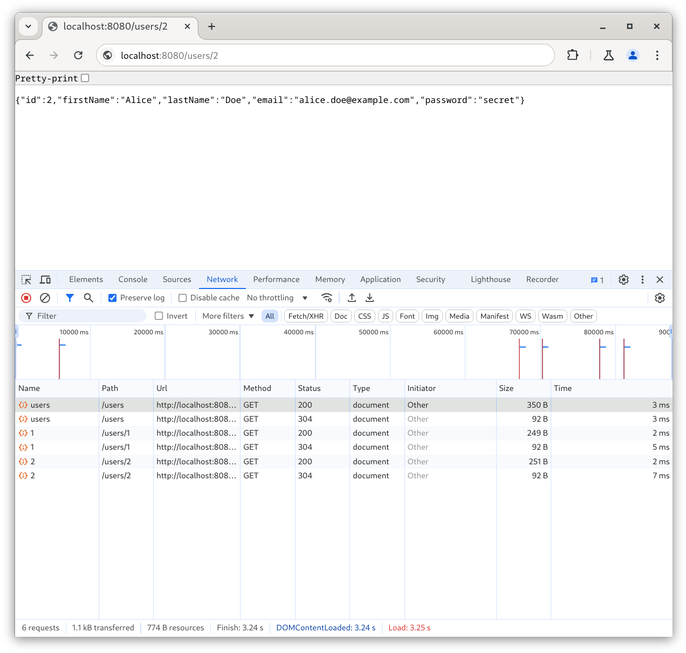

<!--
theme: gaia
size: 16:9
paginate: true
author: L. Delafontaine and H. Louis, with the help of GitHub Copilot
title: HEIG-VD DAI Course - Caching and performance
description: Caching and performance for the DAI course at HEIG-VD, Switzerland
url: https://heig-vd-dai-course.github.io/heig-vd-dai-course/23-caching-and-performance/
footer: '**HEIG-VD** - DAI Course 2024-2025 - CC BY-SA 4.0'
style: |
    :root {
        --color-background: #fff;
        --color-foreground: #333;
        --color-highlight: #f96;
        --color-dimmed: #888;
        --color-headings: #7d8ca3;
    }
    blockquote {
        font-style: italic;
    }
    table {
        width: 100%;
    }
    th:first-child {
        width: 15%;
    }
    h1, h2, h3, h4, h5, h6 {
        color: var(--color-headings);
    }
    h2, h3, h4, h5, h6 {
        font-size: 1.5rem;
    }
    h1 a:link, h2 a:link, h3 a:link, h4 a:link, h5 a:link, h6 a:link {
        text-decoration: none;
    }
    section:not([class=lead]) > p, blockquote {
        text-align: justify;
    }
headingDivider: 4
-->

[web]:
  https://heig-vd-dai-course.github.io/heig-vd-dai-course/23-caching-and-performance/
[pdf]:
  https://heig-vd-dai-course.github.io/heig-vd-dai-course/23-caching-and-performance/23-caching-and-performance-presentation.pdf
[license]:
  https://github.com/heig-vd-dai-course/heig-vd-dai-course/blob/main/LICENSE.md
[discussions]: https://github.com/orgs/heig-vd-dai-course/discussions/511
[illustration]:
  https://images.unsplash.com/photo-1492515114975-b062d1a270ae?fit=crop&h=720
[course-material]:
  https://github.com/heig-vd-dai-course/heig-vd-dai-course/blob/main/23-caching-and-performance/COURSE_MATERIAL.md
[course-material-qr-code]:
  https://quickchart.io/qr?format=png&ecLevel=Q&size=400&margin=1&text=https://github.com/heig-vd-dai-course/heig-vd-dai-course/blob/main/23-caching-and-performance/COURSE_MATERIAL.md

# Caching and performance

<!--
_class: lead
_paginate: false
-->

<https://github.com/heig-vd-dai-course>

[Web][web] · [PDF][pdf]

<small>L. Delafontaine and H. Louis, with the help of GitHub Copilot.</small>

<small>Based on the original course by O. Liechti and J. Ehrensberger.</small>

<small>This work is licensed under the [CC BY-SA 4.0][license] license.</small>

![bg opacity:0.1][illustration]

## Objectives

- Understand the concepts of Caching and performance
- Understand how HTTP features can help to build Caching and performance
- Understand the concepts of a reverse proxy
- Understand the concepts of load balancing
- Understand the concepts of caching

## Caching

<!-- _class: lead -->

More details for this section in the [course material][course-material]. You can
find other resources and alternatives as well.

### Caching

Process of **storing a copy of a resource to serve it faster**.

Caching can **improve the performance** of a system and **reduce the load** on
the backend.

Caching can be done on the **client-side** or **server-side**.

### Managing cache with HTTP

Managing chache is challenging because it is difficult to know when to
invalidate the cache (the data can be stale).

Two main caching models:

- **Expiration model**: the cache is valid for a certain amount of time
- **Validation model**: the cache is valid until the data is modified

#### Expiration model

- The cache is valid for a certain amount of time
- If the cache is not expired, the cache is used
- Uses the `Cache-Control: max-age=<secondes>` header
- The cache is invalidated after the expiration time

---

---

---

#### Validation model

- The cache is valid until the data is modified
- If the cache is not expired, the cache is used
- Two ways to validate the cache:
  - **Last-Modified**: `Last-Modified` and `If-Modified-Since` headers
  - **ETag**: `ETag` and `If-None-Match` headers

---

---

---

---

---

---

### CDN

Content Delivery Network (CDN) is a network of servers that are geographically
distributed around the world.

Improve performance by serving static content (images, videos, etc.) from the
closest server.

### Where to cache?

The best would be to cache at each level of the system to ensure the best
performance but it is not always possible or faisable:

- **Client-side**: the cache is stored on the client
- **Server-side**: the cache is stored on the server
- **CDN**: the cache is stored on a CDN

Private caches are caches that are only used by one client. Public caches are
caches that are used by multiple clients.

---

## Questions

<!-- _class: lead -->

Do you have any questions?

## Practical content

<!-- _class: lead -->

### What will you do?

- Set up a reverse proxy
- Set up whoami
- Explore the features of the reverse proxy:
  - `PathPrefix` rule
  - `Host` rule
  - `StripPrefix` middleware
  - Sticky sessions

### Find the practical content

<!-- _class: lead -->

You can find the practical content for this chapter on
[GitHub][course-material].

![bg right w:75%][course-material-qr-code]

## Finished? Was it easy? Was it hard?

Can you let us know what was easy and what was difficult for you during this
chapter?

This will help us to improve the course and adapt the content to your needs. If
we notice some difficulties, we will come back to you to help you.

➡️ [GitHub Discussions][discussions]

You can use reactions to express your opinion on a comment!

## What will you do next?

<!-- _class: lead -->

You will start the practical work!

## Sources

- Main illustration by [Nicolas Picard](https://unsplash.com/@artnok) on
  [Unsplash](https://unsplash.com/photos/-lp8sTmF9HA)
- Illustration by [Aline de Nadai](https://unsplash.com/@alinedenadai) on
  [Unsplash](https://unsplash.com/photos/j6brni7fpvs)
- Illustration by [Mohammadreza alidoos](https://unsplash.com/@mralidoost) on
  [Unsplash](https://unsplash.com/photos/black-and-silver-laptop-computer-0rUp9vgyEYo)
- Illustration by [Gaurav Dhwaj Khadka](https://unsplash.com/@gauravdhwajkhadka)
  on
  [Unsplash](https://unsplash.com/photos/brown-wooden-table-near-window-eRQ5Pk59p9s)
- Illustration by [Imre Tömösvári](https://unsplash.com/@timester12) on
  [Unsplash](https://unsplash.com/photos/gray-suv-on-road-during-daytime-FbhuN53_330)
- Illustration by [Kelvin T](https://unsplash.com/@gogofoto) on
  [Unsplash](https://unsplash.com/photos/blue-weighing-scale-at-0-FE_uysP-cfw)
- Illustration by [Alfred Kenneally](https://unsplash.com/@alken) on
  [Unsplash](https://unsplash.com/photos/black-beetle-on-green-grass-during-daytime-VrsNMCejQEw)
- Illustration by [Mikhail Vasilyev](https://unsplash.com/@miklevasilyev) on
  [Unsplash](https://unsplash.com/photos/colony-of-fire-ant-Vf1JrKMUS0Q)

---

- Illustration by [Ibrahim Boran](https://unsplash.com/@ibrahimboran) on
  [Unsplash](https://unsplash.com/photos/black-flat-screen-tv-turned-on-near-black-and-gray-audio-component-iYkqHp5cGQ4)
- Illustration by [Elena Mozhvilo](https://unsplash.com/@miracleday) on
  [Unsplash](https://unsplash.com/photos/person-sitting-on-chair-in-front-of-table-with-food-slaDjF7-HHQ)
- Illustration by [Evan Krause](https://unsplash.com/@evankrause_) on
  [Unsplash](https://unsplash.com/photos/assorted-box-lot-pdFMl6enmeo)
- Illustration by [Markus Spiske](https://unsplash.com/@markusspiske) on
  [Unsplash](https://unsplash.com/photos/a-toy-tractor-and-rocks-CBtiTnW_6Kk)
- Illustration by [Fermin Rodriguez Penelas](https://unsplash.com/@ferminrp) on
  [Unsplash](https://unsplash.com/photos/silhouette-of-mountain-near-body-of-water-during-daytime-6CQe-WYoPPk)
- Illustration by [Andrik Langfield](https://unsplash.com/@andriklangfield) on
  [Unsplash](https://unsplash.com/photos/pocket-watch-at-355-0rTCXZM7Xfo)
- Illustration by [Karen Grigorean](https://unsplash.com/@karengrigorean) on
  [Unsplash](https://unsplash.com/photos/a-person-pointing-at-a-large-display-of-pictures-9D6UlCW38Ss)
- Illustration by [Shubham's Web3](https://unsplash.com/@shubzweb3) on
  [Unsplash](https://unsplash.com/photos/an-abstract-background-of-orange-and-white-cubes-km9umcj61Ow)
